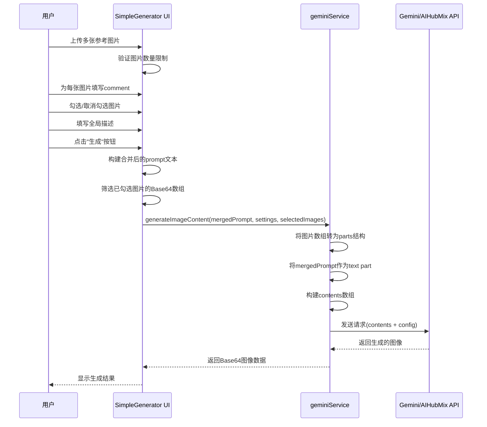

# 简单生成器多图参考与融合修改功能设计

## 一、功能概述

在简单生成器(SimpleGenerator)中扩展图像参考能力,支持上传多张参考图片,为每张图片添加独立的参考意见,并基于多图融合进行AI图像生成与修改。

### 核心目标

- 支持多张参考图片上传,数量根据所选模型能力动态限制
- 为每张参考图片提供独立的文本输入框以编写参考意见
- 用户可选择哪些图片参与融合生成
- 将全局描述与每张图片的独立意见合并发送至AI模型

## 二、需求分析

### 2.1 功能性需求

| 需求编号 | 需求描述 | 优先级 |
|---------|---------|--------|
| FR-001 | 支持上传多张参考图片 | 高 |
| FR-002 | 根据选定模型的能力动态限制上传图片数量 | 高 |
| FR-003 | 每张图片下方提供独立的意见输入框 | 高 |
| FR-004 | 用户可勾选/取消勾选参与融合的图片 | 中 |
| FR-005 | 保留全局描述框,与各图片意见一起发送至AI | 高 |
| FR-006 | 支持删除已上传的单张参考图片 | 中 |
| FR-007 | 图片预览缩略图显示 | 中 |
| FR-008 | 保持现有UI布局风格与交互逻辑一致性 | 高 |

### 2.2 非功能性需求

| 需求编号 | 需求描述 | 指标 |
|---------|---------|------|
| NFR-001 | 界面响应性 | 图片上传后即时预览,延迟<200ms |
| NFR-002 | 浏览器兼容性 | 支持Chrome、Edge、Firefox主流浏览器 |
| NFR-003 | 用户体验 | 操作流程直观,减少用户认知负担 |
| NFR-004 | 可扩展性 | 支持未来增加更多模型和参数配置 |
| NFR-005 | 视口适配 | 在1920×1080和4K分辨率下无需垂直滚动 |

## 三、业务逻辑设计

### 3.1 多图上传限制策略

根据模型能力动态确定最大可上传图片数量:

| 模型标识 | 模型名称 | 最大参考图片数 | 限制原因 |
|---------|---------|--------------|---------|
| nano-banana | Nano Banana (Flash Image) | 5张 | 基础模型,参数处理能力有限 |
| nano-banana-pro | Nano Banana Pro (Pro Image) | 10张 | 高级模型,支持更复杂的多图融合 |

**动态限制逻辑:**
- 当用户切换模型时,系统检查当前已上传图片数量
- 若当前图片数超过新模型限制,显示提示信息但不强制删除
- 生成时仅取前N张(N为模型限制数)参与融合,或提示用户手动调整

### 3.2 图片选择与参与机制

每张上传的图片关联以下属性:

| 属性名称 | 数据类型 | 说明 |
|---------|---------|------|
| id | string | 唯一标识符 |
| src | string | Base64编码的图片数据 |
| comment | string | 用户为该图片填写的参考意见 |
| isSelected | boolean | 是否参与融合生成 |
| uploadTime | number | 上传时间戳,用于排序 |

**选择交互规则:**
- 新上传的图片默认勾选(isSelected = true)
- 用户可通过复选框切换是否参与融合
- 至少需要1张图片被勾选才能与全局描述一起发送
- 未勾选的图片保留在列表中,但不参与本次生成

### 3.3 Prompt构建策略

将全局描述与各图片意见合并为AI可理解的prompt结构:

**构建规则:**

1. **全局描述部分:** 来自原有的全局描述输入框
2. **图片参考部分:** 按上传顺序遍历已勾选图片,为每张图片构建子prompt

**Prompt模板结构:**

```
全局描述: {用户输入的全局描述文本}

参考图片1的说明: {图片1的comment}
参考图片2的说明: {图片2的comment}
...
参考图片N的说明: {图片N的comment}
```

**示例场景:**

假设用户全局描述为"生成一个科幻风格的城市景观",并上传了3张图片:
- 图片1勾选,comment: "参考这张图的色调和光影效果"
- 图片2勾选,comment: "借鉴建筑物的未来感设计"
- 图片3未勾选,comment: "..."

最终发送的文本prompt为:
```
生成一个科幻风格的城市景观

参考图片1的说明: 参考这张图的色调和光影效果
参考图片2的说明: 借鉴建筑物的未来感设计
```

同时,将图片1和图片2的Base64数据作为inlineData数组发送。

### 3.4 API调用流程



## 四、数据模型设计

### 4.1 参考图片数据结构

```typescript
interface ReferenceImage {
  id: string;              // 唯一标识,使用UUID或时间戳
  src: string;             // Base64编码的图片数据(含data:image/...前缀)
  comment: string;         // 用户为该图片填写的参考意见
  isSelected: boolean;     // 是否参与本次融合生成
  uploadTime: number;      // 上传时间戳,毫秒级
}
```

### 4.2 组件状态扩展

SimpleGenerator组件需新增以下状态管理:

| 状态名称 | 类型 | 初始值 | 说明 |
|---------|------|--------|------|
| referenceImages | ReferenceImage[] | [] | 存储所有已上传的参考图片 |
| maxImageCount | number | 根据模型计算 | 当前模型允许的最大图片数 |

原有状态保持不变:
- `prompt`: 全局描述文本
- `generatedImage`: 生成结果
- `loading`: 加载状态
- `error`: 错误信息

### 4.3 模型能力配置扩展

在 `constants.ts` 中新增模型能力映射:

| 配置项 | 数据结构 | 用途 |
|--------|---------|------|
| MODEL_IMAGE_LIMITS | Record<ModelId, number> | 定义每个模型支持的最大参考图片数 |

示例结构:
```typescript
{
  'nano-banana': 5,
  'nano-banana-pro': 10
}
```

## 五、界面交互设计

### 5.1 布局调整方案

**当前布局:** 
- 左侧输入区(flex-1):全局描述框 + 单张参考图上传区 + 生成按钮
- 右侧输出区(flex-1):生成结果展示

**调整后布局:**
- 左侧输入区保持flex-1,垂直滚动
- 单张参考图上传区改为多图列表区域
- 右侧输出区保持不变

### 5.2 多图上传区UI结构

**区域组成:**

1. **标题行**
   - 显示文本: "参考图像(可选)"
   - 显示已上传数量/最大限制: "已上传: 3/5"

2. **上传按钮**
   - 当未达到最大限制时显示"+ 添加参考图片"按钮
   - 达到限制时按钮禁用,显示提示"已达到当前模型上传限制"

3. **图片卡片列表**
   - 每张图片为一个卡片,垂直排列
   - 卡片内包含:
     - 勾选框(左上角)
     - 缩略图预览(左侧,固定宽高如120×120px)
     - 删除按钮(右上角,悬浮显示"×")
     - 意见输入框(右侧,多行文本框,placeholder: "描述如何参考这张图片...")

### 5.3 交互细节说明

| 交互场景 | 行为描述 |
|---------|---------|
| 点击"+ 添加参考图片" | 触发文件选择对话框,支持多选(multiple属性) |
| 选择文件后 | 批量上传,逐个读取为Base64并添加到referenceImages数组 |
| 勾选/取消勾选图片 | 切换对应ReferenceImage的isSelected属性 |
| 删除图片 | 从referenceImages数组移除对应项,更新计数 |
| 填写comment | 实时更新对应ReferenceImage的comment属性 |
| 模型切换 | 重新计算maxImageCount,若超限显示警告提示 |
| 点击生成按钮 | 验证是否至少有1张勾选图片或全局描述非空 |

### 5.4 响应式设计考虑

- 在小屏设备(如<768px)时,图片卡片布局调整为单列
- 缩略图和意见输入框改为上下堆叠而非左右排列
- 确保在1920×1080和4K分辨率下,左侧输入区可完整展示3-4张图片卡片而无需滚动

## 六、技术实现要点

### 6.1 文件上传处理

**单次上传多个文件:**
- `<input type="file" multiple />` 支持多选
- 遍历 `FileList`,为每个文件创建 `FileReader` 实例
- 异步读取每个文件为Base64,转换完成后添加到状态数组

**文件验证规则:**
- 支持的MIME类型: `image/png`, `image/jpeg`, `image/webp`
- 单个文件大小限制: 建议10MB以内(前端校验)
- 若文件不符合要求,跳过并显示错误提示

### 6.2 Prompt合并逻辑

**伪代码描述:**

```
function buildMergedPrompt(globalPrompt, referenceImages):
    parts = []
    
    // 添加全局描述
    if globalPrompt is not empty:
        parts.push(globalPrompt)
    
    // 添加每张勾选图片的意见
    selectedImages = filter referenceImages where isSelected == true
    for each (image, index) in selectedImages:
        if image.comment is not empty:
            parts.push("参考图片${index+1}的说明: ${image.comment}")
    
    return parts.join("\n\n")
```

### 6.3 API调用适配

**现有geminiService接口签名:**
```typescript
generateImageContent(
  prompt: string,
  settings: AppSettings,
  imageInput?: string | string[]
): Promise<string>
```

**调用方式调整:**
- `prompt`: 传入合并后的文本(globalPrompt + 各图片comment)
- `imageInput`: 传入已勾选图片的src数组(string[])
- `settings`: 保持不变

**服务层处理逻辑保持不变:**
- geminiService已支持 `string[]` 类型的imageInput
- 内部会遍历数组,为每张图片构建inlineData part
- 最终将所有图片parts与文本prompt组合发送

### 6.4 状态管理策略

**状态更新操作:**

| 操作类型 | 状态更新逻辑 |
|---------|------------|
| 添加图片 | `setReferenceImages([...referenceImages, newImage])` |
| 删除图片 | `setReferenceImages(referenceImages.filter(img => img.id !== targetId))` |
| 更新comment | `setReferenceImages(referenceImages.map(img => img.id === targetId ? {...img, comment: newComment} : img))` |
| 切换选中状态 | `setReferenceImages(referenceImages.map(img => img.id === targetId ? {...img, isSelected: !img.isSelected} : img))` |

**性能优化考虑:**
- 若图片数量较多,考虑使用 `useCallback` 缓存事件处理函数
- 使用 `useMemo` 计算已勾选图片数组,避免重复过滤
- 图片预览使用CSS限制尺寸,避免加载大图导致性能问题

## 七、边界条件与异常处理

### 7.1 边界场景处理

| 场景 | 处理策略 |
|------|---------|
| 未上传任何图片 | 允许仅使用全局描述生成(回退到原有单文本生成逻辑) |
| 仅上传图片但无全局描述 | 允许生成,prompt仅包含各图片comment |
| 上传图片但全部未勾选 | 显示警告提示"请至少选择一张参考图片或填写描述",禁用生成按钮 |
| 图片数量超过模型限制 | 上传时禁用"添加"按钮,生成时仅取前N张已勾选图片 |
| 某些图片comment为空 | 允许,仅为有comment的图片添加说明文本 |
| 模型切换导致超限 | 显示提示信息"当前模型最多支持X张图片,请删除多余图片或取消勾选",不强制删除 |

### 7.2 错误提示设计

| 错误类型 | 提示信息 | 显示位置 |
|---------|---------|---------|
| 文件格式不支持 | "仅支持PNG、JPG、WEBP格式图片" | 图片上传区域下方 |
| 文件过大 | "图片大小不能超过10MB" | 图片上传区域下方 |
| 达到数量限制 | "已达到当前模型上传限制(X张)" | 上传按钮禁用提示 |
| 无有效输入 | "请至少填写描述或选择一张参考图片" | 生成按钮下方 |
| API调用失败 | 继承现有错误处理机制,显示具体错误信息 | 生成按钮下方错误区 |

### 7.3 数据验证规则

**前端验证清单:**

- [ ] 图片数量 ≤ maxImageCount
- [ ] 每个文件MIME类型在允许列表中
- [ ] 每个文件大小 ≤ 10MB
- [ ] 至少有1张勾选图片 OR 全局描述非空
- [ ] 所有勾选图片src格式正确(Base64)

## 八、向后兼容性

### 8.1 现有功能保持

- 全局描述框保持原有位置和功能
- 分辨率和宽高比选择器不变
- 生成按钮交互逻辑保持一致
- 错误处理机制复用现有实现

### 8.2 API接口兼容

- geminiService的generateImageContent已支持 `string[]` 类型图片输入
- 仅需调整调用侧传参,服务层无需改动
- 保持对Google Gemini和AIHubMix两种Provider的支持

### 8.3 用户数据迁移

- 本次功能为纯新增,无历史数据需要迁移
- localStorage中的settings结构保持不变
- 新增的referenceImages状态为临时状态,不持久化

## 九、测试验证要点

### 9.1 功能测试用例

| 用例编号 | 测试场景 | 预期结果 |
|---------|---------|---------|
| TC-001 | 上传1张图片,填写comment,勾选,点击生成 | 成功生成,API收到1张图片+合并prompt |
| TC-002 | 上传5张图片(nano-banana),全部勾选 | 成功上传,生成时发送5张图片 |
| TC-003 | 上传6张图片(nano-banana) | 第6张上传时显示限制提示 |
| TC-004 | 上传3张图片,仅勾选2张 | 仅发送2张勾选图片至API |
| TC-005 | 上传图片后删除 | 图片从列表移除,计数更新 |
| TC-006 | 切换模型从Pro到Banana(已有8张图片) | 显示超限提示,不强制删除 |
| TC-007 | 仅填写全局描述,不上传图片 | 正常生成,回退到纯文本生成 |
| TC-008 | 上传图片但全部取消勾选 | 生成按钮禁用或显示警告 |
| TC-009 | 上传非图片文件 | 显示格式错误提示,不添加到列表 |
| TC-010 | 上传超大文件(>10MB) | 显示文件过大提示,不添加到列表 |

### 9.2 兼容性测试

- 在Chrome、Edge、Firefox浏览器中验证多文件上传功能
- 在1920×1080和3840×2160(4K)分辨率下验证界面布局
- 在响应式断点(768px、1024px)下验证移动端布局

### 9.3 性能测试

- 上传10张图片(每张约5MB)的总耗时应<5秒
- 快速切换勾选状态时UI不应卡顿
- 生成按钮点击后立即显示加载状态

## 十、实现优先级建议

### 阶段一:核心功能(高优先级)

1. 扩展数据模型,定义ReferenceImage接口
2. 实现多图上传UI组件和状态管理
3. 实现每张图片的comment输入框
4. 实现勾选/取消勾选机制
5. 实现prompt合并逻辑
6. 调整API调用,传递图片数组和合并prompt

### 阶段二:增强体验(中优先级)

7. 实现图片数量限制和动态校验
8. 添加文件格式和大小验证
9. 实现删除单张图片功能
10. 优化图片卡片布局和缩略图显示
11. 添加各类错误提示和边界处理

### 阶段三:优化完善(低优先级)

12. 优化响应式布局适配
13. 添加图片上传进度指示
14. 支持图片拖拽排序(可选)
15. 支持图片预览放大(可选)

## 十一、风险评估

| 风险项 | 影响程度 | 应对策略 |
|-------|---------|---------|
| 模型API不支持超过一定数量图片 | 高 | 通过MODEL_IMAGE_LIMITS严格控制,并在文档中说明各模型限制 |
| Base64编码图片过多导致请求体过大 | 中 | 前端限制单图大小,必要时实现图片压缩 |
| 用户体验:UI区域过于拥挤 | 中 | 设计合理的滚动区域,优化图片卡片布局 |
| 浏览器兼容性问题(FileReader) | 低 | FileReader为标准API,主流浏览器均支持 |
| 状态管理复杂度增加 | 低 | 保持状态结构清晰,必要时考虑引入状态管理库 |

---

**设计完成标志:**
- [ ] 所有数据结构定义清晰
- [ ] 业务流程图完整
- [ ] 交互细节明确
- [ ] 技术方案可行
- [ ] 测试用例覆盖主要场景
