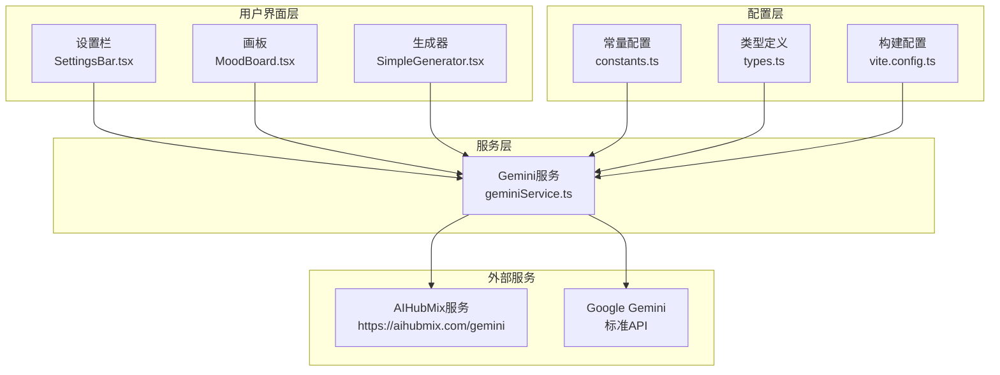
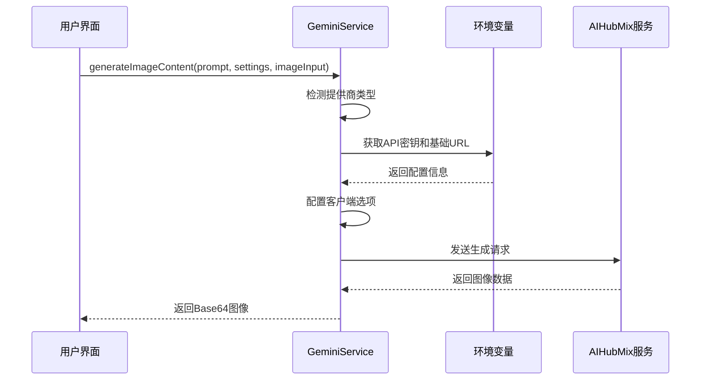
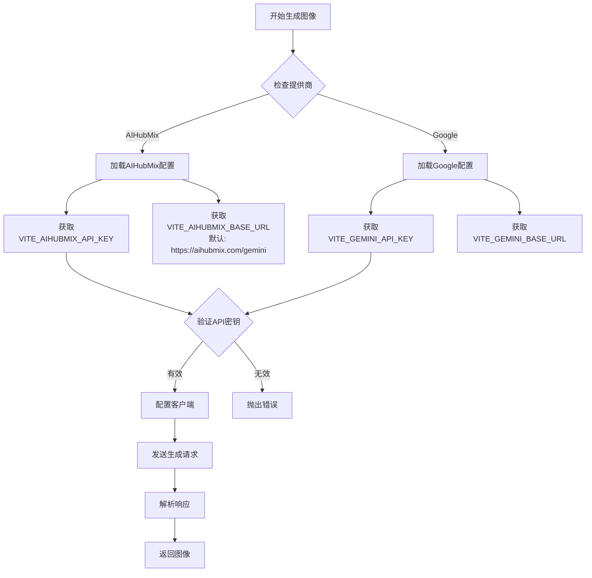
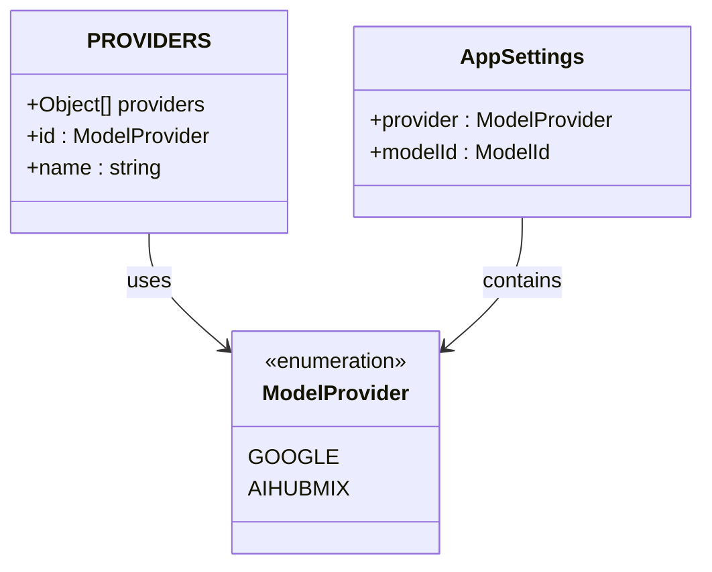
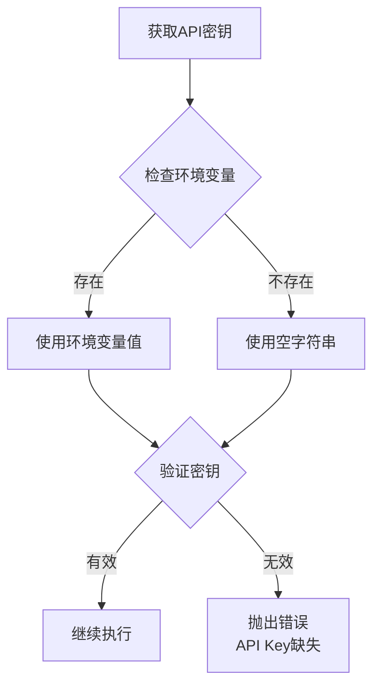
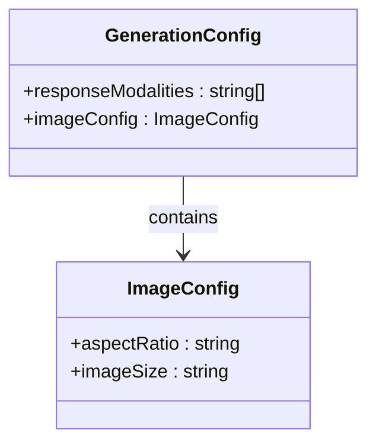
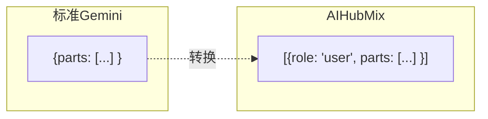
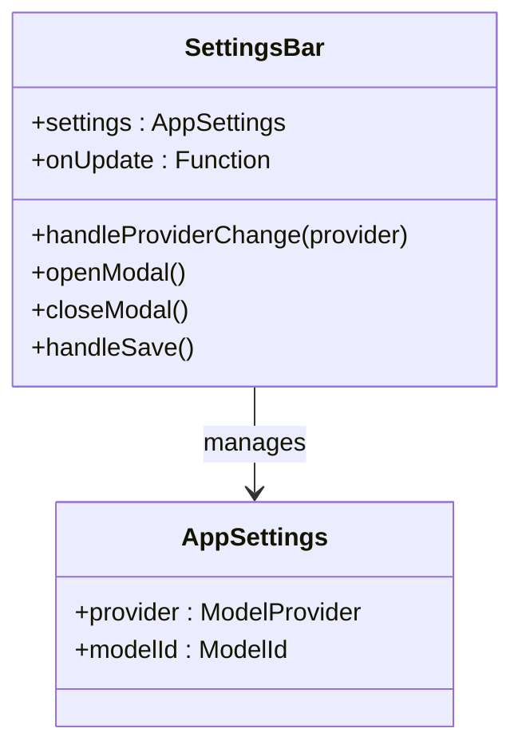
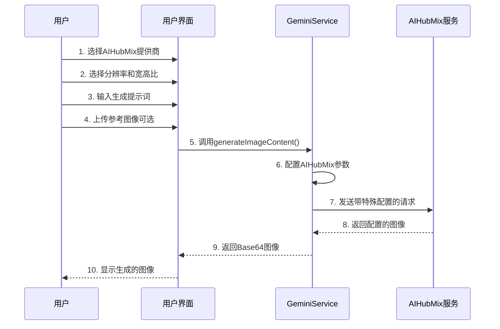
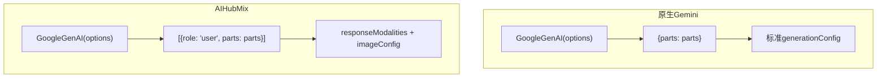

# AIHubMix集成详细文档

<cite>
**本文档中引用的文件**
- [geminiService.ts](file://services/geminiService.ts) - *更新了AIHubMix特有配置*
- [constants.ts](file://constants.ts) - *新增分辨率和宽高比配置*
- [types.ts](file://types.ts) - *定义了ImageSize和AspectRatio类型*
- [SettingsBar.tsx](file://components/SettingsBar.tsx)
- [MoodBoard.tsx](file://components/MoodBoard.tsx) - *更新了UI实现*
- [SimpleGenerator.tsx](file://components/SimpleGenerator.tsx) - *更新了UI实现*
- [vite.config.ts](file://vite.config.ts)
- [package.json](file://package.json)
- [README.md](file://README.md)
</cite>

## 更新摘要
**变更内容**
- 新增分辨率和宽高比配置支持
- 更新图像生成配置详解章节
- 添加SimpleGenerator和MoodBoard组件的UI实现说明
- 更新使用示例以反映新功能
- 增强提供商配置系统说明

## 目录
1. [简介](#简介)
2. [项目架构概览](#项目架构概览)
3. [AIHubMix集成核心实现](#aihubmix集成核心实现)
4. [提供商配置系统](#提供商配置系统)
5. [API密钥管理机制](#api密钥管理机制)
6. [图像生成配置详解](#图像生成配置详解)
7. [用户界面集成](#用户界面集成)
8. [使用示例](#使用示例)
9. [与原生Gemini的区别](#与原生gemini的区别)
10. [扩展开发指南](#扩展开发指南)
11. [故障排除](#故障排除)

## 简介

AIHubMix集成是BananaCanvase项目中的一个重要功能模块，它允许用户通过Gemini兼容接口使用AIHubMix服务进行图像生成。该集成通过修改标准的Gemini API调用来适配AIHubMix的特定要求，同时保持了良好的可扩展性和配置灵活性。

## 项目架构概览

BananaCanvase采用现代化的React前端架构，主要包含以下核心组件：



**图表来源**
- [SettingsBar.tsx](file://components/SettingsBar.tsx#L1-L132)
- [MoodBoard.tsx](file://components/MoodBoard.tsx#L1-L770)
- [geminiService.ts](file://services/geminiService.ts#L1-L112)

**章节来源**
- [constants.ts](file://constants.ts#L1-L18)
- [types.ts](file://types.ts#L1-L56)
- [geminiService.ts](file://services/geminiService.ts#L1-L112)

## AIHubMix集成核心实现

### 基础服务架构

AIHubMix集成的核心实现在`geminiService.ts`文件中，该文件提供了统一的图像生成接口，支持多个提供商的切换。



**图表来源**
- [geminiService.ts](file://services/geminiService.ts#L5-L112)

### 提供商检测逻辑

服务通过检查`AppSettings`中的`provider`字段来确定使用哪个提供商：



**图表来源**
- [geminiService.ts](file://services/geminiService.ts#L11-L25)

**章节来源**
- [geminiService.ts](file://services/geminiService.ts#L5-L112)

## 提供商配置系统

### 枚举定义

系统通过`ModelProvider`枚举定义了可用的提供商：

| 提供商 | 枚举值 | 描述 |
|--------|--------|------|
| Google | `GOOGLE` | 标准Google Gemini API |
| AIHubMix | `AIHUBMIX` | AIHubMix兼容接口 |

### 常量配置

`PROVIDERS`数组定义了所有可用的提供商及其显示名称：



**图表来源**
- [constants.ts](file://constants.ts#L3-L6)
- [types.ts](file://types.ts#L2-L5)

**章节来源**
- [constants.ts](file://constants.ts#L1-L18)
- [types.ts](file://types.ts#L1-L56)

## API密钥管理机制

### 环境变量配置

系统支持两种级别的API密钥配置：

1. **环境变量级别**：通过`.env`文件配置
2. **回退机制**：当环境变量为空时自动回退



**图表来源**
- [geminiService.ts](file://services/geminiService.ts#L15-L20)

### 密钥优先级逻辑

系统实现了智能的密钥优先级机制：

| 场景 | 优先级 | 回退策略 |
|------|--------|----------|
| AIHubMix提供商 | `VITE_AIHUBMIX_API_KEY` | 使用空字符串 |
| Google提供商 | `VITE_GEMINI_API_KEY` | 使用空字符串 |
| 环境变量缺失 | 自动回退 | 抛出配置错误 |

**章节来源**
- [geminiService.ts](file://services/geminiService.ts#L11-L25)

## 图像生成配置详解

### AIHubMix特有配置

AIHubMix集成为图像生成提供了独特的配置选项：



**图表来源**
- [geminiService.ts](file://services/geminiService.ts#L62-L71)

### 配置参数详解

| 参数 | 类型 | 默认值 | 描述 | 影响效果 |
|------|------|--------|------|----------|
| `responseModalities` | `Array<string>` | `['TEXT', 'IMAGE']` | 响应模态类型 | 同时返回文本和图像 |
| `imageConfig.aspectRatio` | `string` | `"1:1"` | 图像宽高比 | 控制生成图像的形状 |
| `imageConfig.imageSize` | `string` | `"1K"` | 图像尺寸 | 控制生成图像的分辨率 |

#### 分辨率配置 (imageSize)

AIHubMix支持三种分辨率选项：

- **1K**: 1024×1024 像素，适用于快速预览和草图生成
- **2K**: 2048×2048 像素，平衡质量和性能的中等分辨率
- **4K**: 4096×4096 像素，高质量输出，适合最终作品

**模型支持情况**：
- `Nano Banana` 模型仅支持 1K 分辨率
- `Nano Banana Pro` 模型支持 1K、2K 和 4K 分辨率

#### 宽高比配置 (aspectRatio)

AIHubMix支持五种宽高比选项：

- **1:1 (正方形)**: 适合头像、图标等对称构图
- **3:4 (竖版)**: 适合人像、肖像等垂直构图
- **4:3 (横版)**: 适合风景、产品展示等水平构图
- **9:16 (手机竖屏)**: 适合手机壁纸、社交媒体内容
- **16:9 (宽屏)**: 适合桌面壁纸、横幅广告等宽幅内容

**章节来源**
- [types.ts](file://types.ts#L35-L36)
- [constants.ts](file://constants.ts#L13-L17)
- [constants.ts](file://constants.ts#L30-L36)

### 内容格式差异

AIHubMix与标准Gemini API在内容格式上存在差异：



**图表来源**
- [geminiService.ts](file://services/geminiService.ts#L74-L76)

**章节来源**
- [geminiService.ts](file://services/geminiService.ts#L62-L77)

## 用户界面集成

### 设置栏组件

`SettingsBar`组件提供了直观的提供商选择界面：



**图表来源**
- [SettingsBar.tsx](file://components/SettingsBar.tsx#L11-L132)

### 提供商选择界面

用户可以通过按钮组轻松切换提供商：

| 按钮状态 | 样式 | 功能 |
|----------|------|------|
| 当前选中 | 蓝色背景 + 边框 | 显示当前选择 |
| 可选状态 | 灰色背景 + 悬停效果 | 切换到该提供商 |

### 分辨率和宽高比UI实现

在`SimpleGenerator`和`MoodBoard`组件中，新增了分辨率和宽高比的选择控件：

```typescript
// SimpleGenerator.tsx 中的分辨率选择
<div>
  <label className="block text-sm font-medium text-slate-400 mb-2">分辨率</label>
  <select
    className="w-full bg-dark-bg border border-dark-border rounded-lg px-3 py-2 text-sm text-slate-200 focus:outline-none focus:border-banana-500 transition-colors"
    value={settings.imageSize}
    onChange={(e) => onUpdateSettings?.({ imageSize: e.target.value as ImageSize })}
    disabled={availableImageSizes.length === 1}
  >
    {availableImageSizes.map((size) => (
      <option key={size.id} value={size.id}>{size.name}</option>
    ))}
  </select>
  {availableImageSizes.length === 1 && (
    <p className="text-xs text-slate-500 mt-1">当前模型仅支持 1K 分辨率</p>
  )}
</div>

// SimpleGenerator.tsx 中的宽高比选择
<div>
  <label className="block text-sm font-medium text-slate-400 mb-2">宽高比</label>
  <select
    className="w-full bg-dark-bg border border-dark-border rounded-lg px-3 py-2 text-sm text-slate-200 focus:outline-none focus:border-banana-500 transition-colors"
    value={settings.aspectRatio}
    onChange={(e) => onUpdateSettings?.({ aspectRatio: e.target.value as AspectRatio })}
  >
    {ASPECT_RATIOS.map((ratio) => (
      <option key={ratio.id} value={ratio.id}>{ratio.name}</option>
    ))}
  </select>
</div>
```

**动态分辨率支持**：
- 当选择`Nano Banana`模型时，分辨率选择器自动禁用并显示提示"当前模型仅支持 1K 分辨率"
- 当选择`Nano Banana Pro`模型时，分辨率选择器启用，允许选择1K、2K或4K

**章节来源**
- [SimpleGenerator.tsx](file://components/SimpleGenerator.tsx#L85-L114)
- [MoodBoard.tsx](file://components/MoodBoard.tsx#L641-L668)

## 使用示例

### 基本使用流程

以下是使用AIHubMix进行图像生成的完整流程：



**图表来源**
- [MoodBoard.tsx](file://components/MoodBoard.tsx#L500-L512)
- [geminiService.ts](file://services/geminiService.ts#L5-L112)

### 实际调用示例

在`MoodBoard`组件中，AIHubMix的调用方式如下：

```typescript
// 从画布获取源图像
const sourceImageBase64 = await getCanvasContentAsBase64({ mode: 'source' });
const inputs = [sourceImageBase64];

// 如果有标注，则添加掩码图像
if (hasAnnotations) {
    const maskImageBase64 = await getCanvasContentAsBase64({ mode: 'mask' });
    inputs.push(maskImageBase64);
}

// 调用AIHubMix生成图像，包含分辨率和宽高比配置
const resultBase64 = await generateImageContent(finalPrompt, settings, inputs);
setGeneratedImages(prev => [resultBase64, ...prev]);
```

### 错误处理机制

系统实现了完善的错误处理：

| 错误类型 | 处理方式 | 用户反馈 |
|----------|----------|----------|
| API密钥缺失 | 抛出配置错误 | 提示配置API密钥 |
| 权限拒绝(403) | 特殊处理 | 提示选择有效API密钥 |
| 生成失败 | 通用错误处理 | 显示具体错误信息 |

**章节来源**
- [MoodBoard.tsx](file://components/MoodBoard.tsx#L500-L524)
- [geminiService.ts](file://services/geminiService.ts#L104-L111)

## 与原生Gemini的区别

### 主要差异对比

| 方面 | 原生Gemini | AIHubMix |
|------|------------|----------|
| 基础URL | 可配置或默认 | 强制使用 `https://aihubmix.com/gemini` |
| API密钥 | `VITE_GEMINI_API_KEY` | `VITE_AIHUBMIX_API_KEY` |
| 内容格式 | `{parts: [...]}` | `[{role: 'user', parts: [...] }]` |
| 响应模态 | 标准配置 | 强制启用 `TEXT` 和 `IMAGE` |
| 图像配置 | 标准参数 | 特有的 `imageConfig` 参数 |

### 技术实现差异



**图表来源**
- [geminiService.ts](file://services/geminiService.ts#L28-L31)
- [geminiService.ts](file://services/geminiService.ts#L74-L80)

### 兼容性考虑

AIHubMix集成保持了与原生Gemini API的高度兼容性：

- **相同的模型映射**：使用相同的模型名称
- **相似的输入格式**：支持文本和图像输入
- **一致的输出格式**：返回Base64编码的图像数据
- **相同的错误处理**：遵循统一的错误处理模式

**章节来源**
- [geminiService.ts](file://services/geminiService.ts#L11-L25)
- [geminiService.ts](file://services/geminiService.ts#L62-L80)

## 扩展开发指南

### 添加新的Gemini兼容服务

要为新的Gemini兼容服务添加支持，需要修改以下几个文件：

#### 1. 更新类型定义

在`types.ts`中添加新的提供商：

```typescript
export enum ModelProvider {
  GOOGLE = 'Google',
  AIHUBMIX = 'AIHubMix',
  NEW_SERVICE = 'NewService'  // 新增提供商
}
```

#### 2. 更新常量配置

在`constants.ts`中添加新服务的配置：

```typescript
export const PROVIDERS = [
  { id: ModelProvider.GOOGLE, name: 'Google' },
  { id: ModelProvider.AIHUBMIX, name: 'AIHubMix' },
  { id: ModelProvider.NEW_SERVICE, name: 'New Service' }  // 新增服务
];
```

#### 3. 修改服务实现

在`geminiService.ts`中添加新服务的配置逻辑：

```typescript
if (settings.provider === ModelProvider.NEW_SERVICE) {
  apiKey = (import.meta as any).env.VITE_NEW_SERVICE_API_KEY || '';
  baseUrl = (import.meta as any).env.VITE_NEW_SERVICE_BASE_URL || 'https://api.newservice.com/gemini';
  
  // 新服务特有的配置
  generationConfig.customParam = 'customValue';
}
```

### 最佳实践建议

#### 配置管理
- 使用环境变量进行敏感信息管理
- 提供合理的默认值
- 实现优雅的回退机制

#### 错误处理
- 区分不同类型的错误
- 提供用户友好的错误消息
- 记录详细的错误日志

#### 性能优化
- 缓存频繁使用的配置
- 实现请求去重机制
- 优化网络请求参数

**章节来源**
- [types.ts](file://types.ts#L2-L5)
- [constants.ts](file://constants.ts#L3-L6)
- [geminiService.ts](file://services/geminiService.ts#L15-L20)

## 故障排除

### 常见问题及解决方案

#### 1. API密钥配置问题

**症状**：出现"API Key缺失"错误
**原因**：环境变量未正确配置
**解决方案**：
- 检查`.env`文件中的`VITE_AIHUBMIX_API_KEY`
- 确保环境变量名拼写正确
- 重启开发服务器使配置生效

#### 2. 权限拒绝错误

**症状**：出现"Permission Denied (403)"错误
**原因**：API密钥无效或权限不足
**解决方案**：
- 验证API密钥的有效性
- 检查服务提供商的访问权限
- 在设置界面重新配置密钥

#### 3. 图像生成失败

**症状**：生成请求成功但无图像返回
**原因**：模型返回文本而非图像
**解决方案**：
- 检查提示词是否符合要求
- 验证图像输入格式是否正确
- 查看服务端的具体错误信息

#### 4. 网络连接问题

**症状**：请求超时或网络错误
**原因**：网络连接不稳定或服务端不可用
**解决方案**：
- 检查网络连接状态
- 验证服务端URL是否可达
- 查看浏览器开发者工具中的网络请求

### 调试技巧

#### 1. 启用详细日志
```typescript
console.log("AIHubMix Request:", {
  prompt,
  settings,
  baseUrl,
  generationConfig
});
```

#### 2. 检查环境变量
```typescript
console.log("Environment Variables:", {
  VITE_AIHUBMIX_API_KEY: (import.meta as any).env.VITE_AIHUBMIX_API_KEY,
  VITE_AIHUBMIX_BASE_URL: (import.meta as any).env.VITE_AIHUBMIX_BASE_URL
});
```

#### 3. 验证API响应
```typescript
try {
  const response = await ai.models.generateContent({
    model: actualModelName,
    contents: contents,
    config: generationConfig
  });
  console.log("API Response:", response);
} catch (error) {
  console.error("API Error:", error);
}
```

**章节来源**
- [geminiService.ts](file://services/geminiService.ts#L23-L25)
- [geminiService.ts](file://services/geminiService.ts#L104-L111)

## 结论

AIHubMix集成展示了如何通过灵活的架构设计实现对不同Gemini兼容服务的支持。该集成不仅保持了与原生Gemini API的兼容性，还通过特有配置参数提供了额外的功能增强。通过模块化的实现方式，系统具备了良好的可扩展性，为未来添加更多Gemini兼容服务奠定了坚实的基础。

开发者可以基于现有的架构模式，快速集成其他Gemini兼容服务，同时享受统一的配置管理和错误处理机制带来的便利。