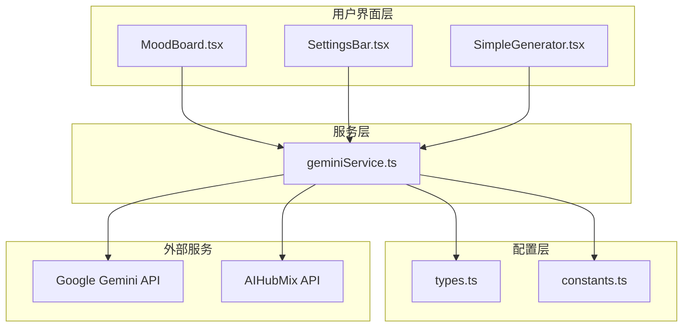
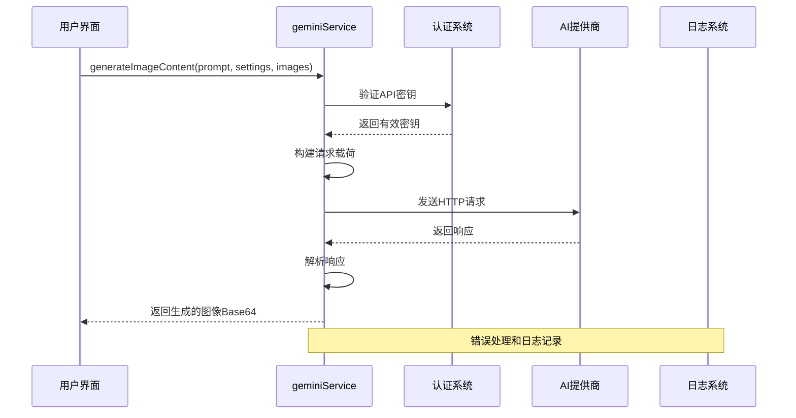
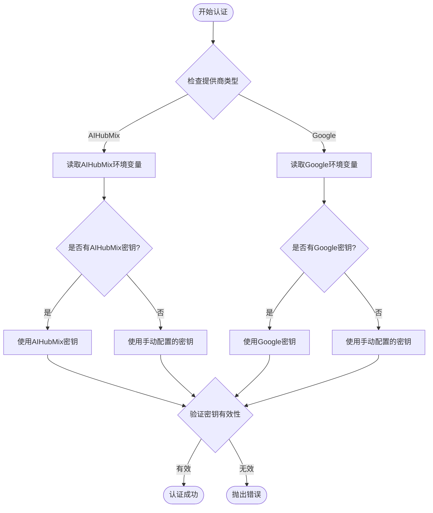
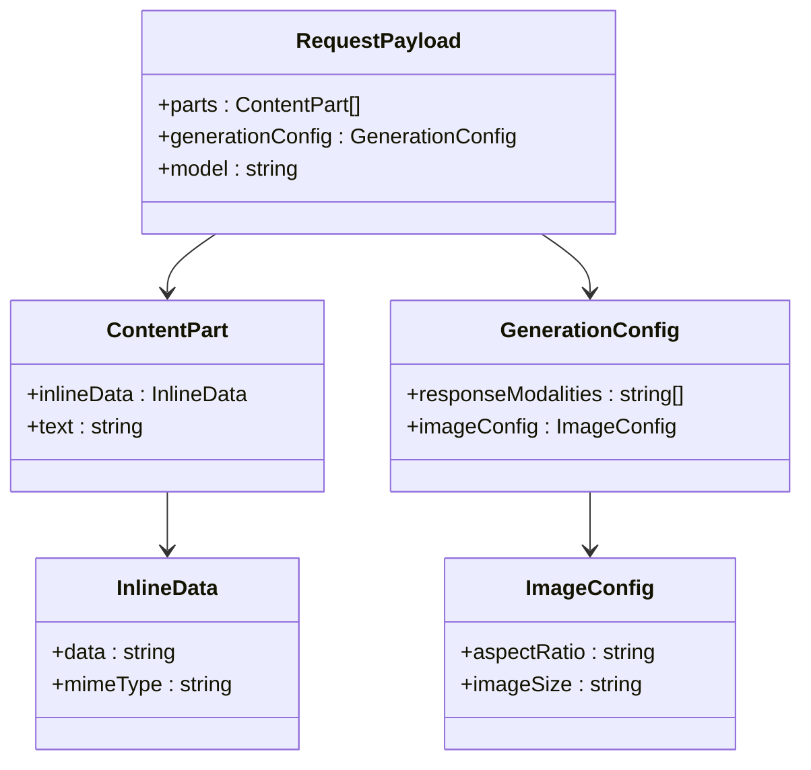
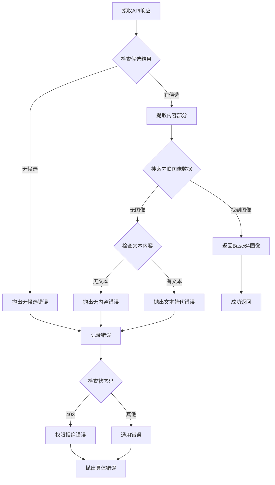
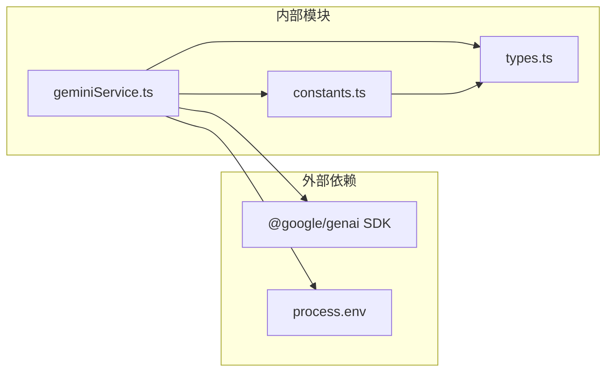

# API集成层

<cite>
**本文档中引用的文件**
- [geminiService.ts](file://services/geminiService.ts)
- [constants.ts](file://constants.ts)
- [types.ts](file://types.ts)
- [MoodBoard.tsx](file://components/MoodBoard.tsx)
- [SettingsBar.tsx](file://components/SettingsBar.tsx)
- [SimpleGenerator.tsx](file://components/SimpleGenerator.tsx)
- [README.md](file://README.md)
</cite>

## 目录
1. [简介](#简介)
2. [项目结构](#项目结构)
3. [核心组件](#核心组件)
4. [架构概览](#架构概览)
5. [详细组件分析](#详细组件分析)
6. [依赖关系分析](#依赖关系分析)
7. [性能考虑](#性能考虑)
8. [故障排除指南](#故障排除指南)
9. [结论](#结论)

## 简介

API集成层是Banana Canvase项目的核心组件，负责封装与Google Gemini和AIHubMix两种AI模型的HTTP通信。该层提供了统一的接口来处理图像生成请求，支持多种AI提供商和模型配置，同时实现了完善的错误处理机制和API密钥管理功能。

本文档重点分析geminiService.ts的服务实现，包括其如何处理不同AI提供商的认证机制、请求格式化、响应解析以及错误恢复策略。通过结合types.ts中的类型定义和constants.ts中的配置常量，该服务为上层应用提供了类型安全且易于扩展的AI集成解决方案。

## 项目结构

该项目采用模块化的架构设计，将API集成层与其他功能组件分离，确保了代码的可维护性和可扩展性。



**图表来源**
- [geminiService.ts](file://services/geminiService.ts#L1-L107)
- [MoodBoard.tsx](file://components/MoodBoard.tsx#L1-L50)
- [SettingsBar.tsx](file://components/SettingsBar.tsx#L1-L50)

**章节来源**
- [geminiService.ts](file://services/geminiService.ts#L1-L107)
- [types.ts](file://types.ts#L1-L56)
- [constants.ts](file://constants.ts#L1-L18)

## 核心组件

### geminiService.ts - 主要服务模块

geminiService.ts是API集成层的核心，提供了`generateImageContent`函数来处理图像生成请求。该服务支持两种主要的AI提供商：Google Gemini和AIHubMix，每种提供商都有特定的认证要求和配置选项。

#### 关键特性

- **多提供商支持**：统一接口支持Google Gemini和AIHubMix
- **动态API密钥管理**：根据提供商自动选择合适的API密钥
- **灵活的模型映射**：通过MODEL_MAPPING常量实现模型ID到实际模型名称的转换
- **智能错误处理**：针对不同类型的错误提供具体的错误信息和恢复建议
- **Base64图像处理**：支持单个或多个图像输入的Base64编码处理

#### 主要导出函数

```typescript
export const generateImageContent = async (
  prompt: string,
  settings: AppSettings,
  imageInput?: string | string[]
): Promise<string>
```

该函数接受三个参数：
- `prompt`：文本提示，描述所需的图像内容
- `settings`：包含提供商、模型ID等配置的应用设置
- `imageInput`：可选的参考图像，可以是单个Base64字符串或字符串数组

**章节来源**
- [geminiService.ts](file://services/geminiService.ts#L5-L107)

## 架构概览

API集成层采用了分层架构设计，确保了关注点分离和代码的可测试性。



**图表来源**
- [geminiService.ts](file://services/geminiService.ts#L5-L107)
- [MoodBoard.tsx](file://components/MoodBoard.tsx#L452-L519)

## 详细组件分析

### API密钥认证机制

服务实现了智能的API密钥管理策略，支持环境变量和手动配置两种方式：



**图表来源**
- [geminiService.ts](file://services/geminiService.ts#L11-L21)

#### 认证流程详解

1. **提供商检测**：根据`settings.provider`确定使用哪个提供商的API密钥
2. **环境变量优先**：优先从环境变量中读取API密钥（AIHubMix使用`AIHUBMIX_API_KEY`，Google使用`GEMINI_API_KEY`或`API_KEY`）
3. **回退机制**：如果环境变量不可用，则使用手动配置的API密钥
4. **密钥验证**：如果所有途径都未提供有效的API密钥，则抛出明确的错误信息

**章节来源**
- [geminiService.ts](file://services/geminiService.ts#L11-L21)

### 请求载荷构建

服务将输入数据转换为符合AI模型要求的格式：



**图表来源**
- [geminiService.ts](file://services/geminiService.ts#L35-L76)

#### 数据处理流程

1. **图像输入处理**：
   - 支持单个或多个图像输入
   - 自动移除Base64数据URL前缀
   - 将图像转换为`inlineData`格式

2. **文本提示添加**：
   - 将用户提供的文本提示作为单独的部分
   - 确保文本部分在图像部分之后

3. **提供商特定配置**：
   - AIHubMix：启用TEXT和IMAGE双重输出模态
   - AIHubMix：设置1:1宽高比和默认1K图像尺寸

**章节来源**
- [geminiService.ts](file://services/geminiService.ts#L35-L76)

### 响应解析与错误处理

服务实现了健壮的响应解析和错误处理机制：



**图表来源**
- [geminiService.ts](file://services/geminiService.ts#L78-L106)

#### 错误处理策略

1. **网络错误**：捕获并重新抛出，提供清晰的错误信息
2. **权限错误（403）**：特别处理，指导用户检查API密钥配置
3. **内容缺失**：当模型返回非图像内容时提供具体反馈
4. **日志记录**：所有错误都会被记录到控制台以便调试

**章节来源**
- [geminiService.ts](file://services/geminiService.ts#L98-L106)

### 类型系统集成

服务与类型系统紧密集成，确保类型安全：

| 类型定义 | 用途 | 示例值 |
|---------|------|--------|
| `AppSettings` | 应用程序配置 | `{provider: 'Google', modelId: 'nano-banana'}` |
| `ModelProvider` | 提供商枚举 | `'Google' \| 'AIHubMix'` |
| `ModelId` | 模型标识符 | `'nano-banana' \| 'nano-banana-pro'` |
| `GeneratedImageResult` | 生成结果 | `{imageUrl: 'data:image/png;base64,...', prompt: '...'}` |

**章节来源**
- [types.ts](file://types.ts#L1-L56)

### 使用示例

#### 基本图像生成

```typescript
// 在MoodBoard组件中使用
const handleGenerate = async () => {
  try {
    const result = await generateImageContent(
      "一只可爱的香蕉猫在沙滩上玩耍",
      settings,
      refImage || undefined
    );
    setGeneratedImage(result);
  } catch (err: any) {
    setError(err.message);
  }
};
```

#### 多图像输入

```typescript
// 支持多个参考图像
const result = await generateImageContent(
  "融合两张风景照片生成新的景观",
  settings,
  [image1, image2, image3]
);
```

**章节来源**
- [MoodBoard.tsx](file://components/MoodBoard.tsx#L452-L519)
- [SimpleGenerator.tsx](file://components/SimpleGenerator.tsx#L1-L37)

## 依赖关系分析

API集成层的依赖关系体现了良好的模块化设计原则：



**图表来源**
- [geminiService.ts](file://services/geminiService.ts#L1-L4)
- [constants.ts](file://constants.ts#L1-L18)
- [types.ts](file://types.ts#L1-L56)

### 依赖注入模式

服务通过以下方式实现松耦合：

1. **配置注入**：通过`AppSettings`参数传递配置
2. **SDK抽象**：使用@google/genai SDK作为底层实现
3. **环境变量解耦**：API密钥通过环境变量管理，不硬编码在服务中

**章节来源**
- [geminiService.ts](file://services/geminiService.ts#L1-L4)

## 性能考虑

### 并发处理

服务设计支持并发请求处理，但需要注意以下性能因素：

1. **内存管理**：Base64图像数据在内存中的存储和处理
2. **网络超时**：需要考虑API响应时间对用户体验的影响
3. **重试机制**：对于临时性错误应该实现适当的重试逻辑

### 缓存策略

虽然当前实现没有内置缓存，但可以考虑以下优化：

1. **图像预处理缓存**：缓存Base64图像的预处理结果
2. **模型响应缓存**：对于相同的提示和配置缓存生成结果
3. **配置缓存**：缓存频繁使用的API配置

## 故障排除指南

### 常见问题及解决方案

#### API密钥相关问题

| 错误信息 | 可能原因 | 解决方案 |
|---------|---------|---------|
| "API Key for Google/AIHUBMIX is missing" | 环境变量或手动配置缺失 | 检查.env.local文件或设置面板 |
| "Permission Denied (403)" | API密钥无效或权限不足 | 验证密钥有效性，检查配额限制 |
| "Failed to generate image" | 网络连接或API服务问题 | 检查网络连接，稍后重试 |

#### 图像处理问题

| 问题 | 原因 | 解决方法 |
|------|------|---------|
| Base64解码失败 | 图像数据格式不正确 | 验证输入图像格式和编码 |
| 模型返回文本而非图像 | 提示不符合模型预期 | 调整提示词，确保清晰具体 |
| 内存占用过高 | 大尺寸图像处理 | 实现图像压缩或分块处理 |

**章节来源**
- [geminiService.ts](file://services/geminiService.ts#L98-L106)

### 开发者扩展指南

#### 添加新的AI提供商

要扩展支持新的AI提供商，请按照以下步骤操作：

1. **更新类型定义**：
   ```typescript
   export enum ModelProvider {
     GOOGLE = 'Google',
     AIHUBMIX = 'AIHubMix',
     NEW_PROVIDER = 'NewProvider' // 新增提供商
   }
   ```

2. **更新常量配置**：
   ```typescript
   export const PROVIDERS = [
     { id: ModelProvider.GOOGLE, name: 'Google' },
     { id: ModelProvider.AIHUBMIX, name: 'AIHubMix' },
     { id: ModelProvider.NEW_PROVIDER, name: 'New Provider' }
   ];
   ```

3. **修改认证逻辑**：
   在`generateImageContent`函数中添加新的提供商分支：
   ```typescript
   if (settings.provider === ModelProvider.NEW_PROVIDER) {
     apiKey = process.env.NEW_PROVIDER_API_KEY || settings.apiKey;
     options.baseUrl = 'https://api.newprovider.com/v1';
   }
   ```

4. **更新模型映射**：
   ```typescript
   export const MODEL_MAPPING: Record<ModelId, string> = {
     [ModelId.NANO_BANANA]: 'gemini-2.5-flash-image',
     [ModelId.NANO_BANANA_PRO]: 'gemini-3-pro-image-preview',
     [ModelId.NEW_MODEL]: 'new-provider-model-name' // 新模型映射
   };
   ```

#### 添加新的模型

1. **更新模型枚举**：
   ```typescript
   export enum ModelId {
     NANO_BANANA = 'nano-banana',
     NANO_BANANA_PRO = 'nano-banana-pro',
     NEW_MODEL = 'new-model' // 新模型
   }
   ```

2. **更新模型列表**：
   ```typescript
   export const MODELS = [
     { id: ModelId.NANO_BANANA, name: 'Nano Banana (Flash Image)' },
     { id: ModelId.NANO_BANANA_PRO, name: 'Nano Banana Pro (Pro Image)' },
     { id: ModelId.NEW_MODEL, name: 'New Model (High Quality)' }
   ];
   ```

3. **更新模型映射**：
   ```typescript
   export const MODEL_MAPPING: Record<ModelId, string> = {
     [ModelId.NANO_BANANA]: 'gemini-2.5-flash-image',
     [ModelId.NANO_BANANA_PRO]: 'gemini-3-pro-image-preview',
     [ModelId.NEW_MODEL]: 'new-provider-high-quality-model'
   };
   ```

**章节来源**
- [types.ts](file://types.ts#L2-L10)
- [constants.ts](file://constants.ts#L3-L17)

## 结论

API集成层通过geminiService.ts实现了强大而灵活的AI模型集成能力。该服务的设计体现了以下优秀实践：

1. **类型安全**：通过TypeScript类型系统确保代码质量
2. **可扩展性**：模块化设计便于添加新的AI提供商和模型
3. **错误处理**：完善的错误处理机制提供良好的用户体验
4. **配置灵活性**：支持多种配置方式满足不同部署需求
5. **性能优化**：合理的数据处理和内存管理策略

该集成层为Banana Canvase项目提供了坚实的AI服务基础，支持复杂的图像生成和编辑功能。开发者可以通过遵循本文档提供的扩展指南，轻松地添加新的AI提供商或模型，进一步增强应用程序的功能。

未来的改进方向包括：
- 实现请求缓存机制
- 添加更细粒度的错误重试策略
- 支持异步图像处理
- 增强监控和指标收集功能