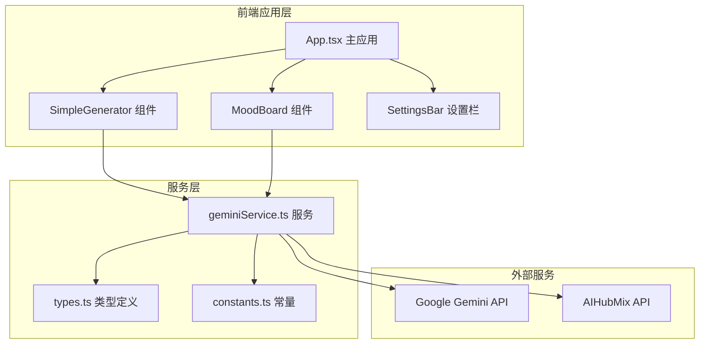
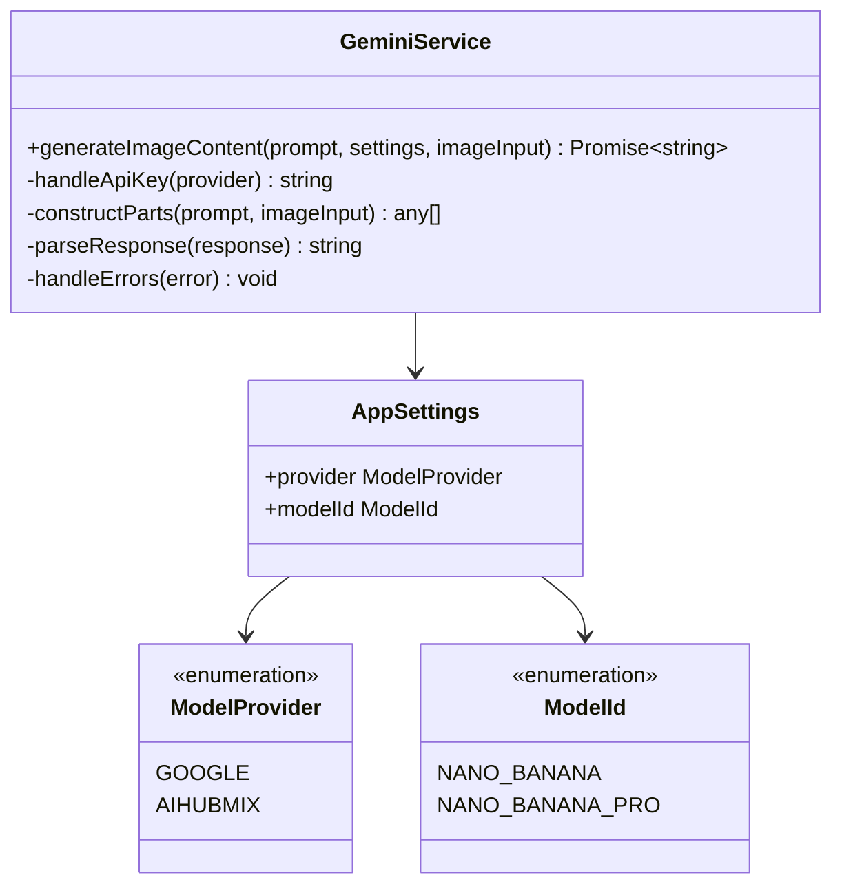
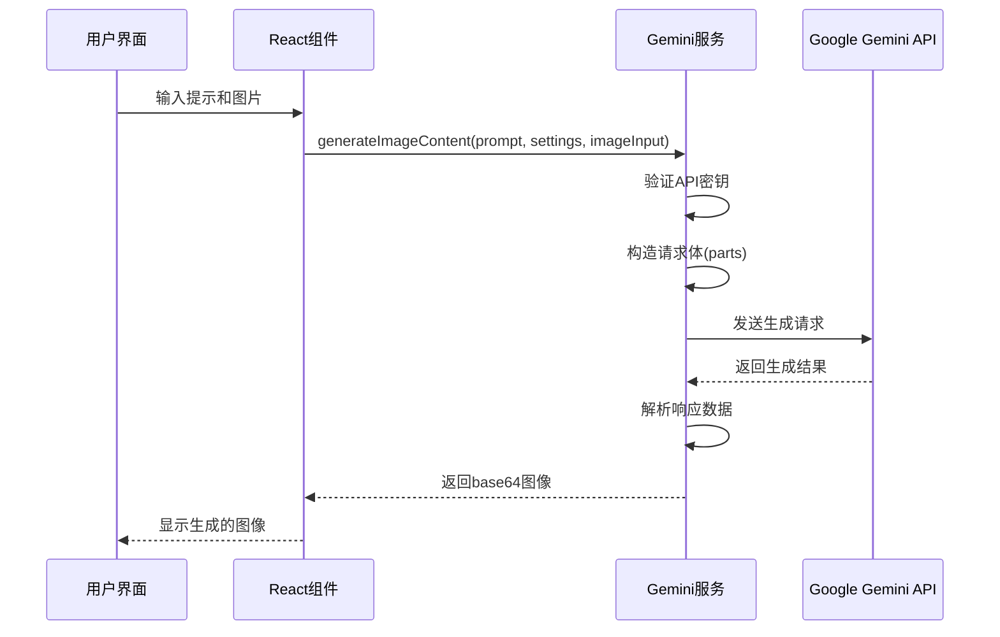

# Google Gemini API集成详细文档

<cite>
**本文档引用的文件**
- [geminiService.ts](file://services/geminiService.ts)
- [types.ts](file://types.ts)
- [constants.ts](file://constants.ts)
- [SimpleGenerator.tsx](file://components/SimpleGenerator.tsx)
- [MoodBoard.tsx](file://components/MoodBoard.tsx)
- [App.tsx](file://App.tsx)
- [package.json](file://package.json)
- [vite.config.ts](file://vite.config.ts)
- [README.md](file://README.md)
</cite>

## 目录
1. [简介](#简介)
2. [项目架构概览](#项目架构概览)
3. [核心组件分析](#核心组件分析)
4. [API集成实现](#api集成实现)
5. [配置管理](#配置管理)
6. [错误处理机制](#错误处理机制)
7. [使用示例](#使用示例)
8. [调试指南](#调试指南)
9. [最佳实践](#最佳实践)
10. [故障排除](#故障排除)

## 简介

BananaCanvase是一个基于React的AI图像生成应用，集成了Google Gemini API来实现智能图像生成功能。该应用提供了两种主要的图像生成模式：简单生成器(SimpleGenerator)和创意画板(MoodBoard)，都通过统一的Gemini服务接口与Google AI服务进行交互。

## 项目架构概览



**图表来源**
- [App.tsx](file://App.tsx#L1-L137)
- [geminiService.ts](file://services/geminiService.ts#L1-L109)
- [SimpleGenerator.tsx](file://components/SimpleGenerator.tsx#L1-L148)
- [MoodBoard.tsx](file://components/MoodBoard.tsx#L1-L770)

## 核心组件分析

### 服务层架构



**图表来源**
- [geminiService.ts](file://services/geminiService.ts#L5-L109)
- [types.ts](file://types.ts#L2-L56)

### 组件交互流程



**图表来源**
- [SimpleGenerator.tsx](file://components/SimpleGenerator.tsx#L30-L51)
- [MoodBoard.tsx](file://components/MoodBoard.tsx#L470-L524)
- [geminiService.ts](file://services/geminiService.ts#L5-L109)

**章节来源**
- [geminiService.ts](file://services/geminiService.ts#L1-L109)
- [types.ts](file://types.ts#L1-L56)
- [constants.ts](file://constants.ts#L1-L18)

## API集成实现

### @google/genai SDK初始化

Gemini服务通过`@google/genai` SDK与Google AI服务进行通信。服务支持两种提供商：Google官方和AIHubMix代理服务。

```typescript
// API密钥和基础URL配置
const apiKey = settings.provider === ModelProvider.AIHUBMIX
  ? (import.meta as any).env.VITE_AIHUBMIX_API_KEY || ''
  : (import.meta as any).env.VITE_GEMINI_API_KEY || '';

const baseUrl = settings.provider === ModelProvider.AIHUBMIX
  ? (import.meta as any).env.VITE_AIHUBMIX_BASE_URL || 'https://aihubmix.com/gemini'
  : (import.meta as any).env.VITE_GEMINI_BASE_URL;

// 客户端配置
const options: any = {
  apiKey,
  ...(baseUrl && { httpOptions: { baseUrl } })
};

const ai = new GoogleGenAI(options);
```

### 请求体构造

服务支持多种输入格式，包括文本提示和图像数据：

```typescript
// 图像输入处理
const parts: any[] = [];
if (imageInput) {
  const images = Array.isArray(imageInput) ? imageInput : [imageInput];
  
  images.forEach(img => {
    const cleanBase64 = img.split(',')[1] || img;
    
    parts.push({
      inlineData: {
        data: cleanBase64,
        mimeType: 'image/png'
      }
    });
  });
}

// 文本提示添加
parts.push({
  text: prompt
});
```

### 响应解析

服务从API响应中提取生成的图像数据：

```typescript
// 响应解析逻辑
if (response.candidates && response.candidates.length > 0) {
  const candidate = response.candidates[0];
  const contentParts = candidate.content.parts;
  
  for (const part of contentParts) {
    if (part.inlineData && part.inlineData.data) {
      return `data:${part.inlineData.mimeType || 'image/png'};base64,${part.inlineData.data}`;
    }
  }
}
```

**章节来源**
- [geminiService.ts](file://services/geminiService.ts#L11-L98)

## 配置管理

### 环境变量配置

应用通过Vite的环境变量系统管理API密钥：

```typescript
// vite.config.ts中的配置
define: {
  'process.env.API_KEY': JSON.stringify(env.GEMINI_API_KEY),
  'process.env.GEMINI_API_KEY': JSON.stringify(env.GEMINI_API_KEY),
  'process.env.AIHUBMIX_API_KEY': JSON.stringify(env.AIHUBMIX_API_KEY)
}
```

### 应用设置结构

```typescript
export interface AppSettings {
  provider: ModelProvider;  // 提供商选择
  modelId: ModelId;         // 模型标识
}
```

### 模型映射关系

```typescript
export const MODEL_MAPPING: Record<ModelId, string> = {
  [ModelId.NANO_BANANA]: 'gemini-2.5-flash-image',
  [ModelId.NANO_BANANA_PRO]: 'gemini-3-pro-image-preview',
};
```

**章节来源**
- [geminiService.ts](file://services/geminiService.ts#L11-L21)
- [vite.config.ts](file://vite.config.ts#L1-L24)
- [constants.ts](file://constants.ts#L13-L17)
- [types.ts](file://types.ts#L36-L40)

## 错误处理机制

### 权限错误处理

服务实现了专门的403权限错误检测：

```typescript
try {
  // API调用逻辑
} catch (error: any) {
  console.error("Gemini Generation Error:", error);
  
  // 特定的403错误处理
  if (error.status === 403 || (error.message && error.message.includes('403'))) {
    throw new Error("Permission Denied (403). Please select a valid API Key in Config.");
  }
  
  throw new Error(error.message || "Failed to generate image.");
}
```

### 组件级错误处理

SimpleGenerator和MoodBoard组件都实现了类似的错误处理逻辑：

```typescript
// 错误检查和用户提示
if (onAuthError && (
    msg.includes('403') || 
    msg.includes('permission') || 
    msg.includes('not found')
)) {
    onAuthError();
}
setError(msg || 'Generation failed');
```

### 认证状态管理

```typescript
// 应用启动时的认证检查
useEffect(() => {
  const hasGeminiKey = !!(import.meta as any).env.VITE_GEMINI_API_KEY;
  const hasAIHubMixKey = !!(import.meta as any).env.VITE_AIHUBMIX_API_KEY;
  
  if (!hasGeminiKey && !hasAIHubMixKey) {
    setShowWelcome(true);
  } else {
    setShowWelcome(false);
  }
}, [settings.provider]);
```

**章节来源**
- [geminiService.ts](file://services/geminiService.ts#L101-L108)
- [SimpleGenerator.tsx](file://components/SimpleGenerator.tsx#L37-L50)
- [MoodBoard.tsx](file://components/MoodBoard.tsx#L514-L520)
- [App.tsx](file://App.tsx#L33-L43)

## 使用示例

### SimpleGenerator组件使用

SimpleGenerator提供了基础的图像生成功能：

```typescript
// 基本用法示例
const handleGenerate = async () => {
  if (!prompt.trim()) return;
  
  setLoading(true);
  setError(null);
  
  try {
    const result = await generateImageContent(prompt, settings, refImage || undefined);
    setGeneratedImage(result);
  } catch (err: any) {
    setError(err.message || 'Generation failed');
  } finally {
    setLoading(false);
  }
};
```

### MoodBoard组件使用

MoodBoard支持更复杂的图像编辑功能：

```typescript
// 复杂编辑场景
const handleGenerate = async () => {
  const activePaths = paths.filter(p => p.prompt && p.prompt.trim().length > 0);
  const hasAnnotations = paths.length > 0;
  
  let finalPrompt = "You are an expert image editor. ";
  
  if (hasAnnotations) {
    // 包含参考图像和掩码的复杂提示
    finalPrompt += "I have provided two images:\n";
    finalPrompt += "1. A Source Image containing the scene to edit.\n";
    finalPrompt += "2. A B&W Mask Image (Black background, White strokes) indicating EXACTLY where to apply changes.\n\n";
    finalPrompt += "TASK: Apply the following edits ONLY to the white masked areas...\n";
  }
  
  try {
    const sourceImageBase64 = await getCanvasContentAsBase64({ mode: 'source' });
    const maskImageBase64 = await getCanvasContentAsBase64({ mode: 'mask' });
    
    const inputs = [sourceImageBase64];
    if (hasAnnotations) {
      inputs.push(maskImageBase64);
    }
    
    const resultBase64 = await generateImageContent(finalPrompt, settings, inputs);
    setGeneratedImages(prev => [resultBase64, ...prev]);
    
  } catch (e: any) {
    console.error(e);
    setError(e.message || 'Generation failed');
  }
};
```

**章节来源**
- [SimpleGenerator.tsx](file://components/SimpleGenerator.tsx#L30-L51)
- [MoodBoard.tsx](file://components/MoodBoard.tsx#L470-L524)

## 调试指南

### 日志输出策略

在开发过程中，可以通过以下方式添加调试信息：

```typescript
// 在geminiService.ts中添加调试日志
console.log('API Key:', apiKey ? '***' : 'MISSING');
console.log('Model Name:', actualModelName);
console.log('Request Parts:', parts);
console.log('Generation Config:', generationConfig);
```

### 响应结构分析

了解Gemini API的响应结构有助于调试：

```typescript
// 响应结构示例
{
  candidates: [{
    content: {
      parts: [{
        inlineData: {
          data: 'base64编码的图像数据',
          mimeType: 'image/png'
        }
      }]
    }
  }],
  usageMetadata: {
    promptTokenCount: 100,
    candidatesTokenCount: 50,
    totalTokenCount: 150
  }
}
```

### 网络请求监控

使用浏览器开发者工具监控API请求：

1. 打开浏览器开发者工具(F12)
2. 切换到Network标签页
3. 观察Gemini API请求的状态码和响应时间
4. 检查请求头中的Authorization字段

### 常见问题诊断

```typescript
// 诊断函数示例
const diagnoseGeminiSetup = () => {
  const env = import.meta as any;
  console.log('VITE_GEMINI_API_KEY:', env.env.VITE_GEMINI_API_KEY ? '✓' : '✗');
  console.log('VITE_AIHUBMIX_API_KEY:', env.env.VITE_AIHUBMIX_API_KEY ? '✓' : '✗');
  console.log('Current Provider:', settings.provider);
  console.log('Model Mapping:', MODEL_MAPPING);
};
```

**章节来源**
- [geminiService.ts](file://services/geminiService.ts#L33-L35)
- [App.tsx](file://App.tsx#L34-L35)

## 最佳实践

### API密钥安全

1. **环境变量管理**：始终使用环境变量存储API密钥
2. **密钥轮换**：定期更新API密钥
3. **访问控制**：限制API密钥的使用范围

### 性能优化

1. **请求缓存**：对相同输入的结果进行缓存
2. **并发控制**：限制同时进行的API请求数量
3. **超时设置**：为API请求设置合理的超时时间

### 错误恢复

1. **重试机制**：对临时性错误实施指数退避重试
2. **降级策略**：在API不可用时提供替代方案
3. **用户反馈**：提供清晰的错误信息和解决建议

### 代码组织

```typescript
// 推荐的服务层设计
class GeminiService {
  private client: GoogleGenAI;
  
  constructor(apiKey: string, baseUrl?: string) {
    this.client = new GoogleGenAI({
      apiKey,
      ...(baseUrl && { httpOptions: { baseUrl } })
    });
  }
  
  async generateImage(prompt: string, imageInput?: string | string[]): Promise<string> {
    // 实现具体的生成逻辑
  }
}
```

## 故障排除

### 常见错误及解决方案

| 错误类型 | 错误信息 | 可能原因 | 解决方案 |
|---------|---------|---------|---------|
| 403权限错误 | "Permission Denied (403)" | API密钥无效或权限不足 | 检查.env文件中的API密钥配置 |
| API密钥缺失 | "API Key is missing" | 环境变量未正确设置 | 确保设置了VITE_GEMINI_API_KEY或VITE_AIHUBMIX_API_KEY |
| 网络连接错误 | "Failed to generate image" | 网络问题或API服务不可用 | 检查网络连接，确认API服务状态 |
| 请求格式错误 | "Invalid request format" | 请求参数格式不正确 | 验证prompt和imageInput的格式 |

### 配置验证步骤

1. **检查环境变量**：
   ```bash
   echo $VITE_GEMINI_API_KEY
   echo $VITE_AIHUBMIX_API_KEY
   ```

2. **验证API密钥有效性**：
   - 登录Google Cloud Console检查密钥状态
   - 确认项目配额和使用情况

3. **测试网络连接**：
   ```bash
   curl -H "Authorization: Bearer $VITE_GEMINI_API_KEY" \
        https://generativelanguage.googleapis.com/v1beta/models/gemini-2.5-flash-image:generateContent
   ```

### 开发环境配置

确保正确的开发环境设置：

1. **安装依赖**：
   ```bash
   npm install
   ```

2. **配置环境变量**：
   创建`.env.local`文件：
   ```
   VITE_GEMINI_API_KEY=your_google_gemini_api_key_here
   VITE_AIHUBMIX_API_KEY=your_aihubmix_api_key_here
   ```

3. **启动应用**：
   ```bash
   npm run dev
   ```

**章节来源**
- [geminiService.ts](file://services/geminiService.ts#L23-L25)
- [App.tsx](file://App.tsx#L34-L43)
- [README.md](file://README.md#L17-L20)