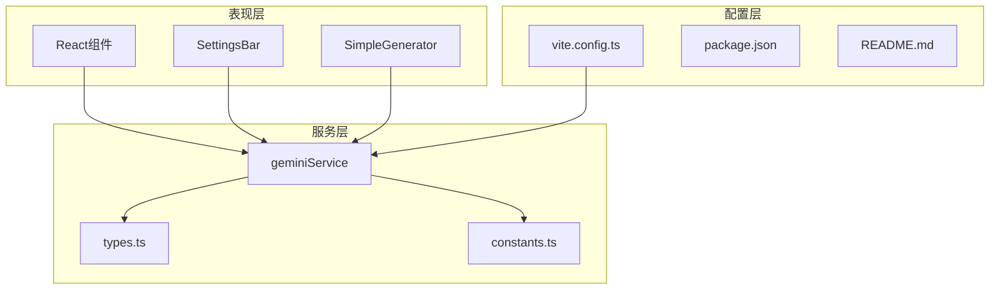
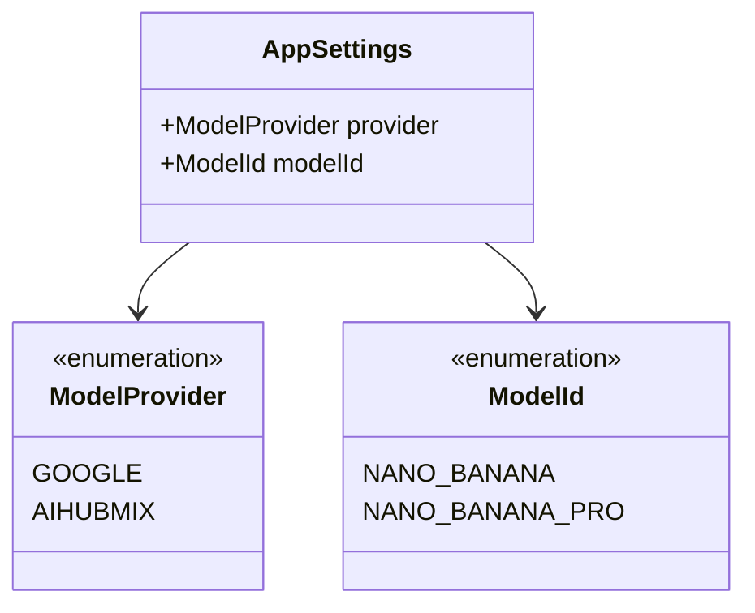
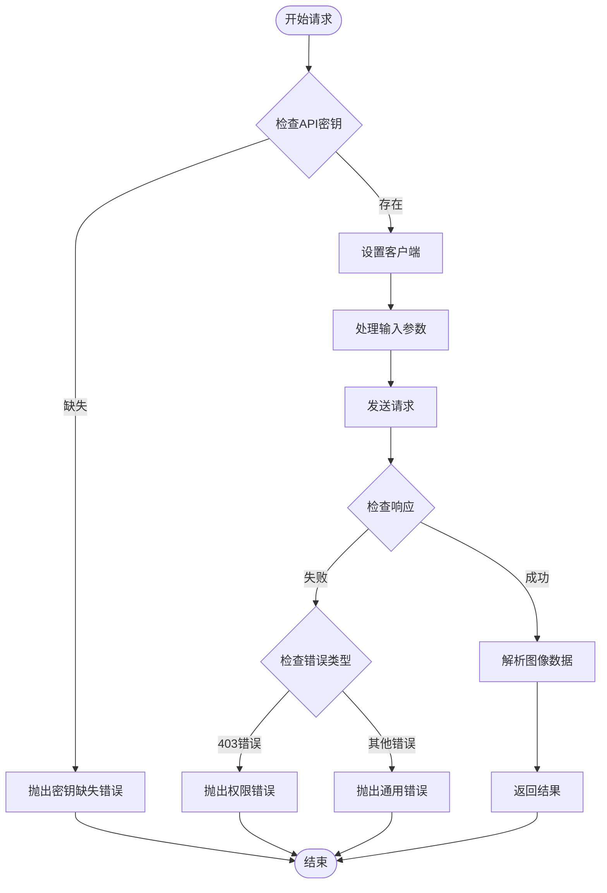
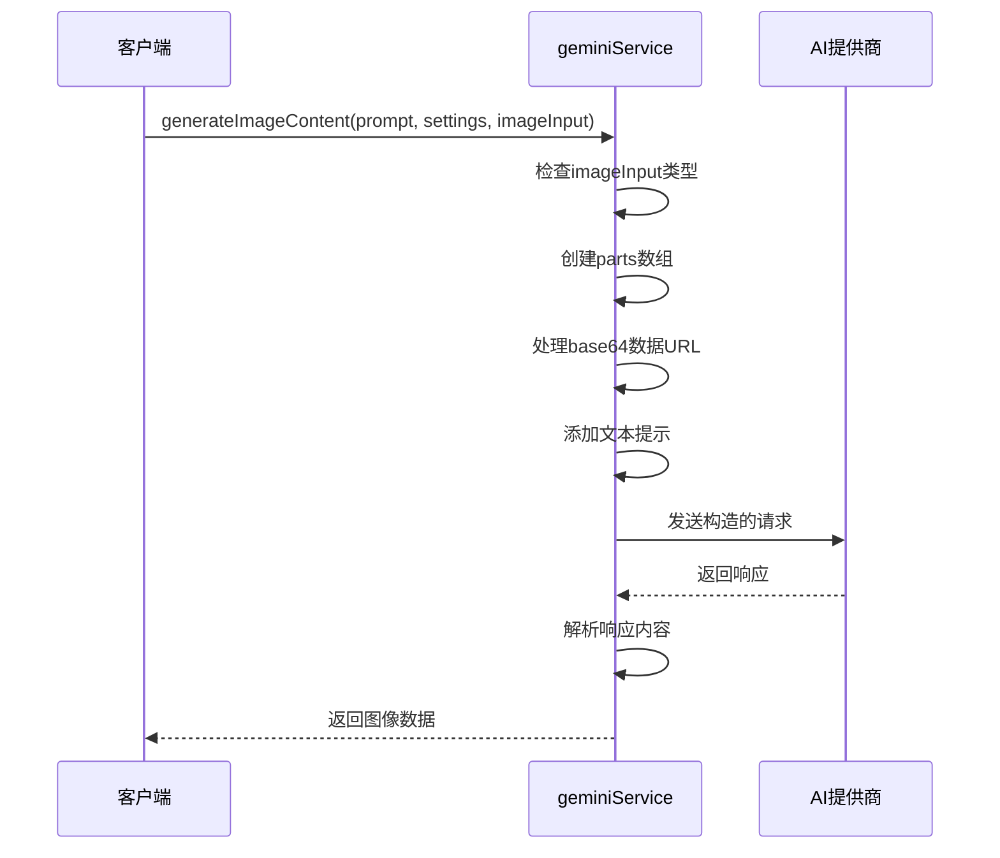
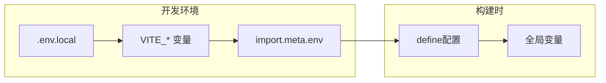
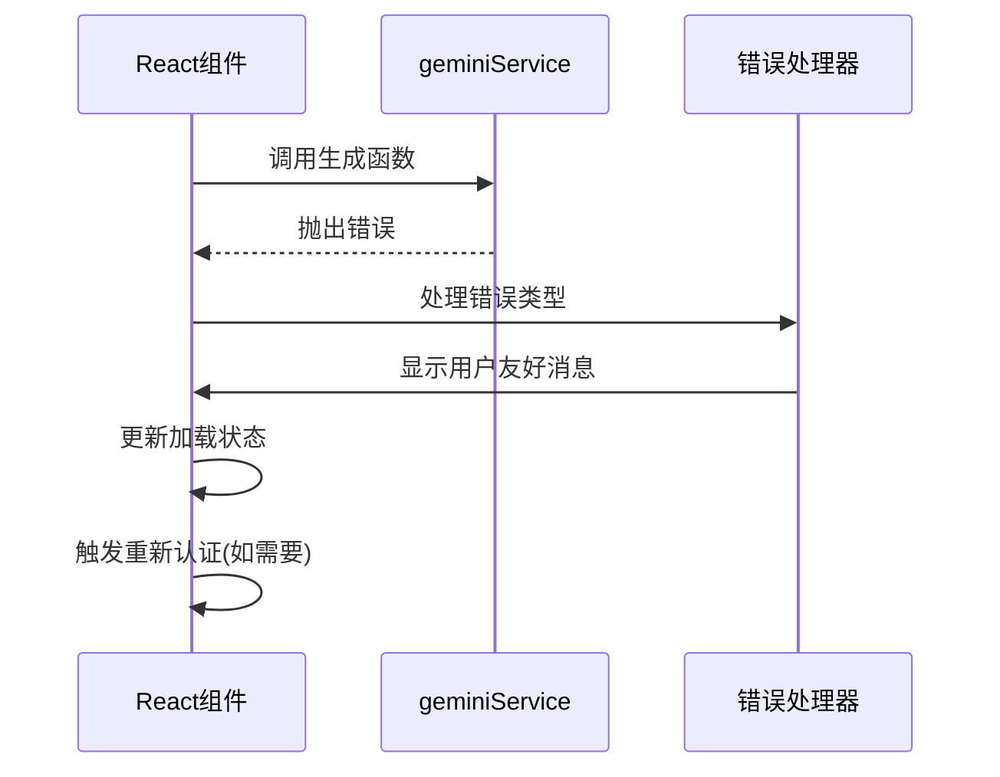
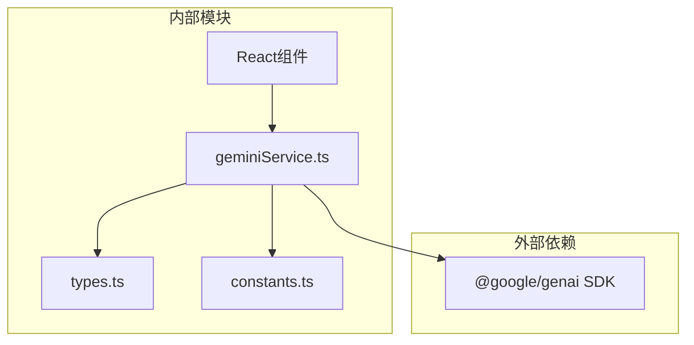

# 通用服务架构

<cite>
**本文档中引用的文件**
- [geminiService.ts](file://services/geminiService.ts)
- [types.ts](file://types.ts)
- [constants.ts](file://constants.ts)
- [vite.config.ts](file://vite.config.ts)
- [package.json](file://package.json)
- [SimpleGenerator.tsx](file://components/SimpleGenerator.tsx)
- [SettingsBar.tsx](file://components/SettingsBar.tsx)
- [README.md](file://README.md)
</cite>

## 目录
1. [简介](#简介)
2. [项目结构概览](#项目结构概览)
3. [核心组件分析](#核心组件分析)
4. [架构设计原理](#架构设计原理)
5. [详细组件分析](#详细组件分析)
6. [依赖关系分析](#依赖关系分析)
7. [性能考虑](#性能考虑)
8. [故障排除指南](#故障排除指南)
9. [结论](#结论)

## 简介

Banana Canvas AI 是一个基于React的AI图像生成应用，其核心服务架构围绕 `geminiService.ts` 构建，该服务作为AI模型的统一抽象层，支持多种AI提供商的无缝切换。本文档深入分析了该服务的设计理念、实现机制以及扩展性架构。

该服务的核心设计理念是通过统一的接口抽象，屏蔽不同AI模型后端的差异，为上层应用提供一致的调用体验。当前支持Google Gemini和AIHubMix两个主要提供商，同时具备良好的扩展性以支持未来新增的AI模型。

## 项目结构概览

项目采用模块化的架构设计，主要分为以下几个层次：

**图表来源**
- [geminiService.ts](file://services/geminiService.ts#L1-L112)
- [types.ts](file://types.ts#L1-L56)
- [constants.ts](file://constants.ts#L1-L18)

**章节来源**
- [geminiService.ts](file://services/geminiService.ts#L1-L112)
- [types.ts](file://types.ts#L1-L56)
- [constants.ts](file://constants.ts#L1-L18)

## 核心组件分析

### generateImageContent 函数

`generateImageContent` 是整个服务的核心函数，它实现了以下关键功能：

1. **多提供商支持**：通过 `ModelProvider` 枚举支持Google和AIHubMix
2. **动态配置管理**：根据提供商自动选择相应的API密钥和基础URL
3. **灵活的输入处理**：支持单个图像字符串或图像数组
4. **统一的响应格式**：返回标准化的base64数据URL

### AppSettings 类型系统

AppSettings 类型定义了服务的核心配置接口：

**图表来源**
- [types.ts](file://types.ts#L2-L10)
- [types.ts](file://types.ts#L36-L40)

**章节来源**
- [geminiService.ts](file://services/geminiService.ts#L5-L112)
- [types.ts](file://types.ts#L2-L10)
- [types.ts](file://types.ts#L36-L40)

## 架构设计原理

### 统一接口设计

服务采用统一接口设计模式，通过以下机制实现：

1. **Provider抽象**：通过 `ModelProvider` 枚举抽象不同的AI提供商
2. **配置映射**：使用 `MODEL_MAPPING` 常量将应用层的模型ID映射到具体的SDK模型名称
3. **环境变量管理**：通过Vite的环境变量系统管理不同提供商的配置

### 错误处理策略

服务实现了分层的错误处理机制：

**图表来源**
- [geminiService.ts](file://services/geminiService.ts#L11-L25)
- [geminiService.ts](file://services/geminiService.ts#L104-L111)

**章节来源**
- [geminiService.ts](file://services/geminiService.ts#L11-L25)
- [geminiService.ts](file://services/geminiService.ts#L104-L111)

## 详细组件分析

### 请求构造逻辑

服务的请求构造过程体现了高度的灵活性和可扩展性：

#### 动态Parts数组构建

**图表来源**
- [geminiService.ts](file://services/geminiService.ts#L36-L94)

#### Base64数据URL处理

服务实现了智能的数据URL处理机制：
- 自动检测并移除 `data:image/png;base64,` 前缀
- 支持单个图像字符串和图像数组两种输入格式
- 确保传递给AI模型的是纯净的base64编码数据

### 环境变量与配置管理

#### 配置优先级机制

服务采用了多层次的配置优先级系统：

| 层级 | 配置项 | 优先级 | 示例 |
|------|--------|--------|------|
| 1 | 环境变量 | 最高 | `VITE_GEMINI_API_KEY` |
| 2 | 应用设置 | 中等 | 用户在UI中选择的提供商 |
| 3 | 默认值 | 最低 | 内置的默认基础URL |

#### Vite环境变量集成

**图表来源**
- [vite.config.ts](file://vite.config.ts#L1-L24)
- [geminiService.ts](file://services/geminiService.ts#L15-L21)

**章节来源**
- [geminiService.ts](file://services/geminiService.ts#L15-L21)
- [vite.config.ts](file://vite.config.ts#L1-L24)

### 错误处理与用户体验

#### 分类错误处理

服务实现了精细化的错误分类处理：

| 错误类型 | 检测方式 | 用户友好消息 | 处理策略 |
|----------|----------|--------------|----------|
| API密钥缺失 | `!apiKey` 条件 | "API Key缺失，请在配置中设置" | 抛出明确的配置错误 |
| 权限拒绝 | HTTP 403状态码 | "权限被拒绝(403)，请检查API密钥" | 触发重新认证流程 |
| 图像生成失败 | 响应内容验证 | "未生成图像，请重试" | 提供重试建议 |
| 其他错误 | 通用异常捕获 | "图像生成失败" | 记录日志并返回通用错误 |

#### 用户界面集成

服务与React组件紧密集成，提供了完整的错误处理体验：

**图表来源**
- [SimpleGenerator.tsx](file://components/SimpleGenerator.tsx#L30-L48)
- [geminiService.ts](file://services/geminiService.ts#L104-L111)

**章节来源**
- [geminiService.ts](file://services/geminiService.ts#L104-L111)
- [SimpleGenerator.tsx](file://components/SimpleGenerator.tsx#L30-L48)

## 依赖关系分析

### 核心依赖关系

**图表来源**
- [geminiService.ts](file://services/geminiService.ts#L1-L4)
- [package.json](file://package.json#L11-L15)

### 模块耦合度分析

服务采用了松耦合的设计原则：

1. **接口隔离**：通过清晰的接口定义减少模块间的直接依赖
2. **配置驱动**：使用常量和配置对象替代硬编码
3. **错误边界**：在服务层建立完整的错误处理边界

**章节来源**
- [geminiService.ts](file://services/geminiService.ts#L1-L4)
- [package.json](file://package.json#L11-L15)

## 性能考虑

### 异步处理优化

服务充分利用了JavaScript的异步特性：

- 使用 `async/await` 语法简化异步代码
- 实现了及时的资源清理和错误恢复
- 通过Promise链式调用确保操作的原子性

### 内存管理

- 及时释放临时变量和数组
- 避免在循环中创建不必要的闭包
- 合理使用类型断言减少运行时开销

## 故障排除指南

### 常见问题诊断

#### API密钥相关问题

1. **问题症状**：收到 "API Key is missing" 错误
2. **诊断步骤**：
   - 检查 `.env.local` 文件是否存在
   - 验证环境变量名称是否正确
   - 确认API密钥格式是否有效
3. **解决方案**：按照README指示配置正确的环境变量

#### 权限错误处理

1. **问题症状**：收到 "Permission Denied (403)" 错误
2. **诊断步骤**：
   - 检查API密钥的有效性
   - 验证提供商账户状态
   - 确认请求配额是否充足
3. **解决方案**：在设置界面重新配置API密钥

#### 图像生成失败

1. **问题症状**：收到 "No image generated" 错误
2. **诊断步骤**：
   - 检查提示词的合理性
   - 验证图像输入格式
   - 确认网络连接状态
3. **解决方案**：尝试修改提示词或重新上传图像

**章节来源**
- [geminiService.ts](file://services/geminiService.ts#L23-L25)
- [geminiService.ts](file://services/geminiService.ts#L107-L109)

## 结论

Banana Canvas AI 的 `geminiService.ts` 服务展现了优秀的软件架构设计原则：

### 设计优势

1. **高度可扩展性**：通过抽象层设计轻松支持新AI提供商
2. **用户友好性**：完善的错误处理和用户反馈机制
3. **配置灵活性**：支持多种配置方式和优先级管理
4. **类型安全**：完整的TypeScript类型定义确保开发时的安全性

### 扩展性指导

对于希望添加新AI模型支持的开发者，可以遵循以下步骤：

1. **扩展 ModelProvider 枚举**：在 `types.ts` 中添加新的提供商
2. **更新 MODEL_MAPPING**：在 `constants.ts` 中添加模型映射
3. **修改配置逻辑**：在 `geminiService.ts` 中添加新的配置分支
4. **测试集成**：确保新提供商与现有组件的兼容性

该服务架构为AI应用的快速开发和维护提供了坚实的基础，其模块化设计和清晰的职责分离使其成为现代Web应用开发的优秀范例。