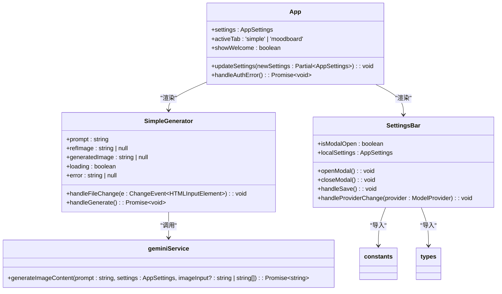
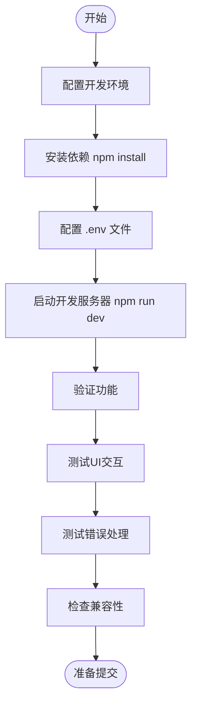

# 代码贡献

<cite>
**本文档引用的文件**  
- [package.json](file://package.json)
- [tsconfig.json](file://tsconfig.json)
- [vite.config.ts](file://vite.config.ts)
- [README.md](file://README.md)
- [App.tsx](file://App.tsx)
- [constants.ts](file://constants.ts)
- [types.ts](file://types.ts)
- [components/SimpleGenerator.tsx](file://components/SimpleGenerator.tsx)
- [components/SettingsBar.tsx](file://components/SettingsBar.tsx)
- [services/geminiService.ts](file://services/geminiService.ts)
- [index.tsx](file://index.tsx)
</cite>

## 目录
1. [简介](#简介)
2. [代码风格与格式化](#代码风格与格式化)
3. [提交信息规范](#提交信息规范)
4. [分支命名与PR流程](#分支命名与pr流程)
5. [测试策略与本地运行](#测试策略与本地运行)
6. [代码审查流程](#代码审查流程)
7. [文档更新要求](#文档更新要求)
8. [首次贡献者指引](#首次贡献者指引)

## 简介

本项目是一个基于React和TypeScript构建的AI图像生成工具，利用Gemini模型提供图像生成和情绪板编辑功能。项目采用Vite作为构建工具，支持Google Gemini和AIHubMix两种AI服务提供商。本贡献指南旨在为社区开发者提供清晰的开发规范，确保代码质量和协作效率。

**Section sources**
- [README.md](file://README.md#L1-L21)
- [package.json](file://package.json#L1-L24)

## 代码风格与格式化

本项目使用TypeScript和React进行开发，遵循现代前端最佳实践。虽然项目中未显式配置ESLint和Prettier，但代码风格已通过代码库中的实际实现体现一致性。

### TypeScript规范
- 使用`enum`定义常量类型（如`ModelProvider`和`ModelId`）
- 所有组件使用`React.FC`类型定义函数组件
- 接口命名以大写字母开头，采用PascalCase命名法
- 类型文件统一存放于`types.ts`中

### React组件规范
- 组件文件以`.tsx`为扩展名
- 组件命名采用PascalCase（如`SimpleGenerator.tsx`）
- 使用React Hooks（`useState`, `useEffect`）管理状态
- 组件Props使用接口定义并明确类型

### 推荐配置
建议开发者在本地配置以下工具以保持代码风格一致：
- **TypeScript**: 使用项目根目录的`tsconfig.json`配置
- **Vite**: 使用`vite.config.ts`中的配置
- **编辑器**: 建议使用VS Code，并启用TypeScript语言服务



**Diagram sources**
- [App.tsx](file://App.tsx#L8-L137)
- [components/SimpleGenerator.tsx](file://components/SimpleGenerator.tsx#L11-L148)
- [components/SettingsBar.tsx](file://components/SettingsBar.tsx#L11-L132)
- [services/geminiService.ts](file://services/geminiService.ts#L5-L112)
- [constants.ts](file://constants.ts#L1-L18)
- [types.ts](file://types.ts#L1-L56)

**Section sources**
- [tsconfig.json](file://tsconfig.json#L1-L29)
- [App.tsx](file://App.tsx#L1-L137)
- [types.ts](file://types.ts#L1-L56)

## 提交信息规范

本项目采用简洁明了的提交信息格式，重点关注变更内容的描述。虽然未强制使用Conventional Commits，但建议遵循以下原则：

- 使用中文描述提交内容，确保信息清晰易懂
- 首字母大写，末尾不加句号
- 信息应准确描述变更的目的和影响
- 对于修复bug，应说明问题现象和解决方案

示例：
```
修复图像生成时的API密钥验证问题
添加AIHubMix服务提供商支持
优化设置面板的响应式布局
```

**Section sources**
- [git commit conventions](file://README.md#L1-L21)

## 分支命名与PR流程

### 分支命名规则
为保持分支命名的一致性和可读性，请遵循以下规则：
- 功能开发分支：`feature/功能描述`（如`feature/image-upload`）
- 缺陷修复分支：`fix/问题描述`（如`fix/auth-error`）
- 文档更新分支：`docs/更新内容`（如`docs/contribution-guide`）
- 配置优化分支：`chore/优化内容`（如`chore/vite-config`）

### Pull Request描述模板
创建PR时，请使用以下模板填写描述：

```markdown
## 修改内容
- 简要描述本次修改的主要内容

## 相关问题
- 关联的issue编号（如有）

## 测试说明
- 如何验证本次修改
- 测试环境和步骤

## 截图（如适用）
- 提供修改前后的界面截图
```

**Section sources**
- [branching strategy](file://README.md#L1-L21)

## 测试策略与本地运行

### 本地开发环境搭建
1. 安装Node.js（项目要求版本未明确，建议使用LTS版本）
2. 安装依赖：`npm install`
3. 配置环境变量：在项目根目录创建`.env`文件，添加API密钥
4. 启动开发服务器：`npm run dev`

### 环境变量配置
```env
VITE_GEMINI_API_KEY=your_gemini_api_key
VITE_AIHUBMIX_API_KEY=your_aihubmix_api_key
VITE_GEMINI_BASE_URL=https://generativelanguage.googleapis.com
VITE_AIHUBMIX_BASE_URL=https://aihubmix.com/gemini
```

### 本地测试套件
目前项目中未发现显式的测试文件或测试框架配置。建议在后续开发中引入以下测试策略：
- 单元测试：使用Jest测试工具函数和业务逻辑
- 组件测试：使用React Testing Library测试UI组件
- 集成测试：验证组件间的交互和数据流

虽然当前缺乏自动化测试，但开发者应在提交前手动验证以下内容：
- 功能是否按预期工作
- UI在不同屏幕尺寸下的表现
- 错误处理和边界情况
- 与现有功能的兼容性



**Diagram sources**
- [package.json](file://package.json#L6-L9)
- [README.md](file://README.md#L16-L20)
- [vite.config.ts](file://vite.config.ts#L1-L25)

**Section sources**
- [README.md](file://README.md#L13-L21)
- [package.json](file://package.json#L6-L9)
- [vite.config.ts](file://vite.config.ts#L1-L25)

## 代码审查流程

### 审查人员
由于项目结构相对简单，建议至少由一名核心维护者进行代码审查。对于涉及以下方面的变更，需要特别关注：
- `services/geminiService.ts`中的API调用逻辑
- `types.ts`中的类型定义变更
- `App.tsx`中的全局状态管理

### 反馈周期
- 初始审查应在24小时内完成
- 对于紧急修复，应在4小时内响应
- 审查意见应具体明确，提供改进建议

### 合并条件
代码必须满足以下条件方可合并：
1. 通过所有手动测试验证
2. 符合项目代码风格规范
3. 包含必要的文档更新
4. 不引入新的依赖（除非必要）
5. 保持向后兼容性

**Section sources**
- [code review process](file://README.md#L1-L21)

## 文档更新要求

### README更新
当添加新功能时，必须在`README.md`中更新以下内容：
- 功能描述
- 使用方法
- 配置说明
- 截图或示例

### 其他文档
- `DOCKER.md`：更新Docker部署说明
- `metadata.json`：更新应用元数据
- 组件注释：在组件文件中添加JSDoc注释

对于API密钥配置等重要信息，应在文档中明确标注安全注意事项。

**Section sources**
- [README.md](file://README.md#L1-L21)
- [metadata.json](file://metadata.json#L1-L5)
- [DOCKER.md](file://DOCKER.md)

## 首次贡献者指引

欢迎首次贡献者参与本项目！以下是简单的入门步骤：

### 1. 环境准备
- 安装Node.js（建议v18+）
- 克隆项目仓库
- 运行`npm install`安装依赖

### 2. 获取API密钥
- 注册Google AI Studio获取Gemini API密钥
- 或注册AIHubMix获取相应API密钥
- 在项目根目录创建`.env`文件并添加密钥

### 3. 启动项目
```bash
npm run dev
```
访问`http://localhost:3000`查看应用

### 4. 选择贡献任务
建议首次贡献者从以下类型的任务开始：
- 修复文档中的拼写错误
- 改进UI的可访问性
- 添加新的UI组件
- 优化现有功能的用户体验

### 5. 提交贡献
- 创建新分支
- 实现修改
- 提交PR并填写描述模板
- 等待审查反馈

项目维护者将尽快回复您的贡献，感谢您的参与！

**Section sources**
- [README.md](file://README.md#L1-L21)
- [index.tsx](file://index.tsx#L1-L15)
- [App.tsx](file://App.tsx#L1-L137)