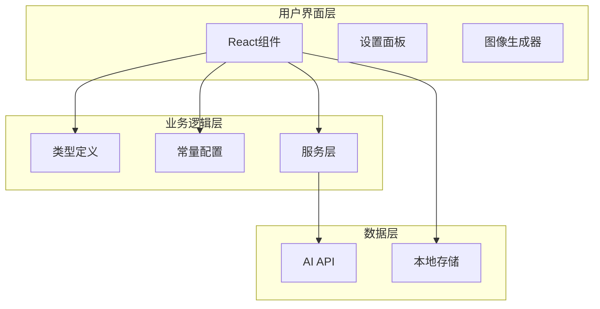
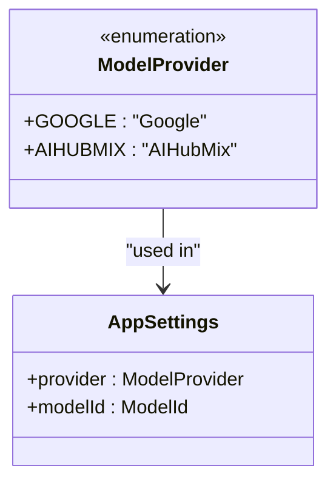
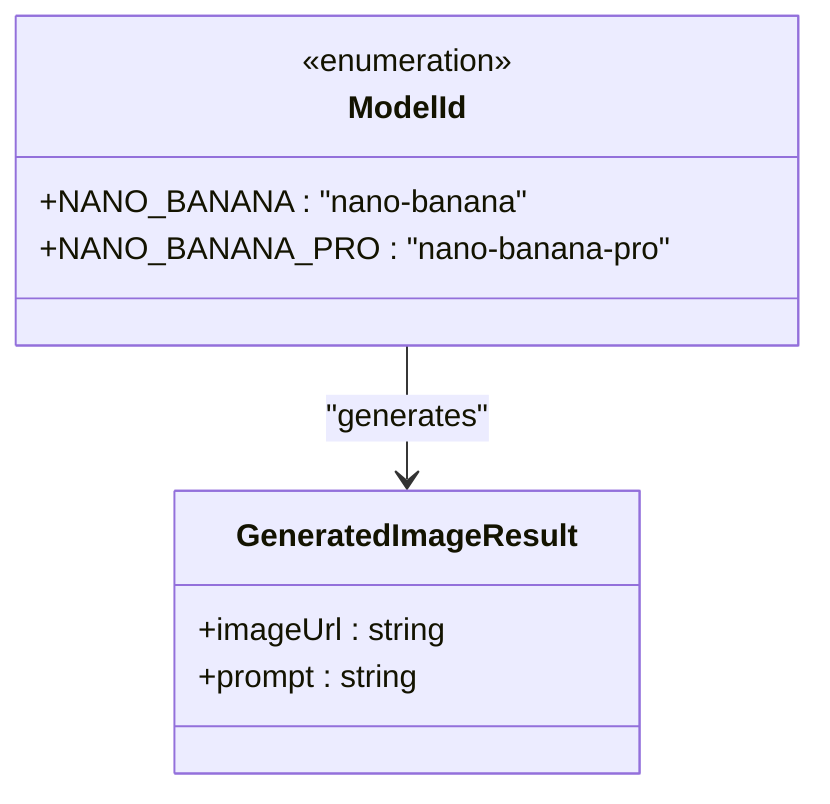
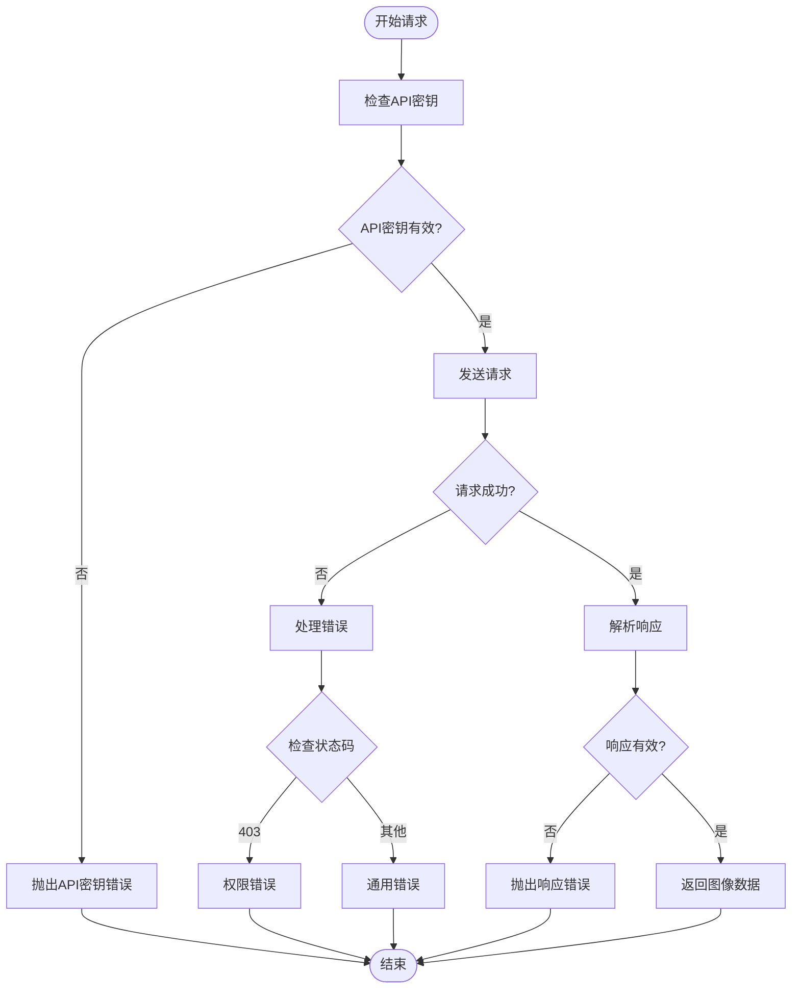
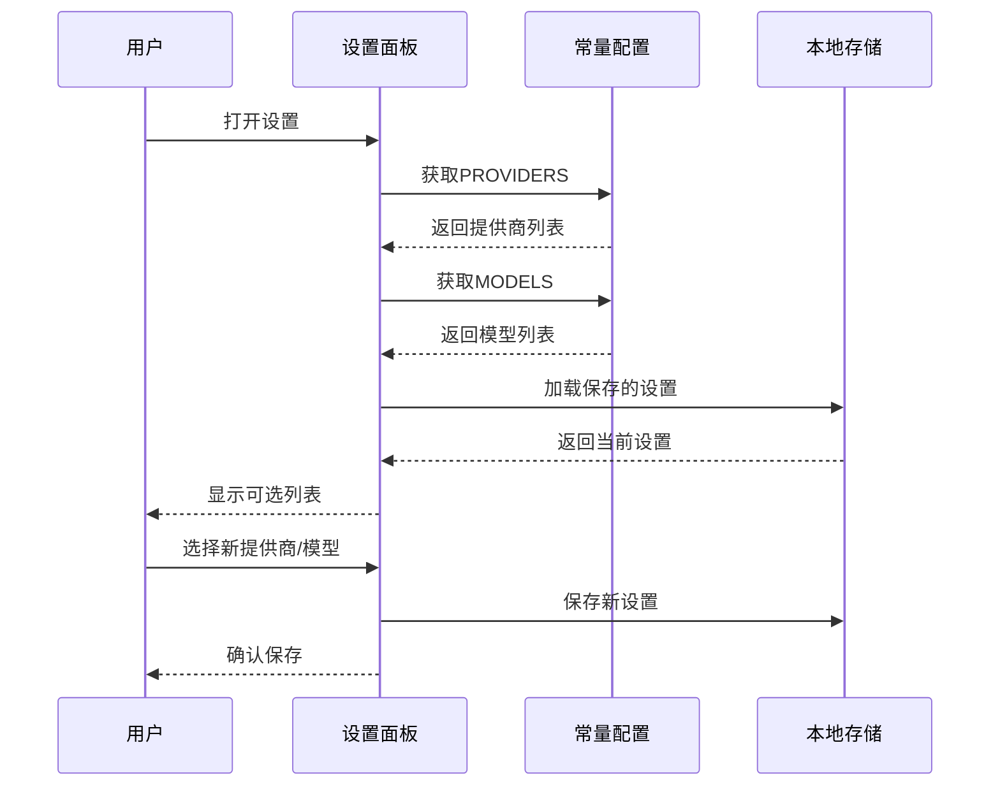
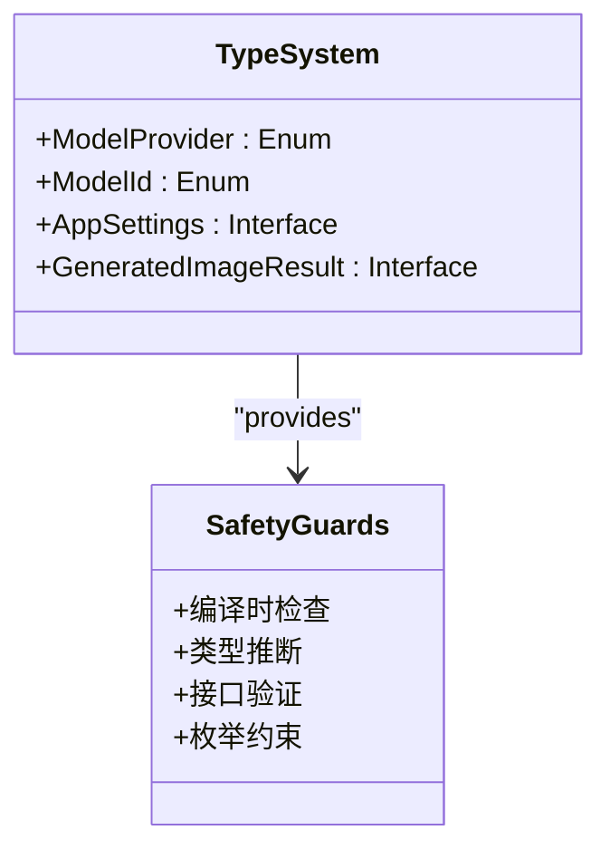
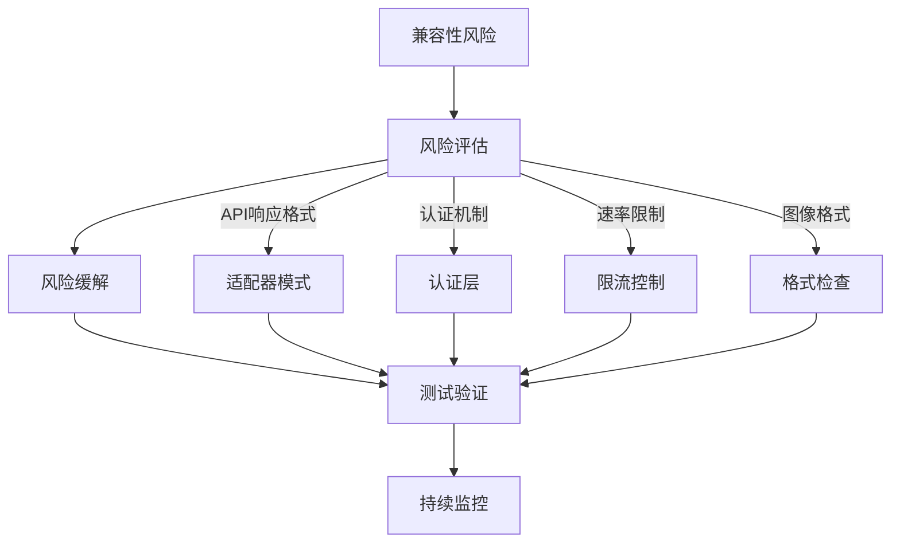

# 功能扩展

<cite>
**本文档中引用的文件**
- [types.ts](file://types.ts)
- [constants.ts](file://constants.ts)
- [services/geminiService.ts](file://services/geminiService.ts)
- [App.tsx](file://App.tsx)
- [components/SettingsBar.tsx](file://components/SettingsBar.tsx)
- [vite.config.ts](file://vite.config.ts)
- [package.json](file://package.json)
- [README.md](file://README.md)
</cite>

## 目录
1. [简介](#简介)
2. [项目架构概览](#项目架构概览)
3. [核心类型系统](#核心类型系统)
4. [扩展模型提供商](#扩展模型提供商)
5. [扩展AI模型](#扩展ai模型)
6. [服务层扩展](#服务层扩展)
7. [UI界面扩展](#ui界面扩展)
8. [环境配置管理](#环境配置管理)
9. [类型安全与最佳实践](#类型安全与最佳实践)
10. [兼容性风险点](#兼容性风险点)
11. [总结](#总结)

## 简介

本文档详细说明了如何扩展BananaCanvas项目以支持新的AI图像生成模型。该项目采用模块化架构设计，通过类型系统确保扩展的类型安全性，同时提供了灵活的服务层抽象来支持多种AI提供商。

## 项目架构概览

BananaCanvas项目采用分层架构设计，主要包含以下核心层次：



**图表来源**
- [App.tsx](file://App.tsx#L1-L137)
- [types.ts](file://types.ts#L1-L56)
- [constants.ts](file://constants.ts#L1-L18)

**章节来源**
- [App.tsx](file://App.tsx#L1-L137)
- [types.ts](file://types.ts#L1-L56)
- [constants.ts](file://constants.ts#L1-L18)

## 核心类型系统

### ModelProvider枚举

`ModelProvider`枚举定义了支持的AI服务提供商：



**图表来源**
- [types.ts](file://types.ts#L2-L5)
- [types.ts](file://types.ts#L36-L39)

### ModelId枚举

`ModelId`枚举定义了具体的AI模型标识符：



**图表来源**
- [types.ts](file://types.ts#L7-L10)
- [types.ts](file://types.ts#L41-L44)

**章节来源**
- [types.ts](file://types.ts#L1-L56)

## 扩展模型提供商

### 添加新的提供商

要添加新的AI服务提供商，需要修改以下文件：

#### 1. 更新types.ts中的ModelProvider枚举

```typescript
// 在enum ModelProvider中添加新的提供商
export enum ModelProvider {
  GOOGLE = 'Google',
  AIHUBMIX = 'AIHubMix',
  NEW_PROVIDER = 'NewProvider'  // 新增提供商
}
```

#### 2. 更新constants.ts中的PROVIDERS数组

```typescript
// 在PROVIDERS数组中添加新的提供商信息
export const PROVIDERS = [
  { id: ModelProvider.GOOGLE, name: 'Google' },
  { id: ModelProvider.AIHUBMIX, name: 'AIHubMix' },
  { id: ModelProvider.NEW_PROVIDER, name: 'New Provider' }  // 新增提供商
];
```

### 新提供商的特殊要求

每个新的提供商可能需要特定的配置参数，例如：
- API密钥格式
- 基础URL配置
- 认证方式
- 请求头设置

**章节来源**
- [types.ts](file://types.ts#L2-L5)
- [constants.ts](file://constants.ts#L3-L6)

## 扩展AI模型

### 添加新的AI模型

#### 1. 更新types.ts中的ModelId枚举

```typescript
// 在enum ModelId中添加新的模型
export enum ModelId {
  NANO_BANANA = 'nano-banana',
  NANO_BANANA_PRO = 'nano-banana-pro',
  NEW_MODEL = 'new-model-id'  // 新增模型
}
```

#### 2. 更新constants.ts中的MODELS数组

```typescript
// 在MODELS数组中添加新的模型信息
export const MODELS = [
  { id: ModelId.NANO_BANANA, name: 'Nano Banana (Flash Image)' },
  { id: ModelId.NANO_BANANA_PRO, name: 'Nano Banana Pro (Pro Image)' },
  { id: ModelId.NEW_MODEL, name: 'New Model Description' }  // 新增模型
];
```

#### 3. 更新MODEL_MAPPING映射

```typescript
// 在MODEL_MAPPING对象中添加新的模型映射
export const MODEL_MAPPING: Record<ModelId, string> = {
  [ModelId.NANO_BANANA]: 'gemini-2.5-flash-image',
  [ModelId.NANO_BANANA_PRO]: 'gemini-3-pro-image-preview',
  [ModelId.NEW_MODEL]: 'new-provider-model-name'  // 新增模型映射
};
```

### 模型映射的重要性

`MODEL_MAPPING`对象将应用内部的`ModelId`映射到实际的API模型名称，这是确保正确调用AI服务的关键机制。

**章节来源**
- [types.ts](file://types.ts#L7-L10)
- [constants.ts](file://constants.ts#L8-L17)

## 服务层扩展

### 扩展generateImageContent函数

`generateImageContent`函数是核心的服务层实现，负责处理所有AI图像生成请求。以下是扩展新提供商的具体步骤：

#### 1. 修改API密钥处理逻辑

```typescript
// 在if-else结构中添加新的提供商分支
if (settings.provider === ModelProvider.NEW_PROVIDER) {
  apiKey = (import.meta as any).env.VITE_NEW_PROVIDER_API_KEY || '';
  baseUrl = (import.meta as any).env.VITE_NEW_PROVIDER_BASE_URL || 'https://api.newprovider.com/v1';
}
```

#### 2. 添加提供商特定的配置

```typescript
// 在generationConfig中添加新提供商的特殊配置
if (settings.provider === ModelProvider.NEW_PROVIDER) {
  generationConfig.responseFormat = 'base64';  // 示例：指定响应格式
  generationConfig.maxTokens = 1000;           // 示例：设置最大令牌数
}
```

#### 3. 实现响应解析逻辑

```typescript
// 在响应解析部分添加新提供商的处理逻辑
if (settings.provider === ModelProvider.NEW_PROVIDER) {
  // 新提供商特有的响应结构解析
  const imageData = response.data.image;
  return `data:image/png;base64,${imageData}`;
}
```

### 错误处理机制

扩展新提供商时需要考虑以下错误处理场景：



**图表来源**
- [services/geminiService.ts](file://services/geminiService.ts#L104-L111)

**章节来源**
- [services/geminiService.ts](file://services/geminiService.ts#L1-L112)

## UI界面扩展

### 设置面板更新

设置面板需要自动识别新增的提供商和模型，无需手动修改代码。这是因为：

1. **动态渲染**：`SettingsBar`组件会根据`PROVIDERS`和`MODELS`常量动态生成选项
2. **类型安全**：TypeScript确保只有有效的提供商和模型才能被选择



**图表来源**
- [components/SettingsBar.tsx](file://components/SettingsBar.tsx#L1-L132)
- [constants.ts](file://constants.ts#L3-L11)

### 环境变量提示

设置面板会显示相应的环境变量配置提示：

```typescript
// 在设置面板中会显示类似这样的提示
<p className="text-xs text-blue-300 mt-2">
  New Provider: <strong>VITE_NEW_PROVIDER_API_KEY</strong><br/>
  Base URL: <strong>VITE_NEW_PROVIDER_BASE_URL</strong>
</p>
```

**章节来源**
- [components/SettingsBar.tsx](file://components/SettingsBar.tsx#L99-L108)

## 环境配置管理

### Vite配置扩展

Vite配置文件已经为现有提供商设置了环境变量：

```typescript
// 在vite.config.ts中定义环境变量
define: {
  'process.env.GEMINI_API_KEY': JSON.stringify(env.GEMINI_API_KEY),
  'process.env.AIHUBMIX_API_KEY': JSON.stringify(env.AIHUBMIX_API_KEY)
}
```

### 新提供商的环境变量

对于新添加的提供商，需要：

1. **更新Vite配置**：在`vite.config.ts`中添加新的环境变量定义
2. **创建.env文件**：在项目根目录创建`.env.local`文件
3. **设置环境变量**：添加相应的API密钥和基础URL

```bash
# .env.local 文件内容示例
VITE_NEW_PROVIDER_API_KEY=your_api_key_here
VITE_NEW_PROVIDER_BASE_URL=https://api.newprovider.com/v1
```

### 环境变量的安全性

项目使用Vite的环境变量加载机制，确保敏感信息不会被硬编码到生产代码中。

**章节来源**
- [vite.config.ts](file://vite.config.ts#L1-L24)
- [README.md](file://README.md#L16-L18)

## 类型安全与最佳实践

### TypeScript类型系统的优势

BananaCanvas项目充分利用了TypeScript的类型系统来确保扩展的安全性：



### 扩展时的最佳实践

1. **保持类型一致性**：新添加的提供商和模型必须符合现有的类型定义
2. **遵循命名约定**：使用一致的命名模式（如`NEW_PROVIDER`和`NEW_MODEL`）
3. **完整的错误处理**：确保所有可能的错误情况都被妥善处理
4. **向后兼容性**：新扩展不应破坏现有功能

### 编译时检查

TypeScript会在编译时检查以下内容：
- 新添加的枚举值是否存在于类型定义中
- 函数参数和返回值是否符合接口定义
- 环境变量是否正确定义

**章节来源**
- [types.ts](file://types.ts#L1-L56)

## 兼容性风险点

### 可能的兼容性问题

在扩展新AI模型时需要注意以下兼容性风险：

#### 1. **API响应格式差异**
不同提供商可能返回不同的响应结构，需要：
- 验证响应格式
- 实现适配器模式
- 提供默认回退机制

#### 2. **认证机制差异**
各提供商可能有不同的认证方式：
- API密钥格式
- 请求头要求
- 认证流程

#### 3. **速率限制和配额**
不同提供商可能有不同的使用限制：
- 请求频率限制
- 并发连接数
- 日/月使用配额

#### 4. **图像格式支持**
各提供商可能支持不同的图像格式：
- PNG、JPEG、WebP等
- 分辨率限制
- 文件大小限制

### 风险缓解策略



### 推荐的扩展检查清单

- [ ] 类型定义完整且正确
- [ ] 环境变量配置正确
- [ ] 错误处理覆盖全面
- [ ] 响应解析逻辑准确
- [ ] 性能影响评估
- [ ] 测试用例覆盖
- [ ] 文档更新完成

## 总结

BananaCanvas项目提供了一个高度模块化和类型安全的框架来支持新的AI图像生成模型。通过遵循本文档提供的扩展指南，开发者可以：

1. **轻松添加新的AI提供商**：只需更新类型定义和常量配置
2. **无缝集成新的AI模型**：利用现有的服务层抽象
3. **保持类型安全**：充分利用TypeScript的类型系统
4. **确保向后兼容**：新扩展不会破坏现有功能
5. **获得良好的用户体验**：UI界面自动适应新添加的选项

这种架构设计使得项目具有良好的可扩展性和维护性，为未来的AI技术发展提供了坚实的基础。