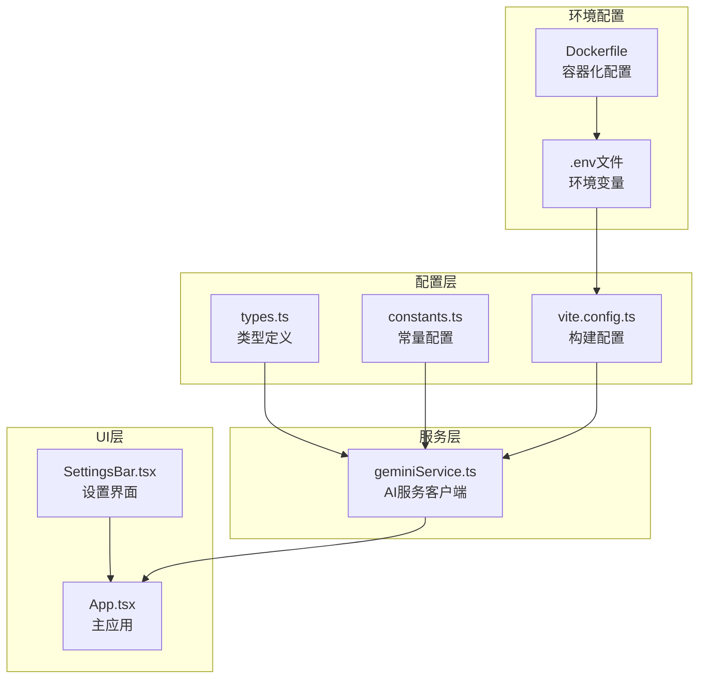
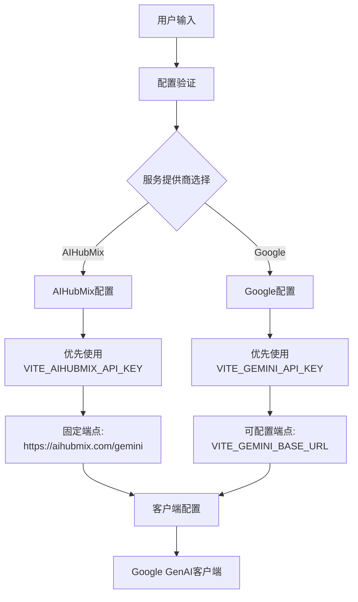
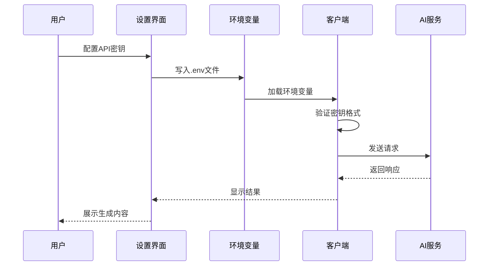
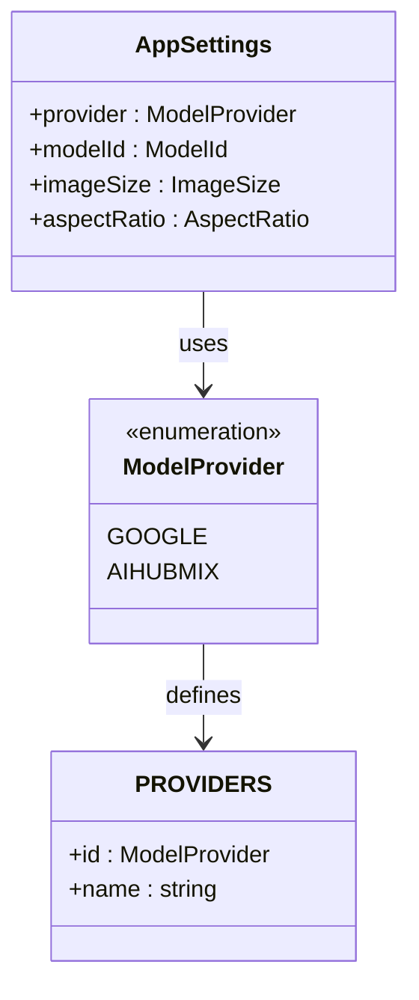
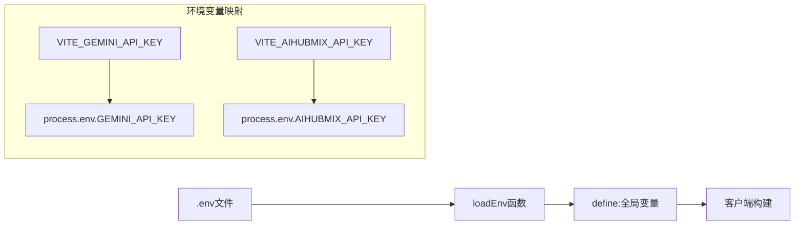
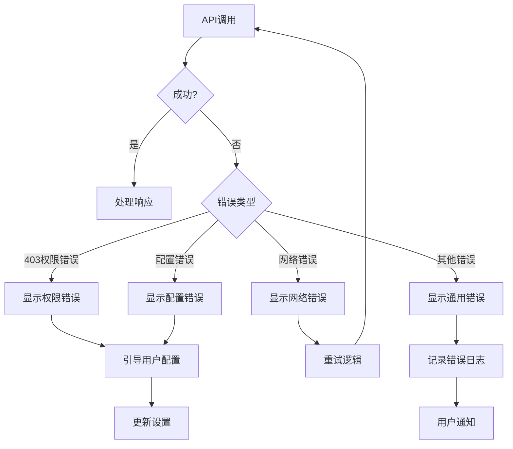

# 客户端配置

<cite>
**本文档引用的文件**
- [geminiService.ts](file://services/geminiService.ts)
- [constants.ts](file://constants.ts)
- [types.ts](file://types.ts)
- [vite.config.ts](file://vite.config.ts)
- [SettingsBar.tsx](file://components/SettingsBar.tsx)
- [App.tsx](file://App.tsx)
- [README.md](file://README.md)
- [package.json](file://package.json)
- [Dockerfile](file://Dockerfile)
</cite>

## 目录
1. [简介](#简介)
2. [项目结构概览](#项目结构概览)
3. [核心配置机制](#核心配置机制)
4. [API密钥管理](#api密钥管理)
5. [服务提供商配置](#服务提供商配置)
6. [模型映射系统](#模型映射系统)
7. [环境变量配置](#环境变量配置)
8. [配置验证与错误处理](#配置验证与错误处理)
9. [添加新服务提供商指南](#添加新服务提供商指南)
10. [最佳实践](#最佳实践)
11. [故障排除](#故障排除)

## 简介

Banana Canvas AI 是一个基于 Google GenAI SDK 的 AI 图像生成应用程序，支持多个 AI 服务提供商。该系统采用模块化的配置机制，允许用户通过环境变量或用户界面配置不同的 API 密钥和服务端点，实现了高度的灵活性和可扩展性。

## 项目结构概览



**图表来源**
- [types.ts](file://types.ts#L1-L61)
- [constants.ts](file://constants.ts#L1-L34)
- [geminiService.ts](file://services/geminiService.ts#L1-L112)
- [vite.config.ts](file://vite.config.ts#L1-L25)

**章节来源**
- [types.ts](file://types.ts#L1-L61)
- [constants.ts](file://constants.ts#L1-L34)
- [geminiService.ts](file://services/geminiService.ts#L1-L112)

## 核心配置机制

### 配置架构设计

系统采用分层配置架构，确保配置的灵活性和安全性：



**图表来源**
- [geminiService.ts](file://services/geminiService.ts#L11-L21)
- [types.ts](file://types.ts#L2-L5)

### 配置优先级链

系统实现了严格的配置优先级机制：

1. **环境变量优先级**：`VITE_AIHUBMIX_API_KEY` > `VITE_GEMINI_API_KEY`
2. **用户设置覆盖**：用户可以在设置界面修改配置
3. **默认值降级**：当主要配置缺失时使用备用方案

**章节来源**
- [geminiService.ts](file://services/geminiService.ts#L11-L21)

## API密钥管理

### 密钥存储策略

系统采用多层密钥管理策略，确保安全性：



**图表来源**
- [SettingsBar.tsx](file://components/SettingsBar.tsx#L100-L108)
- [vite.config.ts](file://vite.config.ts#L13-L17)

### 密钥验证机制

系统实现了多层次的密钥验证：

| 验证层级 | 检查内容 | 错误处理 |
|---------|---------|---------|
| 环境加载 | 检查环境变量是否存在 | 显示配置提示 |
| 格式验证 | 验证密钥格式正确性 | 提供格式指导 |
| 权限测试 | 尝试API调用验证权限 | 显示权限错误 |
| 实际使用 | 在首次请求时验证 | 引导用户重新配置 |

**章节来源**
- [geminiService.ts](file://services/geminiService.ts#L23-L25)
- [App.tsx](file://App.tsx#L36-L45)

## 服务提供商配置

### PROVIDERS 常量定义

系统通过 `PROVIDERS` 数组定义支持的服务提供商：



**图表来源**
- [constants.ts](file://constants.ts#L3-L6)
- [types.ts](file://types.ts#L2-L5)
- [types.ts](file://types.ts#L39-L44)

### AIHubMix 特殊配置

AIHubMix 作为特殊的服务提供商，具有以下特性：

| 配置项 | AIHubMix | Google |
|-------|---------|--------|
| API密钥变量 | `VITE_AIHUBMIX_API_KEY` | `VITE_GEMINI_API_KEY` |
| 基础URL | 固定为 `https://aihubmix.com/gemini` | 可配置 `VITE_GEMINI_BASE_URL` |
| 图像生成配置 | 包含宽高比和尺寸参数 | 标准配置 |
| 兼容性模式 | 使用 `user` 角色内容格式 | 标准内容格式 |

**章节来源**
- [geminiService.ts](file://services/geminiService.ts#L15-L21)
- [geminiService.ts](file://services/geminiService.ts#L64-L76)

## 模型映射系统

### MODEL_MAPPING 常量

系统通过 `MODEL_MAPPING` 对象建立模型ID与实际API模型名称的映射关系：

```mermaid
erDiagram
ModelId {
string NANO_BANANA
string NANO_BANANA_PRO
}
ModelMapping {
string gemini-2.5-flash-image
string gemini-3-pro-image-preview
}
ModelId ||--|| ModelMapping : maps_to
```

**图表来源**
- [constants.ts](file://constants.ts#L30-L33)
- [types.ts](file://types.ts#L7-L10)

### 模型配置选项

系统支持多种图像生成模型：

| 模型ID | API名称 | 特性描述 |
|-------|---------|---------|
| `nano-banana` | `gemini-2.5-flash-image` | 快速图像生成，适合实时应用 |
| `nano-banana-pro` | `gemini-3-pro-image-preview` | 高质量图像生成，适合专业用途 |

**章节来源**
- [constants.ts](file://constants.ts#L8-L11)
- [constants.ts](file://constants.ts#L30-L33)

## 环境变量配置

### Vite 环境变量处理

Vite 配置通过 `loadEnv` 函数加载环境变量：



**图表来源**
- [vite.config.ts](file://vite.config.ts#L6-L17)

### Docker 环境变量注入

Docker 构建过程支持动态环境变量注入：

```bash
# Dockerfile 中的环境变量处理
ARG GEMINI_API_KEY
RUN if [ -n "$GEMINI_API_KEY" ]; then \
    echo "GEMINI_API_KEY=$GEMINI_API_KEY" > .env.local; \
fi
```

**章节来源**
- [vite.config.ts](file://vite.config.ts#L6-L17)
- [Dockerfile](file://Dockerfile#L14-L16)

### 环境变量配置指南

| 服务提供商 | 环境变量名 | 配置要求 |
|-----------|-----------|---------|
| Google Gemini | `VITE_GEMINI_API_KEY` | 必需，有效的Google API密钥 |
| AIHubMix | `VITE_AIHUBMIX_API_KEY` | 必需，有效的AIHubMix API密钥 |
| 自定义端点 | `VITE_GEMINI_BASE_URL` | 可选，用于Google服务的自定义端点 |

**章节来源**
- [README.md](file://README.md#L17-L18)
- [SettingsBar.tsx](file://components/SettingsBar.tsx#L104-L107)

## 配置验证与错误处理

### 错误处理流程

系统实现了完善的错误处理机制：



**图表来源**
- [geminiService.ts](file://services/geminiService.ts#L104-L111)

### API密钥验证

系统在应用启动时验证API密钥的有效性：

```typescript
// 应用启动时的密钥检查
useEffect(() => {
  const hasGeminiKey = !!(import.meta as any).env.VITE_GEMINI_API_KEY;
  const hasAIHubMixKey = !!(import.meta as any).env.VITE_AIHUBMIX_API_KEY;
  
  if (!hasGeminiKey && !hasAIHubMixKey) {
    setShowWelcome(true);
  } else {
    setShowWelcome(false);
  }
}, [settings.provider]);
```

**章节来源**
- [App.tsx](file://App.tsx#L36-L45)
- [geminiService.ts](file://services/geminiService.ts#L23-L25)

## 添加新服务提供商指南

### 扩展步骤

要添加新的服务提供商，需要按照以下步骤操作：

#### 1. 更新 types.ts

```typescript
// 在 ModelProvider 枚举中添加新服务提供商
export enum ModelProvider {
  GOOGLE = 'Google',
  AIHUBMIX = 'AIHubMix',
  NEW_PROVIDER = 'NewProvider'  // 新增服务提供商
}
```

#### 2. 更新 constants.ts

```typescript
// 在 PROVIDERS 数组中添加新服务提供商
export const PROVIDERS = [
  { id: ModelProvider.GOOGLE, name: 'Google' },
  { id: ModelProvider.AIHUBMIX, name: 'AIHubMix' },
  { id: ModelProvider.NEW_PROVIDER, name: 'New Provider' }  // 新增服务提供商
];
```

#### 3. 更新 geminiService.ts

```typescript
// 在配置分支中添加新服务提供商的处理逻辑
if (settings.provider === ModelProvider.NEW_PROVIDER) {
  apiKey = (import.meta as any).env.VITE_NEW_PROVIDER_API_KEY || '';
  baseUrl = (import.meta as any).env.VITE_NEW_PROVIDER_BASE_URL;
} else {
  // 保持原有逻辑
}
```

#### 4. 添加环境变量支持

在 vite.config.ts 中添加新服务提供商的环境变量定义：

```typescript
define: {
  'process.env.NEW_PROVIDER_API_KEY': JSON.stringify(env.NEW_PROVIDER_API_KEY)
}
```

#### 5. 更新设置界面

在 SettingsBar.tsx 中添加新服务提供商的选择选项：

```typescript
{PROVIDERS.map((p) => (
  <button
    key={p.id}
    onClick={() => handleProviderChange(p.id)}
    className={`py-2 px-3 rounded-lg text-sm font-medium border transition-colors ${
      localSettings.provider === p.id
        ? 'bg-banana-500/10 border-banana-500 text-banana-400'
        : 'bg-dark-bg border-dark-border text-slate-400 hover:border-slate-500'
    }`}
  >
    {p.name}
  </button>
))}
```

### 最佳实践示例

以下是一个完整的新增服务提供商示例：

```typescript
// types.ts
export enum ModelProvider {
  GOOGLE = 'Google',
  AIHUBMIX = 'AIHubMix',
  OPENAI = 'OpenAI'  // 新增服务提供商
}

// constants.ts
export const PROVIDERS = [
  { id: ModelProvider.GOOGLE, name: 'Google' },
  { id: ModelProvider.AIHUBMIX, name: 'AIHubMix' },
  { id: ModelProvider.OPENAI, name: 'OpenAI' }  // 新增服务提供商
];

// geminiService.ts
if (settings.provider === ModelProvider.OPENAI) {
  apiKey = (import.meta as any).env.VITE_OPENAI_API_KEY || '';
  baseUrl = (import.meta as any).env.VITE_OPENAI_BASE_URL || 'https://api.openai.com/v1';
} else {
  // 保持原有逻辑
}

// vite.config.ts
define: {
  'process.env.OPENAI_API_KEY': JSON.stringify(env.OPENAI_API_KEY)
}
```

**章节来源**
- [types.ts](file://types.ts#L2-L5)
- [constants.ts](file://constants.ts#L3-L6)
- [geminiService.ts](file://services/geminiService.ts#L15-L21)

## 最佳实践

### API密钥隔离

1. **环境变量分离**：每个服务提供商使用独立的环境变量
2. **访问控制**：限制对敏感配置的访问权限
3. **定期轮换**：建议定期更换API密钥

### 环境变量安全性

1. **版本控制排除**：确保 `.env` 文件不被提交到版本控制系统
2. **本地化配置**：使用 `.env.local` 文件进行本地开发配置
3. **生产环境保护**：在生产环境中使用更安全的密钥管理方案

### 配置可扩展性

1. **模块化设计**：配置逻辑与业务逻辑分离
2. **接口抽象**：通过接口定义支持多种服务提供商
3. **向后兼容**：新功能不影响现有配置

### 错误处理策略

1. **渐进式降级**：当主要服务不可用时自动切换到备用服务
2. **用户友好的错误信息**：提供清晰的配置指导
3. **日志记录**：记录详细的错误信息用于调试

## 故障排除

### 常见问题及解决方案

| 问题 | 症状 | 解决方案 |
|------|------|---------|
| API密钥无效 | 403权限错误 | 检查环境变量配置，确认密钥有效性 |
| 网络连接失败 | 请求超时 | 检查网络连接，验证代理设置 |
| 配置未生效 | 设置更改无效果 | 刷新页面，检查环境变量加载 |
| 模型不可用 | 404错误 | 确认模型ID正确，检查服务提供商状态 |

### 调试技巧

1. **浏览器开发者工具**：检查网络请求和环境变量
2. **控制台日志**：查看详细的错误信息和堆栈跟踪
3. **环境变量验证**：确认所有必需的环境变量已正确设置

### 性能优化

1. **缓存策略**：合理使用浏览器缓存减少重复请求
2. **连接池管理**：优化HTTP连接的复用
3. **异步处理**：使用异步操作避免阻塞主线程

**章节来源**
- [geminiService.ts](file://services/geminiService.ts#L104-L111)
- [App.tsx](file://App.tsx#L51-L62)