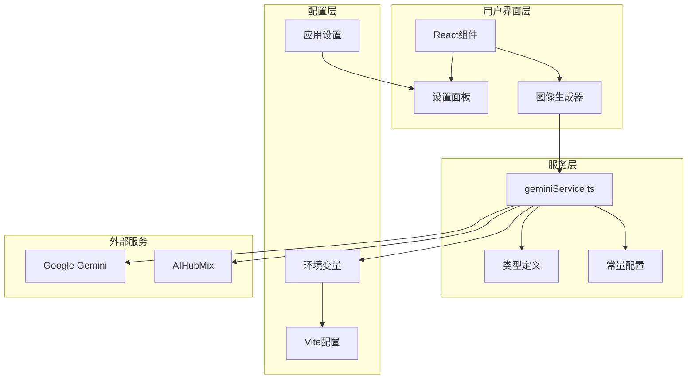
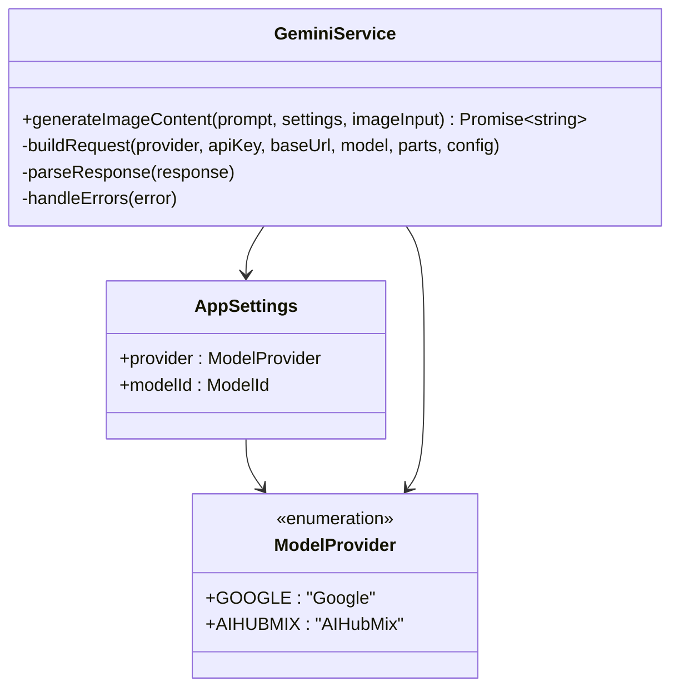
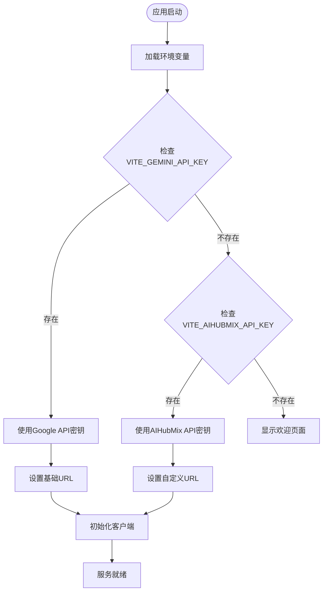
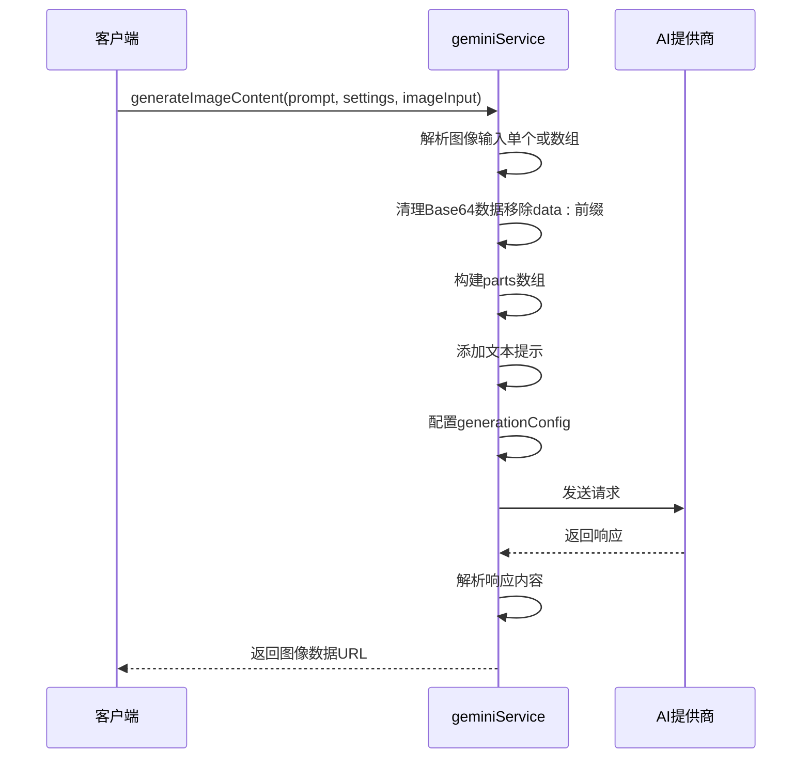
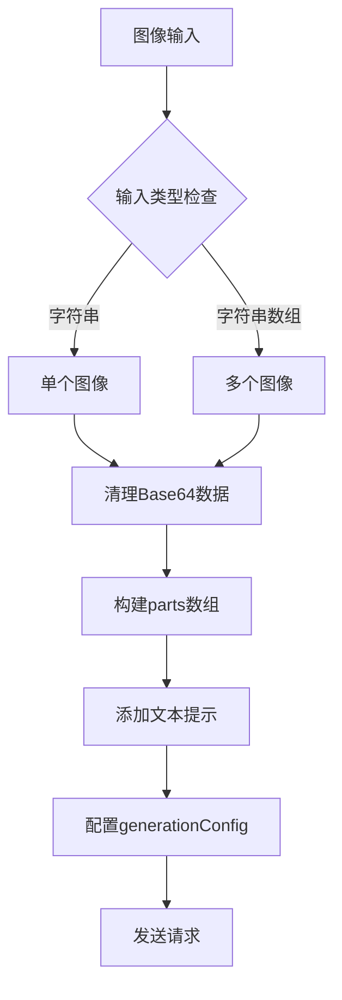
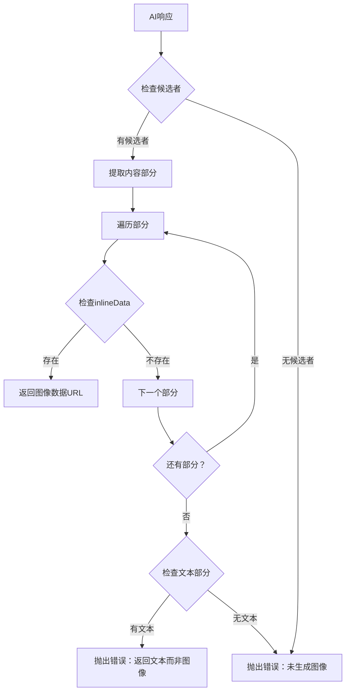
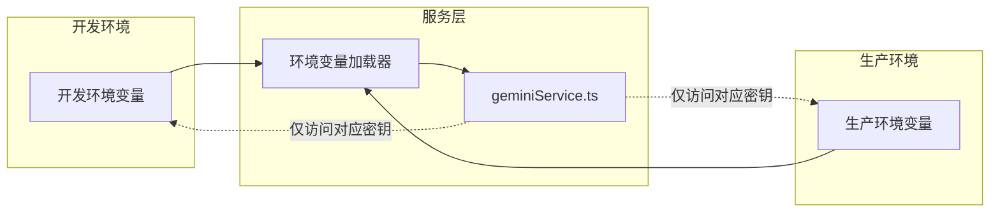

# 服务集成

<cite>
**本文档引用的文件**
- [geminiService.ts](file://services/geminiService.ts)
- [types.ts](file://types.ts)
- [constants.ts](file://constants.ts)
- [App.tsx](file://App.tsx)
- [vite.config.ts](file://vite.config.ts)
- [SimpleGenerator.tsx](file://components/SimpleGenerator.tsx)
- [SettingsBar.tsx](file://components/SettingsBar.tsx)
- [README.md](file://README.md)
</cite>

## 目录
1. [简介](#简介)
2. [项目架构概览](#项目架构概览)
3. [核心服务组件](#核心服务组件)
4. [API密钥管理机制](#api密钥管理机制)
5. [请求构建与处理](#请求构建与处理)
6. [响应解析与错误处理](#响应解析与错误处理)
7. [扩展新服务的指南](#扩展新服务的指南)
8. [最佳实践与安全考虑](#最佳实践与安全考虑)
9. [故障排除指南](#故障排除指南)
10. [总结](#总结)

## 简介

Banana Canvas是一个基于React的AI图像生成应用，支持多个AI服务提供商。本文档深入解析了如何将新的AI服务集成到系统中，重点说明了`generateImageContent`函数的扩展机制，以及如何处理不同服务提供商的API密钥来源、请求格式和响应解析。

该系统采用模块化设计，通过`ModelProvider`枚举区分不同的AI服务提供商，并实现了灵活的服务切换机制。当前支持Google Gemini和AIHubMix两个主要提供商，同时预留了扩展新服务的接口。

## 项目架构概览



**图表来源**
- [App.tsx](file://App.tsx#L1-L137)
- [geminiService.ts](file://services/geminiService.ts#L1-L112)
- [vite.config.ts](file://vite.config.ts#L1-L25)

**章节来源**
- [App.tsx](file://App.tsx#L1-L137)
- [types.ts](file://types.ts#L1-L56)
- [constants.ts](file://constants.ts#L1-L18)

## 核心服务组件

### ModelProvider 枚举系统

系统通过`ModelProvider`枚举定义了支持的服务提供商：



**图表来源**
- [types.ts](file://types.ts#L2-L5)
- [types.ts](file://types.ts#L36-L39)
- [geminiService.ts](file://services/geminiService.ts#L5-L112)

### 服务映射机制

系统通过`MODEL_MAPPING`常量将内部模型ID映射到具体的AI服务模型名称：

| 内部ID | 模型名称 | 描述 |
|--------|----------|------|
| nano-banana | gemini-2.5-flash-image | 快速图像生成模型 |
| nano-banana-pro | gemini-3-pro-image-preview | 高质量图像生成模型 |

**章节来源**
- [constants.ts](file://constants.ts#L14-L17)
- [types.ts](file://types.ts#L7-L10)

## API密钥管理机制

### 环境变量配置

系统采用Vite的环境变量加载机制，支持不同服务提供商的独立API密钥：



**图表来源**
- [geminiService.ts](file://services/geminiService.ts#L11-L25)
- [vite.config.ts](file://vite.config.ts#L6-L17)

### API密钥来源判断逻辑

系统根据`ModelProvider`值动态选择API密钥和基础URL：

```typescript
// 基于提供商判断API密钥来源
if (settings.provider === ModelProvider.AIHUBMIX) {
  apiKey = (import.meta as any).env.VITE_AIHUBMIX_API_KEY || '';
  baseUrl = (import.meta as any).env.VITE_AIHUBMIX_BASE_URL || 'https://aihubmix.com/gemini';
} else {
  apiKey = (import.meta as any).env.VITE_GEMINI_API_KEY || '';
  baseUrl = (import.meta as any).env.VITE_GEMINI_BASE_URL;
}
```

### 自定义baseUrl配置

对于非Google原生服务，系统支持自定义基础URL配置：

| 服务提供商 | 默认基础URL | 环境变量 |
|------------|-------------|----------|
| Google | 未指定（使用默认） | VITE_GEMINI_API_KEY |
| AIHubMix | https://aihubmix.com/gemini | VITE_AIHUBMIX_API_KEY, VITE_AIHUBMIX_BASE_URL |

**章节来源**
- [geminiService.ts](file://services/geminiService.ts#L15-L21)
- [vite.config.ts](file://vite.config.ts#L14-L16)

## 请求构建与处理

### 多部分输入处理

系统支持文本提示和图像输入的组合处理，支持单个或多个图像：



**图表来源**
- [geminiService.ts](file://services/geminiService.ts#L36-L82)

### 图像处理流程

系统对图像输入进行标准化处理：



**图表来源**
- [geminiService.ts](file://services/geminiService.ts#L39-L59)

### generationConfig差异化配置

不同服务提供商可以配置特定的生成参数：

```typescript
// AIHubMix特有配置
if (settings.provider === ModelProvider.AIHUBMIX) {
  generationConfig.responseModalities = ['TEXT', 'IMAGE'];
  generationConfig.imageConfig = {
    aspectRatio: "1:1",
    imageSize: "1K"
  };
}
```

### 请求格式适配

系统根据服务提供商调整请求格式：

| 属性 | Google | AIHubMix |
|------|--------|----------|
| 角色字段 | 无 | 必需（role: 'user'） |
| 响应模态 | 默认 | TEXT, IMAGE |
| 图像配置 | 无 | 特定参数 |

**章节来源**
- [geminiService.ts](file://services/geminiService.ts#L62-L76)
- [geminiService.ts](file://services/geminiService.ts#L65-L71)

## 响应解析与错误处理

### inlineData提取逻辑

系统从响应中提取内联图像数据：



**图表来源**
- [geminiService.ts](file://services/geminiService.ts#L85-L101)

### 错误状态码处理

系统实现了专门的错误处理机制：

```typescript
// 特殊403错误处理
if (error.status === 403 || (error.message && error.message.includes('403'))) {
  throw new Error("Permission Denied (403). Please select a valid API Key in Config.");
}
```

### 异常捕获策略

系统提供了多层次的错误处理：

| 错误类型 | 处理方式 | 用户反馈 |
|----------|----------|----------|
| API密钥缺失 | 抛出明确错误 | 提示配置API密钥 |
| 权限拒绝(403) | 显示重认证按钮 | 引导重新授权 |
| 图像生成失败 | 抛出具体错误 | 显示失败原因 |
| 网络错误 | 统一错误处理 | 通用错误消息 |

**章节来源**
- [geminiService.ts](file://services/geminiService.ts#L104-L111)
- [SimpleGenerator.tsx](file://components/SimpleGenerator.tsx#L37-L47)

## 扩展新服务的指南

### 实现步骤

要扩展新的AI服务提供商，需要遵循以下步骤：

#### 1. 更新类型定义

```typescript
// 在types.ts中添加新的提供商
export enum ModelProvider {
  GOOGLE = 'Google',
  AIHUBMIX = 'AIHubMix',
  NEW_PROVIDER = 'NewProvider' // 新增
}
```

#### 2. 更新常量配置

```typescript
// 在constants.ts中添加新提供商
export const PROVIDERS = [
  { id: ModelProvider.GOOGLE, name: 'Google' },
  { id: ModelProvider.AIHUBMIX, name: 'AIHubMix' },
  { id: ModelProvider.NEW_PROVIDER, name: 'New Provider' } // 新增
];
```

#### 3. 修改服务实现

```typescript
// 在generateImageContent函数中添加新提供商逻辑
if (settings.provider === ModelProvider.NEW_PROVIDER) {
  apiKey = (import.meta as any).env.VITE_NEW_PROVIDER_API_KEY || '';
  baseUrl = (import.meta as any).env.VITE_NEW_PROVIDER_BASE_URL || 'https://api.newprovider.com/v1';
  
  // 新提供商特有的generationConfig
  generationConfig = {
    customParameter: 'customValue',
    // 其他特定参数
  };
}
```

#### 4. 更新UI组件

```typescript
// 在SettingsBar.tsx中添加新提供商选项
{PROVIDERS.map((p) => (
  <button
    key={p.id}
    onClick={() => handleProviderChange(p.id)}
    className={`py-2 px-3 rounded-lg text-sm font-medium border transition-colors ${
      localSettings.provider === p.id
        ? 'bg-banana-500/10 border-banana-500 text-banana-400'
        : 'bg-dark-bg border-dark-border text-slate-400 hover:border-slate-500'
    }`}
  >
    {p.name}
  </button>
))}
```

### MIME类型处理示例

```typescript
// 处理不同MIME类型的图像输入
const processImage = (imageData: string) => {
  // 移除data URL前缀
  const base64Data = imageData.split(',')[1] || imageData;
  
  // 根据实际MIME类型设置
  const mimeType = detectMimeType(imageData);
  
  return {
    inlineData: {
      data: base64Data,
      mimeType: mimeType || 'image/png'
    }
  };
};
```

### 错误状态码处理示例

```typescript
// 扩展错误处理逻辑
const handleError = (error: any) => {
  switch (true) {
    case error.status === 403:
      throw new Error("权限被拒绝，请检查API密钥");
    case error.status === 429:
      throw new Error("请求过于频繁，请稍后重试");
    case error.status === 500:
      throw new Error("服务器内部错误，请联系支持");
    default:
      throw new Error(error.message || "生成失败");
  }
};
```

**章节来源**
- [types.ts](file://types.ts#L2-L5)
- [constants.ts](file://constants.ts#L3-L6)
- [geminiService.ts](file://services/geminiService.ts#L15-L21)

## 最佳实践与安全考虑

### API密钥隔离

系统实现了严格的API密钥隔离机制：



**图表来源**
- [vite.config.ts](file://vite.config.ts#L14-L16)
- [geminiService.ts](file://services/geminiService.ts#L15-L21)

### 安全最佳实践

1. **API密钥隔离**：每个服务提供商使用独立的环境变量
2. **运行时验证**：在运行时检查API密钥是否存在
3. **错误信息脱敏**：避免在错误消息中暴露敏感信息
4. **HTTPS强制**：确保所有API调用使用HTTPS协议

### 接口兼容性

系统设计保持了良好的接口兼容性：

| 特性 | 当前实现 | 扩展建议 |
|------|----------|----------|
| 函数签名 | generateImageContent(prompt, settings, imageInput?) | 保持向后兼容 |
| 返回类型 | Promise\<string\> | 支持多种返回格式 |
| 错误处理 | 统一错误对象 | 扩展错误分类 |
| 配置参数 | generationConfig | 支持动态配置 |

### 性能优化

1. **请求缓存**：对于相同的输入参数，考虑实现请求缓存
2. **并发控制**：限制同时进行的API调用数量
3. **超时处理**：为API调用设置合理的超时时间
4. **重试机制**：实现指数退避的重试策略

**章节来源**
- [geminiService.ts](file://services/geminiService.ts#L23-L25)
- [geminiService.ts](file://services/geminiService.ts#L104-L111)

## 故障排除指南

### 常见问题及解决方案

#### 1. API密钥配置错误

**症状**：出现"API Key is missing"错误
**解决方案**：
- 检查`.env`文件中的环境变量
- 确认环境变量名称正确（VITE_GEMINI_API_KEY或VITE_AIHUBMIX_API_KEY）
- 重启开发服务器使更改生效

#### 2. 权限拒绝(403)错误

**症状**：出现"Permission Denied (403)"错误
**解决方案**：
- 检查API密钥的有效性
- 确认账户有足够的配额
- 使用正确的API密钥（注意区分Google和AIHubMix）

#### 3. 图像生成失败

**症状**：出现"No image generated"错误
**解决方案**：
- 检查提示词的清晰度和相关性
- 确认图像输入格式正确
- 尝试简化请求参数

#### 4. CORS跨域问题

**症状**：网络请求被阻止
**解决方案**：
- 确认服务提供商支持CORS
- 检查代理配置
- 使用正确的基础URL

### 调试技巧

1. **启用详细日志**：在开发环境中启用详细的错误日志
2. **网络监控**：使用浏览器开发者工具监控API请求
3. **环境验证**：在终端中直接测试环境变量
4. **服务健康检查**：定期检查API服务的可用性

**章节来源**
- [geminiService.ts](file://services/geminiService.ts#L104-L111)
- [App.tsx](file://App.tsx#L34-L42)

## 总结

Banana Canvas的AI服务集成系统展现了现代Web应用中多服务提供商支持的最佳实践。通过模块化的架构设计、灵活的配置机制和完善的错误处理，系统成功地实现了：

1. **可扩展的架构**：通过`ModelProvider`枚举和工厂模式，轻松支持新服务提供商的添加
2. **安全的密钥管理**：实现了严格的API密钥隔离和运行时验证
3. **灵活的请求处理**：支持多部分输入和差异化配置
4. **健壮的错误处理**：提供了多层次的错误捕获和用户友好的错误信息
5. **良好的用户体验**：通过直观的UI和及时的状态反馈

该系统为AI服务集成提供了一个可参考的框架，其设计理念和实现方式可以应用于类似的多服务提供商应用场景。随着AI技术的发展和新服务提供商的出现，这套架构能够平滑地适应变化，为用户提供持续稳定的服务体验。