# 请求与响应处理

<cite>
**本文档中引用的文件**
- [geminiService.ts](file://services/geminiService.ts)
- [types.ts](file://types.ts)
- [constants.ts](file://constants.ts)
- [SimpleGenerator.tsx](file://components/SimpleGenerator.tsx)
- [MoodBoard.tsx](file://components/MoodBoard.tsx)
- [App.tsx](file://App.tsx)
- [README.md](file://README.md)
</cite>

## 目录
1. [简介](#简介)
2. [项目结构概览](#项目结构概览)
3. [核心组件分析](#核心组件分析)
4. [架构概览](#架构概览)
5. [详细组件分析](#详细组件分析)
6. [依赖关系分析](#依赖关系分析)
7. [性能考虑](#性能考虑)
8. [故障排除指南](#故障排除指南)
9. [结论](#结论)

## 简介

本文档全面解析了BananaCanvase项目中`geminiService.ts`文件中`generateImageContent`函数的请求构造与响应处理流程。该函数是整个应用的核心AI图像生成功能，支持多种图像输入模式、差异化配置策略以及健壮的错误处理机制。

该服务实现了复杂的多部分（multipart）请求构建，能够统一处理单个或多个图像输入，同时针对不同AI提供商（Google和AIHubMix）提供差异化的配置策略。函数还包含了完整的响应解析逻辑、错误处理机制和用户友好的错误消息转换。

## 项目结构概览

BananaCanvase是一个基于React的AI图像生成应用，采用模块化架构设计：

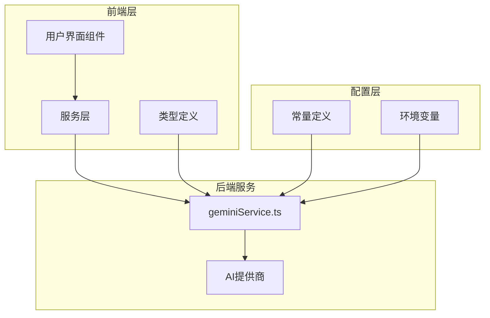

**图表来源**
- [geminiService.ts](file://services/geminiService.ts#L1-L112)
- [types.ts](file://types.ts#L1-L61)
- [constants.ts](file://constants.ts#L1-L34)

**章节来源**
- [geminiService.ts](file://services/geminiService.ts#L1-L112)
- [types.ts](file://types.ts#L1-L61)
- [constants.ts](file://constants.ts#L1-L34)

## 核心组件分析

### generateImageContent函数架构

`generateImageContent`函数是整个AI图像生成系统的核心，其架构设计体现了以下关键特性：

1. **多提供商支持**：统一处理Google和AIHubMix两个不同的AI提供商
2. **灵活的输入处理**：支持单个字符串或字符串数组作为图像输入
3. **差异化配置**：根据提供商类型应用特定的生成配置
4. **健壮的错误处理**：提供详细的错误诊断和用户友好的错误消息

### 数据流架构

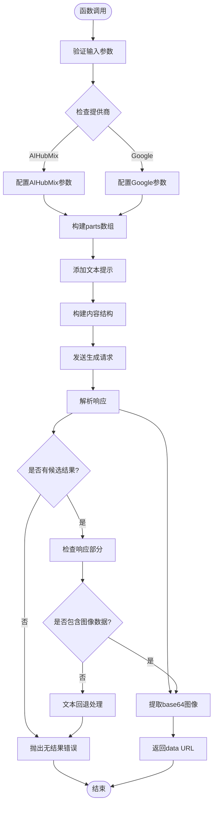

**图表来源**
- [geminiService.ts](file://services/geminiService.ts#L5-L112)

**章节来源**
- [geminiService.ts](file://services/geminiService.ts#L5-L112)

## 架构概览

### 多提供商架构设计

系统采用统一接口支持多个AI提供商，通过配置驱动的方式实现差异化处理：

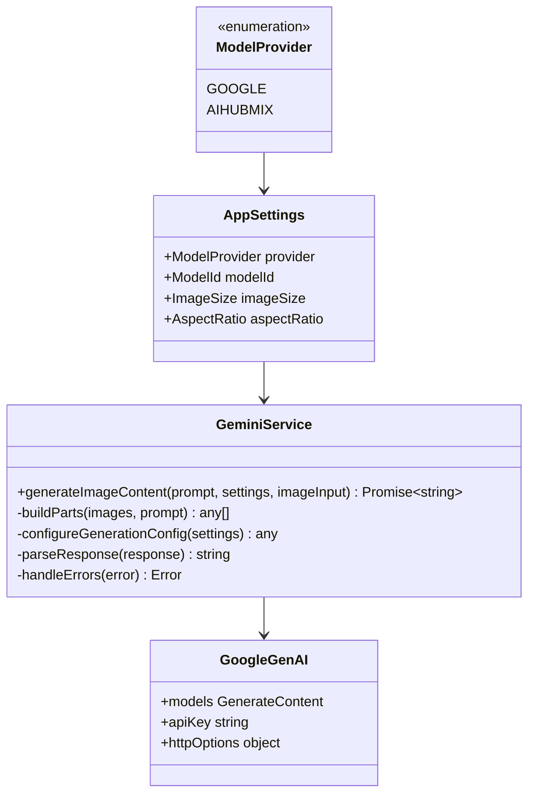

**图表来源**
- [types.ts](file://types.ts#L2-L5)
- [types.ts](file://types.ts#L39-L44)
- [geminiService.ts](file://services/geminiService.ts#L5-L112)

### 输入处理流程

系统支持灵活的图像输入处理，能够统一处理单个或多个图像源：

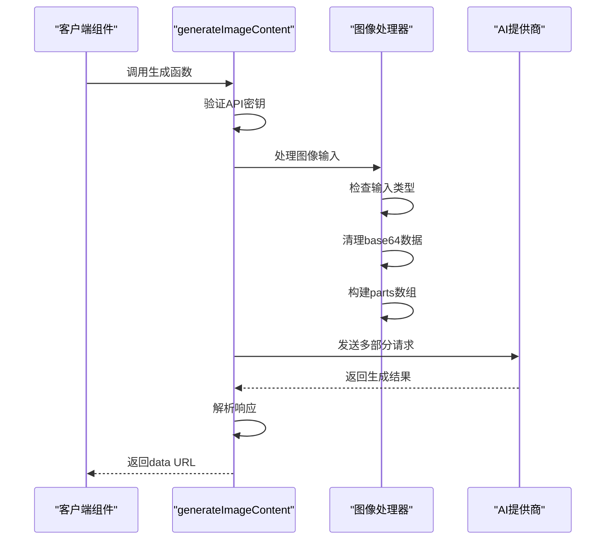

**图表来源**
- [geminiService.ts](file://services/geminiService.ts#L40-L85)
- [SimpleGenerator.tsx](file://components/SimpleGenerator.tsx#L32-L50)

**章节来源**
- [geminiService.ts](file://services/geminiService.ts#L40-L85)
- [SimpleGenerator.tsx](file://components/SimpleGenerator.tsx#L32-L50)

## 详细组件分析

### 多部分请求构建

#### 图像输入统一处理

函数首先处理图像输入，支持单个字符串或字符串数组：

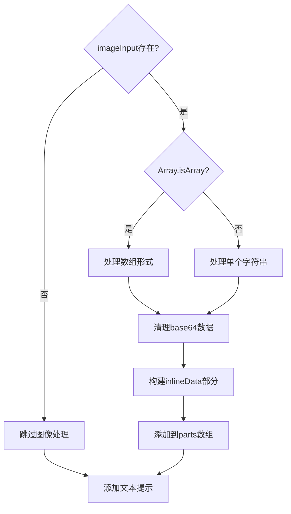

**图表来源**
- [geminiService.ts](file://services/geminiService.ts#L40-L53)

#### base64数据清理机制

函数实现了智能的base64数据清理，自动移除data URL前缀：

| 输入格式 | 清理前示例 | 清理后示例 | 处理方式 |
|---------|-----------|-----------|----------|
| 带前缀 | `data:image/png;base64,iVBORw0KGgoAAAANS` | `iVBORw0KGgoAAAANS` | `split(',')[1]` |
| 无前缀 | `iVBORw0KGgoAAAANS` | `iVBORw0KGgoAAAANS` | 直接使用 |
| 空值 | `undefined` | `undefined` | 保持不变 |

**章节来源**
- [geminiService.ts](file://services/geminiService.ts#L44-L46)

### 差异化配置策略

#### generationConfig配置

系统为不同提供商提供差异化的配置策略：

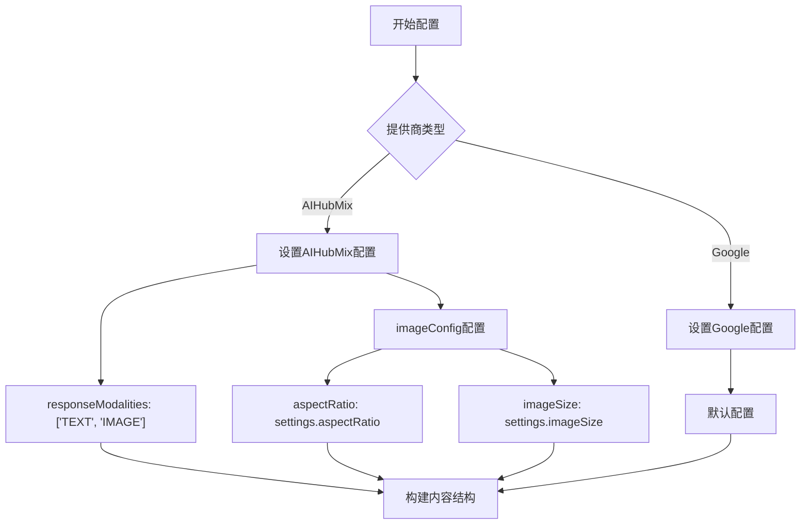

**图表来源**
- [geminiService.ts](file://services/geminiService.ts#L61-L76)

#### AIHubMix特有配置参数

AIHubMix提供商支持独特的配置参数：

| 参数名 | 类型 | 描述 | 默认值 |
|--------|------|------|--------|
| responseModalities | string[] | 响应模态类型 | ['TEXT', 'IMAGE'] |
| imageConfig.aspectRatio | AspectRatio | 图像宽高比 | settings.aspectRatio |
| imageConfig.imageSize | ImageSize | 图像分辨率 | settings.imageSize |

**章节来源**
- [geminiService.ts](file://services/geminiService.ts#L65-L70)
- [constants.ts](file://constants.ts#L14-L27)

### 响应解析逻辑

#### 候选结果处理

函数实现了多层次的响应解析逻辑：

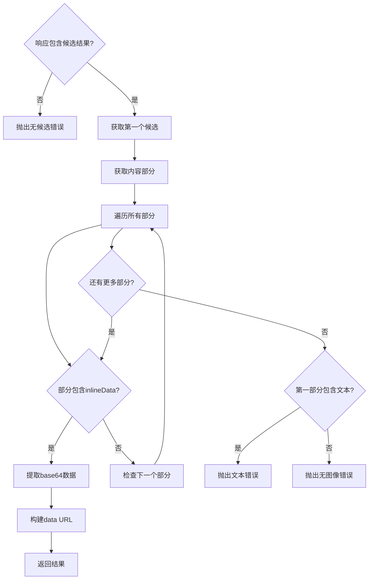

**图表来源**
- [geminiService.ts](file://services/geminiService.ts#L84-L103)

#### 图像数据提取

响应解析过程确保正确提取base64图像数据：

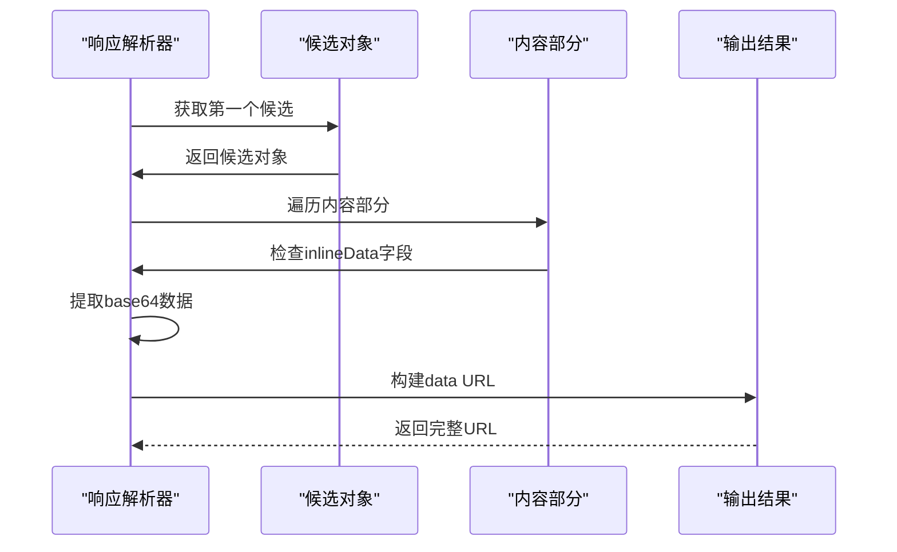

**图表来源**
- [geminiService.ts](file://services/geminiService.ts#L89-L91)

### 错误处理机制

#### 权限拒绝特殊处理

系统实现了专门的403错误处理机制：

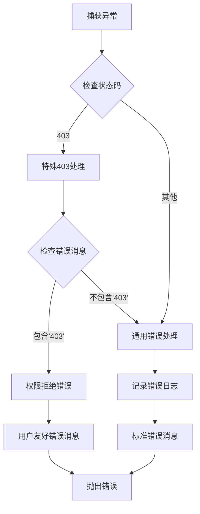

**图表来源**
- [geminiService.ts](file://services/geminiService.ts#L104-L111)

#### 错误分类与处理

| 错误类型 | 检测方式 | 处理策略 | 用户反馈 |
|---------|---------|---------|---------|
| 403权限错误 | `error.status === 403` 或 `error.message.includes('403')` | 特殊权限错误处理 | "Permission Denied (403). Please select a valid API Key in Config." |
| API密钥缺失 | `!apiKey` | 配置错误提示 | "API Key for {provider} is missing. Please configure it in .env file." |
| 生成失败 | 其他异常 | 通用错误处理 | "Failed to generate image." |

**章节来源**
- [geminiService.ts](file://services/geminiService.ts#L104-L111)

## 依赖关系分析

### 组件耦合关系

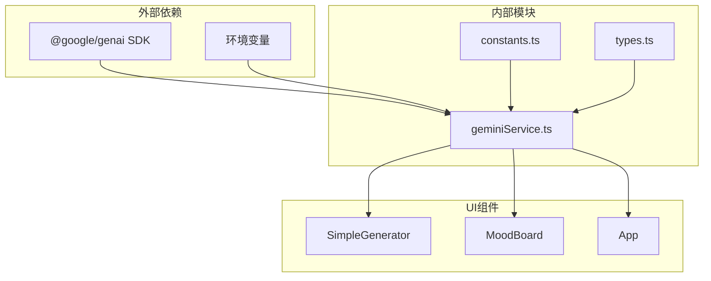

**图表来源**
- [geminiService.ts](file://services/geminiService.ts#L1-L4)
- [constants.ts](file://constants.ts#L1-L34)
- [types.ts](file://types.ts#L1-L61)

### 接口契约

系统通过明确定义的接口确保组件间的松耦合：

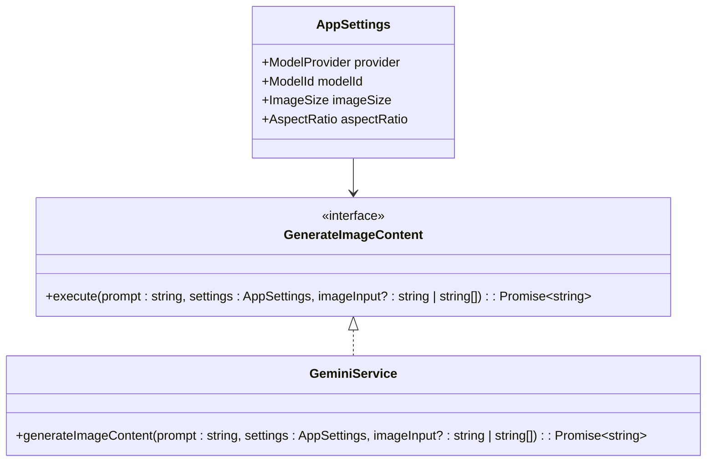

**图表来源**
- [types.ts](file://types.ts#L39-L44)
- [geminiService.ts](file://services/geminiService.ts#L5-L8)

**章节来源**
- [geminiService.ts](file://services/geminiService.ts#L1-L112)
- [types.ts](file://types.ts#L1-L61)
- [constants.ts](file://constants.ts#L1-L34)

## 性能考虑

### 请求优化策略

1. **延迟初始化**：仅在需要时创建GoogleGenAI实例
2. **条件配置**：仅在必要时应用差异化配置
3. **内存管理**：及时释放大型图像数据的内存占用

### 错误恢复机制

系统实现了多层次的错误恢复策略：
- 自动重试机制（可通过扩展实现）
- 用户友好的错误消息转换
- 优雅的降级处理

## 故障排除指南

### 常见问题诊断

#### API密钥配置问题

**症状**：`API Key for {provider} is missing. Please configure it in .env file.`

**解决方案**：
1. 检查`.env`文件中的API密钥配置
2. 确认环境变量名称正确：`VITE_GEMINI_API_KEY`或`VITE_AIHUBMIX_API_KEY`
3. 重启开发服务器使配置生效

#### 权限拒绝错误

**症状**：`Permission Denied (403). Please select a valid API Key in Config.`

**解决方案**：
1. 验证API密钥的有效性
2. 检查API配额限制
3. 确认网络连接正常

#### 图像生成失败

**症状**：`No image generated.` 或 `Model returned text instead of image`

**解决方案**：
1. 检查提示词的清晰度和具体性
2. 验证图像输入的质量和格式
3. 尝试简化生成请求

**章节来源**
- [geminiService.ts](file://services/geminiService.ts#L23-L25)
- [geminiService.ts](file://services/geminiService.ts#L107-L109)
- [geminiService.ts](file://services/geminiService.ts#L102-L103)

## 结论

`generateImageContent`函数展现了现代AI服务集成的最佳实践，通过以下关键特性实现了高质量的图像生成功能：

1. **统一的多提供商支持**：通过配置驱动的方式优雅地处理不同AI提供商的差异
2. **灵活的输入处理**：智能的图像输入处理和base64数据清理机制
3. **差异化配置策略**：针对特定提供商的优化配置参数
4. **健壮的错误处理**：多层次的错误检测和用户友好的错误消息
5. **高效的响应解析**：精确的图像数据提取和格式转换

该实现不仅满足了当前的功能需求，还为未来的扩展和优化提供了良好的架构基础。通过模块化的设计和清晰的接口定义，系统具备了良好的可维护性和可扩展性。