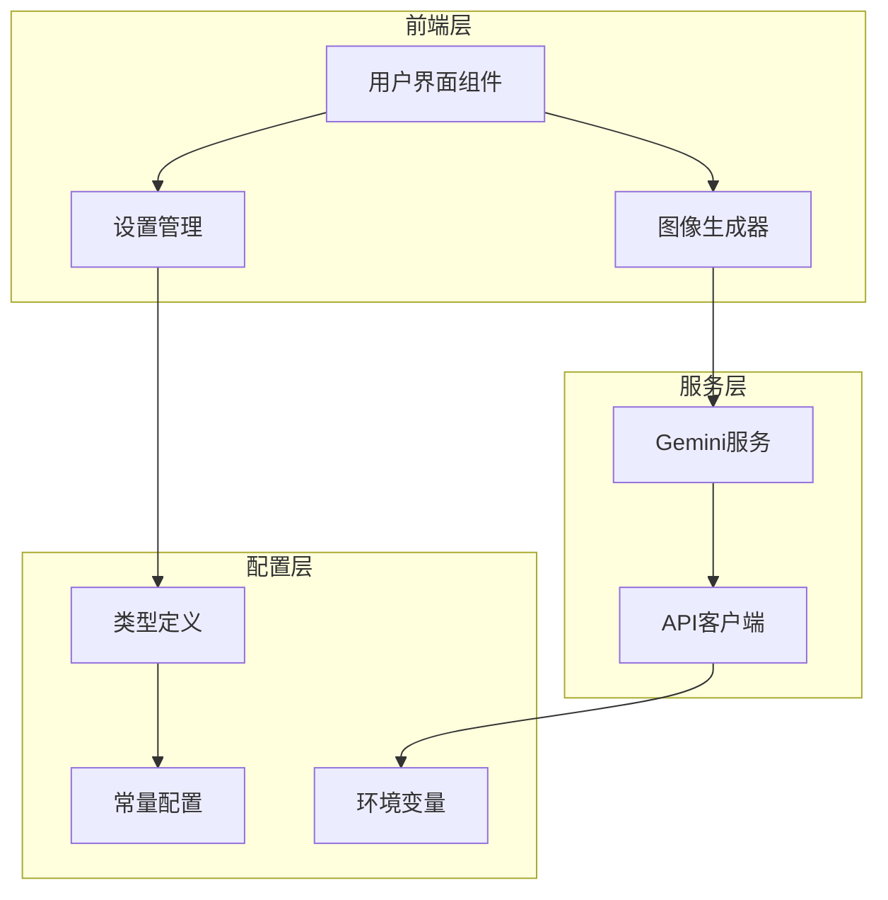
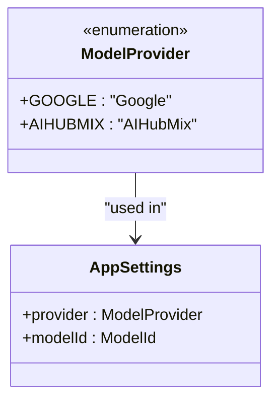
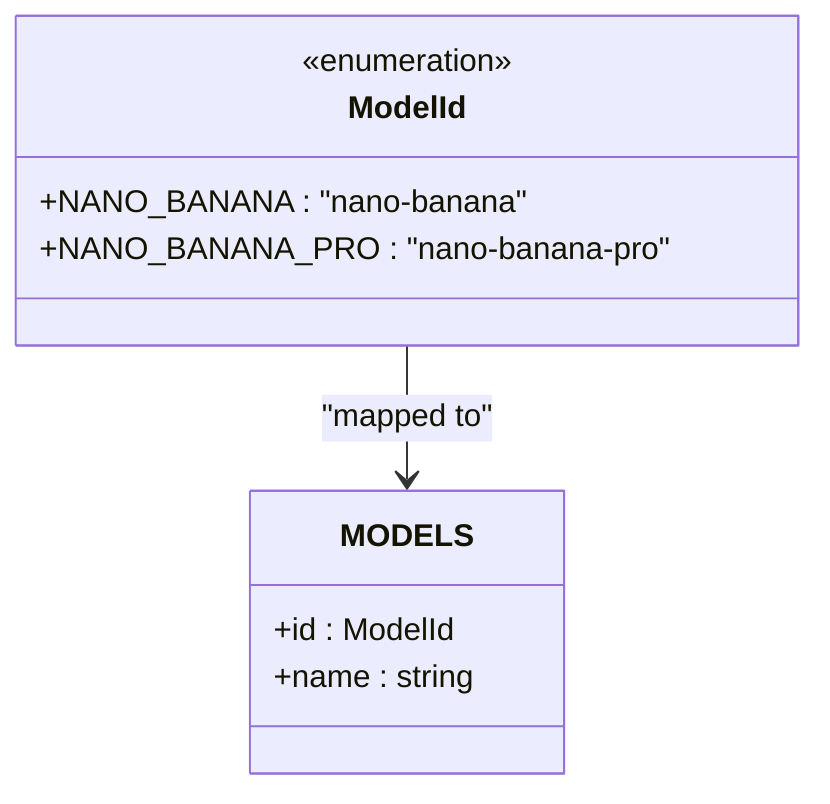
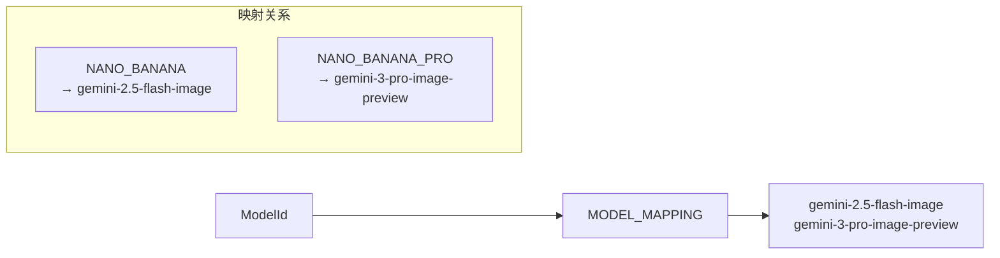
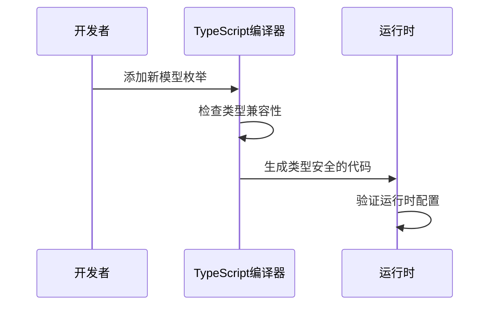

# 模型注册

<cite>
**本文档中引用的文件**
- [types.ts](file://types.ts)
- [constants.ts](file://constants.ts)
- [services/geminiService.ts](file://services/geminiService.ts)
- [components/SettingsBar.tsx](file://components/SettingsBar.tsx)
- [components/SimpleGenerator.tsx](file://components/SimpleGenerator.tsx)
- [App.tsx](file://App.tsx)
- [vite.config.ts](file://vite.config.ts)
</cite>

## 目录
1. [简介](#简介)
2. [项目架构概览](#项目架构概览)
3. [核心数据结构](#核心数据结构)
4. [模型注册流程](#模型注册流程)
5. [详细配置步骤](#详细配置步骤)
6. [类型安全保证](#类型安全保证)
7. [常见问题与解决方案](#常见问题与解决方案)
8. [最佳实践](#最佳实践)
9. [总结](#总结)

## 简介

BananaCanvase是一个基于React的AI图像生成应用，支持多种AI服务提供商。本指南详细说明了如何向项目中注册新的AI图像生成模型，包括枚举定义、常量配置、类型安全保证等关键环节。

## 项目架构概览

项目采用模块化架构设计，主要包含以下核心组件：



**图表来源**
- [App.tsx](file://App.tsx#L1-L137)
- [services/geminiService.ts](file://services/geminiService.ts#L1-L112)
- [types.ts](file://types.ts#L1-L56)

## 核心数据结构

### ModelProvider 枚举

`ModelProvider`枚举定义了支持的AI服务提供商：



**图表来源**
- [types.ts](file://types.ts#L2-L5)

### ModelId 枚举

`ModelId`枚举定义了可用的AI模型标识符：



**图表来源**
- [types.ts](file://types.ts#L7-L10)
- [constants.ts](file://constants.ts#L8-L11)

### MODEL_MAPPING 配置

模型映射关系确保了枚举值与实际API模型名称的一致性：



**图表来源**
- [constants.ts](file://constants.ts#L14-L17)

**章节来源**
- [types.ts](file://types.ts#L1-L56)
- [constants.ts](file://constants.ts#L1-L18)

## 模型注册流程

### 第一步：更新类型定义

在[`types.ts`](file://types.ts)中添加新的模型标识符：

```typescript
// 在ModelId枚举中添加新模型
export enum ModelId {
  NANO_BANANA = 'nano-banana',
  NANO_BANANA_PRO = 'nano-banana-pro',
  NEW_MODEL = 'new-model-id'  // 新增模型
}
```

### 第二步：配置模型信息

在[`constants.ts`](file://constants.ts)中添加模型详细信息：

```typescript
// 在MODELS数组中添加新模型
export const MODELS = [
  { id: ModelId.NANO_BANANA, name: 'Nano Banana (Flash Image)' },
  { id: ModelId.NANO_BANANA_PRO, name: 'Nano Banana Pro (Pro Image)' },
  { id: ModelId.NEW_MODEL, name: 'New Model Description' }  // 新增模型信息
];
```

### 第三步：建立模型映射

在[`constants.ts`](file://constants.ts)中添加模型映射关系：

```typescript
// 在MODEL_MAPPING对象中添加新映射
export const MODEL_MAPPING: Record<ModelId, string> = {
  [ModelId.NANO_BANANA]: 'gemini-2.5-flash-image',
  [ModelId.NANO_BANANA_PRO]: 'gemini-3-pro-image-preview',
  [ModelId.NEW_MODEL]: 'new-api-model-name'  // 新增映射
};
```

### 第四步：更新环境变量配置

在[`vite.config.ts`](file://vite.config.ts)中添加新的环境变量：

```typescript
// 在define配置中添加新API密钥
define: {
  'process.env.API_KEY': JSON.stringify(env.GEMINI_API_KEY),
  'process.env.GEMINI_API_KEY': JSON.stringify(env.GEMINI_API_KEY),
  'process.env.AIHUBMIX_API_KEY': JSON.stringify(env.AIHUBMIX_API_KEY),
  'process.env.NEW_MODEL_API_KEY': JSON.stringify(env.NEW_MODEL_API_KEY)  // 新增API密钥
}
```

### 第五步：更新设置界面

在[`components/SettingsBar.tsx`](file://components/SettingsBar.tsx)中确保新模型出现在选择列表中：

```typescript
// 自动从MODELS常量获取所有模型选项
{MODELS.map((m) => (
  <option key={m.id} value={m.id}>{m.name}</option>
))}
```

**章节来源**
- [types.ts](file://types.ts#L7-L10)
- [constants.ts](file://constants.ts#L8-L17)
- [vite.config.ts](file://vite.config.ts#L1-L24)

## 详细配置步骤

### 1. 添加新的ModelProvider（如果需要）

如果新模型来自不同的提供商，需要先更新`ModelProvider`枚举：

```typescript
export enum ModelProvider {
  GOOGLE = 'Google',
  AIHUBMIX = 'AIHubMix',
  NEW_PROVIDER = 'NewProvider'  // 新增提供商
}
```

### 2. 更新PROVIDERS常量

```typescript
export const PROVIDERS = [
  { id: ModelProvider.GOOGLE, name: 'Google' },
  { id: ModelProvider.AIHUBMIX, name: 'AIHubMix' },
  { id: ModelProvider.NEW_PROVIDER, name: 'New Provider' }  // 新增提供商信息
];
```

### 3. 实现服务端逻辑

在[`services/geminiService.ts`](file://services/geminiService.ts)中处理新模型的特殊需求：

```typescript
// 在generateImageContent函数中添加新提供商支持
if (settings.provider === ModelProvider.NEW_PROVIDER) {
  apiKey = (import.meta as any).env.VITE_NEW_MODEL_API_KEY || '';
  baseUrl = (import.meta as any).env.VITE_NEW_MODEL_BASE_URL;
  
  // 添加新提供商特有的配置
  if (settings.modelId === ModelId.NEW_MODEL) {
    generationConfig.customParam = 'custom_value';
  }
}
```

### 4. 更新错误处理逻辑

确保新模型的错误处理逻辑正确：

```typescript
// 在错误处理部分添加新提供商的特定处理
if (error.status === 403 || (error.message && error.message.includes('403'))) {
  if (settings.provider === ModelProvider.NEW_PROVIDER) {
    throw new Error("Permission Denied for New Provider. Please check your API key.");
  }
  throw new Error("Permission Denied (403). Please select a valid API Key in Config.");
}
```

**章节来源**
- [services/geminiService.ts](file://services/geminiService.ts#L1-L112)
- [components/SettingsBar.tsx](file://components/SettingsBar.tsx#L47-L54)

## 类型安全保证

### 编译时类型检查

通过TypeScript的强类型系统确保配置一致性：



**图表来源**
- [types.ts](file://types.ts#L36-L44)

### 运行时验证

项目在运行时进行多重验证：

```typescript
// 在generateImageContent函数中进行运行时验证
const actualModelName = MODEL_MAPPING[settings.modelId];
if (!actualModelName) {
  throw new Error(`No model mapping found for ${settings.modelId}`);
}

if (!apiKey) {
  throw new Error(`API Key for ${settings.provider} is missing. Please configure it in .env file.`);
}
```

**章节来源**
- [services/geminiService.ts](file://services/geminiService.ts#L34-L35)
- [services/geminiService.ts](file://services/geminiService.ts#L23-L25)

## 常见问题与解决方案

### 1. 映射错误导致的请求失败

**问题症状：**
- API调用返回404或未知模型错误
- 控制台显示"Model not found"错误

**解决方案：**
确保在[`MODEL_MAPPING`](file://constants.ts#L14-L17)中正确定义了模型映射关系。

### 2. 环境变量缺失

**问题症状：**
- 抛出"API Key is missing"错误
- 应用无法连接到AI服务

**解决方案：**
在`.env`文件中添加相应的API密钥：
```
VITE_NEW_MODEL_API_KEY=your_api_key_here
VITE_NEW_MODEL_BASE_URL=https://api.new-provider.com/v1
```

### 3. 类型不匹配错误

**问题症状：**
- TypeScript编译错误
- 运行时类型断言失败

**解决方案：**
确保所有相关文件中的类型定义保持一致，特别是`ModelId`枚举和`MODEL_MAPPING`对象。

### 4. 设置界面不显示新模型

**问题症状：**
- 新模型出现在代码中但不在UI中显示

**解决方案：**
检查[`MODELS`](file://constants.ts#L8-L11)数组是否包含新模型信息，以及[`SettingsBar`](file://components/SettingsBar.tsx#L47-L54)组件是否正确渲染。

**章节来源**
- [services/geminiService.ts](file://services/geminiService.ts#L23-L25)
- [services/geminiService.ts](file://services/geminiService.ts#L104-L111)

## 最佳实践

### 1. 保持枚举值唯一性

每个`ModelId`必须是唯一的，避免与其他模型冲突：

```typescript
// ✅ 正确：使用有意义且唯一的标识符
export enum ModelId {
  NANO_BANANA = 'nano-banana',
  PRO_IMAGE = 'pro-image',           // 使用描述性名称
  CUSTOM_MODEL = 'custom-model-v1'   // 包含版本信息
}

// ❌ 错误：重复或模糊的标识符
export enum ModelId {
  MODEL1 = 'model1',                 // 不够描述性
  PRO_IMAGE = 'pro-image',           // 与其他模型冲突
  CUSTOM_MODEL_V2 = 'custom-model'   // 版本信息丢失
}
```

### 2. 统一命名约定

遵循一致的命名约定：

```typescript
// ✅ 推荐的命名模式
export enum ModelId {
  FLASH_IMAGE = 'flash-image',           // 描述性能特征
  PRO_IMAGE = 'pro-image',               // 描述功能级别
  CUSTOM_MODEL_V1 = 'custom-model-v1'    // 包含版本信息
}

// ✅ 推荐的映射命名
export const MODEL_MAPPING: Record<ModelId, string> = {
  [ModelId.FLASH_IMAGE]: 'gemini-flash-v1',
  [ModelId.PRO_IMAGE]: 'gemini-pro-v2',
  [ModelId.CUSTOM_MODEL_V1]: 'custom-api-v1'
}
```

### 3. 完整的错误处理

实现全面的错误处理机制：

```typescript
// 在generateImageContent函数中添加完整的错误处理
try {
  // API调用逻辑
} catch (error: any) {
  console.error("Model Generation Error:", error);
  
  // 具体错误分类处理
  if (error.status === 401) {
    throw new Error("Authentication failed. Please check your API key.");
  } else if (error.status === 429) {
    throw new Error("Rate limit exceeded. Please try again later.");
  } else if (error.status === 500) {
    throw new Error("Internal server error. Please contact support.");
  }
  
  throw new Error(error.message || "Failed to generate image.");
}
```

### 4. 渐进式集成

建议采用渐进式集成策略：

1. **第一步：添加类型定义** - 确保编译时类型安全
2. **第二步：配置常量** - 建立基础映射关系
3. **第三步：实现服务逻辑** - 处理特定的API需求
4. **第四步：测试集成** - 验证完整的工作流程

### 5. 文档维护

为新模型添加必要的文档注释：

```typescript
/**
 * 新模型 - 高质量图像生成
 * - 性能：平衡速度与质量
 * - 功能：支持文本到图像生成
 * - 限制：每日配额1000次
 */
export enum ModelId {
  NEW_HIGH_QUALITY_MODEL = 'new-high-quality-model'
}
```

## 总结

在BananaCanvase项目中注册新的AI图像生成模型需要遵循严格的步骤和最佳实践：

1. **类型安全优先** - 使用TypeScript确保编译时类型检查
2. **配置一致性** - 保持枚举、常量和映射之间的同步
3. **错误处理完善** - 实现全面的错误处理和用户反馈
4. **渐进式集成** - 采用分步骤的集成策略
5. **文档维护** - 为新模型添加适当的文档注释

通过遵循这些指导原则，可以确保新模型的顺利集成，同时保持项目的整体质量和可维护性。记住，类型安全和配置一致性是成功集成的关键要素。