# 类型定义

<cite>
**本文档中引用的文件**
- [types.ts](file://types.ts)
- [constants.ts](file://constants.ts)
- [services/geminiService.ts](file://services/geminiService.ts)
- [components/SettingsBar.tsx](file://components/SettingsBar.tsx)
- [components/SimpleGenerator.tsx](file://components/SimpleGenerator.tsx)
- [components/MoodBoard.tsx](file://components/MoodBoard.tsx)
- [App.tsx](file://App.tsx)
</cite>

## 目录
1. [简介](#简介)
2. [核心类型架构](#核心类型架构)
3. [AppSettings接口深度分析](#appsettings接口深度分析)
4. [模型提供商类型系统](#模型提供商类型系统)
5. [画布数据结构](#画布数据结构)
6. [类型在服务层的应用](#类型在服务层的应用)
7. [类型扩展流程](#类型扩展流程)
8. [TypeScript静态检查的重要性](#typescript静态检查的重要性)
9. [最佳实践总结](#最佳实践总结)

## 简介

Banana Canvas项目采用严格的TypeScript类型系统来确保应用程序的类型安全性和可维护性。该项目的核心类型定义分布在`types.ts`文件中，通过精心设计的枚举和接口为整个应用提供了强类型支持。这些类型不仅定义了数据结构，还建立了不同模块之间的契约关系，确保了跨组件的数据一致性。

## 核心类型架构

项目的核心类型系统围绕几个关键接口构建，形成了一个层次化的类型架构：

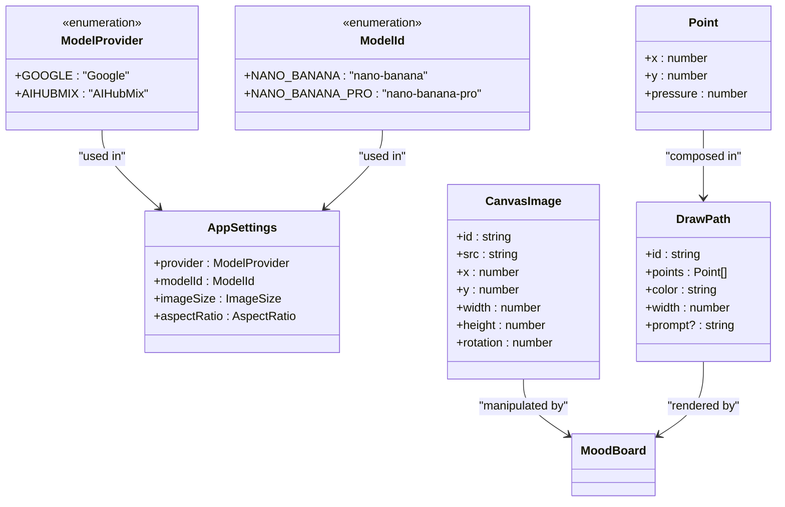

**图表来源**
- [types.ts](file://types.ts#L2-L56)

**章节来源**
- [types.ts](file://types.ts#L1-L56)

## AppSettings接口深度分析

`AppSettings`接口是整个应用程序配置的核心，它定义了用户偏好的标准化结构：

### 结构组成

| 字段名 | 类型 | 必需性 | 描述 |
|--------|------|--------|------|
| provider | ModelProvider | 必需 | 指定使用的AI模型提供商 |
| modelId | ModelId | 必需 | 选择具体的AI模型版本 |
| imageSize | ImageSize | 可选 | 生成图像的目标尺寸 |
| aspectRatio | AspectRatio | 可选 | 图像的宽高比 |

### 类型安全保证

AppSettings通过枚举类型确保了以下约束：
- **提供商验证**：只能从预定义的提供商列表中选择
- **模型验证**：只能使用已注册的模型ID
- **扩展性**：新的提供商和模型可以轻松添加而不破坏现有代码

### 默认值处理

应用程序在初始化时提供了合理的默认值策略：

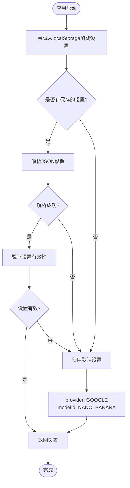

**图表来源**
- [App.tsx](file://App.tsx#L9-L22)

**章节来源**
- [App.tsx](file://App.tsx#L9-L22)
- [types.ts](file://types.ts#L36-L40)

## 模型提供商类型系统

### ModelProvider枚举

ModelProvider枚举定义了支持的AI服务提供商：

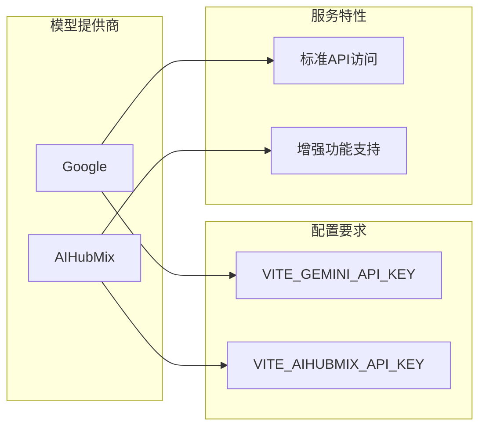

**图表来源**
- [constants.ts](file://constants.ts#L3-L6)
- [services/geminiService.ts](file://services/geminiService.ts#L15-L20)

### ModelId枚举

ModelId枚举提供了具体的模型选择：

| 枚举值 | 模型名称 | 特性描述 |
|--------|----------|----------|
| NANO_BANANA | Nano Banana (Flash Image) | 快速生成，适合原型设计 |
| NANO_BANANA_PRO | Nano Banana Pro (Pro Image) | 高质量生成，适合专业用途 |

### 动态配置机制

服务层通过条件逻辑实现动态配置：

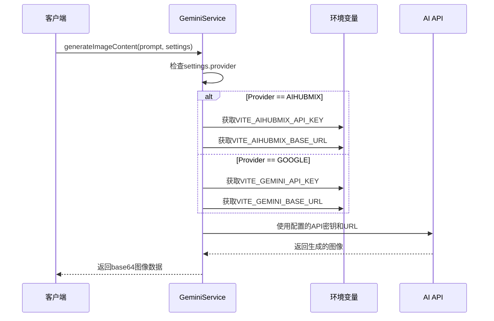

**图表来源**
- [services/geminiService.ts](file://services/geminiService.ts#L15-L21)

**章节来源**
- [types.ts](file://types.ts#L2-L10)
- [constants.ts](file://constants.ts#L1-L17)
- [services/geminiService.ts](file://services/geminiService.ts#L1-L112)

## 画布数据结构

### CanvasImage接口

CanvasImage接口定义了画布上图像元素的完整属性集：

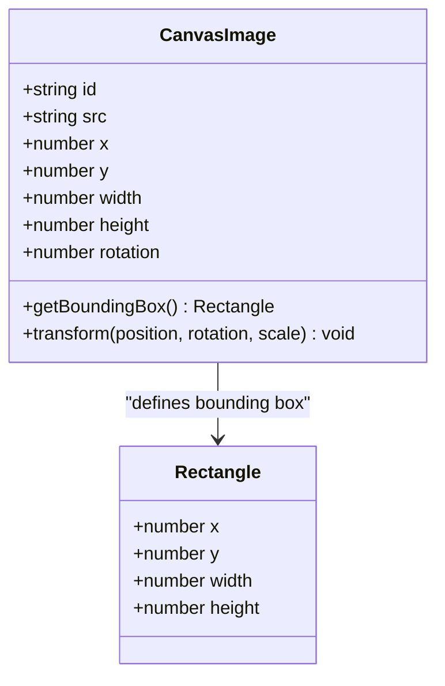

**图表来源**
- [types.ts](file://types.ts#L12-L20)

### DrawPath接口

DrawPath接口支持手绘路径的复杂数据结构：

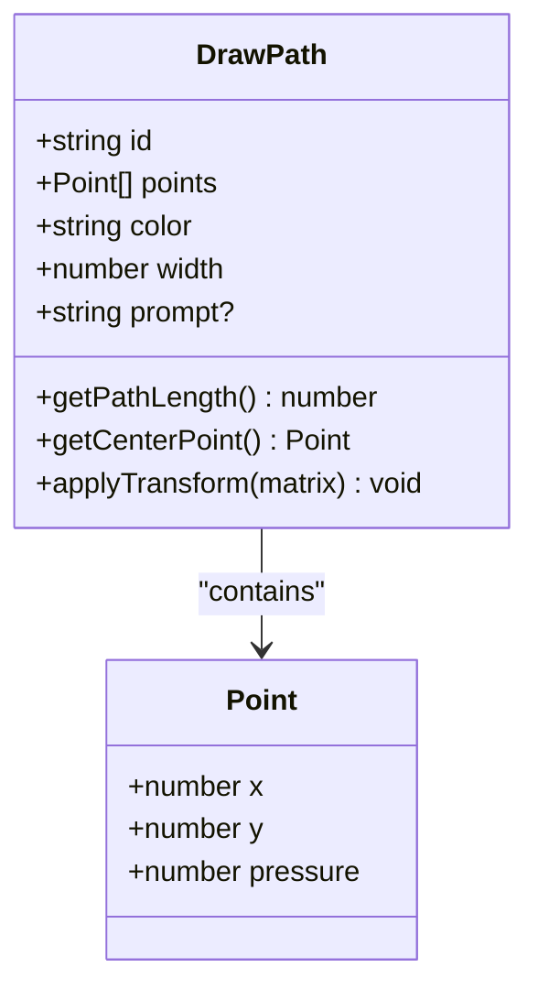

**图表来源**
- [types.ts](file://types.ts#L28-L34)

### 实际应用场景

在MoodBoard组件中，这些类型被广泛应用于：

1. **图像管理**：存储和操作画布上的图像元素
2. **路径绘制**：记录用户的绘画轨迹和编辑指示
3. **交互处理**：响应用户的手势和键盘输入
4. **渲染优化**：高效地重绘复杂的画布内容

**章节来源**
- [types.ts](file://types.ts#L12-L34)
- [components/MoodBoard.tsx](file://components/MoodBoard.tsx#L24-L27)

## 类型在服务层的应用

### 参数校验和类型推断

GeminiService利用类型系统实现了强大的参数校验：

```mermaid
flowchart TD
Input[prompt: string, settings: AppSettings, imageInput?: string \| string[]] --> TypeCheck["类型检查"]
TypeCheck --> ProviderCheck{"settings.provider类型正确?"}
ProviderCheck --> |是| ModelCheck{"settings.modelId类型正确?"}
ProviderCheck --> |否| TypeError["抛出类型错误"]
ModelCheck --> |是| ApiCall["调用AI API"]
ModelCheck --> |否| TypeError
ApiCall --> ResponseCheck["检查API响应类型"]
ResponseCheck --> Success["返回string类型结果"]
TypeError --> ErrorHandling["错误处理"]
```

**图表来源**
- [services/geminiService.ts](file://services/geminiService.ts#L5-L8)

### 错误处理机制

类型系统在错误处理中发挥了关键作用：

| 错误类型 | 检测方式 | 处理策略 |
|----------|----------|----------|
| API密钥缺失 | 编译时类型检查 | 提示用户配置环境变量 |
| 不支持的提供商 | 运行时类型验证 | 显示友好的错误消息 |
| 响应格式错误 | 类型断言检查 | 记录详细错误日志 |

### 服务集成模式

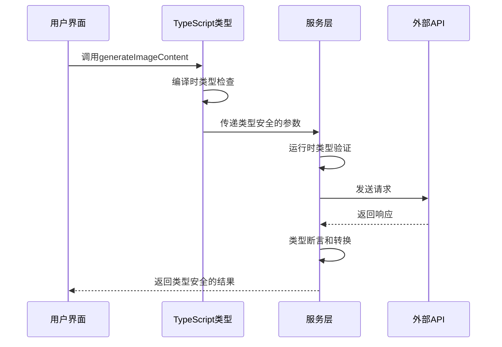

**图表来源**
- [services/geminiService.ts](file://services/geminiService.ts#L5-L112)

**章节来源**
- [services/geminiService.ts](file://services/geminiService.ts#L1-L112)

## 类型扩展流程

### 添加新模型提供商

当需要添加新的AI服务提供商时，需要按照以下步骤更新类型定义：

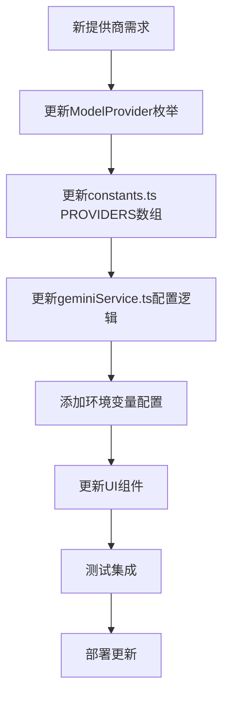

**图表来源**
- [types.ts](file://types.ts#L2-L5)
- [constants.ts](file://constants.ts#L3-L6)
- [services/geminiService.ts](file://services/geminiService.ts#L15-L21)

### 添加新模型

扩展模型支持的完整流程：

1. **更新ModelId枚举**：添加新的模型标识符
2. **更新MODEL_MAPPING**：映射到实际的API模型名称
3. **更新UI选择器**：在SettingsBar中添加选项
4. **更新常量定义**：在constants.ts中添加模型信息
5. **测试兼容性**：确保新模型在所有场景下正常工作

### 默认值设置策略

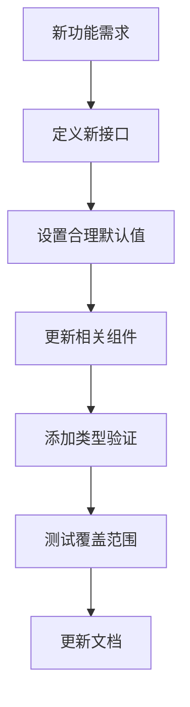

**章节来源**
- [types.ts](file://types.ts#L2-L10)
- [constants.ts](file://constants.ts#L8-L17)
- [components/SettingsBar.tsx](file://components/SettingsBar.tsx#L48-L54)

## TypeScript静态检查的重要性

### 编译时错误检测

TypeScript的静态类型系统在开发阶段就捕获了许多潜在错误：

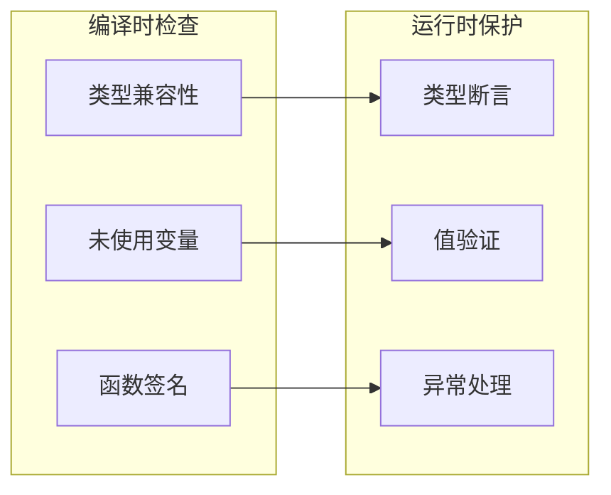

### 开发效率提升

1. **智能提示**：IDE提供准确的代码补全和文档
2. **重构安全**：大型重构操作不会破坏类型契约
3. **团队协作**：清晰的接口定义减少沟通成本
4. **文档价值**：类型定义本身就是优秀的API文档

### 维护成本降低

| 维护阶段 | 传统JavaScript问题 | TypeScript解决方案 |
|----------|-------------------|-------------------|
| 新人入职 | 需要大量时间理解API | 类型定义提供清晰指导 |
| 功能扩展 | 容易引入类型错误 | 编译时自动检测 |
| Bug修复 | 难以定位类型相关问题 | 类型错误明确指出位置 |
| 版本升级 | 可能破坏现有功能 | 类型兼容性检查 |

**章节来源**
- [App.tsx](file://App.tsx#L9-L22)
- [components/SettingsBar.tsx](file://components/SettingsBar.tsx#L14-L16)

## 最佳实践总结

### 类型设计原则

1. **单一职责**：每个类型专注于特定的数据结构
2. **不可变性**：优先使用只读属性避免意外修改
3. **可扩展性**：预留扩展点支持未来功能增长
4. **一致性**：保持命名和结构的一致性

### 性能考虑

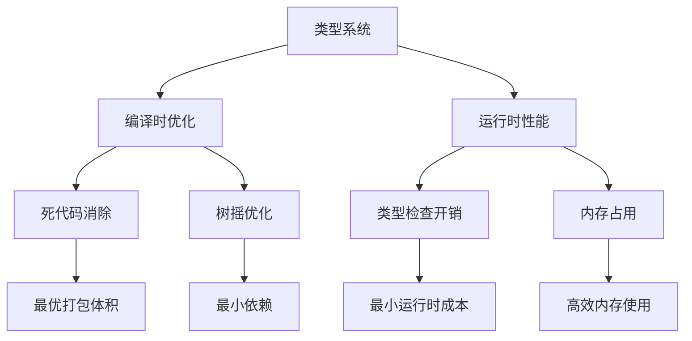

### 测试策略

1. **单元测试**：验证类型定义的正确性
2. **集成测试**：确保类型在实际使用中的表现
3. **端到端测试**：验证完整的用户流程
4. **类型覆盖率**：监控类型系统的覆盖程度

### 未来发展方向

随着项目的发展，类型系统可以进一步演进：

- **泛型支持**：为通用组件提供更灵活的类型参数
- **条件类型**：根据配置动态调整类型结构
- **工具类型**：创建专门的类型工具提高开发效率
- **类型守卫**：增强运行时类型检查能力

通过这套完善的类型系统，Banana Canvas项目实现了高质量的代码质量和用户体验，为项目的长期发展奠定了坚实的基础。