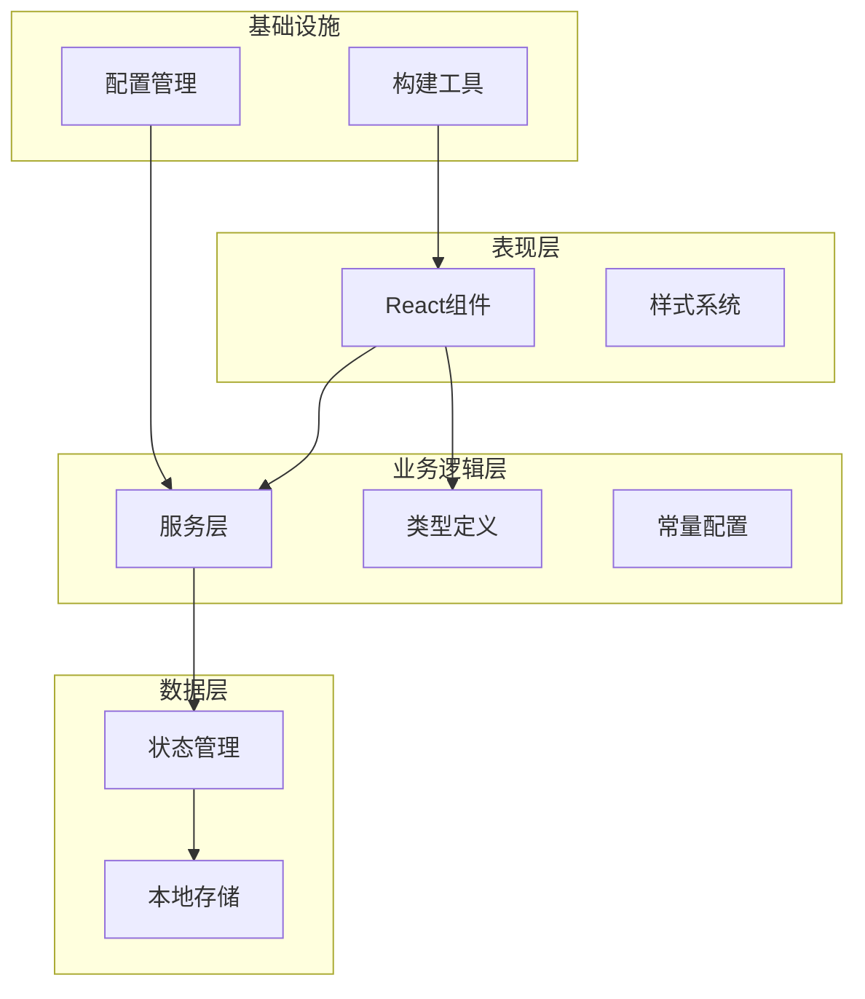
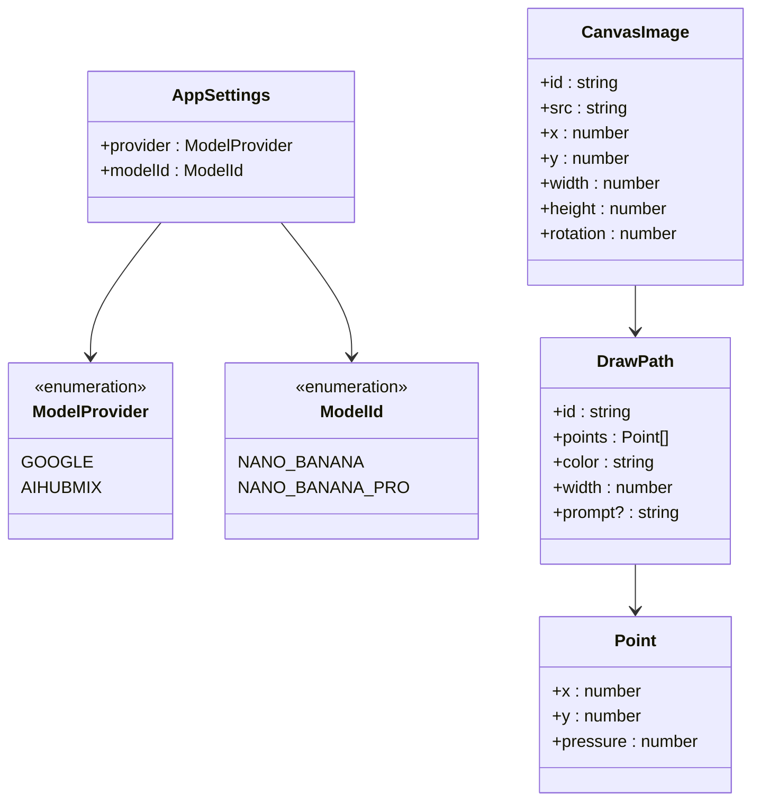
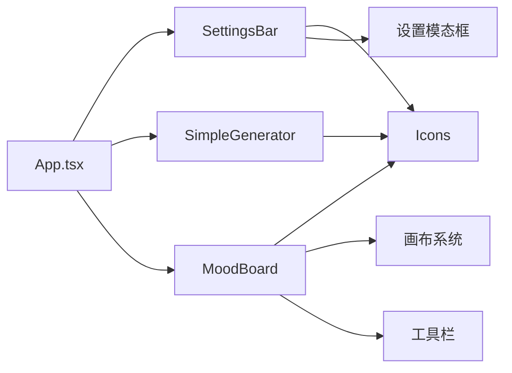
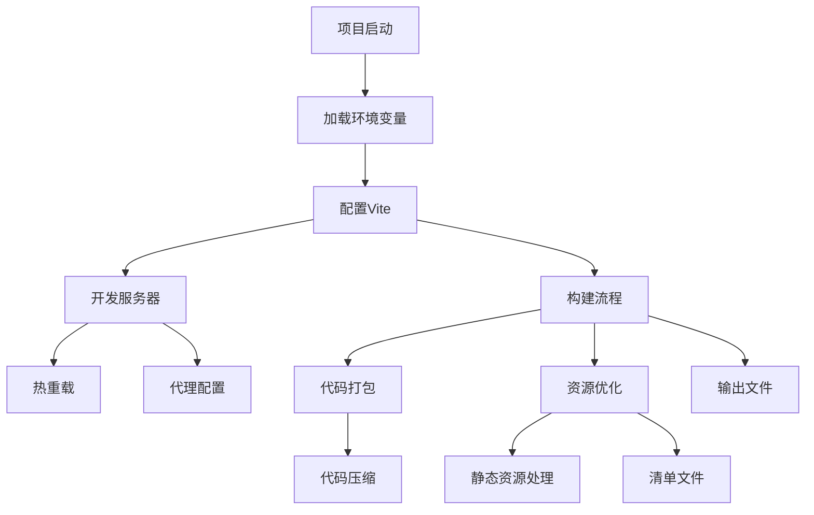

# 开发者指南

<cite>
**本文档引用的文件**
- [README.md](file://README.md)
- [package.json](file://package.json)
- [constants.ts](file://constants.ts)
- [types.ts](file://types.ts)
- [services/geminiService.ts](file://services/geminiService.ts)
- [vite.config.ts](file://vite.config.ts)
- [App.tsx](file://App.tsx)
- [index.tsx](file://index.tsx)
- [components/SettingsBar.tsx](file://components/SettingsBar.tsx)
- [components/SimpleGenerator.tsx](file://components/SimpleGenerator.tsx)
- [components/MoodBoard.tsx](file://components/MoodBoard.tsx)
- [tsconfig.json](file://tsconfig.json)
</cite>

## 目录
1. [项目简介](#项目简介)
2. [开发环境搭建](#开发环境搭建)
3. [项目架构概览](#项目架构概览)
4. [AI模型扩展指南](#ai模型扩展指南)
5. [类型系统与数据结构](#类型系统与数据结构)
6. [UI组件定制化](#ui组件定制化)
7. [构建流程配置](#构建流程配置)
8. [代码贡献规范](#代码贡献规范)
9. [测试与质量保证](#测试与质量保证)
10. [部署与发布](#部署与发布)

## 项目简介

BananaCanvase是一个基于React和TypeScript的AI图像生成应用，允许用户通过文本提示和参考图像生成高质量的AI艺术作品。项目采用现代化的前端技术栈，支持多种AI服务提供商，并提供了直观的图形界面用于图像编辑和创作。

### 核心特性
- **多AI服务支持**：支持Google Gemini和AIHubMix等多个AI服务提供商
- **双模式操作**：提供简单生成器和高级画板两种使用模式
- **实时协作**：支持多人同时编辑和生成图像
- **类型安全**：完整的TypeScript类型定义确保代码质量
- **响应式设计**：适配各种设备和屏幕尺寸

## 开发环境搭建

### 系统要求

在开始开发之前，请确保您的系统满足以下要求：

- **Node.js**：版本18.0或更高
- **npm**：版本8.0或更高（随Node.js自带）
- **Git**：用于代码版本控制
- **现代浏览器**：Chrome、Firefox、Safari或Edge

### 环境设置步骤

#### 1. 克隆项目仓库

```bash
git clone https://github.com/your-repository/banana-canvas-ai.git
cd banana-canvas-ai
```

#### 2. 安装依赖包

```bash
npm install
```

此命令将安装所有必要的开发和生产依赖项。

#### 3. 配置API密钥

创建`.env.local`文件并添加您的API密钥：

```bash
# Google Gemini API配置
VITE_GEMINI_API_KEY=your_gemini_api_key_here

# 或者AIHubMix配置（可选）
VITE_AIHUBMIX_API_KEY=your_aihubmix_api_key_here
VITE_AIHUBMIX_BASE_URL=https://api.aihubmix.com/v1
```

#### 4. 启动开发服务器

```bash
npm run dev
```

开发服务器将在`http://localhost:3000`启动，自动打开浏览器窗口。

#### 5. 构建生产版本

```bash
npm run build
```

这将生成优化的生产构建到`dist/`目录。

**章节来源**
- [README.md](file://README.md#L11-L21)
- [package.json](file://package.json#L1-L24)

## 项目架构概览

BananaCanvase采用模块化的架构设计，主要分为以下几个层次：



**图表来源**
- [App.tsx](file://App.tsx#L1-L137)
- [components/SettingsBar.tsx](file://components/SettingsBar.tsx#L1-L153)
- [components/SimpleGenerator.tsx](file://components/SimpleGenerator.tsx#L1-L148)
- [components/MoodBoard.tsx](file://components/MoodBoard.tsx#L1-L770)

### 目录结构说明

- **`components/`**：React组件库，包含UI组件和业务组件
- **`services/`**：AI服务集成层，负责与外部API通信
- **`types.ts`**：全局类型定义，确保类型安全
- **`constants.ts`**：应用常量和配置信息
- **`vite.config.ts`**：构建工具配置
- **`tsconfig.json`**：TypeScript编译配置

**章节来源**
- [App.tsx](file://App.tsx#L1-L137)
- [vite.config.ts](file://vite.config.ts#L1-L25)

## AI模型扩展指南

### 扩展AI服务提供商

要添加新的AI服务提供商，需要修改以下文件：

#### 1. 更新类型定义

在`types.ts`中扩展`ModelProvider`枚举：

```typescript
export enum ModelProvider {
  GOOGLE = 'Google',
  AIHUBMIX = 'AIHubMix',
  NEW_PROVIDER = 'NewProvider' // 新增提供商
}
```

#### 2. 添加模型映射

在`constants.ts`中更新提供商和模型配置：

```typescript
export const PROVIDERS = [
  { id: ModelProvider.GOOGLE, name: 'Google' },
  { id: ModelProvider.AIHUBMIX, name: 'AIHubMix' },
  { id: ModelProvider.NEW_PROVIDER, name: 'New Provider' } // 新增提供商
];

export const MODELS = [
  { id: ModelId.NANO_BANANA, name: 'Nano Banana (Flash Image)' },
  { id: ModelId.NANO_BANANA_PRO, name: 'Nano Banana Pro (Pro Image)' },
  // 可以添加新模型...
];

export const MODEL_MAPPING: Record<ModelId, string> = {
  [ModelId.NANO_BANANA]: 'gemini-2.5-flash-image',
  [ModelId.NANO_BANANA_PRO]: 'gemini-3-pro-image-preview',
  // 添加新模型映射...
};
```

#### 3. 实现服务接口

创建新的服务文件或扩展现有服务：

```typescript
// services/newProviderService.ts
import { AppSettings, ModelId, ModelProvider } from '../types';

export const generateImageContent = async (
  prompt: string,
  settings: AppSettings,
  imageInput?: string | string[]
): Promise<string> => {
  // 实现新提供商的API调用逻辑
  // ...
};
```

#### 4. 更新服务选择逻辑

在`geminiService.ts`中添加对新提供商的支持：

```typescript
const ai = new GoogleGenAI({
  apiKey: apiKey,
  ...(baseUrl && { httpOptions: { baseUrl } })
});

// 根据提供商选择不同的客户端配置
```

### 自定义生成参数

可以通过修改`generateImageContent`函数来添加特定于提供商的配置选项：

```typescript
// 在generationConfig中添加特定配置
if (settings.provider === ModelProvider.NEW_PROVIDER) {
  generationConfig.customParameter = 'value';
}
```

**章节来源**
- [types.ts](file://types.ts#L2-L56)
- [constants.ts](file://constants.ts#L1-L18)
- [services/geminiService.ts](file://services/geminiService.ts#L1-L109)

## 类型系统与数据结构

### 核心类型定义

BananaCanvase使用强类型系统确保代码质量和开发体验：



**图表来源**
- [types.ts](file://types.ts#L2-L56)

### 添加新的数据结构

要添加新的数据结构，按照以下步骤进行：

#### 1. 扩展类型定义

在`types.ts`中添加新的接口或枚举：

```typescript
// 新的枚举类型
export enum DrawingTool {
  BRUSH = 'brush',
  ERASER = 'eraser',
  SHAPE = 'shape'
}

// 新的数据接口
export interface ToolSettings {
  tool: DrawingTool;
  size: number;
  opacity: number;
  color: string;
}
```

#### 2. 更新状态管理

在组件中使用新的类型：

```typescript
const [toolSettings, setToolSettings] = useState<ToolSettings>({
  tool: DrawingTool.BRUSH,
  size: 10,
  opacity: 1.0,
  color: '#000000'
});
```

#### 3. 创建类型安全的函数

```typescript
export const applyToolSettings = (
  imageData: string,
  settings: ToolSettings
): Promise<string> => {
  // 使用类型安全的参数
  // ...
};
```

### 类型守卫和验证

为了确保运行时类型安全，可以添加类型守卫函数：

```typescript
export const isValidAppSettings = (obj: any): obj is AppSettings => {
  return (
    typeof obj === 'object' &&
    'provider' in obj &&
    'modelId' in obj &&
    Object.values(ModelProvider).includes(obj.provider) &&
    Object.values(ModelId).includes(obj.modelId)
  );
};
```

**章节来源**
- [types.ts](file://types.ts#L1-L56)

## UI组件定制化

### 组件结构分析

BananaCanvase的UI组件采用模块化设计，主要组件包括：



**图表来源**
- [App.tsx](file://App.tsx#L1-L137)
- [components/SettingsBar.tsx](file://components/SettingsBar.tsx#L1-L153)
- [components/SimpleGenerator.tsx](file://components/SimpleGenerator.tsx#L1-L148)
- [components/MoodBoard.tsx](file://components/MoodBoard.tsx#L1-L770)

### 自定义UI组件

#### 1. 创建新组件

创建新的UI组件文件：

```typescript
// components/ui/NewComponent.tsx
import React from 'react';

interface NewComponentProps {
  title: string;
  children?: React.ReactNode;
  className?: string;
}

const NewComponent: React.FC<NewComponentProps> = ({ 
  title, 
  children, 
  className = '' 
}) => {
  return (
    <div className={`new-component ${className}`}>
      <h3 className="component-title">{title}</h3>
      <div className="component-content">
        {children}
      </div>
    </div>
  );
};

export default NewComponent;
```

#### 2. 添加样式系统

在CSS文件中定义样式：

```css
/* styles/NewComponent.css */
.new-component {
  background: var(--dark-surface);
  border: 1px solid var(--dark-border);
  border-radius: 8px;
  padding: 16px;
  margin: 8px 0;
}

.component-title {
  color: var(--banana-400);
  font-size: 1.2rem;
  margin-bottom: 12px;
}

.component-content {
  color: var(--slate-200);
}
```

#### 3. 集成到现有组件

```typescript
import NewComponent from './ui/NewComponent';

const MoodBoard: React.FC<MoodBoardProps> = ({ settings }) => {
  return (
    <div className="mood-board">
      <NewComponent title="自定义面板">
        <p>这是新的自定义组件内容</p>
      </NewComponent>
      
      {/* 原有组件内容 */}
    </div>
  );
};
```

### 修改构建流程

#### 1. 扩展Vite配置

在`vite.config.ts`中添加新的配置：

```typescript
export default defineConfig(({ mode }) => {
  const env = loadEnv(mode, '.', '');
  
  return {
    // 现有配置...
    
    // 添加新的插件或配置
    css: {
      postcss: {
        plugins: [
          require('autoprefixer'),
          require('tailwindcss')
        ]
      }
    },
    
    // 添加别名
    resolve: {
      alias: {
        '@': path.resolve(__dirname, '.'),
        '@ui': path.resolve(__dirname, './components/ui'),
        '@utils': path.resolve(__dirname, './utils')
      }
    }
  };
});
```

#### 2. 配置TypeScript路径映射

在`tsconfig.json`中添加路径映射：

```json
{
  "compilerOptions": {
    "paths": {
      "@/*": ["./*"],
      "@ui/*": ["./components/ui/*"],
      "@utils/*": ["./utils/*"]
    }
  }
}
```

**章节来源**
- [vite.config.ts](file://vite.config.ts#L1-L25)
- [tsconfig.json](file://tsconfig.json#L1-L29)

## 构建流程配置

### Vite配置详解

BananaCanvase使用Vite作为构建工具，提供了高效的开发体验和优化的生产构建：



**图表来源**
- [vite.config.ts](file://vite.config.ts#L1-L25)

### 环境变量管理

项目使用环境变量来管理不同环境的配置：

#### 1. 环境变量定义

```typescript
// vite.config.ts 中的环境变量定义
define: {
  'process.env.API_KEY': JSON.stringify(env.GEMINI_API_KEY),
  'process.env.GEMINI_API_KEY': JSON.stringify(env.GEMINI_API_KEY),
  'process.env.AIHUBMIX_API_KEY': JSON.stringify(env.AIHUBMIX_API_KEY)
}
```

#### 2. 使用环境变量

```typescript
// 在代码中访问环境变量
const apiKey = (import.meta as any).env.VITE_GEMINI_API_KEY;
const baseUrl = (import.meta as any).env.VITE_AIHUBMIX_BASE_URL;
```

### 生产构建优化

#### 1. 代码分割

Vite自动进行代码分割，优化加载性能：

```typescript
// 动态导入实现懒加载
const LazyComponent = lazy(() => import('./HeavyComponent'));
```

#### 2. 资源优化

```typescript
// 在vite.config.ts中配置资源处理
export default defineConfig({
  build: {
    rollupOptions: {
      output: {
        manualChunks: {
          vendor: ['react', 'react-dom'],
          utils: ['lodash', 'date-fns']
        }
      }
    }
  }
});
```

#### 3. PWA支持

添加PWA配置以支持离线使用：

```typescript
import { VitePWA } from 'vite-plugin-pwa';

export default defineConfig({
  plugins: [
    VitePWA({
      registerType: 'autoUpdate',
      includeAssets: ['favicon.ico', 'apple-touch-icon.png'],
      manifest: {
        name: 'Banana Canvas AI',
        short_name: 'Banana Canvas',
        theme_color: '#f59e0b',
        icons: [
          {
            src: 'pwa-192x192.png',
            sizes: '192x192',
            type: 'image/png'
          }
        ]
      }
    })
  ]
});
```

**章节来源**
- [vite.config.ts](file://vite.config.ts#L1-L25)

## 代码贡献规范

### Git工作流程

#### 1. 分支策略

采用Git Flow分支策略：

- **main**：主分支，包含稳定版本
- **develop**：开发分支，集成最新功能
- **feature/**：功能分支，开发新功能
- **hotfix/**：热修复分支，紧急修复

#### 2. 提交消息规范

使用约定式提交格式：

```bash
<type>(<scope>): <subject>

<body>

<footer>
```

示例：
```bash
feat(moodboard): add brush size slider

- Implement brush size adjustment
- Update canvas rendering logic
- Add brush size persistence

Closes #123
```

提交类型：
- `feat`：新功能
- `fix`：错误修复
- `docs`：文档更新
- `style`：代码格式调整
- `refactor`：重构
- `test`：测试相关
- `chore`：构建过程或辅助工具变动

### 代码质量标准

#### 1. TypeScript规范

- 使用严格模式
- 完整的类型注解
- 避免使用`any`类型
- 实现适当的类型守卫

#### 2. React最佳实践

- 使用函数组件和Hooks
- 避免内联函数定义
- 正确使用`useCallback`和`useMemo`
- 实现适当的错误边界

#### 3. 性能优化

- 避免不必要的重新渲染
- 使用React.memo包装组件
- 实现虚拟滚动处理大量数据
- 优化图片和资源加载

### 代码审查流程

#### 1. Pull Request模板

```markdown
## 变更描述
简要描述本次变更的内容和目的。

## 变更类型
- [ ] 新功能
- [ ] 错误修复
- [ ] 文档更新
- [ ] 性能改进
- [ ] 代码重构

## 测试
- [ ] 单元测试已添加/更新
- [ ] 集成测试已添加/更新
- [ ] 手动测试已完成

## 检查清单
- [ ] 代码遵循项目规范
- [ ] 自我审查已完成
- [ ] 未引入破坏性变更
- [ ] 文档已更新
```

#### 2. 审查要点

- **功能正确性**：代码是否实现了预期功能
- **代码质量**：是否遵循最佳实践
- **性能影响**：是否引入了性能问题
- **安全性**：是否存在安全漏洞
- **可维护性**：代码是否易于理解和维护

**章节来源**
- [README.md](file://README.md#L11-L21)

## 测试与质量保证

### 测试策略

#### 1. 单元测试

使用Jest进行单元测试：

```typescript
// tests/geminiService.test.ts
import { generateImageContent } from '../services/geminiService';

describe('Gemini Service', () => {
  it('should generate image content', async () => {
    const result = await generateImageContent(
      'test prompt',
      { provider: ModelProvider.GOOGLE, modelId: ModelId.NANO_BANANA }
    );
    
    expect(result).toBeDefined();
    expect(typeof result).toBe('string');
  });
});
```

#### 2. 集成测试

测试组件间的交互：

```typescript
// tests/MoodBoard.integration.test.ts
import { render, screen, fireEvent } from '@testing-library/react';
import { MoodBoard } from '../components/MoodBoard';

describe('MoodBoard Integration', () => {
  it('should handle image upload and generation', async () => {
    render(<MoodBoard settings={defaultSettings} />);
    
    // Upload image
    const file = new File([''], 'test.png', { type: 'image/png' });
    const input = screen.getByLabelText('上传图片');
    fireEvent.change(input, { target: { files: [file] } });
    
    // Generate image
    const generateButton = screen.getByText('生成');
    fireEvent.click(generateButton);
    
    // Verify results
    expect(await screen.findByRole('img')).toBeInTheDocument();
  });
});
```

#### 3. 端到端测试

使用Playwright进行端到端测试：

```typescript
// tests/e2e.spec.ts
import { test, expect } from '@playwright/test';

test('image generation workflow', async ({ page }) => {
  await page.goto('/');
  
  // Upload image
  await page.setInputFiles('input[type="file"]', 'test-image.png');
  
  // Enter prompt
  await page.fill('[placeholder="描述你想要看到的内容..."]', 'A beautiful landscape');
  
  // Generate image
  await page.click('button:has-text("生成")');
  
  // Verify result
  await expect(page.locator('img')).toBeVisible();
});
```

### 质量检查工具

#### 1. ESLint配置

```javascript
// .eslintrc.js
module.exports = {
  parser: '@typescript-eslint/parser',
  extends: [
    'eslint:recommended',
    'plugin:@typescript-eslint/recommended',
    'plugin:react/recommended',
    'prettier'
  ],
  rules: {
    '@typescript-eslint/explicit-function-return-type': 'off',
    '@typescript-eslint/no-unused-vars': 'error',
    'react/react-in-jsx-scope': 'off'
  }
};
```

#### 2. Prettier配置

```json
// .prettierrc
{
  "semi": true,
  "trailingComma": "all",
  "singleQuote": true,
  "printWidth": 80,
  "tabWidth": 2
}
```

#### 3. Husky和Lint-Staged

配置Git钩子确保代码质量：

```json
// package.json
{
  "husky": {
    "hooks": {
      "pre-commit": "lint-staged",
      "pre-push": "npm test"
    }
  },
  "lint-staged": {
    "*.{ts,tsx}": [
      "eslint --fix",
      "prettier --write"
    ],
    "*.json": [
      "prettier --write"
    ]
  }
}
```

**章节来源**
- [package.json](file://package.json#L1-L24)

## 部署与发布

### 本地部署

#### 1. 开发环境部署

```bash
# 安装依赖
npm install

# 启动开发服务器
npm run dev

# 访问应用
# http://localhost:3000
```

#### 2. 生产环境构建

```bash
# 构建生产版本
npm run build

# 预览生产构建
npm run preview

# 访问预览
# http://localhost:4173
```

### Docker部署

项目提供了Docker支持，便于容器化部署：

#### 1. 构建Docker镜像

```bash
# 构建镜像
docker build -t banana-canvas-ai .

# 运行容器
docker run -d -p 3000:3000 \
  -e VITE_GEMINI_API_KEY=your_api_key \
  banana-canvas-ai
```

#### 2. 使用Docker Compose

```yaml
# docker-compose.yml
version: '3.8'
services:
  app:
    build: .
    ports:
      - "3000:3000"
    environment:
      - VITE_GEMINI_API_KEY=${GEMINI_API_KEY}
    volumes:
      - ./logs:/app/logs
```

### CI/CD流水线

#### 1. GitHub Actions配置

```yaml
# .github/workflows/ci.yml
name: CI Pipeline

on:
  push:
    branches: [ main, develop ]
  pull_request:
    branches: [ main ]

jobs:
  test:
    runs-on: ubuntu-latest
    steps:
    - uses: actions/checkout@v2
    - name: Setup Node.js
      uses: actions/setup-node@v2
      with:
        node-version: '18'
    - name: Install dependencies
      run: npm install
    - name: Run tests
      run: npm test
    - name: Run lint
      run: npm run lint
    - name: Build
      run: npm run build
```

#### 2. 部署脚本

```bash
#!/bin/bash
# deploy.sh

echo "Starting deployment..."

# 构建生产版本
npm run build

# 备份当前版本
cp -r dist dist_backup_$(date +%Y%m%d_%H%M%S)

# 部署到服务器
scp -r dist/* user@server:/var/www/banana-canvas/

# 重启服务
ssh user@server "sudo systemctl restart nginx"

echo "Deployment completed!"
```

### 性能监控

#### 1. 应用性能监控

```typescript
// analytics.ts
export const trackEvent = (eventName: string, properties?: any) => {
  if (window.analytics) {
    window.analytics.track(eventName, properties);
  }
};

export const measurePerformance = (operation: string, fn: () => Promise<any>) => {
  const start = performance.now();
  
  return fn().then(result => {
    const duration = performance.now() - start;
    trackEvent('performance', {
      operation,
      duration,
      success: true
    });
    return result;
  }).catch(error => {
    trackEvent('performance', {
      operation,
      duration: performance.now() - start,
      success: false,
      error: error.message
    });
    throw error;
  });
};
```

#### 2. 错误监控

```typescript
// errorTracking.ts
export const initErrorTracking = () => {
  window.addEventListener('error', (event) => {
    trackEvent('error', {
      message: event.message,
      filename: event.filename,
      lineno: event.lineno,
      colno: event.colno,
      stack: event.error?.stack
    });
  });

  window.addEventListener('unhandledrejection', (event) => {
    trackEvent('error', {
      message: 'Unhandled Promise Rejection',
      reason: event.reason
    });
  });
};
```

**章节来源**
- [README.md](file://README.md#L11-L21)
- [package.json](file://package.json#L6-L10)
- [Dockerfile](file://Dockerfile)

## 结语

BananaCanvase作为一个现代化的AI图像生成应用，为开发者提供了丰富的扩展可能性。通过本指南，您应该能够：

- 成功搭建本地开发环境
- 理解项目的整体架构和设计模式
- 扩展AI模型支持和服务提供商
- 添加新的UI组件和功能
- 遵循代码贡献规范和最佳实践

我们鼓励社区成员积极参与项目贡献，无论是通过添加新功能、改进现有代码还是提供反馈意见。让我们共同打造更好的AI创作工具！

如果您在开发过程中遇到任何问题，欢迎通过GitHub Issues报告bug或提出功能请求。我们期待看到您为这个项目带来的创新和改进！