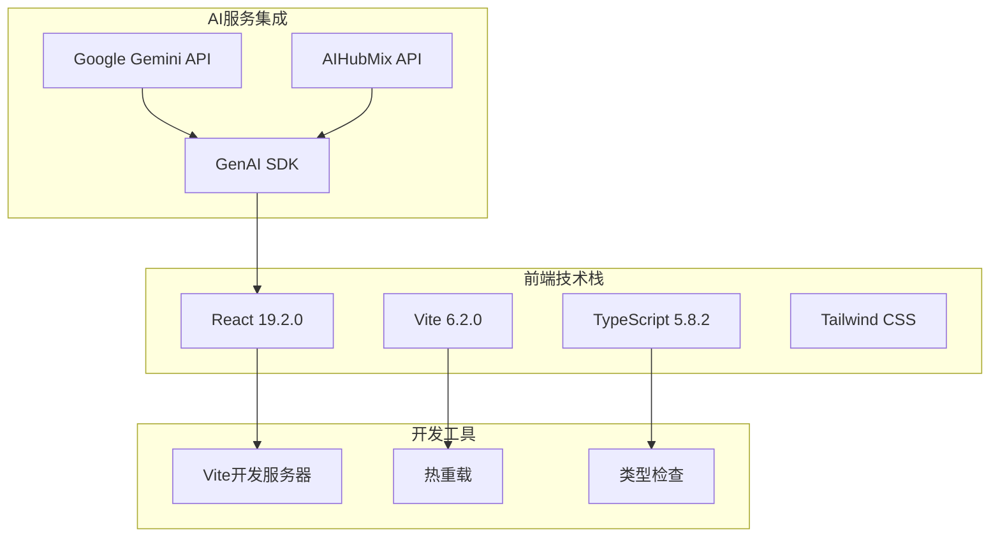
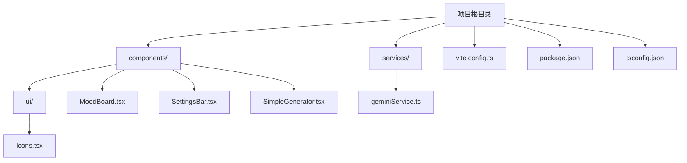
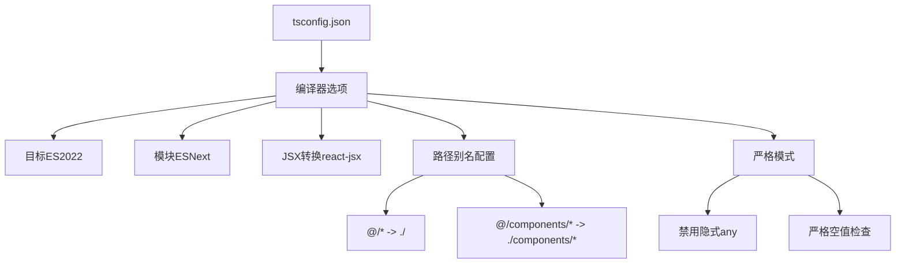
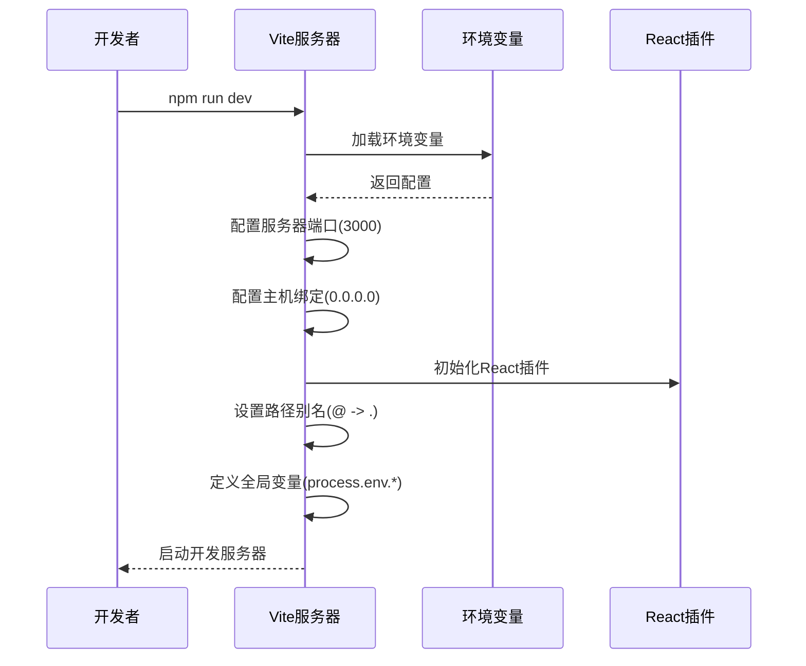
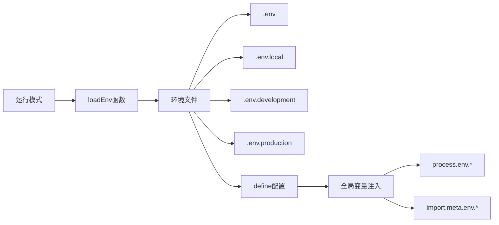
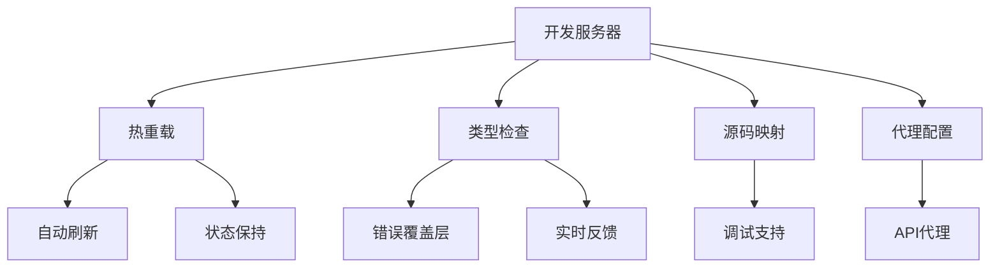
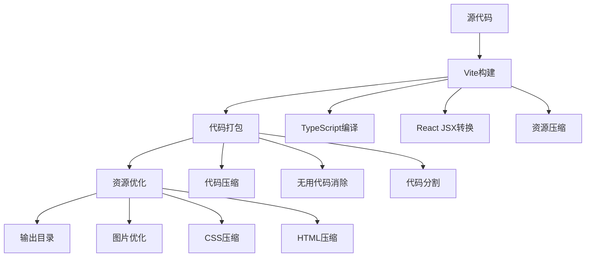

# 环境搭建

<cite>
**本文档中引用的文件**
- [package.json](file://package.json)
- [vite.config.ts](file://vite.config.ts)
- [tsconfig.json](file://tsconfig.json)
- [README.md](file://README.md)
- [index.html](file://index.html)
- [index.tsx](file://index.tsx)
- [App.tsx](file://App.tsx)
- [constants.ts](file://constants.ts)
- [types.ts](file://types.ts)
- [services/geminiService.ts](file://services/geminiService.ts)
</cite>

## 目录
1. [项目简介](#项目简介)
2. [前置要求](#前置要求)
3. [项目克隆与初始化](#项目克隆与初始化)
4. [Node.js环境配置](#nodejs环境配置)
5. [TypeScript环境设置](#typescript环境设置)
6. [Vite开发服务器配置](#vite开发服务器配置)
7. [环境变量配置](#环境变量配置)
8. [开发模式运行](#开发模式运行)
9. [生产构建](#生产构建)
10. [常见问题排查](#常见问题排查)
11. [实际操作示例](#实际操作示例)

## 项目简介

BananaCanvase是一个基于React和TypeScript的AI图像生成应用，支持Google Gemini和AIHubMix两大AI服务提供商。该项目采用现代化的前端技术栈，使用Vite作为构建工具，提供流畅的开发体验。

### 技术架构概览



**图表来源**
- [package.json](file://package.json#L12-L21)
- [vite.config.ts](file://vite.config.ts#L1-L25)
- [tsconfig.json](file://tsconfig.json#L1-L29)

## 前置要求

在开始之前，请确保您的系统满足以下要求：

### 系统要求
- **操作系统**: Windows 10+ / macOS 10.14+ / Linux (Ubuntu 18.04+)
- **内存**: 至少 4GB RAM
- **存储空间**: 至少 2GB 可用磁盘空间

### 必需软件
- **Node.js**: 版本 18.0 或更高版本（推荐使用 [nvm](https://github.com/nvm-sh/nvm) 进行版本管理）
- **包管理器**: npm 或 yarn（项目默认使用npm）

### API密钥准备
- **Google Gemini API Key**: 用于访问Google的AI服务
- **AIHubMix API Key**: 用于访问AIHubMix的AI服务（可选）

**章节来源**
- [README.md](file://README.md#L13-L21)
- [package.json](file://package.json#L12-L21)

## 项目克隆与初始化

### 步骤1：克隆项目仓库

```bash
# 使用HTTPS克隆
git clone https://github.com/your-repository/banana-canvas-ai.git

# 或使用SSH克隆
git clone git@github.com:your-repository/banana-canvas-ai.git

# 进入项目目录
cd banana-canvas-ai
```

### 步骤2：项目结构概览

项目采用标准的React + TypeScript项目结构：



**图表来源**
- [App.tsx](file://App.tsx#L1-L5)
- [components/MoodBoard.tsx](file://components/MoodBoard.tsx)
- [services/geminiService.ts](file://services/geminiService.ts#L1-L4)

**章节来源**
- [README.md](file://README.md#L1-L21)

## Node.js环境配置

### 检查Node.js版本

```bash
# 检查Node.js版本
node --version

# 检查npm版本
npm --version
```

### 安装项目依赖

项目使用npm作为包管理器，执行以下命令安装所有依赖：

```bash
# 安装依赖
npm install

# 如果遇到网络问题，可以使用淘宝镜像
npm install --registry=https://registry.npmmirror.com
```

### 依赖包分析

项目的主要依赖包括：

| 包名 | 版本 | 用途 |
|------|------|------|
| react | ^19.2.0 | 核心React框架 |
| @google/genai | ^1.30.0 | Google Gemini API客户端 |
| lucide-react | ^0.554.0 | 图标组件库 |
| react-dom | ^19.2.0 | React DOM渲染 |

开发依赖包括：
| 包名 | 版本 | 用途 |
|------|------|------|
| @types/node | ^22.14.0 | Node.js类型定义 |
| @vitejs/plugin-react | ^5.0.0 | Vite React插件 |
| typescript | ~5.8.2 | TypeScript编译器 |
| vite | ^6.2.0 | 构建工具 |

**章节来源**
- [package.json](file://package.json#L12-L21)

## TypeScript环境设置

### TypeScript配置详解

项目使用严格的TypeScript配置，确保类型安全：



**图表来源**
- [tsconfig.json](file://tsconfig.json#L2-L28)

### 关键配置说明

1. **模块解析**: 使用bundler模块解析器
2. **JSX处理**: 配置为react-jsx语法
3. **路径映射**: 设置`@`别名指向项目根目录
4. **实验性装饰器**: 启用装饰器支持
5. **严格模式**: 启用所有严格类型检查选项

**章节来源**
- [tsconfig.json](file://tsconfig.json#L1-L29)

## Vite开发服务器配置

### Vite配置详解

项目使用Vite作为构建工具和开发服务器，配置文件位于`vite.config.ts`：



**图表来源**
- [vite.config.ts](file://vite.config.ts#L5-L24)

### 服务器配置参数

| 配置项 | 值 | 说明 |
|--------|-----|------|
| port | 3000 | 开发服务器端口 |
| host | 0.0.0.0 | 绑定到所有网络接口 |
| plugins | react() | React热重载支持 |
| define | process.env.* | 全局环境变量注入 |

### 路径别名配置

项目配置了便捷的路径别名，允许使用相对导入：

```typescript
// 在代码中可以直接使用
import { AppSettings } from '@/types';
import SettingsBar from '@/components/SettingsBar';
```

**章节来源**
- [vite.config.ts](file://vite.config.ts#L1-L25)

## 环境变量配置

### 环境变量加载机制

项目使用Vite的环境变量加载机制，支持多种环境配置：



**图表来源**
- [vite.config.ts](file://vite.config.ts#L6-L17)

### 支持的API密钥

项目支持两种AI服务提供商的API密钥：

| 环境变量 | 用途 | 示例值 |
|----------|------|--------|
| VITE_GEMINI_API_KEY | Google Gemini API密钥 | gsk_xxxxxxxxxxxxxxxx |
| VITE_AIHUBMIX_API_KEY | AIHubMix API密钥 | aihub_xxxxxxxxxxxxxx |
| VITE_AIHUBMIX_BASE_URL | AIHubMix自定义域名 | https://custom.aihub.com |

### 配置步骤

1. **创建环境文件**:
   ```bash
   # 创建.env.local文件
   touch .env.local
   ```

2. **编辑环境变量**:
   ```bash
   # 编辑.env.local文件
   nano .env.local
   
   # 添加以下内容（根据需要选择）
   VITE_GEMINI_API_KEY=your_gemini_api_key_here
   # VITE_AIHUBMIX_API_KEY=your_aihubmix_api_key_here
   ```

3. **验证配置**:
   ```bash
   # 检查环境变量是否正确加载
   cat .env.local
   ```

**章节来源**
- [vite.config.ts](file://vite.config.ts#L14-L16)
- [App.tsx](file://App.tsx#L35-L38)
- [services/geminiService.ts](file://services/geminiService.ts#L15-L20)

## 开发模式运行

### 启动开发服务器

使用以下命令启动开发服务器：

```bash
# 启动开发服务器
npm run dev

# 或使用yarn
yarn dev
```

### 开发服务器特性



### 访问应用

启动成功后，您可以通过以下地址访问应用：

- **本地访问**: http://localhost:3000
- **局域网访问**: http://<您的IP>:3000（如果需要在其他设备上测试）

### 开发工具功能

1. **热重载**: 文件修改后自动更新页面
2. **类型检查**: TypeScript错误实时显示
3. **错误边界**: 运行时错误不会导致整个应用崩溃
4. **源码映射**: 调试时直接定位到原始源码

**章节来源**
- [package.json](file://package.json#L7-L9)
- [vite.config.ts](file://vite.config.ts#L8-L11)

## 生产构建

### 构建流程

项目使用Vite进行生产构建，生成优化后的静态资源：



### 构建命令

```bash
# 构建生产版本
npm run build

# 或使用yarn
yarn build
```

### 构建输出

构建完成后，静态资源会生成在`dist/`目录：

| 文件/目录 | 说明 |
|-----------|------|
| dist/index.html | 主入口HTML文件 |
| dist/assets/ | 静态资源文件夹 |
| dist/assets/*.js | 压缩后的JavaScript文件 |
| dist/assets/*.css | 压缩后的CSS文件 |
| dist/assets/*.png | 优化后的图片文件 |

### 预览生产版本

```bash
# 预览构建结果
npm run preview

# 或使用yarn
yarn preview
```

**章节来源**
- [package.json](file://package.json#L8-L9)

## 常见问题排查

### 依赖安装问题

#### 问题1：npm install失败
**症状**: 依赖安装过程中出现网络错误或超时

**解决方案**:
```bash
# 清理npm缓存
npm cache clean --force

# 删除node_modules和package-lock.json
rm -rf node_modules package-lock.json

# 重新安装
npm install
```

#### 问题2：Node.js版本不兼容
**症状**: 出现"Unsupported engine"错误

**解决方案**:
```bash
# 使用nvm切换Node.js版本
nvm install 18
nvm use 18

# 或升级npm
npm install -g npm@latest
```

### 端口占用问题

#### 问题3：端口3000被占用
**症状**: 开发服务器无法启动，提示端口被占用

**解决方案**:
```bash
# 查找占用端口的进程
netstat -ano | findstr :3000  # Windows
lsof -i :3000                 # macOS/Linux

# 修改vite.config.ts中的端口配置
# 或使用其他端口启动
npm run dev -- --port 3001
```

### 环境变量问题

#### 问题4：API密钥未生效
**症状**: 应用提示"API Key missing"错误

**解决方案**:
```bash
# 检查环境变量文件
cat .env.local

# 确保格式正确
VITE_GEMINI_API_KEY=your_actual_api_key_here

# 重启开发服务器
npm run dev
```

#### 问题5：环境变量加载失败
**症状**: import.meta.env中找不到API密钥

**解决方案**:
```bash
# 检查文件命名
ls -la .env*

# 确保文件权限正确
chmod 644 .env.local

# 重启开发服务器
```

### 类型检查问题

#### 问题6：TypeScript类型错误
**症状**: 编辑器显示类型错误或构建失败

**解决方案**:
```bash
# 清理TypeScript缓存
npx tsc --build --clean

# 重新编译
npx tsc

# 检查tsconfig.json配置
```

### 性能问题

#### 问题7：开发服务器启动缓慢
**症状**: npm run dev启动时间过长

**解决方案**:
```bash
# 使用更快的包管理器
yarn install

# 或使用pnpm
npm install -g pnpm
pnpm install

# 启用Vite的预构建缓存
```

**章节来源**
- [vite.config.ts](file://vite.config.ts#L6-L7)
- [services/geminiService.ts](file://services/geminiService.ts#L23-L25)

## 实际操作示例

### 完整的开发环境搭建流程

以下是完整的环境搭建和运行示例：

```bash
#!/bin/bash
# banana-canvas-setup.sh

echo "🚀 开始BananaCanvase开发环境搭建..."

# 1. 检查Node.js版本
echo "🔍 检查Node.js版本..."
NODE_VERSION=$(node --version)
echo "当前Node.js版本: $NODE_VERSION"

if [[ $NODE_VERSION != v18.* ]] && [[ $NODE_VERSION != v20.* ]]; then
    echo "⚠️  建议使用Node.js 18.x或20.x版本"
fi

# 2. 克隆项目
echo "📥 克隆项目..."
git clone https://github.com/your-repository/banana-canvas-ai.git
cd banana-canvas-ai

# 3. 安装依赖
echo "📦 安装项目依赖..."
npm install

# 4. 配置环境变量
echo "📝 配置环境变量..."
cat > .env.local << EOL
# Google Gemini API Key
VITE_GEMINI_API_KEY=your_gemini_api_key_here

# 或配置AIHubMix API Key
# VITE_AIHUBMIX_API_KEY=your_aihubmix_api_key_here
EOL

echo "✅ 环境变量配置完成"

# 5. 启动开发服务器
echo "🚀 启动开发服务器..."
echo "访问: http://localhost:3000"
echo "或在局域网访问: http://<你的IP>:3000"

# 6. 提供帮助信息
echo "💡 使用说明:"
echo "   - npm run dev: 启动开发服务器"
echo "   - npm run build: 构建生产版本"
echo "   - npm run preview: 预览构建结果"

echo "🎉 环境搭建完成！请打开浏览器查看应用。"
```

### API密钥获取指南

#### 获取Google Gemini API Key
1. 访问 [Google AI Studio](https://aistudio.google.com/)
2. 登录您的Google账户
3. 导航到API密钥页面
4. 创建新的API密钥
5. 复制API密钥并添加到.env.local文件

#### 获取AIHubMix API Key
1. 访问 [AIHubMix官网](https://aihubmix.com/)
2. 注册或登录账户
3. 导航到API密钥管理页面
4. 生成新的API密钥
5. 复制API密钥并添加到.env.local文件

### 项目结构快速导航

```bash
# 查看项目主要文件结构
tree -L 2 --dirsfirst

# 查看TypeScript类型定义
ls -la types.ts

# 查看组件目录
ls -la components/

# 查看服务层
ls -la services/
```

### 调试技巧

#### 使用浏览器开发者工具
1. 打开Chrome/Firefox开发者工具
2. 切换到"Console"标签页查看错误信息
3. 使用"Sources"标签页设置断点调试
4. 在"Network"标签页监控API请求

#### 日志调试
```javascript
// 在代码中添加调试日志
console.log('API Key:', import.meta.env.VITE_GEMINI_API_KEY);
console.log('Current settings:', settings);
```

**章节来源**
- [README.md](file://README.md#L16-L21)
- [App.tsx](file://App.tsx#L35-L42)
- [package.json](file://package.json#L6-L10)

## 结论

通过本指南，您已经掌握了BananaCanvase项目的完整开发环境搭建流程。从项目克隆到生产部署，每个步骤都有详细的操作说明和故障排除方案。

### 关键要点回顾

1. **环境准备**: 确保Node.js版本兼容，安装必要的依赖包
2. **配置管理**: 正确设置环境变量和API密钥
3. **开发工具**: 熟悉Vite开发服务器的各项功能
4. **问题解决**: 掌握常见问题的诊断和修复方法
5. **最佳实践**: 遵循项目约定，保持代码质量和一致性

### 下一步建议

- 浏览项目源码，熟悉整体架构
- 尝试修改简单的UI组件，体验热重载功能
- 阅读各个组件的实现细节，理解业务逻辑
- 参与项目讨论，提出改进建议

祝您在BananaCanvase项目开发中取得成功！