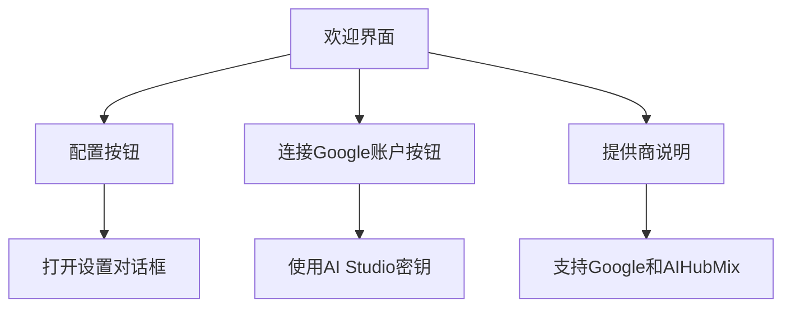
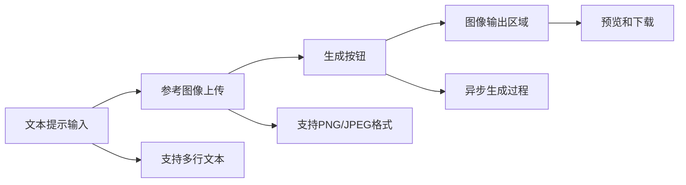
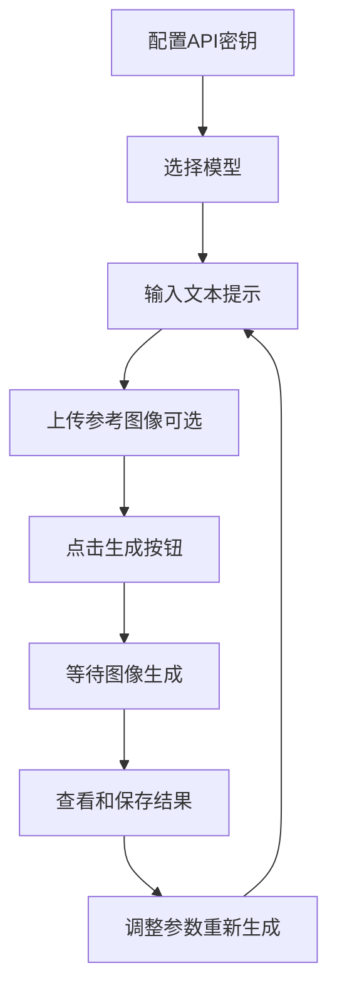

# 快速开始

<cite>
**本文档中引用的文件**
- [README.md](file://README.md)
- [package.json](file://package.json)
- [vite.config.ts](file://vite.config.ts)
- [index.html](file://index.html)
- [App.tsx](file://App.tsx)
- [types.ts](file://types.ts)
- [constants.ts](file://constants.ts)
- [geminiService.ts](file://services/geminiService.ts)
- [SettingsBar.tsx](file://components/SettingsBar.tsx)
- [SimpleGenerator.tsx](file://components/SimpleGenerator.tsx)
- [DOCKER.md](file://DOCKER.md)
</cite>

## 目录
1. [简介](#简介)
2. [系统要求](#系统要求)
3. [环境准备](#环境准备)
4. [项目克隆与安装](#项目克隆与安装)
5. [API密钥配置](#api密钥配置)
6. [启动开发服务器](#启动开发服务器)
7. [首次访问与界面介绍](#首次访问与界面介绍)
8. [常见问题排查](#常见问题排查)
9. [IDE配置建议](#ide配置建议)
10. [后续操作指南](#后续操作指南)

## 简介

BananaCanvase是一个基于React和TypeScript的AI图像生成应用，支持使用Google Gemini API进行图像创作。本指南将帮助您从零开始在本地环境中运行这个应用。

该应用提供了两种主要功能：
- **简单生成器**：输入文本提示生成图像
- **情绪板编辑器**：结合参考图像进行创意编辑

## 系统要求

在开始之前，请确保您的系统满足以下要求：

### 最低系统要求
- **操作系统**：Windows 10+ / macOS 10.14+ / Linux
- **内存**：至少4GB RAM
- **存储空间**：至少1GB可用磁盘空间

### 开发工具要求
- **Node.js**：推荐版本18.x或更高版本
- **npm**：随Node.js一起安装
- **Git**：用于克隆项目（可选）

**节来源**
- [package.json](file://package.json#L12-L16)
- [vite.config.ts](file://vite.config.ts#L8-L11)

## 环境准备

### 1. 检查Node.js版本

首先验证您的Node.js安装状态：

```bash
node --version
npm --version
```

**推荐版本**：Node.js 18.x 或更高版本  
**兼容版本**：Node.js 16.x 及以上

### 2. 创建项目目录

```bash
mkdir banana-canvas
cd banana-canvas
```

### 3. 获取项目代码

您可以选择以下两种方式之一获取项目代码：

#### 方法一：直接下载（推荐）
访问项目仓库页面，点击"Code" -> "Download ZIP"，然后解压到项目目录。

#### 方法二：使用Git克隆
```bash
git clone https://github.com/your-repository-url.git .
```

**节来源**
- [README.md](file://README.md#L13-L14)

## 项目克隆与安装

### 步骤1：导航到项目目录

```bash
cd path/to/banana-canvas
```

### 步骤2：安装项目依赖

在项目根目录下运行以下命令：

```bash
npm install
```

此命令会：
- 下载并安装所有必要的依赖包
- 创建`node_modules`目录
- 生成`package-lock.json`文件

### 依赖包说明

根据`package.json`文件，项目包含以下核心依赖：

| 包名 | 版本 | 用途 |
|------|------|------|
| react | ^19.2.0 | 核心React框架 |
| @google/genai | ^1.30.0 | Google Gemini API客户端 |
| lucide-react | ^0.554.0 | 图标组件库 |
| react-dom | ^19.2.0 | React DOM绑定 |

**节来源**
- [package.json](file://package.json#L11-L16)

## API密钥配置

### 获取Google Gemini API密钥

1. 访问Google AI Studio平台
2. 登录您的Google账户
3. 导航到API密钥管理页面
4. 创建新的API密钥
5. 复制生成的API密钥

### 配置环境变量

#### 方法一：使用.env.local文件（推荐）

1. 在项目根目录创建`.env.local`文件
2. 添加以下内容：

```
GEMINI_API_KEY=your_api_key_here
```

#### 方法二：直接在Vite配置中设置

如果您不想使用.env文件，可以直接在`vite.config.ts`中设置：

```typescript
define: {
  'process.env.GEMINI_API_KEY': JSON.stringify('your_api_key_here')
}
```

### 支持的API提供商

BananaCanvase支持多个AI服务提供商：

| 提供商 | 类型 | 默认模型 |
|--------|------|----------|
| Google | 主要支持 | gemini-2.5-flash-image |
| AIHubMix | 第三方 | 自定义配置 |

**节来源**
- [README.md](file://README.md#L18)
- [vite.config.ts](file://vite.config.ts#L14-L16)
- [constants.ts](file://constants.ts#L3-L6)

## 启动开发服务器

### 启动命令

在项目根目录下运行：

```bash
npm run dev
```

### 启动过程详解

1. **Vite开发服务器启动**：监听端口3000
2. **热重载激活**：自动重新编译和刷新浏览器
3. **依赖解析**：处理TypeScript和React JSX转换
4. **代理配置**：处理API请求转发

### 验证启动成功

打开浏览器访问：[http://localhost:3000](http://localhost:3000)

您应该看到类似以下的启动信息：

```
VITE v6.2.0  ready in 1500ms

➜  Local:   http://localhost:3000/
➜  Network: use --host to expose
```

### 端口配置

默认情况下，应用使用3000端口。如果该端口被占用，Vite会自动尝试其他端口。

**节来源**
- [vite.config.ts](file://vite.config.ts#L8-L11)
- [README.md](file://README.md#L20)

## 首次访问与界面介绍

### 欢迎界面

首次访问时，您会看到欢迎界面，提示配置API设置。

#### 欢迎界面元素



**图表来源**
- [App.tsx](file://App.tsx#L65-L95)

### 设置界面

点击右上角的"Config"按钮打开设置界面。

#### 设置界面布局

| 组件 | 功能 | 说明 |
|------|------|------|
| 模型选择器 | 切换AI模型 | Nano Banana (Flash) / Nano Banana Pro |
| 提供商选项 | 选择服务提供商 | Google / AIHubMix |
| API密钥输入 | 输入认证密钥 | 支持手动输入或Google账户授权 |
| 基础URL | 自定义API端点 | 可选配置项 |
| 保存按钮 | 应用设置更改 | 保存后立即生效 |

### 主界面功能

#### 简单生成器标签页



**图表来源**
- [SimpleGenerator.tsx](file://components/SimpleGenerator.tsx#L11-L148)

#### 情绪板编辑器标签页

提供更高级的图像编辑功能，支持：
- 多图层编辑
- 手绘涂鸦
- 图像变换
- 文本叠加

**节来源**
- [App.tsx](file://App.tsx#L98-L139)
- [SettingsBar.tsx](file://components/SettingsBar.tsx#L11-L170)

## 常见问题排查

### 1. API密钥相关问题

#### 问题：API密钥无效
**症状**：出现"Permission Denied (403)"错误
**解决方案**：
1. 检查API密钥是否正确复制
2. 确认密钥未过期
3. 验证Google AI Studio账户状态
4. 尝试重新生成API密钥

#### 问题：找不到API密钥
**症状**：欢迎界面持续显示
**解决方案**：
1. 确认`.env.local`文件存在且格式正确
2. 检查文件编码是否为UTF-8
3. 重启开发服务器

### 2. 依赖安装问题

#### 问题：npm install失败
**可能原因**：
- 网络连接问题
- npm缓存损坏
- Node.js版本不兼容

**解决方案**：
```bash
# 清理npm缓存
npm cache clean --force

# 删除node_modules和package-lock.json
rm -rf node_modules package-lock.json

# 重新安装依赖
npm install
```

#### 问题：依赖版本冲突
**症状**：出现"peer dependency"警告
**解决方案**：
- 检查Node.js版本是否符合要求
- 更新npm到最新版本
- 使用`npm audit`检查安全问题

### 3. 端口占用问题

#### 问题：端口3000被占用
**解决方案**：
1. 找出占用端口的进程：
```bash
# Windows
netstat -ano | findstr :3000

# macOS/Linux
lsof -i :3000
```

2. 终止占用进程或更改端口：
```bash
# 更改端口
npx vite --port 3001
```

### 4. 浏览器兼容性问题

#### 问题：某些功能无法使用
**解决方案**：
1. 确保使用现代浏览器（Chrome 90+、Firefox 88+、Safari 14+）
2. 禁用浏览器扩展程序
3. 清除浏览器缓存

### 5. 性能问题

#### 问题：应用响应缓慢
**优化建议**：
1. 关闭不必要的后台应用程序
2. 确保有足够的可用内存
3. 使用SSD硬盘存储项目文件

**节来源**
- [geminiService.ts](file://services/geminiService.ts#L99-L106)
- [SimpleGenerator.tsx](file://components/SimpleGenerator.tsx#L30-L50)

## IDE配置建议

### 推荐的开发环境

#### Visual Studio Code
**推荐插件**：
- TypeScript Hero：智能导入管理
- Prettier：代码格式化
- ESLint：代码质量检查
- Tailwind CSS IntelliSense：样式类智能提示

#### WebStorm
**内置功能**：
- TypeScript支持
- React JSX语法高亮
- 内置调试器
- 版本控制集成

### 项目配置

#### VS Code设置
创建`.vscode/settings.json`：

```json
{
  "typescript.preferences.importModuleSpecifier": "non-relative",
  "editor.formatOnSave": true,
  "editor.codeActionsOnSave": {
    "source.fixAll.eslint": true
  },
  "files.associations": {
    "*.css": "tailwindcss"
  }
}
```

#### ESLint配置
创建`.eslintrc.json`：

```json
{
  "extends": [
    "react-app",
    "react-app/jest"
  ],
  "rules": {
    "react-hooks/rules-of-hooks": "error",
    "react-hooks/exhaustive-deps": "warn"
  }
}
```

### 调试配置

#### VS Code调试设置
创建`.vscode/launch.json`：

```json
{
  "version": "0.2.0",
  "configurations": [
    {
      "name": "Launch Chrome",
      "request": "launch",
      "type": "chrome",
      "url": "http://localhost:3000",
      "webRoot": "${workspaceFolder}"
    }
  ]
}
```

## 后续操作指南

### 1. 应用使用流程

#### 基本工作流程


**图表来源**
- [SimpleGenerator.tsx](file://components/SimpleGenerator.tsx#L30-L50)

### 2. 高级功能探索

#### 情绪板编辑器使用
1. **图层管理**：添加、删除、调整图层顺序
2. **手绘工具**：使用画笔进行创意编辑
3. **变换操作**：缩放、旋转、裁剪图像
4. **文本工具**：添加文字说明和标注

#### 模型选择策略
- **Nano Banana**：适合快速原型和测试
- **Nano Banana Pro**：适合高质量图像生成

### 3. 生产部署准备

当您准备好将应用部署到生产环境时：

#### 构建生产版本
```bash
npm run build
```

#### 部署选项
1. **静态文件部署**：将`dist`目录部署到Web服务器
2. **Docker部署**：使用提供的Docker配置
3. **云平台部署**：支持Vercel、Netlify等平台

**节来源**
- [DOCKER.md](file://DOCKER.md#L1-L80)
- [package.json](file://package.json#L7-L9)

### 4. 社区和支持

#### 获取帮助
- **GitHub Issues**：报告bug和功能请求
- **官方文档**：查阅详细的技术文档
- **社区论坛**：参与用户讨论

#### 贡献指南
欢迎贡献代码和改进：
1. Fork项目仓库
2. 创建功能分支
3. 提交Pull Request
4. 参与代码审查

## 结论

通过本指南，您已经成功完成了BananaCanvase应用的本地环境搭建和基本配置。现在您可以：

- ✅ 成功启动开发服务器
- ✅ 配置API密钥
- ✅ 熟悉用户界面布局
- ✅ 解决常见技术问题
- ✅ 了解后续使用流程

接下来，您可以开始探索AI图像生成的奇妙世界，发挥创意制作独特的数字艺术作品。如果在使用过程中遇到任何问题，随时参考本指南或寻求社区支持。

祝您使用愉快！