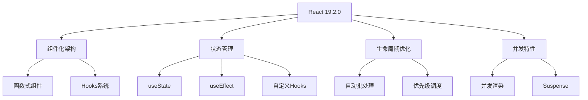
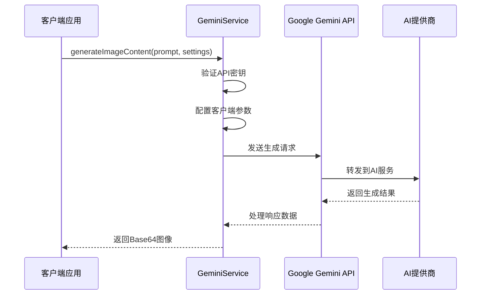
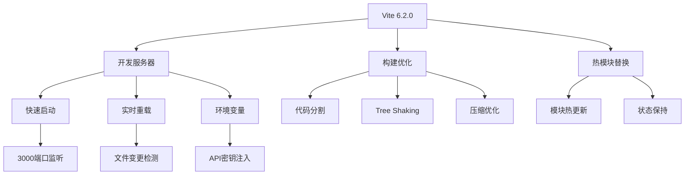
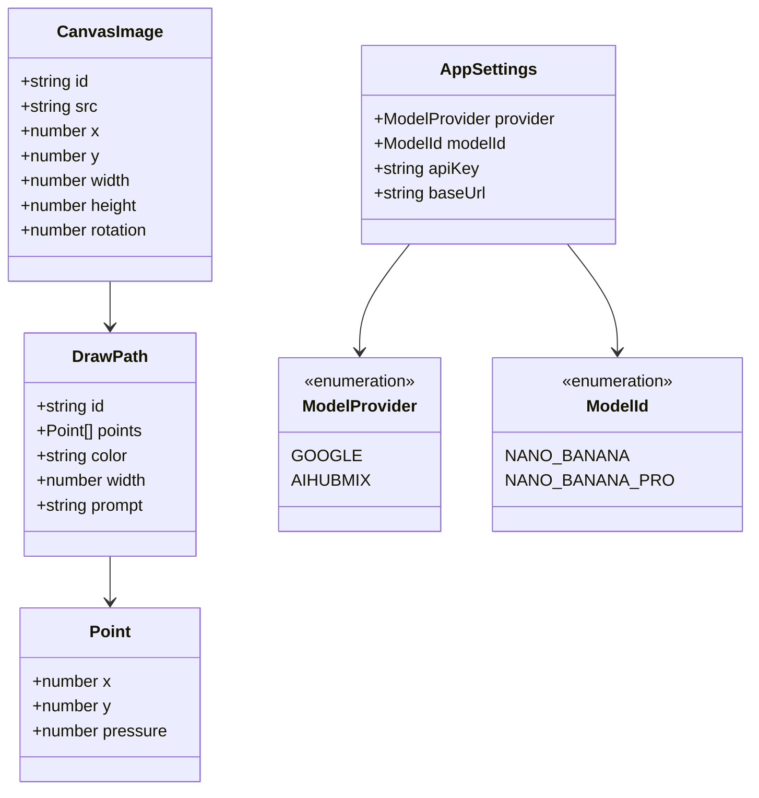
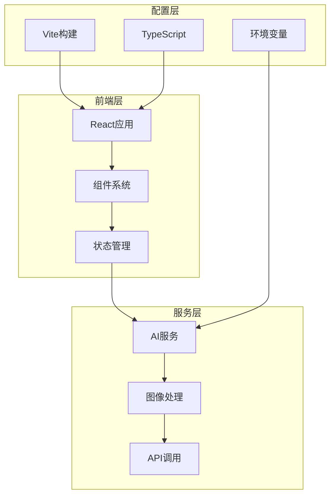
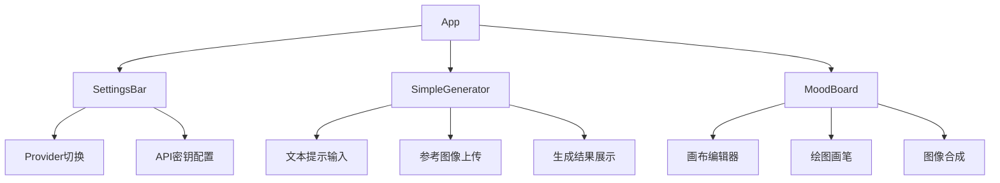

# 技术栈与依赖

<cite>
**本文档中引用的文件**
- [package.json](file://package.json)
- [vite.config.ts](file://vite.config.ts)
- [tsconfig.json](file://tsconfig.json)
- [types.ts](file://types.ts)
- [App.tsx](file://App.tsx)
- [geminiService.ts](file://services/geminiService.ts)
- [Icons.tsx](file://components/ui/Icons.tsx)
- [constants.ts](file://constants.ts)
- [SettingsBar.tsx](file://components/SettingsBar.tsx)
- [SimpleGenerator.tsx](file://components/SimpleGenerator.tsx)
- [MoodBoard.tsx](file://components/MoodBoard.tsx)
</cite>

## 目录
1. [项目概述](#项目概述)
2. [核心技术栈](#核心技术栈)
3. [关键依赖详解](#关键依赖详解)
4. [TypeScript类型系统](#typescript类型系统)
5. [构建配置分析](#构建配置分析)
6. [项目架构概览](#项目架构概览)
7. [依赖升级指南](#依赖升级指南)
8. [最佳实践建议](#最佳实践建议)

## 项目概述

BananaCanvase是一个基于React 19.2.0构建的AI图像生成应用，集成了Google Gemini API进行图像内容生成。该项目采用现代化的前端技术栈，结合TypeScript提供强类型支持，并通过Vite 6.2.0实现快速开发和构建体验。

## 核心技术栈

### 前端框架
- **React 19.2.0**: 最新版本的React框架，提供高性能的用户界面构建能力
- **TypeScript 5.8.2**: 强类型语言，确保代码质量和开发体验

### AI集成
- **@google/genai 1.30.0**: Google Gemini API客户端，用于图像生成和内容处理
- **多提供商支持**: 支持Google Gemini和AIHubMix两个AI服务提供商

### 图标系统
- **lucide-react 0.554.0**: 现代化的图标库，提供简洁美观的矢量图标

### 构建工具
- **Vite 6.2.0**: 现代化的前端构建工具，提供快速的开发服务器和优化的生产构建

## 关键依赖详解

### React 19.2.0 - 用户界面构建
React 19.2.0作为核心UI框架，提供了以下关键特性：



**图表来源**
- [App.tsx](file://App.tsx#L1-L139)
- [SimpleGenerator.tsx](file://components/SimpleGenerator.tsx#L1-L148)
- [MoodBoard.tsx](file://components/MoodBoard.tsx#L1-L770)

### @google/genai 1.30.0 - AI服务集成
Google GenAI SDK提供了强大的AI图像生成功能：



**图表来源**
- [geminiService.ts](file://services/geminiService.ts#L1-L107)
- [constants.ts](file://constants.ts#L1-L18)

### lucide-react 0.554.0 - 图标系统
Lucide React图标库提供了丰富的矢量图标资源：

| 组件名称 | 使用场景 | 功能描述 |
|---------|---------|---------|
| Wand2 | 主要操作按钮 | 表示图像生成功能 |
| ImageIcon | 文件上传 | 图像文件选择图标 |
| Layers | 界面导航 | Mood Board模式标识 |
| Settings | 设置面板 | 应用配置入口 |
| PenTool | 绘图工具 | 屏幕绘制功能 |
| MousePointer | 视图控制 | 平移和缩放操作 |

**节来源**
- [Icons.tsx](file://components/ui/Icons.tsx#L1-L30)

### Vite 6.2.0 - 现代化构建工具
Vite 6.2.0提供了现代化的开发体验：



**图表来源**
- [vite.config.ts](file://vite.config.ts#L1-L25)

**节来源**
- [vite.config.ts](file://vite.config.ts#L1-L25)

## TypeScript类型系统

### 核心类型定义

BananaCanvase使用了完整的TypeScript类型系统来确保代码质量：



**图表来源**
- [types.ts](file://types.ts#L1-L58)

### 类型系统优势

| 类型特性 | 优势 | 实际应用 |
|---------|------|---------|
| 枚举类型 | 防止无效值 | ModelProvider和ModelId的正确使用 |
| 接口定义 | 结构化数据 | CanvasImage、DrawPath等复杂对象 |
| 可选属性 | 灵活的数据结构 | prompt字段的可选性 |
| 全局声明 | 扩展浏览器API | AIStudio接口扩展 |
| 泛型支持 | 类型安全的操作 | API响应数据处理 |

**节来源**
- [types.ts](file://types.ts#L1-L58)

## 构建配置分析

### vite.config.ts配置详解

Vite配置文件包含了完整的开发和构建设置：

```mermaid
graph LR
A[vite.config.ts] --> B[开发服务器]
A --> C[插件系统]
A --> D[环境变量]
A --> E[路径别名]
B --> B1[port: 3000]
B --> B2[host: 0.0.0.0]
C --> C1[react插件]
D --> D1[GEMINI_API_KEY]
D --> D2[AIHUBMIX_API_KEY]
E --> E1[@ -> .)
```

**图表来源**
- [vite.config.ts](file://vite.config.ts#L5-L24)

### tsconfig.json编译选项

TypeScript配置支持现代JavaScript特性：

| 编译选项 | 值 | 作用 |
|---------|-----|------|
| target | ES2022 | 支持最新的JavaScript语法特性 |
| module | ESNext | 使用最新的模块系统 |
| jsx | react-jsx | React JSX转换 |
| moduleResolution | bundler | 模块解析策略 |
| skipLibCheck | true | 跳过类型声明文件检查 |
| isolatedModules | true | 单独编译每个文件 |

**节来源**
- [tsconfig.json](file://tsconfig.json#L1-L29)

## 项目架构概览

### 整体架构设计



**图表来源**
- [App.tsx](file://App.tsx#L1-L139)
- [geminiService.ts](file://services/geminiService.ts#L1-L107)

### 组件层次结构



**图表来源**
- [App.tsx](file://App.tsx#L8-L139)
- [SettingsBar.tsx](file://components/SettingsBar.tsx#L1-L170)
- [SimpleGenerator.tsx](file://components/SimpleGenerator.tsx#L1-L148)
- [MoodBoard.tsx](file://components/MoodBoard.tsx#L1-L770)

## 依赖升级指南

### 升级策略

#### React生态系统升级
1. **React版本升级**：
   - 检查兼容性：确认所有依赖包支持React 19.x
   - 渐进式迁移：使用React 18的向后兼容特性
   - 测试验证：运行完整测试套件

2. **TypeScript版本升级**：
   - 版本匹配：确保与React版本兼容
   - 类型检查：修复新增的类型错误
   - 配置更新：调整编译选项

#### 构建工具升级
1. **Vite升级**：
   - 配置迁移：更新插件配置
   - 性能优化：利用新特性提升构建速度
   - 插件生态：检查插件兼容性

2. **开发依赖升级**：
   - @vitejs/plugin-react：保持最新稳定版本
   - @types/node：同步Node.js版本

### 替换库建议

#### React替代方案
- **SolidJS**: 更小的包体积，更好的性能
- **Svelte**: 编译时优化，更简单的API
- **Qwik**: 无hydration开销的SSR框架

#### AI服务替代
- **OpenAI**: 提供更广泛的模型选择
- **Anthropic Claude**: 更好的对话理解能力
- **本地部署**: 使用Ollama等本地AI解决方案

#### 图标库替代
- **Radix UI**: 更好的无障碍支持
- **Heroicons**: Tailwind CSS友好的图标
- **Tabler Icons**: 更多样化的图标选择

## 最佳实践建议

### 代码组织最佳实践

1. **模块化设计**：
   - 按功能划分组件目录
   - 使用清晰的命名约定
   - 实现单一职责原则

2. **类型安全**：
   - 充分利用TypeScript类型系统
   - 定义明确的接口和枚举
   - 使用严格模式检查

3. **性能优化**：
   - 合理使用React.memo和useMemo
   - 实现虚拟滚动处理大量数据
   - 优化图片加载和缓存

### 开发工作流建议

1. **环境管理**：
   - 使用dotenv管理环境变量
   - 实现多环境配置
   - 安全存储敏感信息

2. **测试策略**：
   - 单元测试覆盖核心逻辑
   - 集成测试验证组件交互
   - 端到端测试确保用户体验

3. **部署优化**：
   - 实现CDN加速静态资源
   - 使用HTTP/2推送关键资源
   - 优化首屏加载时间

### 安全考虑

1. **API密钥管理**：
   - 不在客户端暴露敏感密钥
   - 使用环境变量隔离配置
   - 实现密钥轮换机制

2. **数据保护**：
   - 加密本地存储数据
   - 实现适当的访问控制
   - 监控异常访问行为

通过遵循这些最佳实践，可以确保BananaCanvase项目的长期可维护性和安全性，同时为未来的功能扩展奠定坚实基础。