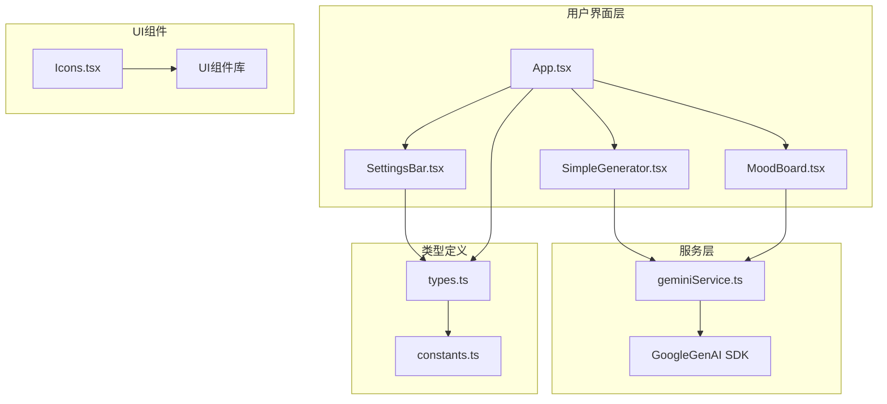
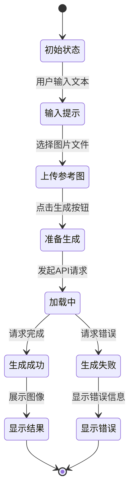
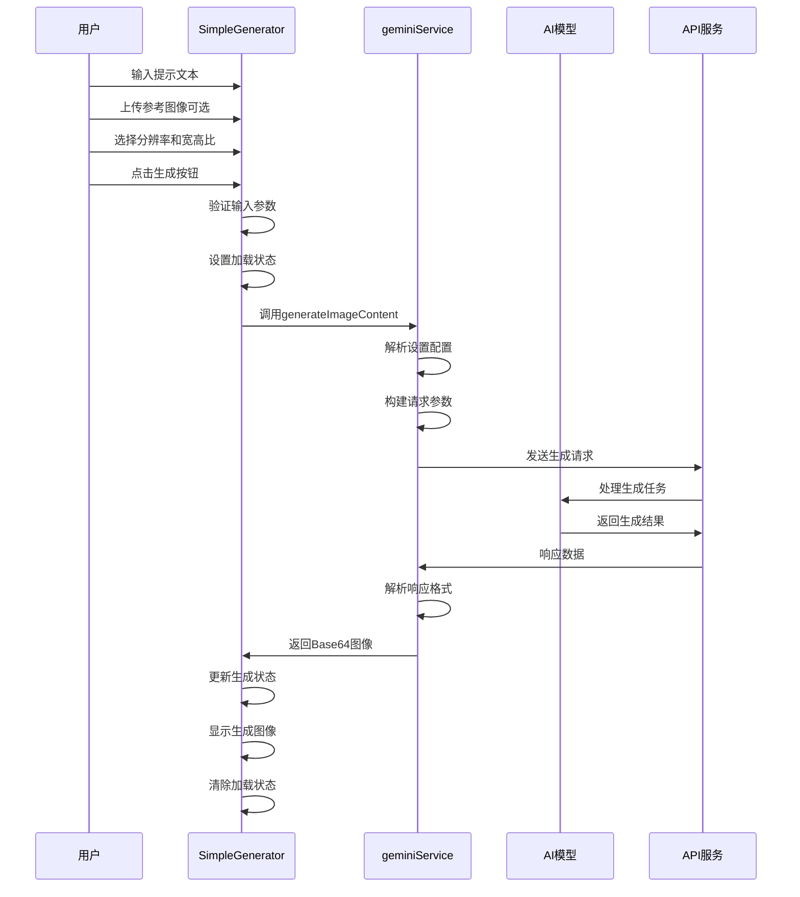
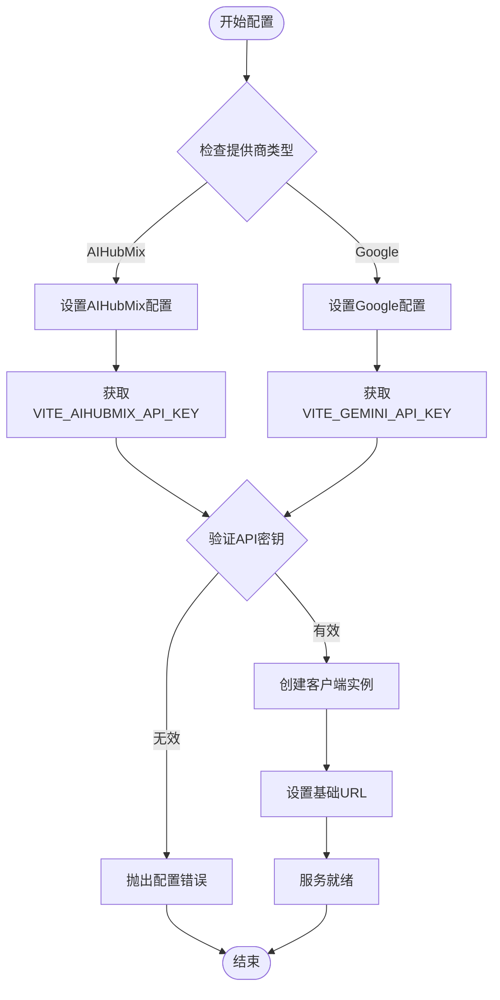
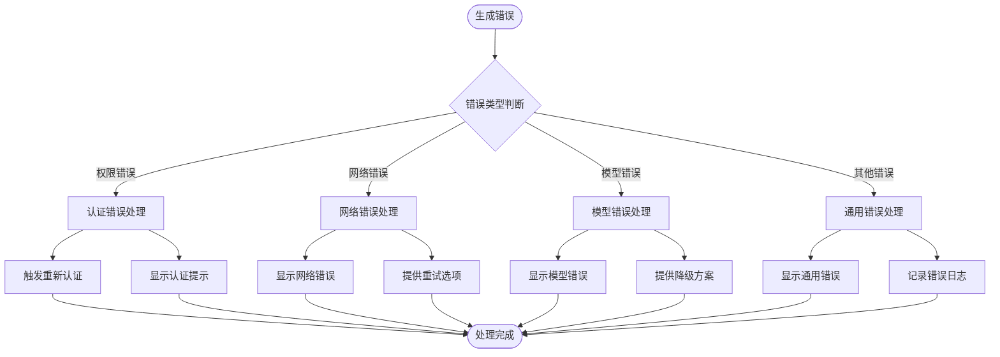

# 图像生成

<cite>
**本文档中引用的文件**
- [SimpleGenerator.tsx](file://components/SimpleGenerator.tsx)
- [MoodBoard.tsx](file://components/MoodBoard.tsx)
- [geminiService.ts](file://services/geminiService.ts)
- [App.tsx](file://App.tsx)
- [types.ts](file://types.ts)
- [constants.ts](file://constants.ts)
- [SettingsBar.tsx](file://components/SettingsBar.tsx)
- [Icons.tsx](file://components/ui/Icons.tsx)
</cite>

## 更新摘要
**变更内容**
- 在SimpleGenerator和MoodBoard组件中增加了分辨率和宽高比选择功能的用户指南
- 详细说明了Nano Banana和Nano Banana Pro模型对分辨率的支持情况
- 更新了相关代码示例以反映新的UI控件

## 目录
1. [简介](#简介)
2. [项目架构概览](#项目架构概览)
3. [SimpleGenerator组件详解](#simplegenerator组件详解)
4. [图像生成流程](#图像生成流程)
5. [AI服务集成](#ai服务集成)
6. [状态管理和错误处理](#状态管理和错误处理)
7. [提示工程技巧](#提示工程技巧)
8. [常见问题与解决方案](#常见问题与解决方案)
9. [性能优化建议](#性能优化建议)
10. [总结](#总结)

## 简介

BananaCanvase是一个基于React的AI图像生成应用程序，允许用户通过简单的文本提示和可选的参考图像来生成高质量的AI图像。该应用支持多种AI模型提供商，包括Google Gemini和AIHubMix，为用户提供灵活的图像生成体验。

核心功能包括：
- 文本驱动的图像生成
- 参考图像上传和风格引导
- 多种AI模型选择
- 实时生成进度反馈
- 错误处理和权限验证
- 生成结果的保存和管理

## 项目架构概览

应用程序采用模块化架构设计，主要分为以下几个层次：



**图表来源**
- [App.tsx](file://App.tsx#L1-L137)
- [SimpleGenerator.tsx](file://components/SimpleGenerator.tsx#L1-L148)
- [geminiService.ts](file://services/geminiService.ts#L1-L109)

**章节来源**
- [App.tsx](file://App.tsx#L1-L137)
- [types.ts](file://types.ts#L1-L56)
- [constants.ts](file://constants.ts#L1-L18)

## SimpleGenerator组件详解

SimpleGenerator是应用程序的核心组件，负责处理单次图像生成请求。该组件实现了完整的用户交互流程，从输入提示到显示生成结果。

### 组件状态管理

组件使用React的useState钩子管理以下关键状态：



**图表来源**
- [SimpleGenerator.tsx](file://components/SimpleGenerator.tsx#L12-L17)

### 核心功能实现

#### 1. 提示文本处理
用户在文本区域输入的提示文本通过受控组件模式进行管理：

- **输入验证**：检查提示是否为空或仅包含空白字符
- **实时更新**：使用onChange事件监听文本变化
- **状态同步**：通过setPrompt函数更新组件状态

#### 2. 参考图像上传
组件支持可选的参考图像上传功能：

- **文件读取**：使用FileReader API将图像转换为Base64格式
- **预览显示**：上传后在界面上显示图像预览
- **移除功能**：提供按钮用于清除已上传的图像

#### 3. 分辨率和宽高比选择
用户现在可以在生成图像前选择所需的分辨率和宽高比：

- **分辨率选择**：
  - 提供1K (1024×1024)、2K (2048×2048)、4K (4096×4096)三种选项
  - 根据所选AI模型动态调整可用选项
  - Nano Banana模型仅支持1K分辨率
  - Nano Banana Pro模型支持所有分辨率选项

- **宽高比选择**：
  - 提供1:1（正方形）、3:4（竖版）、4:3（横版）、9:16（手机竖屏）、16:9（宽屏）五种选项
  - 用户可以根据最终用途选择合适的宽高比

- **UI交互**：
  - 分辨率和宽高比选择器以并排的下拉菜单形式呈现
  - 当当前模型仅支持1K分辨率时，会显示提示信息"当前模型仅支持1K分辨率"
  - 选择器会根据`settings`对象中的当前值进行初始化

```typescript
// SimpleGenerator.tsx中的分辨率和宽高比选择UI
<div className="grid grid-cols-2 gap-3">
  <div>
    <label className="block text-sm font-medium text-slate-400 mb-2">分辨率</label>
    <select
      className="w-full bg-dark-bg border border-dark-border rounded-lg px-3 py-2 text-sm text-slate-200 focus:outline-none focus:border-banana-500 transition-colors"
      value={settings.imageSize}
      onChange={(e) => onUpdateSettings?.({ imageSize: e.target.value as ImageSize })}
      disabled={availableImageSizes.length === 1}
    >
      {availableImageSizes.map((size) => (
        <option key={size.id} value={size.id}>{size.name}</option>
      ))}
    </select>
    {availableImageSizes.length === 1 && (
      <p className="text-xs text-slate-500 mt-1">当前模型仅支持1K分辨率</p>
    )}
  </div>
  <div>
    <label className="block text-sm font-medium text-slate-400 mb-2">宽高比</label>
    <select
      className="w-full bg-dark-bg border border-dark-border rounded-lg px-3 py-2 text-sm text-slate-200 focus:outline-none focus:border-banana-500 transition-colors"
      value={settings.aspectRatio}
      onChange={(e) => onUpdateSettings?.({ aspectRatio: e.target.value as AspectRatio })}
    >
      {ASPECT_RATIOS.map((ratio) => (
        <option key={ratio.id} value={ratio.id}>{ratio.name}</option>
      ))}
    </select>
  </div>
</div>
```

**模型支持情况**：
- **Nano Banana**：仅支持1K分辨率，适用于快速生成和测试
- **Nano Banana Pro**：支持1K、2K、4K所有分辨率，适合高质量图像生成需求

当用户切换AI模型时，系统会自动检查当前选择的分辨率是否被新模型支持。如果不支持（例如从Nano Banana Pro切换到Nano Banana），系统会自动将分辨率重置为1K。

```typescript
// SimpleGenerator.tsx中的模型变化处理逻辑
useEffect(() => {
  const isCurrentSizeSupported = availableImageSizes.some(size => size.id === settings.imageSize);
  if (!isCurrentSizeSupported && onUpdateSettings) {
    onUpdateSettings({ imageSize: '1K' });
  }
}, [settings.modelId, settings.imageSize, availableImageSizes, onUpdateSettings]);
```

#### 4. 生成按钮交互
生成按钮集成了多种状态指示器：

- **禁用状态**：当没有有效提示或正在加载时禁用
- **加载动画**：显示旋转的魔法棒图标和"生成中..."文本
- **成功状态**：显示完成的魔法棒图标和"生成"文本

**章节来源**
- [SimpleGenerator.tsx](file://components/SimpleGenerator.tsx#L12-L148)
- [constants.ts](file://constants.ts#L20-L27)
- [types.ts](file://types.ts#L36-L37)

## 图像生成流程

图像生成遵循严格的异步流程，确保用户体验的流畅性和可靠性。

### 生成流程图



**图表来源**
- [SimpleGenerator.tsx](file://components/SimpleGenerator.tsx#L30-L51)
- [geminiService.ts](file://services/geminiService.ts#L5-L109)

### 关键处理步骤

#### 1. 参数验证
在发起生成请求前，系统执行多层验证：

- **提示文本检查**：确保用户输入了有效的文本描述
- **API密钥验证**：确认配置了正确的API密钥
- **模型可用性**：验证所选模型是否可用
- **分辨率兼容性**：检查所选分辨率是否被当前模型支持

#### 2. 请求构建
服务层负责构建符合AI模型要求的请求格式：

- **内容组装**：将文本提示、图像数据、分辨率和宽高比设置组合成统一格式
- **Base64编码**：确保图像数据以正确的编码格式传输
- **配置参数**：根据模型特性设置生成参数

#### 3. 响应处理
生成结果的处理涉及多个层面：

- **数据解析**：提取AI返回的Base64图像数据
- **格式验证**：确保返回的是有效的图像数据
- **错误捕获**：处理各种可能的异常情况

**章节来源**
- [SimpleGenerator.tsx](file://components/SimpleGenerator.tsx#L30-L51)
- [geminiService.ts](file://services/geminiService.ts#L5-L109)

## AI服务集成

应用程序通过geminiService模块与多个AI服务提供商集成，支持灵活的模型切换和配置管理。

### 支持的服务提供商

| 提供商 | 模型名称 | API密钥环境变量 | 基础URL |
|--------|----------|----------------|---------|
| Google Gemini | gemini-2.5-flash-image | VITE_GEMINI_API_KEY | 可配置 |
| AIHubMix | gemini-3-pro-image-preview | VITE_AIHUBMIX_API_KEY | https://aihubmix.com/gemini |

### 服务配置机制



**图表来源**
- [geminiService.ts](file://services/geminiService.ts#L11-L31)
- [constants.ts](file://constants.ts#L14-L17)

### 模型映射关系

应用程序使用常量映射将内部模型标识符转换为具体的AI服务模型名称：

- **nano-banana** → gemini-2.5-flash-image
- **nano-banana-pro** → gemini-3-pro-image-preview

这种映射机制提供了：
- 模型版本的灵活性
- 向后兼容性保证
- 简化的配置管理

**章节来源**
- [geminiService.ts](file://services/geminiService.ts#L1-L109)
- [constants.ts](file://constants.ts#L1-L18)

## 状态管理和错误处理

应用程序实现了完善的错误处理机制，确保用户能够获得清晰的反馈信息，并能够快速诊断和解决问题。

### 错误分类和处理策略



**图表来源**
- [SimpleGenerator.tsx](file://components/SimpleGenerator.tsx#L37-L48)
- [geminiService.ts](file://services/geminiService.ts#L101-L108)

### 错误消息处理

#### 认证错误检测
系统能够识别特定的认证错误模式：

- **HTTP 403状态码**：明确的权限拒绝
- **权限关键词**：包含"permission"、"access denied"等词汇
- **API密钥缺失**：未配置有效的API密钥

#### 错误消息本地化
错误消息根据错误类型进行适当的本地化：

- **技术错误**：提供详细的错误描述
- **用户友好**：使用易于理解的语言
- **操作指导**：提供解决问题的具体步骤

### 加载状态管理

组件实现了细粒度的加载状态控制：

- **全局加载标志**：指示整体操作状态
- **生成进度指示**：显示具体的生成阶段
- **用户反馈**：提供视觉和文本反馈

**章节来源**
- [SimpleGenerator.tsx](file://components/SimpleGenerator.tsx#L37-L51)
- [geminiService.ts](file://services/geminiService.ts#L101-L108)

## 提示工程技巧

为了获得最佳的图像生成效果，用户需要掌握有效的提示工程技术。以下是一些经过验证的最佳实践：

### 文本提示优化策略

#### 1. 具体描述优于模糊表达
**推荐做法**：
- "一只坐在红色椅子上的橘猫，阳光透过窗户照射"
- "未来主义城市景观，霓虹灯闪烁，赛博朋克风格"

**避免的做法**：
- "美丽的风景"
- "有趣的动物"

#### 2. 细节丰富的描述
添加具体的细节可以显著提高生成质量：

- **光照条件**："黄昏时分的柔和光线"
- **材质质感**："丝绸般的水面反射"
- **情感氛围**："神秘而宁静的氛围"

#### 3. 风格和艺术指导
明确指定期望的艺术风格：

- "梵高风格的星空"
- "日本浮世绘风格"
- "极简主义设计"

### 参考图像使用指南

#### 1. 图像选择原则
- **清晰度优先**：选择高分辨率的参考图像
- **主题相关**：确保图像内容与目标风格相关
- **构图简洁**：避免过于复杂的背景干扰

#### 2. 风格引导技巧
- **色彩引导**：使用具有代表性的颜色作为风格参考
- **纹理特征**：选择具有独特纹理的图像
- **光影效果**：利用特殊的光影效果引导生成

### 提示模板和最佳实践

#### 基础生成模板
```
"请生成一张高质量的[主题]图像，具有[风格]特点，包含[主要元素]，采用[色彩方案]，在[光照条件下]"
```

#### 高级编辑模板
```
"我有一张源图像和一个黑白蒙版图像。源图像包含[场景描述]，蒙版图像指示需要修改的区域。请仅在蒙版标记的区域内应用以下更改：[具体修改说明]。保持其余部分不变。输出最终编辑后的图像。"
```

**章节来源**
- [MoodBoard.tsx](file://components/MoodBoard.tsx#L475-L495)
- [geminiService.ts](file://services/geminiService.ts#L65-L71)

## 常见问题与解决方案

### 生成失败问题

#### 1. API密钥配置问题
**症状**：出现"API Key missing"或"Permission Denied"错误

**解决方案**：
1. 检查.env文件中的API密钥配置
2. 确认密钥格式正确且未被截断
3. 验证API密钥的有效性和余额

#### 2. 网络连接问题
**症状**：请求超时或网络错误

**解决方案**：
1. 检查网络连接稳定性
2. 尝试使用不同的网络环境
3. 检查防火墙设置

#### 3. 模型不可用问题
**症状**：模型返回"no image generated"错误

**解决方案**：
1. 切换到备用模型
2. 简化提示文本
3. 减少图像复杂度

### 性能优化问题

#### 1. 加载速度慢
**优化措施**：
- 使用压缩的图像格式
- 限制图像尺寸大小
- 实现请求缓存机制

#### 2. 内存占用过高
**优化措施**：
- 及时清理临时图像数据
- 限制同时处理的图像数量
- 使用Web Workers处理大型图像

### 用户体验问题

#### 1. 错误信息不明确
**改进方案**：
- 提供具体的错误代码和描述
- 添加解决建议链接
- 实现错误报告功能

#### 2. 界面响应迟缓
**改进方案**：
- 实现防抖动机制
- 优化渲染性能
- 提供加载骨架屏

**章节来源**
- [SimpleGenerator.tsx](file://components/SimpleGenerator.tsx#L37-L48)
- [geminiService.ts](file://services/geminiService.ts#L101-L108)

## 性能优化建议

### 前端性能优化

#### 1. 状态管理优化
- **状态分割**：将大型状态对象拆分为独立的状态片段
- **记忆化**：使用useMemo和useCallback避免不必要的重渲染
- **状态同步**：及时清理不再需要的状态数据

#### 2. 图像处理优化
- **懒加载**：延迟加载非关键图像资源
- **尺寸适配**：根据显示区域调整图像尺寸
- **格式选择**：选择最适合的图像格式

#### 3. 网络请求优化
- **请求合并**：将多个小请求合并为批量请求
- **缓存策略**：实现智能的请求缓存机制
- **超时控制**：设置合理的请求超时时间

### 后端服务优化

#### 1. API调用优化
- **连接池**：使用连接池管理API连接
- **重试机制**：实现指数退避重试策略
- **监控告警**：建立API健康监控体系

#### 2. 数据处理优化
- **流式处理**：对于大型图像采用流式处理方式
- **并发控制**：合理控制并发请求数量
- **资源限制**：设置合理的资源使用上限

### 开发工具和调试

#### 1. 性能监控
- **浏览器开发者工具**：使用Performance面板分析性能瓶颈
- **React DevTools**：监控组件渲染性能
- **网络面板**：分析网络请求性能

#### 2. 错误追踪
- **错误边界**：实现React错误边界捕获异常
- **日志记录**：记录详细的错误日志信息
- **用户反馈**：提供便捷的错误报告渠道

## 总结

BananaCanvase提供了一个完整而强大的AI图像生成解决方案，通过SimpleGenerator组件实现了直观易用的用户界面。该应用的主要优势包括：

### 技术优势
- **模块化架构**：清晰的组件分离和职责划分
- **灵活的配置**：支持多种AI服务提供商和模型
- **完善的错误处理**：提供详细的错误反馈和恢复机制
- **优秀的用户体验**：流畅的交互流程和实时状态反馈

### 功能特色
- **简单易用**：直观的文本输入和图像上传界面
- **风格引导**：支持参考图像的风格引导功能
- **多模型支持**：可切换不同AI模型以获得最佳效果
- **实时预览**：即时显示生成结果供用户评估
- **分辨率和宽高比选择**：用户可以根据需求选择不同的分辨率和宽高比，系统会根据所选模型自动调整可用选项

### 应用价值
该应用不仅为普通用户提供了创作AI图像的便捷途径，也为专业设计师和创意工作者提供了强大的工具支持。通过持续的优化和功能扩展，BananaCanvase有望成为AI图像生成领域的优秀解决方案。

对于初学者而言，建议从简单的文本提示开始，逐步探索参考图像的使用效果。对于高级用户，可以尝试更复杂的提示工程技巧和模型配置优化，以获得最佳的生成效果。