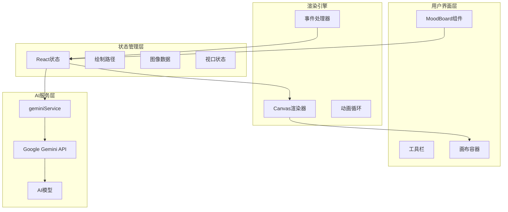
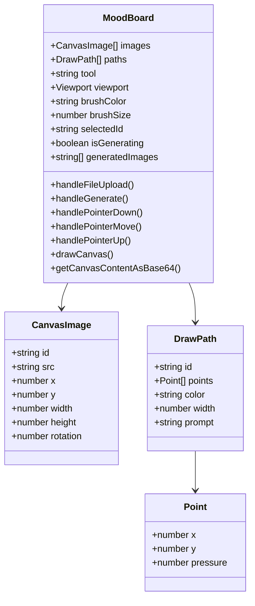
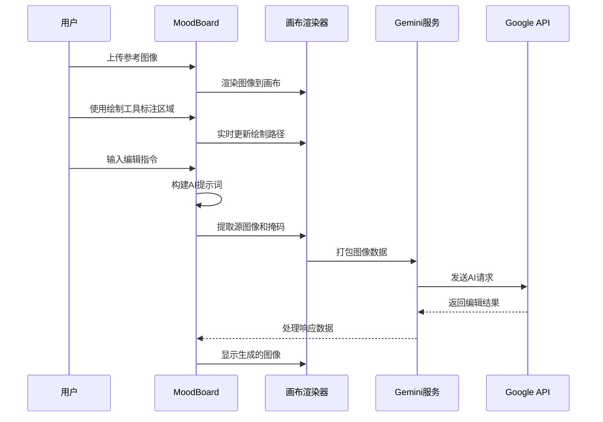
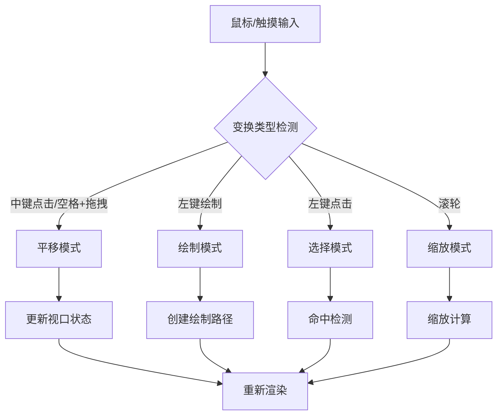
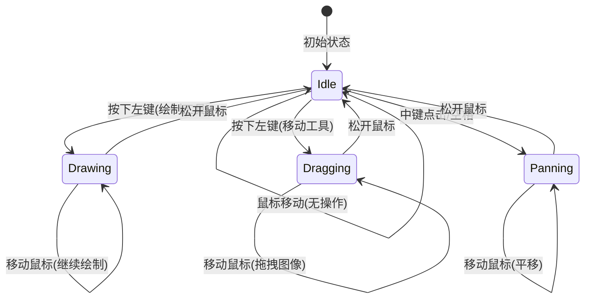
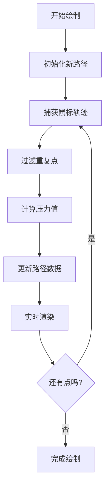
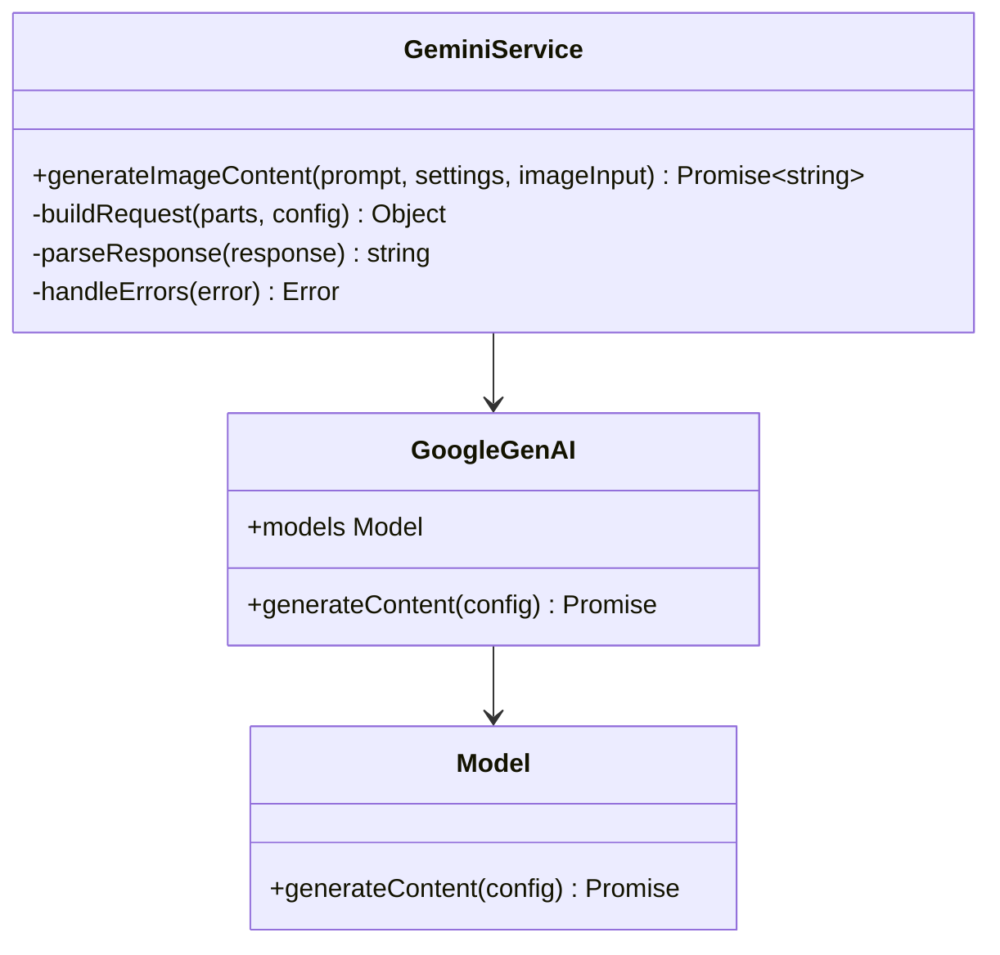
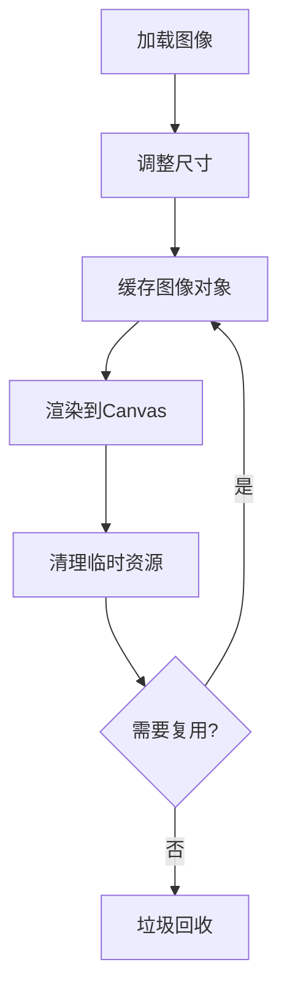
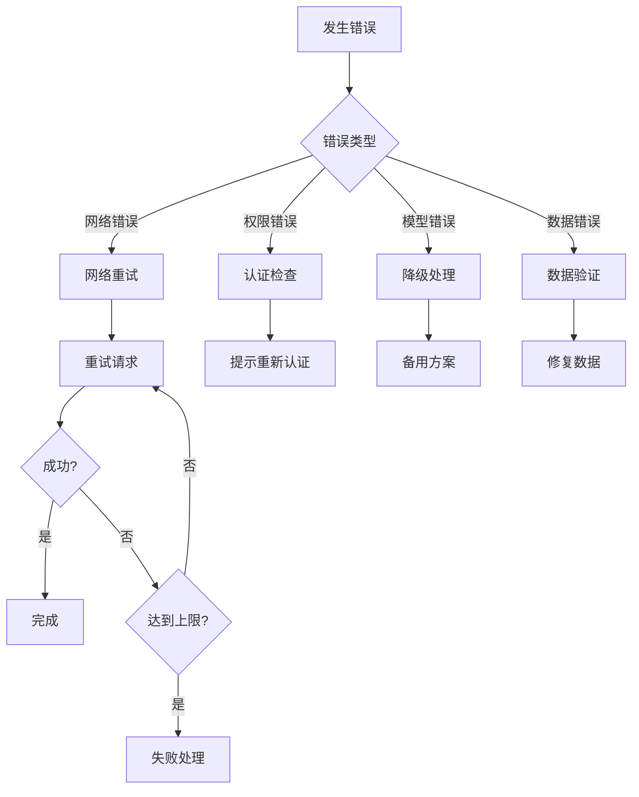

# 图像编辑功能深度解析

<cite>
**本文档引用的文件**
- [MoodBoard.tsx](file://components/MoodBoard.tsx)
- [geminiService.ts](file://services/geminiService.ts)
- [types.ts](file://types.ts)
- [constants.ts](file://constants.ts)
- [Icons.tsx](file://components/ui/Icons.tsx)
- [SettingsBar.tsx](file://components/SettingsBar.tsx)
- [SimpleGenerator.tsx](file://components/SimpleGenerator.tsx)
- [README.md](file://README.md)
</cite>

## 目录
1. [项目概述](#项目概述)
2. [核心架构](#核心架构)
3. [MoodBoard组件详解](#moodboard组件详解)
4. [图像编辑流程](#图像编辑流程)
5. [画布交互机制](#画布交互机制)
6. [绘制路径系统](#绘制路径系统)
7. [AI服务集成](#ai服务集成)
8. [状态管理与数据流](#状态管理与数据流)
9. [性能优化策略](#性能优化策略)
10. [使用指南与最佳实践](#使用指南与最佳实践)
11. [常见问题与解决方案](#常见问题与解决方案)
12. [总结](#总结)

## 项目概述

BananaCanvase是一个基于React的AI图像编辑平台，允许用户通过直观的画布界面进行局部图像编辑。该系统的核心特色是结合AI技术，让用户能够通过简单的绘制操作来指定需要修改的区域，然后由AI模型执行精确的图像编辑任务。

### 主要功能特性

- **多图层画布编辑**：支持同时处理多个参考图像
- **智能绘制工具**：提供压力感应的画笔工具
- **实时预览**：即时渲染绘制路径和图像变化
- **AI驱动编辑**：基于Google Gemini API的智能图像处理
- **灵活的编辑模式**：支持局部修改和全局优化

## 核心架构



**图表来源**
- [MoodBoard.tsx](file://components/MoodBoard.tsx#L23-L50)
- [geminiService.ts](file://services/geminiService.ts#L5-L15)

## MoodBoard组件详解

MoodBoard是整个图像编辑系统的核心组件，负责协调所有编辑功能和用户交互。

### 组件结构与状态



**图表来源**
- [MoodBoard.tsx](file://components/MoodBoard.tsx#L25-L38)
- [types.ts](file://types.ts#L12-L34)

### 工具栏功能

MoodBoard提供了三种主要的编辑工具：

1. **移动工具** (`move`)：用于拖拽和调整图像位置
2. **平移工具** (`pan`)：通过中键点击或空格键激活的画布平移
3. **绘制工具** (`draw`)：用于创建编辑掩码的画笔工具

**章节来源**
- [MoodBoard.tsx](file://components/MoodBoard.tsx#L25-L28)

## 图像编辑流程

### 完整编辑工作流程



**图表来源**
- [MoodBoard.tsx](file://components/MoodBoard.tsx#L470-L524)
- [geminiService.ts](file://services/geminiService.ts#L5-L112)

### 关键处理步骤

1. **图像加载与预处理**：自动调整图像尺寸并居中显示
2. **绘制路径采集**：实时记录用户的绘制轨迹和颜色信息
3. **AI提示构建**：将绘制信息转换为结构化的编辑指令
4. **图像数据提取**：分别生成源图像和黑白掩码
5. **AI请求发送**：通过geminiService处理图像和文本输入
6. **结果渲染**：将AI生成的图像添加到画布或侧边栏

**章节来源**
- [MoodBoard.tsx](file://components/MoodBoard.tsx#L310-L344)
- [MoodBoard.tsx](file://components/MoodBoard.tsx#L470-L524)

## 画布交互机制

### 视口变换系统

画布采用虚拟坐标系统，支持无限缩放和平移操作：



**图表来源**
- [MoodBoard.tsx](file://components/MoodBoard.tsx#L198-L287)

### 坐标转换机制

系统实现了复杂的坐标转换逻辑，将屏幕坐标转换为画布虚拟坐标：

- **屏幕坐标**：浏览器窗口内的像素位置
- **容器坐标**：相对于画布容器的位置
- **画布坐标**：应用视口变换后的虚拟坐标

**章节来源**
- [MoodBoard.tsx](file://components/MoodBoard.tsx#L71-L82)

### 事件处理系统



**图表来源**
- [MoodBoard.tsx](file://components/MoodBoard.tsx#L198-L287)

## 绘制路径系统

### DrawPath数据结构

每个绘制路径包含以下核心属性：

| 属性 | 类型 | 描述 |
|------|------|------|
| `id` | string | 路径唯一标识符 |
| `points` | Point[] | 绘制轨迹点序列 |
| `color` | string | 路径颜色（仅用于视觉区分） |
| `width` | number | 线条宽度 |
| `prompt` | string | 编辑指令 |

### Point数据结构

| 属性 | 类型 | 描述 |
|------|------|------|
| `x` | number | X坐标 |
| `y` | number | Y坐标 |
| `pressure` | number | 压力值（0-1） |

### 绘制算法实现



**图表来源**
- [MoodBoard.tsx](file://components/MoodBoard.tsx#L210-L262)

### 压力感应与线条粗细

系统支持压力感应，根据触摸设备的压力值动态调整线条粗细：

- **基础宽度**：由用户设置的画笔大小
- **压力系数**：0.5 + 压力值（范围0.5-1.5）
- **最终宽度**：基础宽度 × 压力系数

**章节来源**
- [MoodBoard.tsx](file://components/MoodBoard.tsx#L147-L158)

## AI服务集成

### geminiService架构



**图表来源**
- [geminiService.ts](file://services/geminiService.ts#L5-L112)

### 请求构建流程

AI请求包含以下要素：

1. **图像输入**：源图像和黑白掩码（可选）
2. **文本提示**：结构化的编辑指令
3. **生成配置**：模型特定的参数设置

### 支持的模型配置

| 提供商 | 模型ID | 模型名称 | 特性 |
|--------|--------|----------|------|
| Google | nano-banana | gemini-2.5-flash-image | 快速生成 |
| Google | nano-banana-pro | gemini-3-pro-image-preview | 高质量生成 |

**章节来源**
- [constants.ts](file://constants.ts#L14-L17)
- [geminiService.ts](file://services/geminiService.ts#L34-L82)

## 状态管理与数据流

### React状态架构

```mermaid
graph LR
subgraph "本地状态"
Images[images: CanvasImage[]]
Paths[paths: DrawPath[]]
Tool[tool: string]
Viewport[viewport: Viewport]
Settings[settings: AppSettings]
end
subgraph "派生状态"
SelectedId[selectedId: string]
IsGenerating[isGenerating: boolean]
GeneratedImages[generatedImages: string[]]
end
subgraph "引用状态"
IsDrawing[isDrawing: Ref]
LastPos[lastPos: Ref]
CanvasRef[canvasRef: Ref]
end
Images --> CanvasRender[画布渲染]
Paths --> CanvasRender
Tool --> EventHandlers[事件处理]
Viewport --> CanvasTransform[坐标变换]
```

**图表来源**
- [MoodBoard.tsx](file://components/MoodBoard.tsx#L25-L50)

### 数据流控制

系统采用单向数据流模式：

1. **用户交互** → **事件处理器** → **状态更新**
2. **状态变更** → **副作用钩子** → **DOM更新**
3. **定时渲染** → **Canvas重绘** → **视觉反馈**

**章节来源**
- [MoodBoard.tsx](file://components/MoodBoard.tsx#L166-L174)

## 性能优化策略

### 渲染优化

1. **requestAnimationFrame**：使用浏览器原生动画帧同步渲染
2. **增量更新**：只重绘发生变化的部分
3. **离屏渲染**：复杂图像处理使用临时Canvas
4. **内存管理**：及时释放不再使用的图像资源

### 事件处理优化

1. **防抖处理**：过滤高频事件触发
2. **引用缓存**：使用useRef避免不必要的重渲染
3. **条件渲染**：根据状态决定是否执行昂贵操作

### 内存优化



**图表来源**
- [MoodBoard.tsx](file://components/MoodBoard.tsx#L318-L339)

## 使用指南与最佳实践

### 标注精度对编辑效果的影响

1. **精细标注**：小面积精确标注适合细节修改
2. **粗略标注**：大面积标注适合风格统一的修改
3. **颜色编码**：不同颜色代表不同的编辑意图
4. **指令清晰**：明确的文本指令提高AI理解准确性

### 典型使用场景

#### 场景一：背景修改
- **操作**：绘制前景物体轮廓
- **指令**："将背景替换为海滩日落"
- **效果**：保留主体，智能替换背景

#### 场景二：物体替换
- **操作**：圈选需要替换的物体
- **指令**："将椅子替换为红色皮质沙发"
- **效果**：保持场景一致性

#### 场景三：风格统一
- **操作**：绘制需要调整的部分
- **指令**："使整体色调更加温暖"
- **效果**：全局风格优化

### 工具使用建议

1. **画笔大小**：根据编辑区域大小选择合适的画笔
2. **压力感应**：利用触控设备的压力感知提升精度
3. **颜色区分**：使用不同颜色标记不同类型的操作
4. **指令编写**：保持指令简洁明确，避免歧义

## 常见问题与解决方案

### 图像加载问题

**问题**：图像无法正确显示或加载失败
**原因**：
- 文件格式不支持
- 图像尺寸过大
- CORS跨域限制

**解决方案**：
1. 确保上传PNG、JPG等标准格式
2. 系统自动压缩大尺寸图像
3. 检查服务器CORS配置

### 编辑响应延迟

**问题**：AI生成过程耗时过长
**原因**：
- 图像分辨率过高
- 网络连接不稳定
- AI模型负载过高

**解决方案**：
1. 降低图像分辨率
2. 检查网络连接质量
3. 优化并发请求数量

### 绘制精度问题

**问题**：绘制路径不够精确
**原因**：
- 设备压力感应不准确
- 手指抖动影响
- 屏幕分辨率差异

**解决方案**：
1. 使用触控笔获得更好压力感应
2. 减少手指接触面积
3. 校准屏幕显示比例

### AI生成质量问题

**问题**：AI生成结果不符合预期
**原因**：
- 文本指令表述不清
- 掩码区域划分不当
- 图像内容过于复杂

**解决方案**：
1. 使用更具体的描述性语言
2. 细化掩码边界
3. 分步骤进行复杂编辑

### 错误处理机制



**图表来源**
- [geminiService.ts](file://services/geminiService.ts#L104-L111)

## 总结

BananaCanvase的MoodBoard组件提供了一个功能强大且用户友好的图像编辑平台。通过结合现代Web技术、AI服务和直观的交互设计，它实现了从简单图像合成到复杂局部编辑的全方位图像处理能力。

### 技术亮点

1. **高性能Canvas渲染**：利用WebGL和requestAnimationFrame实现流畅的用户体验
2. **智能AI集成**：无缝对接Google Gemini API，提供高质量的图像编辑服务
3. **灵活的状态管理**：React Hooks + 自定义状态机确保复杂交互的稳定性
4. **完善的错误处理**：多层次的错误检测和恢复机制

### 应用价值

该系统不仅展示了AI图像处理技术的实际应用，更为设计师、艺术家和普通用户提供了强大的创作工具。通过降低图像编辑的技术门槛，它 democratized了专业级的图像处理能力。

### 未来发展方向

1. **移动端优化**：增强触控体验和性能表现
2. **更多AI模型**：集成其他先进的图像生成模型
3. **协作功能**：支持多人实时协作编辑
4. **插件生态**：开放API支持第三方扩展

通过持续的技术创新和用户体验优化，BananaCanvase有望成为下一代图像编辑工具的重要代表。