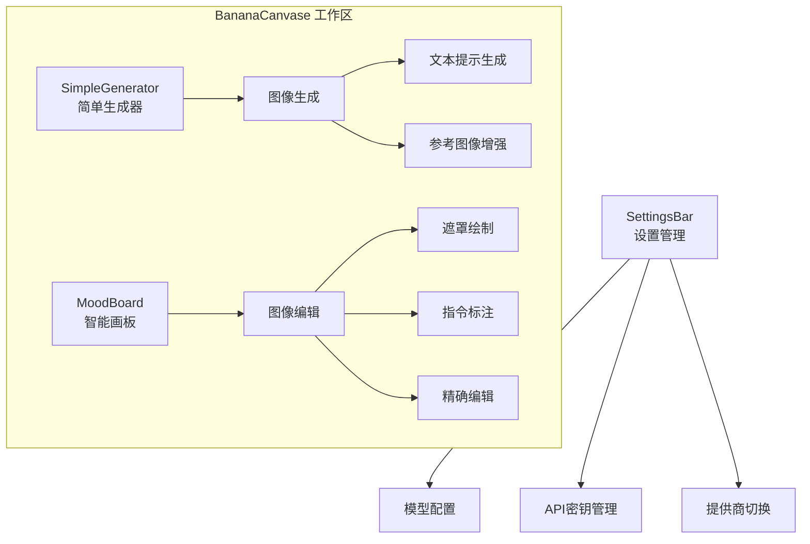
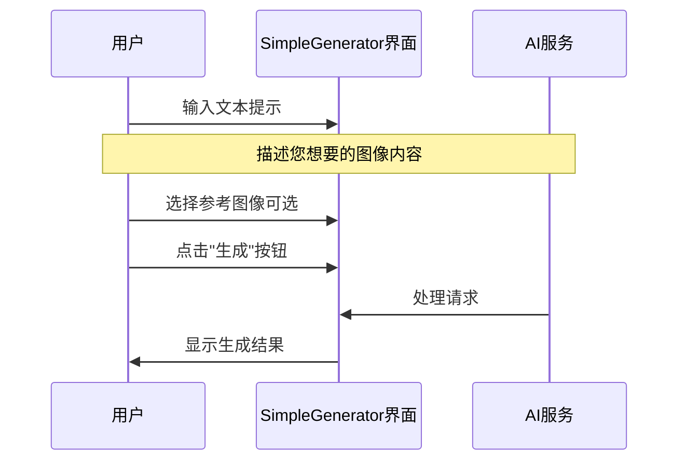
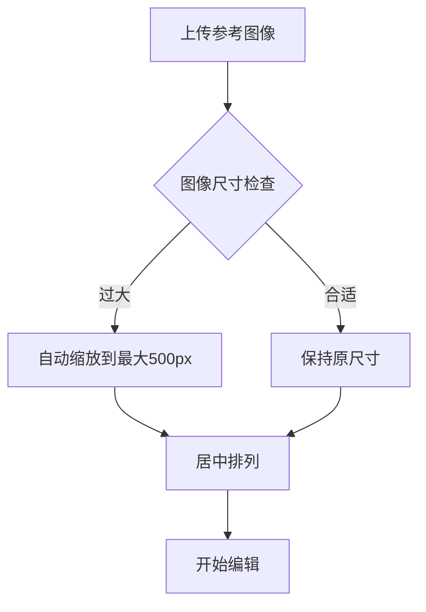
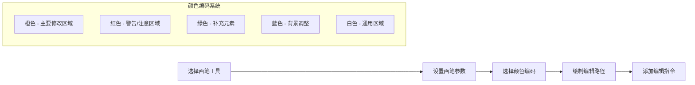
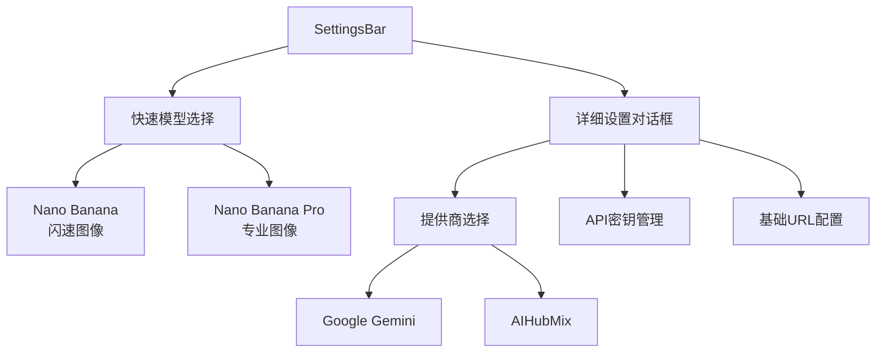
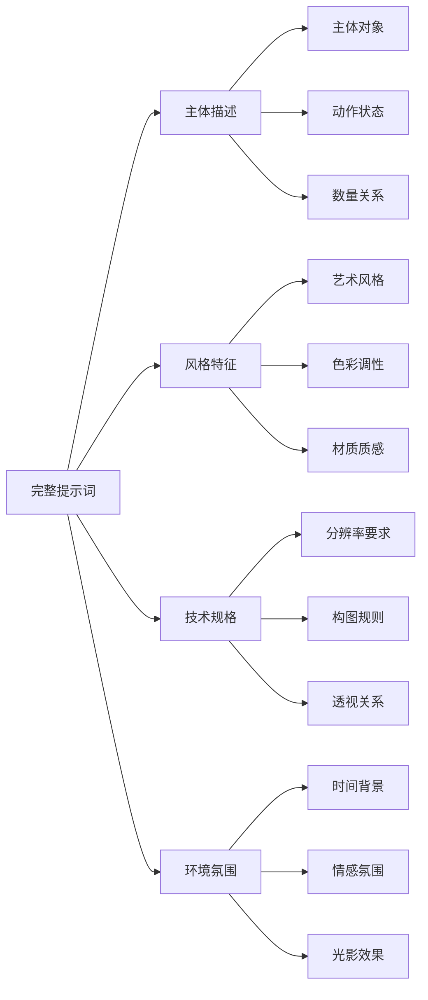
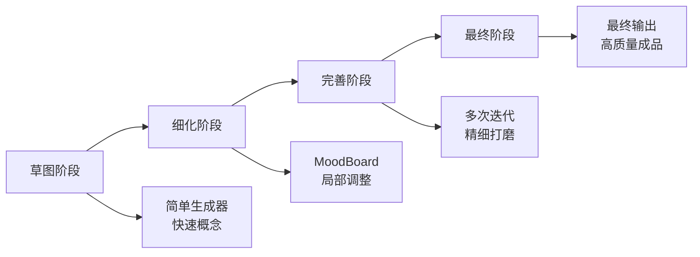

# BananaCanvase 用户操作指南

<cite>
**本文档引用的文件**
- [App.tsx](file://App.tsx)
- [SimpleGenerator.tsx](file://components/SimpleGenerator.tsx)
- [MoodBoard.tsx](file://components/MoodBoard.tsx)
- [SettingsBar.tsx](file://components/SettingsBar.tsx)
- [geminiService.ts](file://services/geminiService.ts)
- [types.ts](file://types.ts)
- [constants.ts](file://constants.ts)
- [README.md](file://README.md)
</cite>

## 目录
1. [简介](#简介)
2. [系统要求与安装](#系统要求与安装)
3. [核心功能概览](#核心功能概览)
4. [图像生成流程](#图像生成流程)
5. [图像编辑流程](#图像编辑流程)
6. [设置管理](#设置管理)
7. [提示工程最佳实践](#提示工程最佳实践)
8. [故障排除](#故障排除)
9. [高级技巧](#高级技巧)

## 简介

BananaCanvase 是一个强大的AI驱动图像生成和编辑平台，专为创意工作者设计。它提供了两种主要工作模式：简单图像生成器（SimpleGenerator）用于快速创建新图像，以及智能画板（MoodBoard）用于精确编辑现有图像。

### 主要特性
- **双模式工作流**：支持从零开始创作和基于参考的编辑
- **多模型支持**：集成Google Gemini和AIHubMix AI服务
- **直观界面**：拖放式操作和实时预览
- **专业级编辑**：精确的遮罩绘制和指令标注

## 系统要求与安装

### 前置条件
- Node.js (版本16或更高)
- 有效的Google Gemini API密钥或AIHubMix API密钥
- 现代Web浏览器（Chrome、Firefox、Safari）

### 安装步骤

1. **克隆项目**
   ```bash
   git clone [项目URL]
   cd BananaCanvase
   ```

2. **安装依赖**
   ```bash
   npm install
   ```

3. **配置API密钥**
   在项目根目录创建 `.env.local` 文件：
   ```
   VITE_GEMINI_API_KEY=your_gemini_api_key_here
   # 或者
   VITE_AIHUBMIX_API_KEY=your_aihubmix_api_key_here
   ```

4. **启动应用**
   ```bash
   npm run dev
   ```

**章节来源**
- [README.md](file://README.md#L16-L20)
- [App.tsx](file://App.tsx#L33-L42)

## 核心功能概览

BananaCanvase 提供两个主要工作空间，每个都有独特的用途和优势：



**图表来源**
- [App.tsx](file://App.tsx#L98-L133)
- [SimpleGenerator.tsx](file://components/SimpleGenerator.tsx#L54-L145)
- [MoodBoard.tsx](file://components/MoodBoard.tsx#L556-L770)

### 功能对比表

| 特性 | SimpleGenerator | MoodBoard |
|------|----------------|-----------|
| **主要用途** | 文本驱动图像生成 | 参考图像精确编辑 |
| **输入方式** | 文本提示 | 图像+遮罩 |
| **编辑精度** | 全局风格调整 | 局部细节修改 |
| **学习曲线** | 极低 | 中等 |
| **适用场景** | 快速原型、概念设计 | 高质量后期制作 |

## 图像生成流程

SimpleGenerator 是BananaCanvase的核心创作工具，适合从零开始创建新图像。

### 第一步：准备文本提示



**图表来源**
- [SimpleGenerator.tsx](file://components/SimpleGenerator.tsx#L30-L51)

#### 操作步骤

1. **打开SimpleGenerator**
   - 在顶部导航栏点击"Simple Generator"标签
   - 界面左侧显示为创作面板

2. **撰写文本提示**
   - 在文本框中输入详细的图像描述
   - 包含风格、主题、色彩和构图信息
   - 示例："一只坐在咖啡杯上的卡通猫，水彩风格，温暖色调"

3. **添加参考图像（可选）**
   - 点击"上传"区域
   - 选择一张参考图片
   - 图片会显示在界面上方
   - 可以随时删除重新上传

4. **启动生成过程**
   - 确认提示清晰完整
   - 点击"Generate"按钮
   - 观察加载动画直到完成

### 第二步：查看和保存结果

生成完成后，右侧会显示最终图像：

- **放大查看**：使用鼠标滚轮缩放
- **下载保存**：点击下载按钮保存到本地
- **重新生成**：修改提示后再次点击生成

**章节来源**
- [SimpleGenerator.tsx](file://components/SimpleGenerator.tsx#L62-L145)

## 图像编辑流程

MoodBoard提供专业的图像编辑功能，允许用户基于现有图像进行精确修改。

### 第一步：准备参考图像



**图表来源**
- [MoodBoard.tsx](file://components/MoodBoard.tsx#L310-L344)

#### 操作步骤

1. **上传参考图像**
   - 点击工具栏上的相册图标
   - 选择本地图片文件
   - 支持多种格式（PNG、JPG、WebP等）
   - 可同时上传多张图片

2. **调整图像位置**
   - 使用"移动"工具选择图像
   - 拖拽到理想位置
   - 图像周围会出现蓝色选中框

3. **缩放和旋转**
   - 选中图像后拖动角落控制点
   - 按住Shift键保持比例
   - 右键拖动进行旋转变换

### 第二步：绘制编辑区域

MoodBoard的核心功能是通过画笔工具精确标记需要修改的区域：

#### 画笔工具使用指南



**图表来源**
- [MoodBoard.tsx](file://components/MoodBoard.tsx#L584-L602)

#### 绘制步骤详解

1. **选择画笔工具**
   - 点击工具栏中的画笔图标（P键快捷键）
   - 画笔工具激活后，鼠标变为画笔形状

2. **调整画笔参数**
   - **画笔大小**：使用滑块调节（范围5-100像素）
   - **颜色选择**：点击颜色圆圈选择编码颜色
   - 不同颜色代表不同类型的编辑需求

3. **绘制编辑路径**
   - 在需要修改的区域上绘制连续线条
   - 线条越宽，影响范围越大
   - 可以绘制复杂的形状覆盖整个区域

4. **添加编辑指令**
   - 绘制完成后，在弹出的文本框中输入具体指令
   - 指令示例："将天空替换为日落景色"
   - 多个区域可以分别添加不同的指令

### 第三步：执行编辑生成

完成所有编辑标记后，执行生成过程：

1. **检查编辑标记**
   - 确认所有需要修改的区域都已正确标记
   - 检查指令描述是否清晰准确

2. **启动编辑生成**
   - 点击"Generate"按钮
   - AI会根据标记区域和指令精确修改图像

3. **查看编辑结果**
   - 生成的图像会出现在右侧结果面板
   - 可以添加到画布、下载或删除

**章节来源**
- [MoodBoard.tsx](file://components/MoodBoard.tsx#L198-L284)
- [MoodBoard.tsx](file://components/MoodBoard.tsx#L470-L524)

## 设置管理

SettingsBar提供全面的系统配置选项，确保您能够充分利用BananaCanvase的所有功能。

### 模型配置



**图表来源**
- [SettingsBar.tsx](file://components/SettingsBar.tsx#L56-L76)
- [SettingsBar.tsx](file://components/SettingsBar.tsx#L81-L160)

#### 模型对比

| 模型 | 速度 | 质量 | 价格 | 适用场景 |
|------|------|------|------|----------|
| **Nano Banana** | 极快 | 中等 | 免费 | 快速原型、测试 |
| **Nano Banana Pro** | 较慢 | 优秀 | 免费 | 高质量作品、专业用途 |

#### API密钥管理

1. **手动输入密钥**
   - 打开设置对话框
   - 在API密钥字段输入您的密钥
   - 密钥仅存储在本地浏览器中

2. **Google AI Studio集成**
   - 如果安装了Google AI Studio扩展
   - 点击"使用Google AI Studio密钥选择器"
   - 自动获取并验证密钥

3. **提供商切换**
   - 支持Google Gemini和AIHubMix
   - 切换时自动更新相关配置
   - 密钥独立管理

### 高级配置选项

1. **基础URL配置**
   - 用于自定义API端点
   - 通常留空使用默认Google服务
   - 适用于企业内部部署

2. **本地存储**
   - 设置自动保存到浏览器localStorage
   - 关闭页面后设置仍然保留
   - 支持跨设备同步设置

**章节来源**
- [SettingsBar.tsx](file://components/SettingsBar.tsx#L15-L45)
- [SettingsBar.tsx](file://components/SettingsBar.tsx#L81-L160)

## 提示工程最佳实践

高质量的提示词是获得满意结果的关键。以下是一些经过验证的最佳实践：

### 文本提示优化策略

#### 1. 结构化描述方法



#### 2. 推荐的提示词模板

**基础创作模板**
```
"[主体描述], [风格特征], [技术规格], [环境氛围]"
```

**示例组合**
- "一位穿着复古服装的年轻女性，水彩风格，柔和色彩，自然光线，温馨家庭环境"
- "未来主义城市景观，霓虹灯光效果，赛博朋克风格，高对比度，动态构图"

**编辑指令模板**
```
"在[区域描述]中，[具体修改内容]，保持[保留元素]不变"
```

**示例编辑指令**
- "在前景的花丛中，添加几朵盛开的玫瑰，保持整体风格一致"
- "将天空替换为日落时分的橙色天空，保留建筑物轮廓"

### 遮罩绘制指导原则

#### 1. 区域标记策略

| 颜色编码 | 用途 | 示例场景 |
|----------|------|----------|
| **橙色** | 主要修改区域 | 更换背景、添加元素 |
| **红色** | 注意警告区域 | 需要特别处理的边缘 |
| **绿色** | 补充元素 | 添加小物件、装饰品 |
| **蓝色** | 背景调整 | 修改天空、地面 |
| **白色** | 通用区域 | 大面积统一修改 |

#### 2. 绘制技巧

**精确度控制**
- 小区域使用细画笔（5-15像素）
- 大区域使用粗画笔（50-100像素）
- 边缘区域适当扩大边界避免锯齿

**层次组织**
- 重要修改使用单一颜色组
- 多个修改区域使用不同颜色区分
- 复杂场景按逻辑分层标记

**章节来源**
- [SimpleGenerator.tsx](file://components/SimpleGenerator.tsx#L30-L51)
- [MoodBoard.tsx](file://components/MoodBoard.tsx#L470-L524)

## 故障排除

常见问题及解决方案：

### 认证问题

**问题**：API密钥无效或权限不足
**症状**：出现"Permission Denied (403)"错误
**解决方法**：
1. 检查API密钥是否正确复制粘贴
2. 确认密钥具有图像生成权限
3. 重新配置设置或使用Google AI Studio认证

### 性能问题

**问题**：生成过程缓慢或卡顿
**可能原因**：
- 图像尺寸过大
- 网络连接不稳定
- AI模型负载过高

**优化方案**：
- 缩小参考图像尺寸
- 使用更简单的提示词
- 选择更快的模型（Nano Banana）

### 浏览器兼容性

**推荐浏览器**：Chrome 90+、Firefox 88+、Safari 14+
**已知问题**：
- 某些旧版浏览器可能不支持WebGL加速
- 移动设备触摸体验有限

**解决方案**：
- 更新浏览器到最新版本
- 使用桌面浏览器获得最佳体验

**章节来源**
- [App.tsx](file://App.tsx#L49-L61)
- [geminiService.ts](file://services/geminiService.ts#L101-L108)

## 高级技巧

### 工作流程优化

#### 1. 分阶段创作流程



#### 2. 高效工作技巧

**批量处理策略**
- 使用MoodBoard的多区域标记功能
- 合理组织颜色编码提高效率
- 保存常用编辑模板

**质量控制方法**
- 定期保存中间结果
- 使用对比视图检查修改效果
- 多角度验证最终结果

**资源管理**
- 合理组织本地文件
- 利用浏览器书签收藏重要设置
- 建立个人提示词库

### 协作与分享

虽然BananaCanvase目前主要面向个人使用，但您可以：
- 将生成的图像导出分享给团队
- 使用截图记录重要的编辑过程
- 建立团队内部的提示词标准

通过掌握这些高级技巧，您将能够充分发挥BananaCanvase的潜力，创造出令人惊艳的AI驱动艺术作品。