# 设置管理

<cite>
**本文档中引用的文件**
- [SettingsBar.tsx](file://components/SettingsBar.tsx)
- [constants.ts](file://constants.ts)
- [types.ts](file://types.ts)
- [App.tsx](file://App.tsx)
- [geminiService.ts](file://services/geminiService.ts)
- [vite.config.ts](file://vite.config.ts)
- [package.json](file://package.json)
</cite>

## 目录
1. [简介](#简介)
2. [项目结构概览](#项目结构概览)
3. [核心组件架构](#核心组件架构)
4. [设置管理功能详解](#设置管理功能详解)
5. [类型安全的配置系统](#类型安全的配置系统)
6. [本地存储持久化](#本地存储持久化)
7. [API密钥配置](#api密钥配置)
8. [状态同步机制](#状态同步机制)
9. [错误处理与故障排除](#错误处理与故障排除)
10. [最佳实践指南](#最佳实践指南)
11. [总结](#总结)

## 简介

BananaCanvase项目中的SettingsBar组件是一个功能强大的设置管理界面，为用户提供了一个直观的方式来配置AI模型提供商、选择不同的AI模型，并管理API密钥等关键设置。该组件采用React构建，结合TypeScript提供了完整的类型安全保障，同时通过浏览器本地存储实现了配置的持久化。

## 项目结构概览

SettingsBar组件位于`components/`目录下，是整个应用设置管理的核心入口。它与以下关键文件协同工作：

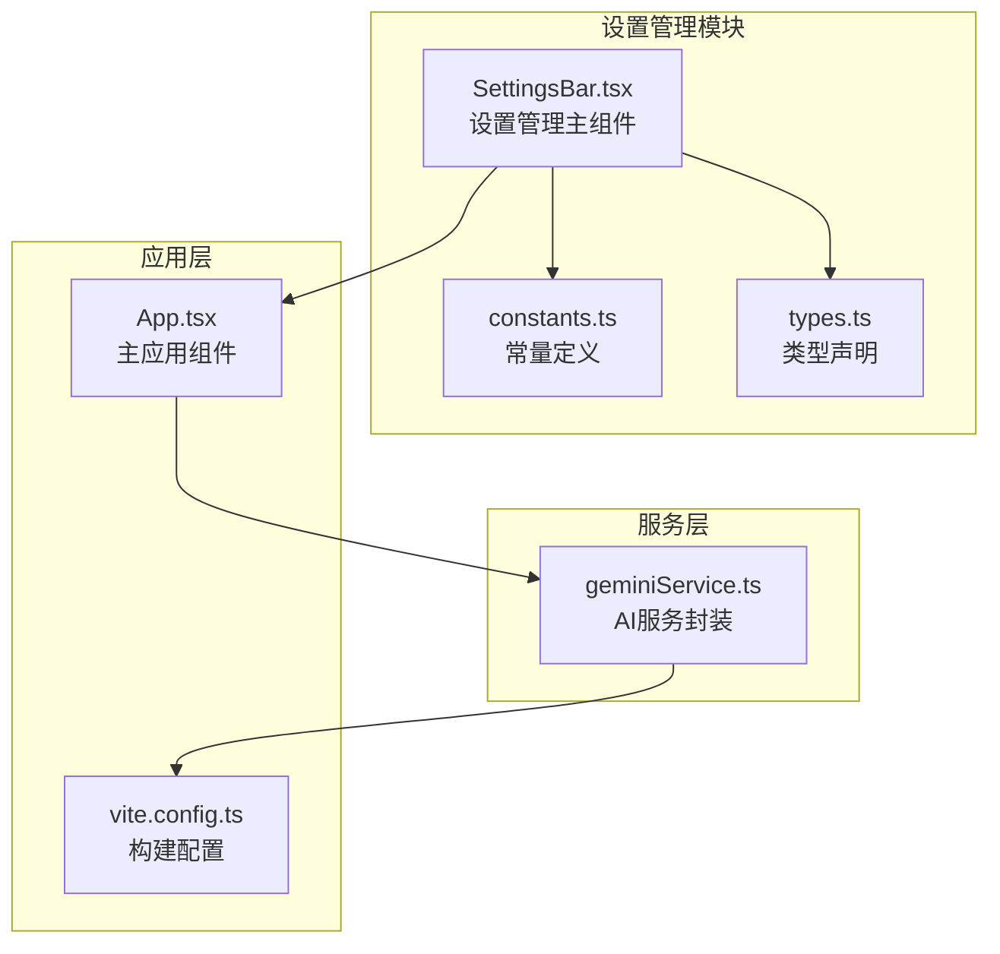

**图表来源**
- [SettingsBar.tsx](file://components/SettingsBar.tsx#L1-L132)
- [constants.ts](file://constants.ts#L1-L18)
- [types.ts](file://types.ts#L1-L56)
- [App.tsx](file://App.tsx#L1-L137)

**章节来源**
- [SettingsBar.tsx](file://components/SettingsBar.tsx#L1-L132)
- [constants.ts](file://constants.ts#L1-L18)
- [types.ts](file://types.ts#L1-L56)

## 核心组件架构

SettingsBar组件采用了现代化的React架构设计，包含以下核心特性：

### 组件结构设计

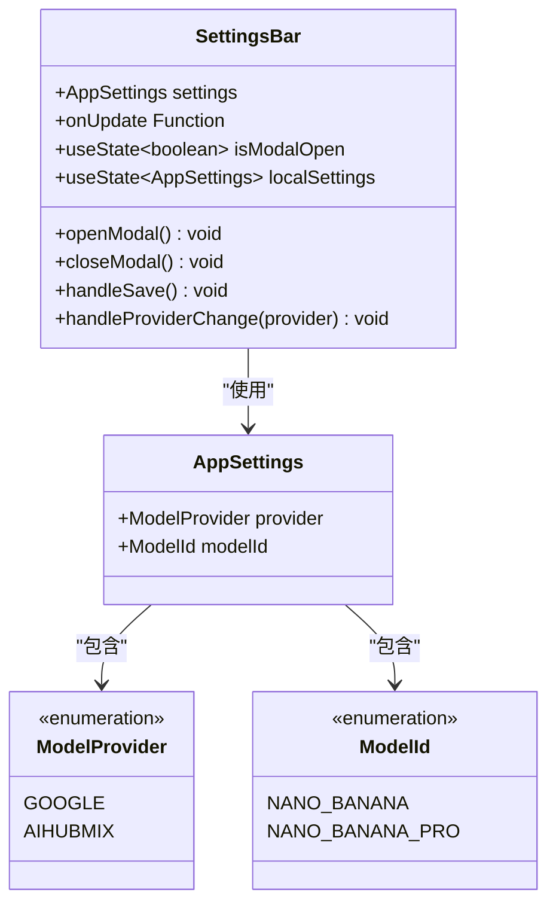

**图表来源**
- [SettingsBar.tsx](file://components/SettingsBar.tsx#L6-L132)
- [types.ts](file://types.ts#L2-L10)

### 用户界面层次

组件采用分层设计，提供简洁直观的用户体验：

1. **顶部导航栏**：显示设置图标和标题
2. **快速模型选择器**：直接切换当前使用的AI模型
3. **设置模态框**：完整的配置界面
4. **提供商标识**：清晰区分不同AI服务提供商

**章节来源**
- [SettingsBar.tsx](file://components/SettingsBar.tsx#L36-L132)

## 设置管理功能详解

### 快速模型选择器

SettingsBar提供了便捷的模型选择功能，允许用户在当前可用的AI模型之间快速切换：

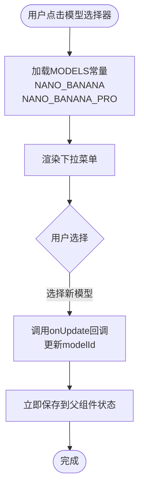

**图表来源**
- [SettingsBar.tsx](file://components/SettingsBar.tsx#L47-L55)
- [constants.ts](file://constants.ts#L8-L11)

### 完整设置模态框

当用户点击"Config"按钮时，会打开一个功能丰富的设置模态框：

#### 提供商选择功能

用户可以在Google和AIHubMix两个AI服务提供商之间进行选择：

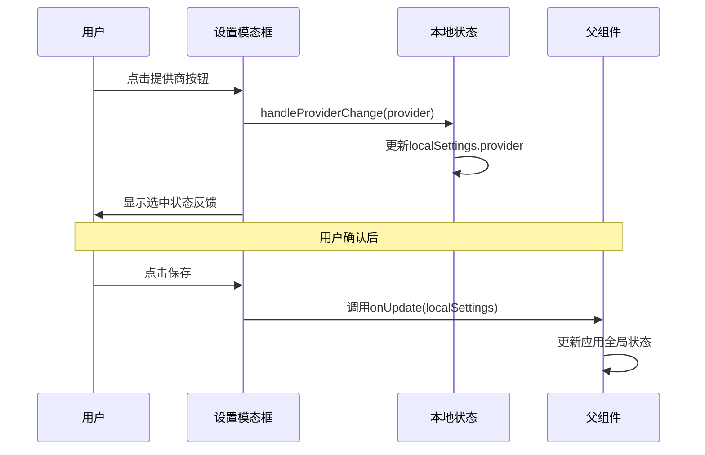

**图表来源**
- [SettingsBar.tsx](file://components/SettingsBar.tsx#L31-L32)
- [SettingsBar.tsx](file://components/SettingsBar.tsx#L69-L132)

#### 配置信息提示

模态框中包含了重要的配置指导信息：

- **环境变量说明**：明确指出API密钥需要配置在`.env`文件中
- **具体变量名称**：Google提供者对应`VITE_GEMINI_API_KEY`，AIHubMix对应`VITE_AIHUBMIX_API_KEY`
- **安全提示**：强调API密钥的安全性

**章节来源**
- [SettingsBar.tsx](file://components/SettingsBar.tsx#L69-L132)

## 类型安全的配置系统

### 枚举类型定义

项目使用TypeScript枚举确保配置选项的类型安全：

| 类型 | 可选值 | 描述 |
|------|--------|------|
| ModelProvider | GOOGLE, AIHUBMIX | AI服务提供商标识 |
| ModelId | NANO_BANANA, NANO_BANANA_PRO | 具体AI模型标识 |

### 接口定义

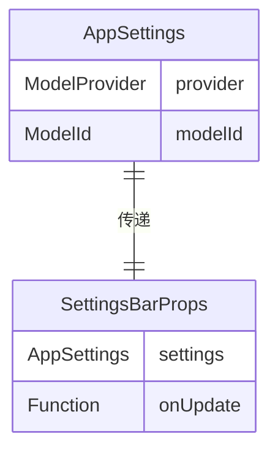

**图表来源**
- [types.ts](file://types.ts#L2-L10)
- [SettingsBar.tsx](file://components/SettingsBar.tsx#L6-L9)

这种类型系统的设计优势：
- **编译时检查**：防止运行时类型错误
- **智能提示**：开发工具提供完整的代码补全
- **文档化**：类型定义本身就是良好的API文档

**章节来源**
- [types.ts](file://types.ts#L1-L56)

## 本地存储持久化

### 存储机制

应用使用浏览器的localStorage API实现设置的持久化存储：

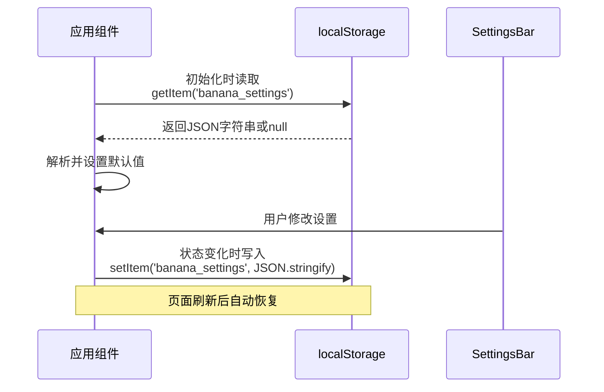

**图表来源**
- [App.tsx](file://App.tsx#L8-L23)
- [App.tsx](file://App.tsx#L28-L31)

### 持久化流程

1. **初始化阶段**：应用启动时从localStorage读取保存的设置
2. **更新阶段**：用户修改设置时自动保存到localStorage
3. **恢复机制**：页面刷新后自动恢复之前的配置

### 错误处理

系统包含了健壮的错误处理机制：

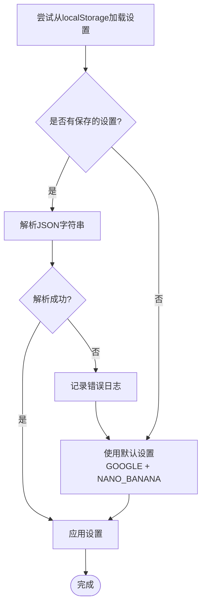

**图表来源**
- [App.tsx](file://App.tsx#L8-L23)

**章节来源**
- [App.tsx](file://App.tsx#L8-L31)

## API密钥配置

### 环境变量系统

SettingsBar组件通过环境变量管理系统所需的API密钥：

#### 支持的环境变量

| 提供商 | 环境变量名 | 用途 |
|--------|------------|------|
| Google | `VITE_GEMINI_API_KEY` | Google Gemini API访问密钥 |
| AIHubMix | `VITE_AIHUBMIX_API_KEY` | AIHubMix服务访问密钥 |

### 配置验证机制

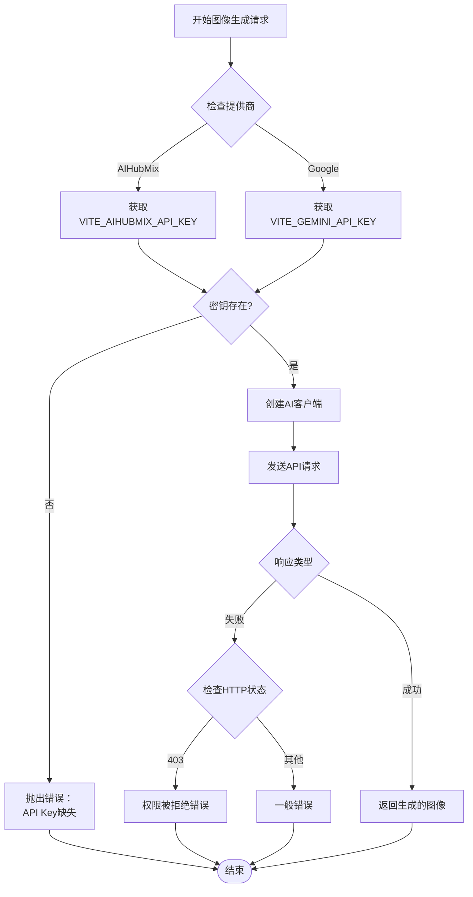

**图表来源**
- [geminiService.ts](file://services/geminiService.ts#L11-L25)
- [geminiService.ts](file://services/geminiService.ts#L104-L111)

### Vite配置集成

项目使用Vite作为构建工具，通过环境变量注入API密钥：

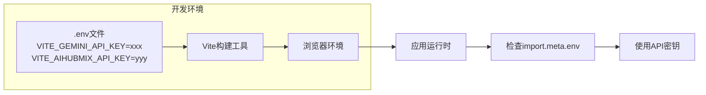

**图表来源**
- [vite.config.ts](file://vite.config.ts#L6-L7)
- [geminiService.ts](file://services/geminiService.ts#L15-L20)

**章节来源**
- [geminiService.ts](file://services/geminiService.ts#L11-L25)
- [vite.config.ts](file://vite.config.ts#L1-L25)

## 状态同步机制

### 双向数据绑定

SettingsBar组件实现了复杂的状态同步机制：

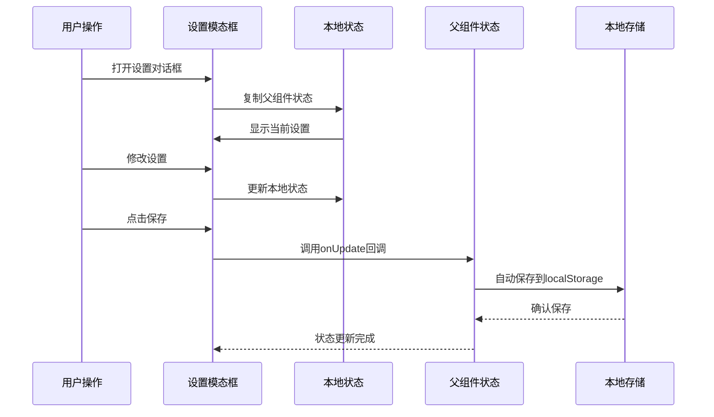

**图表来源**
- [SettingsBar.tsx](file://components/SettingsBar.tsx#L14-L29)
- [App.tsx](file://App.tsx#L45-L47)

### 状态管理模式

1. **本地状态隔离**：模态框内部维护独立的状态副本
2. **延迟提交**：只有在用户确认后才更新父组件状态
3. **原子更新**：使用部分更新模式避免状态覆盖

### 数据流架构

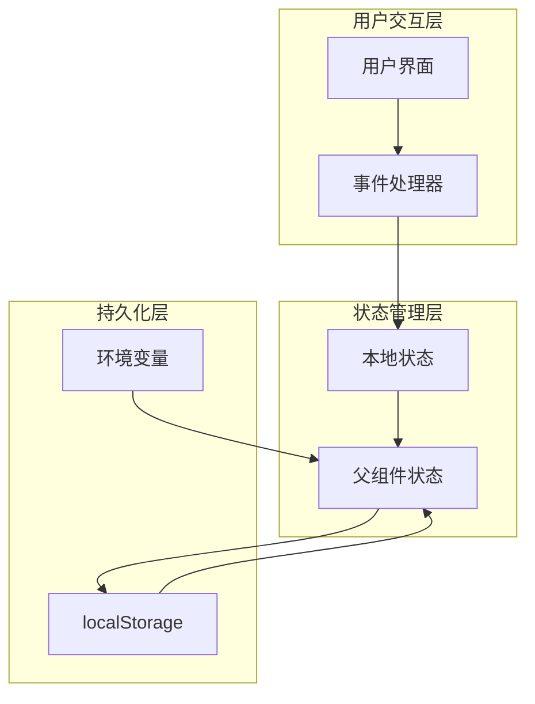

**图表来源**
- [SettingsBar.tsx](file://components/SettingsBar.tsx#L14-L29)
- [App.tsx](file://App.tsx#L45-L47)

**章节来源**
- [SettingsBar.tsx](file://components/SettingsBar.tsx#L14-L29)
- [App.tsx](file://App.tsx#L45-L47)

## 错误处理与故障排除

### 常见配置错误

#### API密钥无效错误

当用户配置了无效的API密钥时，系统会提供明确的错误提示：

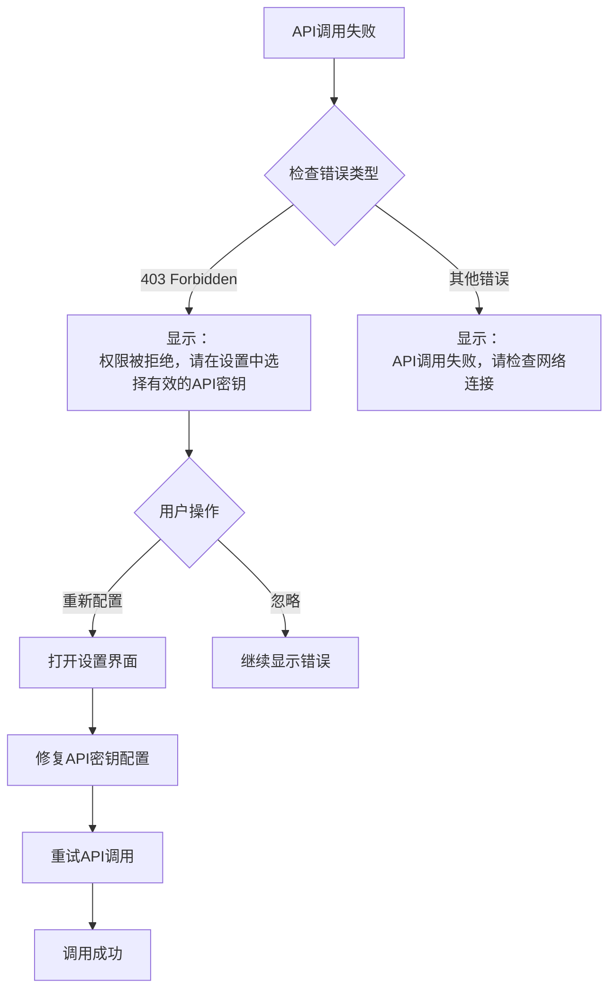

**图表来源**
- [geminiService.ts](file://services/geminiService.ts#L107-L109)
- [App.tsx](file://App.tsx#L49-L60)

#### 环境变量缺失

系统会在应用启动时检测必要的环境变量：

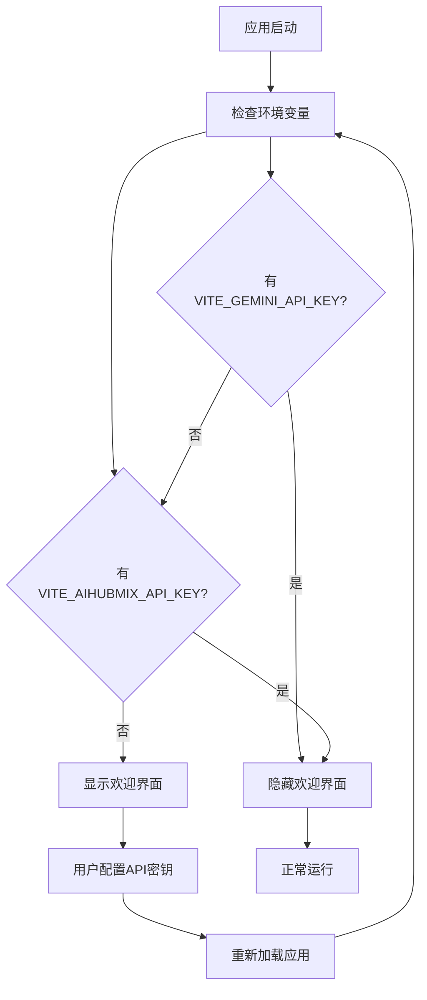

**图表来源**
- [App.tsx](file://App.tsx#L33-L43)

### 故障排除指南

#### 步骤1：检查环境变量配置

1. 创建或编辑项目根目录下的`.env`文件
2. 添加正确的API密钥：
   ```
   VITE_GEMINI_API_KEY=your_google_gemini_api_key_here
   VITE_AIHUBMIX_API_KEY=your_aihubmix_api_key_here
   ```
3. 重启开发服务器使更改生效

#### 步骤2：验证密钥有效性

1. 在SettingsBar中打开设置对话框
2. 检查提供商按钮是否正确显示选中状态
3. 尝试生成测试图像验证配置

#### 步骤3：调试本地存储

如果设置无法保存，可以检查浏览器开发者工具的Console和Application面板。

**章节来源**
- [geminiService.ts](file://services/geminiService.ts#L104-L111)
- [App.tsx](file://App.tsx#L33-L43)

## 最佳实践指南

### 安全存储密钥

#### 环境变量安全

1. **不在代码库中暴露密钥**：确保`.env`文件添加到`.gitignore`
2. **使用适当的前缀**：Vite要求环境变量以`VITE_`开头
3. **定期轮换密钥**：避免长期使用同一API密钥

#### 密钥验证策略

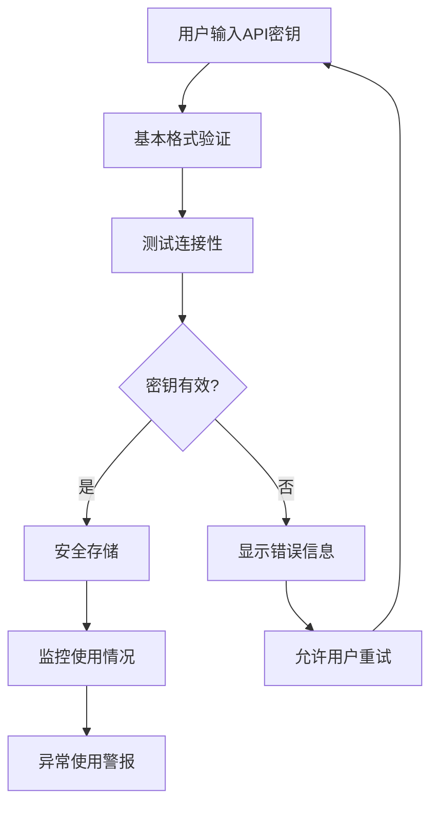

### 性能优化建议

#### 状态更新优化

1. **批量更新**：避免频繁的状态更新
2. **防抖处理**：对用户输入进行防抖处理
3. **条件渲染**：只在必要时重新渲染组件

#### 内存管理

1. **清理监听器**：及时移除不需要的事件监听器
2. **避免内存泄漏**：正确处理异步操作的取消

### 用户体验优化

#### 反馈机制

1. **即时反馈**：用户操作后立即提供视觉反馈
2. **加载状态**：长时间操作显示加载指示器
3. **错误友好**：错误消息要清晰且具有指导性

#### 可访问性

1. **键盘导航**：支持完整的键盘操作
2. **屏幕阅读器**：提供适当的ARIA标签
3. **高对比度**：确保颜色对比度符合标准

**章节来源**
- [SettingsBar.tsx](file://components/SettingsBar.tsx#L69-L132)
- [geminiService.ts](file://services/geminiService.ts#L104-L111)

## 总结

BananaCanvase项目的SettingsBar组件展现了现代Web应用中设置管理的最佳实践。通过React + TypeScript的组合，系统实现了：

### 核心优势

1. **类型安全**：完整的TypeScript类型系统确保配置的正确性
2. **用户友好**：直观的界面设计和即时反馈机制
3. **持久化存储**：基于localStorage的配置持久化
4. **错误处理**：完善的错误检测和用户指导
5. **扩展性**：模块化的架构便于功能扩展

### 技术亮点

- **双状态管理**：本地状态与全局状态的协调
- **环境变量集成**：安全的密钥管理和动态配置
- **异步处理**：优雅的API调用和错误处理
- **响应式设计**：适应不同设备和屏幕尺寸

### 应用价值

SettingsBar组件不仅是一个功能性的设置界面，更是现代前端开发中状态管理、类型安全和用户体验设计的优秀范例。它为开发者提供了可复用的组件模板，同时也展示了如何构建健壮、可维护的Web应用程序。

通过深入理解这个组件的设计理念和实现细节，开发者可以更好地掌握React应用中设置管理的最佳实践，并将其应用到自己的项目中。