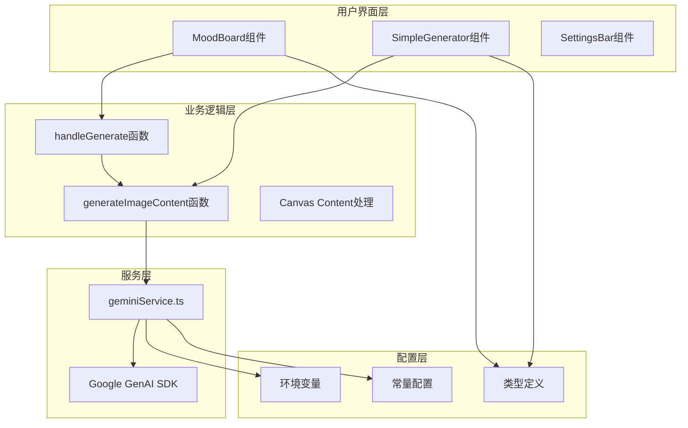
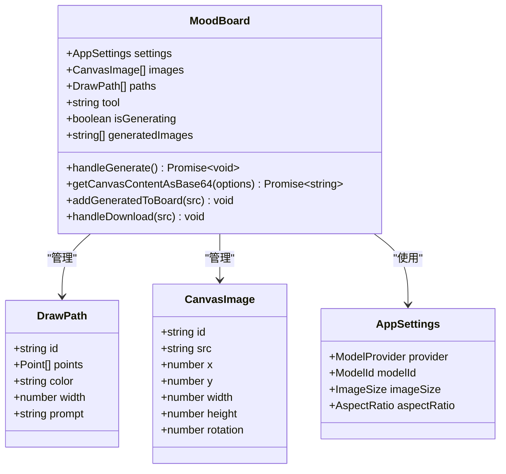
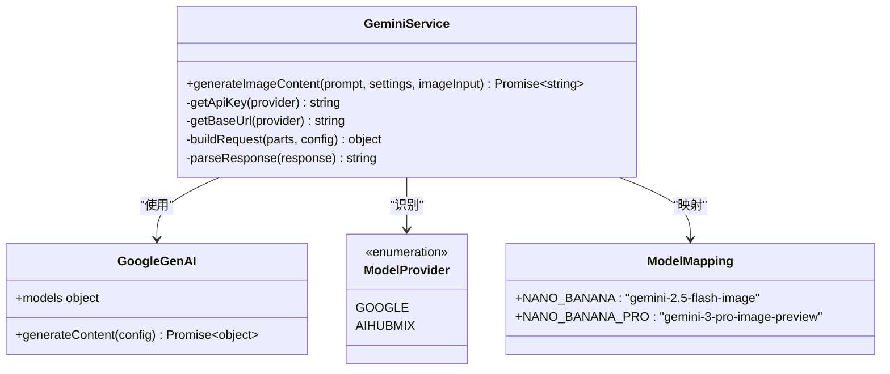
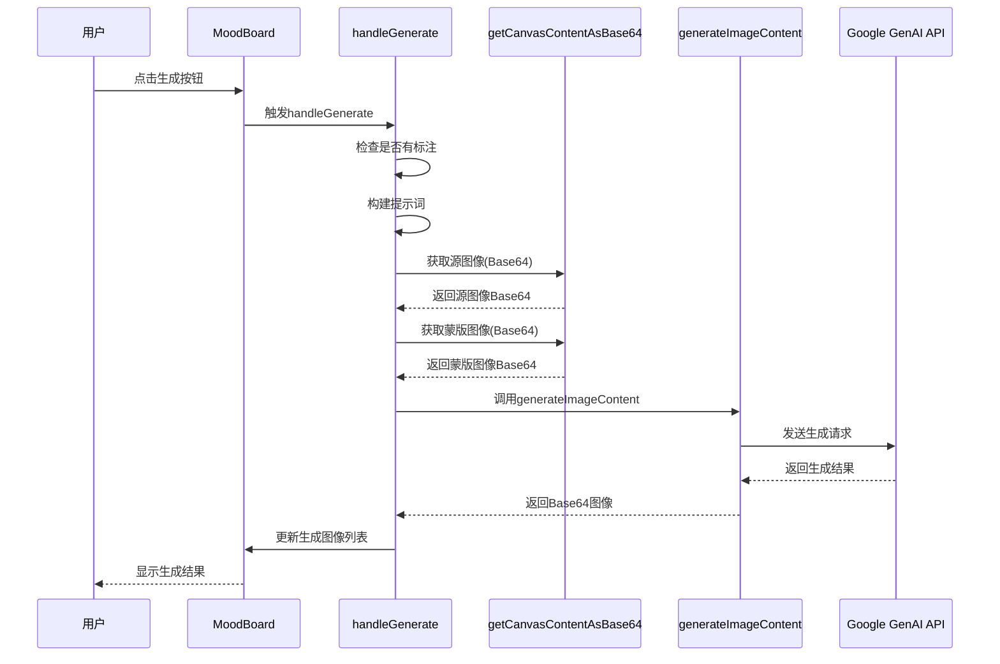
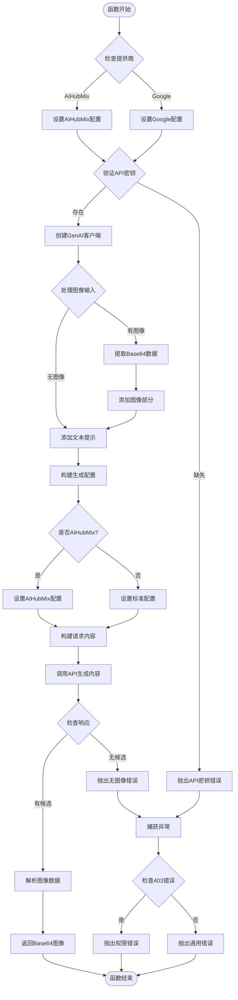
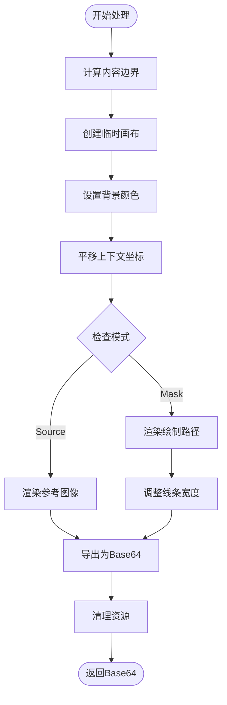
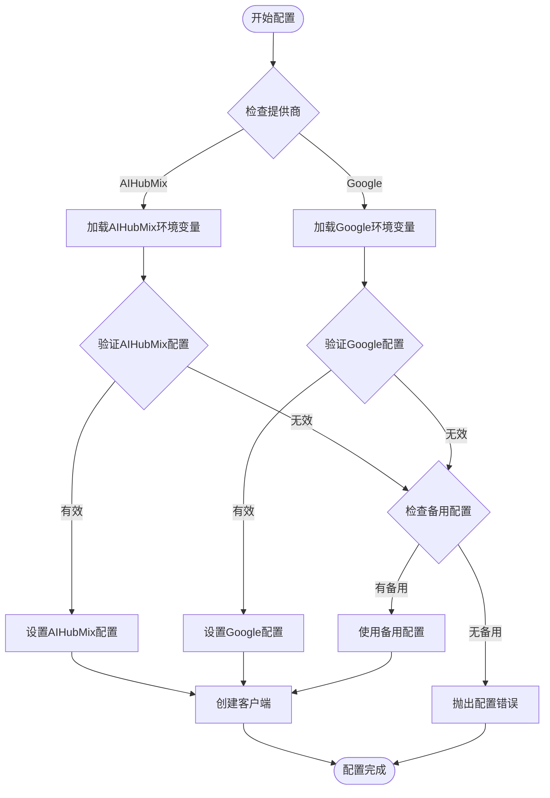
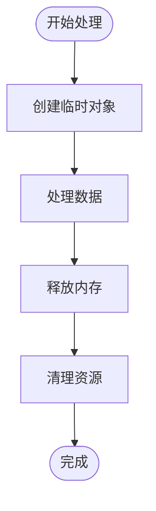

# AI模型集成与调用

<cite>
**本文档中引用的文件**
- [MoodBoard.tsx](file://components/MoodBoard.tsx)
- [geminiService.ts](file://services/geminiService.ts)
- [types.ts](file://types.ts)
- [constants.ts](file://constants.ts)
- [App.tsx](file://App.tsx)
- [SimpleGenerator.tsx](file://components/SimpleGenerator.tsx)
</cite>

## 目录
1. [项目概述](#项目概述)
2. [系统架构](#系统架构)
3. [核心组件分析](#核心组件分析)
4. [AI调用流程详解](#ai调用流程详解)
5. [提示词生成机制](#提示词生成机制)
6. [图像内容处理](#图像内容处理)
7. [API配置与管理](#api配置与管理)
8. [错误处理机制](#错误处理机制)
9. [性能优化策略](#性能优化策略)
10. [故障排除指南](#故障排除指南)

## 项目概述

Banana Canvas是一个基于React的AI图像生成应用，支持通过Google Gemini和AIHubMix两大AI服务提供商进行图像生成。该应用的核心功能是通过用户在画板上的标注和提示，利用AI模型生成高质量的图像内容。

### 主要特性
- **多AI提供商支持**：同时支持Google Gemini和AIHubMix
- **智能提示词生成**：根据用户标注自动生成详细的编辑指令
- **灵活的图像处理**：支持源图像和蒙版图像的分离处理
- **实时预览功能**：生成结果可直接添加到画板或下载
- **完善的错误处理**：针对API权限、网络等问题提供友好的错误提示

## 系统架构



**图表来源**
- [MoodBoard.tsx](file://components/MoodBoard.tsx#L1-L50)
- [geminiService.ts](file://services/geminiService.ts#L1-L30)
- [types.ts](file://types.ts#L1-L61)

## 核心组件分析

### MoodBoard组件架构

MoodBoard组件是应用的核心交互界面，负责处理用户的绘图操作、标注管理和AI生成请求。



**图表来源**
- [MoodBoard.tsx](file://components/MoodBoard.tsx#L19-L40)
- [types.ts](file://types.ts#L12-L44)

**章节来源**
- [MoodBoard.tsx](file://components/MoodBoard.tsx#L1-L100)
- [types.ts](file://types.ts#L1-L61)

### geminiService服务架构

geminiService模块封装了与Google GenAI API的所有交互逻辑，提供了统一的图像生成功能接口。



**图表来源**
- [geminiService.ts](file://services/geminiService.ts#L1-L112)
- [constants.ts](file://constants.ts#L40-L44)

**章节来源**
- [geminiService.ts](file://services/geminiService.ts#L1-L112)
- [constants.ts](file://constants.ts#L1-L44)

## AI调用流程详解

### handleGenerate函数执行流程

handleGenerate函数是MoodBoard组件中的核心生成逻辑，它协调整个AI图像生成过程。



**图表来源**
- [MoodBoard.tsx](file://components/MoodBoard.tsx#L483-L537)
- [geminiService.ts](file://services/geminiService.ts#L5-L112)

### generateImageContent函数实现

generateImageContent函数是AI服务的核心入口，负责处理所有与Google GenAI API的交互。



**图表来源**
- [geminiService.ts](file://services/geminiService.ts#L5-L112)

**章节来源**
- [MoodBoard.tsx](file://components/MoodBoard.tsx#L483-L537)
- [geminiService.ts](file://services/geminiService.ts#L5-L112)

## 提示词生成机制

### 动态提示词构建

MoodBoard组件根据用户是否添加了标注路径来动态生成不同的提示词模板。

#### 无标注模式提示词
当用户没有添加任何标注时，系统使用简化的提示词：
```
"The attached image is a composition layout. Refine it into a realistic, cohesive high-quality image. Blend the edges of the reference photos naturally."
```

#### 有标注模式提示词
当用户添加了至少一个带有提示的标注路径时，系统生成更复杂的指令：
```
You are an expert image editor. I have provided two images:
1. A Source Image containing the scene to edit.
2. A B&W Mask Image (Black background, White strokes) indicating EXACTLY where to apply changes.

TASK: Apply the following edits ONLY to the white masked areas on the Source Image. Keep the rest of the image unchanged.

EDIT INSTRUCTIONS:
- Area 1 (橙色 on canvas): [用户指定的编辑指令]

Output ONLY the final edited image. Do NOT show the mask or the colored lines.
```

### 提示词结构分析

| 组件 | 描述 | 示例 |
|------|------|------|
| 基础指令 | AI角色定位和任务概述 | "You are an expert image editor." |
| 图像说明 | 源图像和蒙版图像的用途说明 | "I have provided two images..." |
| 任务指令 | 具体的编辑要求 | "Apply the following edits ONLY to the white masked areas..." |
| 编辑说明 | 各个标注区域的具体指令 | "- Area 1 (橙色): [用户指令]" |
| 输出要求 | 结果格式要求 | "Output ONLY the final edited image." |

**章节来源**
- [MoodBoard.tsx](file://components/MoodBoard.tsx#L488-L505)

## 图像内容处理

### Canvas内容获取机制

getCanvasContentAsBase64函数负责从画板中提取指定模式的图像内容，支持两种模式：

#### 源图像模式 (Source Mode)
- **背景颜色**：白色背景（中性背景）
- **渲染内容**：仅渲染上传的参考图像
- **用途**：作为AI生成的基础图像

#### 蒙版图像模式 (Mask Mode)
- **背景颜色**：黑色背景（透明背景）
- **渲染内容**：仅渲染用户绘制的路径（白色线条）
- **用途**：指示AI需要编辑的具体区域

### 图像处理流程



**图表来源**
- [MoodBoard.tsx](file://components/MoodBoard.tsx#L405-L481)

### Base64数据处理

generateImageContent函数中的图像处理逻辑：

1. **数据URL解析**：自动移除"data:image/png;base64,"前缀
2. **格式标准化**：确保所有图像都使用PNG格式
3. **内容组织**：将图像和文本按顺序组织为API请求部分

**章节来源**
- [MoodBoard.tsx](file://components/MoodBoard.tsx#L405-L481)
- [geminiService.ts](file://services/geminiService.ts#L40-L53)

## API配置与管理

### 多提供商支持

系统支持两个主要的AI服务提供商，每个都有其特定的配置需求：

#### Google GenAI配置
- **API密钥**：VITE_GEMINI_API_KEY
- **基础URL**：VITE_GEMINI_BASE_URL（可选）
- **默认行为**：使用标准的Google GenAI SDK配置

#### AIHubMix配置
- **API密钥**：VITE_AIHUBMIX_API_KEY
- **基础URL**：VITE_AIHUBMIX_BASE_URL（默认：https://aihubmix.com/gemini）
- **特殊配置**：支持响应模态性和图像配置参数

### 配置优先级



**图表来源**
- [geminiService.ts](file://services/geminiService.ts#L11-L21)

### 模型映射表

| ModelId | 实际模型名称 | 特点 |
|---------|-------------|------|
| NANO_BANANA | gemini-2.5-flash-image | 快速生成，适合草图 |
| NANO_BANANA_PRO | gemini-3-pro-image-preview | 高质量生成，支持更高分辨率 |

**章节来源**
- [geminiService.ts](file://services/geminiService.ts#L11-L21)
- [constants.ts](file://constants.ts#L40-L44)

## 错误处理机制

### 权限错误处理

系统实现了多层次的错误检测和处理机制：

#### 403权限错误检测
```typescript
// 在geminiService.ts中的错误处理
if (error.status === 403 || (error.message && error.message.includes('403'))) {
    throw new Error("Permission Denied (403). Please select a valid API Key in Config.");
}
```

#### 错误分类处理

| 错误类型 | 检测方式 | 处理策略 |
|----------|----------|----------|
| API密钥缺失 | apiKey为空字符串 | 抛出配置错误 |
| 权限不足 | HTTP状态码403 | 引导用户重新配置 |
| 网络连接失败 | 网络异常 | 提供重试建议 |
| 模型不可用 | API响应错误 | 显示友好错误信息 |
| 输入格式错误 | 数据验证失败 | 显示具体格式要求 |

### 用户体验优化

1. **渐进式错误提示**：从简单的错误消息到详细的解决方案引导
2. **自动重定向**：权限错误时自动打开配置界面
3. **状态反馈**：生成过程中显示加载状态和进度信息

**章节来源**
- [geminiService.ts](file://services/geminiService.ts#L104-L111)
- [App.tsx](file://App.tsx#L51-L62)

## 性能优化策略

### 并发处理优化

#### 异步图像处理
- 使用Promise.all并行处理多个图像
- 异步加载图像资源避免阻塞UI
- 及时释放临时画布资源

#### 请求优化
- 智能缓存API响应
- 批量处理多个请求
- 压缩图像数据减少传输时间

### 内存管理



**图表来源**
- [MoodBoard.tsx](file://components/MoodBoard.tsx#L405-L481)

## 故障排除指南

### 常见问题及解决方案

#### API密钥配置问题
**症状**：出现"API Key is missing"错误
**解决方案**：
1. 检查.env文件中的配置项
2. 确认提供商选择正确
3. 重启开发服务器使配置生效

#### 权限被拒绝问题
**症状**：出现403权限错误
**解决方案**：
1. 验证API密钥的有效性
2. 检查密钥是否具有相应权限
3. 尝试更换其他提供商

#### 图像生成失败
**症状**：生成请求成功但无图像返回
**解决方案**：
1. 检查提示词的清晰度
2. 验证图像格式和尺寸
3. 尝试简化生成请求

#### 性能问题
**症状**：生成过程缓慢或卡顿
**解决方案**：
1. 减少图像分辨率
2. 简化提示词内容
3. 检查网络连接稳定性

### 调试工具和技巧

1. **浏览器开发者工具**：监控网络请求和API响应
2. **控制台日志**：查看详细的错误信息和堆栈跟踪
3. **环境变量检查**：确认所有必要的配置项都已正确设置

**章节来源**
- [App.tsx](file://App.tsx#L35-L45)
- [geminiService.ts](file://services/geminiService.ts#L104-L111)

## 总结

Banana Canvas的AI模型集成与调用系统展现了现代Web应用中AI服务集成的最佳实践。通过MoodBoard组件的handleGenerate函数和geminiService.ts的服务层封装，系统实现了：

- **灵活的多提供商支持**：无缝切换Google Gemini和AIHubMix
- **智能的提示词生成**：根据用户交互动态构建详细的编辑指令
- **高效的图像处理**：支持复杂画板内容的精确提取和转换
- **健壮的错误处理**：提供用户友好的错误提示和自动恢复机制
- **优秀的用户体验**：实时预览和流畅的操作响应

这套系统不仅展示了AI技术在创意领域的应用潜力，也为类似项目的开发提供了宝贵的参考架构和实现思路。