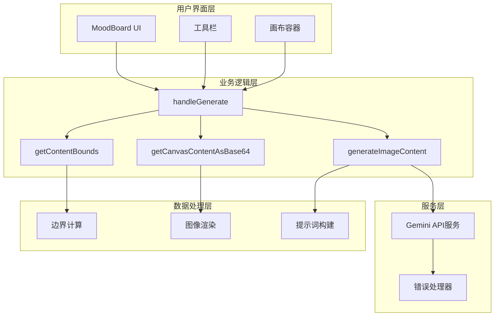
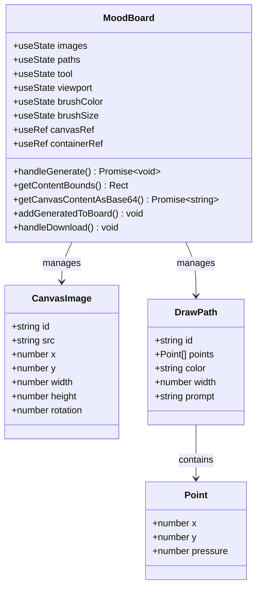
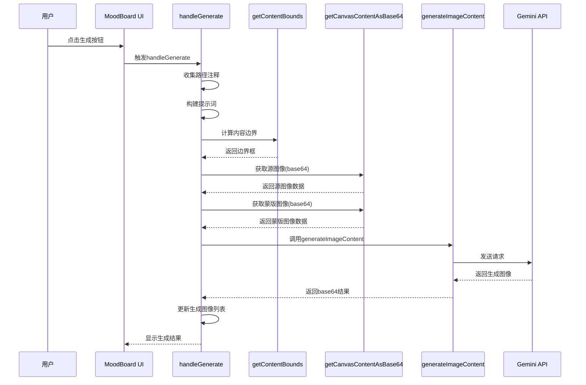
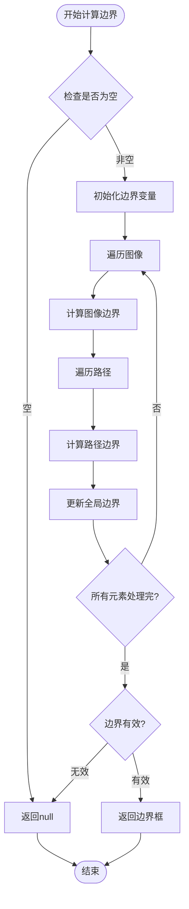
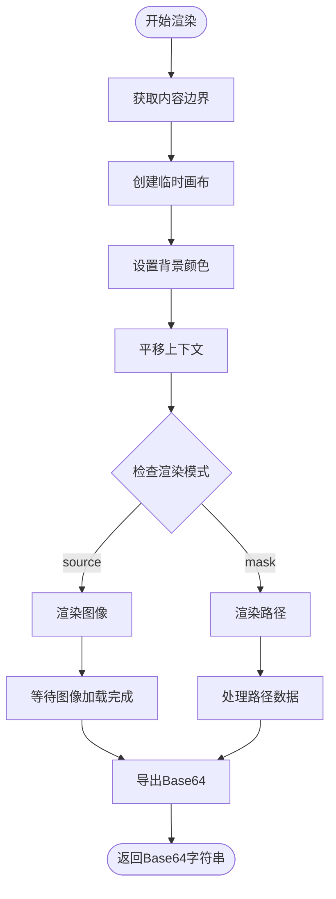
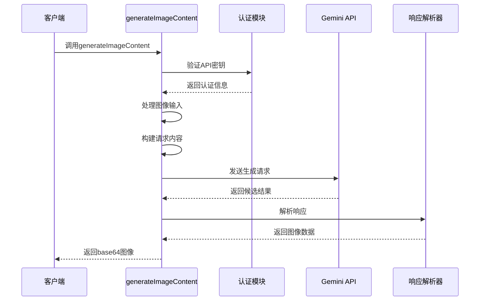
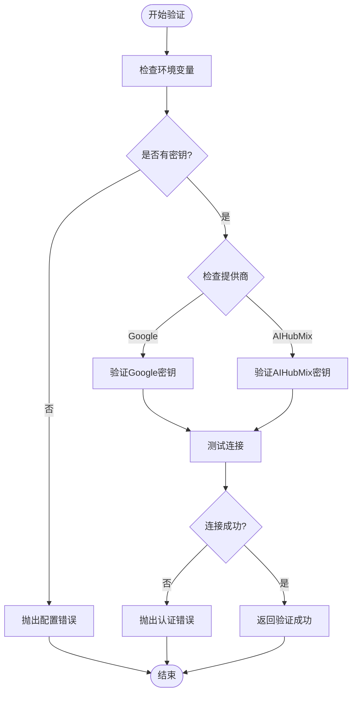
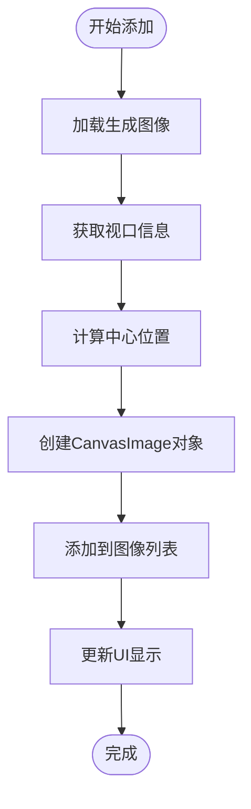

# 图像生成管线

<cite>
**本文档中引用的文件**
- [MoodBoard.tsx](file://components/MoodBoard.tsx)
- [geminiService.ts](file://services/geminiService.ts)
- [types.ts](file://types.ts)
- [constants.ts](file://constants.ts)
- [App.tsx](file://App.tsx)
- [README.md](file://README.md)
</cite>

## 目录
1. [简介](#简介)
2. [系统架构概览](#系统架构概览)
3. [核心组件分析](#核心组件分析)
4. [图像生成管线详解](#图像生成管线详解)
5. [边界框计算机制](#边界框计算机制)
6. [双模式渲染系统](#双模式渲染系统)
7. [AI模型集成](#ai模型集成)
8. [错误处理机制](#错误处理机制)
9. [结果管理与展示](#结果管理与展示)
10. [性能优化考虑](#性能优化考虑)
11. [故障排除指南](#故障排除指南)
12. [总结](#总结)

## 简介

Banana Canvas的MoodBoard组件实现了一个复杂的图像生成管线，该管线从用户在画布上的交互开始，通过AI模型处理，最终生成高质量的图像结果。这个系统的核心是`handleGenerate`函数，它协调了多个关键步骤：内容边界检测、画布内容渲染、AI模型调用和结果管理。

## 系统架构概览

MoodBoard组件采用分层架构设计，主要包含以下层次：

**图表来源**
- [MoodBoard.tsx](file://components/MoodBoard.tsx#L470-L524)
- [geminiService.ts](file://services/geminiService.ts#L5-L112)

## 核心组件分析

### MoodBoard组件结构

MoodBoard组件是一个功能完整的图像编辑和生成平台，支持多种操作模式：

**图表来源**
- [MoodBoard.tsx](file://components/MoodBoard.tsx#L18-L40)
- [types.ts](file://types.ts#L12-L34)

**章节来源**
- [MoodBoard.tsx](file://components/MoodBoard.tsx#L1-L770)
- [types.ts](file://types.ts#L1-L61)

## 图像生成管线详解

### handleGenerate函数工作流程

`handleGenerate`函数是整个图像生成管线的核心协调器，它执行以下关键步骤：

**图表来源**
- [MoodBoard.tsx](file://components/MoodBoard.tsx#L470-L524)
- [geminiService.ts](file://services/geminiService.ts#L5-L112)

### 提示词构建策略

系统根据用户输入动态构建提示词，支持两种模式：

1. **基础模式**：当没有路径注释时，使用通用的图像增强提示
2. **高级模式**：当有路径注释时，构建详细的编辑指令

提示词模板包含：
- 模型角色定义
- 输入图像说明
- 编辑任务描述
- 输出要求规范

**章节来源**
- [MoodBoard.tsx](file://components/MoodBoard.tsx#L470-L524)

## 边界框计算机制

### getContentBounds函数实现

`getContentBounds`函数负责计算画布上所有内容的最小边界框，为精确裁剪提供依据：

**图表来源**
- [MoodBoard.tsx](file://components/MoodBoard.tsx#L360-L389)

### 边界计算算法

边界计算采用增量算法，确保每个元素都被正确考虑：

1. **初始化**：设置初始边界值为无穷大/负无穷
2. **图像边界**：计算每个图像的左上角和右下角坐标
3. **路径边界**：遍历每条路径的所有点，找到最小/最大坐标
4. **合并结果**：取所有元素的最小外接矩形

**章节来源**
- [MoodBoard.tsx](file://components/MoodBoard.tsx#L360-L389)

## 双模式渲染系统

### getCanvasContentAsBase64函数架构

`getCanvasContentAsBase64`函数实现了智能的双模式渲染机制，支持'源图像'和'蒙版'两种输出模式：

**图表来源**
- [MoodBoard.tsx](file://components/MoodBoard.tsx#L391-L468)

### 源图像模式（Source Mode）

源图像模式生成纯净的参考图像，具有以下特征：

- **背景**：白色背景（#ffffff）
- **用途**：作为AI模型的原始参考图像
- **渲染**：仅渲染上传的图像，不包含用户绘制的路径
- **透明度**：保持图像的透明度特性

### 蒙版图像模式（Mask Mode）

蒙版图像模式生成黑白蒙版，用于指示编辑区域：

- **背景**：黑色背景（#000000）
- **前景**：白色线条（#ffffff）
- **用途**：指示AI模型需要修改的区域
- **渲染**：仅渲染用户绘制的路径，线条加粗以确保覆盖

### 渲染参数优化

不同模式使用不同的渲染参数：

| 参数 | 源图像模式 | 蒙版图像模式 |
|------|------------|--------------|
| 背景颜色 | 白色 (#ffffff) | 黑色 (#000000) |
| 前景颜色 | 图像原色 | 白色 (#ffffff) |
| 线条宽度 | 自适应 | 加粗 (≥5px) |
| 透明度 | 保持 | 不适用 |

**章节来源**
- [MoodBoard.tsx](file://components/MoodBoard.tsx#L391-L468)

## AI模型集成

### generateImageContent函数架构

`generateImageContent`函数负责与Gemini AI服务的集成，处理图像和文本输入：

**图表来源**
- [geminiService.ts](file://services/geminiService.ts#L5-L112)

### API密钥管理

系统支持两种提供商的API密钥管理：

| 提供商 | 环境变量 | 默认URL |
|--------|----------|---------|
| Google | VITE_GEMINI_API_KEY | 无（默认） |
| AIHubMix | VITE_AIHUBMIX_API_KEY | https://aihubmix.com/gemini |

### 请求格式化

系统将输入数据格式化为AI模型可理解的结构：

1. **图像数据**：去除data URL前缀，提取纯base64编码
2. **文本提示**：直接附加到请求末尾
3. **配置参数**：根据提供商需求设置特定参数

### 响应解析

AI模型响应可能包含多种内容类型，系统优先提取图像数据：

- **图像响应**：直接返回base64编码的图像
- **文本响应**：抛出异常，提示模型拒绝请求
- **混合响应**：优先提取图像部分

**章节来源**
- [geminiService.ts](file://services/geminiService.ts#L5-L112)

## 错误处理机制

### API密钥验证

系统实现了多层次的API密钥验证机制：

**图表来源**
- [geminiService.ts](file://services/geminiService.ts#L11-L25)

### 403错误处理

系统特别针对403权限错误提供了专门的处理机制：

1. **错误检测**：在API调用过程中监控HTTP状态码
2. **错误分类**：识别403权限被拒绝错误
3. **UI反馈**：触发`onAuthError`回调函数
4. **用户体验**：显示友好的错误消息

### 异常传播机制

错误处理采用分层传播策略：

- **服务层**：捕获底层API错误，转换为统一格式
- **组件层**：处理业务逻辑错误，提供用户反馈
- **应用层**：管理全局错误状态，控制UI行为

**章节来源**
- [geminiService.ts](file://services/geminiService.ts#L104-L111)
- [MoodBoard.tsx](file://components/MoodBoard.tsx#L514-L520)

## 结果管理与展示

### addGeneratedToBoard函数

`addGeneratedToBoard`函数负责将生成的图像添加到主画布：

**图表来源**
- [MoodBoard.tsx](file://components/MoodBoard.tsx#L526-L544)

### handleDownload函数

`handleDownload`函数提供图像下载功能：

- **动态链接**：创建临时下载链接
- **文件命名**：使用时间戳确保唯一性
- **浏览器兼容**：跨浏览器的下载支持
- **资源清理**：自动移除临时元素

### 生成结果面板

生成结果面板提供完整的图像管理功能：

| 功能 | 按钮 | 描述 |
|------|------|------|
| 添加到画布 | +图标 | 将图像添加到主画布 |
| 下载图像 | 下载图标 | 保存图像到本地 |
| 删除结果 | 删除图标 | 从结果列表移除 |

**章节来源**
- [MoodBoard.tsx](file://components/MoodBoard.tsx#L526-L555)

## 性能优化考虑

### 渲染性能优化

1. **异步渲染**：图像加载采用Promise.all并行处理
2. **内存管理**：及时释放临时画布资源
3. **缓存策略**：避免重复计算相同的边界框
4. **延迟加载**：按需加载图像资源

### 网络优化

1. **请求合并**：将多个图像输入合并为单次请求
2. **超时控制**：设置合理的API调用超时时间
3. **重试机制**：对临时性错误实施指数退避重试

### 用户体验优化

1. **加载状态**：显示生成进度指示器
2. **即时反馈**：快速响应用户操作
3. **错误恢复**：提供清晰的错误解决方案

## 故障排除指南

### 常见问题及解决方案

| 问题 | 症状 | 解决方案 |
|------|------|----------|
| API密钥无效 | 403错误 | 检查.env文件中的API密钥配置 |
| 图像生成失败 | 无响应或错误消息 | 验证图像格式和大小限制 |
| 边界计算错误 | 裁剪不准确 | 检查画布元素的坐标数据 |
| 渲染性能差 | 界面卡顿 | 减少同时渲染的图像数量 |

### 调试技巧

1. **控制台日志**：启用详细的错误日志记录
2. **网络监控**：检查API请求的响应时间和状态码
3. **性能分析**：使用浏览器开发者工具分析渲染性能
4. **单元测试**：为关键函数编写自动化测试

**章节来源**
- [App.tsx](file://App.tsx#L51-L62)

## 总结

Banana Canvas的MoodBoard组件实现了一个功能完整且高度优化的图像生成管线。该系统通过精心设计的架构，实现了从用户交互到AI模型调用的无缝衔接：

### 核心优势

1. **模块化设计**：清晰的功能分离使得系统易于维护和扩展
2. **双模式渲染**：灵活的渲染机制满足不同场景需求
3. **智能边界检测**：精确的边界计算确保生成质量
4. **完善的错误处理**：多层次的错误处理机制提升用户体验
5. **性能优化**：多项性能优化措施保证流畅的用户交互

### 技术创新

- **动态提示词构建**：根据用户输入自动生成针对性的AI提示
- **智能边界计算**：实时计算复杂布局的精确边界
- **双模式渲染**：同一套代码支持不同用途的图像输出
- **异步处理机制**：充分利用现代浏览器的并发能力

这个图像生成管线不仅展示了现代Web应用的技术实力，更为未来的AI辅助创意工具开发提供了宝贵的参考范例。