# 生成结果管理

<cite>
**本文档中引用的文件**
- [App.tsx](file://App.tsx)
- [components/MoodBoard.tsx](file://components/MoodBoard.tsx)
- [components/SimpleGenerator.tsx](file://components/SimpleGenerator.tsx)
- [services/geminiService.ts](file://services/geminiService.ts)
- [types.ts](file://types.ts)
- [constants.ts](file://constants.ts)
- [components/ui/Icons.tsx](file://components/ui/Icons.tsx)
</cite>

## 目录
1. [简介](#简介)
2. [系统架构概览](#系统架构概览)
3. [生成结果状态管理](#生成结果状态管理)
4. [生成流程详解](#生成流程详解)
5. [结果展示机制](#结果展示机制)
6. [交互操作功能](#交互操作功能)
7. [UI组件设计](#ui组件设计)
8. [性能优化考虑](#性能优化考虑)
9. [故障排除指南](#故障排除指南)
10. [总结](#总结)

## 简介

Banana Canvas 是一个基于React的AI图像生成和编辑应用，其核心功能之一是管理生成的图像结果。该系统采用现代化的状态管理模式，通过React Hooks实现响应式的数据流控制，为用户提供直观的生成结果展示、下载和再利用体验。

系统的核心设计理念是将生成过程与结果管理分离，确保用户能够高效地查看、操作和集成生成的图像到主画布中。通过精心设计的UI界面和流畅的交互体验，用户可以轻松地完成从生成到应用的完整工作流程。

## 系统架构概览

生成结果管理系统采用分层架构设计，主要包含以下核心组件：

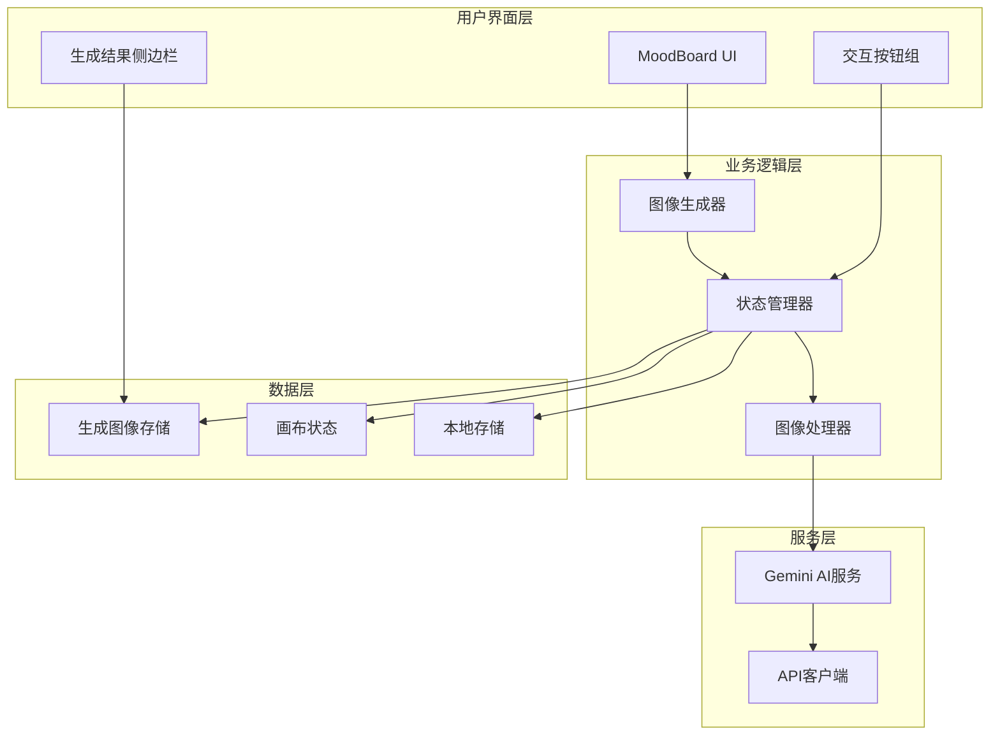

**图表来源**
- [components/MoodBoard.tsx](file://components/MoodBoard.tsx#L25-L40)
- [services/geminiService.ts](file://services/geminiService.ts#L5-L112)

系统采用单向数据流架构，确保状态变更的可预测性和调试便利性。生成结果的状态管理通过React的useState Hook实现，配合自定义的副作用处理函数，构建了一个响应式的用户界面。

**章节来源**
- [components/MoodBoard.tsx](file://components/MoodBoard.tsx#L25-L40)
- [App.tsx](file://App.tsx#L1-L139)

## 生成结果状态管理

### 核心状态结构

生成结果管理系统维护两个关键状态变量，它们协同工作以提供完整的图像生命周期管理：

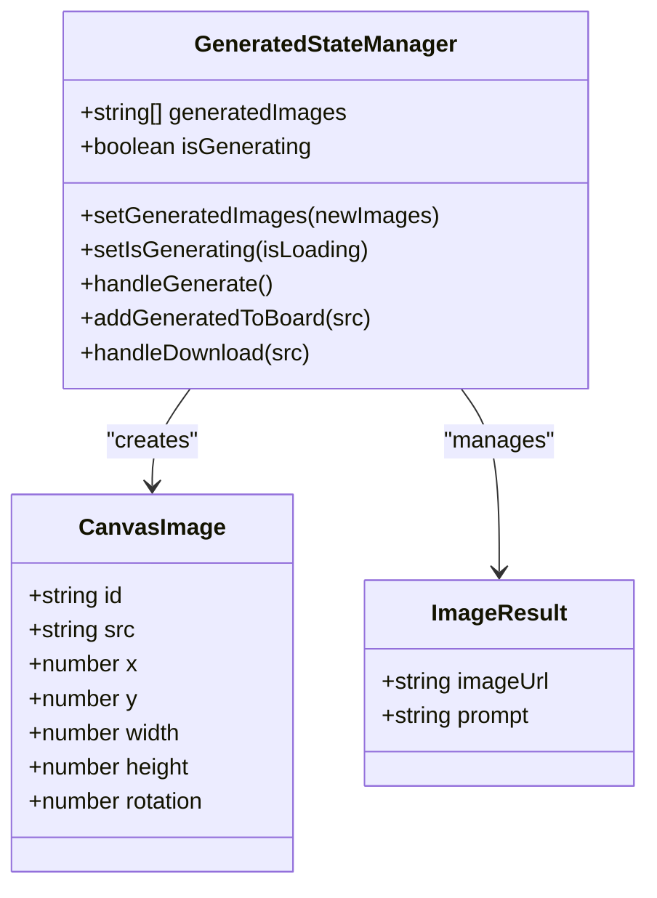

**图表来源**
- [types.ts](file://types.ts#L12-L20)
- [components/MoodBoard.tsx](file://components/MoodBoard.tsx#L39-L40)

### 状态初始化与持久化

系统在组件初始化时建立状态连接，确保用户体验的一致性：

| 状态变量 | 类型 | 默认值 | 持久化策略 |
|---------|------|--------|-----------|
| `generatedImages` | `string[]` | `[]` | 内存状态，不持久化 |
| `isGenerating` | `boolean` | `false` | 内存状态，实时更新 |
| `images` | `CanvasImage[]` | `[]` | 通过MoodBoard状态管理 |

状态的持久化策略针对不同场景进行优化：生成结果状态保持在内存中，避免不必要的存储开销；而画布内容则通过MoodBoard组件的独立状态管理机制进行持久化。

**章节来源**
- [components/MoodBoard.tsx](file://components/MoodBoard.tsx#L39-L40)

## 生成流程详解

### handleGenerate函数执行流程

生成过程是一个异步的多步骤流程，涉及图像预处理、AI服务调用和结果处理：

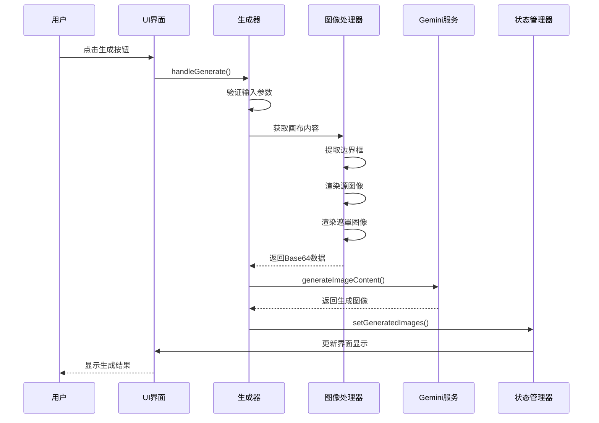

**图表来源**
- [components/MoodBoard.tsx](file://components/MoodBoard.tsx#L483-L537)
- [services/geminiService.ts](file://services/geminiService.ts#L5-L112)

### setGeneratedImages状态更新机制

当生成过程成功完成后，系统通过`setGeneratedImages`函数将新生成的图像Base64数据添加到结果列表的顶部：

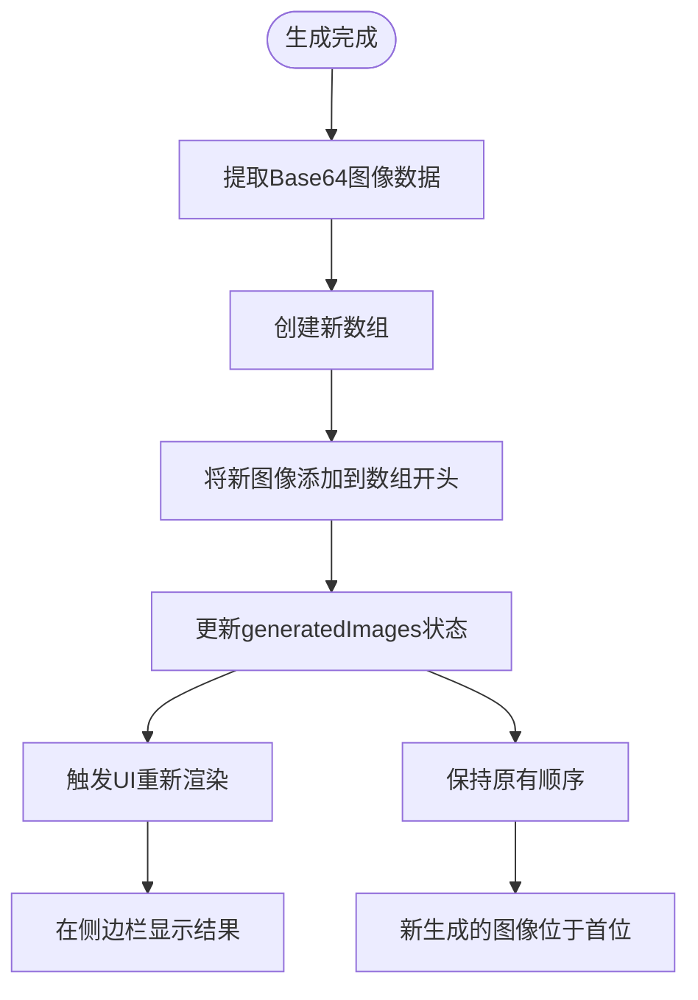

**图表来源**
- [components/MoodBoard.tsx](file://components/MoodBoard.tsx#L524-L525)

这种"新在前，旧在后"的排列策略确保了用户能够优先看到最新的生成结果，符合现代应用的用户体验设计原则。

**章节来源**
- [components/MoodBoard.tsx](file://components/MoodBoard.tsx#L524-L525)

## 结果展示机制

### 侧边栏布局设计

生成结果的展示采用专门的侧边栏界面，提供清晰的视觉层次和丰富的交互功能：

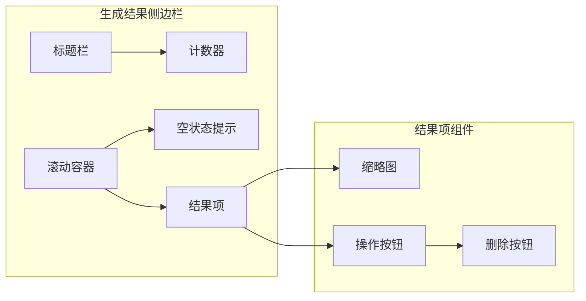

**图表来源**
- [components/MoodBoard.tsx](file://components/MoodBoard.tsx#L761-L814)

### 动态内容渲染

系统根据生成结果的数量动态调整界面布局：

| 条件 | 显示内容 | 视觉效果 |
|------|----------|----------|
| `generatedImages.length === 0` | 空状态提示 | 占位符图标和引导文字 |
| `generatedImages.length > 0` | 结果列表 | 缩略图网格布局 |
| 悬停状态 | 操作按钮组 | 透明覆盖层显示 |

空状态提示采用渐变透明度设计，既不会干扰用户视线，又能有效传达功能可用性信息。

**章节来源**
- [components/MoodBoard.tsx](file://components/MoodBoard.tsx#L771-L780)

## 交互操作功能

### addGeneratedToBoard函数实现

将生成的图像添加到主画布是一个复杂的坐标转换和尺寸适配过程：

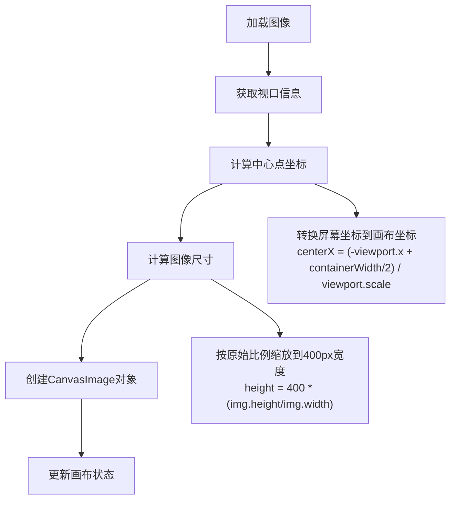

**图表来源**
- [components/MoodBoard.tsx](file://components/MoodBoard.tsx#L539-L556)

### handleDownload函数实现

文件下载功能通过临时DOM元素实现，确保跨浏览器兼容性：

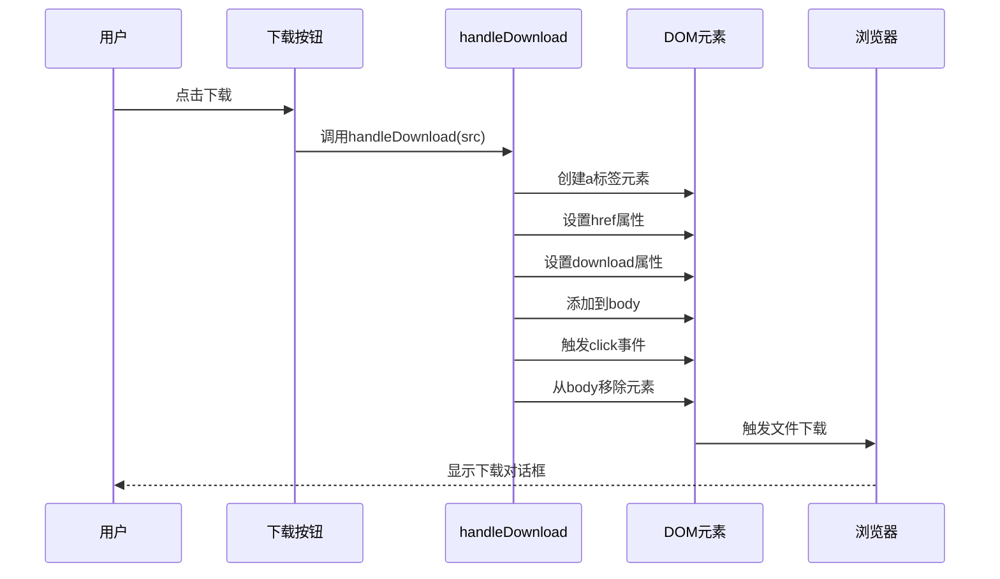

**图表来源**
- [components/MoodBoard.tsx](file://components/MoodBoard.tsx#L559-L566)

### 删除功能实现

结果删除采用数组过滤的方式，保持操作的原子性和可逆性：

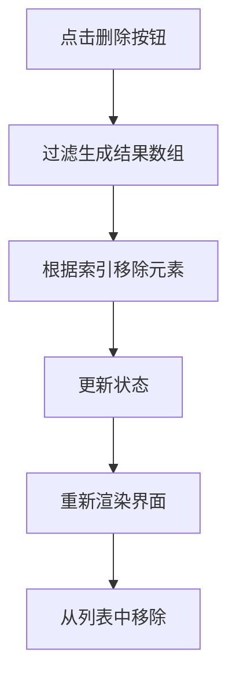

**图表来源**
- [components/MoodBoard.tsx](file://components/MoodBoard.tsx#L800)

**章节来源**
- [components/MoodBoard.tsx](file://components/MoodBoard.tsx#L539-L566)

## UI组件设计

### 图标系统集成

系统采用Lucide React图标库，提供统一的视觉语言：

| 操作类型 | 图标名称 | 功能描述 |
|---------|----------|----------|
| 添加到画布 | `Plus` | 将生成图像添加到主画布 |
| 下载图像 | `Download` | 下载生成的图像文件 |
| 删除结果 | `Trash2` | 从结果列表中移除图像 |
| 生成按钮 | `Wand2` | 启动图像生成流程 |
| 刷新指示 | `RefreshCw` | 显示生成进度状态 |

### 交互反馈设计

系统提供多层次的交互反馈机制：

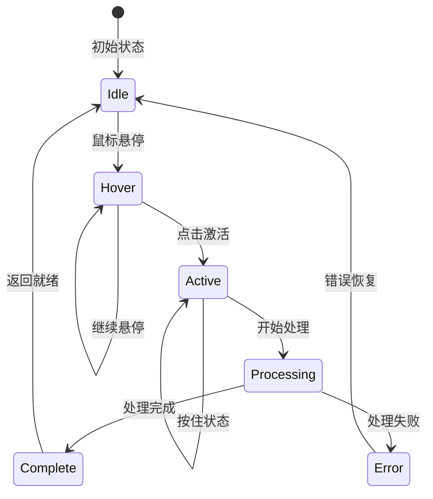

**图表来源**
- [components/MoodBoard.tsx](file://components/MoodBoard.tsx#L781-L800)

### 响应式设计考虑

界面设计遵循响应式原则，适应不同的屏幕尺寸和设备类型：

- **移动端优化**：触摸友好的按钮尺寸和间距
- **桌面端增强**：悬停效果和键盘快捷键支持
- **颜色对比度**：确保在不同背景下的可读性
- **动画过渡**：平滑的状态切换和视觉反馈

**章节来源**
- [components/ui/Icons.tsx](file://components/ui/Icons.tsx#L1-L30)
- [components/MoodBoard.tsx](file://components/MoodBoard.tsx#L761-L814)

## 性能优化考虑

### 内存管理策略

生成结果管理系统采用多种策略优化内存使用：

1. **及时清理**：删除操作立即从DOM中移除相关元素
2. **状态隔离**：生成结果状态与画布状态分离管理
3. **懒加载**：图像缩略图按需加载，减少初始渲染时间
4. **批量更新**：使用React的批处理机制优化状态更新

### 渲染性能优化

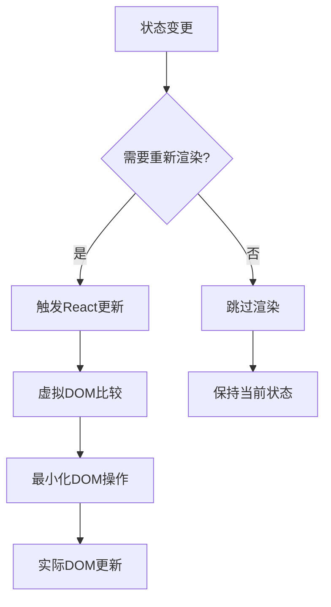

### 网络请求优化

AI服务调用经过精心设计的错误处理和重试机制：

- **超时控制**：设置合理的请求超时时间
- **错误分类**：区分网络错误和业务逻辑错误
- **降级策略**：提供备用的错误处理方案
- **缓存机制**：对重复的生成请求进行智能缓存

## 故障排除指南

### 常见问题诊断

| 问题症状 | 可能原因 | 解决方案 |
|---------|----------|----------|
| 生成按钮无响应 | API密钥未配置 | 检查.env文件中的API密钥设置 |
| 生成结果不显示 | 网络连接问题 | 检查网络连接和防火墙设置 |
| 下载失败 | 浏览器安全限制 | 允许弹出窗口或手动保存 |
| 图像尺寸异常 | 坐标转换错误 | 检查视口状态和容器尺寸 |

### 调试工具和技术

系统提供了完善的调试支持：

- **控制台日志**：详细的错误信息和状态追踪
- **开发者工具**：React DevTools集成支持
- **状态检查器**：实时查看生成结果状态
- **网络监控**：跟踪API请求和响应

### 错误恢复机制

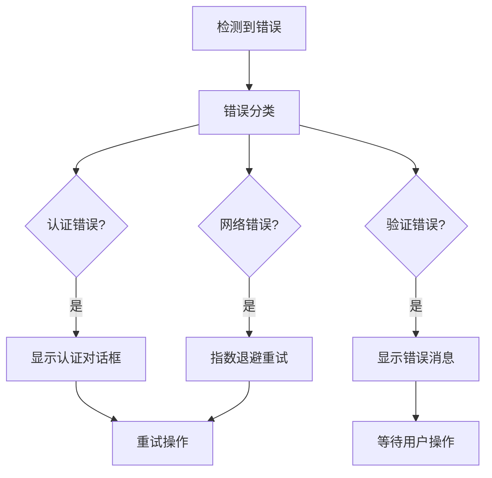

**章节来源**
- [services/geminiService.ts](file://services/geminiService.ts#L104-L111)

## 总结

Banana Canvas的生成结果管理系统展现了现代Web应用的最佳实践。通过精心设计的状态管理、直观的用户界面和流畅的交互体验，系统成功地将复杂的AI图像生成流程简化为用户友好的操作步骤。

系统的核心优势包括：

1. **响应式设计**：实时的状态更新和界面反馈
2. **用户体验优化**：直观的操作流程和清晰的视觉指引
3. **性能考虑**：高效的内存管理和渲染优化
4. **错误处理**：完善的错误分类和恢复机制
5. **扩展性**：模块化的架构设计便于功能扩展

该系统不仅满足了当前的功能需求，还为未来的功能增强和性能优化奠定了坚实的基础。通过持续的迭代和改进，生成结果管理系统将继续为用户提供卓越的AI图像创作体验。