# 画布内容导出机制

<cite>
**本文档中引用的文件**
- [MoodBoard.tsx](file://components/MoodBoard.tsx)
- [types.ts](file://types.ts)
- [constants.ts](file://constants.ts)
- [geminiService.ts](file://services/geminiService.ts)
</cite>

## 目录
1. [简介](#简介)
2. [项目结构概览](#项目结构概览)
3. [核心组件分析](#核心组件分析)
4. [架构概览](#架构概览)
5. [详细组件分析](#详细组件分析)
6. [依赖关系分析](#依赖关系分析)
7. [性能考虑](#性能考虑)
8. [故障排除指南](#故障排除指南)
9. [结论](#结论)

## 简介

`getCanvasContentAsBase64`函数是BananaCanvase项目图像生成管线的核心环节，负责将画布内容导出为Base64编码的数据URL。该函数采用双模式渲染机制，能够根据'mode'参数（'source'或'mask'）创建不同类型的临时画布：在'source'模式下渲染带有白底的参考图像，在'mask'模式下生成黑底白线的蒙版图像。

该函数的设计体现了现代Web图形处理的最佳实践，包括智能边界计算、安全边距处理、异步图像渲染、错误处理机制等关键特性。通过精确控制画布尺寸和渲染上下文，确保生成的图像能够满足AI图像生成服务的需求。

## 项目结构概览

BananaCanvase项目采用React前端架构，主要包含以下核心模块：

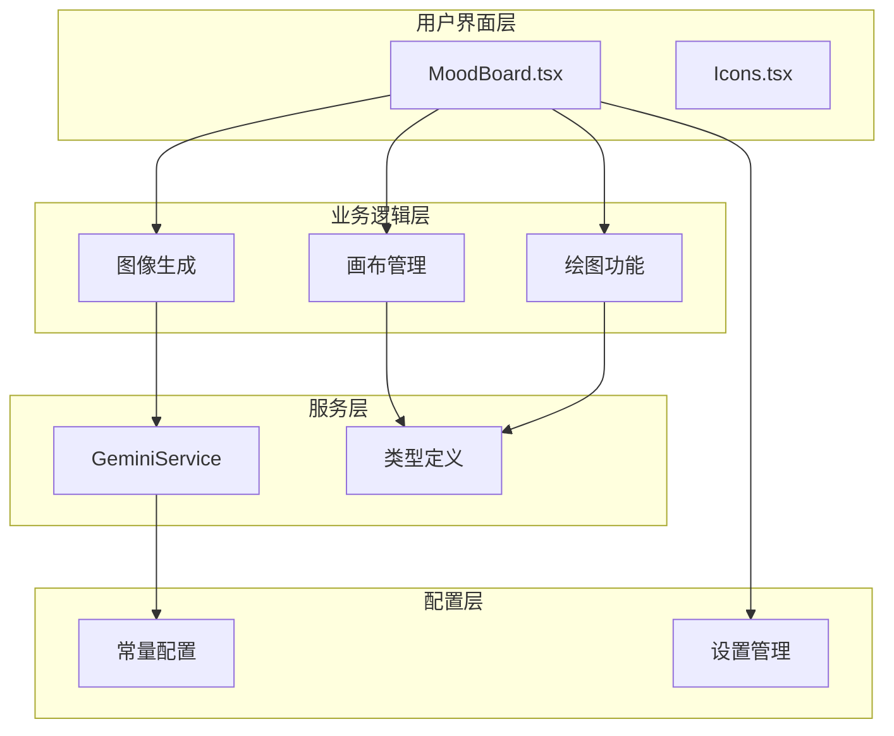

**图表来源**
- [MoodBoard.tsx](file://components/MoodBoard.tsx#L24-L801)
- [geminiService.ts](file://services/geminiService.ts#L4-L112)

**章节来源**
- [MoodBoard.tsx](file://components/MoodBoard.tsx#L1-L801)
- [types.ts](file://types.ts#L1-L61)

## 核心组件分析

### getCanvasContentAsBase64函数架构

`getCanvasContentAsBase64`函数是一个异步函数，接受一个包含mode参数的对象作为输入，返回Promise<string>类型的Base64数据URL。该函数的核心架构包括以下几个关键阶段：

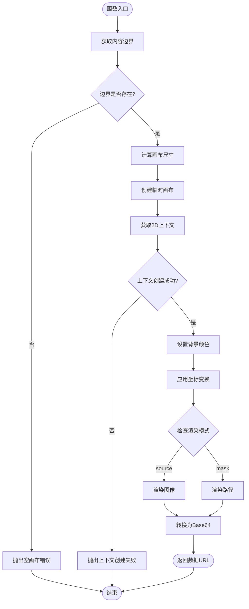

**图表来源**
- [MoodBoard.tsx](file://components/MoodBoard.tsx#L393-L469)

**章节来源**
- [MoodBoard.tsx](file://components/MoodBoard.tsx#L393-L469)

## 架构概览

### 双模式渲染系统

BananaCanvase采用了创新的双模式渲染架构，通过单一函数实现两种截然不同的输出目标：

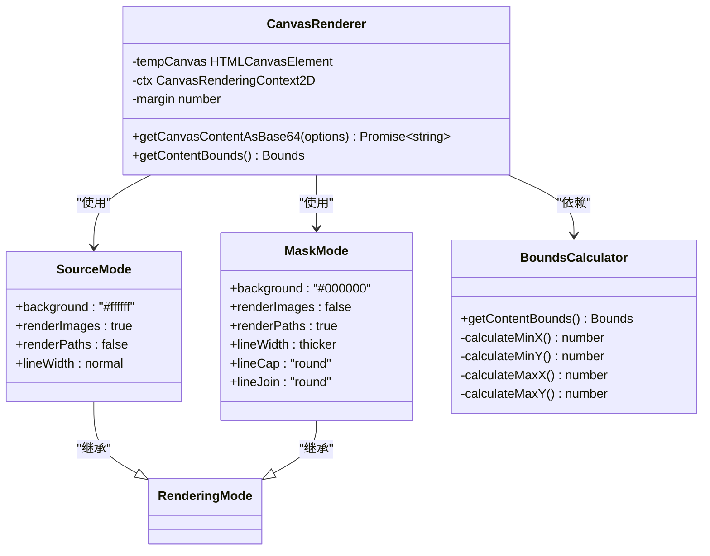

**图表来源**
- [MoodBoard.tsx](file://components/MoodBoard.tsx#L393-L469)
- [MoodBoard.tsx](file://components\MoodBoard.tsx#L361-L390)

### 数据流架构

系统的数据流遵循严格的单向原则，确保数据的一致性和可预测性：

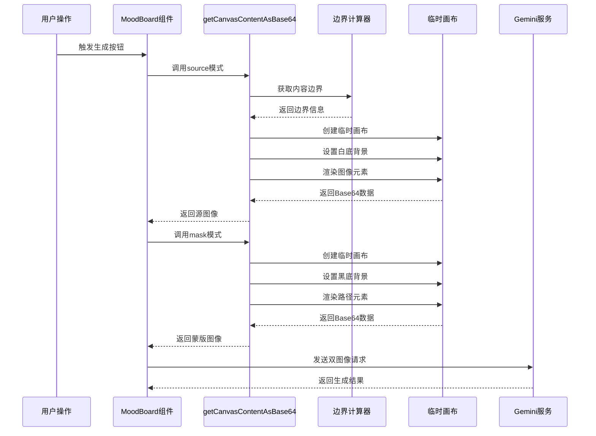

**图表来源**
- [MoodBoard.tsx](file://components\MoodBoard.tsx#L471-L525)
- [geminiService.ts](file://services\geminiService.ts#L5-L112)

**章节来源**
- [MoodBoard.tsx](file://components\MoodBoard.tsx#L471-L525)
- [geminiService.ts](file://services\geminiService.ts#L5-L112)

## 详细组件分析

### 边界计算引擎

边界计算是整个渲染流程的基础，负责确定画布内容的实际占用空间：

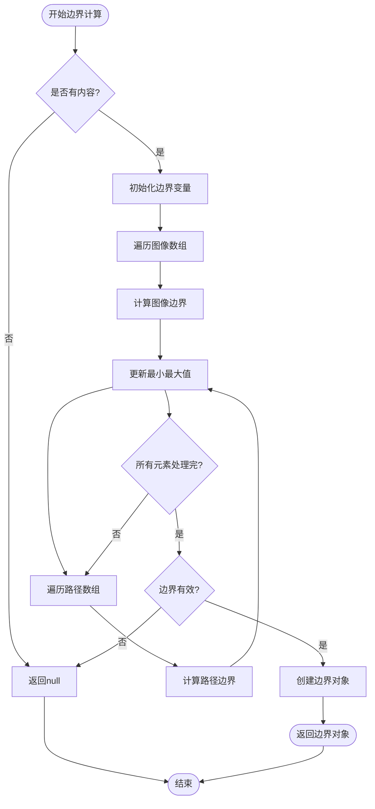

**图表来源**
- [MoodBoard.tsx](file://components\MoodBoard.tsx#L361-L390)

边界计算算法具有以下特点：
- **时间复杂度**: O(n)，其中n是图像和路径的总数
- **空间复杂度**: O(1)，只使用固定数量的变量
- **边界安全**: 自动处理空画布情况
- **精度保证**: 使用Infinity和-Infinity确保正确初始化

**章节来源**
- [MoodBoard.tsx](file://components\MoodBoard.tsx#L361-L390)

### 临时画布创建与配置

临时画布的创建过程体现了精确的空间管理和资源优化：

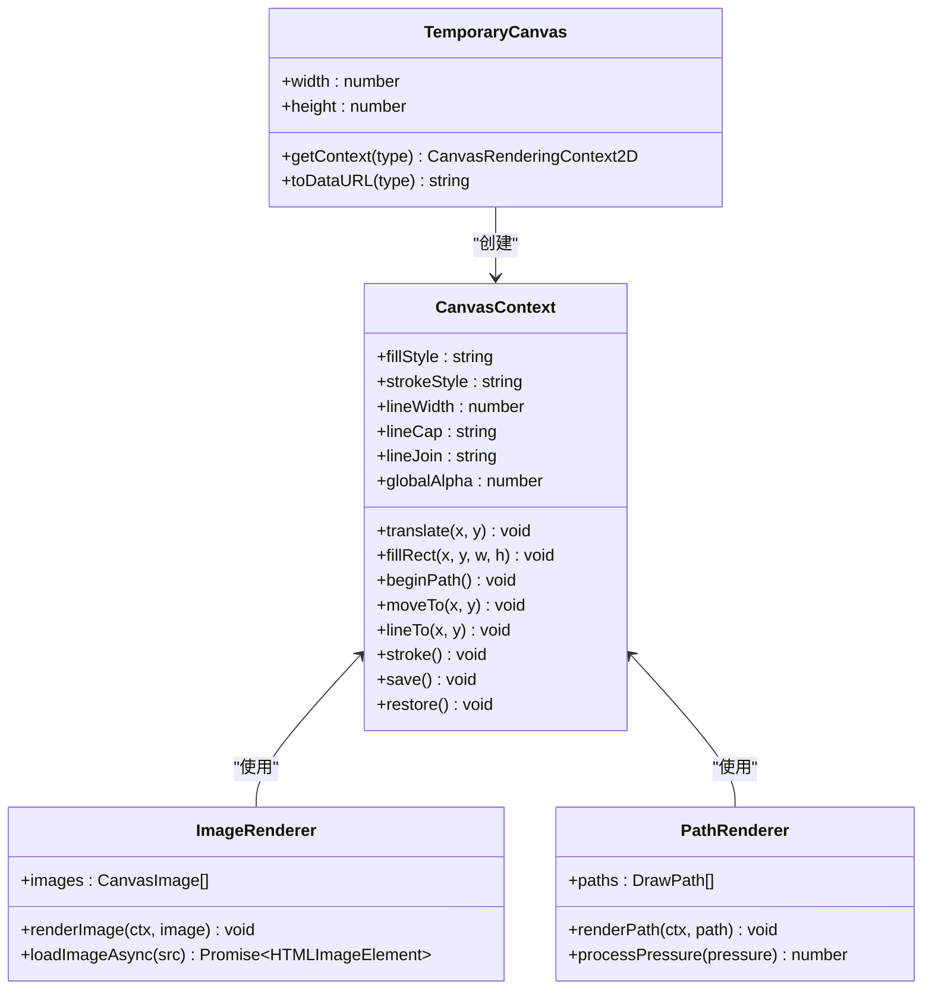

**图表来源**
- [MoodBoard.tsx](file://components\MoodBoard.tsx#L401-L469)

### 模式特定渲染流程

#### Source模式渲染

Source模式专注于高质量的图像展示，适用于AI识别的参考图像：

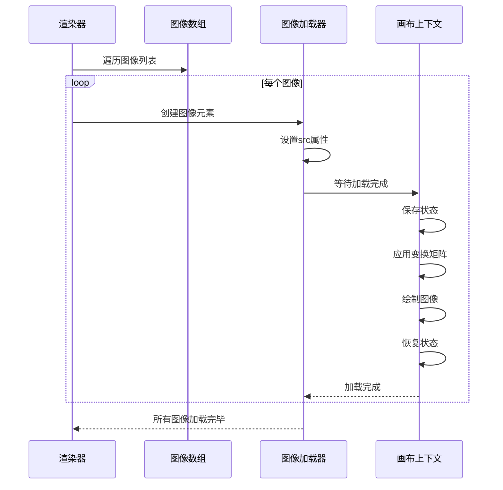

**图表来源**
- [MoodBoard.tsx](file://components\MoodBoard.tsx#L423-L439)

#### Mask模式渲染

Mask模式专门用于生成AI识别的蒙版图像，具有特殊的视觉特征：

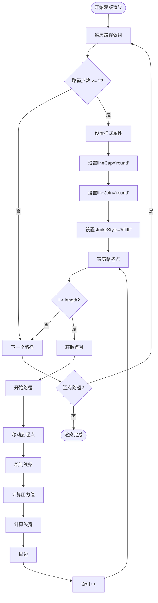

**图表来源**
- [MoodBoard.tsx](file://components\MoodBoard.tsx#L443-L466)

**章节来源**
- [MoodBoard.tsx](file://components\MoodBoard.tsx#L423-L469)

### 异步渲染优化

系统采用了先进的异步渲染策略，确保UI响应性和渲染效率：

#### 图像异步加载机制

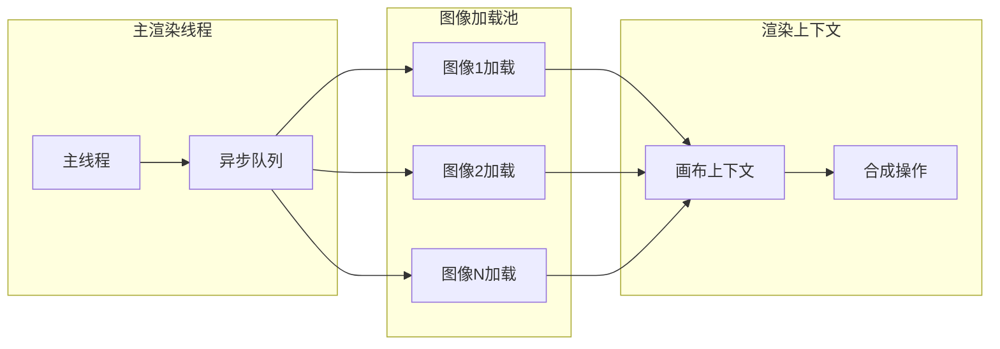

**图表来源**
- [MoodBoard.tsx](file://components\MoodBoard.tsx#L425-L437)

#### 并发控制策略

系统实现了智能的并发控制，避免过度消耗系统资源：

- **并发限制**: 使用Promise.all控制同时加载的图像数量
- **错误隔离**: 单个图像加载失败不影响其他图像
- **内存管理**: 及时释放不再需要的图像资源
- **进度反馈**: 提供加载进度的用户反馈

**章节来源**
- [MoodBoard.tsx](file://components\MoodBoard.tsx#L425-L439)

### 错误处理机制

系统实现了多层次的错误处理机制，确保稳定性和用户体验：

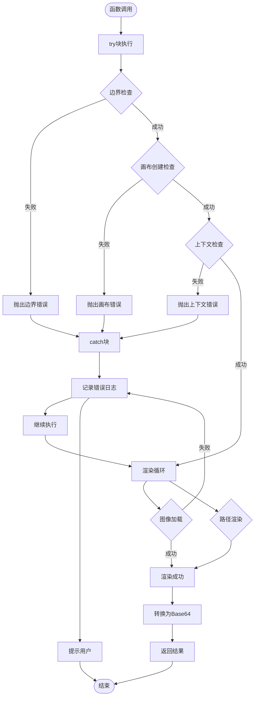

**图表来源**
- [MoodBoard.tsx](file://components\MoodBoard.tsx#L394-L469)

**章节来源**
- [MoodBoard.tsx](file://components\MoodBoard.tsx#L394-L469)

## 依赖关系分析

### 核心依赖图

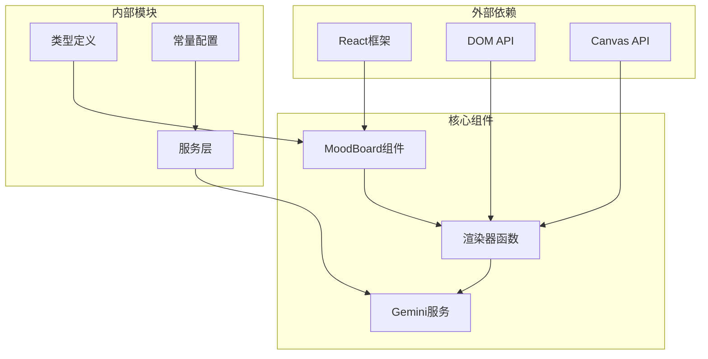

**图表来源**
- [MoodBoard.tsx](file://components\MoodBoard.tsx#L1-L15)
- [geminiService.ts](file://services\geminiService.ts#L1-L3)

### 数据流依赖

系统的数据流遵循严格的依赖关系，确保数据的一致性和可追踪性：

| 组件 | 输入依赖 | 输出依赖 | 关键接口 |
|------|----------|----------|----------|
| getCanvasContentAsBase64 | images, paths, mode | Base64字符串 | getContentBounds |
| getContentBounds | images, paths | Bounds对象 | 边界计算算法 |
| handleGenerate | paths, settings | 生成结果 | Gemini服务调用 |
| generateImageContent | prompt, settings, images | Base64图像 | GoogleGenAI客户端 |

**章节来源**
- [MoodBoard.tsx](file://components\MoodBoard.tsx#L393-L525)
- [geminiService.ts](file://services\geminiService.ts#L5-L112)

## 性能考虑

### 渲染性能优化

系统采用了多种性能优化策略：

1. **智能边界计算**: 只计算实际存在的内容边界，避免不必要的计算
2. **异步图像加载**: 使用Promise.all并行加载多个图像，提高加载效率
3. **内存优化**: 及时释放临时画布资源，避免内存泄漏
4. **缓存策略**: 复用已有的图像资源，减少重复加载

### 内存管理

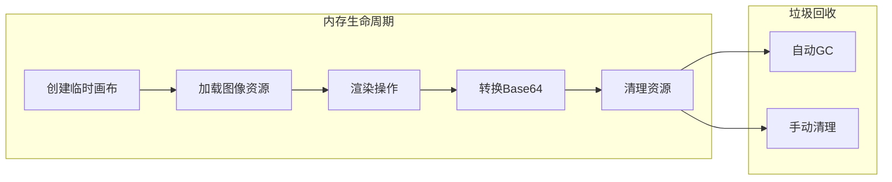

### 响应性优化

为了确保良好的用户体验，系统实现了以下响应性优化：

- **非阻塞渲染**: 使用异步操作避免阻塞UI线程
- **渐进式加载**: 先显示基本内容，再逐步完善细节
- **错误恢复**: 单个元素失败不影响整体渲染流程
- **进度反馈**: 提供清晰的操作进度指示

## 故障排除指南

### 常见问题及解决方案

#### 1. 空画布错误

**症状**: 函数抛出"Canvas is empty"错误
**原因**: 画布中没有图像或路径内容
**解决方案**: 
- 确保至少有一张上传的图像
- 或者绘制一些路径标记编辑区域

#### 2. 上下文创建失败

**症状**: 抛出"Failed to create image context"错误
**原因**: 浏览器不支持Canvas 2D上下文
**解决方案**:
- 检查浏览器兼容性
- 尝试在其他浏览器中运行
- 确保Canvas元素正确加载

#### 3. 图像加载超时

**症状**: 图像渲染不完整或空白
**原因**: 图像资源加载失败或网络超时
**解决方案**:
- 检查网络连接
- 验证图像URL的有效性
- 增加重试机制

#### 4. 内存不足错误

**症状**: 浏览器崩溃或页面无响应
**原因**: 处理大尺寸图像或大量图像
**解决方案**:
- 降低图像分辨率
- 限制同时加载的图像数量
- 实现图像预处理和压缩

**章节来源**
- [MoodBoard.tsx](file://components\MoodBoard.tsx#L394-L469)

### 调试技巧

1. **边界可视化**: 在开发环境中启用边界框显示
2. **渲染进度跟踪**: 添加详细的日志记录
3. **性能监控**: 使用浏览器开发者工具监控性能指标
4. **错误边界**: 实现全局错误处理和用户友好的错误提示

## 结论

`getCanvasContentAsBase64`函数代表了现代Web图形处理技术的精髓，通过巧妙的设计实现了双重渲染模式的统一管理。该函数不仅解决了技术挑战，还为用户提供了直观易用的图像生成体验。

### 技术亮点

1. **双模式设计**: 通过单一接口支持两种完全不同的输出需求
2. **智能边界计算**: 精确识别内容范围，避免浪费渲染资源
3. **异步渲染优化**: 确保UI响应性和渲染效率的平衡
4. **健壮的错误处理**: 提供完善的错误检测和恢复机制

### 应用价值

该函数的成功实现证明了现代Web技术在创意工具开发中的巨大潜力。通过合理的架构设计和性能优化，复杂的图像处理任务可以变得简单而高效，为用户创造更好的创作体验。

### 未来发展方向

随着Web技术的不断发展，该函数可以在以下方面进一步优化：
- 支持更多渲染模式和输出格式
- 实现GPU加速的渲染优化
- 添加更多的预处理和后处理功能
- 集成机器学习辅助的智能编辑功能