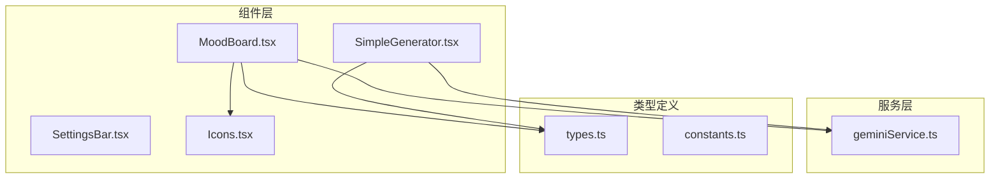
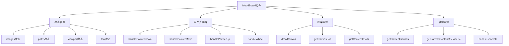
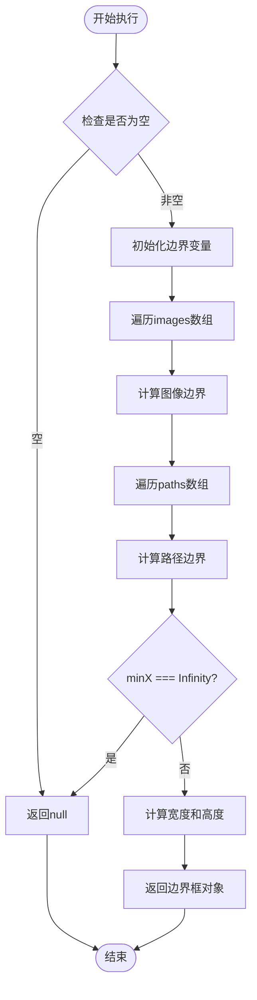
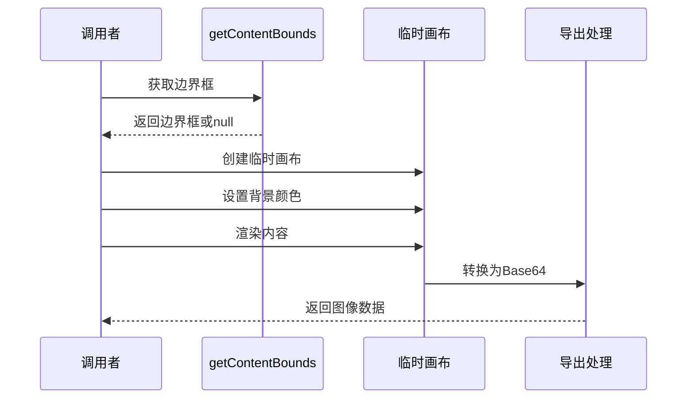
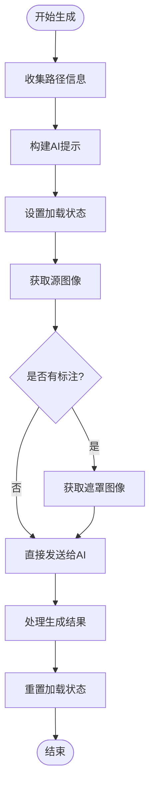
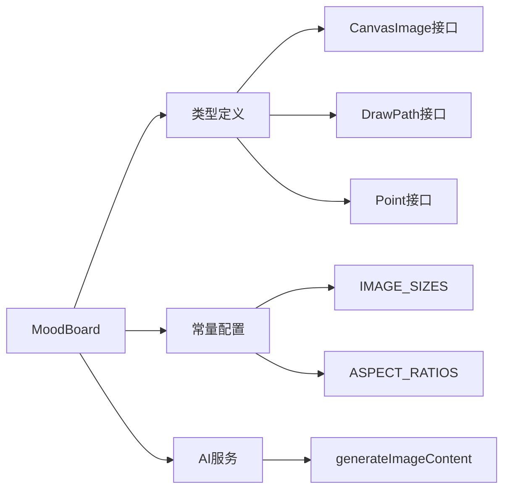

# 画布内容边界计算

<cite>
**本文档中引用的文件**
- [MoodBoard.tsx](file://components/MoodBoard.tsx)
- [types.ts](file://types.ts)
- [constants.ts](file://constants.ts)
</cite>

## 目录
1. [简介](#简介)
2. [项目结构概览](#项目结构概览)
3. [核心组件分析](#核心组件分析)
4. [架构概览](#架构概览)
5. [详细组件分析](#详细组件分析)
6. [依赖关系分析](#依赖关系分析)
7. [性能考虑](#性能考虑)
8. [故障排除指南](#故障排除指南)
9. [结论](#结论)

## 简介

本文档详细解析MoodBoard组件中的`getContentBounds`函数实现逻辑。该函数是画布内容边界计算的核心组件，负责计算画布上所有图像和绘制路径的整体边界框。通过遍历images和paths数组，该函数能够确定包含所有内容的最小矩形区域，为后续的图像生成流程提供关键的裁剪依据。

## 项目结构概览

该项目采用React前端架构，主要包含以下核心模块：

**图表来源**
- [MoodBoard.tsx](file://components/MoodBoard.tsx#L1-L20)
- [SimpleGenerator.tsx](file://components/SimpleGenerator.tsx#L1-L20)

**章节来源**
- [MoodBoard.tsx](file://components/MoodBoard.tsx#L1-L50)
- [types.ts](file://types.ts#L1-L61)

## 核心组件分析

### MoodBoard组件概述

MoodBoard是一个功能丰富的画布组件，支持：
- 图像上传和管理
- 绘制路径（遮罩）功能
- 视口缩放和平移
- AI图像生成功能

### 主要状态管理

组件维护以下核心状态：
- `images`: CanvasImage对象数组，存储画布上的图像
- `paths`: DrawPath对象数组，存储绘制的路径
- `viewport`: 视口状态，包含平移和缩放信息
- `tool`: 当前工具状态（选择、移动、绘制、平移）

**章节来源**
- [MoodBoard.tsx](file://components/MoodBoard.tsx#L27-L39)

## 架构概览

MoodBoard组件采用函数式组件设计，结合React Hooks实现复杂的状态管理和交互逻辑：

**图表来源**
- [MoodBoard.tsx](file://components/MoodBoard.tsx#L25-L170)

## 详细组件分析

### getContentBounds函数实现

#### 函数签名和基本逻辑

`getContentBounds`函数负责计算画布上所有内容的边界框：

**图表来源**
- [MoodBoard.tsx](file://components/MoodBoard.tsx#L362-L391)

#### 边界计算算法详解

函数采用双重循环策略：

1. **图像边界计算**：遍历每个CanvasImage对象，计算其左上角和右下角坐标
2. **路径边界计算**：遍历每个DrawPath对象及其点数组，计算所有点的边界

**关键实现细节**：

| 计算步骤 | 变量 | 操作 | 说明 |
|---------|------|------|------|
| 初始化 | `minX`, `minY` | 设置为`Infinity` | 确保初始值小于任何实际坐标 |
| 初始化 | `maxX`, `maxY` | 设置为`-Infinity` | 确保初始值大于任何实际坐标 |
| 图像处理 | `minX` | `Math.min(minX, img.x)` | 更新最小X坐标 |
| 图像处理 | `maxX` | `Math.max(maxX, img.x + img.width)` | 更新最大X坐标 |
| 路径处理 | `minY` | `Math.min(minY, p.y)` | 更新最小Y坐标 |
| 路径处理 | `maxY` | `Math.max(maxY, p.y)` | 更新最大Y坐标 |

#### 边界框数据结构

函数返回的边界框对象包含以下属性：

| 属性 | 类型 | 描述 | 计算方式 |
|------|------|------|----------|
| `x` | number | 左上角X坐标 | 最小X坐标值 |
| `y` | number | 左上角Y坐标 | 最小Y坐标值 |
| `width` | number | 边界框宽度 | `maxX - minX` |
| `height` | number | 边界框高度 | `maxY - minY` |

**章节来源**
- [MoodBoard.tsx](file://components/MoodBoard.tsx#L362-L391)

### getCanvasContentAsBase64函数

该函数利用getContentBounds的结果进行图像导出：

**图表来源**
- [MoodBoard.tsx](file://components/MoodBoard.tsx#L393-L470)

#### 边界框在图像生成流程中的作用

1. **内容裁剪**：根据边界框确定有效内容区域
2. **边距处理**：添加20像素的安全边距
3. **模式区分**：支持源图像和遮罩两种渲染模式

**章节来源**
- [MoodBoard.tsx](file://components/MoodBoard.tsx#L393-L470)

### handleGenerate函数中的调用时机

在图像生成流程中，getContentBounds函数在以下关键节点被调用：

**图表来源**
- [MoodBoard.tsx](file://components/MoodBoard.tsx#L472-L525)

**章节来源**
- [MoodBoard.tsx](file://components/MoodBoard.tsx#L472-L525)

## 依赖关系分析

### 组件间依赖关系

**图表来源**
- [MoodBoard.tsx](file://components/MoodBoard.tsx#L15-L16)
- [types.ts](file://types.ts#L12-L34)
- [constants.ts](file://constants.ts#L14-L33)

### 外部依赖

项目依赖以下外部库和服务：
- React 18+：核心框架
- TypeScript：类型安全
- Gemini AI服务：图像生成能力

**章节来源**
- [MoodBoard.tsx](file://components/MoodBoard.tsx#L1-L20)
- [constants.ts](file://constants.ts#L1-L34)

## 性能考虑

### 边界计算优化

1. **早期退出机制**：当画布为空时立即返回null
2. **单次遍历策略**：通过双重循环一次性完成所有边界计算
3. **内存效率**：避免创建额外的数据结构

### 渲染性能

1. **Canvas复用**：使用单一Canvas元素进行渲染
2. **按需更新**：通过useCallback优化渲染性能
3. **动画帧控制**：使用requestAnimationFrame实现流畅动画

## 故障排除指南

### 常见问题及解决方案

| 问题 | 可能原因 | 解决方案 |
|------|----------|----------|
| 边界框计算错误 | 图像坐标异常 | 验证CanvasImage对象的坐标值 |
| 空画布返回null | 未正确初始化状态 | 检查images和paths数组状态 |
| 导出图像空白 | 边界框超出范围 | 添加边界检查和默认值处理 |

### 调试技巧

1. **边界框可视化**：在开发环境中显示计算出的边界框
2. **状态监控**：使用React DevTools跟踪状态变化
3. **日志记录**：在关键函数中添加调试输出

**章节来源**
- [MoodBoard.tsx](file://components/MoodBoard.tsx#L362-L391)

## 结论

`getContentBounds`函数是MoodBoard组件中一个关键的辅助函数，它通过简洁而高效的算法实现了画布内容边界的精确计算。该函数不仅为图像生成提供了必要的裁剪依据，还体现了React组件中状态管理和计算逻辑的最佳实践。

函数的设计充分考虑了性能和可维护性，采用了早期退出、单次遍历等优化策略。在handleGenerate函数中的集成使用，展示了该函数在整个应用架构中的重要作用，为用户提供了高质量的AI图像生成功能。

通过深入理解这个函数的实现原理，开发者可以更好地扩展和维护这个复杂的画布应用程序，同时也可以借鉴其中的设计模式和优化技巧应用于其他类似的项目中。