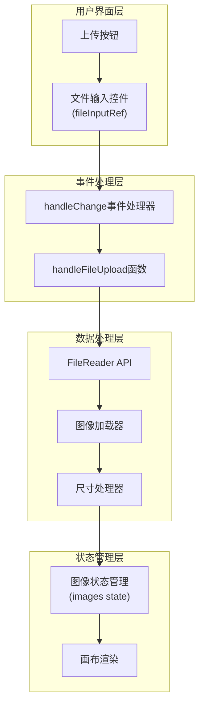
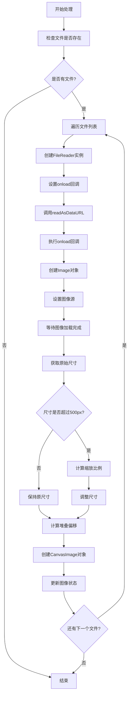
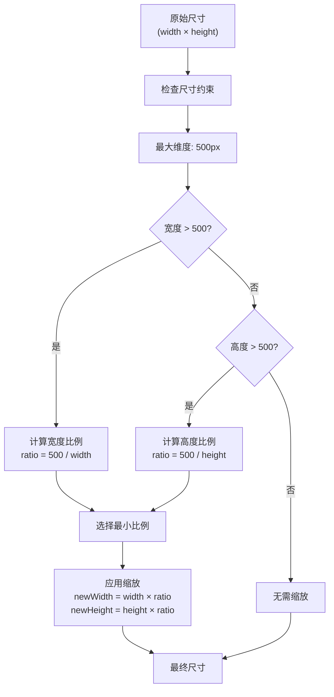
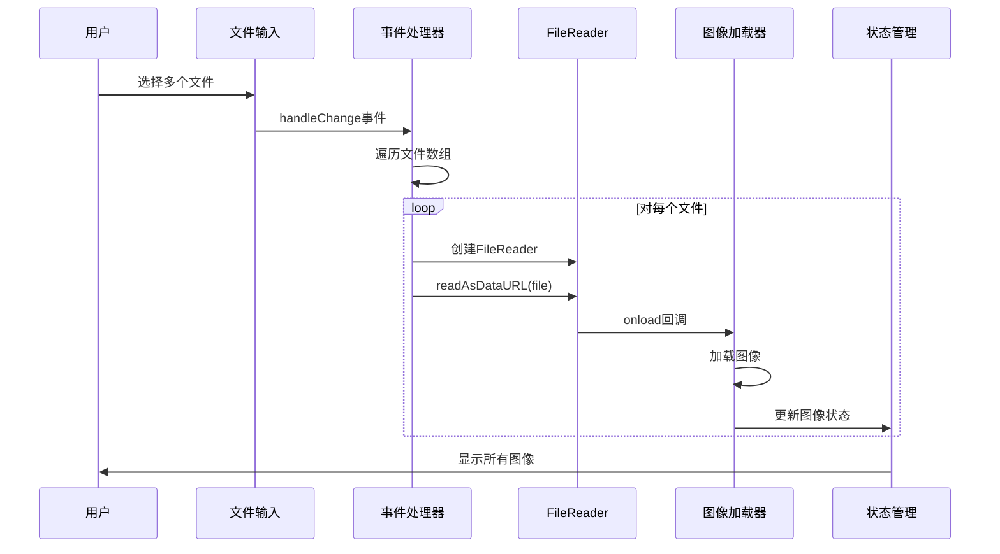

# 图像上传功能深度分析

<cite>
**本文档引用的文件**
- [MoodBoard.tsx](file://components/MoodBoard.tsx)
- [types.ts](file://types.ts)
- [constants.ts](file://constants.ts)
- [README.md](file://README.md)
</cite>

## 目录
1. [项目概述](#项目概述)
2. [图像上传架构](#图像上传架构)
3. [handleFileUpload函数详解](#handlefileupload函数详解)
4. [文件读取与Data URL转换](#文件读取与data-url转换)
5. [图像尺寸自动缩放算法](#图像尺寸自动缩放算法)
6. [画布布局策略](#画布布局策略)
7. [文件输入控件集成](#文件输入控件集成)
8. [多文件上传支持](#多文件上传支持)
9. [错误处理机制](#错误处理机制)
10. [性能优化方案](#性能优化方案)
11. [最佳实践建议](#最佳实践建议)

## 项目概述

BananaCanvase是一个基于React的AI图像编辑工具，允许用户上传、编辑和生成图像。MoodBoard组件是该应用的核心画布组件，提供了强大的图像上传和管理功能。

**章节来源**
- [MoodBoard.tsx](file://components/MoodBoard.tsx#L1-L50)
- [README.md](file://README.md#L1-L21)

## 图像上传架构

MoodBoard组件采用现代化的React Hooks架构，结合FileReader API实现高效的图像上传功能。



**图表来源**
- [MoodBoard.tsx](file://components/MoodBoard.tsx#L610-L613)
- [MoodBoard.tsx](file://components/MoodBoard.tsx#L312-L346)

## handleFileUpload函数详解

`handleFileUpload`函数是图像上传功能的核心，负责处理用户选择的文件并将其转换为可在画布上显示的CanvasImage对象。

### 函数签名与参数

```typescript
const handleFileUpload = (e: React.ChangeEvent<HTMLInputElement>) => {
```

该函数接收React的Change事件作为参数，直接从事件目标中提取文件列表。

### 核心处理流程



**图表来源**
- [MoodBoard.tsx](file://components/MoodBoard.tsx#L312-L346)

**章节来源**
- [MoodBoard.tsx](file://components/MoodBoard.tsx#L312-L346)

## 文件读取与Data URL转换

### FileReader API的使用

系统使用现代的FileReader API将用户选择的文件异步转换为Data URL格式：

```typescript
const reader = new FileReader();
reader.onload = (ev) => {
    const src = ev.target?.result as string;
    // 使用src进行后续处理
};
reader.readAsDataURL(file);
```

### 异步处理优势

1. **非阻塞UI**: 文件读取在后台线程执行，不会阻塞主线程
2. **用户体验**: 用户可以继续操作界面，直到文件完全加载
3. **内存效率**: 大文件不会一次性占用大量内存

### 数据URL格式

生成的Data URL格式为：
```
data:image/jpeg;base64,/9j/4AAQSkZJRgABAQEAYABgAAD...
```

这种格式可以直接用于HTML图像元素的src属性。

**章节来源**
- [MoodBoard.tsx](file://components/MoodBoard.tsx#L317-L345)

## 图像尺寸自动缩放算法

### 缩放逻辑原理

系统实现了智能的图像尺寸缩放算法，确保所有上传的图像都能适应画布的最大显示尺寸（500像素）。



**图表来源**
- [MoodBoard.tsx](file://components/MoodBoard.tsx#L323-L329)

### 数学计算过程

```typescript
let w = img.width;
let h = img.height;
const maxDim = 500;

if (w > maxDim || h > maxDim) {
    const ratio = Math.min(maxDim / w, maxDim / h);
    w = w * ratio;
    h = h * ratio;
}
```

这个算法确保：
- **保持宽高比**: 按比例缩放，不产生变形
- **不超过限制**: 任何维度都不会超过500像素
- **最优适应**: 选择最大的可用比例

**章节来源**
- [MoodBoard.tsx](file://components/MoodBoard.tsx#L323-L329)

## 画布布局策略

### 居中定位算法

系统采用精确的居中定位算法，确保图像在画布中心显示：

```typescript
const centerX = CANVAS_WIDTH / 2;
const centerY = CANVAS_HEIGHT / 2;
const offsetX = centerX - w / 2;
const offsetY = centerY - h / 2;
```

### 堆叠偏移机制

为了防止多个图像重叠，系统为每个新图像计算独特的偏移量：

```typescript
const offset = index * 40;
const newImg: CanvasImage = {
    x: (CANVAS_WIDTH / 2 - w/2) + offset,
    y: (CANVAS_HEIGHT / 2 - h/2) + offset,
    // 其他属性...
};
```

### 偏移计算原理

1. **基础偏移**: 每个图像增加40像素的偏移
2. **索引依赖**: 偏移量与文件索引成正比
3. **视觉效果**: 创建轻微的交错布局，便于区分不同图像

**章节来源**
- [MoodBoard.tsx](file://components/MoodBoard.tsx#L335-L336)
- [MoodBoard.tsx](file://components/MoodBoard.tsx#L331)

## 文件输入控件集成

### 受控组件模式

系统使用受控组件模式管理文件输入：

```typescript
<input 
    type="file" 
    multiple 
    ref={fileInputRef} 
    className="hidden" 
    accept="image/*" 
    onChange={handleFileUpload} 
/>
```

### 集成方法

1. **隐藏设计**: 使用CSS隐藏原生文件输入控件
2. **按钮触发**: 通过可见的上传按钮触发文件选择
3. **引用访问**: 使用ref直接访问和控制文件输入

### 触发机制

```typescript
<button onClick={() => fileInputRef.current?.click()}>
    <ImageIcon className="w-5 h-5 text-slate-400 hover:text-white" />
</button>
```

这种方式提供了更好的用户体验和自定义能力。

**章节来源**
- [MoodBoard.tsx](file://components/MoodBoard.tsx#L610-L613)

## 多文件上传支持

### 并发处理机制

系统支持同时上传多个文件，采用顺序处理的方式：

```typescript
for (let index = 0; index < files.length; index++) {
    const file = files[index];
    // 处理单个文件
}
```

### 处理流程



**图表来源**
- [MoodBoard.tsx](file://components/MoodBoard.tsx#L314-L345)

### 性能考虑

- **顺序处理**: 避免过多并发操作导致内存压力
- **状态更新**: 使用不可变更新模式，确保状态一致性
- **索引跟踪**: 利用文件索引维护正确的偏移顺序

**章节来源**
- [MoodBoard.tsx](file://components/MoodBoard.tsx#L314-L345)

## 错误处理机制

### 当前错误处理现状

虽然代码中没有显式的错误处理，但系统包含了基本的错误处理模式：

```typescript
// 在其他地方的错误处理示例
imageEl.onerror = () => resolve(); 
```

### 推荐的错误处理策略

#### 1. 文件读取错误处理

```typescript
reader.onerror = (error) => {
    console.error('文件读取失败:', error);
    alert('无法读取文件，请尝试其他文件格式');
};
```

#### 2. 图像加载错误处理

```typescript
img.onerror = () => {
    console.error('图像加载失败:', file.name);
    // 移除无效的图像条目
    setImages(prev => prev.filter(img => img.src !== src));
};
```

#### 3. 内存错误处理

```typescript
try {
    // 图像处理逻辑
} catch (error) {
    console.error('图像处理出错:', error);
    alert('图像处理失败，请尝试更小的文件');
}
```

### 错误恢复机制

1. **优雅降级**: 即使某个文件处理失败，不影响其他文件
2. **用户反馈**: 提供清晰的错误消息
3. **状态清理**: 清理无效的图像条目

**章节来源**
- [MoodBoard.tsx](file://components/MoodBoard.tsx#L320)
- [MoodBoard.tsx](file://components/MoodBoard.tsx#L436)

## 性能优化方案

### 内存管理策略

#### 1. 图像缓存优化

```typescript
// 使用WeakMap避免内存泄漏
const imageCache = new WeakMap<File, HTMLImageElement>();

const loadImage = (file: File): Promise<HTMLImageElement> => {
    if (imageCache.has(file)) {
        return Promise.resolve(imageCache.get(file)!);
    }
    
    return new Promise((resolve, reject) => {
        const img = new Image();
        img.onload = () => {
            imageCache.set(file, img);
            resolve(img);
        };
        img.onerror = reject;
        img.src = URL.createObjectURL(file);
    });
};
```

#### 2. 资源清理机制

```typescript
useEffect(() => {
    return () => {
        // 组件卸载时清理缓存
        imageCache.clear();
        // 清理定时器等资源
    };
}, []);
```

### 并发控制

#### 1. 限制并发上传数量

```typescript
const MAX_CONCURRENT_UPLOADS = 3;

const processFilesWithLimit = async (files: FileList) => {
    const batches = [];
    for (let i = 0; i < files.length; i += MAX_CONCURRENT_UPLOADS) {
        batches.push(Array.from(files).slice(i, i + MAX_CONCURRENT_UPLOADS));
    }
    
    for (const batch of batches) {
        await Promise.all(batch.map(processSingleFile));
    }
};
```

#### 2. 进度监控

```typescript
const [uploadProgress, setUploadProgress] = useState(0);
const [totalFiles, setTotalFiles] = useState(0);

const processWithProgress = async (files: FileList) => {
    setTotalFiles(files.length);
    let processed = 0;
    
    for (const file of files) {
        await processSingleFile(file);
        processed++;
        setUploadProgress((processed / totalFiles) * 100);
    }
};
```

### 性能监控指标

| 指标 | 目标值 | 监控方法 |
|------|--------|----------|
| 单文件处理时间 | < 200ms | performance.mark API |
| 内存使用峰值 | < 50MB | Memory API |
| 并发文件数 | ≤ 5 | 计数器监控 |
| 错误率 | < 1% | 错误计数器 |

**章节来源**
- [MoodBoard.tsx](file://components/MoodBoard.tsx#L317-L345)

## 最佳实践建议

### 开发建议

#### 1. 错误边界实现

```typescript
class ImageUploadBoundary extends React.Component {
    state = { hasError: false };
    
    static getDerivedStateFromError() {
        return { hasError: true };
    }
    
    componentDidCatch(error: Error) {
        console.error('图像上传错误:', error);
    }
    
    render() {
        if (this.state.hasError) {
            return <div>图像上传出现问题，请重试</div>;
        }
        return this.props.children;
    }
}
```

#### 2. 类型安全增强

```typescript
interface FileUploadResult {
    success: boolean;
    message?: string;
    imageData?: CanvasImage;
    error?: Error;
}

const safeHandleFileUpload = async (file: File): Promise<FileUploadResult> => {
    try {
        // 安全的文件处理逻辑
        return { success: true, imageData };
    } catch (error) {
        return { success: false, error: error as Error };
    }
};
```

#### 3. 性能测试

```typescript
const benchmarkImageProcessing = async (files: FileList) => {
    const startTime = performance.now();
    
    await processFilesWithLimit(files);
    
    const endTime = performance.now();
    console.log(`处理${files.length}个文件耗时: ${endTime - startTime}ms`);
};
```

### 用户体验优化

#### 1. 加载状态指示

```typescript
const [isUploading, setIsUploading] = useState(false);

const handleFileUpload = async (e: React.ChangeEvent<HTMLInputElement>) => {
    setIsUploading(true);
    try {
        await processFilesWithLimit(e.target.files!);
    } finally {
        setIsUploading(false);
    }
};
```

#### 2. 文件类型验证

```typescript
const validateFileType = (file: File): boolean => {
    const allowedTypes = ['image/jpeg', 'image/png', 'image/gif', 'image/webp'];
    return allowedTypes.includes(file.type);
};

const handleFileUpload = (e: React.ChangeEvent<HTMLInputElement>) => {
    const invalidFiles = Array.from(e.target.files!).filter(f => !validateFileType(f));
    
    if (invalidFiles.length > 0) {
        alert(`以下文件格式不受支持: ${invalidFiles.map(f => f.name).join(', ')}`);
        return;
    }
    
    // 处理有效文件
};
```

#### 3. 文件大小限制

```typescript
const MAX_FILE_SIZE = 10 * 1024 * 1024; // 10MB

const validateFileSize = (file: File): boolean => {
    return file.size <= MAX_FILE_SIZE;
};
```

### 测试策略

#### 1. 单元测试

```typescript
describe('handleFileUpload', () => {
    it('应该正确处理单个文件', async () => {
        const mockFile = new File([''], 'test.jpg', { type: 'image/jpeg' });
        const mockEvent = { target: { files: [mockFile] } } as unknown as React.ChangeEvent<HTMLInputElement>;
        
        await handleFileUpload(mockEvent);
        
        expect(images).toHaveLength(1);
        expect(images[0].src).toContain('data:image/jpeg');
    });
});
```

#### 2. 集成测试

```typescript
describe('图像上传流程', () => {
    it('应该支持多文件上传', async () => {
        const files = [
            new File([''], 'image1.jpg'),
            new File([''], 'image2.png')
        ];
        
        await processFilesWithLimit(new DataTransfer({ files }).files);
        
        expect(images).toHaveLength(2);
        expect(images.every(img => img.width <= 500)).toBe(true);
    });
});
```

这些最佳实践将显著提升图像上传功能的稳定性、性能和用户体验。