# 图像布局

<cite>
**本文档中引用的文件**
- [types.ts](file://types.ts)
- [components/MoodBoard.tsx](file://components/MoodBoard.tsx)
- [constants.ts](file://constants.ts)
- [App.tsx](file://App.tsx)
</cite>

## 目录
1. [简介](#简介)
2. [CanvasImage类型结构](#canvasimagetype结构)
3. [画布坐标系统](#画布坐标系统)
4. [图像初始化定位算法](#图像初始化定位算法)
5. [视口变换与坐标转换](#视口变换与坐标转换)
6. [渲染机制](#渲染机制)
7. [响应式设计与适配策略](#响应式设计与适配策略)
8. [布局优化建议](#布局优化建议)
9. [总结](#总结)

## 简介

Banana Canvas的MoodBoard组件实现了一个复杂的图像布局系统，支持无限画布、缩放、平移和图像堆叠功能。该系统通过CanvasImage类型定义图像的基本属性，并结合视口变换系统实现精确的坐标控制和响应式布局。

## CanvasImage类型结构

CanvasImage接口定义了图像在画布中的基本属性，这些属性共同决定了图像在画布中的最终显示位置和外观。

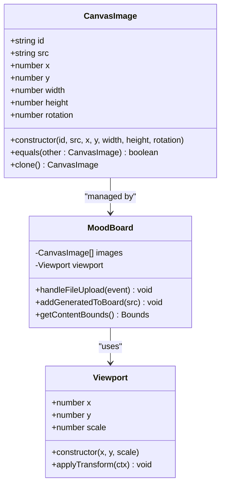

**图表来源**
- [types.ts](file://types.ts#L12-L19)
- [components/MoodBoard.tsx](file://components/MoodBoard.tsx#L27-L28)

### 字段详解

| 字段名 | 类型 | 描述 | 默认值 |
|--------|------|------|--------|
| id | string | 唯一标识符，用于图像选择和状态管理 | 自动生成 |
| src | string | 图像资源路径或数据URL | 用户上传的图像 |
| x | number | 图像左上角在画布坐标系中的X坐标 | 初始化计算 |
| y | number | 图像左上角在画布坐标系中的Y坐标 | 初始化计算 |
| width | number | 图像在画布中的宽度像素值 | 按比例调整后的尺寸 |
| height | number | 图像在画布中的高度像素值 | 按比例调整后的尺寸 |
| rotation | number | 图像旋转角度（度数），顺时针为正 | 0 |

**节来源**
- [types.ts](file://types.ts#L12-L19)

## 画布坐标系统

MoodBoard使用一个固定大小的无限画布，尺寸为2048×2048像素。这个坐标系统具有以下特点：

### 坐标原点
- **原点位置**: 左上角 (0, 0)
- **坐标范围**: 0 ≤ x ≤ 2048, 0 ≤ y ≤ 2048
- **单位**: 像素

### 视口系统
系统采用视口(Viewport)概念来实现缩放和平移功能：

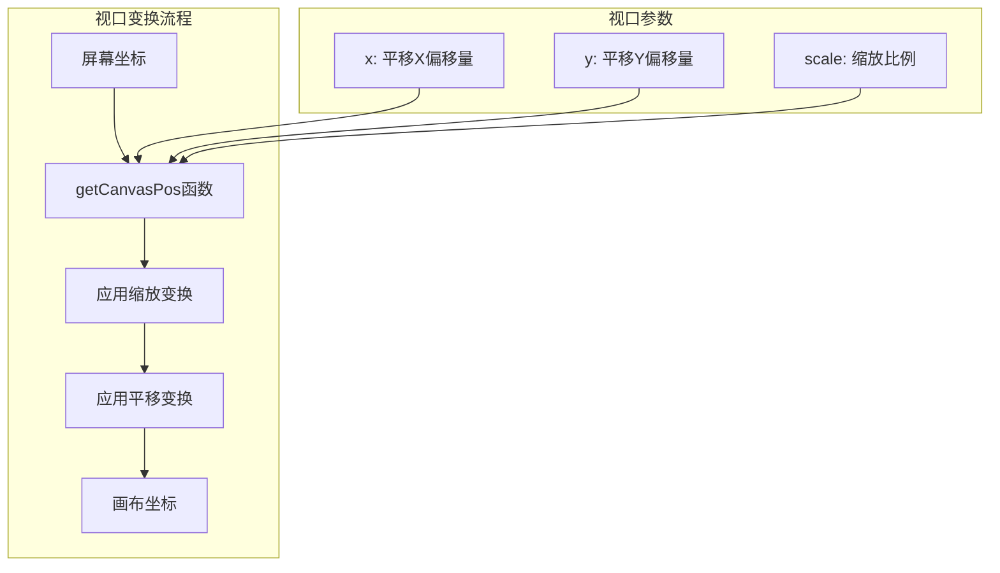

**图表来源**
- [components/MoodBoard.tsx](file://components/MoodBoard.tsx#L72-L84)

**节来源**
- [components/MoodBoard.tsx](file://components/MoodBoard.tsx#L55-L56)
- [components/MoodBoard.tsx](file://components/MoodBoard.tsx#L72-L84)

## 图像初始化定位算法

当用户上传图像时，系统会执行复杂的定位算法来确保图像在画布中的美观排列。

### 居中定位算法

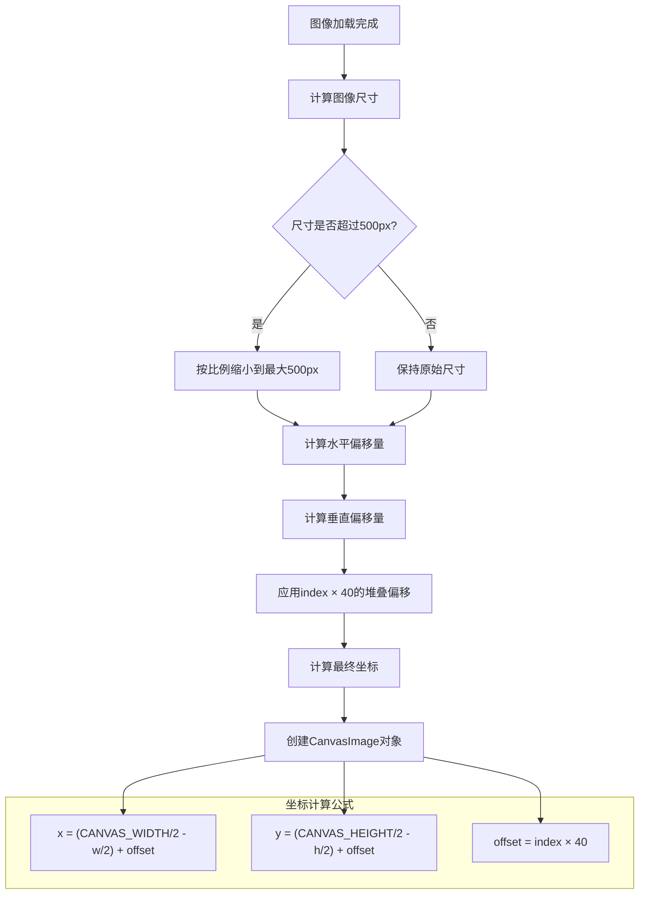

**图表来源**
- [components/MoodBoard.tsx](file://components/MoodBoard.tsx#L320-L340)

### 关键计算步骤

1. **尺寸限制**: 图像最大尺寸限制为500像素，避免过大图像影响性能
2. **居中对齐**: 使用 `(CANVAS_WIDTH/2 - w/2)` 计算水平居中位置
3. **垂直居中**: 使用 `(CANVAS_HEIGHT/2 - h/2)` 计算垂直居中位置
4. **堆叠效果**: 通过 `index * 40` 产生视觉上的堆叠效果

### 堆叠效果实现

```typescript
// 堆叠偏移计算
const offset = index * 40;
const newImg: CanvasImage = {
    id: Date.now().toString() + Math.random(),
    src,
    x: (CANVAS_WIDTH / 2 - w/2) + offset,  // 水平偏移
    y: (CANVAS_HEIGHT / 2 - h/2) + offset, // 垂直偏移
    width: w,
    height: h,
    rotation: 0
};
```

**节来源**
- [components/MoodBoard.tsx](file://components/MoodBoard.tsx#L320-L340)

## 视口变换与坐标转换

系统实现了完整的坐标转换机制，支持从屏幕坐标到画布坐标的精确映射。

### 屏幕坐标到画布坐标的转换

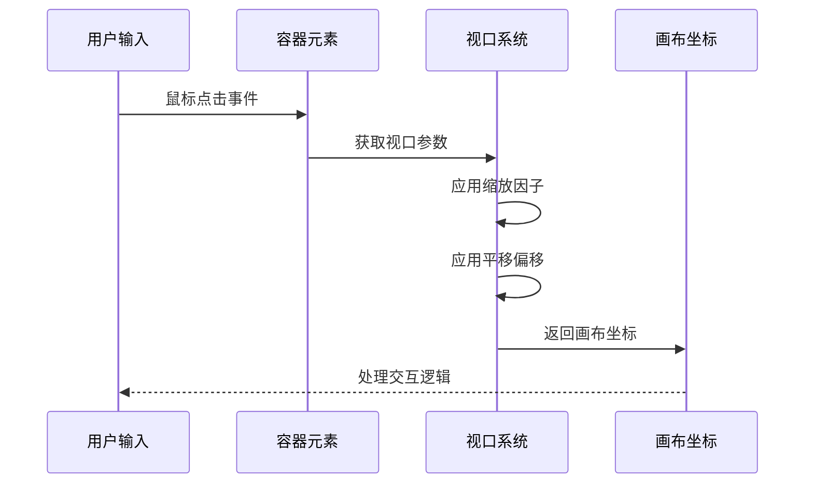

**图表来源**
- [components/MoodBoard.tsx](file://components/MoodBoard.tsx#L72-L84)

### 坐标转换公式

系统使用以下公式进行坐标转换：

```
画布X = (屏幕X - 容器左边缘 - 视口X) / 视口缩放比例
画布Y = (屏幕Y - 容器上边缘 - 视口Y) / 视口缩放比例
```

### 视口变换应用

在渲染过程中，系统会应用视口变换来正确显示图像：

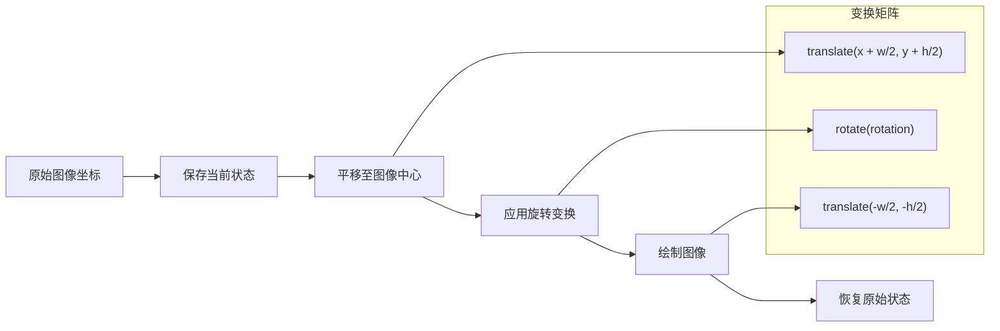

**图表来源**
- [components/MoodBoard.tsx](file://components/MoodBoard.tsx#L123-L126)

**节来源**
- [components/MoodBoard.tsx](file://components/MoodBoard.tsx#L72-L84)
- [components/MoodBoard.tsx](file://components/MoodBoard.tsx#L123-L126)

## 渲染机制

MoodBoard采用双层渲染架构，分别处理图像和路径元素。

### 渲染层次结构

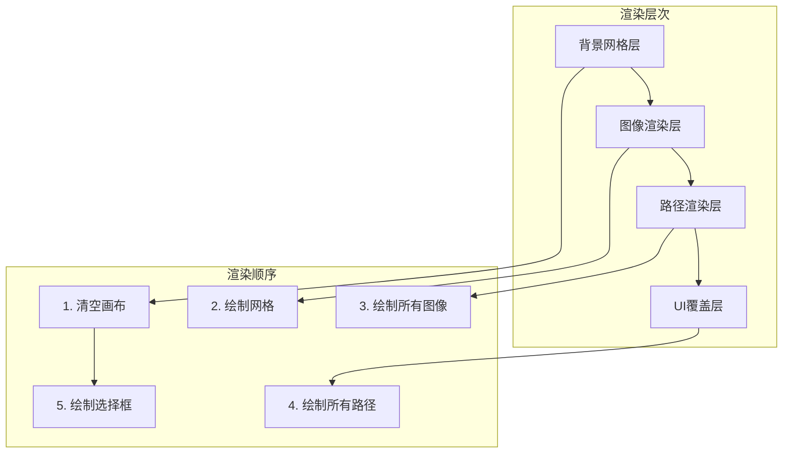

**图表来源**
- [components/MoodBoard.tsx](file://components/MoodBoard.tsx#L99-L165)

### 图像渲染流程

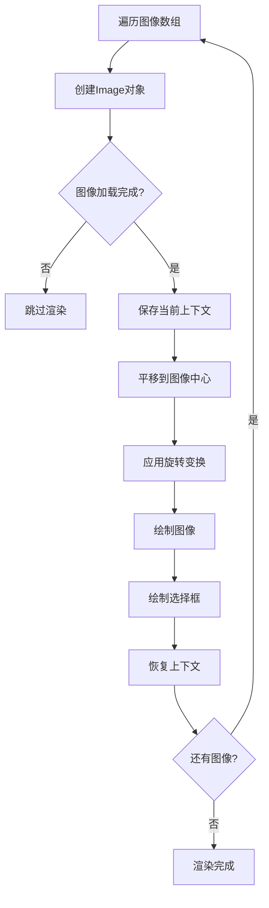

**图表来源**
- [components/MoodBoard.tsx](file://components/MoodBoard.tsx#L117-L138)

### 路径渲染特性

路径渲染具有特殊的透明度和颜色处理：

- **透明度**: 60% (0.6) 的全局透明度
- **颜色**: 根据工具选择的颜色
- **线宽**: 基于压力感应的动态调整
- **连接方式**: 圆角连接，圆滑过渡

**节来源**
- [components/MoodBoard.tsx](file://components/MoodBoard.tsx#L99-L165)
- [components/MoodBoard.tsx](file://components/MoodBoard.tsx#L140-L165)

## 响应式设计与适配策略

系统采用多种策略来适应不同的容器尺寸和设备类型。

### 容器适配机制

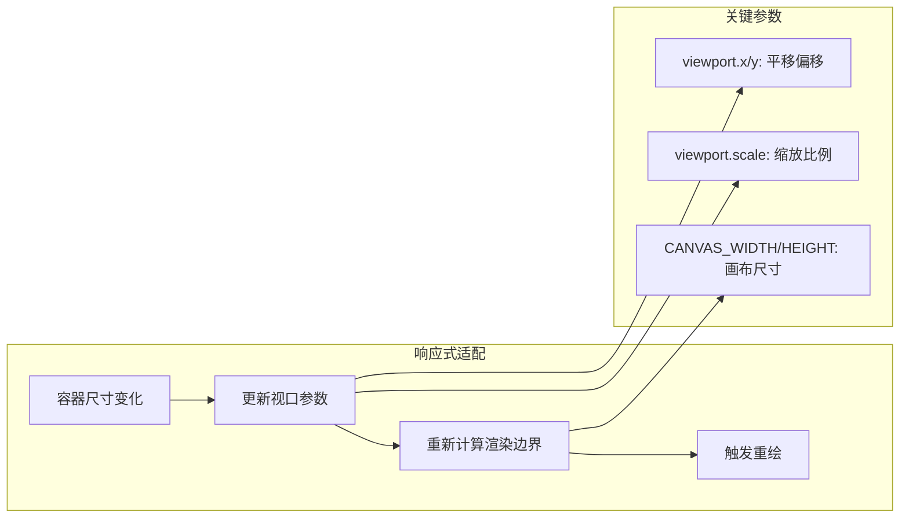

**图表来源**
- [components/MoodBoard.tsx](file://components/MoodBoard.tsx#L670-L696)

### 缩放策略

系统支持0.1到5倍的缩放范围，采用以下策略：

1. **最小缩放**: 0.1倍，确保细节可见
2. **最大缩放**: 5倍，提供精细操作能力
3. **缩放中心**: 鼠标指针位置，提升用户体验
4. **平滑过渡**: 使用requestAnimationFrame实现流畅动画

### 平移机制

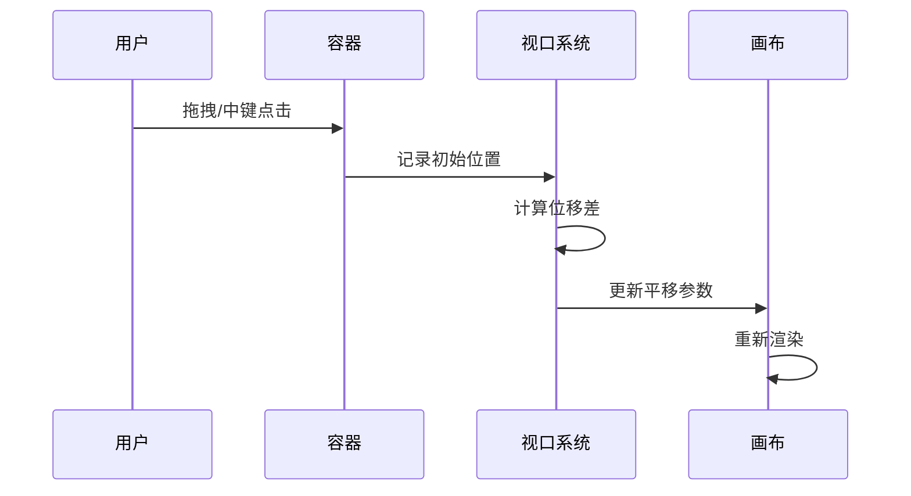

**图表来源**
- [components/MoodBoard.tsx](file://components/MoodBoard.tsx#L243-L248)

**节来源**
- [components/MoodBoard.tsx](file://components/MoodBoard.tsx#L289-L309)
- [components/MoodBoard.tsx](file://components/MoodBoard.tsx#L670-L696)

## 布局优化建议

基于系统现有架构，以下是针对图像布局的优化建议：

### 防止图像溢出画布边界

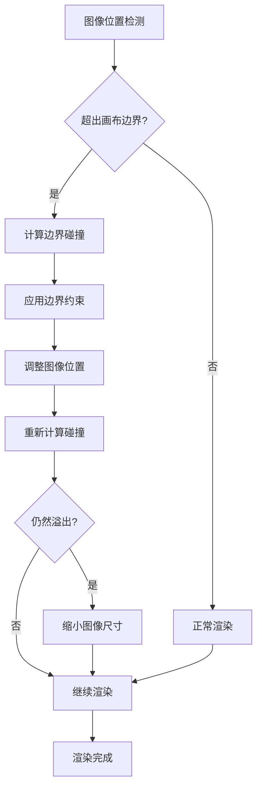

### 自动重排功能设计

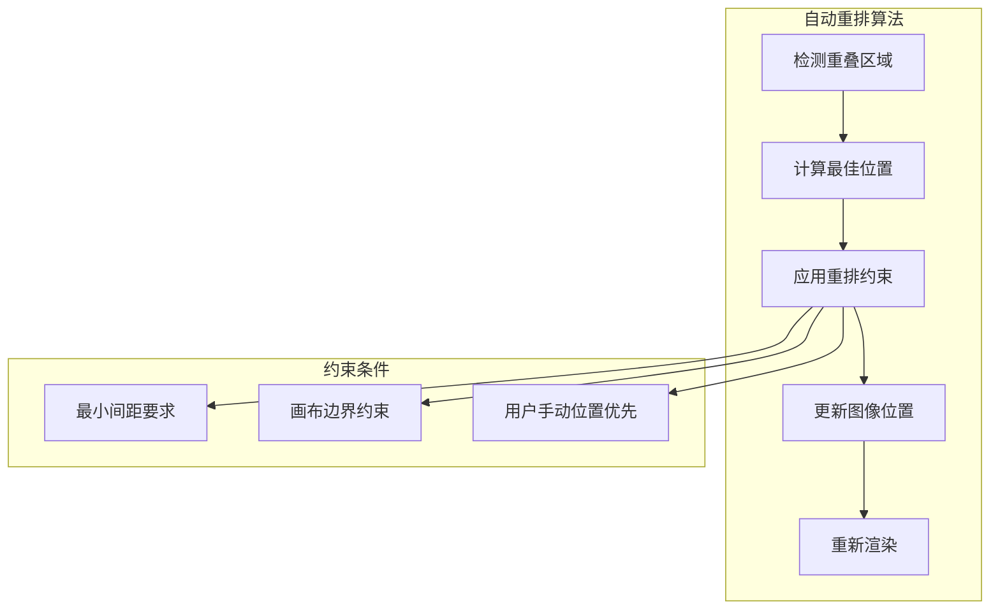

### 性能优化策略

1. **虚拟化渲染**: 只渲染可见区域内的图像
2. **图像缓存**: 缓存已加载的图像资源
3. **批量更新**: 合并多个状态变更
4. **延迟加载**: 对大尺寸图像采用渐进式加载

### 用户体验改进

1. **智能预览**: 提供图像缩略图预览
2. **拖拽排序**: 支持图像层级调整
3. **快速定位**: 提供导航面板
4. **撤销重做**: 实现操作历史记录

**节来源**
- [components/MoodBoard.tsx](file://components/MoodBoard.tsx#L266-L277)
- [components/MoodBoard.tsx](file://components/MoodBoard.tsx#L362-L391)

## 总结

Banana Canvas的MoodBoard图像布局系统是一个功能完整且设计精良的解决方案。它通过以下核心特性实现了高效的图像管理和展示：

### 核心优势

1. **精确的坐标控制**: 通过CanvasImage类型和视口系统实现精确的图像定位
2. **灵活的变换机制**: 支持缩放、平移和旋转变换
3. **美观的堆叠效果**: 通过智能偏移算法实现视觉上的层次感
4. **响应式设计**: 适应不同尺寸的容器和设备
5. **高性能渲染**: 采用双层渲染架构和优化的绘制流程

### 技术亮点

- **无限画布概念**: 固定2048×2048画布配合视口系统
- **实时坐标转换**: 屏幕坐标到画布坐标的高效映射
- **多层渲染架构**: 图像、路径、UI元素的分层处理
- **交互式变换**: 支持鼠标滚轮缩放和拖拽平移

### 应用价值

该布局系统不仅适用于MoodBoard场景，其设计理念和实现方案可以广泛应用于其他需要复杂图像管理的Web应用中，为开发者提供了宝贵的参考和借鉴价值。