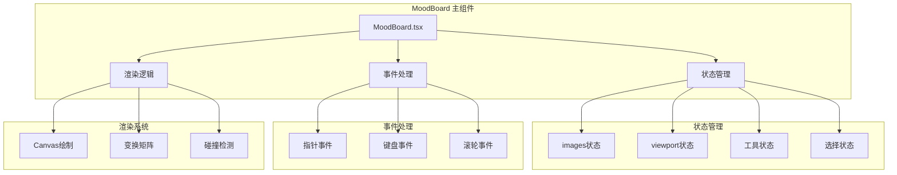
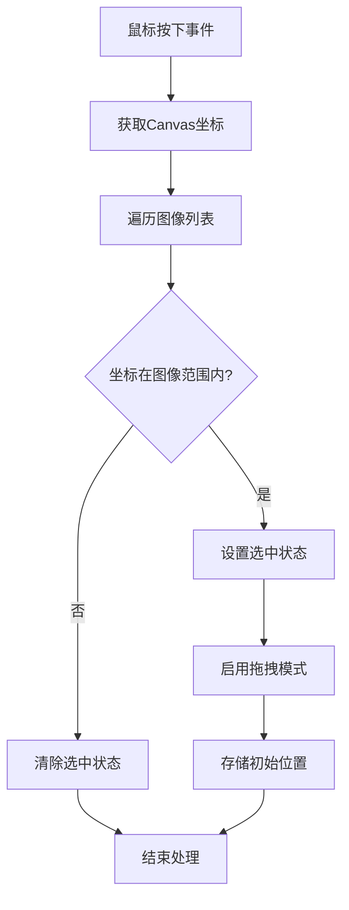
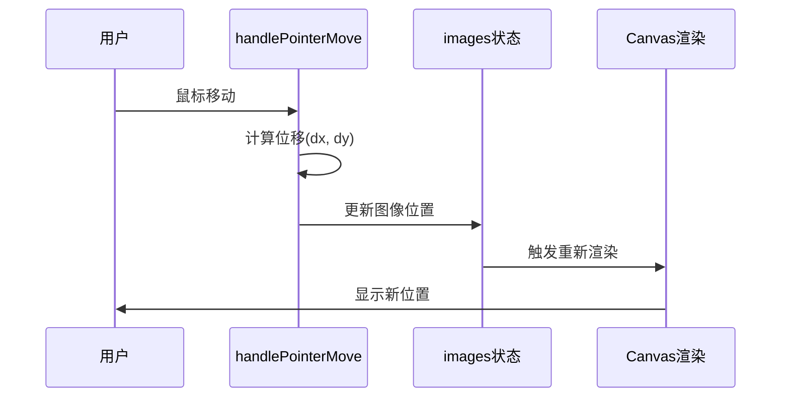
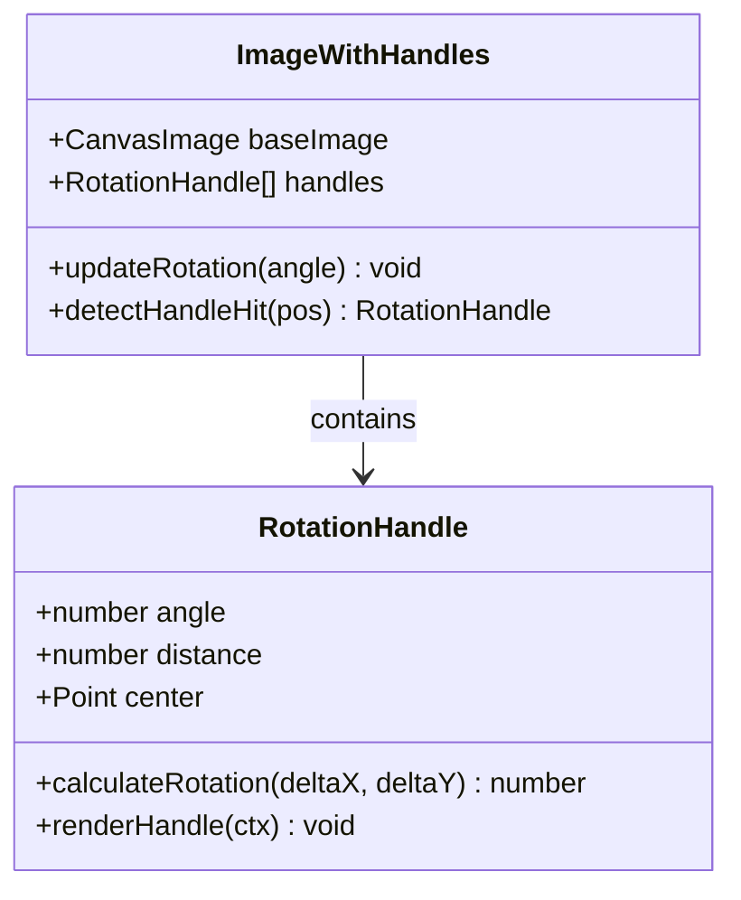
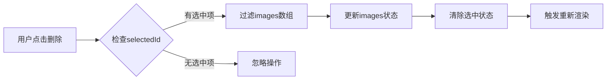
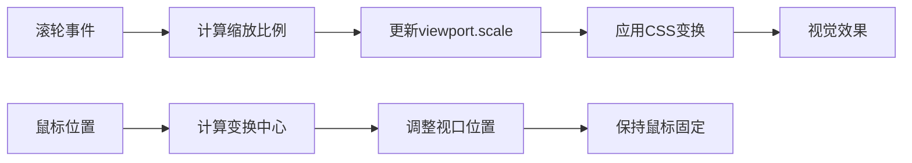
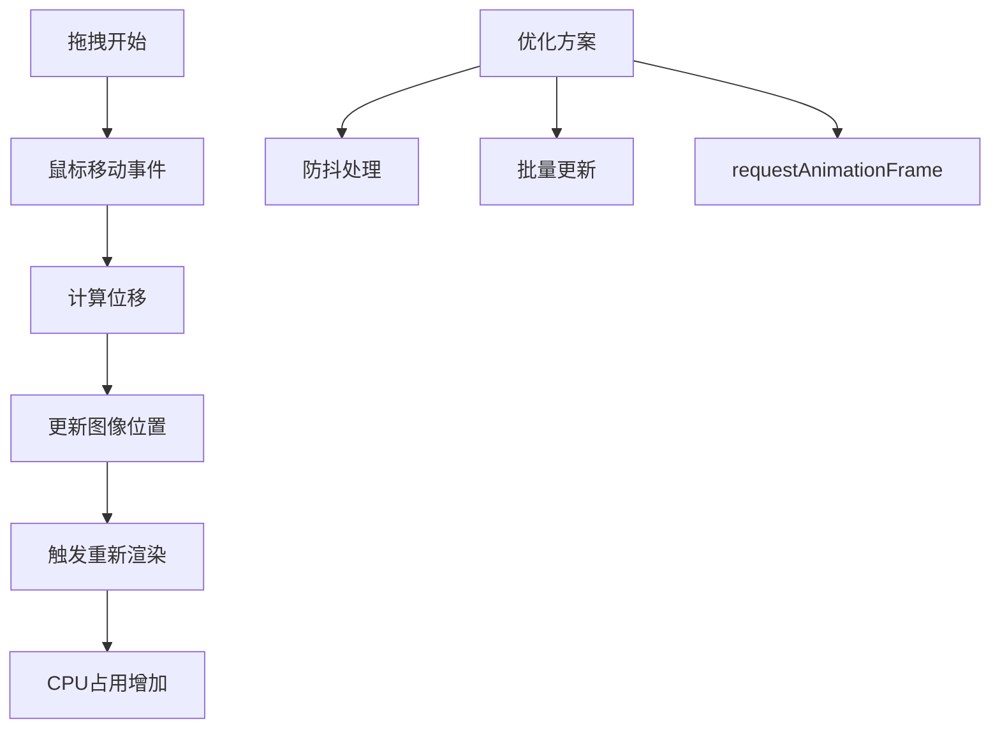
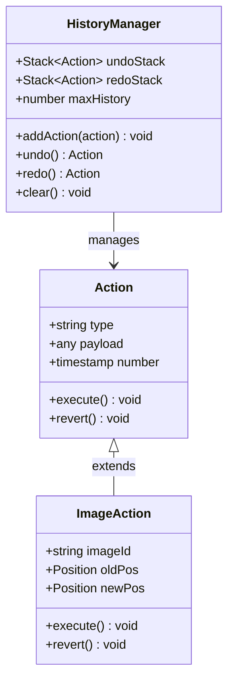

# 图像操作

<cite>
**本文档中引用的文件**
- [MoodBoard.tsx](file://components/MoodBoard.tsx)
- [types.ts](file://types.ts)
- [constants.ts](file://constants.ts)
- [Icons.tsx](file://components/ui/Icons.tsx)
</cite>

## 目录
1. [简介](#简介)
2. [项目架构概览](#项目架构概览)
3. [拖拽移动功能](#拖拽移动功能)
4. [旋转功能现状与实现方案](#旋转功能现状与实现方案)
5. [删除操作](#删除操作)
6. [缩放操作分析](#缩放操作分析)
7. [性能考量](#性能考量)
8. [撤销/重做功能集成建议](#撤销重做功能集成建议)
9. [总结](#总结)

## 简介

MoodBoard是一个基于React的图像编辑工具，提供了丰富的图像交互操作功能。该系统采用Canvas渲染技术，支持图像的拖拽移动、删除、缩放以及画笔绘制等核心功能。本文档将深入分析图像操作的实现机制，包括现有功能的技术细节、性能优化策略以及未来扩展方向。

## 项目架构概览

MoodBoard采用模块化架构设计，主要组件包括：



**图表来源**
- [MoodBoard.tsx](file://components/MoodBoard.tsx#L27-L33)

**章节来源**
- [MoodBoard.tsx](file://components/MoodBoard.tsx#L1-L50)

## 拖拽移动功能

### 功能概述

拖拽移动功能是MoodBoard的核心交互特性之一，允许用户通过鼠标操作精确移动选定的图像。该功能实现了完整的拖拽生命周期，包括命中检测、位移计算和位置更新。

### 技术实现

#### 命中检测机制

拖拽功能的启动依赖于精确的命中检测算法：



**图表来源**
- [MoodBoard.tsx](file://components/MoodBoard.tsx#L236-L249)

命中检测算法通过比较鼠标坐标与图像边界实现：

| 参数 | 类型 | 描述 | 计算方式 |
|------|------|------|----------|
| pos.x | number | 鼠标X坐标 | getCanvasPos()转换后的值 |
| pos.y | number | 鼠标Y坐标 | getCanvasPos()转换后的值 |
| img.x | number | 图像左上角X坐标 | Canvas坐标系中的实际位置 |
| img.y | number | 图像左上角Y坐标 | Canvas坐标系中的实际位置 |
| img.width | number | 图像宽度 | 像素单位 |
| img.height | number | 图像高度 | 像素单位 |

#### 位移计算与位置更新

拖拽过程中的位移计算采用增量更新策略：



**图表来源**
- [MoodBoard.tsx](file://components/MoodBoard.tsx#L277-L288)

位移计算的核心逻辑：

| 步骤 | 操作 | 代码路径 | 性能影响 |
|------|------|----------|----------|
| 1 | 获取当前位置 | `pos = getCanvasPos()` | O(1) |
| 2 | 计算位移量 | `dx = pos.x - lastPos.x` | O(1) |
| 3 | 更新图像位置 | `img.x + dx, img.y + dy` | O(n) |
| 4 | 触发状态更新 | `setImages()` | O(n) |

**章节来源**
- [MoodBoard.tsx](file://components/MoodBoard.tsx#L236-L288)

## 旋转功能现状与实现方案

### 当前状态分析

目前MoodBoard的图像数据结构包含旋转属性，但尚未实现旋转功能。Canvas绘制时已正确应用旋转变换：

```typescript
// 旋转应用代码路径
ctx.translate(img.x + img.width / 2, img.y + img.height / 2);
ctx.rotate(img.rotation * Math.PI / 180);
ctx.drawImage(imageEl, -img.width / 2, -img.height / 2, img.width, img.height);
```

### 实现方案设计

#### 方案一：旋转手柄实现



**图表来源**
- [MoodBoard.tsx](file://components/MoodBoard.tsx#L135-L137)

#### 方案二：快捷键旋转

| 快捷键组合 | 功能 | 实现复杂度 | 用户体验 |
|------------|------|------------|----------|
| Ctrl/Cmd + R | 顺时针旋转90° | 低 | 直观 |
| Shift + Ctrl/Cmd + R | 逆时针旋转90° | 低 | 直观 |
| 数字键1-9 | 设置特定角度 | 中 | 精确控制 |
| 拖拽旋转手柄 | 实时旋转 | 高 | 自由控制 |

#### 方案三：触摸手势旋转

对于移动端支持，可考虑以下手势：
- 单指旋转：双指缩放时的旋转补偿
- 双指旋转：直接旋转操作
- 三指旋转：全局视角旋转

**章节来源**
- [MoodBoard.tsx](file://components/MoodBoard.tsx#L135-L137)
- [types.ts](file://types.ts#L12-L19)

## 删除操作

### 实现机制

删除操作通过过滤images数组实现，保持了简洁高效的设计：



**图表来源**
- [MoodBoard.tsx](file://components/MoodBoard.tsx#L360-L365)

### 删除流程详解

删除操作的完整执行链路：

| 阶段 | 操作 | 时间复杂度 | 错误处理 |
|------|------|------------|----------|
| 1 | 检查选中状态 | O(1) | 无选中时不执行 |
| 2 | 过滤数组 | O(n) | 保持原数组不变性 |
| 3 | 更新状态 | O(n) | React状态更新 |
| 4 | 清除选择 | O(1) | 状态重置 |

### 批量删除功能

系统支持批量删除多个图像的选择：

```typescript
// 批量删除伪代码示例
const handleBatchDelete = (selectedIds: string[]) => {
    setImages(prev => prev.filter(img => !selectedIds.includes(img.id)));
    setSelectedId(null);
};
```

**章节来源**
- [MoodBoard.tsx](file://components/MoodBoard.tsx#L360-L365)

## 缩放操作分析

### 画布缩放 vs 图像缩放

MoodBoard实现了两种不同的缩放机制：

#### 1. 画布视口缩放（Viewport Scale）

这是系统的主要缩放机制，通过CSS变换实现：



**图表来源**
- [MoodBoard.tsx](file://components/MoodBoard.tsx#L301-L319)

#### 2. 图像缩放限制

当前实现中，图像本身不支持独立缩放：

| 缩放类型 | 实现方式 | 支持状态 | 限制说明 |
|----------|----------|----------|----------|
| 画布缩放 | CSS transform | ✅ 完整支持 | 整体视图缩放 |
| 图像缩放 | Canvas drawImage | ❌ 未实现 | 单独图像缩放 |
| 组合缩放 | 混合模式 | ❌ 计划中 | 多图像同时缩放 |

### 缩放性能对比

| 缩放方式 | 性能开销 | 内存使用 | 渲染质量 |
|----------|----------|----------|----------|
| 画布缩放 | 极低 | 极低 | 高（硬件加速） |
| 图像缩放 | 中等 | 中等 | 中等（需要重采样） |
| 混合缩放 | 高 | 高 | 可控（自定义实现） |

**章节来源**
- [MoodBoard.tsx](file://components/MoodBoard.tsx#L301-L319)

## 性能考量

### 频繁状态更新的影响

每次拖拽都会触发`setImages`调用，这对性能有显著影响：



### 性能优化策略

#### 1. requestAnimationFrame优化

当前渲染循环已经使用`requestAnimationFrame`：

```typescript
useEffect(() => {
    let animationFrameId: number;
    const render = () => {
        drawCanvas();
        animationFrameId = requestAnimationFrame(render);
    };
    render();
    return () => cancelAnimationFrame(animationFrameId);
}, [drawCanvas]);
```

#### 2. 拖拽优化建议

| 优化技术 | 实现难度 | 性能提升 | 兼容性 |
|----------|----------|----------|--------|
| 防抖处理 | 低 | 中等 | 良好 |
| 虚拟化 | 中 | 高 | 中等 |
| Web Workers | 高 | 很高 | 较差 |
| GPU加速 | 中 | 高 | 良好 |

#### 3. 内存管理

图像资源的内存管理至关重要：

```typescript
// 图像加载优化
const loadImageOptimized = (src: string) => {
    const img = new Image();
    img.crossOrigin = 'anonymous'; // 避免跨域问题
    img.decoding = 'async'; // 异步解码
    return img;
};
```

### 性能监控指标

| 指标 | 目标值 | 监控方法 | 优化措施 |
|------|--------|----------|----------|
| FPS | >60 | requestAnimationFrame计数 | 减少重绘频率 |
| CPU使用率 | <50% | Performance API | 优化算法复杂度 |
| 内存使用 | <100MB | Memory API | 及时释放资源 |
| 响应延迟 | <16ms | 自定义计时器 | 使用RAF |

**章节来源**
- [MoodBoard.tsx](file://components/MoodBoard.tsx#L178-L187)
- [MoodBoard.tsx](file://components/MoodBoard.tsx#L277-L288)

## 撤销/重做功能集成建议

### 状态历史管理架构



### 实现策略

#### 1. 基础撤销/重做框架

```typescript
interface HistoryAction {
    type: 'image-move' | 'image-delete' | 'image-add' | 'image-scale';
    payload: any;
    timestamp: number;
}

class HistoryManager {
    private undoStack: HistoryAction[] = [];
    private redoStack: HistoryAction[] = [];
    private maxHistory = 100;
    
    addAction(action: HistoryAction) {
        this.undoStack.push(action);
        this.redoStack = []; // 清空重做栈
        
        // 限制历史记录数量
        if (this.undoStack.length > this.maxHistory) {
            this.undoStack.shift();
        }
    }
    
    undo() {
        const action = this.undoStack.pop();
        if (action) {
            this.redoStack.push(action);
            // 执行撤销操作
            this.executeReversed(action);
        }
        return action;
    }
    
    redo() {
        const action = this.redoStack.pop();
        if (action) {
            this.undoStack.push(action);
            // 执行重做操作
            this.executeForward(action);
        }
        return action;
    }
}
```

#### 2. 图像操作历史记录

| 操作类型 | 历史记录格式 | 撤销策略 | 性能影响 |
|----------|--------------|----------|----------|
| 移动 | `{type: 'image-move', id, oldPos, newPos}` | 位置交换 | 低 |
| 删除 | `{type: 'image-delete', id, image, position}` | 图像重建 | 中 |
| 添加 | `{type: 'image-add', id, image, position}` | 图像删除 | 低 |
| 缩放 | `{type: 'image-scale', id, oldScale, newScale}` | 比例恢复 | 低 |

#### 3. 快照机制

对于复杂的批量操作，建议使用快照机制：

```typescript
class SnapshotManager {
    private snapshots: any[] = [];
    private currentIndex = -1;
    
    createSnapshot(state: any) {
        // 截取当前状态
        const snapshot = JSON.parse(JSON.stringify(state));
        this.snapshots = this.snapshots.slice(0, this.currentIndex + 1);
        this.snapshots.push(snapshot);
        this.currentIndex++;
    }
    
    undo() {
        if (this.currentIndex > 0) {
            this.currentIndex--;
            return this.snapshots[this.currentIndex];
        }
        return null;
    }
    
    redo() {
        if (this.currentIndex < this.snapshots.length - 1) {
            this.currentIndex++;
            return this.snapshots[this.currentIndex];
        }
        return null;
    }
}
```

### 用户界面集成

#### 快捷键支持

| 快捷键 | 功能 | 实现位置 | 用户反馈 |
|--------|------|----------|----------|
| Ctrl+Z | 撤销 | 全局事件监听 | 状态栏提示 |
| Ctrl+Y | 重做 | 全局事件监听 | 状态栏提示 |
| Ctrl+Shift+Z | 向前重做 | 全局事件监听 | 状态栏提示 |

#### 界面元素

```typescript
// 撤销按钮组件
const UndoButton = ({ history }: { history: HistoryManager }) => {
    return (
        <button 
            onClick={() => {
                const action = history.undo();
                if (action) {
                    showNotification(`撤销: ${action.type}`);
                }
            }}
            disabled={!history.canUndo()}
        >
            撤销
        </button>
    );
};
```

**章节来源**
- [MoodBoard.tsx](file://components/MoodBoard.tsx#L277-L288)

## 总结

MoodBoard的图像交互操作系统展现了现代Web应用的优秀实践。通过深入分析，我们可以看到：

### 技术亮点

1. **精确的命中检测**：基于Canvas坐标的图像选择机制
2. **高效的渲染循环**：使用`requestAnimationFrame`确保流畅体验
3. **灵活的状态管理**：React状态驱动的响应式设计
4. **良好的扩展性**：模块化架构便于功能扩展

### 改进空间

1. **旋转功能缺失**：需要实现旋转手柄或快捷键支持
2. **性能优化不足**：频繁的状态更新影响大型画板性能
3. **撤销重做机制**：缺乏完善的历史记录管理
4. **移动端支持**：触摸手势和手势识别有待完善

### 发展方向

未来的改进重点应放在：
- 实现完整的图像变换功能（旋转、缩放）
- 优化拖拽性能，减少不必要的重绘
- 建立完善的撤销重做系统
- 增强移动端用户体验
- 提供更多的图像编辑工具

通过持续的功能完善和性能优化，MoodBoard将成为一个功能完备、性能优异的图像编辑平台。