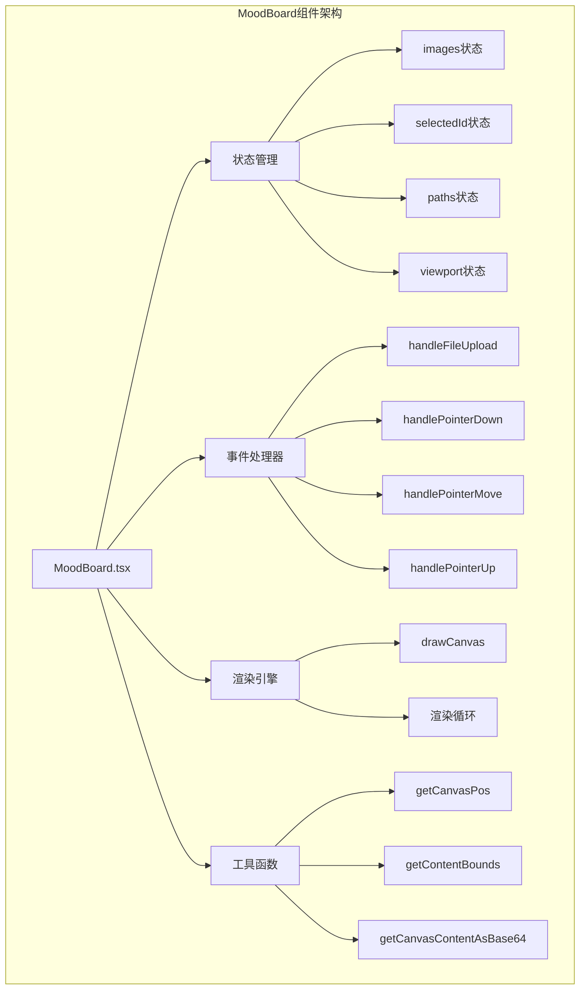
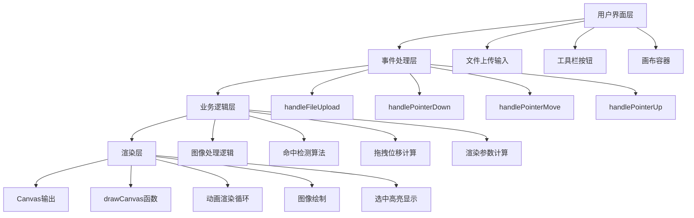
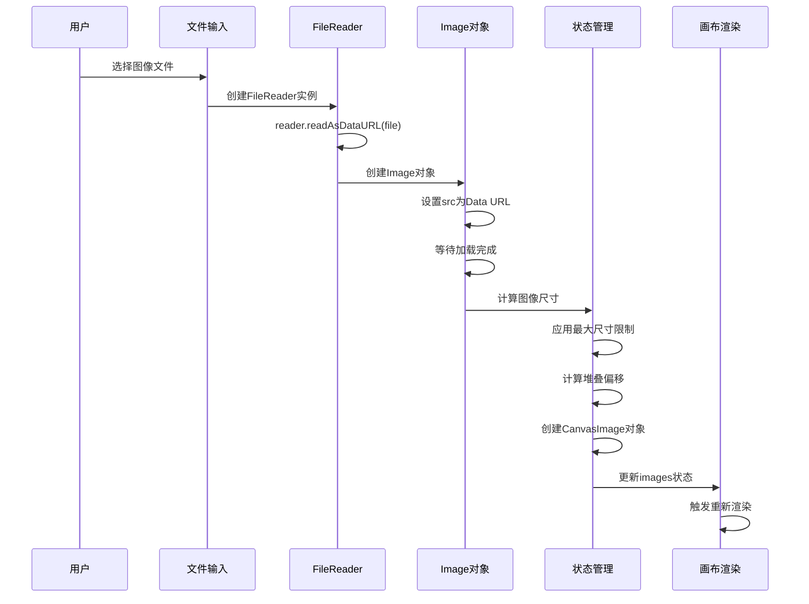
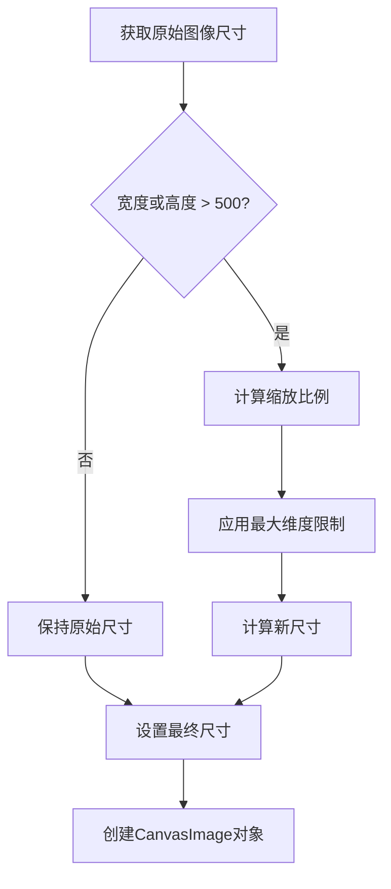
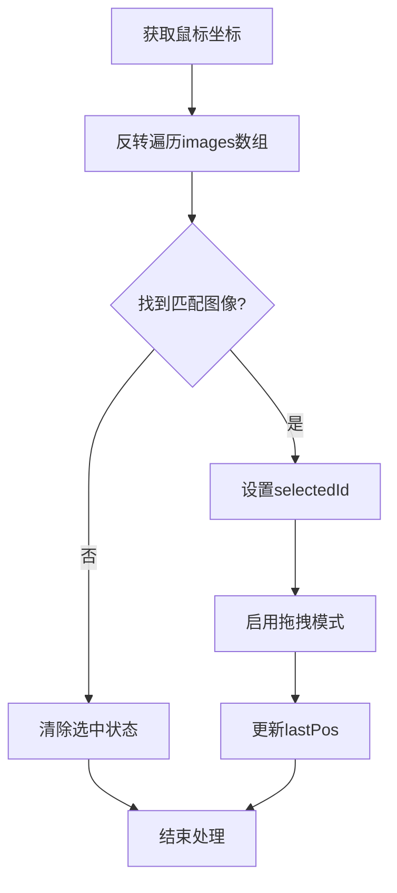
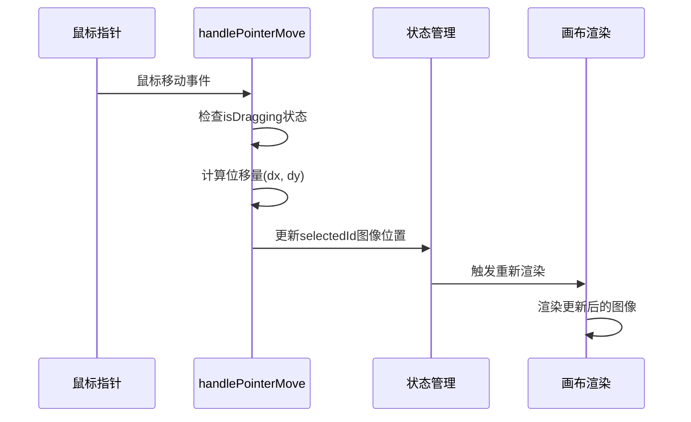
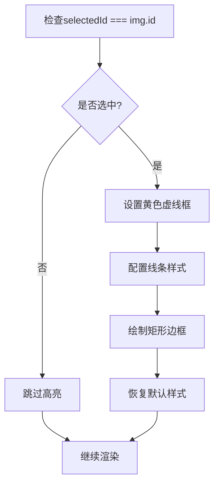
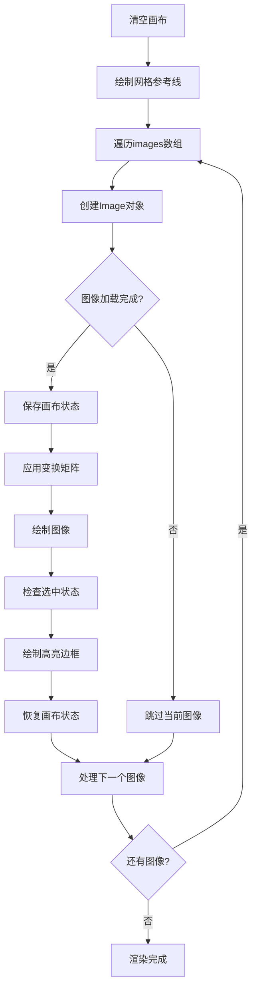
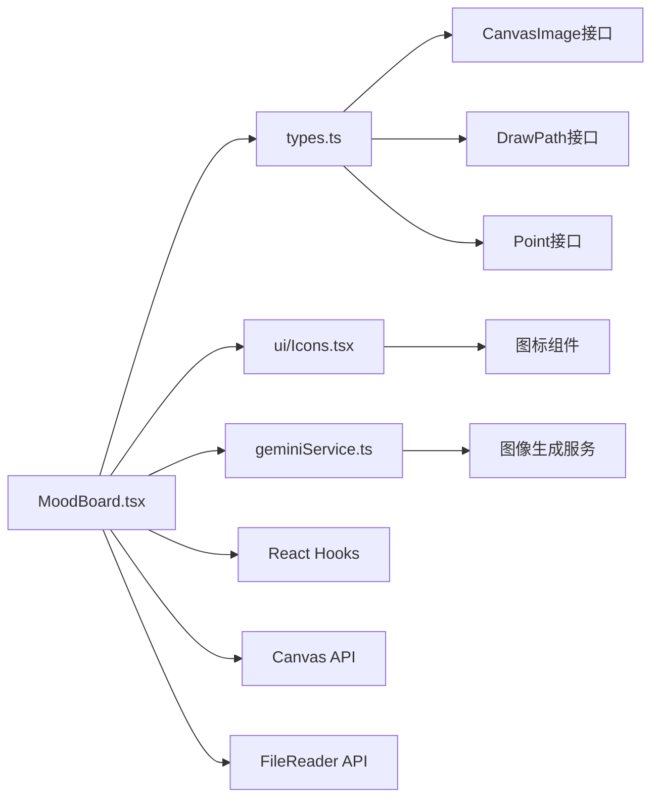

# 图像管理功能

<cite>
**本文档中引用的文件**
- [MoodBoard.tsx](file://components/MoodBoard.tsx)
- [types.ts](file://types.ts)
- [constants.ts](file://constants.ts)
</cite>

## 目录
1. [简介](#简介)
2. [项目结构](#项目结构)
3. [核心组件](#核心组件)
4. [架构概览](#架构概览)
5. [详细组件分析](#详细组件分析)
6. [依赖关系分析](#依赖关系分析)
7. [性能考虑](#性能考虑)
8. [故障排除指南](#故障排除指南)
9. [结论](#结论)

## 简介

MoodBoard组件是BananaCanvase应用的核心图像管理功能模块，提供了完整的图像上传、布局、操作和渲染系统。该组件实现了复杂的图像处理流程，包括文件读取、尺寸调整、位置计算、命中检测和拖拽操作等核心功能。

## 项目结构

MoodBoard组件位于`components/`目录下，采用React函数式组件设计模式。项目整体采用TypeScript类型安全开发，确保代码质量和可维护性。



**图表来源**
- [MoodBoard.tsx](file://components/MoodBoard.tsx#L23-L770)

**章节来源**
- [MoodBoard.tsx](file://components/MoodBoard.tsx#L1-L770)
- [types.ts](file://types.ts#L12-L19)

## 核心组件

### CanvasImage接口定义

CanvasImage是图像数据的核心接口，定义了图像在画布上的完整属性：

| 属性名 | 类型 | 描述 | 默认值 |
|--------|------|------|--------|
| id | string | 唯一标识符 | 自动生成 |
| src | string | 图像数据URL | 文件读取后生成 |
| x | number | 水平位置坐标 | 计算得出 |
| y | number | 垂直位置坐标 | 计算得出 |
| width | number | 图像宽度 | 尺寸调整后 |
| height | number | 图像高度 | 尺寸调整后 |
| rotation | number | 旋转角度（度） | 0 |

### 状态管理系统

MoodBoard组件维护多个关键状态：

- **images**: 存储所有CanvasImage对象的数组
- **selectedId**: 当前选中图像的唯一标识符
- **paths**: 绘制路径集合，用于遮罩编辑
- **viewport**: 视口变换状态（平移和缩放）

**章节来源**
- [MoodBoard.tsx](file://components/MoodBoard.tsx#L25-L38)
- [types.ts](file://types.ts#L12-L19)

## 架构概览

MoodBoard组件采用分层架构设计，将功能划分为清晰的层次：



**图表来源**
- [MoodBoard.tsx](file://components/MoodBoard.tsx#L309-L345)
- [MoodBoard.tsx](file://components/MoodBoard.tsx#L197-L276)

## 详细组件分析

### handleFileUpload函数详解

handleFileUpload是图像上传的核心处理函数，实现了完整的文件处理流程：



**图表来源**
- [MoodBoard.tsx](file://components/MoodBoard.tsx#L310-L344)

#### 文件读取与Data URL转换

函数首先检查文件是否存在，然后为每个文件创建FileReader实例。使用`reader.readAsDataURL(file)`方法将文件转换为Data URL格式，这是浏览器中存储图像数据的标准方式。

#### 图像尺寸处理逻辑



**图表来源**
- [MoodBoard.tsx](file://components/MoodBoard.tsx#L321-L328)

#### 初始位置计算

图像采用居中布局策略，同时应用堆叠偏移效果：
- **水平位置**: `(CANVAS_WIDTH / 2 - w/2) + offset`
- **垂直位置**: `(CANVAS_HEIGHT / 2 - h/2) + offset`
- **堆叠偏移**: `index * 40`像素，确保多图像时有适当的重叠效果

**章节来源**
- [MoodBoard.tsx](file://components/MoodBoard.tsx#L310-L344)

### 命中检测算法（Hit Detection）

handlePointerDown中的命中检测算法实现了精确的图像选择功能：



**图表来源**
- [MoodBoard.tsx](file://components/MoodBoard.tsx#L223-L237)

#### 反向遍历算法

命中检测采用反向遍历images数组的策略，确保最上层的图像优先被选中。算法使用简单的矩形碰撞检测：

```typescript
const hit = [...images].reverse().find(img => 
  pos.x >= img.x && pos.x <= img.x + img.width &&
  pos.y >= img.y && pos.y <= img.y + img.height
);
```

这种实现方式的优势：
- **视觉一致性**: 最上层的图像总是优先响应
- **性能优化**: 避免不必要的遍历整个数组
- **简单可靠**: 基于矩形的碰撞检测算法稳定高效

**章节来源**
- [MoodBoard.tsx](file://components/MoodBoard.tsx#L223-L237)

### 图像拖拽操作实现

图像拖拽功能通过handlePointerMove函数实现，支持实时位移计算：



**图表来源**
- [MoodBoard.tsx](file://components/MoodBoard.tsx#L264-L275)

#### 位移量计算

拖拽过程中的位移量通过以下公式计算：

```typescript
const dx = pos.x - lastPos.current.x;
const dy = pos.y - lastPos.current.y;
```

然后应用到选中图像的位置更新：

```typescript
setImages(prev => prev.map(img => {
  if (img.id === selectedId) {
    return { ...img, x: img.x + dx, y: img.y + dy };
  }
  return img;
}));
```

#### 实时更新机制

拖拽过程中，lastPos会不断更新以反映最新的鼠标位置，确保拖拽体验的流畅性。

**章节来源**
- [MoodBoard.tsx](file://components/MoodBoard.tsx#L264-L275)

### 选中视觉反馈系统

选中状态通过selectedId控制，实现视觉高亮效果：



**图表来源**
- [MoodBoard.tsx](file://components/MoodBoard.tsx#L126-L133)

#### 高亮样式配置

选中图像的视觉反馈使用以下配置：
- **颜色**: `#f59e0b` (香蕉主题色)
- **线宽**: 4像素
- **虚线模式**: `[10, 10]`像素的虚线间隔
- **透明度**: 保留原有图像内容可见性

**章节来源**
- [MoodBoard.tsx](file://components/MoodBoard.tsx#L126-L133)

### 图像渲染引擎

drawCanvas函数负责完整的图像渲染流程：



**图表来源**
- [MoodBoard.tsx](file://components/MoodBoard.tsx#L97-L136)

#### 性能优化策略

渲染引擎采用了多项性能优化措施：

1. **条件渲染**: 只有当图像完全加载且尺寸有效时才进行绘制
2. **状态保存/恢复**: 使用`ctx.save()`和`ctx.restore()`避免样式污染
3. **变换矩阵**: 通过`translate`和`rotate`实现高效的几何变换
4. **动画循环**: 使用`requestAnimationFrame`实现流畅的动画效果

**章节来源**
- [MoodBoard.tsx](file://components/MoodBoard.tsx#L97-L136)

## 依赖关系分析

MoodBoard组件与项目其他部分存在明确的依赖关系：



**图表来源**
- [MoodBoard.tsx](file://components/MoodBoard.tsx#L1-L14)
- [types.ts](file://types.ts#L12-L19)

### 外部依赖

- **React生态系统**: 使用useState、useRef、useEffect、useCallback等Hooks
- **Canvas API**: 直接操作HTML5 Canvas元素
- **FileReader API**: 处理本地文件读取
- **DOM API**: 操作DOM元素和事件处理

**章节来源**
- [MoodBoard.tsx](file://components/MoodBoard.tsx#L1-L14)

## 性能考虑

### 图像缓存策略

虽然当前实现没有显式的图像缓存，但可以通过以下方式优化：

1. **Data URL缓存**: 将已处理的Data URL存储在内存中
2. **预加载机制**: 对频繁使用的图像进行预加载
3. **懒加载**: 对大量图像采用懒加载策略

### 内存管理

- **及时释放**: 在组件卸载时清理Canvas上下文
- **状态优化**: 使用useCallback优化回调函数
- **渲染节流**: 通过requestAnimationFrame控制渲染频率

### 渲染性能

- **批量更新**: 使用React的批处理机制减少重渲染
- **虚拟化**: 对大量图像采用虚拟化技术
- **LOD系统**: 根据缩放级别调整图像细节

## 故障排除指南

### 常见问题及解决方案

#### 图像无法显示
- **原因**: 图像加载失败或Data URL格式错误
- **解决方案**: 检查文件格式和网络连接，添加错误处理逻辑

#### 拖拽不流畅
- **原因**: 频繁的状态更新导致性能问题
- **解决方案**: 使用防抖动技术或优化状态更新逻辑

#### 命中检测失效
- **原因**: 坐标转换错误或边界计算问题
- **解决方案**: 验证getCanvasPos函数的坐标转换逻辑

**章节来源**
- [MoodBoard.tsx](file://components/MoodBoard.tsx#L318-L340)
- [MoodBoard.tsx](file://components/MoodBoard.tsx#L71-L82)

## 结论

MoodBoard组件的图像管理功能展现了现代Web应用中复杂UI组件的设计精髓。通过精心设计的架构和优化的算法，实现了流畅的用户体验和高效的性能表现。

### 关键特性总结

1. **完整的文件处理流程**: 从文件选择到Canvas渲染的端到端解决方案
2. **智能布局算法**: 自动化的图像排列和尺寸调整
3. **精确的交互控制**: 命中检测和拖拽操作的完美结合
4. **优雅的视觉反馈**: 选中状态的直观视觉指示
5. **高性能渲染引擎**: 基于Canvas的高效图像渲染

### 技术亮点

- **函数式编程范式**: 充分利用React Hooks实现状态管理
- **事件驱动架构**: 响应式的用户交互处理
- **性能优化策略**: 多层次的性能优化措施
- **类型安全设计**: TypeScript提供的编译时类型检查

这个组件不仅是一个功能完整的图像管理工具，更是现代前端开发最佳实践的典型代表，为类似项目的开发提供了宝贵的参考价值。