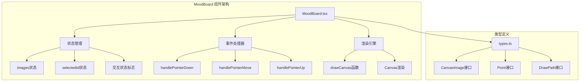
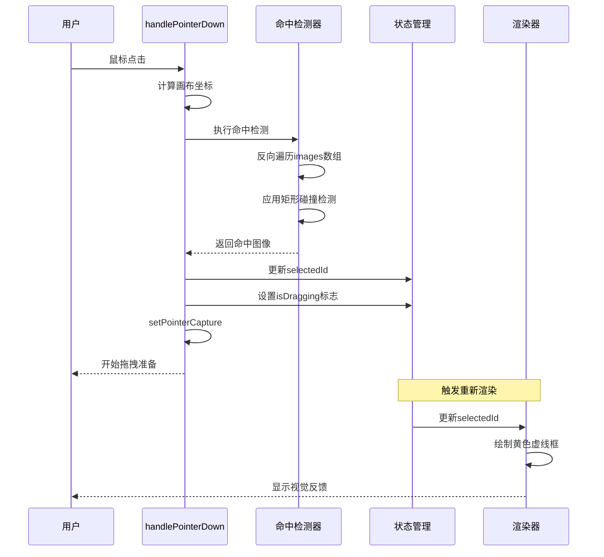
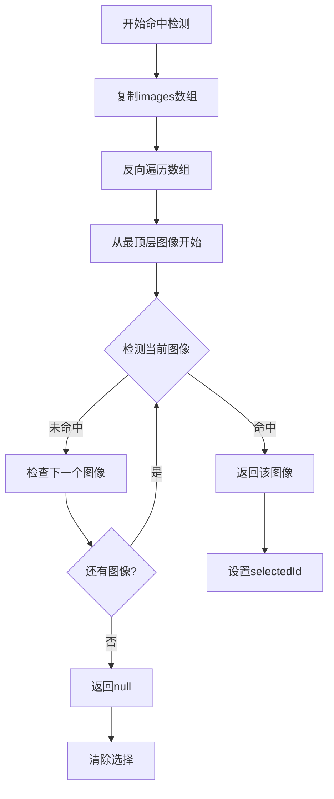
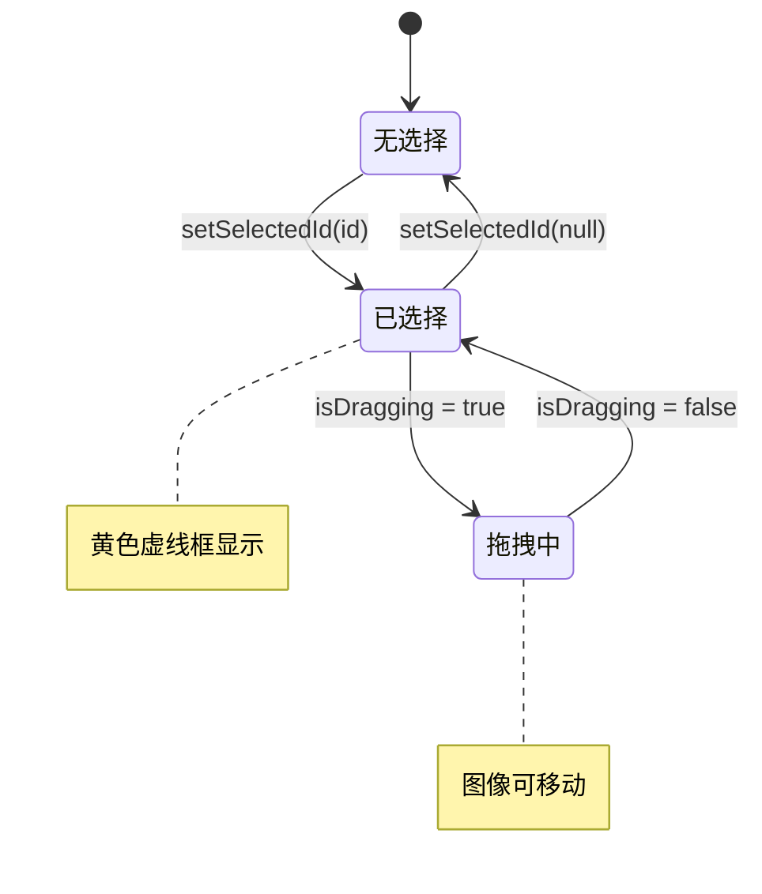
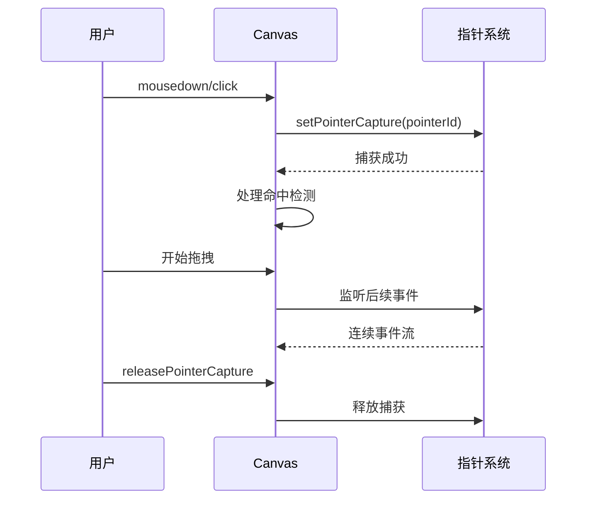
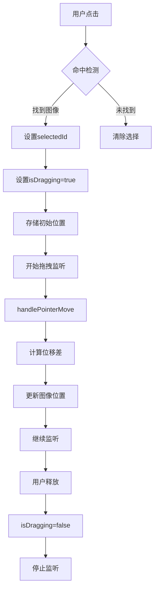

# 图像选择机制深度解析

<cite>
**本文档引用的文件**
- [MoodBoard.tsx](file://components/MoodBoard.tsx)
- [types.ts](file://types.ts)
- [constants.ts](file://constants.ts)
</cite>

## 目录
1. [简介](#简介)
2. [项目结构概览](#项目结构概览)
3. [核心数据结构](#核心数据结构)
4. [图像选择机制架构](#图像选择机制架构)
5. [命中检测算法详解](#命中检测算法详解)
6. [状态管理与UI反馈](#状态管理与ui反馈)
7. [指针事件处理机制](#指针事件处理机制)
8. [拖拽操作实现](#拖拽操作实现)
9. [多选功能扩展思路](#多选功能扩展思路)
10. [触屏设备适配建议](#触屏设备适配建议)
11. [性能优化考虑](#性能优化考虑)
12. [总结](#总结)

## 简介

MoodBoard组件是一个基于React的图像编辑器，实现了复杂的图像选择和拖拽机制。该系统通过精心设计的命中检测算法、状态管理和指针事件处理，提供了直观且响应式的用户体验。本文档将深入分析其中的图像选择机制，重点关注`handlePointerDown`事件中的命中检测算法、selectedId状态管理以及相关的UI反馈机制。

## 项目结构概览

MoodBoard组件位于`components/MoodBoard.tsx`，是整个应用的核心交互组件。它采用现代React Hooks模式，结合Canvas API实现高性能的图像编辑功能。



**图表来源**
- [MoodBoard.tsx](file://components/MoodBoard.tsx#L1-L50)
- [types.ts](file://types.ts#L12-L34)

**章节来源**
- [MoodBoard.tsx](file://components/MoodBoard.tsx#L1-L814)
- [types.ts](file://types.ts#L1-L61)

## 核心数据结构

### CanvasImage 接口

图像在系统中以`CanvasImage`对象的形式存在，包含完整的定位和变换信息：

| 属性 | 类型 | 描述 |
|------|------|------|
| id | string | 唯一标识符 |
| src | string | 图像源URL |
| x | number | 水平位置坐标 |
| y | number | 垂直位置坐标 |
| width | number | 图像宽度 |
| height | number | 图像高度 |
| rotation | number | 旋转角度（度） |

### Point 接口

用于表示画布上的点，支持压感信息：

| 属性 | 类型 | 描述 |
|------|------|------|
| x | number | X坐标 |
| y | number | Y坐标 |
| pressure | number | 压感值（0-1） |

### DrawPath 接口

路径数据结构，支持颜色和提示信息：

| 属性 | 类型 | 描述 |
|------|------|------|
| id | string | 路径唯一标识 |
| points | Point[] | 路径点集合 |
| color | string | 路径颜色 |
| width | number | 路径宽度 |
| prompt | string? | 编辑提示 |

**章节来源**
- [types.ts](file://types.ts#L12-L34)

## 图像选择机制架构

图像选择机制采用分层架构设计，从事件捕获到状态更新再到视觉反馈，形成了完整的交互链路。



**图表来源**
- [MoodBoard.tsx](file://components/MoodBoard.tsx#L211-L250)
- [MoodBoard.tsx](file://components/MoodBoard.tsx#L110-L176)

## 命中检测算法详解

### 核心算法实现

命中检测是图像选择机制的核心，其实现位于`handlePointerDown`函数中：

```typescript
// 命中检测核心逻辑
const hit = [...images].reverse().find(img => 
  pos.x >= img.x && pos.x <= img.x + img.width &&
  pos.y >= img.y && pos.y <= img.y + img.height
);
```

### 反向遍历的重要性

算法使用`[...images].reverse()`进行反向遍历，这是确保正确图层优先级的关键：



**图表来源**
- [MoodBoard.tsx](file://components/MoodBoard.tsx#L236-L240)

### 矩形碰撞检测条件

碰撞检测使用严格的矩形相交测试：

| 条件 | 含义 | 实现 |
|------|------|------|
| `pos.x >= img.x` | 点在图像左边界右侧 | 水平位置约束 |
| `pos.x <= img.x + img.width` | 点在图像右边界左侧 | 水平位置约束 |
| `pos.y >= img.y` | 点在图像上边界下方 | 垂直位置约束 |
| `pos.y <= img.y + img.height` | 点在图像下边界上方 | 垂直位置约束 |

这种四重条件确保只有完全包含在图像边界内的点才会被选中，避免了边缘误判的问题。

**章节来源**
- [MoodBoard.tsx](file://components/MoodBoard.tsx#L236-L240)

## 状态管理与UI反馈

### selectedId 状态的作用

`selectedId`是图像选择状态的核心，它维护着当前选中图像的唯一标识：

```typescript
const [selectedId, setSelectedId] = useState<string | null>(null);
```

### UI视觉反馈机制

当选中图像时，`drawCanvas`函数会绘制黄色虚线框作为视觉反馈：

```typescript
// 选择高亮绘制逻辑
if (selectedId === img.id) {
  ctx.strokeStyle = '#f59e0b'; // banana-500
  ctx.lineWidth = 4;
  ctx.setLineDash([10, 10]);
  ctx.strokeRect(-img.width / 2, -img.height / 2, img.width, img.height);
  ctx.setLineDash([]);
}
```

### 状态联动机制

selectedId状态与多个UI元素形成联动：



**图表来源**
- [MoodBoard.tsx](file://components/MoodBoard.tsx#L140-L146)
- [MoodBoard.tsx](file://components/MoodBoard.tsx#L360-L365)

**章节来源**
- [MoodBoard.tsx](file://components/MoodBoard.tsx#L38-L39)
- [MoodBoard.tsx](file://components/MoodBoard.tsx#L140-L146)

## 指针事件处理机制

### Pointer Events API 的使用

系统全面采用Pointer Events API替代传统的Mouse Events，提供更好的跨平台兼容性：

```typescript
// 设置指针捕获确保连续性
canvasRef.current?.setPointerCapture(e.pointerId);
containerRef.current?.setPointerCapture(e.pointerId);
```

### setPointerCapture 的作用

`setPointerCapture`确保拖拽操作的连续性：



**图表来源**
- [MoodBoard.tsx](file://components/MoodBoard.tsx#L246-L247)
- [MoodBoard.tsx](file://components/MoodBoard.tsx#L296-L297)

### 事件处理流程

指针事件处理遵循严格的流程控制：

| 阶段 | 处理内容 | 相关状态 |
|------|----------|----------|
| PointerDown | 坐标转换、工具检查 | tool, viewport |
| 命中检测 | 反向遍历、矩形检测 | images, selectedId |
| 状态更新 | 设置选择、启动拖拽 | isDragging, lastPos |
| 指针捕获 | 确保连续事件 | pointerCapture |

**章节来源**
- [MoodBoard.tsx](file://components/MoodBoard.tsx#L211-L250)
- [MoodBoard.tsx](file://components/MoodBoard.tsx#L291-L297)

## 拖拽操作实现

### isDragging 标志位的作用

`isDragging`是一个关键的状态标志，控制拖拽操作的生命周期：

```typescript
// 拖拽开始
if (hit) {
  setSelectedId(hit.id);
  isDragging.current = true;
  lastPos.current = { x: pos.x, y: pos.y };
  canvasRef.current?.setPointerCapture(e.pointerId);
}

// 拖拽结束
const handlePointerUp = (e: React.PointerEvent) => {
  isDrawing.current = false;
  isDragging.current = false;
  isPanning.current = false;
  lastPoint.current = null;
  canvasRef.current?.releasePointerCapture(e.pointerId);
  containerRef.current?.releasePointerCapture(e.pointerId);
};
```

### 拖拽计算逻辑

拖拽过程中的位置计算：

```typescript
const dx = pos.x - lastPos.current.x;
const dy = pos.y - lastPos.current.y;

setImages(prev => prev.map(img => {
  if (img.id === selectedId) {
    return { ...img, x: img.x + dx, y: img.y + dy };
  }
  return img;
}));
```

### 拖拽与选择状态的联动



**图表来源**
- [MoodBoard.tsx](file://components/MoodBoard.tsx#L242-L249)
- [MoodBoard.tsx](file://components/MoodBoard.tsx#L277-L288)

**章节来源**
- [MoodBoard.tsx](file://components/MoodBoard.tsx#L48-L54)
- [MoodBoard.tsx](file://components/MoodBoard.tsx#L277-L288)

## 多选功能扩展思路

### 设计多选机制

要实现多选功能，需要对现有架构进行以下扩展：

```typescript
// 扩展状态定义
const [selectedIds, setSelectedIds] = useState<string[]>([]);
const [isMultiSelecting, setIsMultiSelecting] = useState(false);

// 添加Ctrl/Cmd键检测
const handleKeyDown = (e: KeyboardEvent) => {
  if (e.ctrlKey || e.metaKey) {
    setIsMultiSelecting(true);
  }
};

const handleKeyUp = (e: KeyboardEvent) => {
  if (!e.ctrlKey && !e.metaKey) {
    setIsMultiSelecting(false);
  }
};
```

### 多选命中检测算法

```typescript
// 多选命中检测
const hits = images.filter(img => 
  pos.x >= img.x && pos.x <= img.x + img.width &&
  pos.y >= img.y && pos.y <= img.y + img.height
);

if (hits.length > 0) {
  if (isMultiSelecting) {
    // 添加到选择集或从选择集中移除
    setSelectedIds(prev => {
      const hitIds = hits.map(h => h.id);
      const newSelection = prev.includes(hitIds[0]) 
        ? prev.filter(id => !hitIds.includes(id))
        : [...prev, ...hitIds];
      return newSelection;
    });
  } else {
    // 单选行为
    setSelectedIds([hits[0].id]);
  }
}
```

### 多选UI反馈

```typescript
// 多选高亮绘制
images.forEach(img => {
  if (selectedIds.includes(img.id)) {
    ctx.strokeStyle = '#f59e0b';
    ctx.lineWidth = 4;
    ctx.setLineDash([10, 10]);
    ctx.strokeRect(-img.width / 2, -img.height / 2, img.width, img.height);
    ctx.setLineDash([]);
  }
});
```

## 触屏设备适配建议

### 触摸事件映射

为触屏设备提供更好的支持：

```typescript
// 触摸事件处理
const handleTouchStart = (e: React.TouchEvent) => {
  const touch = e.touches[0];
  const pos = getCanvasPos(touch.clientX, touch.clientY);
  
  // 触屏设备默认启用拖拽
  const hit = [...images].reverse().find(img => 
    pos.x >= img.x && pos.x <= img.x + img.width &&
    pos.y >= img.y && pos.y <= img.y + img.height
  );
  
  if (hit) {
    setSelectedId(hit.id);
    isDragging.current = true;
    lastPos.current = { x: pos.x, y: pos.y };
  }
};

const handleTouchMove = (e: React.TouchEvent) => {
  e.preventDefault();
  const touch = e.touches[0];
  const pos = getCanvasPos(touch.clientX, touch.clientY);
  
  if (isDragging.current && selectedId) {
    const dx = pos.x - lastPos.current.x;
    const dy = pos.y - lastPos.current.y;
    
    setImages(prev => prev.map(img => {
      if (img.id === selectedId) {
        return { ...img, x: img.x + dx, y: img.y + dy };
      }
      return img;
    }));
    lastPos.current = pos;
  }
};
```

### 触屏优化策略

| 优化项 | 实现方式 | 效果 |
|--------|----------|------|
| 防抖处理 | 使用setTimeout延迟处理 | 避免频繁重绘 |
| 触摸区域放大 | 增加hit检测的容差 | 提升触摸精度 |
| 双指缩放 | 监听touchstart/touchmove | 支持缩放功能 |
| 长按菜单 | 触摸长按触发上下文菜单 | 提供更多操作选项 |

### 响应式设计考虑

```typescript
// 设备检测和适配
const isMobileDevice = () => {
  return /Android|iPhone|iPad|iPod|BlackBerry|IEMobile|Opera Mini/i.test(navigator.userAgent);
};

const TOUCH_SENSITIVITY = isMobileDevice() ? 10 : 5;

// 在命中检测中应用设备特定的容差
const hit = [...images].reverse().find(img => {
  const tolerance = TOUCH_SENSITIVITY;
  return (
    pos.x >= img.x - tolerance && pos.x <= img.x + img.width + tolerance &&
    pos.y >= img.y - tolerance && pos.y <= img.y + img.height + tolerance
  );
});
```

## 性能优化考虑

### 命中检测优化

对于大量图像的情况，可以采用空间索引优化：

```typescript
// R-Tree 或 Quadtree 实现
class SpatialIndex {
  private root: TreeNode;
  
  insert(image: CanvasImage) {
    // 实现空间索引插入
  }
  
  query(rect: {x: number, y: number, width: number, height: number}): CanvasImage[] {
    // 实现范围查询
    return [];
  }
}

// 使用空间索引优化命中检测
const hits = spatialIndex.query({
  x: pos.x - 5,  // 容差范围
  y: pos.y - 5,
  width: 10,
  height: 10
});
```

### 渲染性能优化

```typescript
// 使用requestAnimationFrame优化渲染
useEffect(() => {
  let animationFrameId: number;
  const render = () => {
    drawCanvas();
    animationFrameId = requestAnimationFrame(render);
  };
  render();
  return () => cancelAnimationFrame(animationFrameId);
}, [drawCanvas]);

// 图像缓存机制
const imageCache = new Map<string, HTMLImageElement>();

const getCachedImage = (src: string): HTMLImageElement => {
  if (!imageCache.has(src)) {
    const img = new Image();
    img.src = src;
    imageCache.set(src, img);
  }
  return imageCache.get(src)!;
};
```

### 内存管理

```typescript
// 清理不需要的图像资源
useEffect(() => {
  const cleanup = () => {
    // 清理过期的图像缓存
    imageCache.clear();
  };
  
  return cleanup;
}, []);
```

## 总结

MoodBoard组件的图像选择机制展现了现代Web应用中复杂交互设计的最佳实践。通过精心设计的命中检测算法、完善的状态管理系统和高效的指针事件处理，系统实现了流畅且直观的用户体验。

### 关键技术亮点

1. **智能命中检测**：通过反向遍历确保正确的图层优先级
2. **精确碰撞检测**：严格的矩形相交测试避免误判
3. **状态驱动的UI反馈**：selectedId状态与视觉效果的完美联动
4. **指针事件的完整性**：setPointerCapture确保拖拽操作的连续性
5. **可扩展的架构设计**：为多选和触屏支持预留了良好的扩展基础

### 设计原则

- **用户体验优先**：直观的选择机制和即时的视觉反馈
- **性能导向**：高效的算法和优化的渲染策略
- **跨平台兼容**：统一的事件处理和设备适配
- **可维护性**：清晰的代码结构和模块化设计

这套图像选择机制不仅满足了当前的功能需求，更为未来的功能扩展奠定了坚实的基础，是现代Web图形应用开发的优秀范例。