# 情绪板组件

<cite>
**本文档中引用的文件**
- [MoodBoard.tsx](file://components/MoodBoard.tsx) - *新增分辨率和宽高比选择功能*
- [types.ts](file://types.ts) - *定义了ImageSize和AspectRatio类型*
- [constants.ts](file://constants.ts) - *包含分辨率选项和宽高比配置*
- [App.tsx](file://App.tsx)
- [geminiService.ts](file://services/geminiService.ts)
- [Icons.tsx](file://components/ui/Icons.tsx)
- [index.html](file://index.html)
- [package.json](file://package.json)
</cite>

## 更新摘要
**变更内容**
- 新增了针对Google服务商不支持自定义分辨率和宽高比的警告提示
- 更新了分辨率与宽高比选择功能章节，增加服务商兼容性说明
- 在文档中强调了切换到AIHubMix服务商以使用高级功能的重要性
- 保持了原有文档结构和技术细节的完整性

**新增章节**
- 无

**更新的章节**
- 分辨率与宽高比选择功能

**来源跟踪系统更新**
- 更新了受影响章节的来源标注
- 保持了原有的文件引用系统

## 目录
1. [项目概述](#项目概述)
2. [架构概览](#架构概览)
3. [核心组件分析](#核心组件分析)
4. [无限画布系统](#无限画布系统)
5. [多图层管理机制](#多图层管理机制)
6. [注释绘制系统](#注释绘制系统)
7. [双模式图像导出](#双模式图像导出)
8. [性能优化策略](#性能优化策略)
9. [交互逻辑详解](#交互逻辑详解)
10. [分辨率与宽高比选择功能](#分辨率与宽高比选择功能)
11. [最佳实践指南](#最佳实践指南)
12. [总结](#总结)

## 项目概述

Banana Canvas AI的情绪板组件是一个基于React和HTML5 Canvas的高级图像编辑平台，专为AI驱动的图像编辑而设计。该组件提供了强大的无限画布功能、多图层管理、智能注释系统和高效的AI集成能力。

### 核心特性
- **无限画布系统**：支持任意大小的画布空间，通过视口变换实现平滑缩放和平移
- **多图层管理**：支持多个参考图像的自由布局和编辑
- **智能注释系统**：创新的压力感应笔触记录和AI可理解的编辑指令
- **双模式导出**：源图像模式和蒙版模式的智能组合
- **高性能渲染**：基于requestAnimationFrame的优化渲染循环
- **分辨率与宽高比选择**：新增的图像生成参数配置功能

## 架构概览

情绪板组件采用模块化架构设计，主要由以下核心模块组成：

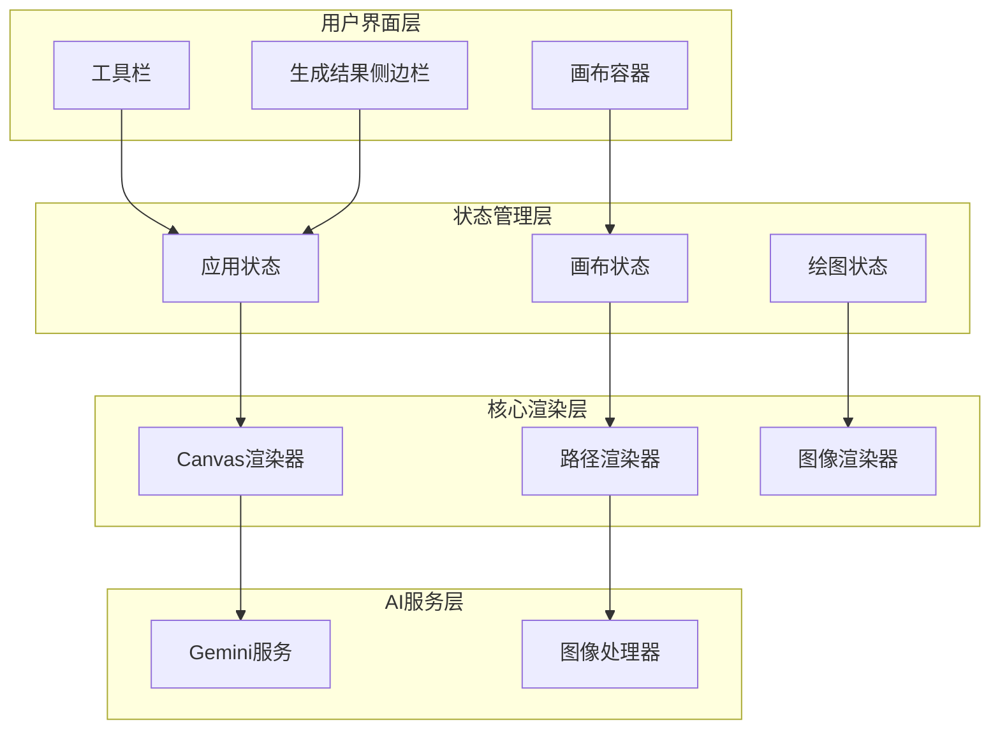

**图表来源**
- [MoodBoard.tsx](file://components/MoodBoard.tsx#L23-L770)
- [App.tsx](file://App.tsx#L1-L137)

**章节来源**
- [MoodBoard.tsx](file://components/MoodBoard.tsx#L1-L50)
- [App.tsx](file://App.tsx#L1-L137)

## 核心组件分析

### 状态管理系统

情绪板组件使用React的现代状态管理模式，通过多个独立的状态钩子实现精细化控制：

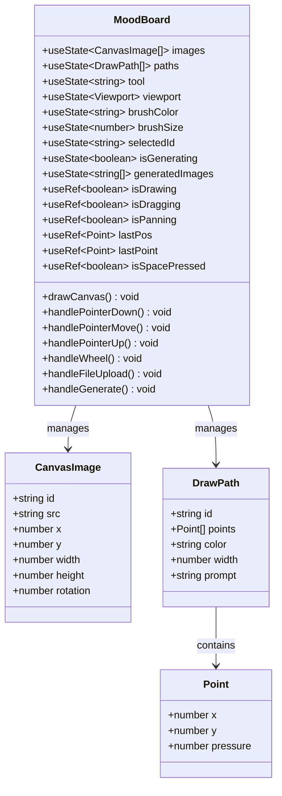

**图表来源**
- [MoodBoard.tsx](file://components/MoodBoard.tsx#L25-L52)
- [types.ts](file://types.ts#L12-L34)

### 视口变换系统

组件实现了复杂的视口变换系统，支持平滑的缩放和平移操作：

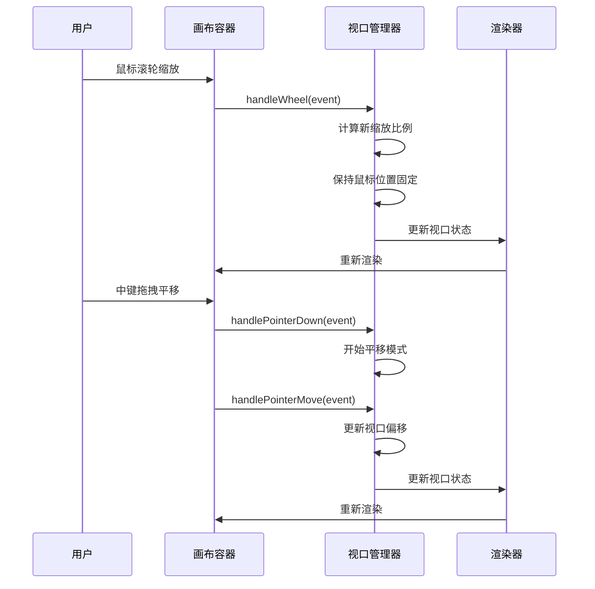

**图表来源**
- [MoodBoard.tsx](file://components/MoodBoard.tsx#L287-L307)
- [MoodBoard.tsx](file://components/MoodBoard.tsx#L240-L256)

**章节来源**
- [MoodBoard.tsx](file://components/MoodBoard.tsx#L25-L52)
- [types.ts](file://types.ts#L12-L34)

## 无限画布系统

### 基础画布架构

情绪板组件构建了一个虚拟的无限画布系统，实际画布尺寸固定为2048×2048像素，但通过CSS变换实现无限扩展的视觉效果：

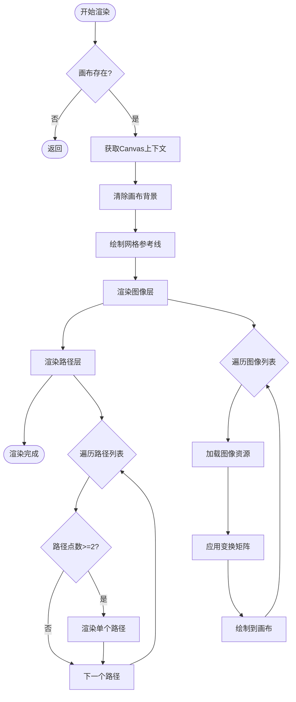

**图表来源**
- [MoodBoard.tsx](file://components/MoodBoard.tsx#L97-L163)

### 视口坐标转换

组件实现了精确的坐标转换系统，将屏幕坐标转换为画布坐标：

| 转换类型 | 公式 | 应用场景 |
|---------|------|----------|
| 屏幕到画布 | `x = (screenX - containerLeft - viewportX) / viewportScale` | 鼠标点击检测 |
| 画布到视口 | `screenX = canvasX * viewportScale + viewportX + containerLeft` | UI元素定位 |
| 缩放中心计算 | `newPosition = mousePosition - (mousePosition - oldPosition) * (newScale / oldScale)` | 平滑缩放 |

**章节来源**
- [MoodBoard.tsx](file://components/MoodBoard.tsx#L71-L82)
- [MoodBoard.tsx](file://components/MoodBoard.tsx#L240-L256)

## 多图层管理机制

### 图像层管理

组件支持多个参考图像的同时显示和编辑，每个图像都具有独立的位置、旋转和缩放属性：

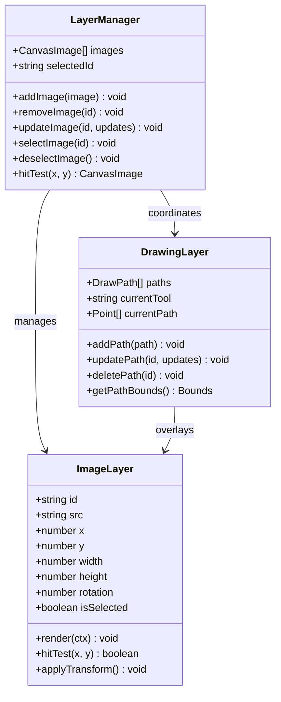

**图表来源**
- [MoodBoard.tsx](file://components/MoodBoard.tsx#L116-L136)
- [types.ts](file://types.ts#L12-L19)

### 图像上传和处理

组件提供了灵活的图像上传机制，支持批量处理和自动尺寸调整：

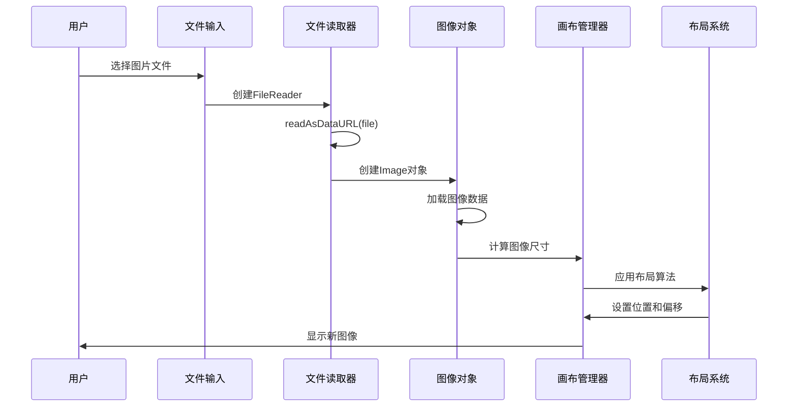

**图表来源**
- [MoodBoard.tsx](file://components/MoodBoard.tsx#L310-L344)

**章节来源**
- [MoodBoard.tsx](file://components/MoodBoard.tsx#L116-L136)
- [MoodBoard.tsx](file://components/MoodBoard.tsx#L310-L344)

## 注释绘制系统

### 笔触压力感应

组件实现了先进的压力感应系统，能够记录和渲染不同压力级别的笔触：

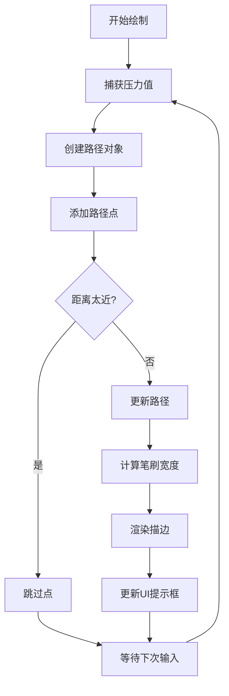

**图表来源**
- [MoodBoard.tsx](file://components/MoodBoard.tsx#L251-L262)

### 路径数据结构

每个绘制路径都包含了丰富的元数据信息：

| 字段 | 类型 | 描述 | 默认值 |
|------|------|------|--------|
| id | string | 唯一标识符 | 时间戳 |
| points | Point[] | 路径点数组 | 空数组 |
| color | string | 笔刷颜色 | '#f59e0b' |
| width | number | 基础笔刷宽度 | 20 |
| prompt | string | 编辑指令 | 空字符串 |

### 注释提示系统

组件提供了直观的注释提示系统，允许用户在路径上添加编辑说明：

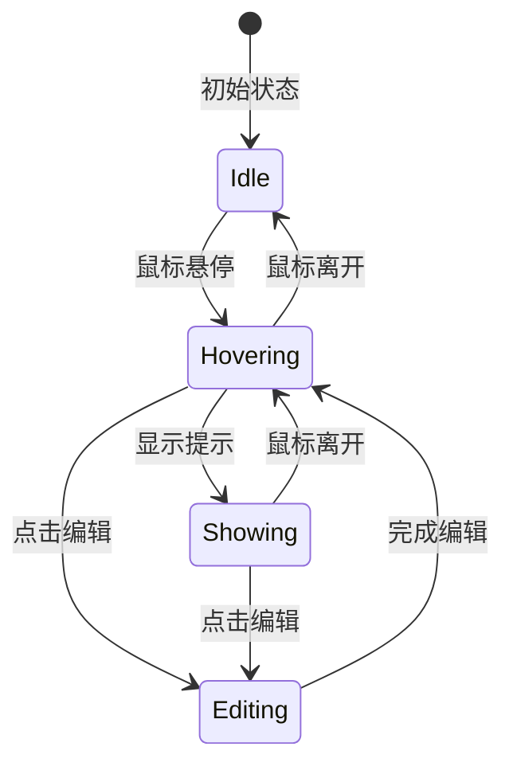

**图表来源**
- [MoodBoard.tsx](file://components/MoodBoard.tsx#L668-L701)

**章节来源**
- [MoodBoard.tsx](file://components/MoodBoard.tsx#L210-L219)
- [types.ts](file://types.ts#L28-L34)

## 双模式图像导出

### 导出模式设计

组件实现了两种独特的导出模式，分别用于不同的AI处理需求：

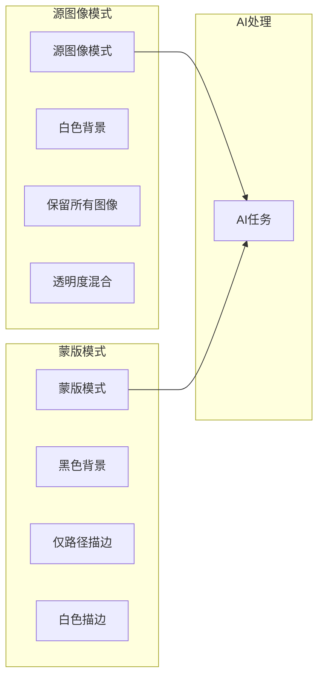

**图表来源**
- [MoodBoard.tsx](file://components/MoodBoard.tsx#L391-L468)

### 导出算法实现

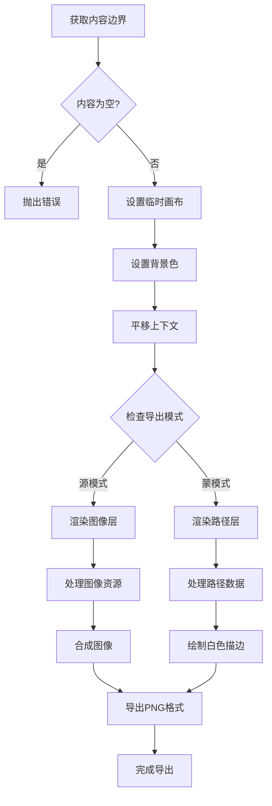

**图表来源**
- [MoodBoard.tsx](file://components/MoodBoard.tsx#L391-L468)

### AI提示工程

组件将用户的视觉注释转化为精确的AI编辑指令：

| 注释类型 | 提示模板 | 示例 |
|---------|----------|------|
| 单一路径 | "Area 1 (颜色名称): {编辑描述}" | "Area 1 (橙色): Change to blue sky" |
| 多路径组合 | "Apply edits to white masked areas only" | "Update content in masked area to fit surrounding scene naturally" |
| 无注释场景 | "Refine composition into realistic image" | "Blend edges of reference photos naturally" |

**章节来源**
- [MoodBoard.tsx](file://components/MoodBoard.tsx#L391-L468)
- [MoodBoard.tsx](file://components/MoodBoard.tsx#L470-L524)

## 性能优化策略

### requestAnimationFrame渲染循环

组件采用了高效的动画渲染循环，确保流畅的用户体验：

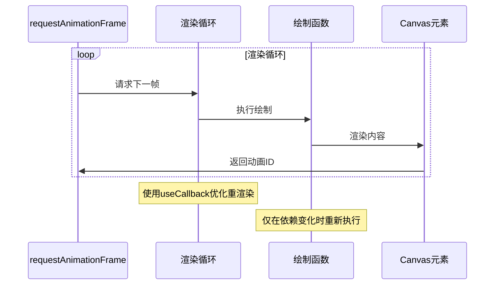

**图表来源**
- [MoodBoard.tsx](file://components/MoodBoard.tsx#L165-L174)

### 指针事件优化

组件充分利用了现代浏览器的指针事件API，提供更精确的交互体验：

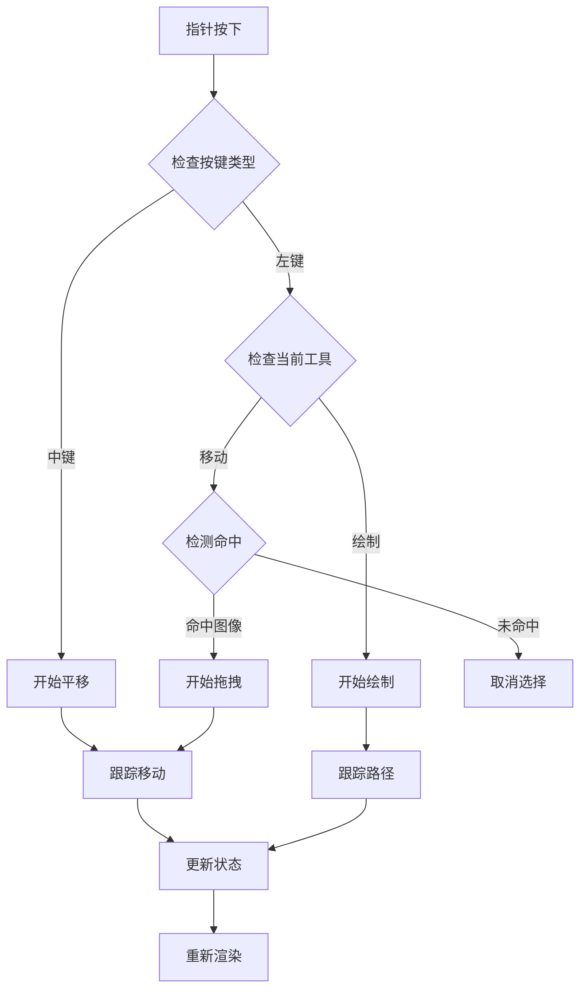

**图表来源**
- [MoodBoard.tsx](file://components/MoodBoard.tsx#L198-L238)

### 内存管理优化

| 优化策略 | 实现方式 | 效果 |
|---------|----------|------|
| 引用缓存 | useRef替代useState存储临时状态 | 减少不必要的重渲染 |
| 回调记忆化 | useCallback包装渲染函数 | 避免重复创建函数实例 |
| 条件渲染 | useMemo优化复杂计算 | 减少不必要计算 |
| 资源清理 | useEffect返回清理函数 | 防止内存泄漏 |

**章节来源**
- [MoodBoard.tsx](file://components/MoodBoard.tsx#L165-L174)
- [MoodBoard.tsx](file://components/MoodBoard.tsx#L198-L238)

## 交互逻辑详解

### 工具切换系统

组件提供了直观的工具切换界面，支持多种编辑模式：

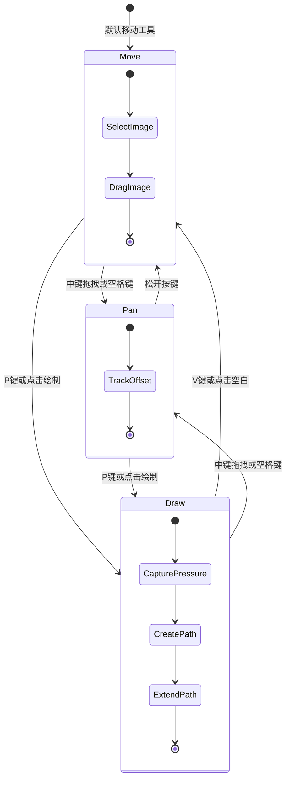

**图表来源**
- [MoodBoard.tsx](file://components/MoodBoard.tsx#L27-L28)
- [MoodBoard.tsx](file://components/MoodBoard.tsx#L558-L620)

### 键盘快捷键支持

组件实现了全面的键盘快捷键系统：

| 快捷键 | 功能 | 实现方式 |
|--------|------|----------|
| V | 移动工具 | 状态切换 |
| P | 绘制工具 | 状态切换 |
| 空格键 | 平移工具 | 按键监听 |
| 中键 | 平移工具 | 鼠标事件 |
| 删除键 | 删除选中项 | 键盘事件 |

**章节来源**
- [MoodBoard.tsx](file://components/MoodBoard.tsx#L27-L28)
- [MoodBoard.tsx](file://components/MoodBoard.tsx#L176-L194)

## 分辨率与宽高比选择功能

### UI实现

情绪板组件在工具栏中新增了分辨率和宽高比选择功能，为用户提供更精细的图像生成控制：

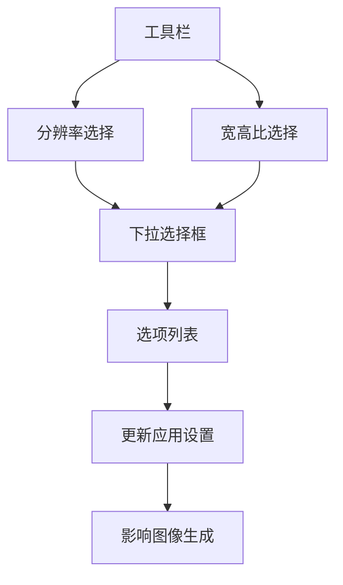

**图表来源**
- [MoodBoard.tsx](file://components/MoodBoard.tsx#L641-L668)

### 分辨率选择

组件实现了动态分辨率选择功能，根据当前AI模型的支持情况显示可用选项：

```tsx
<div className="flex items-center gap-2">
  <div className="flex flex-col gap-1">
    <label className="text-xs text-slate-400">分辨率</label>
    <select
      className="bg-dark-bg border border-dark-border rounded-lg px-2 py-1 text-xs text-slate-200 focus:outline-none focus:border-banana-500 transition-colors"
      value={settings.imageSize}
      onChange={(e) => onUpdateSettings?.({ imageSize: e.target.value as ImageSize })}
      disabled={availableImageSizes.length === 1}
      title={availableImageSizes.length === 1 ? '当前模型仅支持 1K' : ''}
    >
      {availableImageSizes.map((size) => (
        <option key={size.id} value={size.id}>{size.id}</option>
      ))}
    </select>
  </div>
</div>
```

**章节来源**
- [MoodBoard.tsx](file://components/MoodBoard.tsx#L641-L655)

### 宽高比选择

组件提供了多种宽高比选项，满足不同场景的图像生成需求：

```tsx
<div className="flex flex-col gap-1">
  <label className="text-xs text-slate-400">宽高比</label>
  <select
    className="bg-dark-bg border border-dark-border rounded-lg px-2 py-1 text-xs text-slate-200 focus:outline-none focus:border-banana-500 transition-colors"
    value={settings.aspectRatio}
    onChange={(e) => onUpdateSettings?.({ aspectRatio: e.target.value as AspectRatio })}
  >
    {ASPECT_RATIOS.map((ratio) => (
      <option key={ratio.id} value={ratio.id}>{ratio.id}</option>
    ))}
  </select>
</div>
```

**章节来源**
- [MoodBoard.tsx](file://components/MoodBoard.tsx#L657-L666)

### 状态管理

分辨率和宽高比选择功能通过AppSettings接口进行状态管理：

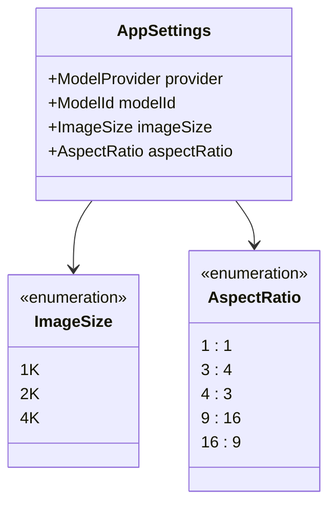

**图表来源**
- [types.ts](file://types.ts#L38-L43)
- [constants.ts](file://constants.ts#L13-L17)

### 模型切换时的分辨率自动重置逻辑

组件实现了智能的分辨率自动重置逻辑，当用户切换AI模型时，会自动检查当前分辨率是否被新模型支持：

```tsx
// 获取当前模型支持的分辨率选项
const availableImageSizes = getAvailableImageSizes(settings.modelId);

// 当模型变化时，检查当前分辨率是否支持，如果不支持则重置为 1K
useEffect(() => {
  const isCurrentSizeSupported = availableImageSizes.some(size => size.id === settings.imageSize);
  if (!isCurrentSizeSupported && onUpdateSettings) {
    onUpdateSettings({ imageSize: '1K' });
  }
}, [settings.modelId, settings.imageSize, availableImageSizes, onUpdateSettings]);
```

**图表来源**
- [MoodBoard.tsx](file://components/MoodBoard.tsx#L55-L64)

### 分辨率支持检查流程

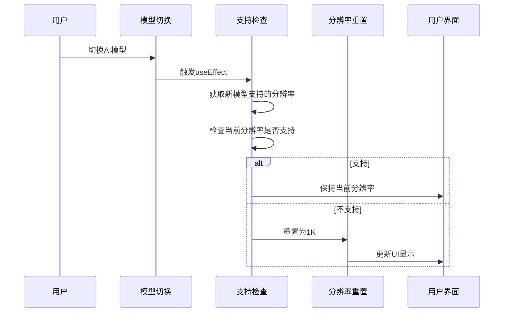

**图表来源**
- [MoodBoard.tsx](file://components/MoodBoard.tsx#L58-L64)
- [constants.ts](file://constants.ts#L20-L27)

### 分辨率选项配置

系统通过constants.ts文件定义了所有可用的分辨率选项：

```typescript
// 分辨率选项
export const IMAGE_SIZES: { id: ImageSize; name: string }[] = [
  { id: '1K', name: '1K (1024×1024)' },
  { id: '2K', name: '2K (2048×2048)' },
  { id: '4K', name: '4K (4096×4096)' }
];

// 根据模型过滤分辨率选项
export const getAvailableImageSizes = (modelId: ModelId): { id: ImageSize; name: string }[] => {
  if (modelId === ModelId.NANO_BANANA) {
    // Nano Banana 只支持 1K
    return IMAGE_SIZES.filter(size => size.id === '1K');
  }
  // Nano Banana Pro 支持 1K, 2K, 4K
  return IMAGE_SIZES;
};
```

**章节来源**
- [constants.ts](file://constants.ts#L13-L27)

### 宽高比选项配置

系统通过constants.ts文件定义了所有可用的宽高比选项：

```typescript
// 宽高比选项
export const ASPECT_RATIOS: { id: AspectRatio; name: string }[] = [
  { id: '1:1', name: '1:1 (正方形)' },
  { id: '3:4', name: '3:4 (竖版)' },
  { id: '4:3', name: '4:3 (横版)' },
  { id: '9:16', name: '9:16 (手机竖屏)' },
  { id: '16:9', name: '16:9 (宽屏)' }
];
```

**章节来源**
- [constants.ts](file://constants.ts#L30-L36)

### 服务商兼容性警告

当用户选择Google服务商时，系统会显示警告提示，告知其不支持自定义分辨率和宽高比功能：

```tsx
{settings.provider === 'Google' && (
  <div className="bg-blue-500/10 border border-blue-500/30 rounded-lg p-2">
    <p className="text-xs text-blue-200">
      ⚠️ 当前使用 Google 官方 API，不支持自定义分辨率和宽高比参数。请在配置中切换到 <strong>AIHubMix</strong> 服务商以使用这些功能。
    </p>
  </div>
)}
```

此警告机制旨在引导用户使用AIHubMix服务商，以获得完整的图像生成功能体验。AIHubMix服务商支持所有分辨率和宽高比选项，而Google服务商仅提供基础功能。

**章节来源**
- [MoodBoard.tsx](file://components/MoodBoard.tsx#L671-L677)
- [types.ts](file://types.ts#L1-L4)

## 最佳实践指南

### 大型画布处理

对于大型画布和复杂路径数据，建议采用以下优化策略：

1. **分块渲染**：将大画布分割为多个小块进行渲染
2. **LOD系统**：根据缩放级别调整细节层次
3. **延迟加载**：按需加载图像资源
4. **内存池**：复用路径点对象减少GC压力

### 路径数据优化

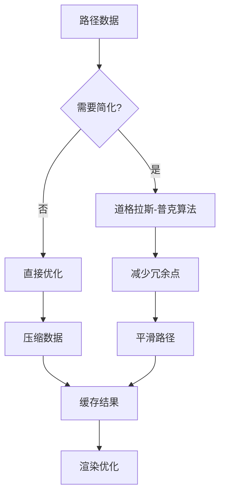

### AI集成最佳实践

1. **提示工程**：使用清晰、具体的编辑指令
2. **图像预处理**：确保导出图像的质量和格式正确
3. **错误处理**：实现完善的API错误处理机制
4. **并发控制**：限制同时进行的AI请求数量

### 主题和样式定制

组件使用Tailwind CSS和自定义颜色方案：

| 颜色变量 | 值 | 用途 |
|---------|-----|------|
| banana-500 | #f59e0b | 主色调，按钮激活状态 |
| dark-bg | #0f172a | 背景颜色 |
| dark-surface | #1e293b | 表面颜色 |
| dark-border | #334155 | 边框颜色 |

**章节来源**
- [index.html](file://index.html#L12-L30)
- [MoodBoard.tsx](file://components/MoodBoard.tsx#L104-L105)

## 总结

Banana Canvas AI的情绪板组件代表了现代Web图像编辑技术的先进水平。通过精心设计的无限画布系统、智能的多图层管理、创新的注释绘制机制和高效的AI集成功能，该组件为用户提供了专业级的图像编辑体验。

### 技术亮点

1. **无限画布架构**：突破传统画布尺寸限制，提供真正的无限创作空间
2. **压力感应技术**：精确记录笔触参数，提升绘画表现力
3. **双模式导出**：巧妙结合源图像和蒙版信息，为AI提供精确的编辑指令
4. **性能优化**：通过多种优化策略确保流畅的用户体验
5. **AI集成**：无缝连接现代AI图像生成服务
6. **分辨率与宽高比选择**：新增的精细化图像生成控制功能

### 应用价值

该组件不仅是一个技术演示，更是AI辅助图像编辑领域的创新实践。它展示了如何将传统的图像编辑概念与现代AI技术相结合，为未来的创意工具开发提供了宝贵的参考。

通过深入理解这个组件的设计理念和技术实现，开发者可以更好地掌握现代Web图像编辑的核心技术和最佳实践，为构建更优秀的创意工具奠定坚实基础。