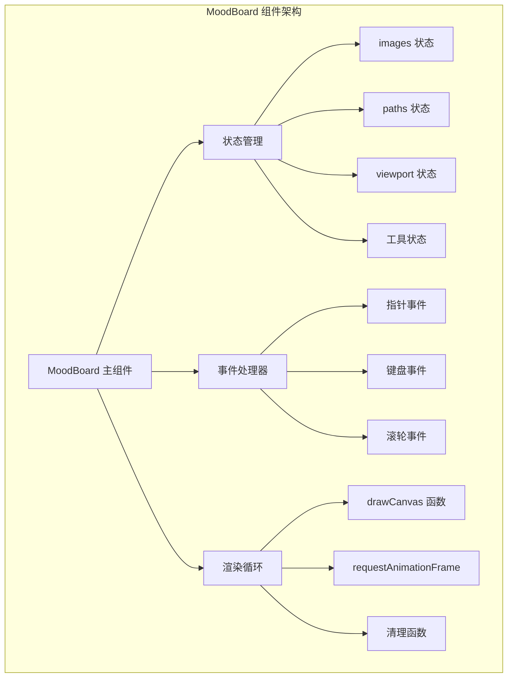
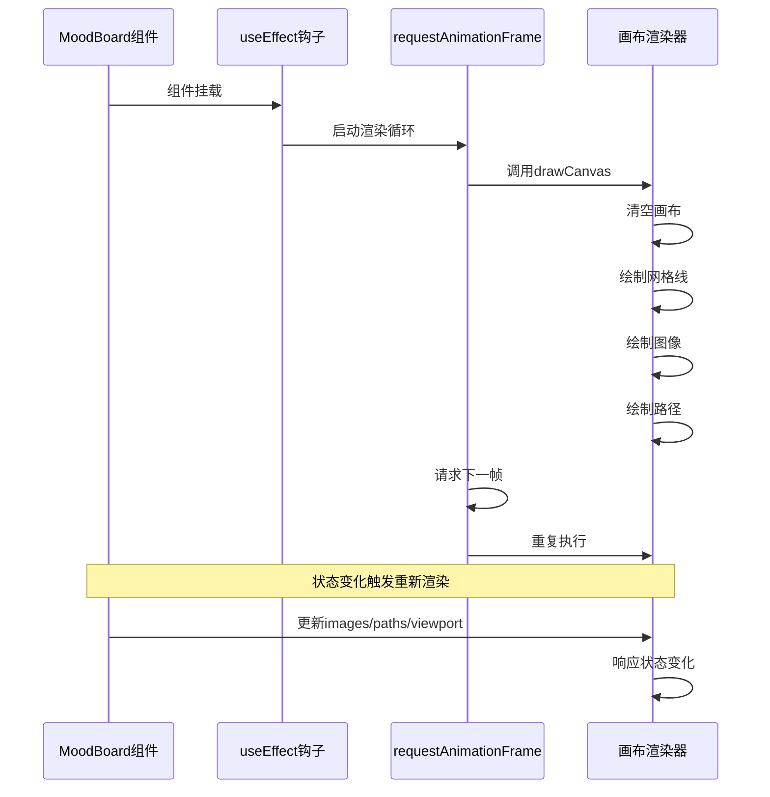
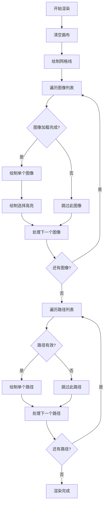
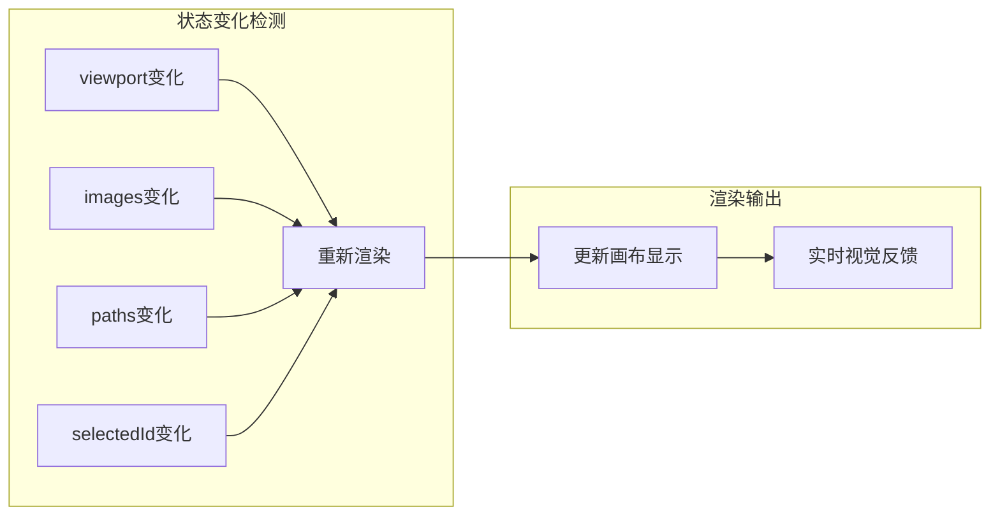

# 动画循环系统

<cite>
**本文档中引用的文件**
- [MoodBoard.tsx](file://components/MoodBoard.tsx)
- [types.ts](file://types.ts)
- [constants.ts](file://constants.ts)
</cite>

## 目录
1. [简介](#简介)
2. [项目结构概览](#项目结构概览)
3. [核心动画循环架构](#核心动画循环架构)
4. [useEffect动画循环实现](#useeffect动画循环实现)
5. [drawCanvas函数设计](#drawcanvas函数设计)
6. [状态驱动的实时渲染](#状态驱动的实时渲染)
7. [性能特征与优化策略](#性能特征与优化策略)
8. [故障排除指南](#故障排除指南)
9. [总结](#总结)

## 简介

MoodBoard组件采用基于`requestAnimationFrame`的高效动画循环系统，实现了流畅的实时视觉反馈。该系统通过React的`useEffect`钩子在组件挂载时启动无限渲染循环，并利用`useCallback`确保关键函数的引用稳定性，从而构建了一个响应式、高性能的画布渲染引擎。

## 项目结构概览

MoodBoard组件位于`components/MoodBoard.tsx`，是整个应用的核心交互组件。它管理着复杂的画布状态，包括图像集合、绘制路径、视口变换和用户交互状态。



**图表来源**
- [MoodBoard.tsx](file://components/MoodBoard.tsx#L25-L46)

**章节来源**
- [MoodBoard.tsx](file://components/MoodBoard.tsx#L1-L50)

## 核心动画循环架构

动画循环系统的核心由三个关键组件构成：`drawCanvas`函数、`useEffect`钩子和`requestAnimationFrame` API。这种架构确保了组件能够响应各种状态变化并提供流畅的视觉体验。



**图表来源**
- [MoodBoard.tsx](file://components/MoodBoard.tsx#L178-L187)

**章节来源**
- [MoodBoard.tsx](file://components/MoodBoard.tsx#L178-L187)

## useEffect动画循环实现

`useEffect`钩子负责在组件挂载时启动无限渲染循环，并在组件卸载时清理资源。这是动画系统的核心控制逻辑。

### 循环启动机制

动画循环通过以下步骤启动：

1. **初始化动画帧ID**：声明一个变量存储`requestAnimationFrame`返回的标识符
2. **定义渲染函数**：创建递归渲染函数，调用`drawCanvas`后请求下一帧
3. **启动循环**：首次调用渲染函数开始无限循环
4. **设置清理函数**：返回清理函数以取消动画帧请求

### 内存泄漏防护

清理函数至关重要，它防止组件卸载后仍然运行动画帧请求，造成内存泄漏：

```typescript
return () => cancelAnimationFrame(animationFrameId);
```

这个清理函数确保：
- 组件卸载时停止所有动画帧请求
- 避免对已销毁DOM元素的操作
- 防止内存泄漏和性能问题

**章节来源**
- [MoodBoard.tsx](file://components/MoodBoard.tsx#L178-L187)

## drawCanvas函数设计

`drawCanvas`函数是动画循环的核心，负责实际的画布渲染操作。它被`useCallback`包裹以确保引用稳定性。

### useCallback的重要性

`drawCanvas`被`useCallback`包裹的原因：

1. **引用稳定性**：防止组件重渲染时函数引用发生变化
2. **依赖数组优化**：确保`useEffect`只在必要时重启循环
3. **性能优化**：避免不必要的渲染循环重启

### 渲染流程详解

`drawCanvas`函数按照以下顺序执行渲染操作：



**图表来源**
- [MoodBoard.tsx](file://components/MoodBoard.tsx#L109-L175)

### 渲染优先级

渲染操作遵循特定的优先级顺序：

1. **背景层**：清空画布并绘制参考网格
2. **图像层**：按顺序绘制所有图像，支持变换和选择高亮
3. **路径层**：绘制用户绘制的遮罩路径，支持透明度和压力感应

**章节来源**
- [MoodBoard.tsx](file://components/MoodBoard.tsx#L109-L175)

## 状态驱动的实时渲染

动画循环系统通过响应多种状态变化来提供实时视觉反馈。

### 视口状态响应

视口状态（缩放和平移）的变化会立即反映在渲染输出中：

- **缩放**：通过`viewport.scale`控制整体放大缩小
- **平移**：通过`viewport.x`和`viewport.y`控制画布位置
- **变换原点**：确保缩放围绕鼠标位置进行

### 图像状态响应

图像状态的变化触发重新渲染：

- **位置变化**：图像的`x`、`y`坐标更新
- **尺寸调整**：`width`和`height`属性变化
- **旋转**：`rotation`角度变化
- **选择状态**：`selectedId`变化影响高亮显示

### 路径状态响应

绘制路径的状态变化实时更新：

- **新路径添加**：立即在渲染中可见
- **路径修改**：实时更新绘制效果
- **透明度控制**：支持半透明遮罩绘制



**图表来源**
- [MoodBoard.tsx](file://components/MoodBoard.tsx#L27-L32)
- [MoodBoard.tsx](file://components/MoodBoard.tsx#L27-L28)
- [MoodBoard.tsx](file://components/MoodBoard.tsx#L27-L29)

**章节来源**
- [MoodBoard.tsx](file://components/MoodBoard.tsx#L27-L32)
- [MoodBoard.tsx](file://components/MoodBoard.tsx#L27-L28)
- [MoodBoard.tsx](file://components/MoodBoard.tsx#L27-L29)

## 性能特征与优化策略

动画循环系统具有特定的性能特征，同时也存在优化空间。

### 当前性能特征

1. **持续渲染**：即使没有状态变化也会持续渲染
2. **帧率控制**：依赖浏览器的`requestAnimationFrame`自动优化
3. **内存管理**：通过清理函数防止内存泄漏
4. **状态感知**：只在相关状态变化时重新计算渲染

### 潜在优化空间

#### 节流优化

当前系统在无状态变化时仍会持续渲染，可以通过以下方式优化：

```typescript
// 示例：添加节流控制
const [lastRenderTime, setLastRenderTime] = useState(0);
const MIN_FRAME_TIME = 16; // ~60fps

const throttledRender = useCallback(() => {
  const now = performance.now();
  if (now - lastRenderTime >= MIN_FRAME_TIME) {
    drawCanvas();
    setLastRenderTime(now);
  }
  animationFrameId = requestAnimationFrame(throttledRender);
}, [drawCanvas]);
```

#### 条件渲染优化

根据状态变化频率调整渲染频率：

```typescript
// 示例：基于状态变化的渲染控制
const shouldRender = useMemo(() => {
  // 检查是否有显著的状态变化
  return hasSignificantChanges(images, paths, viewport);
}, [images, paths, viewport]);

if (!shouldRender) return;
```

#### 脏检测优化

实现简单的脏检测机制：

```typescript
// 示例：脏检测标记
const [dirty, setDirty] = useState(false);

// 在状态变化时设置脏标记
const markDirty = useCallback(() => {
  setDirty(true);
}, []);

// 在渲染前检查脏标记
if (dirty) {
  drawCanvas();
  setDirty(false);
}
```

### 性能监控指标

建议监控以下性能指标：

- **帧率**：目标60fps
- **渲染时间**：单帧渲染耗时
- **内存使用**：图像缓存和DOM元素
- **CPU占用**：动画循环的计算开销

**章节来源**
- [MoodBoard.tsx](file://components/MoodBoard.tsx#L178-L187)

## 故障排除指南

### 常见问题及解决方案

#### 动画卡顿或不流畅

**症状**：渲染帧率低于预期，动画出现卡顿

**可能原因**：
- 复杂的图像处理操作
- 过多的DOM操作
- 内存泄漏导致性能下降

**解决方案**：
1. 检查图像加载状态，避免未完成的图像参与渲染
2. 优化图像尺寸和格式
3. 实施渲染节流机制

#### 内存泄漏

**症状**：长时间使用后页面变慢，内存占用持续增长

**可能原因**：
- 动画帧请求未正确清理
- 事件监听器未移除
- 图像资源未释放

**解决方案**：
1. 确保`useEffect`清理函数正确执行
2. 检查事件监听器的添加和移除
3. 实现图像资源的显式清理

#### 渲染不及时

**症状**：状态变化后视觉更新延迟

**可能原因**：
- 渲染循环阻塞
- 状态更新过于频繁
- 依赖数组配置错误

**解决方案**：
1. 检查`useCallback`依赖数组
2. 优化状态更新逻辑
3. 使用`useMemo`缓存计算结果

**章节来源**
- [MoodBoard.tsx](file://components/MoodBoard.tsx#L178-L187)

## 总结

MoodBoard组件的动画循环系统是一个精心设计的实时渲染引擎，通过以下关键特性实现了高效的视觉反馈：

### 核心优势

1. **响应式设计**：系统能够实时响应viewport、images和paths状态的变化
2. **资源管理**：通过清理函数防止内存泄漏
3. **性能优化**：`useCallback`确保函数引用稳定性，减少不必要的重渲染
4. **可维护性**：清晰的代码结构和明确的职责分离

### 技术亮点

- **无限渲染循环**：基于`requestAnimationFrame`的高效动画系统
- **状态驱动渲染**：自动响应各种状态变化
- **内存安全**：完善的资源清理机制
- **扩展性**：良好的架构支持功能扩展

### 应用价值

该动画循环系统为MoodBoard提供了流畅的用户体验，支持复杂的图像编辑和遮罩绘制操作。其设计理念和实现方式可以作为其他React应用中复杂动画系统的参考模板。

通过深入理解这套动画循环系统，开发者可以更好地掌握React中的性能优化技巧，以及如何构建响应式的、高性能的用户界面组件。