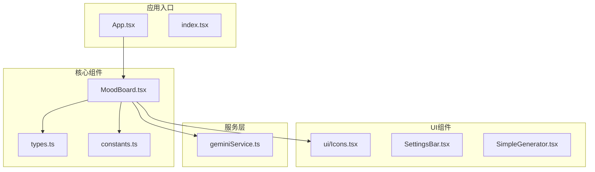
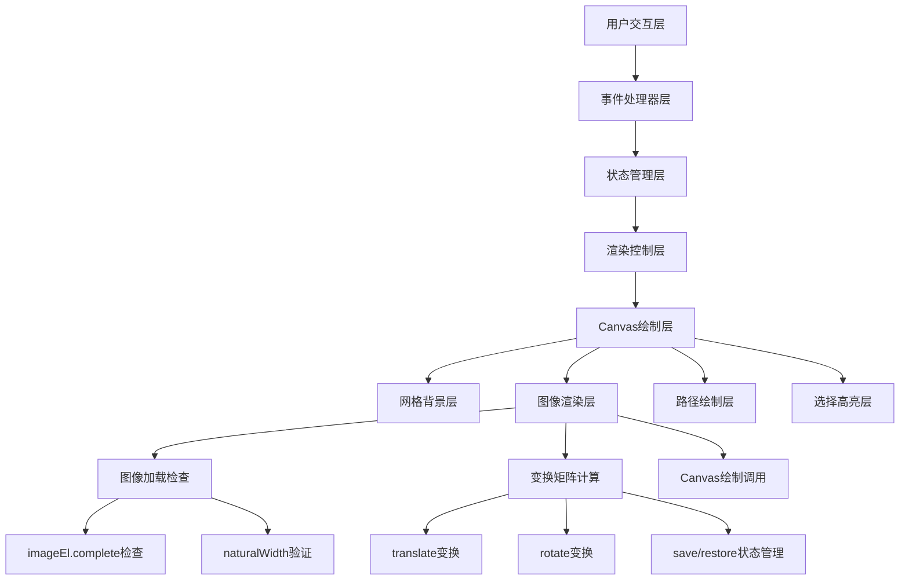
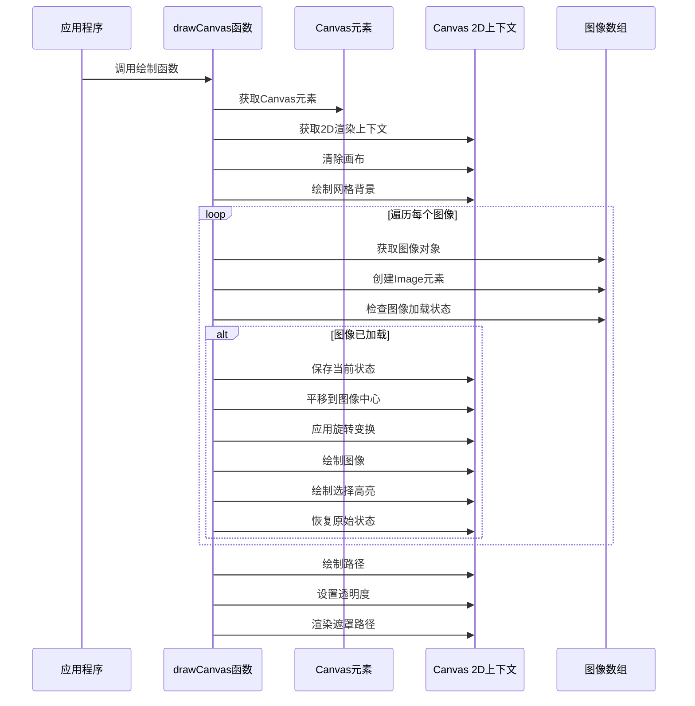
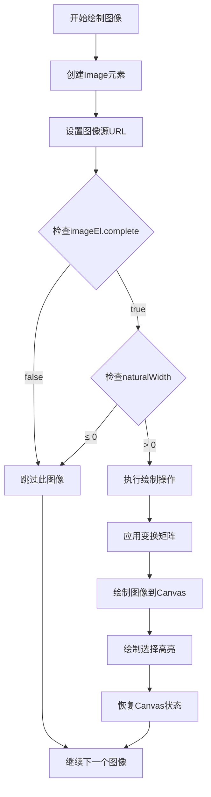
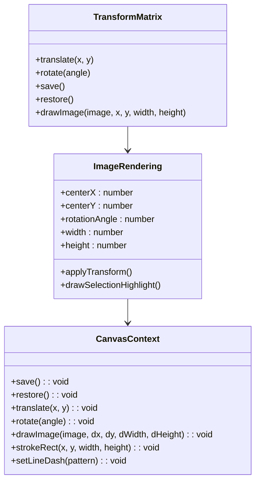
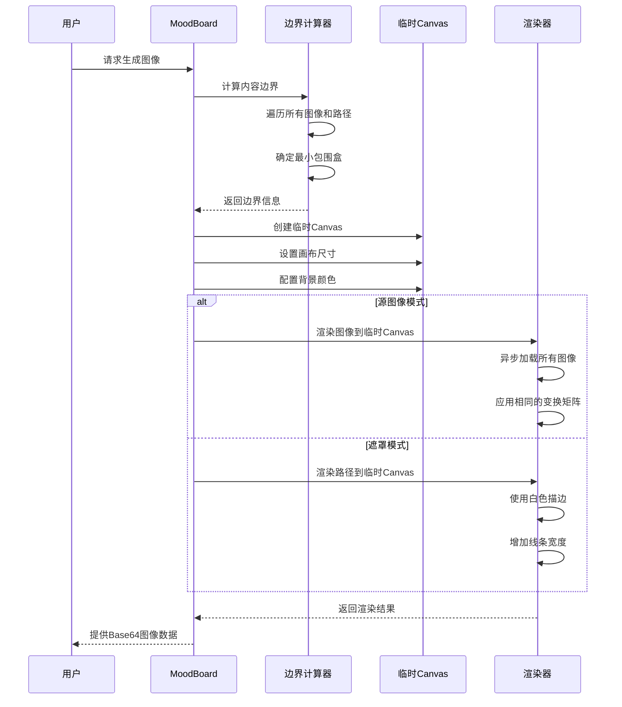
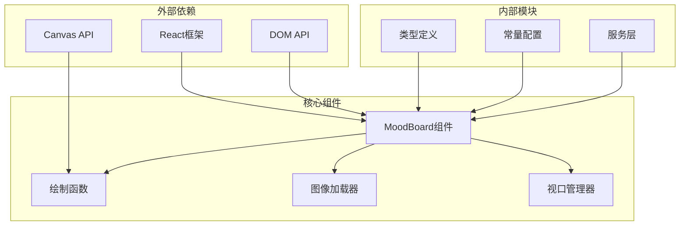

# 图像渲染

<cite>
**本文档中引用的文件**
- [MoodBoard.tsx](file://components/MoodBoard.tsx)
- [types.ts](file://types.ts)
- [constants.ts](file://constants.ts)
</cite>

## 目录
1. [简介](#简介)
2. [项目结构概览](#项目结构概览)
3. [核心组件分析](#核心组件分析)
4. [架构概览](#架构概览)
5. [详细组件分析](#详细组件分析)
6. [依赖关系分析](#依赖关系分析)
7. [性能考虑](#性能考虑)
8. [故障排除指南](#故障排除指南)
9. [结论](#结论)

## 简介

本文档深入分析了BananaCanvase项目中MoodBoard组件的图像渲染机制。该系统是一个基于React的Canvas图像编辑器，支持图像上传、旋转、缩放、平移以及AI驱动的图像生成功能。核心的图像渲染逻辑集中在`drawCanvas`函数中，该函数负责遍历图像数组并使用Canvas 2D渲染上下文进行精确的图像绘制。

## 项目结构概览

BananaCanvase项目采用模块化架构，主要包含以下关键组件：



**图表来源**
- [MoodBoard.tsx](file://components/MoodBoard.tsx#L1-L20)
- [types.ts](file://types.ts#L1-L61)
- [constants.ts](file://constants.ts#L1-L34)

**章节来源**
- [MoodBoard.tsx](file://components/MoodBoard.tsx#L1-L50)
- [types.ts](file://types.ts#L1-L61)
- [constants.ts](file://constants.ts#L1-L34)

## 核心组件分析

### Canvas图像数据结构

系统使用`CanvasImage`接口定义图像的基本属性：

```typescript
interface CanvasImage {
  id: string;
  src: string;
  x: number;
  y: number;
  width: number;
  height: number;
  rotation: number;
}
```

该结构包含了图像的位置、尺寸和旋转角度信息，为精确的图像定位和变换提供了基础。

### 视口管理系统

系统实现了复杂的视口（viewport）管理系统，支持缩放和平移操作：

```typescript
const [viewport, setViewport] = useState({ x: 0, y: 0, scale: 1 });
```

视口状态通过CSS变换应用到Canvas容器上，实现了流畅的用户体验。

**章节来源**
- [MoodBoard.tsx](file://components/MoodBoard.tsx#L27-L33)
- [types.ts](file://types.ts#L12-L20)

## 架构概览

MoodBoard组件采用了分层渲染架构，主要包含以下几个层次：



**图表来源**
- [MoodBoard.tsx](file://components/MoodBoard.tsx#L98-L165)
- [MoodBoard.tsx](file://components/MoodBoard.tsx#L418-L470)

## 详细组件分析

### drawCanvas函数深度解析

`drawCanvas`是整个图像渲染系统的核心函数，它负责执行完整的Canvas重绘流程：



**图表来源**
- [MoodBoard.tsx](file://components/MoodBoard.tsx#L98-L165)
- [MoodBoard.tsx](file://components/MoodBoard.tsx#L117-L138)

#### 图像加载时序处理策略

系统实现了智能的图像加载检查机制，确保只有完全加载的图像才会被绘制：



**图表来源**
- [MoodBoard.tsx](file://components/MoodBoard.tsx#L118-L138)

这种检查机制避免了绘制未完成或损坏的图像，提高了系统的稳定性和用户体验。

#### 坐标变换逻辑详解

图像绘制过程中的坐标变换是系统的核心功能之一，通过精心设计的变换序列实现精确的图像定位和旋转：



**图表来源**
- [MoodBoard.tsx](file://components/MoodBoard.tsx#L122-L136)
- [MoodBoard.tsx](file://components/MoodBoard.tsx#L428-L434)

变换序列的关键步骤包括：
1. **保存当前状态**：使用`ctx.save()`保存Canvas的当前变换状态
2. **平移至图像中心**：通过`ctx.translate(img.x + img.width/2, img.y + img.height/2)`将原点移动到图像中心
3. **应用旋转**：使用`ctx.rotate(img.rotation * Math.PI / 180)`进行旋转变换
4. **绘制图像**：从负半宽高位置开始绘制，确保围绕中心点旋转
5. **恢复状态**：使用`ctx.restore()`恢复之前的变换状态

#### 图像选择高亮实现

系统实现了视觉化的图像选择高亮点，通过虚线边框突出显示当前选中的图像：

```mermaid
flowchart LR
A[检测到选中图像] --> B[设置高亮颜色]
B --> C[设置线宽为4像素]
C --> D[启用虚线模式]
D --> E[绘制矩形边框]
E --> F[禁用虚线模式]
F --> G[完成高亮绘制]
H[虚线模式配置] --> I[setLineDash([10, 10])]
I --> J[10像素实线 + 10像素间隔]
```

**图表来源**
- [MoodBoard.tsx](file://components/MoodBoard.tsx#L129-L135)

高亮效果与viewport的缩放和平移操作协同工作，确保在任何视口状态下都能正确显示选择状态。

**章节来源**
- [MoodBoard.tsx](file://components/MoodBoard.tsx#L98-L165)

### 离屏渲染系统

系统还实现了高级的离屏渲染功能，用于AI图像生成：



**图表来源**
- [MoodBoard.tsx](file://components/MoodBoard.tsx#L393-L470)

**章节来源**
- [MoodBoard.tsx](file://components/MoodBoard.tsx#L393-L470)

## 依赖关系分析

系统的依赖关系体现了清晰的分层架构：



**图表来源**
- [MoodBoard.tsx](file://components/MoodBoard.tsx#L1-L15)
- [types.ts](file://types.ts#L1-L61)
- [constants.ts](file://constants.ts#L1-L34)

**章节来源**
- [MoodBoard.tsx](file://components/MoodBoard.tsx#L1-L15)
- [types.ts](file://types.ts#L1-L61)
- [constants.ts](file://constants.ts#L1-L34)

## 性能考虑

### 图像缓存策略

虽然当前实现没有显式的图像缓存机制，但可以通过以下方式优化：

1. **预加载机制**：在用户交互前预先加载可能需要的图像
2. **内存管理**：及时释放不再使用的图像资源
3. **压缩优化**：对大图像进行适当的压缩处理

### 离屏渲染优化

离屏渲染是性能敏感的操作，可以考虑：

1. **异步处理**：使用Web Workers处理大型图像
2. **分块渲染**：对于超大画布，采用分块渲染策略
3. **硬件加速**：利用GPU加速Canvas操作

### 渲染循环优化

当前使用`requestAnimationFrame`实现平滑的渲染循环，这是最佳实践。可以进一步优化：

1. **脏区域检测**：只重绘发生变化的区域
2. **帧率控制**：根据设备性能动态调整渲染频率
3. **批量更新**：合并多个状态变更操作

## 故障排除指南

### 常见渲染问题

1. **图像不显示**
   - 检查图像URL是否有效
   - 验证跨域资源共享(CORS)设置
   - 确认图像格式支持

2. **旋转效果异常**
   - 验证旋转角度单位转换
   - 检查变换矩阵顺序
   - 确认save/restore配对使用

3. **高亮显示问题**
   - 检查选择状态同步
   - 验证视口变换影响
   - 确认Canvas上下文状态

**章节来源**
- [MoodBoard.tsx](file://components/MoodBoard.tsx#L118-L138)
- [MoodBoard.tsx](file://components/MoodBoard.tsx#L129-L135)

## 结论

BananaCanvase项目的图像渲染系统展现了现代Web应用中Canvas技术的最佳实践。通过精心设计的变换矩阵、智能的图像加载检查和优雅的选择高亮机制，系统实现了高性能、高可用性的图像编辑体验。

关键技术特点包括：
- **精确的坐标变换**：通过translate和rotate实现围绕中心点的旋转
- **智能的加载管理**：使用imageEl.complete和naturalWidth确保图像完整性
- **优雅的状态管理**：通过save/restore方法维护Canvas上下文状态
- **灵活的渲染模式**：支持源图像和遮罩两种渲染模式
- **优秀的用户体验**：实时反馈和流畅的交互响应

该系统为类似的Canvas图像编辑应用提供了宝贵的参考实现，展示了如何在保持性能的同时提供丰富的视觉效果和交互功能。