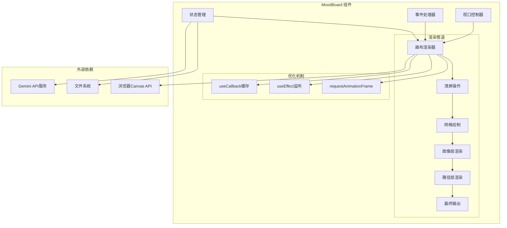
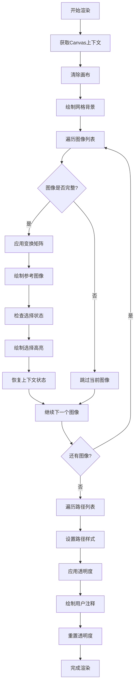
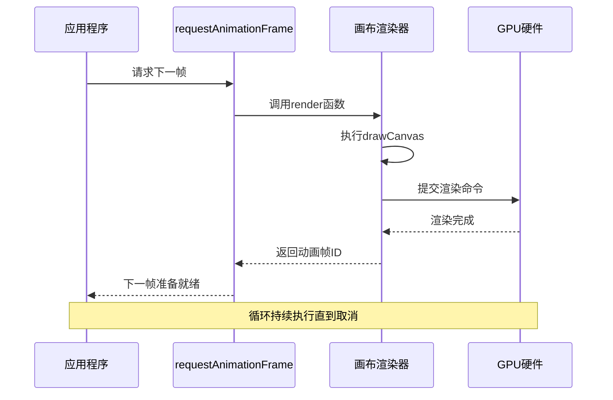
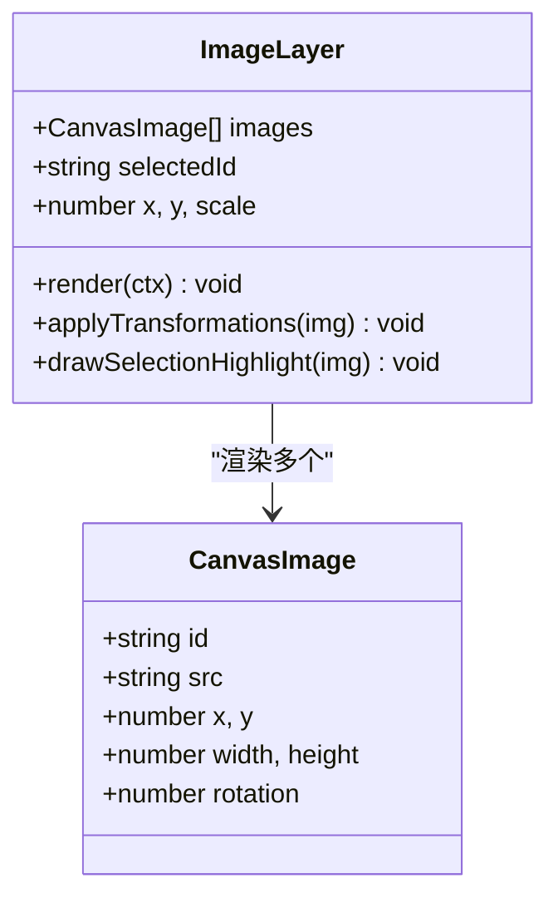
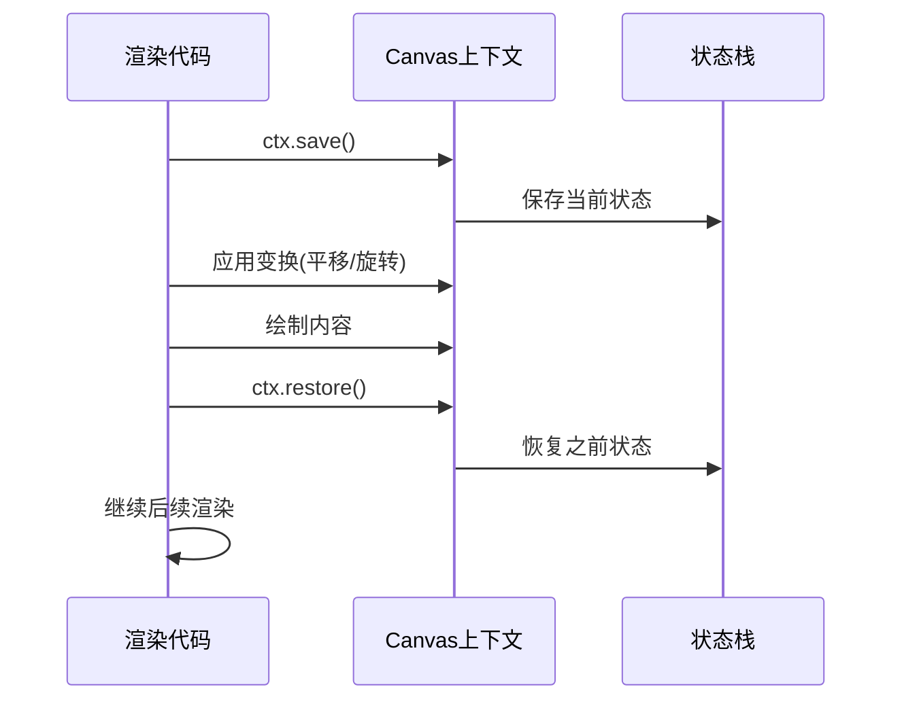
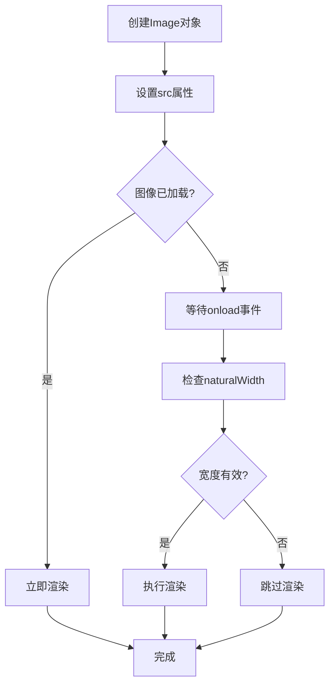
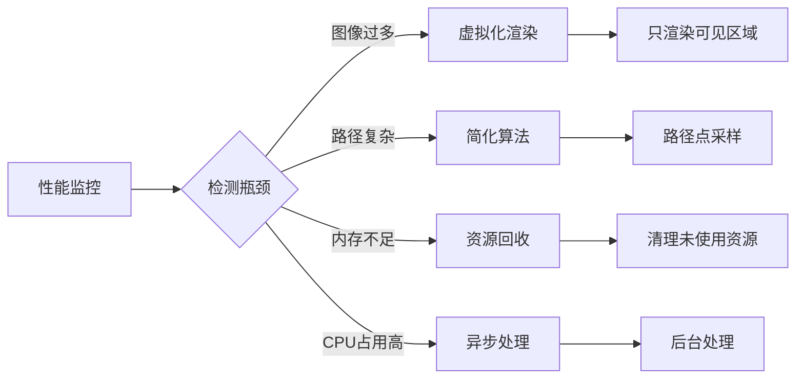

# 画布渲染系统

<cite>
**本文档中引用的文件**
- [MoodBoard.tsx](file://components/MoodBoard.tsx)
- [types.ts](file://types.ts)
- [constants.ts](file://constants.ts)
</cite>

## 目录
1. [项目概述](#项目概述)
2. [系统架构](#系统架构)
3. [核心渲染组件](#核心渲染组件)
4. [动画循环系统](#动画循环系统)
5. [双层渲染策略](#双层渲染策略)
6. [网格背景系统](#网格背景系统)
7. [渲染上下文管理](#渲染上下文管理)
8. [图像加载优化](#图像加载优化)
9. [性能优化策略](#性能优化策略)
10. [故障排除指南](#故障排除指南)
11. [总结](#总结)

## 项目概述

BananaCanvase是一个基于React和HTML5 Canvas的高级图像编辑工具，专为AI驱动的图像合成设计。该系统的核心是MoodBoard组件，它实现了高性能的实时画布渲染，支持图像叠加、手绘注释、压力感应和动态缩放等功能。

### 主要特性
- **实时动画循环**：基于requestAnimationFrame的高效渲染系统
- **双层渲染架构**：分离的图像层和注释层，支持不同的渲染策略
- **压力感应绘画**：根据输入设备的压力值调整线条粗细
- **无限画布**：支持大规模内容的平移和缩放
- **AI集成**：与Gemini API集成，支持智能图像生成

## 系统架构



**图表来源**
- [MoodBoard.tsx](file://components/MoodBoard.tsx#L23-L770)

**章节来源**
- [MoodBoard.tsx](file://components/MoodBoard.tsx#L1-L770)

## 核心渲染组件

### drawCanvas函数详解

`drawCanvas`函数是整个渲染系统的核心，它负责协调所有渲染操作。该函数使用`useCallback`进行记忆化处理，确保只有当依赖项发生变化时才重新计算。

#### 渲染流程架构



**图表来源**
- [MoodBoard.tsx](file://components/MoodBoard.tsx#L97-L163)

#### 关键渲染步骤

1. **画布初始化**：设置深色背景和画布尺寸
2. **网格系统**：绘制100x100像素的参考网格
3. **图像渲染**：逐个绘制参考图像，支持旋转和缩放
4. **路径渲染**：绘制用户的手绘注释，支持压力感应
5. **状态管理**：使用save/restore模式保持渲染状态

**章节来源**
- [MoodBoard.tsx](file://components/MoodBoard.tsx#L97-L163)

## 动画循环系统

### requestAnimationFrame集成

系统采用现代Web标准的动画循环机制，通过`requestAnimationFrame`确保流畅的视觉效果。



**图表来源**
- [MoodBoard.tsx](file://components/MoodBoard.tsx#L166-L173)

### 性能优化机制

1. **记忆化处理**：`useCallback`确保渲染函数不被不必要的重建
2. **依赖监听**：`useEffect`只在关键状态变化时触发重绘
3. **帧率同步**：与显示器刷新率同步，避免撕裂现象
4. **资源清理**：自动取消未完成的动画帧请求

**章节来源**
- [MoodBoard.tsx](file://components/MoodBoard.tsx#L166-L173)

## 双层渲染策略

### 图像层（底层）

图像层负责显示参考图像，支持复杂的变换操作：

#### 渲染特性
- **变换矩阵**：支持平移、旋转和缩放
- **完整性检查**：验证图像加载状态
- **选择高亮**：视觉反馈当前选中的图像
- **抗锯齿**：高质量的图像渲染

#### 实现细节


**图表来源**
- [MoodBoard.tsx](file://components/MoodBoard.tsx#L115-L136)

### 路径层（上层）

路径层专门用于用户交互和注释绘制：

#### 渲染特性
- **压力感应**：根据输入设备的压力调整线条粗细
- **透明度控制**：半透明渲染便于查看底层内容
- **实时更新**：即时反映用户绘制动作
- **多色彩支持**：不同颜色代表不同类型的注释

#### 压力感应算法
```mermaid
flowchart LR
A[压力值输入] --> B{压力值有效?}
B --> |是| C[使用实际压力值]
B --> |否| D[使用默认值0.5]
C --> E[计算线宽]
D --> E
E --> F[线宽 = 基础宽度 × (0.5 + 压力值)]
F --> G[应用到渲染]
```

**图表来源**
- [MoodBoard.tsx](file://components/MoodBoard.tsx#L156-L158)

**章节来源**
- [MoodBoard.tsx](file://components/MoodBoard.tsx#L115-L163)

## 网格背景系统

### 网格绘制逻辑

网格系统为用户提供视觉参考，帮助精确布局和对齐：

#### 绘制参数
- **网格间距**：100像素间隔
- **线条颜色**：深灰色(#334155)
- **线条粗细**：1像素
- **坐标范围**：覆盖整个画布尺寸(2048×2048)

#### 性能考虑
- **预计算**：网格线在每次渲染时重新计算
- **批量绘制**：使用单次stroke调用绘制所有网格线
- **条件渲染**：网格仅在需要时绘制

**章节来源**
- [MoodBoard.tsx](file://components/MoodBoard.tsx#L107-L113)

## 渲染上下文管理

### save/restore模式

系统广泛使用Canvas的save/restore机制来管理渲染状态：

#### 状态管理流程


**图表来源**
- [MoodBoard.tsx](file://components/MoodBoard.tsx#L120-L135)

### 全局透明度控制

路径层使用`globalAlpha`属性实现半透明渲染：

#### 透明度应用策略
1. **设置透明度**：`ctx.globalAlpha = 0.6`
2. **绘制路径**：渲染用户注释
3. **重置透明度**：`ctx.globalAlpha = 1.0`

这种策略允许用户在绘制过程中看到底层图像，提高创作体验。

**章节来源**
- [MoodBoard.tsx](file://components/MoodBoard.tsx#L144-L162)

## 图像加载优化

### 异步加载策略

系统采用多种策略优化图像加载性能：

#### 加载状态检测


**图表来源**
- [MoodBoard.tsx](file://components/MoodBoard.tsx#L117-L135)

### 内存管理

#### 优化策略
1. **延迟创建**：仅在需要时创建Image对象
2. **状态检查**：使用`complete`和`naturalWidth`验证加载状态
3. **错误处理**：优雅处理加载失败的情况
4. **资源释放**：及时清理不需要的图像资源

#### 文件上传处理
系统支持批量图像上传，每个图像都经过以下处理流程：
- **文件读取**：使用FileReader转换为Data URL
- **尺寸调整**：最大500像素限制
- **位置计算**：自动排列新上传的图像
- **状态更新**：异步更新组件状态

**章节来源**
- [MoodBoard.tsx](file://components/MoodBoard.tsx#L310-L344)

## 性能优化策略

### 渲染性能瓶颈分析

#### 主要性能影响因素
1. **图像数量**：每增加一个图像都会增加渲染复杂度
2. **路径复杂度**：长路径或大量路径点会显著影响性能
3. **变换操作**：频繁的变换矩阵计算
4. **内存使用**：大量图像数据占用内存空间

#### 优化解决方案



### 最佳实践建议

#### 渲染优化
1. **减少重绘频率**：使用防抖技术合并连续的渲染请求
2. **分层渲染**：将静态内容和动态内容分离
3. **缓存策略**：缓存不变的渲染结果
4. **批量操作**：合并多个小的绘制操作

#### 内存优化
1. **及时清理**：删除不再使用的图像和路径数据
2. **压缩存储**：使用合适的数据结构减少内存占用
3. **懒加载**：按需加载图像资源
4. **垃圾回收**：主动触发浏览器垃圾回收

**章节来源**
- [MoodBoard.tsx](file://components/MoodBoard.tsx#L166-L173)

## 故障排除指南

### 常见渲染问题

#### 图像不显示
**症状**：上传的图像无法在画布上显示
**可能原因**：
- 图像加载超时
- 图像格式不支持
- 内存不足

**解决方法**：
1. 检查网络连接和API密钥配置
2. 验证图像文件格式
3. 减少同时加载的图像数量

#### 渲染卡顿
**症状**：画布响应缓慢，动画不流畅
**可能原因**：
- 路径点过多
- 变换操作频繁
- 内存泄漏

**解决方法**：
1. 限制路径复杂度
2. 优化变换算法
3. 使用性能分析工具

#### 压力感应失效
**症状**：手绘线条粗细不随压力变化
**可能原因**：
- 输入设备不支持压力感应
- 浏览器兼容性问题
- 事件处理异常

**解决方法**：
1. 检查输入设备支持
2. 更新浏览器版本
3. 验证事件绑定

### 调试技巧

#### 性能分析
1. 使用浏览器开发者工具的Performance面板
2. 监控帧率和内存使用情况
3. 分析渲染时间分布

#### 渲染调试
1. 启用Canvas调试模式
2. 添加渲染计数器
3. 可视化渲染边界

**章节来源**
- [MoodBoard.tsx](file://components/MoodBoard.tsx#L512-L520)

## 总结

BananaCanvase的画布渲染系统展现了现代Web技术在复杂图形应用中的强大能力。通过精心设计的双层渲染架构、高效的动画循环机制和智能的性能优化策略，该系统能够提供流畅、响应迅速的用户体验。

### 技术亮点
- **requestAnimationFrame集成**：确保与显示器同步的流畅动画
- **双层渲染策略**：分离的图像和路径层提供了灵活的渲染控制
- **压力感应支持**：增强了手绘体验的真实感
- **智能图像加载**：优化的资源管理和错误处理
- **可扩展架构**：模块化设计便于功能扩展

### 未来发展方向
1. **WebGL集成**：利用GPU加速提升大型场景渲染性能
2. **Web Workers**：将计算密集型任务移至后台线程
3. **虚拟化渲染**：处理超大画布内容的优化方案
4. **AI增强**：集成更多AI驱动的渲染优化功能

这个渲染系统不仅展示了React与Canvas结合的强大潜力，也为类似的创意工具开发提供了宝贵的参考经验。