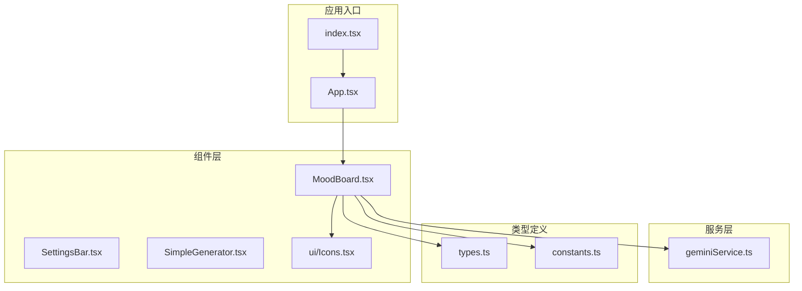
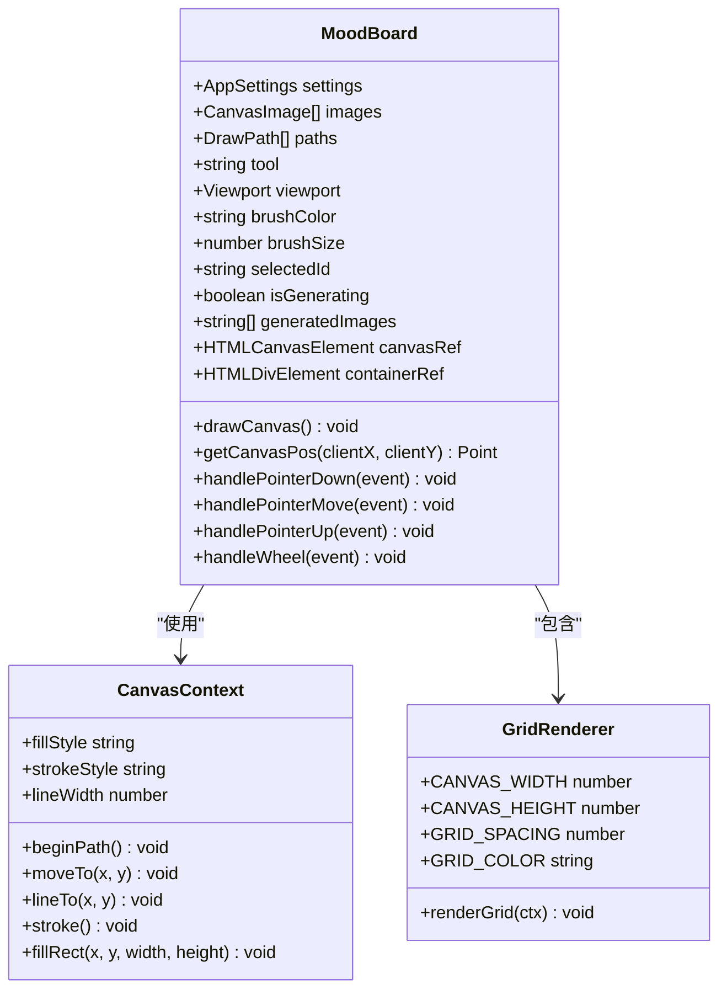
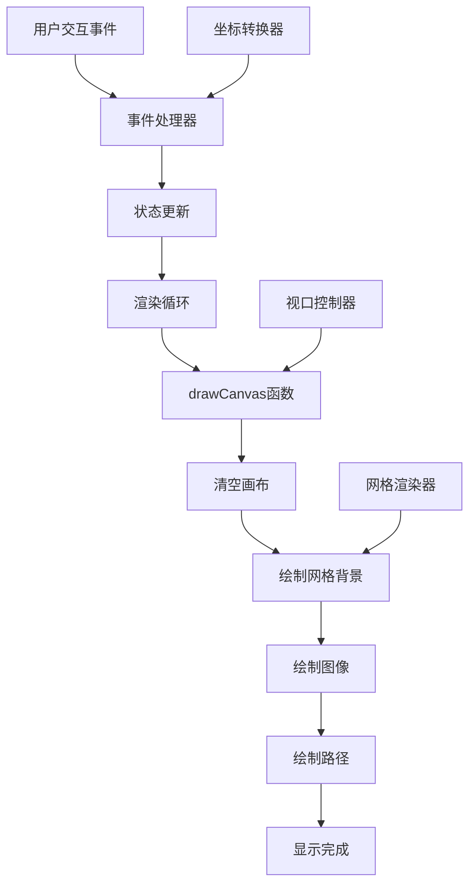
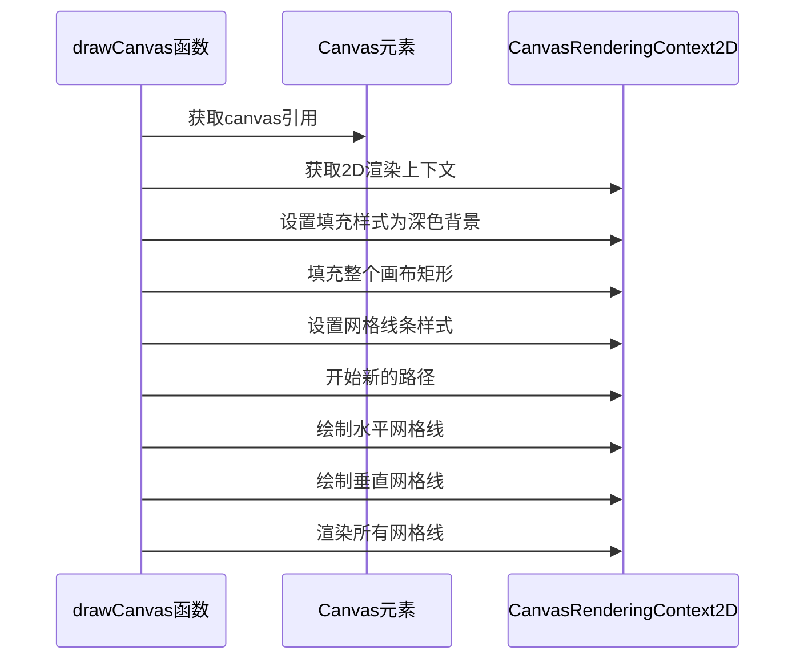
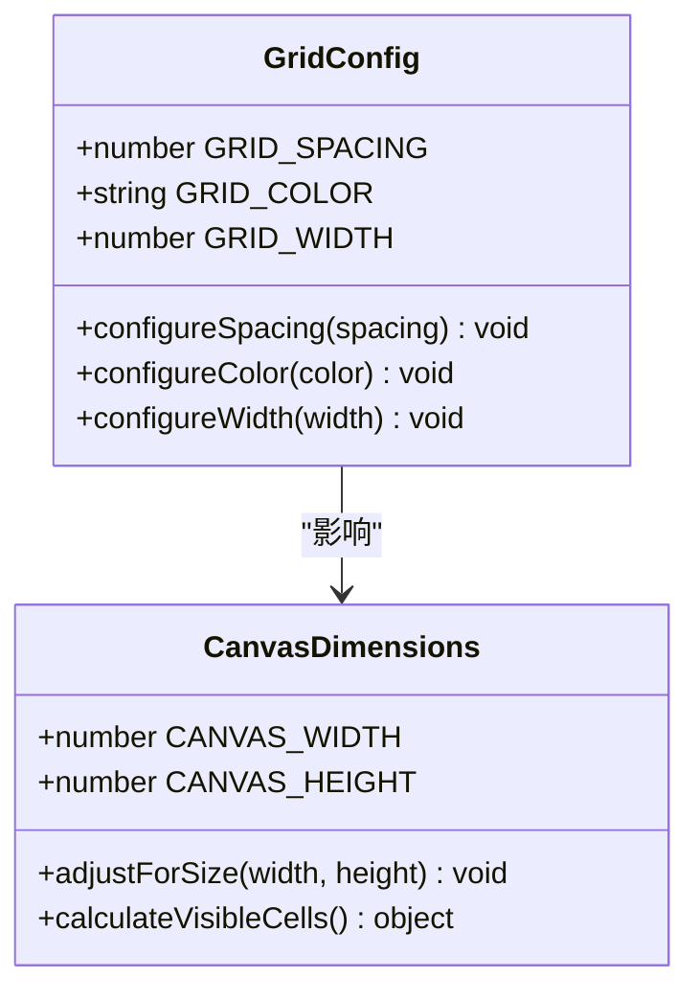
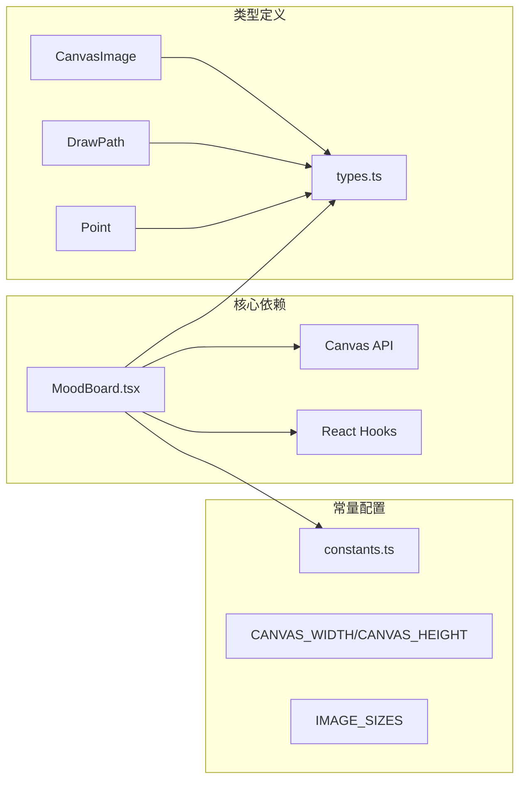

# 网格背景渲染

<cite>
**本文档中引用的文件**
- [MoodBoard.tsx](file://components/MoodBoard.tsx)
- [types.ts](file://types.ts)
- [constants.ts](file://constants.ts)
</cite>

## 目录
1. [简介](#简介)
2. [项目结构概述](#项目结构概述)
3. [核心组件分析](#核心组件分析)
4. [架构概览](#架构概览)
5. [详细组件分析](#详细组件分析)
6. [依赖关系分析](#依赖关系分析)
7. [性能考虑](#性能考虑)
8. [故障排除指南](#故障排除指南)
9. [结论](#结论)

## 简介

MoodBoard组件是BananaCanvase应用程序的核心绘图界面，其中网格背景的绘制实现是一个精心设计的功能模块。该系统通过`drawCanvas`函数实现了100x100像素间距的浅灰色网格线绘制，为用户提供了直观的空间参考和布局辅助功能。

网格背景作为底层参考元素，不仅提升了用户体验，还帮助用户更好地理解画布上的相对位置和比例关系。这种设计体现了现代UI/UX设计中对视觉辅助工具的重视，特别是在创意工作流程中。

## 项目结构概述

MoodBoard组件位于`components/`目录下，采用React函数式组件架构。整个项目遵循模块化设计原则，将不同类型的功能分离到独立的文件中：



**图表来源**
- [MoodBoard.tsx](file://components/MoodBoard.tsx#L1-L50)
- [types.ts](file://types.ts#L1-L61)
- [constants.ts](file://constants.ts#L1-L44)

**章节来源**
- [MoodBoard.tsx](file://components/MoodBoard.tsx#L1-L814)
- [types.ts](file://types.ts#L1-L61)
- [constants.ts](file://constants.ts#L1-L44)

## 核心组件分析

### MoodBoard组件架构

MoodBoard组件采用了现代化的React Hooks模式，结合了状态管理、副作用处理和性能优化技术。组件的核心功能围绕画布渲染展开，其中网格背景绘制是渲染流程中的重要环节。



**图表来源**
- [MoodBoard.tsx](file://components/MoodBoard.tsx#L109-L176)
- [MoodBoard.tsx](file://components/MoodBoard.tsx#L67-L68)

**章节来源**
- [MoodBoard.tsx](file://components/MoodBoard.tsx#L25-L814)

## 架构概览

MoodBoard组件的整体架构体现了分层设计理念，从底层的画布操作到顶层的用户交互，形成了清晰的职责分离：



**图表来源**
- [MoodBoard.tsx](file://components/MoodBoard.tsx#L109-L176)
- [MoodBoard.tsx](file://components/MoodBoard.tsx#L84-L105)

## 详细组件分析

### drawCanvas函数的网格绘制实现

`drawCanvas`函数是网格背景绘制的核心实现，它在每次渲染循环中执行以下步骤：

#### 1. 画布初始化和清理



**图表来源**
- [MoodBoard.tsx](file://components/MoodBoard.tsx#L110-L126)

#### 2. 网格线绘制算法

网格线的绘制采用了高效的批量生成算法，通过两个嵌套循环分别生成水平和垂直线：

```mermaid
flowchart TD
A[开始网格绘制] --> B[设置线条样式]
B --> C[开始新路径]
C --> D[水平线循环]
D --> E[x坐标递增100像素]
E --> F{x <= CANVAS_WIDTH?}
F --> |是| G[移动到起点(x,0)]
G --> H[绘制到终点(x,CANVAS_HEIGHT)]
H --> E
F --> |否| I[垂直线循环]
I --> J[y坐标递增100像素]
J --> K{y <= CANVAS_HEIGHT?}
K --> |是| L[移动到起点(0,y)]
L --> M[绘制到终点(CANVAS_WIDTH,y)]
M --> J
K --> |否| N[完成网格绘制]
N --> O[渲染路径]
```

**图表来源**
- [MoodBoard.tsx](file://components/MoodBoard.tsx#L120-L126)

#### 3. 网格线样式配置

网格线的样式配置体现了对视觉层次和可用性的精心考虑：

| 属性 | 值 | 说明 |
|------|-----|------|
| strokeStyle | '#334155' | 浅灰色，与深色背景形成对比但不刺眼 |
| lineWidth | 1 | 细线，避免干扰主要内容 |
| 路径类型 | 实线 | 连续线条，提供清晰的网格边界 |

#### 4. 底层参考元素的设计意图

网格线作为底层参考元素，具有以下设计目标：

- **视觉辅助**：为用户提供空间定位参考
- **比例参照**：帮助用户理解元素间的相对大小
- **布局指导**：支持精确的布局和对齐操作
- **可配置性**：支持不同间距和样式的调整

**章节来源**
- [MoodBoard.tsx](file://components/MoodBoard.tsx#L109-L176)

### 网格线间距的可配置性

虽然当前实现固定为100x100像素的间距，但代码结构支持灵活的配置：



**图表来源**
- [MoodBoard.tsx](file://components/MoodBoard.tsx#L67-L68)

### 不同画布尺寸的适应性

网格系统针对2048x2048像素的标准画布进行了优化，但在更大的画布尺寸下也能良好工作：

- **标准画布**：10个网格单元（2048 ÷ 100 ≈ 20.48）
- **大画布**：支持更高分辨率的网格密度
- **小画布**：自动调整网格密度以保持可见性

**章节来源**
- [MoodBoard.tsx](file://components/MoodBoard.tsx#L67-L68)

## 依赖关系分析

MoodBoard组件的网格绘制功能与其他模块存在密切的依赖关系：



**图表来源**
- [MoodBoard.tsx](file://components/MoodBoard.tsx#L1-L15)
- [types.ts](file://types.ts#L12-L34)
- [constants.ts](file://constants.ts#L14-L18)

**章节来源**
- [MoodBoard.tsx](file://components/MoodBoard.tsx#L1-L15)
- [types.ts](file://types.ts#L1-L61)
- [constants.ts](file://constants.ts#L1-L44)

## 性能考虑

网格绘制的性能优化体现在以下几个方面：

### 渲染效率
- **批量操作**：使用单次`stroke()`调用渲染所有网格线
- **路径复用**：避免重复的路径创建和销毁
- **最小化重绘**：只在必要时重新绘制网格

### 内存管理
- **即时释放**：绘制完成后立即释放临时对象
- **避免累积**：不保存网格线的状态信息

### 用户体验
- **流畅动画**：配合requestAnimationFrame实现平滑渲染
- **响应式设计**：适应不同的画布尺寸和缩放级别

## 故障排除指南

### 常见问题及解决方案

| 问题 | 可能原因 | 解决方案 |
|------|----------|----------|
| 网格线不可见 | 颜色对比度过低 | 调整GRID_COLOR值 |
| 网格线模糊 | 缩放级别过高 | 实现动态网格密度 |
| 性能问题 | 频繁重绘 | 优化渲染频率 |
| 坐标错误 | 视口变换未正确应用 | 检查getCanvasPos函数 |

### 调试技巧
- 使用浏览器开发者工具检查Canvas上下文
- 验证网格线的坐标计算准确性
- 监控渲染性能指标

**章节来源**
- [MoodBoard.tsx](file://components/MoodBoard.tsx#L84-L105)

## 结论

MoodBoard组件中的网格背景绘制实现展现了现代Web应用开发中对用户体验和技术实现的平衡。通过精心设计的`drawCanvas`函数，系统成功地在保持高性能的同时提供了有价值的视觉辅助功能。

网格背景不仅是一个简单的装饰元素，更是整个绘图工作流程中的重要组成部分。它体现了以下设计原则：
- **功能性优先**：网格线直接服务于用户的创作需求
- **性能优化**：高效的绘制算法确保流畅的用户体验
- **可扩展性**：模块化的架构支持未来的功能增强
- **一致性**：统一的设计语言提升整体应用体验

这种实现方式为其他类似项目的开发提供了宝贵的参考价值，展示了如何在复杂的交互环境中优雅地处理视觉辅助功能。