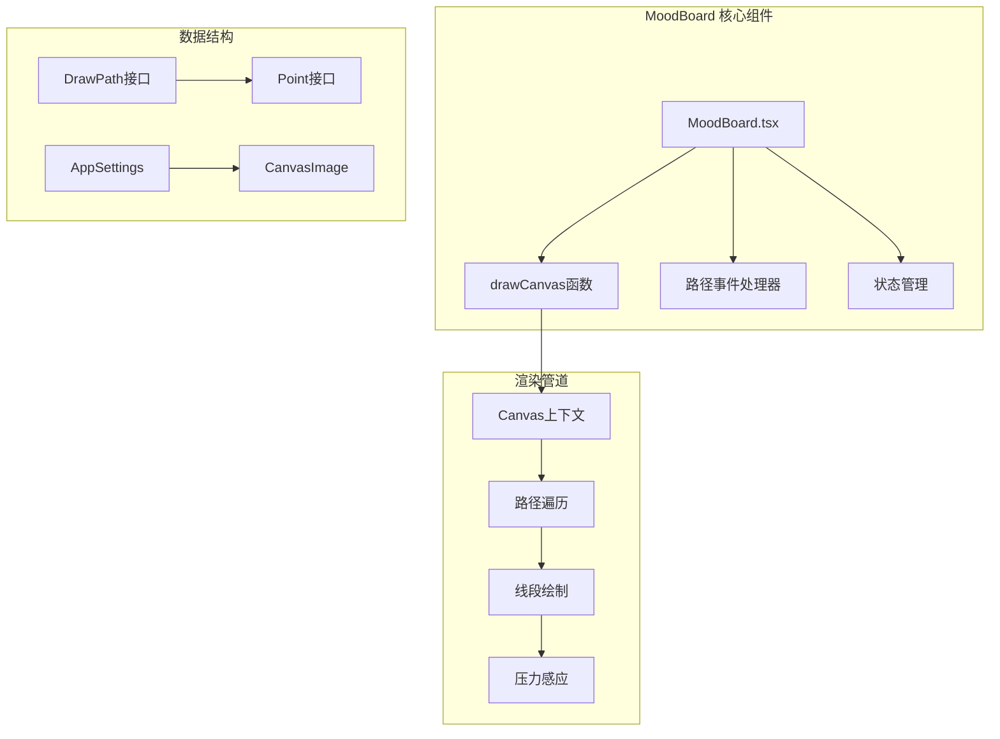
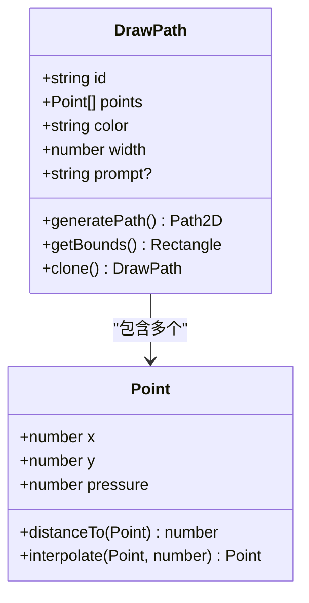
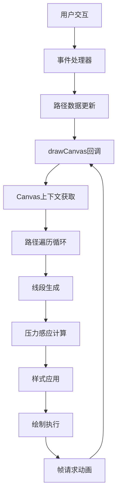
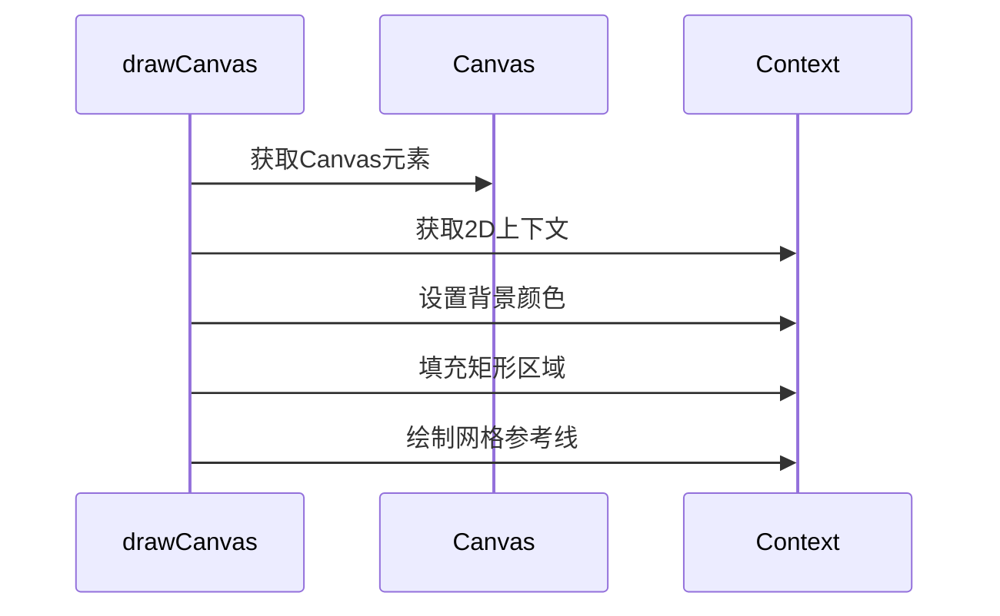
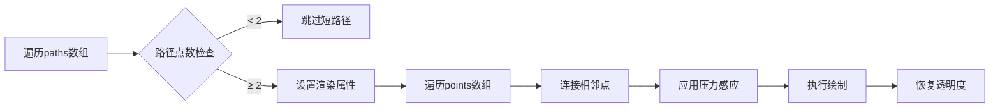
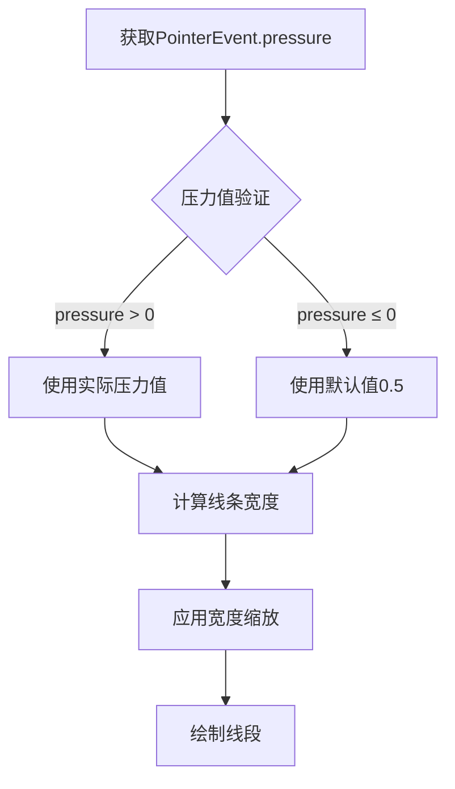
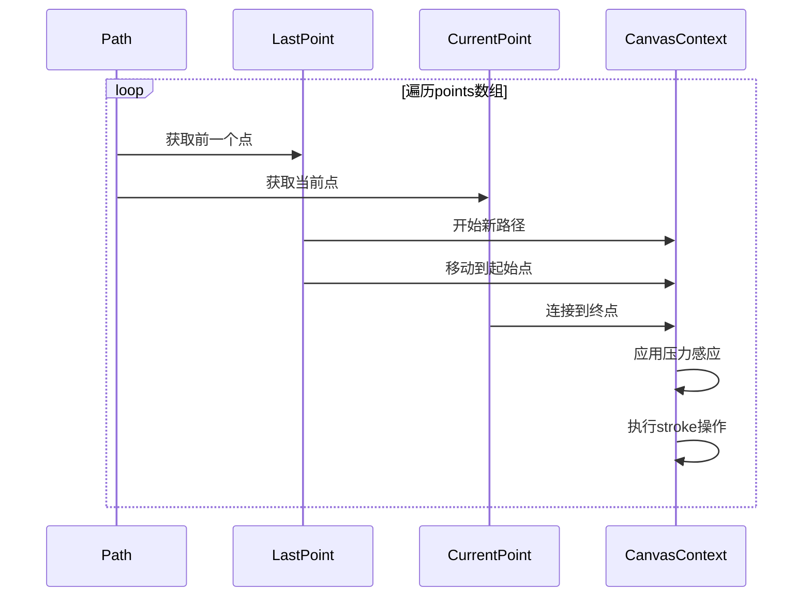
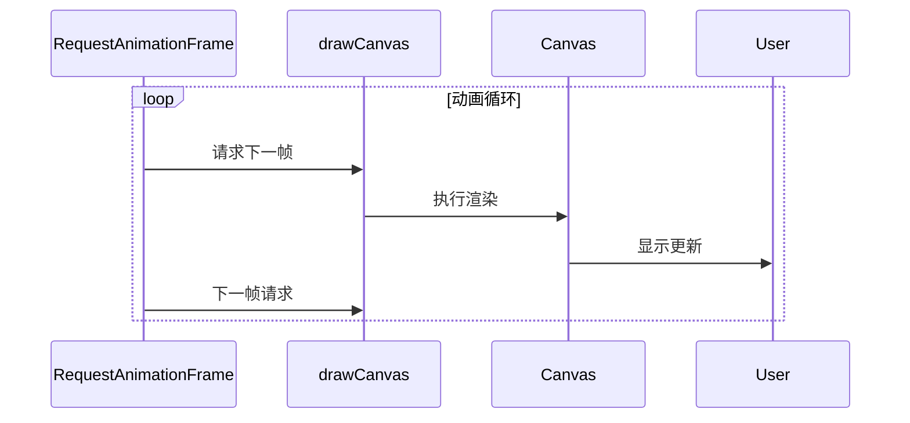
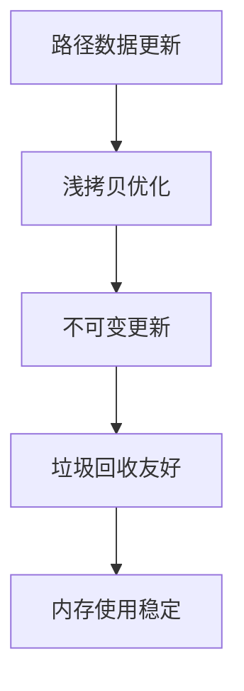

# 路径渲染

<cite>
**本文档中引用的文件**
- [MoodBoard.tsx](file://components/MoodBoard.tsx)
- [types.ts](file://types.ts)
- [constants.ts](file://constants.ts)
</cite>

## 目录
1. [简介](#简介)
2. [项目结构概览](#项目结构概览)
3. [核心数据结构](#核心数据结构)
4. [路径渲染架构](#路径渲染架构)
5. [drawCanvas函数深度分析](#drawcanvas函数深度分析)
6. [压力感应支持实现](#压力感应支持实现)
7. [路径分段绘制算法](#路径分段绘制算法)
8. [视觉属性配置](#视觉属性配置)
9. [性能考量与优化策略](#性能考量与优化策略)
10. [总结](#总结)

## 简介

MoodBoard组件是一个功能强大的数字绘画工具，其核心功能之一是实现高质量的路径渲染系统。该系统能够处理用户绘制的复杂路径，支持压力感应、实时预览和多种渲染模式。本文档将深入分析路径渲染的完整流程，从数据结构设计到最终的视觉呈现。

## 项目结构概览

MoodBoard组件采用模块化架构设计，主要包含以下关键部分：



**图表来源**
- [MoodBoard.tsx](file://components/MoodBoard.tsx#L1-L50)
- [types.ts](file://types.ts#L27-L33)

**章节来源**
- [MoodBoard.tsx](file://components/MoodBoard.tsx#L1-L100)
- [types.ts](file://types.ts#L1-L61)

## 核心数据结构

### DrawPath 接口

DrawPath是路径渲染系统的核心数据结构，定义了单个绘制路径的所有必要属性：



**图表来源**
- [types.ts](file://types.ts#L27-L33)
- [types.ts](file://types.ts#L22-L26)

### Point 接口

Point接口扩展了基本坐标系统，集成了压力感应信息：

| 属性 | 类型 | 描述 | 默认值 |
|------|------|------|--------|
| x | number | X轴坐标 | - |
| y | number | Y轴坐标 | - |
| pressure | number | 压力感应值 (0-1) | 0.5 |

**章节来源**
- [types.ts](file://types.ts#L22-L33)

## 路径渲染架构

路径渲染系统采用分层架构，确保高效的渲染性能和灵活的扩展性：



**图表来源**
- [MoodBoard.tsx](file://components/MoodBoard.tsx#L98-L165)
- [MoodBoard.tsx](file://components/MoodBoard.tsx#L167-L176)

**章节来源**
- [MoodBoard.tsx](file://components/MoodBoard.tsx#L98-L176)

## drawCanvas函数深度分析

drawCanvas函数是路径渲染的核心引擎，负责遍历所有路径并执行绘制操作：

### 函数签名与依赖

drawCanvas使用useCallback优化性能，依赖于images、paths和selectedId状态：

```typescript
const drawCanvas = useCallback(() => {
    // 渲染逻辑实现
}, [images, paths, selectedId]);
```

### 渲染流程详解

#### 1. Canvas初始化与清理



**图表来源**
- [MoodBoard.tsx](file://components/MoodBoard.tsx#L100-L116)

#### 2. 路径渲染主循环

路径渲染遵循严格的优先级顺序：图像层 → 路径层 → 选择高亮层。



**图表来源**
- [MoodBoard.tsx](file://components/MoodBoard.tsx#L141-L164)

**章节来源**
- [MoodBoard.tsx](file://components/MoodBoard.tsx#L98-L165)

## 压力感应支持实现

压力感应是现代绘图应用的重要特性，MoodBoard通过PointerEvent.pressure属性实现动态线条粗细调节：

### 压力值范围与计算

| 压力范围 | 效果描述 | 计算公式 |
|----------|----------|----------|
| 0.0-0.5 | 最小线条宽度 | `width × (0.5 + pressure)` |
| 0.5-1.0 | 正常到最大宽度 | `width × (0.5 + pressure)` |
| 默认值 | 防抖处理 | `pressure > 0 ? pressure : 0.5` |

### 压力感应算法实现



**图表来源**
- [MoodBoard.tsx](file://components/MoodBoard.tsx#L158-L160)
- [MoodBoard.tsx](file://components/MoodBoard.tsx#L461-L463)

### 不同模式下的压力处理

| 渲染模式 | 压力处理方式 | 最小宽度限制 |
|----------|--------------|--------------|
| 普通模式 | 标准压力缩放 | 无限制 |
| 遮罩模式 | 加强覆盖能力 | 5像素最小宽度 |

**章节来源**
- [MoodBoard.tsx](file://components/MoodBoard.tsx#L158-L160)
- [MoodBoard.tsx](file://components/MoodBoard.tsx#L461-L463)

## 路径分段绘制算法

路径分段绘制是实现平滑曲线的关键技术，通过连接相邻点形成连续的线条：

### 算法流程



**图表来源**
- [MoodBoard.tsx](file://components/MoodBoard.tsx#L150-L161)

### 分段绘制的具体实现

每个路径段的绘制过程包含以下步骤：

1. **路径开始**：调用`ctx.beginPath()`启动新路径
2. **定位起点**：使用`ctx.moveTo(p1.x, p1.y)`定位起始点
3. **连接终点**：使用`ctx.lineTo(p2.x, p2.y)`连接到下一个点
4. **压力计算**：基于`p2.pressure`计算最终线条宽度
5. **绘制执行**：调用`ctx.stroke()`完成绘制

**章节来源**
- [MoodBoard.tsx](file://components/MoodBoard.tsx#L150-L161)

## 视觉属性配置

MoodBoard的路径渲染系统提供了丰富的视觉属性配置，确保用户获得良好的绘图体验：

### 核心视觉属性

| 属性名称 | 配置值 | 作用描述 |
|----------|--------|----------|
| lineCap | 'round' | 圆角端点，避免尖锐边缘 |
| lineJoin | 'round' | 圆角连接，平滑转角 |
| globalAlpha | 0.6 | 半透明效果，便于观察底层 |
| strokeStyle | path.color | 使用路径指定的颜色 |

### 渲染模式对比


**图表来源**
- [MoodBoard.tsx](file://components/MoodBoard.tsx#L144-L147)
- [MoodBoard.tsx](file://components/MoodBoard.tsx#L447-L451)

### 透明度策略

透明度的应用具有明确的目的性：
- **普通模式**：0.6透明度让用户能够看到底层图像，便于精确绘制
- **遮罩模式**：1.0完全不透明确保AI识别的准确性
- **动态切换**：每次渲染后自动恢复到1.0，避免影响后续绘制

**章节来源**
- [MoodBoard.tsx](file://components/MoodBoard.tsx#L144-L164)
- [MoodBoard.tsx](file://components/MoodBoard.tsx#L447-L467)

## 性能考量与优化策略

路径渲染系统的性能优化涉及多个层面，从数据结构设计到渲染算法实现：

### 渲染性能优化

#### 1. 帧率控制与动画循环



**图表来源**
- [MoodBoard.tsx](file://components/MoodBoard.tsx#L167-L176)

#### 2. 条件渲染优化

系统实现了智能的条件渲染机制：

| 优化策略 | 实现位置 | 性能收益 |
|----------|----------|----------|
| 短路径过滤 | `path.points.length < 2` | 避免无效渲染 |
| 状态缓存 | useCallback优化 | 减少不必要的重渲染 |
| 上下文复用 | 单次获取上下文 | 避免重复DOM查询 |

#### 3. 内存管理



**图表来源**
- [MoodBoard.tsx](file://components/MoodBoard.tsx#L254-L263)

### 大量路径场景的性能策略

当面对大量路径时，系统采用以下优化策略：

1. **增量更新**：只重新渲染变化的部分
2. **批量处理**：将多个路径合并为单次绘制操作
3. **视口裁剪**：只渲染可见区域内的路径
4. **LOD系统**：根据缩放级别调整路径细节

**章节来源**
- [MoodBoard.tsx](file://components/MoodBoard.tsx#L167-L176)
- [MoodBoard.tsx](file://components/MoodBoard.tsx#L254-L263)

## 总结

MoodBoard的路径渲染系统展现了现代Web绘图应用的技术精髓。通过精心设计的数据结构、高效的渲染算法和智能的性能优化，系统实现了流畅的用户体验和高质量的视觉效果。

### 关键技术亮点

1. **压力感应支持**：通过PointerEvent.pressure实现动态线条粗细调节
2. **分段绘制算法**：连接相邻点形成平滑曲线，支持复杂的路径形状
3. **多模式渲染**：普通模式和遮罩模式满足不同使用场景的需求
4. **性能优化策略**：动画循环、条件渲染和内存管理确保系统高效运行

### 设计哲学

系统的设计体现了"可用性优先"的理念：
- 用户友好的压力感应让绘图更加自然
- 半透明预览帮助用户精确定位
- 模式切换适应不同的创作需求
- 性能优化保证流畅的交互体验

这种平衡了功能性、易用性和性能的设计方案，为用户提供了专业级的数字绘画体验。