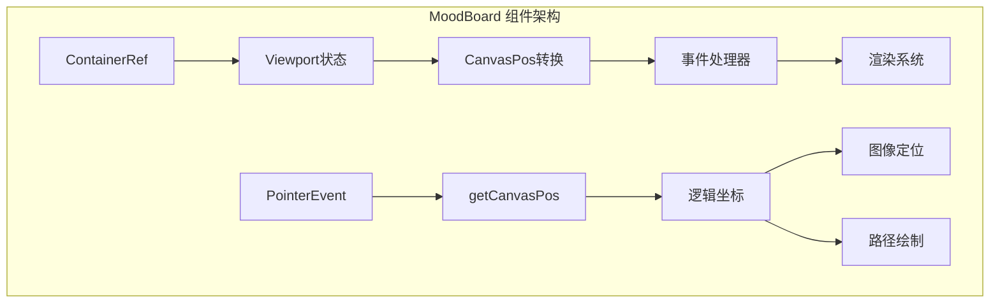
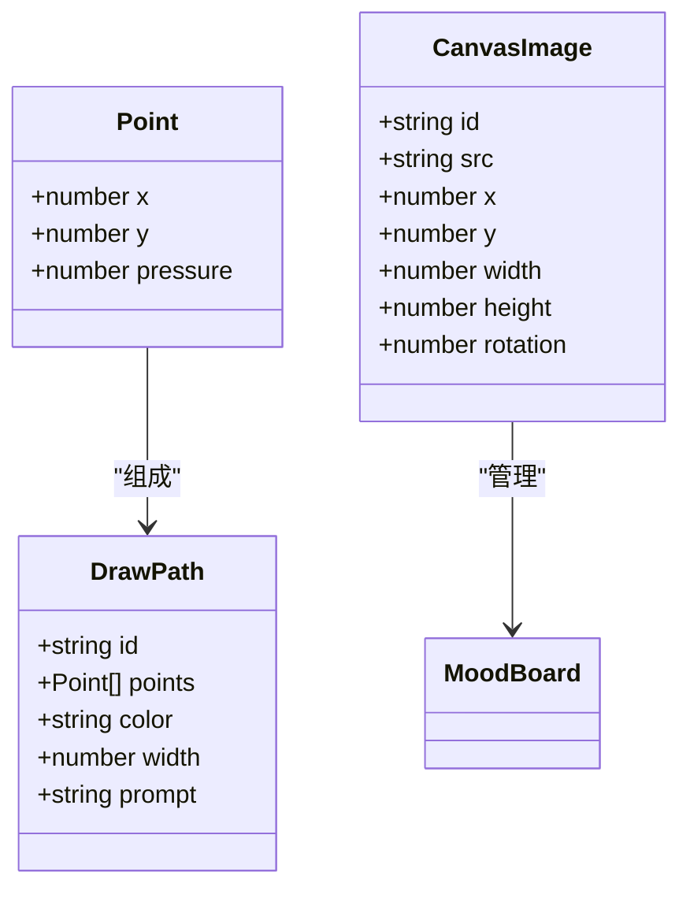
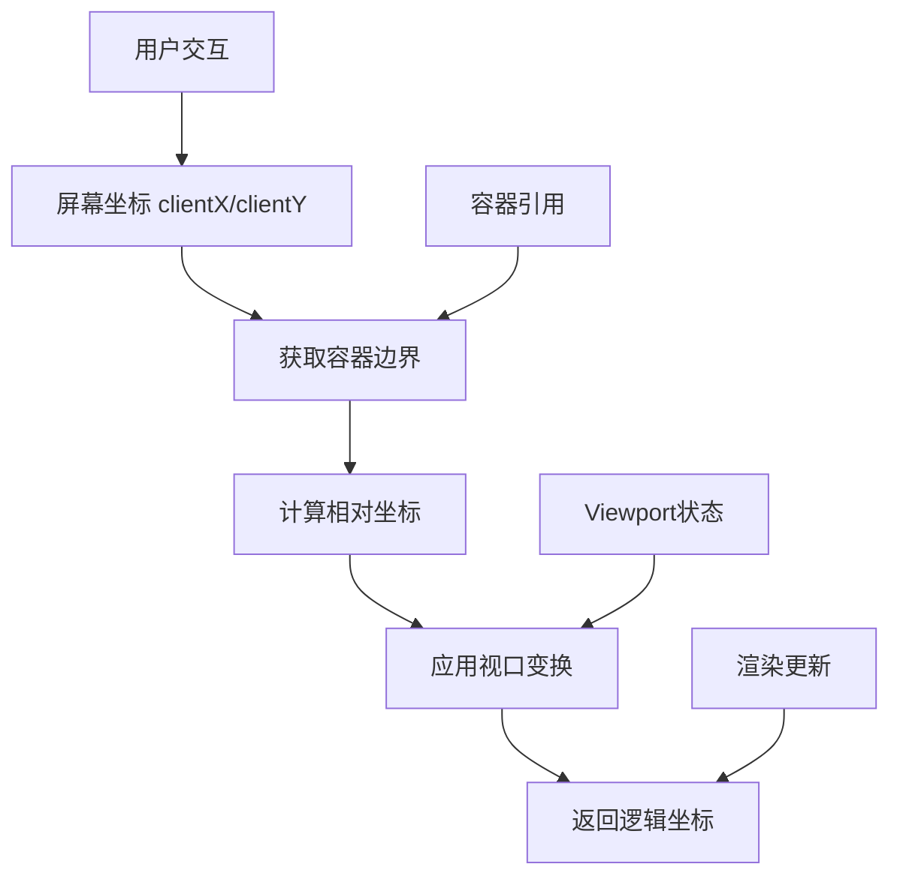
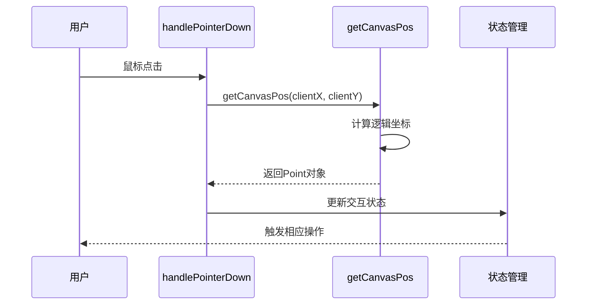

# 坐标转换系统

<cite>
**本文档中引用的文件**
- [MoodBoard.tsx](file://components/MoodBoard.tsx)
- [types.ts](file://types.ts)
- [constants.ts](file://constants.ts)
</cite>

## 目录
1. [简介](#简介)
2. [项目结构概览](#项目结构概览)
3. [核心组件分析](#核心组件分析)
4. [坐标转换系统架构](#坐标转换系统架构)
5. [getCanvasPos函数深度解析](#getcanvaspos函数深度解析)
6. [坐标转换公式推导](#坐标转换公式推导)
7. [实际应用场景](#实际应用场景)
8. [性能考虑](#性能考虑)
9. [故障排除指南](#故障排除指南)
10. [总结](#总结)

## 简介

MoodBoard组件的坐标转换系统是整个应用程序的核心功能之一，负责将用户在屏幕上点击的屏幕坐标（clientX/clientY）准确转换为画布内部的逻辑坐标。这个系统通过`getCanvasPos`函数实现，它处理了复杂的视口变换、缩放和平移操作，确保用户在不同缩放级别下的精确交互体验。

该系统的关键特性包括：
- 屏幕坐标到画布坐标的精确转换
- 支持动态缩放和平移操作
- 实时坐标变换计算
- 多种交互工具的坐标适配

## 项目结构概览

MoodBoard组件位于`components/MoodBoard.tsx`文件中，采用React函数式组件设计。整个坐标转换系统围绕以下核心元素构建：



**图表来源**
- [MoodBoard.tsx](file://components/MoodBoard.tsx#L42-L46)
- [MoodBoard.tsx](file://components/MoodBoard.tsx#L72-L84)

**章节来源**
- [MoodBoard.tsx](file://components/MoodBoard.tsx#L1-L50)

## 核心组件分析

### 视口状态管理

MoodBoard组件维护一个复杂的视口状态，包含三个关键属性：

| 属性 | 类型 | 描述 | 默认值 |
|------|------|------|--------|
| x | number | 水平平移偏移量 | 0 |
| y | number | 垂直平移偏移量 | 0 |
| scale | number | 缩放因子 | 1 |

这些状态通过React的useState钩子管理，允许实时响应用户的缩放和平移操作。

### 引用对象系统

组件使用多个React引用对象来管理DOM元素：

- `canvasRef`: 指向HTMLCanvasElement，用于直接Canvas操作
- `containerRef`: 指向HTMLDivElement，作为视口容器
- `fileInputRef`: 指向HTMLInputElement，处理文件上传

### 数据类型定义

系统定义了几个关键的数据类型来支持坐标转换：



**图表来源**
- [types.ts](file://types.ts#L22-L50)

**章节来源**
- [MoodBoard.tsx](file://components/MoodBoard.tsx#L39-L46)
- [types.ts](file://types.ts#L12-L50)

## 坐标转换系统架构

坐标转换系统采用分层架构设计，从屏幕坐标到画布坐标的完整转换流程如下：



**图表来源**
- [MoodBoard.tsx](file://components/MoodBoard.tsx#L72-L84)

系统的核心思想是将容器（container）视为窗口，内容（canvas）是被变换的对象。这种设计允许系统在保持视觉一致性的同时，实现复杂的坐标变换。

## getCanvasPos函数深度解析

`getCanvasPos`函数是坐标转换系统的核心，它实现了从屏幕坐标到画布逻辑坐标的转换。让我们深入分析其实现细节：

### 函数签名和输入验证

函数接受两个参数：`clientX`和`clientY`，分别代表PointerEvent的水平和垂直屏幕坐标。函数首先进行必要的空值检查，确保容器和画布引用都存在。

### 容器边界获取

```typescript
const rect = containerRef.current.getBoundingClientRect();
```

这行代码获取容器元素的边界矩形信息，包括：
- `rect.left`: 容器左边缘相对于视口的水平距离
- `rect.top`: 容器上边缘相对于视口的垂直距离

### 坐标转换算法

转换的核心公式是：

```typescript
const x = (clientX - rect.left - viewport.x) / viewport.scale;
const y = (clientY - rect.top - viewport.y) / viewport.scale;
```

这个公式的数学原理基于逆向变换的概念。让我们逐步分解这个过程：

1. **相对坐标计算**: `(clientX - rect.left)` 将屏幕坐标转换为容器内的相对坐标
2. **视口偏移补偿**: `(... - viewport.x)` 考虑当前的平移偏移
3. **缩放因子应用**: `/ viewport.scale` 将坐标恢复到原始比例

### 返回值结构

函数返回一个Point对象，包含：
- `x`: 转换后的水平坐标
- `y`: 转换后的垂直坐标  
- `pressure`: 触控压力值（固定为0.5）

**章节来源**
- [MoodBoard.tsx](file://components/MoodBoard.tsx#L72-L84)

## 坐标转换公式推导

为了更好地理解坐标转换的数学原理，我们可以通过几何变换的角度来分析：

### 正向变换矩阵

当系统渲染内容时，应用了以下变换矩阵：

```
transform: `translate(${viewport.x}px, ${viewport.y}px) scale(${viewport.scale})`
```

这等价于以下数学变换：

```
x' = x × scale + tx
y' = y × scale + ty
```

其中：
- `(x, y)`: 画布内部的原始坐标
- `(x', y')`: 屏幕上的显示坐标
- `scale`: 缩放因子
- `tx, ty`: 平移偏移量

### 逆向变换求解

要从屏幕坐标`(clientX, clientY)`找到画布坐标`(x, y)`，我们需要求解上述方程组的逆：

```
x = (x' - tx) / scale
y = (y' - ty) / scale
```

这就是`getCanvasPos`函数中使用的公式。

### 数学推导过程

假设：
- `rect.left` 和 `rect.top` 是容器相对于视口的位置
- `viewport.x` 和 `viewport.y` 是当前的平移偏移
- `viewport.scale` 是当前的缩放因子

那么完整的转换公式为：

```
x = (clientX - rect.left - viewport.x) / viewport.scale
y = (clientY - rect.top - viewport.y) / viewport.scale
```

这个公式的几何意义是：
1. 首先减去容器的左边界偏移，得到容器内的相对坐标
2. 再减去视口的平移偏移，得到未缩放的原始坐标
3. 最后除以缩放因子，得到画布内部的实际坐标

**章节来源**
- [MoodBoard.tsx](file://components/MoodBoard.tsx#L72-L84)

## 实际应用场景

坐标转换系统在MoodBoard的多个场景中发挥关键作用：

### handlePointerDown事件处理

在鼠标按下事件中，坐标转换用于：



**图表来源**
- [MoodBoard.tsx](file://components/MoodBoard.tsx#L200-L240)

### handlePointerMove事件处理

在鼠标移动事件中，坐标转换用于：

1. **绘图路径更新**: 实时计算新的路径点
2. **图像拖拽**: 计算图像的新位置
3. **视口平移**: 更新视口状态

### addGeneratedToBoard函数

在添加生成的图像时，坐标转换确保新图像正确居中：

```typescript
const centerX = (-viewport.x + containerRef.current!.offsetWidth/2) / viewport.scale;
const centerY = (-viewport.y + containerRef.current!.offsetHeight/2) / viewport.scale;
```

这个公式计算的是视口中心点的画布坐标，确保新图像总是出现在用户视野的中央。

### 缩放操作中的坐标保持

在鼠标滚轮缩放时，系统需要保持鼠标指针下的内容位置不变：

```typescript
const newX = mouseX - (mouseX - viewport.x) * (newScale / viewport.scale);
const newY = mouseY - (mouseY - viewport.y) * (newScale / viewport.scale);
```

这个算法确保当缩放级别改变时，鼠标指针指向的内容不会发生位移。

**章节来源**
- [MoodBoard.tsx](file://components/MoodBoard.tsx#L200-L278)
- [MoodBoard.tsx](file://components/MoodBoard.tsx#L528-L546)
- [MoodBoard.tsx](file://components/MoodBoard.tsx#L290-L308)

## 性能考虑

坐标转换系统在性能方面采用了多种优化策略：

### 计算复杂度分析

- **时间复杂度**: O(1)，所有计算都是基本的算术运算
- **空间复杂度**: O(1)，只使用少量临时变量
- **缓存友好**: 使用React引用避免重复DOM查询

### 优化策略

1. **引用缓存**: 使用`containerRef.current`和`canvasRef.current`避免重复调用`getBoundingClientRect()`
2. **状态管理**: 通过React状态系统确保只有必要时才重新计算
3. **事件节流**: 在高频事件（如mousemove）中合理使用防抖或节流

### 内存管理

系统通过以下方式优化内存使用：
- 及时释放不需要的临时对象
- 避免在渲染循环中创建新的对象实例
- 合理使用React的`useCallback`和`useMemo`钩子

## 故障排除指南

### 常见问题及解决方案

#### 1. 坐标不匹配问题

**症状**: 用户点击位置与实际响应位置不一致
**原因**: 
- 容器引用为空
- 视口状态未正确更新
- 缩放因子异常

**解决方案**:
- 检查`containerRef.current`是否正确初始化
- 验证`viewport.scale`是否在合理范围内（0.1-5）
- 确保在正确的时机调用坐标转换函数

#### 2. 缩放时位置漂移

**症状**: 缩放后内容位置发生意外移动
**原因**: 
- 鼠标位置计算错误
- 视口偏移量更新不正确

**解决方案**:
- 验证鼠标事件的clientX/clientY值
- 检查视口状态更新逻辑
- 确保缩放中心计算正确

#### 3. 性能问题

**症状**: 坐标转换导致界面卡顿
**原因**:
- 频繁的DOM查询
- 不必要的重新计算

**解决方案**:
- 使用React引用缓存DOM元素
- 避免在渲染循环中进行复杂计算
- 考虑使用Web Workers处理大量数据

**章节来源**
- [MoodBoard.tsx](file://components/MoodBoard.tsx#L72-L84)

## 总结

MoodBoard组件的坐标转换系统是一个精心设计的解决方案，它成功地解决了现代Web应用程序中常见的坐标变换挑战。通过`getCanvasPos`函数，系统实现了：

### 关键成就

1. **精确性**: 提供了从屏幕坐标到画布坐标的精确转换
2. **灵活性**: 支持动态缩放和平移操作
3. **性能**: 采用高效的算法确保流畅的用户体验
4. **可维护性**: 清晰的代码结构便于理解和扩展

### 技术亮点

- **逆向变换算法**: 通过数学逆运算实现精确的坐标转换
- **状态驱动架构**: 利用React状态管理系统实现响应式更新
- **事件驱动模式**: 通过事件处理器实现用户交互的及时响应

### 应用价值

该坐标转换系统不仅支撑了MoodBoard的核心功能，还为类似的应用程序提供了可参考的设计模式。它的设计理念——将容器视为窗口，内容视为被变换的对象——为处理复杂的视口变换提供了一个优雅的解决方案。

通过深入理解这个系统的工作原理，开发者可以更好地构建具有精确交互能力的Web应用程序，特别是在需要处理复杂图形编辑和可视化任务的场景中。