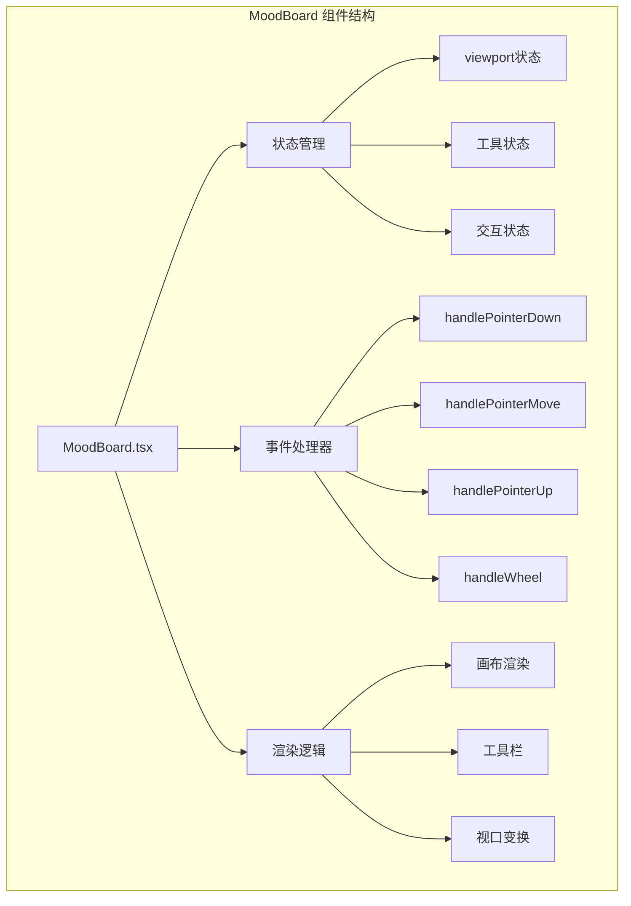
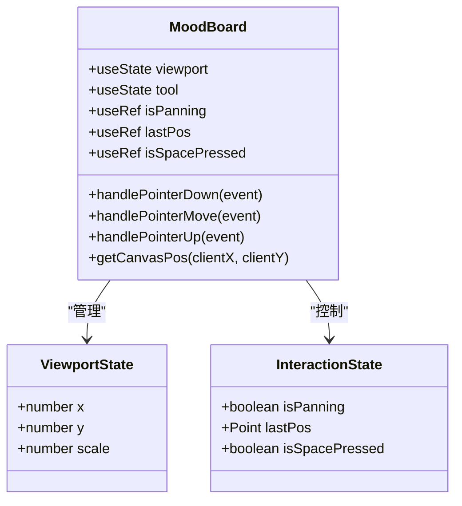
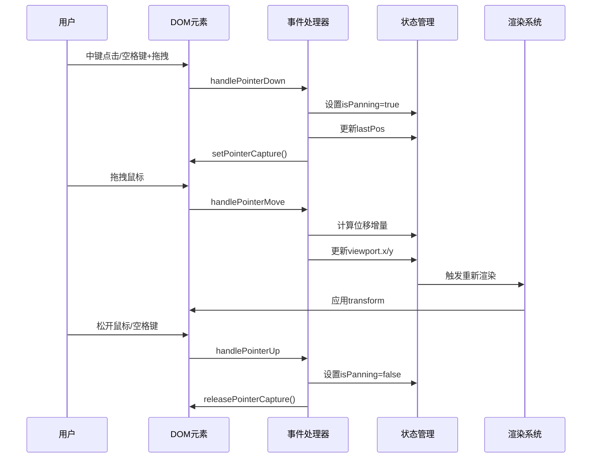
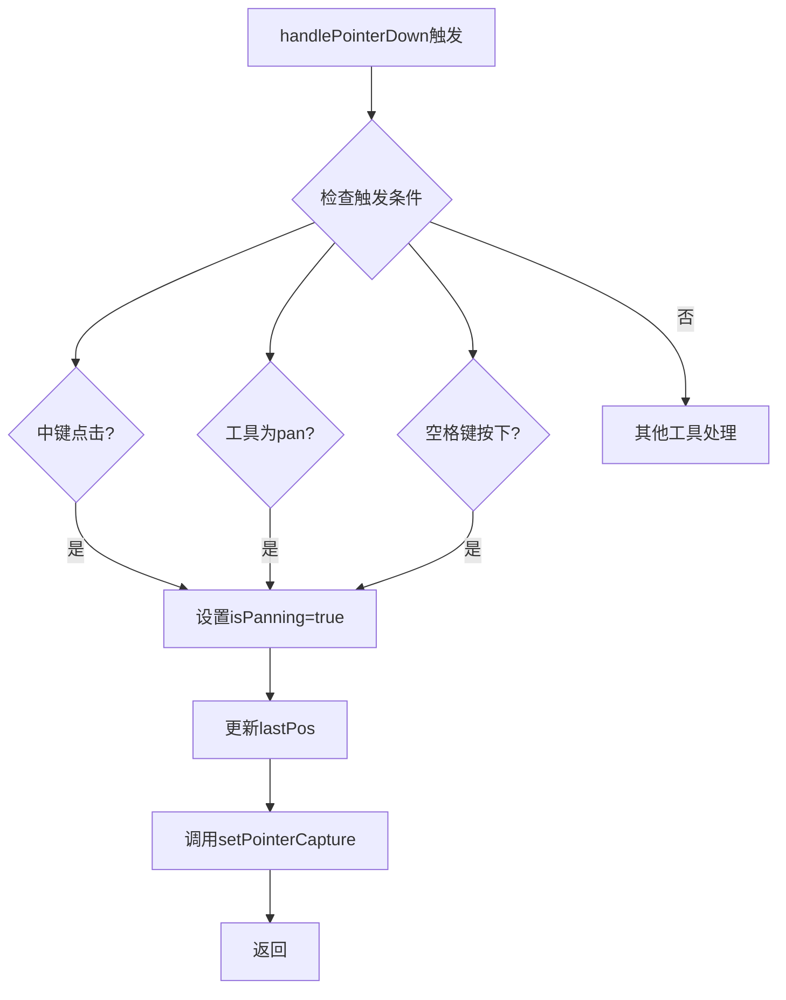
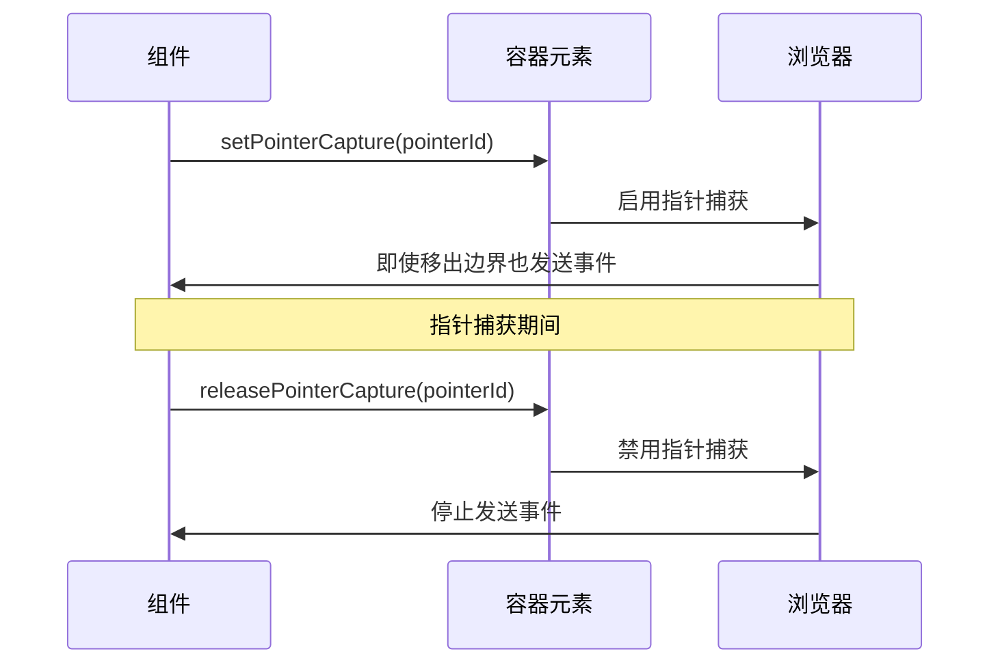
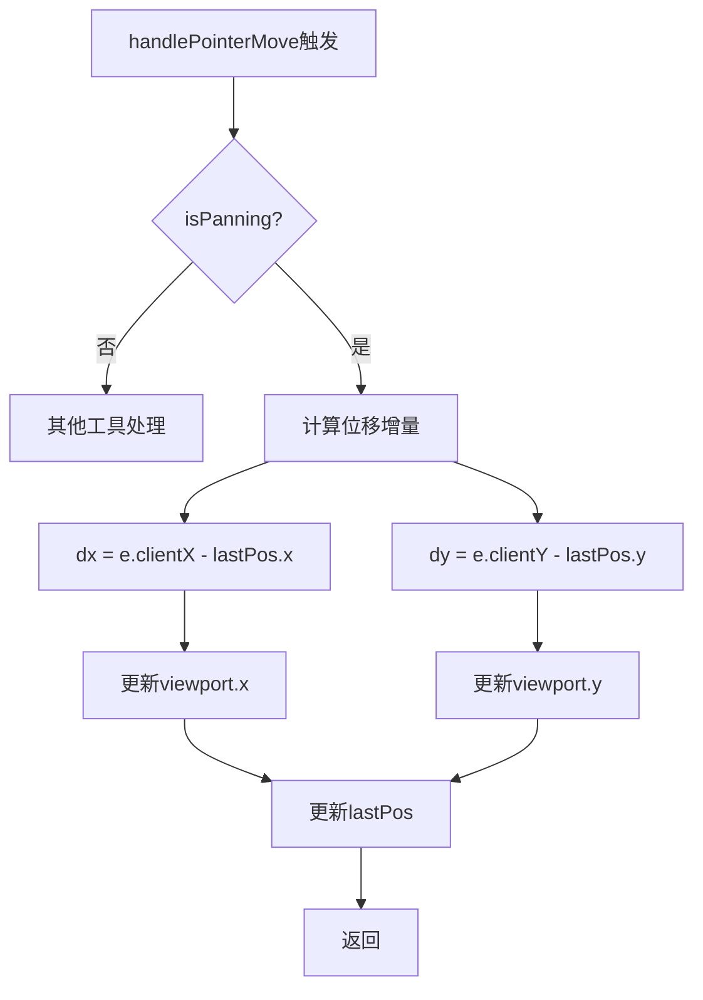
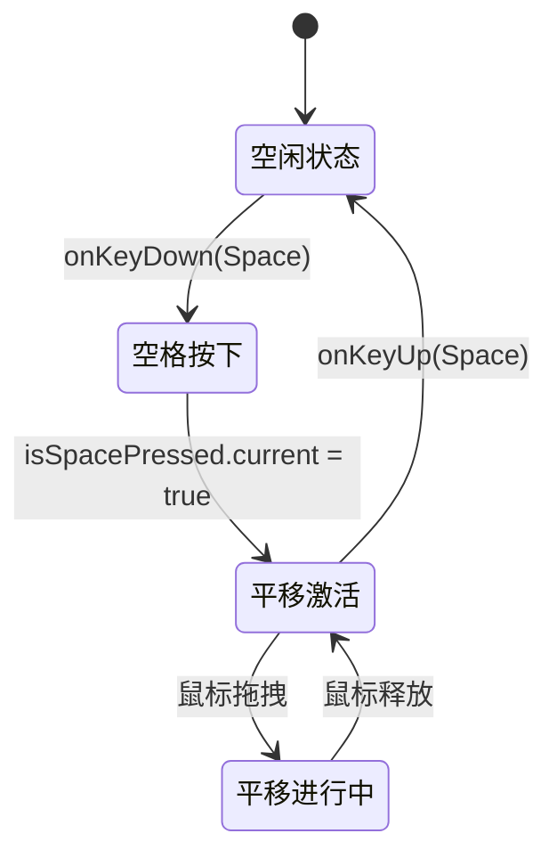
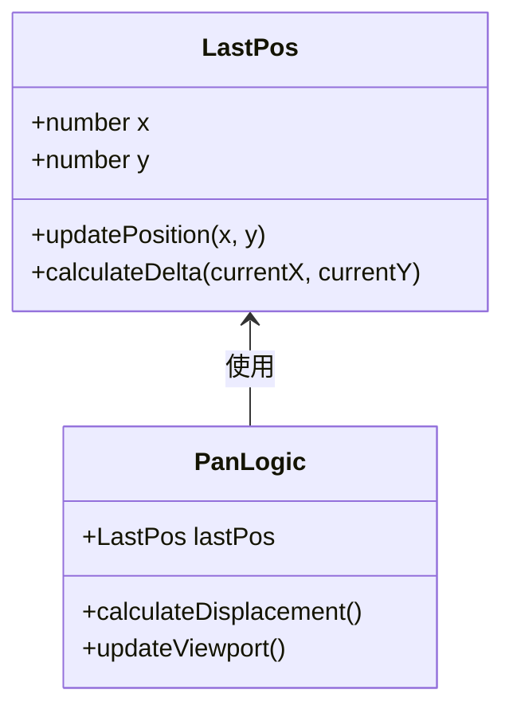
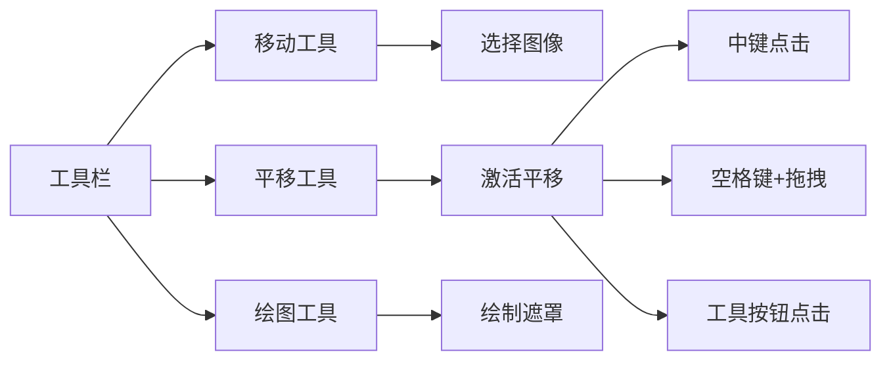
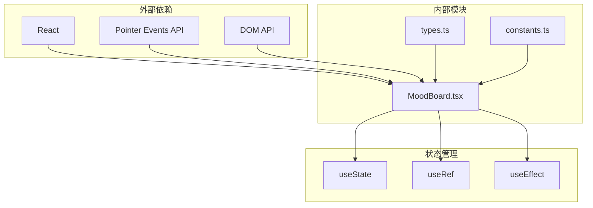

# 平移功能

<cite>
**本文档中引用的文件**
- [MoodBoard.tsx](file://components/MoodBoard.tsx)
- [types.ts](file://types.ts)
- [constants.ts](file://constants.ts)
</cite>

## 目录
1. [简介](#简介)
2. [项目结构概览](#项目结构概览)
3. [核心组件分析](#核心组件分析)
4. [架构概览](#架构概览)
5. [详细组件分析](#详细组件分析)
6. [依赖关系分析](#依赖关系分析)
7. [性能考虑](#性能考虑)
8. [故障排除指南](#故障排除指南)
9. [结论](#结论)

## 简介

MoodBoard组件的平移（Pan）功能是一个复杂而精密的交互系统，允许用户通过多种方式在无限画布上进行视口导航。该功能支持中键点击、空格键激活和平移工具三种触发方式，结合Pointer Capture API确保流畅的拖拽体验。

## 项目结构概览

MoodBoard组件位于`components/MoodBoard.tsx`文件中，采用React函数式组件设计，集成了现代前端开发的最佳实践。组件内部维护了复杂的状态管理系统，包括视口状态、交互状态和工具状态。

**图表来源**
- [MoodBoard.tsx](file://components/MoodBoard.tsx#L23-L770)

**章节来源**
- [MoodBoard.tsx](file://components/MoodBoard.tsx#L1-L770)

## 核心组件分析

### 状态管理架构

MoodBoard组件采用了多层次的状态管理模式：

#### 视口状态（Viewport State）
- `viewport`: 包含x、y坐标和scale缩放值
- 用于控制整个画布的显示位置和缩放级别

#### 工具状态（Tool State）
- `tool`: 当前选择的工具类型（'select' | 'move' | 'draw' | 'pan'）

#### 交互状态（Interaction State）
- `isPanning`: 布尔值，指示是否处于平移模式
- `lastPos`: useRef对象，存储上次鼠标位置用于计算位移
- `isSpacePressed`: useRef对象，跟踪空格键状态

**图表来源**
- [MoodBoard.tsx](file://components/MoodBoard.tsx#L25-L52)

**章节来源**
- [MoodBoard.tsx](file://components/MoodBoard.tsx#L25-L52)

## 架构概览

MoodBoard的平移功能基于React的事件驱动架构，通过指针事件API实现跨平台兼容性。整个系统采用分层设计，从底层的DOM事件处理到高层的业务逻辑实现。

**图表来源**
- [MoodBoard.tsx](file://components/MoodBoard.tsx#L197-L285)

## 详细组件分析

### 平移触发机制

#### handlePointerDown事件处理

handlePointerDown是平移功能的核心入口点，负责检测多种触发条件：

**图表来源**
- [MoodBoard.tsx](file://components/MoodBoard.tsx#L198-L207)

触发条件包括：
1. **中键点击**：`e.button === 1`
2. **工具切换**：`tool === 'pan'`
3. **空格键激活**：`isSpacePressed.current`

当满足任一条件时，系统会：
- 设置`isPanning.current = true`
- 初始化`lastPos.current`为当前鼠标位置
- 调用`containerRef.current?.setPointerCapture(e.pointerId)`启用指针捕获

**章节来源**
- [MoodBoard.tsx](file://components/MoodBoard.tsx#L198-L207)

#### Pointer Capture API的使用

Pointer Capture API是平移功能的关键技术，它确保即使鼠标移出容器边界，也能继续跟踪拖拽操作：

**图表来源**
- [MoodBoard.tsx](file://components/MoodBoard.tsx#L205-L206)
- [MoodBoard.tsx](file://components/MoodBoard.tsx#L283-L284)

**章节来源**
- [MoodBoard.tsx](file://components/MoodBoard.tsx#L205-L206)
- [MoodBoard.tsx](file://components/MoodBoard.tsx#L283-L284)

#### handlePointerMove事件处理

handlePointerMove负责实时更新视口位置，实现平滑的拖拽效果：

**图表来源**
- [MoodBoard.tsx](file://components/MoodBoard.tsx#L240-L246)

关键算法：
1. **位移计算**：`dx = e.clientX - lastPos.current.x`
2. **垂直位移**：`dy = e.clientY - lastPos.current.y`
3. **状态更新**：`setViewport(prev => ({ ...prev, x: prev.x + dx, y: prev.y + dy }))`
4. **位置更新**：`lastPos.current = { x: e.clientX, y: e.clientY }`

**章节来源**
- [MoodBoard.tsx](file://components/MoodBoard.tsx#L240-L246)

#### 键盘快捷键系统

空格键作为平移激活的辅助快捷键，通过专门的键盘事件监听器实现：

**图表来源**
- [MoodBoard.tsx](file://components/MoodBoard.tsx#L178-L186)

键盘事件处理：
- **按下事件**：`isSpacePressed.current = true`
- **松开事件**：`isSpacePressed.current = false`
- **生命周期**：通过useEffect管理事件监听器的添加和移除

**章节来源**
- [MoodBoard.tsx](file://components/MoodBoard.tsx#L178-L186)

#### lastPos useRef的使用

lastPos useRef对象在平移过程中扮演着关键角色，用于计算连续位移：

**图表来源**
- [MoodBoard.tsx](file://components/MoodBoard.tsx#L49-L50)

使用模式：
1. **初始化**：`lastPos.current = { x: e.clientX, y: e.clientY }`
2. **增量计算**：`dx = e.clientX - lastPos.current.x`
3. **位置更新**：`lastPos.current = { x: e.clientX, y: e.clientY }`

**章节来源**
- [MoodBoard.tsx](file://components/MoodBoard.tsx#L49-L50)

### 工具栏集成

平移功能与工具栏紧密集成，提供直观的用户界面：

**图表来源**
- [MoodBoard.tsx](file://components/MoodBoard.tsx#L561-L578)

工具状态管理：
- **视觉反馈**：当前工具按钮高亮显示
- **状态同步**：工具状态与交互行为保持一致
- **快捷提示**：工具栏提供操作提示信息

**章节来源**
- [MoodBoard.tsx](file://components/MoodBoard.tsx#L561-L578)

## 依赖关系分析

MoodBoard组件的平移功能依赖于多个核心模块和外部API：

**图表来源**
- [MoodBoard.tsx](file://components/MoodBoard.tsx#L1-L2)
- [types.ts](file://types.ts#L1-L61)

主要依赖项：
1. **React Hooks**：useState、useRef、useEffect
2. **Pointer Events API**：跨平台指针事件处理
3. **DOM API**：元素引用和事件绑定
4. **类型定义**：Point、CanvasImage等类型

**章节来源**
- [MoodBoard.tsx](file://components/MoodBoard.tsx#L1-L2)
- [types.ts](file://types.ts#L1-L61)

## 性能考虑

### 事件处理优化

平移功能采用了多项性能优化策略：

1. **防抖处理**：通过useCallback避免不必要的重渲染
2. **状态更新优化**：使用不可变更新模式
3. **指针捕获**：减少事件监听器数量

### 内存管理

1. **事件监听器清理**：useEffect确保事件监听器的正确清理
2. **引用对象管理**：useRef避免重复创建对象
3. **状态同步**：最小化状态更新频率

## 故障排除指南

### 常见问题及解决方案

#### 平移不响应
**症状**：点击中键或空格键后无法拖拽
**原因**：指针捕获失败或事件监听器未正确绑定
**解决方案**：
1. 检查容器元素的pointer events属性
2. 验证事件处理器的绑定状态
3. 确认isPanning状态正确设置

#### 拖拽卡顿
**症状**：拖拽过程中出现延迟或跳跃
**原因**：频繁的状态更新或渲染阻塞
**解决方案**：
1. 检查是否有过多的re-render
2. 优化状态更新逻辑
3. 确保useCallback正确使用

#### 空格键失效
**症状**：空格键不能激活平移模式
**原因**：键盘事件监听器冲突或焦点问题
**解决方案**：
1. 检查事件冒泡阻止
2. 验证isSpacePressed状态
3. 确认键盘事件绑定

**章节来源**
- [MoodBoard.tsx](file://components/MoodBoard.tsx#L178-L186)
- [MoodBoard.tsx](file://components/MoodBoard.tsx#L205-L206)

## 结论

MoodBoard组件的平移功能展现了现代Web应用中复杂交互设计的最佳实践。通过精心设计的状态管理系统、高效的事件处理机制和优雅的用户体验设计，该功能实现了流畅、直观且可靠的视口导航体验。

关键技术亮点包括：
- **多触发源支持**：中键点击、空格键和工具按钮的统一处理
- **Pointer Capture API**：确保跨平台的拖拽稳定性
- **状态管理优化**：useRef和useState的合理组合
- **性能优化**：事件处理和渲染优化策略

这一实现不仅满足了当前的功能需求，还为未来的功能扩展提供了良好的架构基础。通过模块化的代码设计和清晰的职责分离，开发者可以轻松地在此基础上添加新的交互特性或优化现有功能。