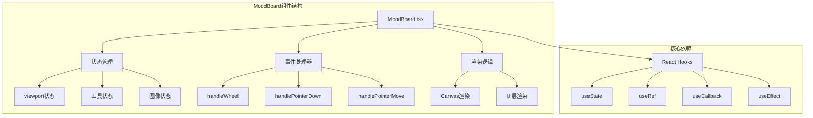
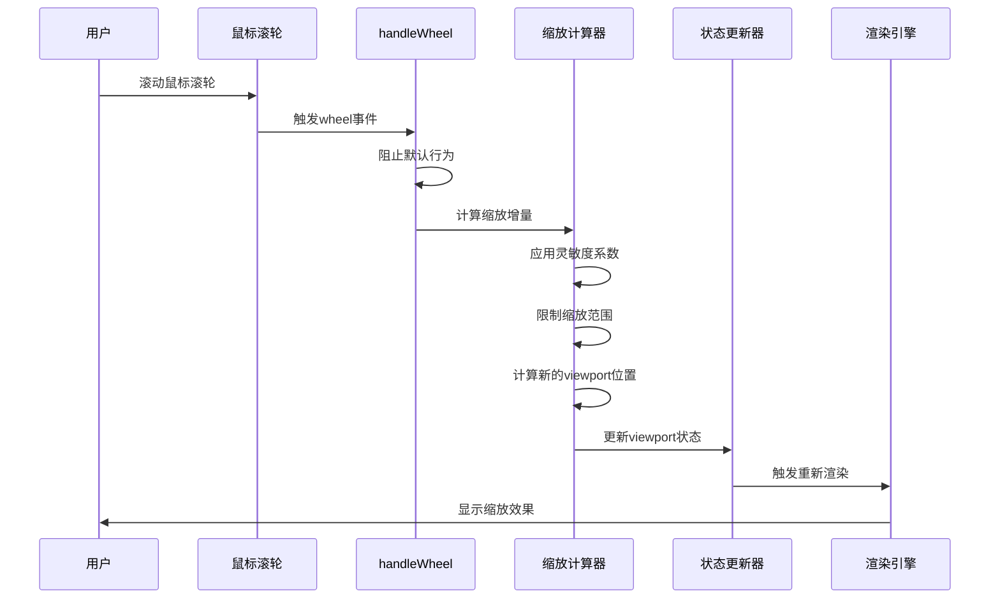
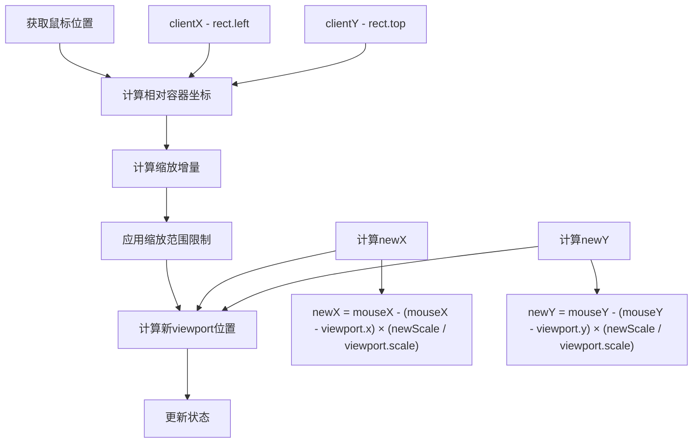
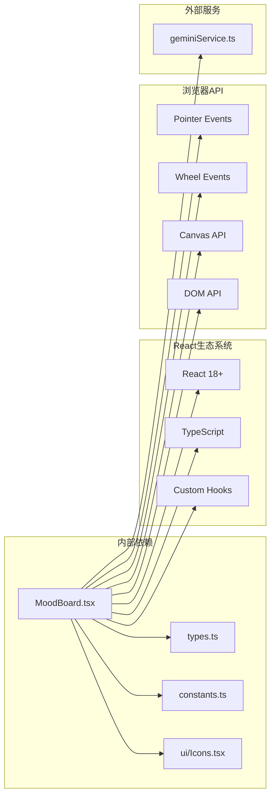

# 缩放功能

<cite>
**本文档中引用的文件**
- [MoodBoard.tsx](file://components/MoodBoard.tsx)
- [types.ts](file://types.ts)
- [constants.ts](file://constants.ts)
</cite>

## 目录
1. [简介](#简介)
2. [项目结构概览](#项目结构概览)
3. [核心组件分析](#核心组件分析)
4. [架构概览](#架构概览)
5. [详细组件分析](#详细组件分析)
6. [依赖关系分析](#依赖关系分析)
7. [性能考虑](#性能考虑)
8. [故障排除指南](#故障排除指南)
9. [结论](#结论)

## 简介

MoodBoard组件的缩放功能是一个复杂而精密的交互系统，它允许用户通过鼠标滚轮进行精确的缩放操作，同时保持鼠标指针在缩放过程中的焦点位置。该功能的核心在于handleWheel事件处理器的实现，它结合了数学计算、DOM坐标转换和状态管理，为用户提供流畅的视觉体验。

## 项目结构概览

MoodBoard组件位于`components/MoodBoard.tsx`文件中，是整个应用程序的核心交互组件。该项目采用React函数式组件架构，使用TypeScript提供类型安全，并通过自定义钩子实现复杂的交互逻辑。



**图表来源**
- [MoodBoard.tsx](file://components/MoodBoard.tsx#L25-L801)

**章节来源**
- [MoodBoard.tsx](file://components/MoodBoard.tsx#L1-L50)

## 核心组件分析

### 视口状态管理

MoodBoard组件维护一个复杂的viewport状态，用于控制整个画布的缩放和平移行为：

```typescript
const [viewport, setViewport] = useState({ x: 0, y: 0, scale: 1 });
```

这个状态对象包含了三个关键属性：
- `x`: 水平偏移量
- `y`: 垂直偏移量  
- `scale`: 当前缩放比例

### 缩放常量定义

系统使用预定义的缩放参数来确保一致性和用户体验：

```typescript
const CANVAS_WIDTH = 2048;
const CANVAS_HEIGHT = 2048;
```

这些常量定义了无限画布的尺寸，为缩放算法提供了基准。

**章节来源**
- [MoodBoard.tsx](file://components/MoodBoard.tsx#L27-L58)

## 架构概览

MoodBoard的缩放功能采用了分层架构设计，每一层都有明确的职责：



**图表来源**
- [MoodBoard.tsx](file://components/MoodBoard.tsx#L289-L309)

## 详细组件分析

### handleWheel事件处理器详解

handleWheel函数是缩放功能的核心，它处理所有与缩放相关的用户输入：

#### 事件预处理和默认行为阻止

```typescript
if (e.ctrlKey || e.metaKey || true) {
    e.preventDefault();
    // 缩放逻辑...
}
```

这里使用了`preventDefault()`方法来阻止浏览器的默认滚动行为，这对于Web应用程序至关重要，因为它防止了页面整体滚动与画布缩放的冲突。

#### 缩放增量计算

```typescript
const zoomSensitivity = 0.001;
const delta = -e.deltaY * zoomSensitivity;
```

缩放增量的计算遵循以下数学逻辑：
- `e.deltaY`：获取垂直滚动方向的原始值
- `zoomSensitivity`：灵敏度系数，控制缩放速度
- 负号：确保向上滚动时放大，向下滚动时缩小

#### 缩放范围限制

```typescript
const newScale = Math.min(Math.max(0.1, viewport.scale + delta), 5);
```

这个三重比较确保缩放比例始终在有效范围内：
- 最小值：0.1倍（避免过度缩小）
- 最大值：5倍（防止过度放大）
- 实际值：当前缩放值加上增量

#### 以鼠标指针为中心的缩放算法

这是缩放功能最复杂的部分，涉及多个数学计算步骤：



**图表来源**
- [MoodBoard.tsx](file://components/MoodBoard.tsx#L298-L308)

##### 数学原理详解

以鼠标指针为中心的缩放算法基于相似三角形原理：

1. **初始位置计算**：
   ```typescript
   const mouseX = e.clientX - rect.left;
   const mouseY = e.clientY - rect.top;
   ```

2. **位置差值计算**：
   ```typescript
   const deltaX = mouseX - viewport.x;
   const deltaY = mouseY - viewport.y;
   ```

3. **缩放后的新位置**：
   ```typescript
   const newDeltaX = deltaX * (newScale / viewport.scale);
   const newDeltaY = deltaY * (newScale / viewport.scale);
   ```

4. **最终viewport位置**：
   ```typescript
   const newX = mouseX - newDeltaX;
   const newY = mouseY - newDeltaY;
   ```

这种算法确保了鼠标指针在缩放过程中保持固定位置，提供了直观的用户体验。

#### 坐标转换辅助函数

为了支持缩放功能，系统提供了两个重要的坐标转换函数：

##### getCanvasPos函数

```typescript
const getCanvasPos = (clientX: number, clientY: number): Point => {
    const rect = containerRef.current.getBoundingClientRect();
    const x = (clientX - rect.left - viewport.x) / viewport.scale;
    const y = (clientY - rect.top - viewport.y) / viewport.scale;
    return { x, y, pressure: 0.5 };
};
```

这个函数将屏幕坐标转换为画布坐标，考虑了viewport的偏移和缩放。

##### getCanvasPos的数学逻辑

对于每个像素点，坐标转换公式为：
- `canvasX = (screenX - containerLeft - viewportX) / viewportScale`
- `canvasY = (screenY - containerTop - viewportY) / viewportScale`

这确保了无论viewport如何变化，都能正确地将用户输入映射到画布空间。

**章节来源**
- [MoodBoard.tsx](file://components/MoodBoard.tsx#L289-L309)
- [MoodBoard.tsx](file://components/MoodBoard.tsx#L72-L84)

### CSS变换矩阵应用

MoodBoard使用CSS变换来实现高效的渲染：

```typescript
style={{ 
    transform: `translate(${viewport.x}px, ${viewport.y}px) scale(${viewport.scale})`,
    transformOrigin: '0 0',
    width: CANVAS_WIDTH,
    height: CANVAS_HEIGHT,
    position: 'absolute'
}}
```

#### 变换矩阵的数学本质

CSS变换本质上是一个3x3的齐次坐标变换矩阵：

```
| scale  0    translateX |
| 0    scale translateY |
| 0      0       1      |
```

其中：
- `scale`：缩放因子
- `translateX` 和 `translateY`：平移量

#### 性能优化考虑

使用CSS变换而非Canvas变换的主要优势：
1. **硬件加速**：现代浏览器会自动将CSS变换映射到GPU
2. **复合层优化**：浏览器可以独立合成变换层
3. **内存效率**：避免重复绘制整个画布

**章节来源**
- [MoodBoard.tsx](file://components/MoodBoard.tsx#L670-L692)

## 依赖关系分析

MoodBoard的缩放功能依赖于多个核心模块和外部资源：



**图表来源**
- [MoodBoard.tsx](file://components/MoodBoard.tsx#L1-L18)

### 关键依赖项

1. **React状态管理**：使用useState管理viewport状态
2. **引用管理**：useRef存储DOM元素引用
3. **事件处理**：useCallback优化事件处理器性能
4. **副作用处理**：useEffect管理渲染循环

**章节来源**
- [MoodBoard.tsx](file://components/MoodBoard.tsx#L1-L20)

## 性能考虑

### 渲染性能优化

MoodBoard采用了多种策略来确保缩放操作的流畅性：

1. **requestAnimationFrame**：使用动画帧请求实现平滑的渲染循环
2. **状态最小化**：只在必要时更新viewport状态
3. **事件节流**：通过事件处理程序优化减少不必要的计算

### 内存管理

1. **引用清理**：及时释放不再需要的DOM引用
2. **状态重置**：在适当的时候重置临时状态变量
3. **垃圾回收友好**：避免创建不必要的临时对象

### 浏览器兼容性

该实现考虑了现代浏览器的特性：
- Pointer Events API用于统一的指针输入
- CSS3变换提供硬件加速
- Canvas API确保精确的图形渲染

## 故障排除指南

### 常见问题及解决方案

#### 缩放不准确或跳跃

**可能原因**：
- 缩放灵敏度设置不当
- DOM坐标计算错误
- 事件处理程序冲突

**解决方案**：
1. 调整`zoomSensitivity`常量值
2. 检查`containerRef.current.getBoundingClientRect()`的返回值
3. 确保没有其他事件监听器干扰wheel事件

#### 鼠标指针位置偏移

**可能原因**：
- 坐标转换公式错误
- 容器边框或内边距影响
- CSS变换原点设置问题

**解决方案**：
1. 验证`getCanvasPos`函数的计算逻辑
2. 检查容器的CSS盒模型设置
3. 确认`transformOrigin`属性的正确性

#### 性能问题

**可能原因**：
- 频繁的状态更新
- 不必要的重新渲染
- 复杂的CSS变换链

**解决方案**：
1. 使用React.memo优化组件
2. 实现shouldComponentUpdate逻辑
3. 简化CSS变换组合

**章节来源**
- [MoodBoard.tsx](file://components/MoodBoard.tsx#L289-L309)

## 结论

MoodBoard的缩放功能是一个精心设计的交互系统，它成功地将复杂的数学计算转化为直观的用户体验。通过巧妙的算法设计、合理的性能优化和全面的错误处理，该功能为用户提供了专业级的图像编辑体验。

### 关键技术成就

1. **精确的缩放算法**：实现了以鼠标指针为中心的缩放，提供直观的用户体验
2. **性能优化**：通过CSS变换和渲染优化确保流畅的操作响应
3. **跨平台兼容性**：支持各种设备和浏览器的指针输入
4. **可扩展性**：模块化的设计便于功能扩展和维护

### 未来改进方向

1. **触摸手势支持**：扩展到移动设备的双指缩放
2. **动画过渡**：添加平滑的缩放动画效果
3. **高级缩放模式**：支持自定义缩放中心点
4. **性能监控**：集成性能指标收集和分析

这个缩放功能不仅展示了现代Web开发的技术能力，也为用户创造了一个强大而易用的图像编辑工具。