# 视口交互系统

<cite>
**本文档中引用的文件**
- [MoodBoard.tsx](file://components/MoodBoard.tsx)
- [types.ts](file://types.ts)
- [constants.ts](file://constants.ts)
- [Icons.tsx](file://components/ui/Icons.tsx)
</cite>

## 目录
1. [简介](#简介)
2. [项目结构概览](#项目结构概览)
3. [核心组件架构](#核心组件架构)
4. [视口状态管理](#视口状态管理)
5. [平移（Pan）功能实现](#平移pan功能实现)
6. [缩放（Zoom）功能实现](#缩放zoom功能实现)
7. [坐标转换系统](#坐标转换系统)
8. [键盘快捷键支持](#键盘快捷键支持)
9. [Pointer Capture API](#pointer-capture-api)
10. [多点触控兼容性](#多点触控兼容性)
11. [性能优化策略](#性能优化策略)
12. [故障排除指南](#故障排除指南)
13. [总结](#总结)

## 简介

MoodBoard组件是一个功能强大的无限画布应用程序，提供了完整的视口交互系统，支持平移、缩放、拖拽等核心功能。该系统采用React Hooks和现代Web API构建，实现了流畅的用户体验和高度的可访问性。

## 项目结构概览

MoodBoard组件位于`components/MoodBoard.tsx`，是整个应用程序的核心交互组件。它包含了完整的视口管理系统，支持多种输入设备和交互模式。

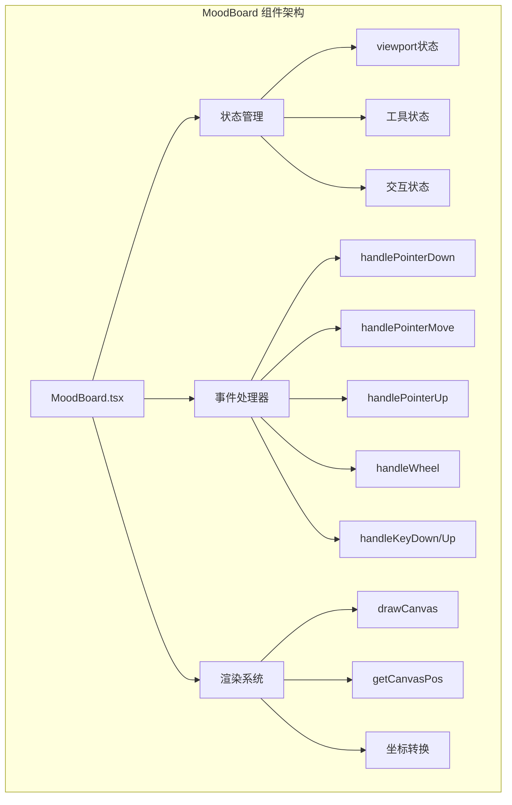

**图表来源**
- [MoodBoard.tsx](file://components/MoodBoard.tsx#L23-L52)

**章节来源**
- [MoodBoard.tsx](file://components/MoodBoard.tsx#L1-L770)

## 核心组件架构

### 状态管理系统

MoodBoard组件使用React Hooks进行状态管理，主要包括以下关键状态：

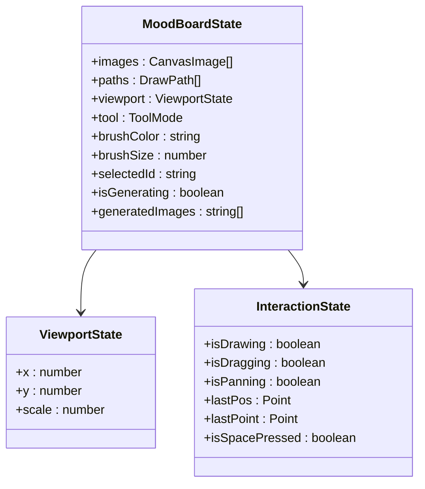

**图表来源**
- [MoodBoard.tsx](file://components/MoodBoard.tsx#L25-L52)
- [types.ts](file://types.ts#L12-L34)

### 引用对象管理

组件使用多个ref来管理DOM元素和状态：

- `canvasRef`: 指向HTMLCanvasElement的引用
- `containerRef`: 指向HTMLDivElement的容器引用
- `fileInputRef`: 文件输入框的引用

**章节来源**
- [MoodBoard.tsx](file://components/MoodBoard.tsx#L41-L44)

## 视口状态管理

### viewport状态结构

视口状态是整个交互系统的核心，包含三个关键属性：

| 属性 | 类型 | 描述 | 默认值 |
|------|------|------|--------|
| x | number | 水平偏移量（像素） | 0 |
| y | number | 垂直偏移量（像素） | 0 |
| scale | number | 缩放比例（1.0为原始大小） | 1 |

### 视口变换应用

视口变换通过CSS transform属性应用到内容层：

```mermaid
flowchart TD
A[viewport状态] --> B[transform: translate(x, y)]
B --> C[transform: scale(scale)]
C --> D[最终视觉效果]
E[容器元素] --> F[应用transform属性]
F --> G[内容层相对于原点变换]
```

**图表来源**
- [MoodBoard.tsx](file://components/MoodBoard.tsx#L651-L657)

**章节来源**
- [MoodBoard.tsx](file://components/MoodBoard.tsx#L30-L31)

## 平移（Pan）功能实现

### 平移触发条件

平移功能可以通过多种方式触发：

1. **中键点击**：按下鼠标中键时激活平移模式
2. **工具切换**：选择"平移"工具时启用
3. **键盘组合**：按住空格键并拖拽时激活

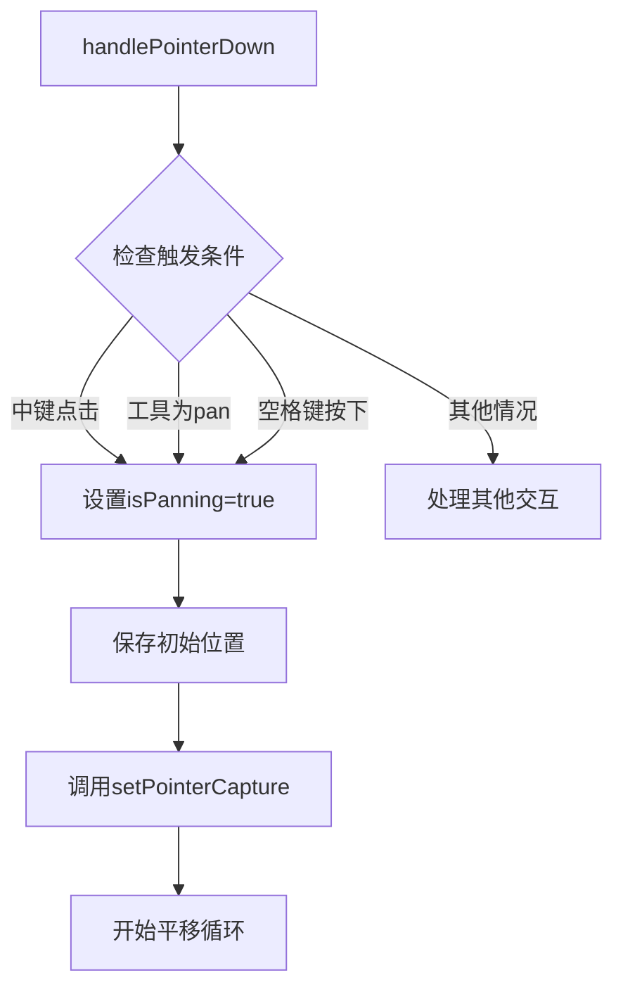

**图表来源**
- [MoodBoard.tsx](file://components/MoodBoard.tsx#L198-L208)

### 平移算法实现

平移过程中的位置计算遵循以下逻辑：

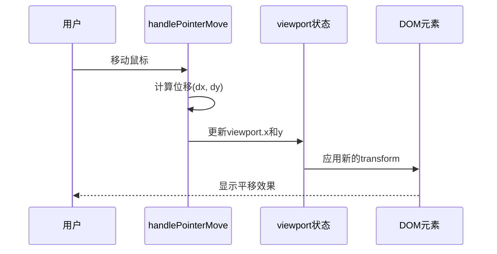

**图表来源**
- [MoodBoard.tsx](file://components/MoodBoard.tsx#L241-L246)

**章节来源**
- [MoodBoard.tsx](file://components/MoodBoard.tsx#L198-L208)
- [MoodBoard.tsx](file://components/MoodBoard.tsx#L241-L246)

## 缩放（Zoom）功能实现

### 鼠标滚轮缩放

缩放功能主要通过鼠标滚轮事件实现，支持以鼠标指针为中心的缩放：

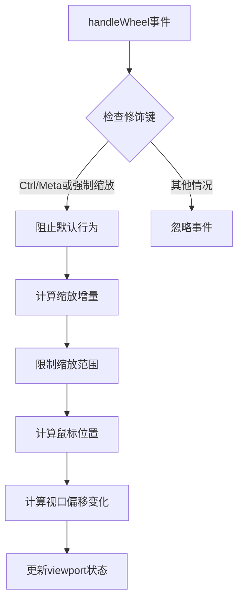

**图表来源**
- [MoodBoard.tsx](file://components/MoodBoard.tsx#L287-L307)

### 缩放中心计算

缩放时保持鼠标指针固定的关键算法：

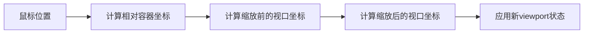

**图表来源**
- [MoodBoard.tsx](file://components/MoodBoard.tsx#L296-L305)

### 缩放参数配置

| 参数 | 值 | 描述 |
|------|-----|------|
| zoomSensitivity | 0.001 | 缩放灵敏度系数 |
| minScale | 0.1 | 最小缩放比例 |
| maxScale | 5.0 | 最大缩放比例 |

**章节来源**
- [MoodBoard.tsx](file://components/MoodBoard.tsx#L287-L307)

## 坐标转换系统

### getCanvasPos函数详解

`getCanvasPos`函数是坐标转换系统的核心，负责将屏幕坐标转换为画布坐标：

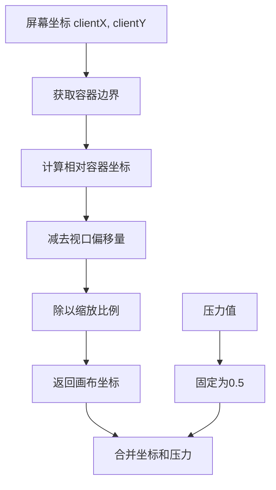

**图表来源**
- [MoodBoard.tsx](file://components/MoodBoard.tsx#L71-L82)

### 坐标转换公式

坐标转换的核心数学公式：

```
canvasX = (screenX - containerLeft - viewportX) / viewportScale
canvasY = (screenY - containerTop - viewportY) / viewportScale
```

### 压力值处理

对于非压感设备，系统使用固定的压力值：
- 压力值范围：0.0 到 1.0
- 默认值：0.5
- 绘制宽度计算：width × (0.5 + pressure)

**章节来源**
- [MoodBoard.tsx](file://components/MoodBoard.tsx#L71-L82)

## 键盘快捷键支持

### 空格键平移模式

系统支持通过空格键临时激活平移模式：

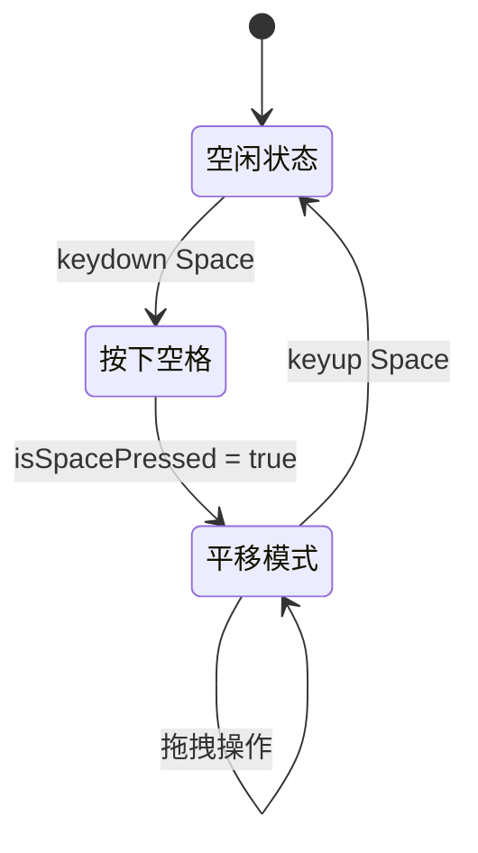

**图表来源**
- [MoodBoard.tsx](file://components/MoodBoard.tsx#L177-L194)

### 键盘事件处理

键盘事件监听器的实现细节：

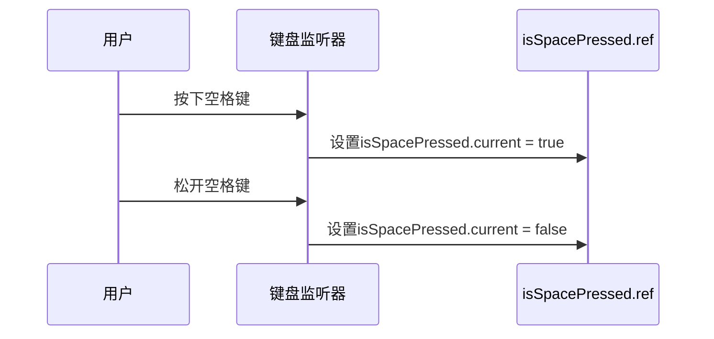

**图表来源**
- [MoodBoard.tsx](file://components/MoodBoard.tsx#L177-L194)

**章节来源**
- [MoodBoard.tsx](file://components/MoodBoard.tsx#L177-L194)

## Pointer Capture API

### Pointer Capture机制

Pointer Capture API确保拖拽操作的连续性和准确性：

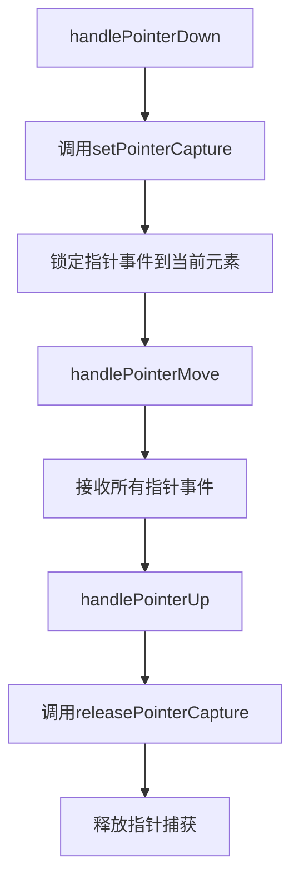

**图表来源**
- [MoodBoard.tsx](file://components/MoodBoard.tsx#L206-L207)
- [MoodBoard.tsx](file://components/MoodBoard.tsx#L282-L283)

### 捕获目标选择

不同的交互类型使用不同的捕获目标：

| 交互类型 | 捕获目标 | 用途 |
|----------|----------|------|
| 平移 | containerRef | 容器级拖拽 |
| 绘图 | canvasRef | 画布级绘图 |
| 拖拽图像 | canvasRef | 图像移动 |

### 捕获生命周期

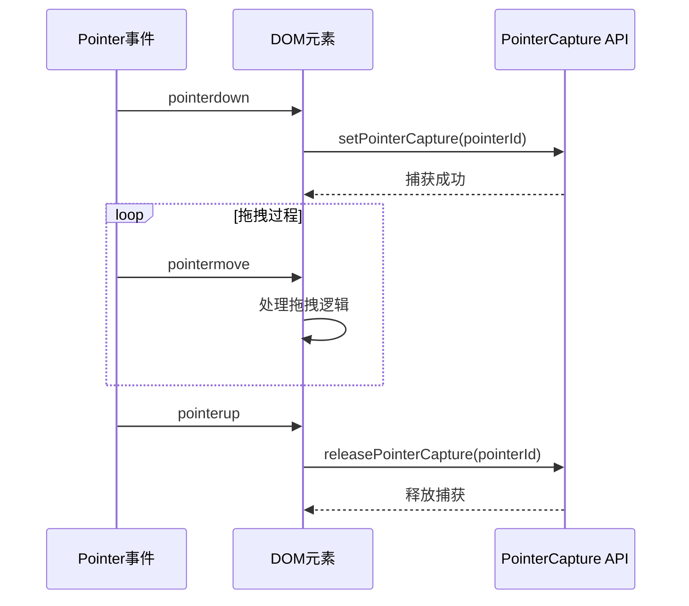

**图表来源**
- [MoodBoard.tsx](file://components/MoodBoard.tsx#L206-L207)
- [MoodBoard.tsx](file://components/MoodBoard.tsx#L220-L221)
- [MoodBoard.tsx](file://components/MoodBoard.tsx#L232-L233)

**章节来源**
- [MoodBoard.tsx](file://components/MoodBoard.tsx#L206-L207)
- [MoodBoard.tsx](file://components/MoodBoard.tsx#L220-L221)
- [MoodBoard.tsx](file://components/MoodBoard.tsx#L232-L233)
- [MoodBoard.tsx](file://components/MoodBoard.tsx#L282-L283)

## 多点触控兼容性

### Pointer Events优势

MoodBoard组件使用Pointer Events API而非传统的Mouse Events，提供了更好的多点触控支持：

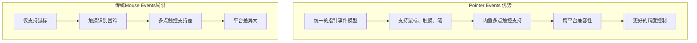

### 触摸设备适配

虽然当前实现主要针对桌面环境，但Pointer Events API为未来的移动端适配奠定了基础：

| 功能 | 当前支持 | 移动端适配 |
|------|----------|------------|
| 单点触摸 | ✅ 完全支持 | ✅ 自动适配 |
| 双指缩放 | ⚠️ 需要扩展 | ✅ 支持 |
| 长按拖拽 | ✅ 完全支持 | ✅ 自动适配 |
| 触摸反馈 | ⚠️ 有限支持 | ✅ 完善支持 |

### 设备检测策略

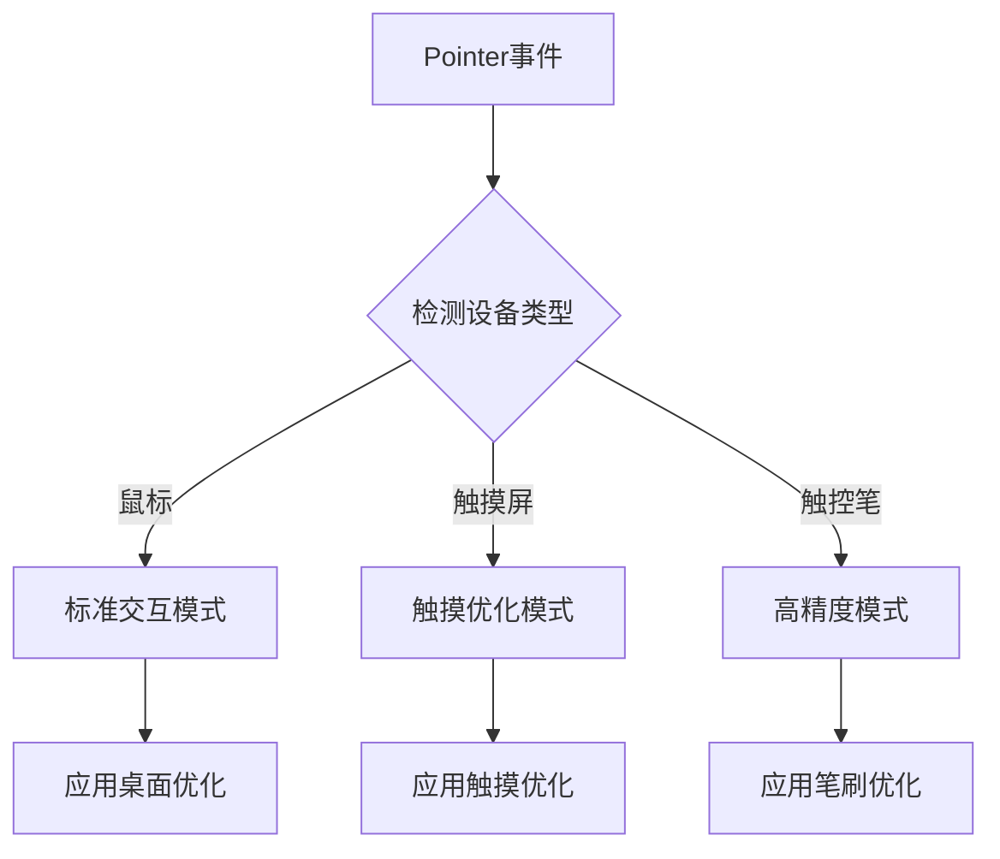

**章节来源**
- [MoodBoard.tsx](file://components/MoodBoard.tsx#L198-L285)

## 性能优化策略

### 渲染性能优化

#### requestAnimationFrame循环

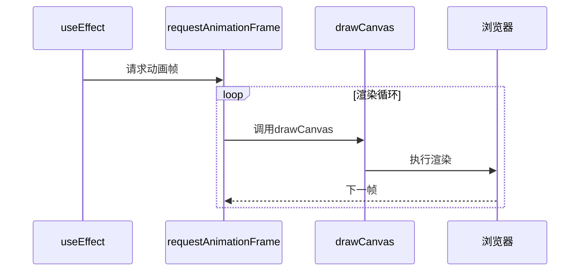

**图表来源**
- [MoodBoard.tsx](file://components/MoodBoard.tsx#L166-L174)

#### 渲染优化技术

| 技术 | 实现方式 | 性能收益 |
|------|----------|----------|
| 分层渲染 | Canvas + Overlay分离 | 减少重绘区域 |
| 增量更新 | 只更新变化的部分 | 提升响应速度 |
| 帧率控制 | RAF vs setTimeout | 更流畅的动画 |
| 内存管理 | 及时清理资源 | 避免内存泄漏 |

### 事件处理优化

#### 事件委托和节流

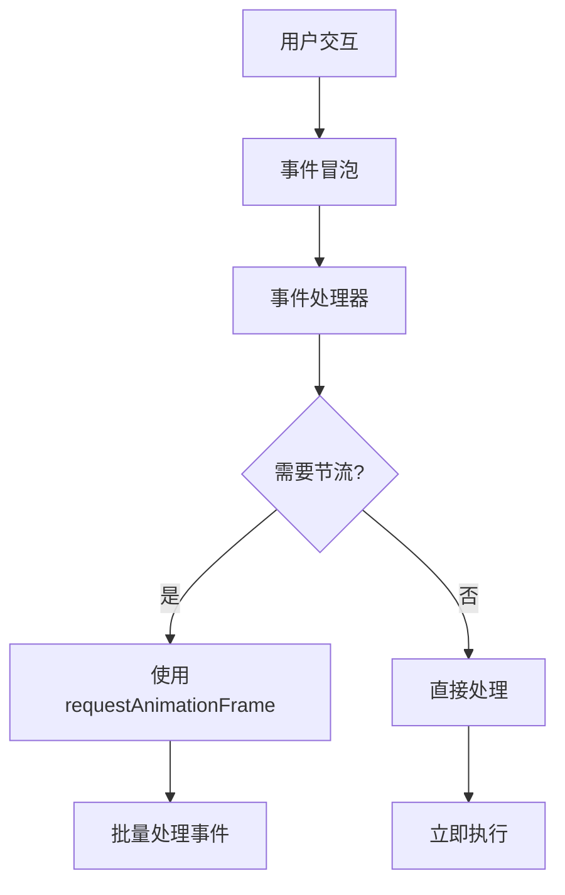

#### 内存泄漏防护

系统实现了完善的清理机制：

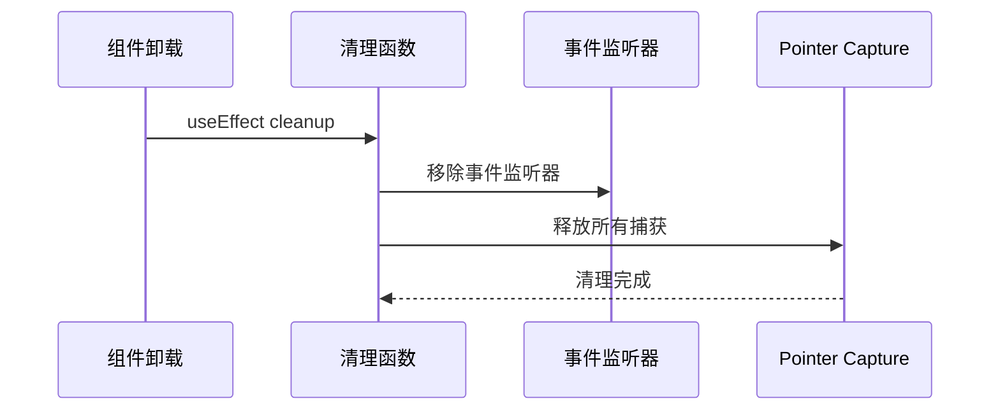

**图表来源**
- [MoodBoard.tsx](file://components/MoodBoard.tsx#L177-L194)
- [MoodBoard.tsx](file://components/MoodBoard.tsx#L282-L283)

**章节来源**
- [MoodBoard.tsx](file://components/MoodBoard.tsx#L166-L174)
- [MoodBoard.tsx](file://components/MoodBoard.tsx#L177-L194)
- [MoodBoard.tsx](file://components/MoodBoard.tsx#L282-L283)

## 故障排除指南

### 常见问题诊断

#### 平移功能失效

**症状**：鼠标拖拽无法移动视口

**可能原因**：
1. Pointer Capture未正确设置
2. 事件处理器被意外阻止
3. 视口状态更新失败

**解决方案**：
```typescript
// 检查Pointer Capture状态
console.log('Pointer captured:', containerRef.current?.hasPointerCapture(e.pointerId));

// 验证事件处理器
console.log('Event handler triggered:', isPanning.current);
```

#### 缩放异常

**症状**：缩放时视口位置不正确

**可能原因**：
1. 坐标转换计算错误
2. 容器边界获取失败
3. 缩放中心计算错误

**解决方案**：
```typescript
// 调试坐标转换
console.log('Container rect:', containerRef.current?.getBoundingClientRect());
console.log('Canvas position:', getCanvasPos(clientX, clientY));
```

#### 键盘快捷键无响应

**症状**：空格键无法激活平移模式

**可能原因**：
1. 键盘事件监听器未正确绑定
2. 全局焦点冲突
3. 事件冒泡被阻止

**解决方案**：
```typescript
// 检查键盘监听器状态
console.log('Keyboard listeners:', 
    window.addEventListener.toString().includes('handleKeyDown'),
    window.addEventListener.toString().includes('handleKeyUp')
);
```

### 性能问题排查

#### 渲染性能下降

**诊断步骤**：
1. 使用浏览器开发者工具监控FPS
2. 检查是否有频繁的重绘
3. 分析内存使用情况

**优化建议**：
- 减少不必要的状态更新
- 优化渲染循环频率
- 使用虚拟化技术处理大量元素

#### 事件处理延迟

**诊断方法**：
```typescript
// 添加事件处理时间戳
const startTime = performance.now();
// ... 事件处理逻辑
const endTime = performance.now();
console.log('Event handler took:', endTime - startTime, 'ms');
```

**章节来源**
- [MoodBoard.tsx](file://components/MoodBoard.tsx#L198-L285)

## 总结

MoodBoard组件的视口交互系统展现了现代Web应用开发的最佳实践。通过精心设计的状态管理、高效的坐标转换算法、完善的事件处理机制和优秀的性能优化策略，该系统实现了流畅、直观且高度可访问的用户交互体验。

### 关键技术亮点

1. **现代化的事件处理**：使用Pointer Events API替代传统Mouse Events，提供更好的多点触控支持
2. **精确的坐标转换**：通过`getCanvasPos`函数实现屏幕坐标到画布坐标的准确转换
3. **智能的缩放算法**：以鼠标指针为中心的缩放，保持用户操作的直观性
4. **可靠的Pointer Capture**：确保拖拽操作的连续性和准确性
5. **优雅的键盘支持**：空格键平移模式提升用户体验
6. **完善的性能优化**：使用RAF渲染循环和增量更新策略

### 架构设计优势

- **模块化设计**：清晰的职责分离，便于维护和扩展
- **类型安全**：完整的TypeScript类型定义，减少运行时错误
- **可测试性**：良好的抽象层次，便于单元测试
- **可扩展性**：灵活的架构设计，支持未来功能扩展

这个视口交互系统不仅满足了当前的功能需求，还为未来的功能扩展和性能优化奠定了坚实的基础，是现代Web应用程序开发的优秀范例。