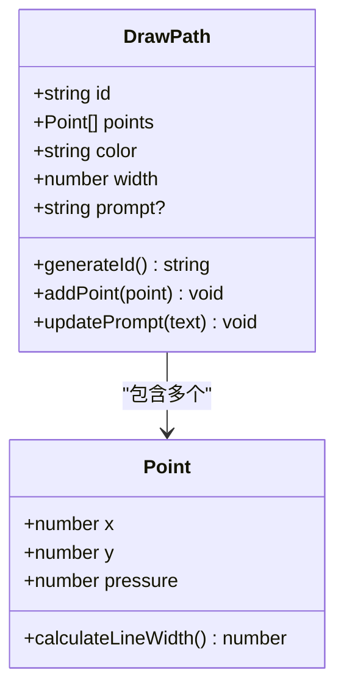
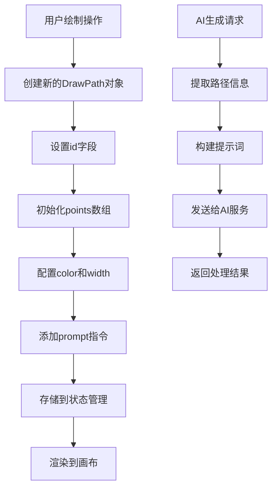
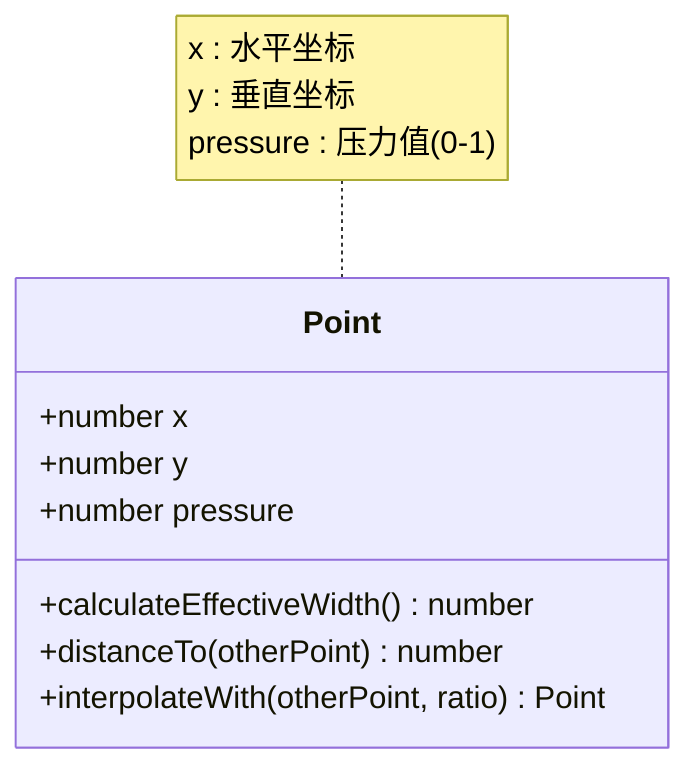
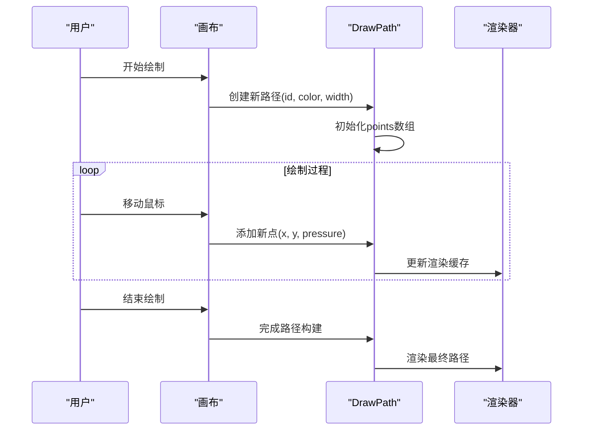
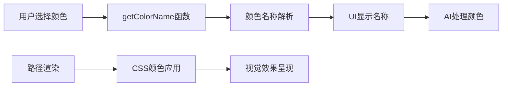
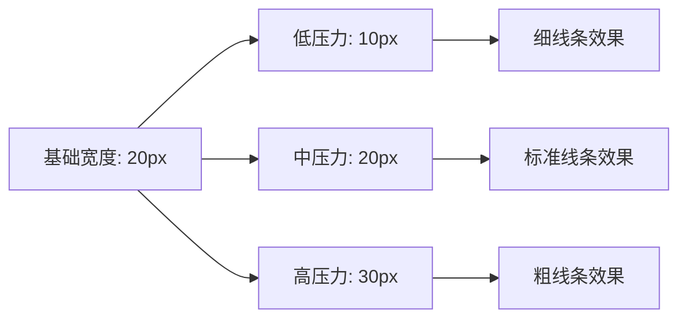
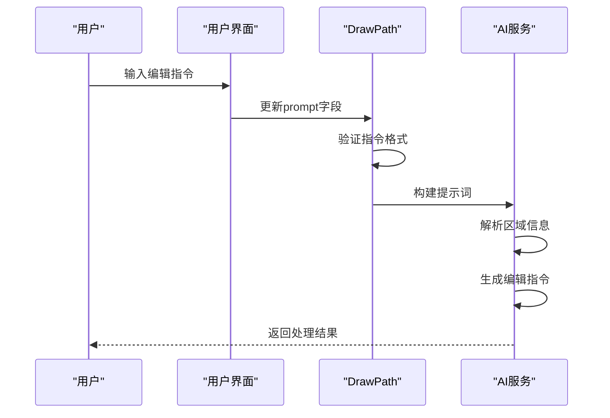
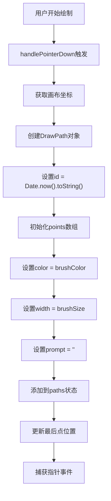
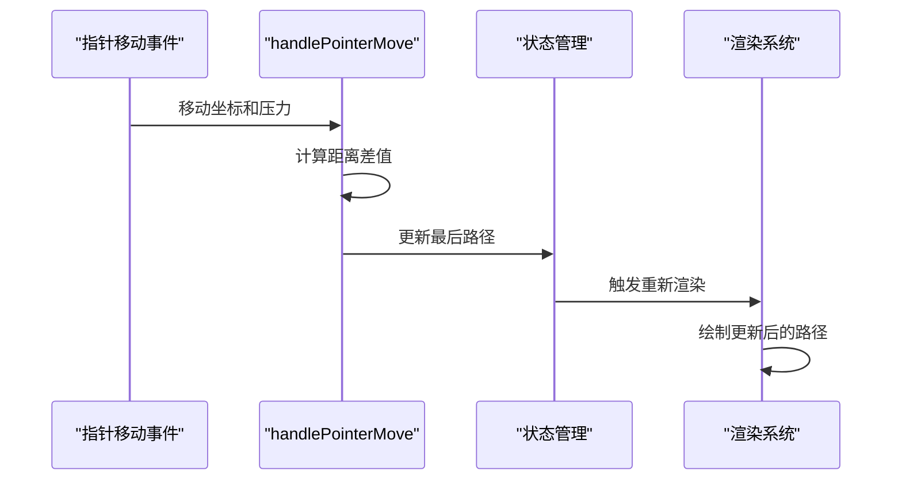

# DrawPath数据模型

<cite>
**本文档中引用的文件**
- [types.ts](file://types.ts)
- [components/MoodBoard.tsx](file://components/MoodBoard.tsx)
- [constants.ts](file://constants.ts)
</cite>

## 目录
1. [简介](#简介)
2. [DrawPath接口定义](#drawpath接口定义)
3. [核心数据结构详解](#核心数据结构详解)
4. [id字段唯一标识符策略](#id字段唯一标识符策略)
5. [Points数组几何形状存储](#points数组几何形状存储)
6. [Color字段多色标注支持](#color字段多色标注支持)
7. [Width字段画笔粗细控制](#width字段画笔粗细控制)
8. [Prompt字段用户指令关联](#prompt字段用户指令关联)
9. [MoodBoard中的实例化过程](#moodboard中的实例化过程)
10. [应用场景与最佳实践](#应用场景与最佳实践)
11. [总结](#总结)

## 简介

DrawPath是BananaCanvase应用程序中的核心数据结构，用于表示用户在画布上绘制的路径。该数据模型采用TypeScript接口定义，提供了完整的路径信息存储能力，包括几何形状、视觉属性和用户指令等关键要素。DrawPath的设计体现了现代Web应用中对交互式绘图功能的需求，通过精心设计的数据结构实现了高效的路径管理和AI驱动的图像编辑功能。

## DrawPath接口定义

DrawPath接口在types.ts文件中明确定义，包含了四个必需字段和一个可选字段：



**图表来源**
- [types.ts](file://types.ts#L28-L34)

**章节来源**
- [types.ts](file://types.ts#L28-L34)

## 核心数据结构详解

DrawPath接口采用了简洁而强大的设计模式，每个字段都有明确的职责和用途：

### 字段类型定义

| 字段名 | 类型 | 必需性 | 描述 |
|--------|------|--------|------|
| id | string | 必需 | 唯一标识符，用于路径的识别和管理 |
| points | Point[] | 必需 | 存储路径上的所有点坐标和压力信息 |
| color | string | 必需 | 十六进制颜色值，支持多种标注颜色 |
| width | number | 必需 | 画笔宽度，影响路径渲染效果 |
| prompt | string | 可选 | 用户编辑指令，作为AI生成的关键输入 |

### 数据流架构



**图表来源**
- [components/MoodBoard.tsx](file://components/MoodBoard.tsx#L224-L232)

## id字段唯一标识符策略

### 生成策略分析

DrawPath的id字段采用了简单而有效的生成策略：使用`Date.now().toString()`作为唯一标识符。这种策略具有以下特点：

#### 时间戳基础的优势
- **唯一性保证**：基于毫秒级时间戳，确保在单次运行中不会重复
- **排序友好**：字符串形式的时间戳可以按时间顺序排列
- **简单高效**：无需复杂的UUID生成算法

#### 实际应用示例

在MoodBoard组件中，id字段的生成出现在多个场景：

1. **新路径创建**：[handlePointerDown事件处理器](file://components/MoodBoard.tsx#L225)
2. **图像添加**：[addGeneratedToBoard函数](file://components/MoodBoard.tsx#L546)
3. **批量图像处理**：[handleFileUpload函数](file://components/MoodBoard.tsx#L343)

### 唯一性考虑

虽然`Date.now().toString()`在大多数情况下提供足够好的唯一性，但在高并发场景下可能需要额外的改进：

```typescript
// 改进版本：添加随机后缀确保绝对唯一性
const generateUniqueId = (): string => {
  return `${Date.now()}-${Math.random().toString(36).substring(2, 9)}`;
};
```

**章节来源**
- [components/MoodBoard.tsx](file://components/MoodBoard.tsx#L225)
- [components/MoodBoard.tsx](file://components/MoodBoard.tsx#L343)
- [components/MoodBoard.tsx](file://components/MoodBoard.tsx#L546)

## Points数组几何形状存储

### Point对象结构

每个Point对象包含三个核心属性：



**图表来源**
- [types.ts](file://types.ts#L22-L26)

### 几何形状表示

Points数组通过线性连接的方式表示路径的几何形状：

#### 路径构建流程



**图表来源**
- [components/MoodBoard.tsx](file://components/MoodBoard.tsx#L264-L276)

### 压力值的影响

Pressure属性对路径渲染有重要影响：

#### 线宽计算逻辑
- 基础线宽：`path.width * (0.5 + pressure)`
- 最小线宽：5像素（掩码模式）
- 动态调整：根据压力值实时变化

#### 视觉效果
- 高压力区域：线条变粗，突出显示
- 低压力区域：线条变细，保持流畅
- 连续性：确保路径的连续性和自然感

**章节来源**
- [components/MoodBoard.tsx](file://components/MoodBoard.tsx#L264-L276)
- [components/MoodBoard.tsx](file://components/MoodBoard.tsx#L169-L170)
- [components/MoodBoard.tsx](file://components/MoodBoard.tsx#L472-L474)

## Color字段多色标注支持

### 颜色系统设计

DrawPath支持多种颜色，每种颜色对应不同的标注目的：

#### 预设颜色方案

| 颜色值 | 名称 | 应用场景 |
|--------|------|----------|
| #f59e0b | 橙色 | 主要编辑区域 |
| #ef4444 | 红色 | 敏感区域或警告 |
| #22c55e | 绿色 | 成功标记或确认 |
| #3b82f6 | 蓝色 | 辅助区域或参考 |
| #ffffff | 白色 | 掩码区域（AI专用） |

### 颜色映射机制



**图表来源**
- [components/MoodBoard.tsx](file://components/MoodBoard.tsx#L72-L80)

### AI处理优化

在AI生成过程中，颜色系统发挥重要作用：

#### 掩码生成策略
- 所有路径统一转换为白色线条
- 黑色背景提供清晰对比
- 多色区分仅用于用户界面

#### 提示词增强
- 颜色名称加入编辑指令
- 区域标识便于AI理解
- 上下文关联提高准确性

**章节来源**
- [components/MoodBoard.tsx](file://components/MoodBoard.tsx#L72-L80)
- [components/MoodBoard.tsx](file://components/MoodBoard.tsx#L461-L462)
- [components/MoodBoard.tsx](file://components/MoodBoard.tsx#L498-L500)

## Width字段画笔粗细控制

### 粗细控制机制

Width字段控制画笔的基本粗细，与压力值共同决定最终渲染效果：

#### 计算公式
```
最终线宽 = 基础宽度 × (0.5 + 压力值)
```

#### 参数范围
- 基础宽度：5-100像素（用户可调）
- 压力范围：0.0-1.0（设备感知）
- 最小线宽：5像素（掩码模式）

### 渲染效果对比



### 掩码模式特殊处理

在掩码生成模式下，Width字段有特殊处理：

#### 加强策略
- 最小线宽提升至5像素
- 确保AI能够准确识别
- 避免边缘模糊问题

#### 抗锯齿优化
- 圆角端点处理
- 平滑连接效果
- 抗锯齿渲染

**章节来源**
- [components/MoodBoard.tsx](file://components/MoodBoard.tsx#L170)
- [components/MoodBoard.tsx](file://components/MoodBoard.tsx#L474)
- [components/MoodBoard.tsx](file://components/MoodBoard.tsx#L169-L170)

## Prompt字段用户指令关联

### 指令系统设计

Prompt字段是DrawPath与AI生成系统之间的桥梁，存储用户的编辑指令：

#### 指令格式规范
```
Area [编号] ([颜色名称]): [编辑描述]
```

#### 示例指令
- "Area 1 (橙色): 将天空替换为晴朗的蓝天"
- "Area 2 (红色): 移除画面右侧的电线杆"
- "Area 3 (绿色): 增加植被覆盖率"

### AI集成流程



**图表来源**
- [components/MoodBoard.tsx](file://components/MoodBoard.tsx#L367-L369)

### 指令验证机制

系统实现了多层次的指令验证：

#### 格式验证
- 非空检查
- 长度限制
- 特殊字符过滤

#### 内容验证
- 语义合理性
- 上下文一致性
- 重复指令检测

### 批量处理优化

当存在多个带指令的路径时，系统会进行智能整合：

#### 指令聚合
- 相同颜色区域合并
- 逻辑关系整理
- 优先级排序

#### 输出格式化
- 结构化提示词
- 区域编号自动分配
- 错误处理机制

**章节来源**
- [components/MoodBoard.tsx](file://components/MoodBoard.tsx#L367-L369)
- [components/MoodBoard.tsx](file://components/MoodBoard.tsx#L496-L505)

## MoodBoard中的实例化过程

### 新路径创建流程

MoodBoard组件中的newPath对象创建展示了DrawPath的完整实例化过程：



**图表来源**
- [components/MoodBoard.tsx](file://components/MoodBoard.tsx#L223-L234)

### 关键实现细节

#### 坐标转换
系统通过`getCanvasPos`函数将屏幕坐标转换为画布坐标，考虑了缩放和平移变换。

#### 状态管理
使用React的状态管理机制，通过`setPaths`函数更新路径列表，触发重新渲染。

#### 事件处理
实现了完整的指针事件处理链：
- `handlePointerDown`: 开始绘制
- `handlePointerMove`: 更新路径
- `handlePointerUp`: 结束绘制

### 路径更新机制



**图表来源**
- [components/MoodBoard.tsx](file://components/MoodBoard.tsx#L264-L276)

### 性能优化策略

#### 阈值检测
系统实现了距离阈值检测，避免过于密集的点添加：
```typescript
const dx = pos.x - lastPoint.current.x;
const dy = pos.y - lastPoint.current.y;
if (dx*dx + dy*dy < 2) return prev; // 距离过小，跳过
```

#### 批量更新
使用不可变更新模式，确保React的高效渲染：
```typescript
return [...prev.slice(0, -1), updatedPath];
```

**章节来源**
- [components/MoodBoard.tsx](file://components/MoodBoard.tsx#L223-L234)
- [components/MoodBoard.tsx](file://components/MoodBoard.tsx#L264-L276)
- [components/MoodBoard.tsx](file://components/MoodBoard.tsx#L266-L274)

## 应用场景与最佳实践

### 主要应用场景

#### 图像编辑标注
DrawPath在BananaCanvase中主要用于图像编辑的区域标注，用户可以通过不同颜色的路径标记需要修改的区域。

#### AI驱动的图像生成
系统利用DrawPath提供的精确信息，结合AI技术实现智能图像编辑和生成。

#### 多层级编辑工作流
支持复杂的编辑工作流，包括预览、修改、确认等多个阶段。

### 最佳实践指南

#### 路径设计原则
1. **清晰边界**：确保路径边界清晰，避免重叠
2. **合理间距**：保持适当的路径间距，便于AI理解
3. **颜色区分**：使用不同颜色区分不同类型的操作

#### 性能优化建议
1. **及时清理**：定期清理不需要的路径
2. **批量操作**：对于大量路径，使用批量更新
3. **内存管理**：注意大型路径的内存占用

#### 用户体验优化
1. **即时反馈**：提供实时的路径预览
2. **撤销机制**：支持路径的撤销和重做
3. **保存恢复**：实现项目的保存和恢复功能

### 扩展性考虑

DrawPath接口设计具有良好的扩展性：

#### 向后兼容
- 可选字段的引入不影响现有功能
- 新增字段可通过默认值处理

#### 功能扩展
- 支持路径动画效果
- 增加路径样式自定义
- 实现路径组操作

## 总结

DrawPath数据模型是BananaCanvase应用的核心组件，通过精心设计的接口定义和实现策略，成功地将复杂的绘图功能抽象为简洁而强大的数据结构。其主要优势包括：

### 设计优势
- **简洁性**：清晰的字段定义，易于理解和使用
- **完整性**：涵盖几何、视觉和语义的所有必要信息
- **灵活性**：支持多种应用场景和扩展需求

### 技术特色
- **唯一标识**：基于时间戳的ID生成策略
- **动态渲染**：压力值驱动的线宽变化
- **AI集成**：与现代AI图像处理技术的无缝对接

### 应用价值
DrawPath不仅满足了当前的功能需求，还为未来的功能扩展和技术升级奠定了坚实的基础。通过合理的抽象和封装，它成为了连接用户交互、前端渲染和AI服务的重要桥梁。

这个数据模型的成功实现展示了现代Web应用开发中，如何通过精心设计的数据结构来解决复杂的技术挑战，同时保持代码的可维护性和扩展性。