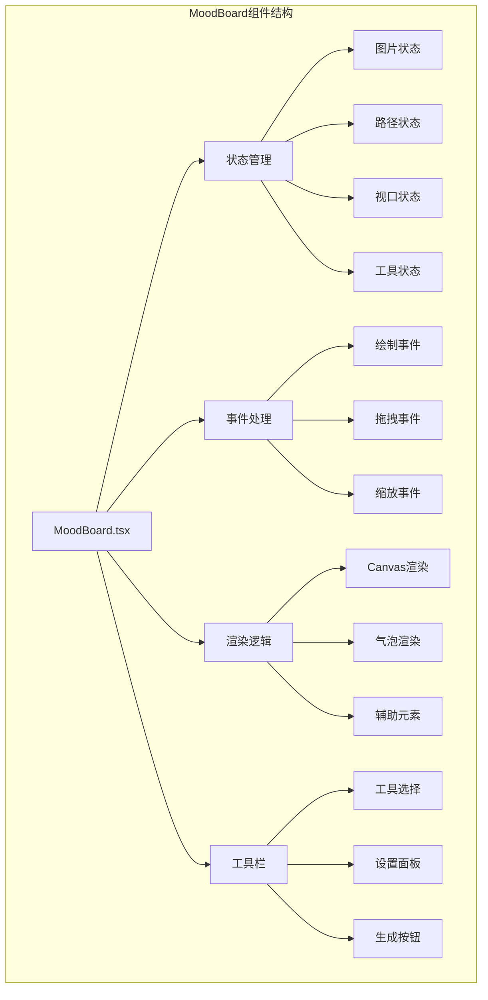
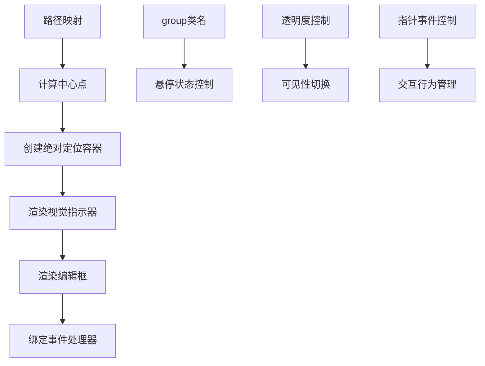
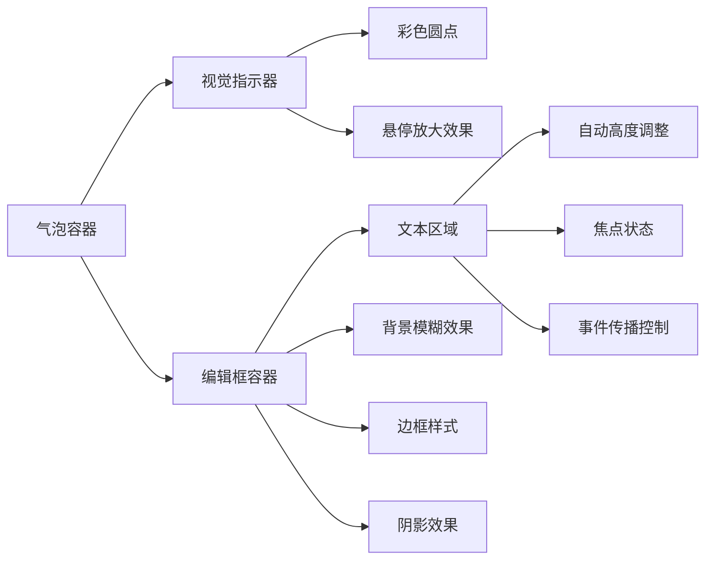
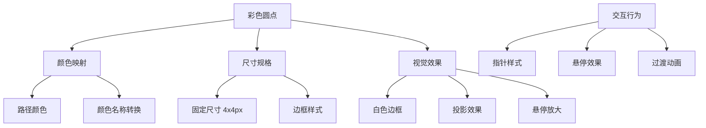
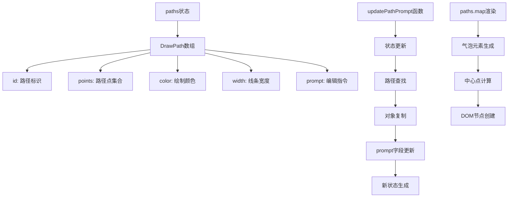

# 注释气泡UI实现

<cite>
**本文档引用的文件**
- [MoodBoard.tsx](file://components/MoodBoard.tsx)
- [types.ts](file://types.ts)
- [constants.ts](file://constants.ts)
- [Icons.tsx](file://components/ui/Icons.tsx)
</cite>

## 目录
1. [简介](#简介)
2. [项目结构概览](#项目结构概览)
3. [核心组件架构](#核心组件架构)
4. [注释气泡渲染机制](#注释气泡渲染机制)
5. [路径中心点计算](#路径中心点计算)
6. [交互式编辑框系统](#交互式编辑框系统)
7. [视觉指示器设计](#视觉指示器设计)
8. [状态管理与数据流](#状态管理与数据流)
9. [性能优化考虑](#性能优化考虑)
10. [总结](#总结)

## 简介

MoodBoard组件是香蕉画布应用的核心界面组件，它提供了一个无限画布环境，支持图像上传、路径绘制和AI驱动的图像编辑功能。其中，注释气泡（Comment Bubbles）系统是该组件的重要交互特性，为用户提供直观的路径编辑提示和指令输入功能。

注释气泡系统通过React的条件渲染机制，为每个绘制的路径动态生成对应的气泡元素，实现了精确的视觉定位和交互式编辑体验。该系统结合了Canvas绘图层和DOM覆盖层的技术方案，提供了流畅的用户体验。

## 项目结构概览

MoodBoard组件位于`components/MoodBoard.tsx`文件中，采用函数式组件和Hooks模式构建。整个组件包含以下关键部分：



**图表来源**
- [MoodBoard.tsx](file://components/MoodBoard.tsx#L25-L801)

**章节来源**
- [MoodBoard.tsx](file://components/MoodBoard.tsx#L1-L50)

## 核心组件架构

MoodBoard组件采用了分层架构设计，主要包含以下几个层次：

### 状态管理层
组件维护多个状态变量来管理画布的不同方面：
- `images`: 存储上传的图像列表
- `paths`: 存储绘制的路径及其编辑指令
- `viewport`: 管理画布的缩放和平移状态
- `tool`: 当前使用的工具类型

### 渲染层
渲染系统分为两个主要层次：
1. **Canvas层**: 负责实际的图像和路径绘制
2. **UI覆盖层**: 负责注释气泡和其他交互元素的渲染

### 事件处理层
组件实现了完整的指针事件处理系统，支持绘制、拖拽、缩放等操作。

**章节来源**
- [MoodBoard.tsx](file://components/MoodBoard.tsx#L27-L39)

## 注释气泡渲染机制

注释气泡的渲染是通过React的`paths.map()`方法实现的，每个路径都会生成一个独立的气泡元素。渲染过程的关键步骤如下：

### 气泡容器结构



**图表来源**
- [MoodBoard.tsx](file://components/MoodBoard.tsx#L699-L731)

### 渲染流程详解

气泡的渲染遵循以下流程：

1. **路径遍历**: 使用`paths.map()`遍历所有绘制的路径
2. **中心点计算**: 调用`getCenterOfPath()`函数计算路径的几何中心
3. **定位设置**: 将气泡容器设置为绝对定位，并使用`transform: translate(-50%, -50%)`实现精确居中
4. **条件渲染**: 只有当路径包含有效编辑指令时才显示编辑框

### CSS类名系统

气泡系统使用了Tailwind CSS的响应式类名系统，实现了复杂的交互效果：

- `group`: 作为父容器，用于控制子元素的悬停状态
- `z-10`: 设置适当的层级关系，确保气泡显示在路径之上
- `opacity-100` 和 `opacity-0`: 动态控制编辑框的可见性
- `pointer-events-none`: 控制鼠标事件的传递行为

**章节来源**
- [MoodBoard.tsx](file://components/MoodBoard.tsx#L699-L731)

## 路径中心点计算

`getCenterOfPath`函数是注释气泡系统的核心算法，负责计算路径的几何中心点。该函数的实现体现了精确的边界框计算逻辑：

### 计算算法

```mermaid
flowchart TD
A[开始计算] --> B{路径点数检查}
B --> |空路径| C[返回原点 {x:0, y:0}]
B --> |有效路径| D[初始化边界变量]
D --> E[遍历所有路径点]
E --> F[更新最小最大值]
F --> G[计算中心坐标]
G --> H[返回中心点 {x:(minX+maxX)/2, y:(minY+maxY)/2}]
C --> I[结束]
H --> I
```

**图表来源**
- [MoodBoard.tsx](file://components/MoodBoard.tsx#L86-L96)

### 边界框计算逻辑

函数通过以下步骤计算路径的边界框：

1. **初始化边界**: 设置`minX = Infinity`, `maxX = -Infinity`, `minY = Infinity`, `maxY = -Infinity`
2. **遍历点集合**: 对路径中的每个点执行边界更新
3. **坐标比较**: 使用`Math.min()`和`Math.max()`更新边界值
4. **中心计算**: 基于边界值计算几何中心

### 性能优化

该算法的时间复杂度为O(n)，其中n是路径点的数量。由于每次渲染都需要重新计算，因此在大量路径的情况下可能会成为性能瓶颈。建议在路径数量较多时考虑缓存机制。

**章节来源**
- [MoodBoard.tsx](file://components/MoodBoard.tsx#L86-L96)

## 交互式编辑框系统

注释气泡的编辑框系统提供了完整的双向数据绑定功能，允许用户直接在画布上编辑路径的描述指令。

### 编辑框结构



**图表来源**
- [MoodBoard.tsx](file://components/MoodBoard.tsx#L712-L731)

### 双向数据绑定

编辑框的双向数据绑定通过以下机制实现：

1. **状态同步**: `path.prompt`值通过React状态管理保持最新
2. **事件处理**: `onChange`事件触发`updatePathPrompt`函数更新状态
3. **值绑定**: `value`属性绑定到当前路径的prompt值

### 可见性控制逻辑

编辑框的可见性采用智能控制策略：

- **内容驱动显示**: 当路径包含有效编辑指令时，编辑框立即显示
- **悬停状态**: 无内容路径仅在悬停时显示编辑框
- **事件控制**: 使用`pointer-events-none`和`group-hover:pointer-events-auto`实现精确的交互控制

### 用户体验优化

编辑框的设计考虑了以下用户体验要素：

- **尺寸适配**: 最小宽度200px，适应不同屏幕尺寸
- **视觉层次**: 使用半透明背景和模糊效果突出编辑区域
- **交互反馈**: 提供清晰的悬停和焦点状态

**章节来源**
- [MoodBoard.tsx](file://components/MoodBoard.tsx#L720-L731)

## 视觉指示器设计

注释气泡的视觉指示器是一个彩色圆点，它不仅提供视觉锚点，还反映了路径的绘制颜色，增强了用户对AI编辑区域的感知。

### 指示器特征



**图表来源**
- [MoodBoard.tsx](file://components/MoodBoard.tsx#L714-L718)

### 颜色映射系统

指示器的颜色直接继承自路径的绘制颜色，这种设计具有以下优势：

1. **一致性**: 用户可以快速识别不同颜色代表的不同编辑区域
2. **可读性**: 高对比度的颜色便于在复杂画布中识别
3. **语义化**: 颜色编码提供了直观的视觉信息

### 交互反馈设计

指示器提供了丰富的交互反馈：

- **悬停效果**: `hover:scale-125`实现125%的放大效果
- **过渡动画**: `transition-transform`提供平滑的缩放动画
- **指针样式**: `cursor-pointer`明确指示可点击状态

### 视觉层次管理

指示器的设计考虑了视觉层次的平衡：

- **背景对比**: 白色边框确保在任何背景下都有良好的可见性
- **阴影效果**: `shadow-sm`提供轻微的立体感
- **尺寸控制**: 4x4像素的尺寸既足够识别又不会过于突兀

**章节来源**
- [MoodBoard.tsx](file://components/MoodBoard.tsx#L714-L718)

## 状态管理与数据流

MoodBoard组件的状态管理系统为注释气泡功能提供了坚实的数据基础。数据流遵循单向流动原则，确保了应用的可预测性和可维护性。

### 状态架构



**图表来源**
- [MoodBoard.tsx](file://components/MoodBoard.tsx#L356-L358)
- [types.ts](file://types.ts#L28-L34)

### 数据流机制

状态管理遵循以下模式：

1. **状态定义**: `useState<DrawPath[]>`管理所有路径数据
2. **状态更新**: `setPaths`函数通过回调函数模式更新状态
3. **不可变更新**: 使用数组解构和对象展开操作符确保数据不可变性
4. **副作用处理**: React的重新渲染机制自动处理UI更新

### 性能考虑

在状态管理层面，系统采用了以下优化策略：

- **批量更新**: React的批处理机制减少不必要的重渲染
- **记忆化**: `useCallback`钩子防止不必要的函数重建
- **条件渲染**: 基于路径数量和内容的条件渲染减少DOM开销

### 错误处理

系统包含了基本的错误处理机制：

- **空路径检查**: `getCenterOfPath`函数处理空路径情况
- **边界值验证**: 在状态更新时验证数据的有效性
- **默认值提供**: 为缺失的prompt值提供空字符串默认值

**章节来源**
- [MoodBoard.tsx](file://components/MoodBoard.tsx#L356-L358)

## 性能优化考虑

注释气泡系统的性能优化涉及多个层面，从算法复杂度到渲染策略都有相应的优化措施。

### 渲染性能优化

1. **条件渲染**: 只有在需要时才渲染编辑框，减少DOM节点数量
2. **CSS类名优化**: 使用Tailwind CSS的原子化类名减少CSS解析时间
3. **事件委托**: 合理的事件处理避免了过多的事件监听器

### 内存管理

1. **状态清理**: 组件卸载时自动清理事件监听器和定时器
2. **引用管理**: 使用`useRef`避免不必要的重渲染
3. **资源释放**: Canvas上下文和图像资源的及时释放

### 用户体验优化

1. **即时反馈**: 快速的悬停响应和动画过渡
2. **平滑动画**: CSS过渡效果提供流畅的视觉体验
3. **响应式设计**: 支持不同屏幕尺寸和设备类型

## 总结

MoodBoard组件的注释气泡UI系统展现了现代Web应用中复杂交互界面的设计精髓。通过精心设计的算法、优雅的CSS类名系统和高效的React状态管理，该系统实现了以下核心功能：

### 技术亮点

1. **精确的几何计算**: `getCenterOfPath`函数提供了准确的路径中心点计算
2. **智能的条件渲染**: 基于内容和状态的动态显示控制
3. **流畅的交互体验**: 平滑的动画过渡和直观的视觉反馈
4. **强大的数据绑定**: 双向数据绑定确保了状态的一致性

### 设计哲学

该系统体现了"以用户为中心"的设计理念：

- **直观性**: 彩色指示器和清晰的视觉层次让用户快速理解界面
- **效率性**: 智能的可见性控制减少了视觉干扰
- **可访问性**: 适当的对比度和交互反馈确保了良好的可访问性

### 扩展性

系统的设计为未来的功能扩展预留了空间：

- **主题系统**: 可以轻松添加不同的视觉主题
- **多语言支持**: 文本内容可以本地化
- **高级编辑**: 可以扩展更复杂的编辑功能

这个注释气泡系统不仅是MoodBoard组件的核心功能，更是现代Web界面设计的一个优秀范例，展示了如何将复杂的交互逻辑转化为简洁易用的用户界面。