# 路径与注释管理系统

<cite>
**本文档引用的文件**
- [MoodBoard.tsx](file://components/MoodBoard.tsx)
- [types.ts](file://types.ts)
- [constants.ts](file://constants.ts)
- [Icons.tsx](file://components/ui/Icons.tsx)
</cite>

## 目录
1. [简介](#简介)
2. [项目结构概览](#项目结构概览)
3. [核心数据结构](#核心数据结构)
4. [路径管理系统](#路径管理系统)
5. [注释气泡系统](#注释气泡系统)
6. [事件处理机制](#事件处理机制)
7. [性能优化策略](#性能优化策略)
8. [序列化与持久化](#序列化与持久化)
9. [架构设计分析](#架构设计分析)
10. [总结](#总结)

## 简介

MoodBoard组件是一个功能强大的数字画板应用，支持用户通过触摸或鼠标绘制路径，并为每个路径添加注释说明。该系统的核心功能包括：
- 实时路径绘制和压力感应
- 基于React的状态管理
- 注释气泡的UI交互
- 性能优化的渲染机制
- 复杂路径数据的管理

## 项目结构概览

MoodBoard组件位于`components/MoodBoard.tsx`，采用模块化架构设计：

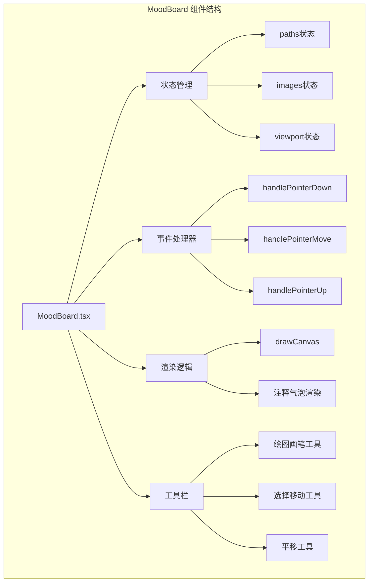

**图表来源**
- [MoodBoard.tsx](file://components/MoodBoard.tsx#L1-L50)

**章节来源**
- [MoodBoard.tsx](file://components/MoodBoard.tsx#L1-L770)

## 核心数据结构

### DrawPath 数据结构

DrawPath是系统的核心数据结构，用于表示用户绘制的路径：

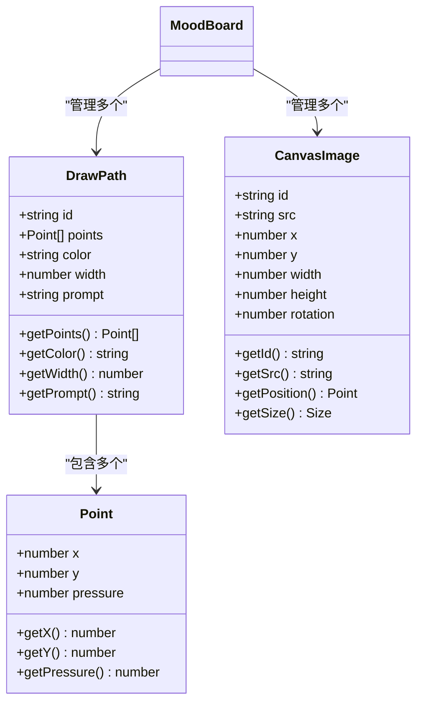

**图表来源**
- [types.ts](file://types.ts#L22-L33)

### 状态管理架构

系统使用React的useState和useRef来管理不同类型的状态：

```mermaid
graph LR
subgraph "状态管理"
A[paths: DrawPath[]] --> B[绘制路径集合]
C[images: CanvasImage[]] --> D[图像集合]
E[viewport: Viewport] --> F[视口变换]
G[tool: Tool] --> H[当前工具]
I[brushColor: string] --> J[画笔颜色]
K[brushSize: number] --> L[画笔大小]
M[selectedId: string] --> N[选中元素ID]
O[isGenerating: boolean] --> P[生成状态]
end
subgraph "引用状态"
Q[isDrawing: useRef] --> R[绘制状态]
S[isDragging: useRef] --> T[拖拽状态]
U[isPanning: useRef] --> V[平移状态]
W[lastPos: useRef] --> X[最后位置]
Y[lastPoint: useRef] --> Z[最后点]
AA[isSpacePressed: useRef] --> BB[空格键状态]
end
```

**图表来源**
- [MoodBoard.tsx](file://components/MoodBoard.tsx#L25-L51)

**章节来源**
- [types.ts](file://types.ts#L12-L33)
- [MoodBoard.tsx](file://components/MoodBoard.tsx#L25-L51)

## 路径管理系统

### 路径创建流程

路径创建通过`handlePointerDown`事件处理器实现：

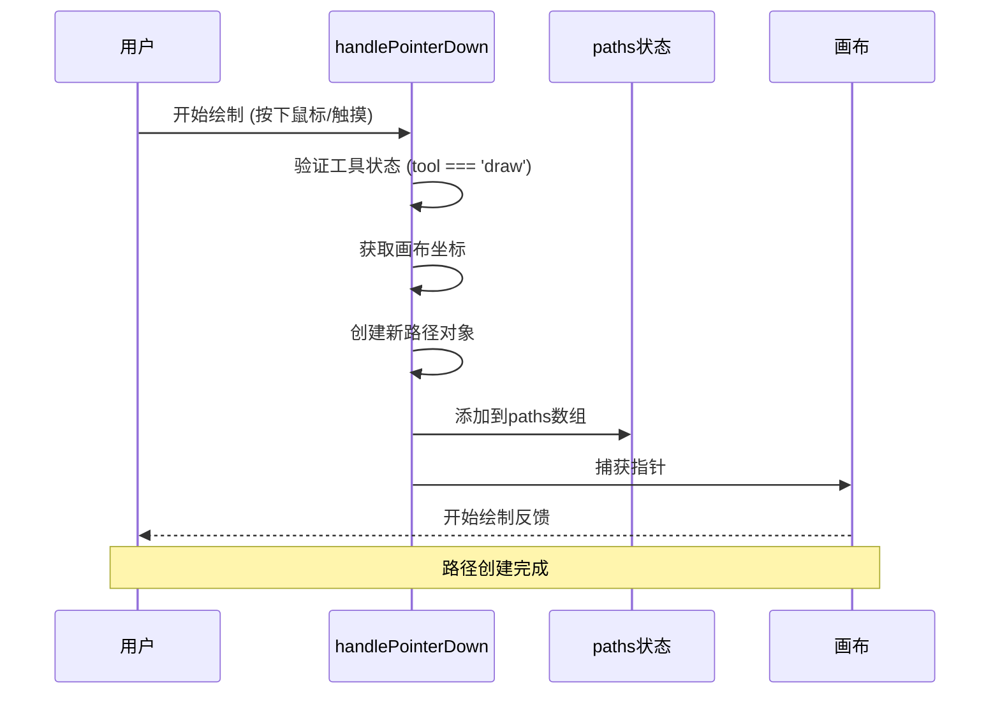

**图表来源**
- [MoodBoard.tsx](file://components/MoodBoard.tsx#L198-L221)

### 路径更新机制

路径更新通过`handlePointerMove`事件处理器实时处理：

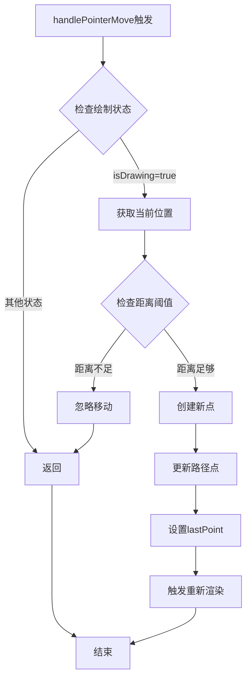

**图表来源**
- [MoodBoard.tsx](file://components/MoodBoard.tsx#L240-L275)

### 不可变更新模式

系统采用不可变更新模式管理路径状态：

```typescript
// 路径更新示例
setPaths(prev => {
  const lastPath = prev[prev.length - 1];
  const updatedPath = { 
    ...lastPath, 
    points: [...lastPath.points, { ...pos, pressure: e.pressure }] 
  };
  return [...prev.slice(0, -1), updatedPath];
});
```

**章节来源**
- [MoodBoard.tsx](file://components/MoodBoard.tsx#L198-L262)

## 注释气泡系统

### 注释气泡UI实现

注释气泡系统提供了直观的路径注释界面：

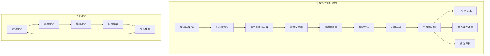

**图表来源**
- [MoodBoard.tsx](file://components/MoodBoard.tsx#L667-L700)

### 注释气泡定位算法

路径中心点计算确保注释气泡正确定位：

```mermaid
flowchart TD
A[开始计算中心点] --> B[初始化边界变量]
B --> C[遍历所有路径点]
C --> D{检查点数量}
D --> |点数为0| E[返回原点 {x:0,y:0}]
D --> |点数>0| F[更新边界值]
F --> G[计算最小最大值]
G --> H[计算中心坐标]
H --> I[x = (minX + maxX) / 2]
I --> J[y = (minY + maxY) / 2]
J --> K[返回中心点]
E --> L[结束]
K --> L
```

**图表来源**
- [MoodBoard.tsx](file://components/MoodBoard.tsx#L84-L93)

### 注释编辑功能

updatePathPrompt函数实现了注释内容的动态更新：

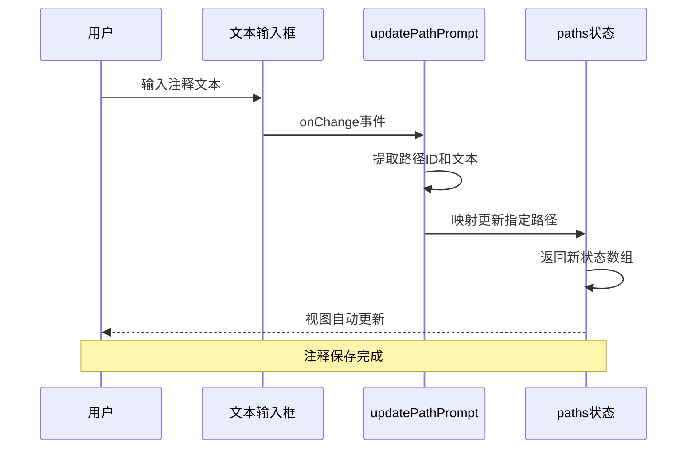

**图表来源**
- [MoodBoard.tsx](file://components/MoodBoard.tsx#L353-L355)

**章节来源**
- [MoodBoard.tsx](file://components/MoodBoard.tsx#L667-L700)
- [MoodBoard.tsx](file://components/MoodBoard.tsx#L84-L93)
- [MoodBoard.tsx](file://components/MoodBoard.tsx#L353-L355)

## 事件处理机制

### 指针事件链

系统实现了完整的指针事件处理链：

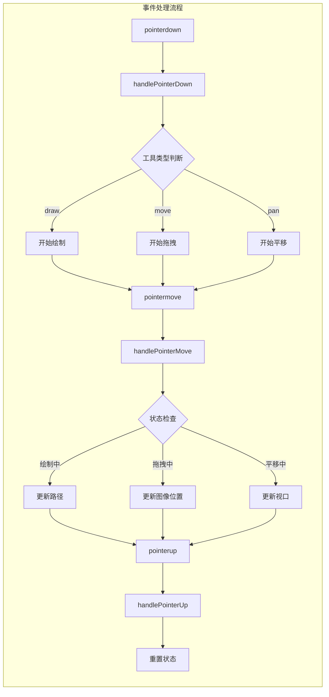

**图表来源**
- [MoodBoard.tsx](file://components/MoodBoard.tsx#L198-L284)

### 压力感应处理

系统支持压力感应设备，提供更真实的绘画体验：

```mermaid
flowchart TD
A[获取指针事件] --> B[提取压力值]
B --> C{压力值有效性}
C --> |有效| D[使用实际压力]
C --> |无效| E[使用默认值0.5]
D --> F[计算线宽]
E --> F
F --> G[lineWidth = width × (0.5 + pressure)]
G --> H[应用到绘制]
H --> I[渲染路径]
```

**图表来源**
- [MoodBoard.tsx](file://components/MoodBoard.tsx#L156-L157)

### 键盘快捷键支持

系统支持多种键盘快捷键：

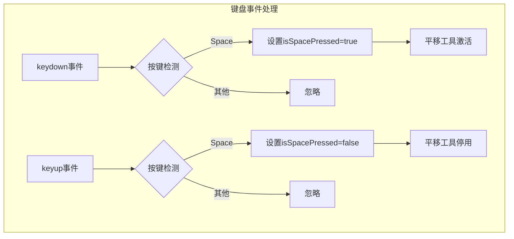

**图表来源**
- [MoodBoard.tsx](file://components/MoodBoard.tsx#L177-L193)

**章节来源**
- [MoodBoard.tsx](file://components/MoodBoard.tsx#L198-L284)
- [MoodBoard.tsx](file://components/MoodBoard.tsx#L156-L157)
- [MoodBoard.tsx](file://components/MoodBoard.tsx#L177-L193)

## 性能优化策略

### 渲染优化

系统采用多种性能优化技术：

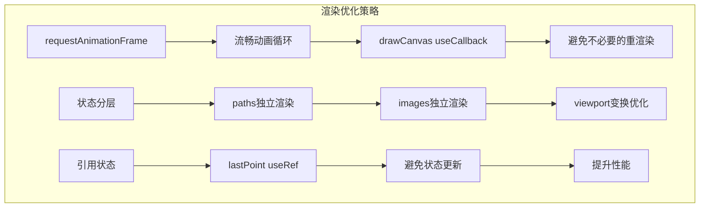

**图表来源**
- [MoodBoard.tsx](file://components/MoodBoard.tsx#L165-L174)

### 内存管理

系统使用useRef来管理临时状态，避免内存泄漏：

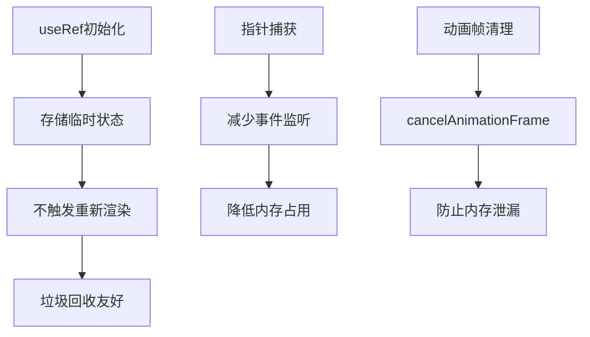

**图表来源**
- [MoodBoard.tsx](file://components/MoodBoard.tsx#L45-L51)

### 绘制性能优化

路径绘制采用高效的算法：

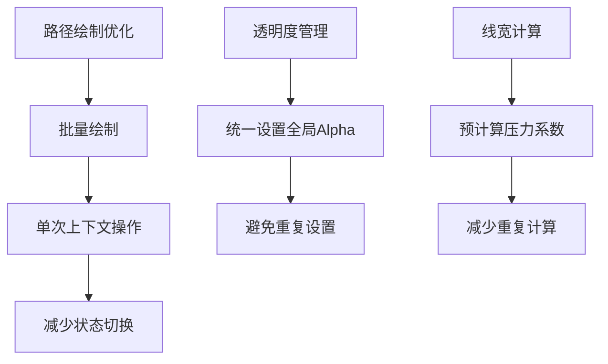

**图表来源**
- [MoodBoard.tsx](file://components/MoodBoard.tsx#L144-L161)

**章节来源**
- [MoodBoard.tsx](file://components/MoodBoard.tsx#L165-L174)
- [MoodBoard.tsx](file://components/MoodBoard.tsx#L45-L51)
- [MoodBoard.tsx](file://components/MoodBoard.tsx#L144-L161)

## 序列化与持久化

### 路径数据序列化

虽然代码中没有直接的序列化函数，但系统提供了数据导出功能：

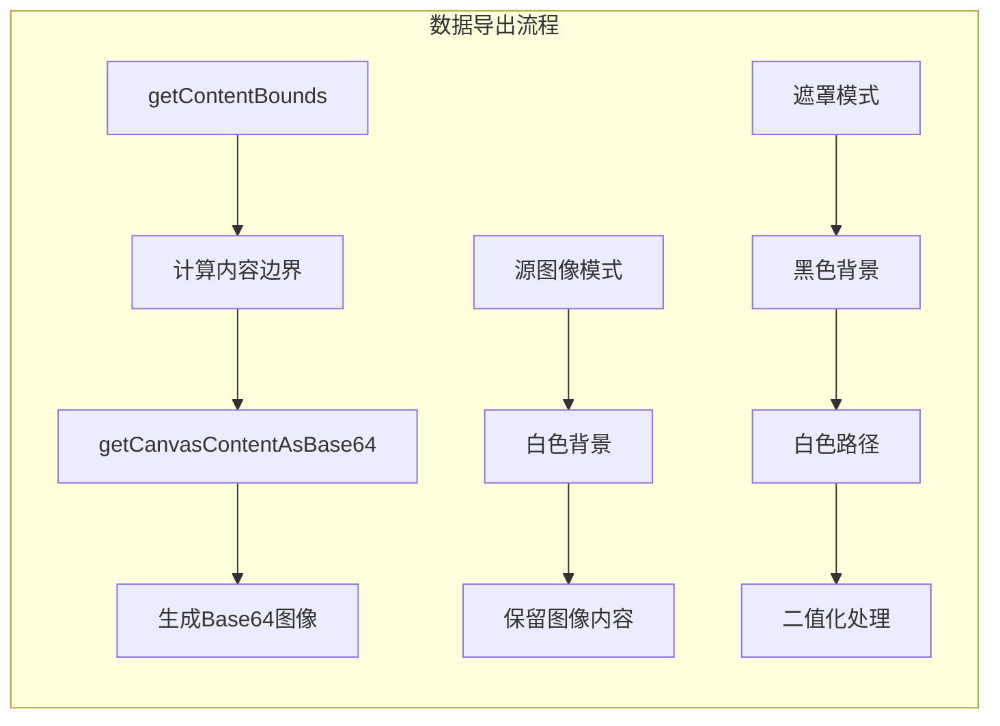

**图表来源**
- [MoodBoard.tsx](file://components/MoodBoard.tsx#L360-L467)

### 数据结构转换

系统支持不同类型的数据转换：

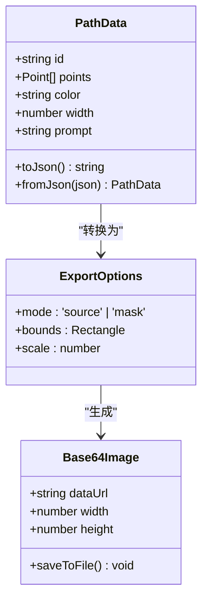

**图表来源**
- [MoodBoard.tsx](file://components/MoodBoard.tsx#L391-L467)

### 潜在扩展点

系统架构支持未来的序列化功能：

```typescript
// 可能的序列化实现
const serializePaths = (paths: DrawPath[]): string => {
  return JSON.stringify(paths.map(p => ({
    id: p.id,
    points: p.points.map(({x, y, pressure}) => ({x, y, pressure})),
    color: p.color,
    width: p.width,
    prompt: p.prompt
  })));
};

const deserializePaths = (data: string): DrawPath[] => {
  return JSON.parse(data).map(item => ({
    ...item,
    points: item.points.map(p => ({...p, pressure: p.pressure || 0.5}))
  }));
};
```

**章节来源**
- [MoodBoard.tsx](file://components/MoodBoard.tsx#L360-L467)

## 架构设计分析

### 整体架构模式

MoodBoard采用函数式组件加Hook的设计模式：

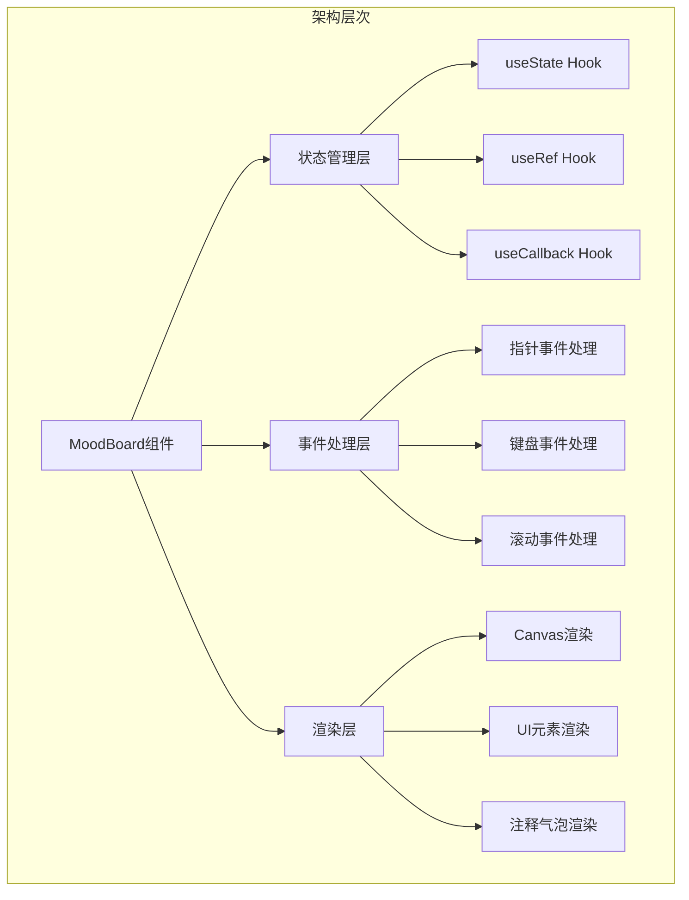

**图表来源**
- [MoodBoard.tsx](file://components/MoodBoard.tsx#L1-L770)

### 数据流设计

系统遵循单向数据流原则：

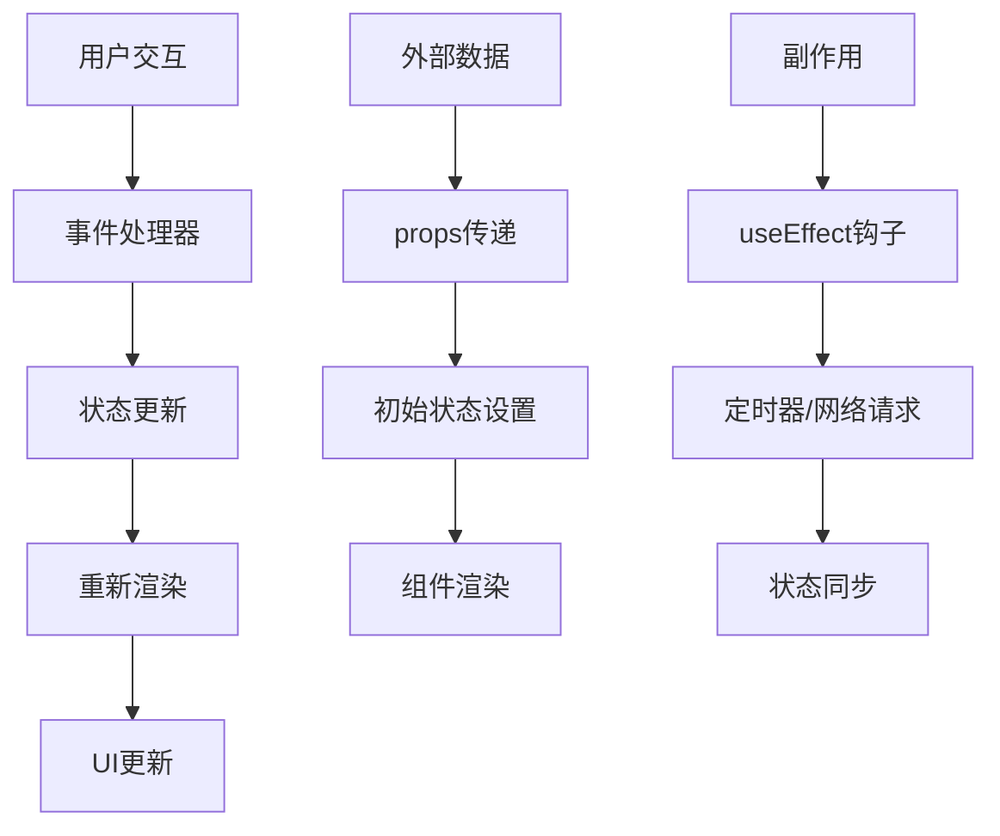

**图表来源**
- [MoodBoard.tsx](file://components/MoodBoard.tsx#L165-L174)

### 扩展性设计

系统具有良好的扩展性：

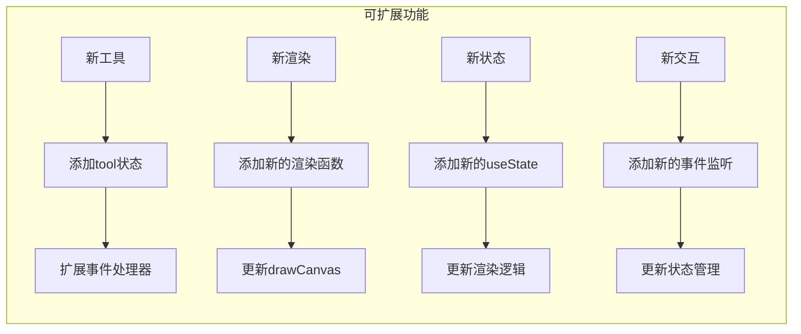

**章节来源**
- [MoodBoard.tsx](file://components/MoodBoard.tsx#L1-L770)

## 总结

MoodBoard组件的路径与注释管理系统展现了现代React应用的最佳实践：

### 核心优势

1. **高性能渲染**：通过useCallback和requestAnimationFrame优化渲染性能
2. **响应式交互**：完整的指针事件处理链，支持压力感应和键盘快捷键
3. **灵活的状态管理**：合理的状态分层和不可变更新模式
4. **优秀的用户体验**：直观的注释气泡系统和流畅的动画效果
5. **可扩展架构**：模块化的代码结构便于功能扩展

### 技术亮点

- 使用useRef管理临时状态，避免不必要的重新渲染
- 采用不可变更新模式维护状态一致性
- 实现了复杂的路径数据结构和算法
- 提供了完整的注释气泡UI解决方案
- 支持多种工具模式和交互方式

### 应用价值

该系统不仅是一个功能完善的数字画板应用，更是现代Web应用开发的优秀范例，展示了如何在React框架下构建高性能、高可用的复杂交互系统。