# 路径绘制机制

<cite>
**本文档中引用的文件**
- [MoodBoard.tsx](file://components/MoodBoard.tsx)
- [types.ts](file://types.ts)
</cite>

## 目录
1. [简介](#简介)
2. [项目结构概览](#项目结构概览)
3. [核心组件分析](#核心组件分析)
4. [架构概览](#架构概览)
5. [详细组件分析](#详细组件分析)
6. [依赖关系分析](#依赖关系分析)
7. [性能考虑](#性能考虑)
8. [故障排除指南](#故障排除指南)
9. [结论](#结论)

## 简介

MoodBoard组件是BananaCanvase应用的核心绘图功能模块，它提供了一个基于Web的无限画布系统，支持多种绘图工具和交互操作。该系统采用了先进的指针事件处理机制，实现了流畅的路径绘制体验，包括压力感应、实时渲染和高性能优化。

本文档将深入解析MoodBoard组件中基于指针事件的路径绘制实现机制，重点关注三个关键事件处理器的协同工作原理，以及DrawPath数据结构的设计理念和性能优化策略。

## 项目结构概览

MoodBoard组件位于`components/MoodBoard.tsx`文件中，采用React函数式组件设计，集成了TypeScript类型安全和现代React特性。整个项目遵循模块化架构，主要文件组织如下：

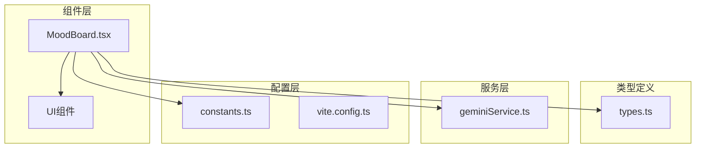

**图表来源**
- [MoodBoard.tsx](file://components/MoodBoard.tsx#L1-L50)
- [types.ts](file://types.ts#L1-L61)

**章节来源**
- [MoodBoard.tsx](file://components/MoodBoard.tsx#L1-L100)
- [types.ts](file://types.ts#L1-L61)

## 核心组件分析

### 状态管理系统

MoodBoard组件使用React的useState和useRef钩子来管理复杂的交互状态：

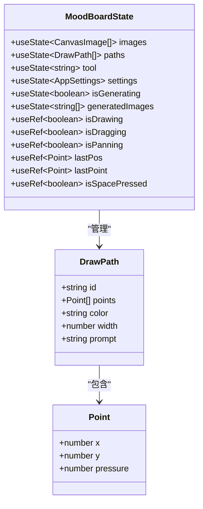

**图表来源**
- [MoodBoard.tsx](file://components/MoodBoard.tsx#L27-L54)
- [types.ts](file://types.ts#L22-L34)

### 工具状态枚举

系统支持四种主要工具模式：
- `'select'`: 选择模式（未直接使用）
- `'move'`: 图像移动模式
- `'draw'`: 绘图模式
- `'pan'`: 视图平移模式

**章节来源**
- [MoodBoard.tsx](file://components/MoodBoard.tsx#L28-L29)

## 架构概览

MoodBoard组件采用分层架构设计，将用户交互、状态管理和渲染逻辑清晰分离：

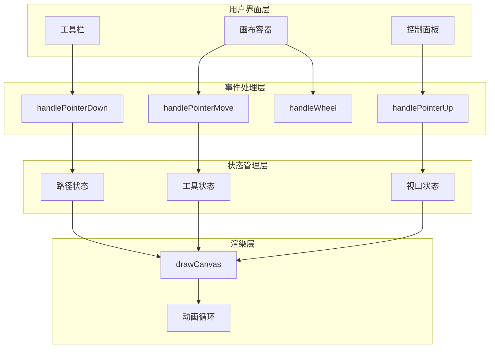

**图表来源**
- [MoodBoard.tsx](file://components/MoodBoard.tsx#L670-L680)
- [MoodBoard.tsx](file://components/MoodBoard.tsx#L167-L176)

## 详细组件分析

### 指针事件处理机制

#### handlePointerDown事件处理器

handlePointerDown是路径绘制流程的入口点，负责初始化绘制状态并确定操作类型：

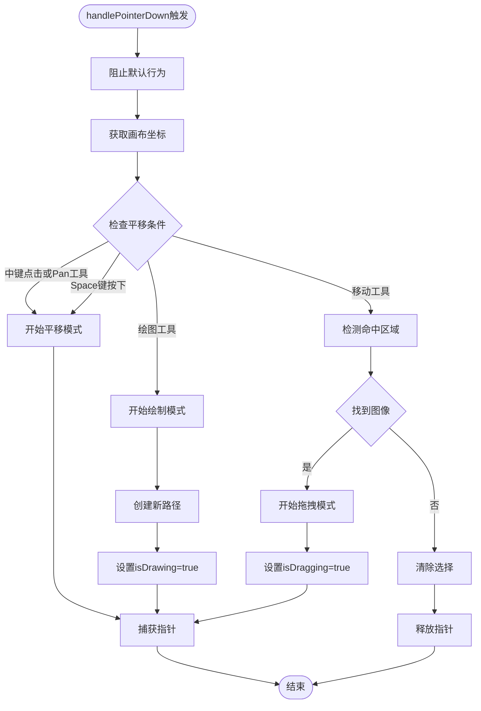

**图表来源**
- [MoodBoard.tsx](file://components/MoodBoard.tsx#L200-L239)

#### handlePointerMove事件处理器

handlePointerMove负责实时更新绘制路径和处理各种交互模式：

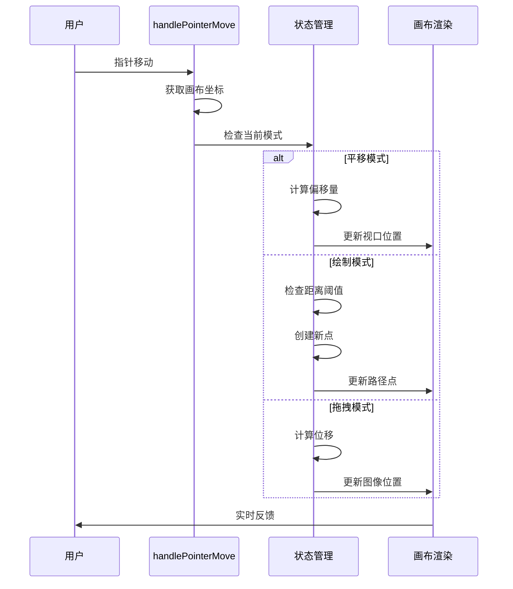

**图表来源**
- [MoodBoard.tsx](file://components/MoodBoard.tsx#L242-L278)

#### handlePointerUp事件处理器

handlePointerUp负责清理状态并结束所有交互模式：

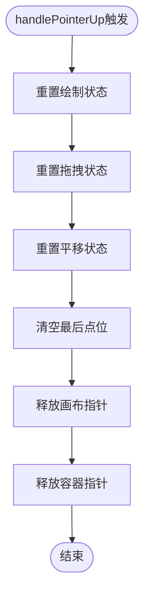

**图表来源**
- [MoodBoard.tsx](file://components/MoodBoard.tsx#L279-L287)

**章节来源**
- [MoodBoard.tsx](file://components/MoodBoard.tsx#L200-L287)

### DrawPath数据结构详解

DrawPath是路径绘制的核心数据结构，包含了完整的路径信息：

| 字段名 | 类型 | 描述 | 默认值 |
|--------|------|------|--------|
| id | string | 唯一标识符 | Date.now().toString() |
| points | Point[] | 路径点数组 | [] |
| color | string | 线条颜色 | brushColor |
| width | number | 线条宽度 | brushSize |
| prompt | string | 编辑说明 | '' |

#### Point数据结构

Point结构体包含了空间坐标和压力感应信息：

| 字段名 | 类型 | 描述 | 取值范围 |
|--------|------|------|----------|
| x | number | X坐标 | 画布空间 |
| y | number | Y坐标 | 画布空间 |
| pressure | number | 压力值 | 0.0 - 1.0 |

**章节来源**
- [types.ts](file://types.ts#L22-L34)

### 压力感应与线条粗细控制

系统实现了基于压力感应的压力敏感绘图功能：

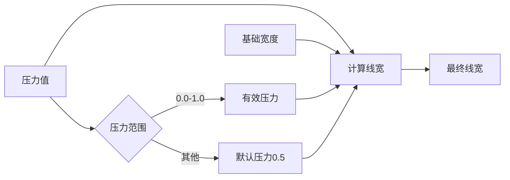

**图表来源**
- [MoodBoard.tsx](file://components/MoodBoard.tsx#L158-L160)
- [MoodBoard.tsx](file://components/MoodBoard.tsx#L461-L463)

压力感应的线宽计算公式为：`lineWidth = baseWidth * (0.5 + pressure)`，其中0.5确保最小线宽，最大压力值可使线宽翻倍。

**章节来源**
- [MoodBoard.tsx](file://components/MoodBoard.tsx#L158-L160)
- [MoodBoard.tsx](file://components/MoodBoard.tsx#L461-L463)

### 不可变更新策略

setPaths函数使用不可变更新模式来维护路径列表：

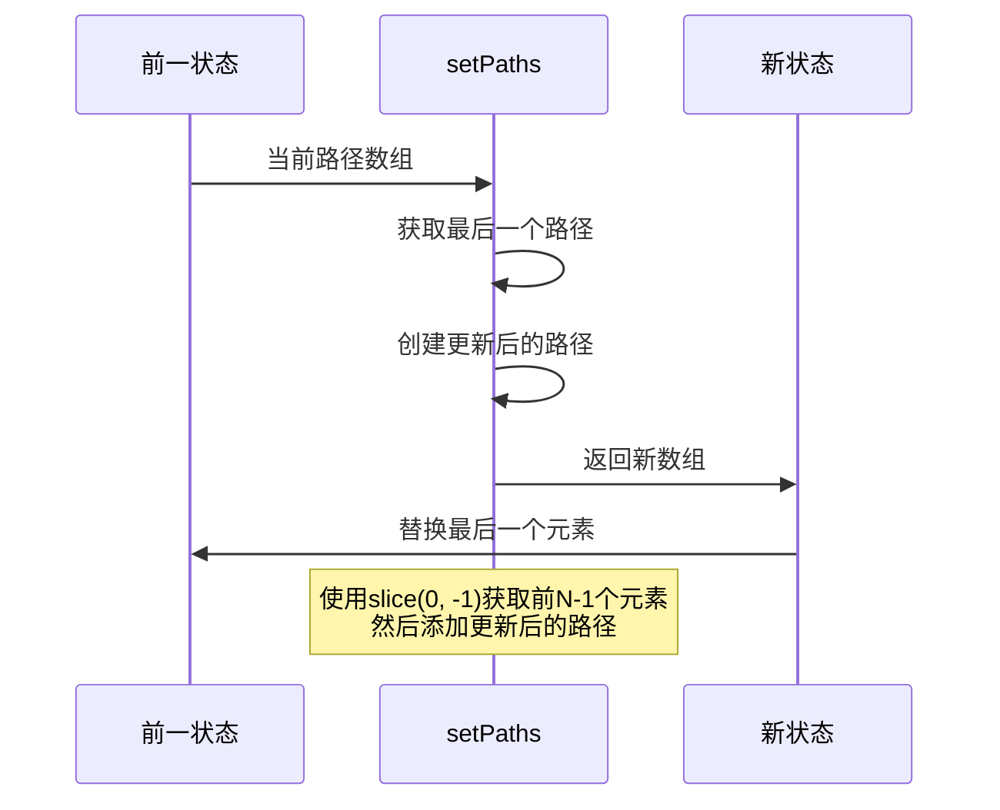

**图表来源**
- [MoodBoard.tsx](file://components/MoodBoard.tsx#L253-L263)

这种更新策略确保了：
1. 性能优化：只更新必要的部分
2. 状态一致性：保持不可变性
3. 渲染效率：减少不必要的重新渲染

**章节来源**
- [MoodBoard.tsx](file://components/MoodBoard.tsx#L253-L263)

### lastPoint优化机制

lastPoint.current引用用于优化绘制性能，避免记录过于密集的点位：

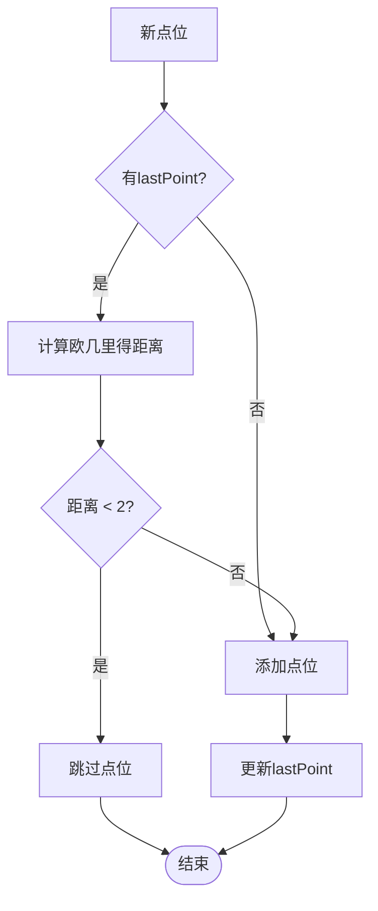

**图表来源**
- [MoodBoard.tsx](file://components/MoodBoard.tsx#L255-L260)

距离阈值2像素的设定平衡了：
- **精度需求**：足够捕捉细微的手势
- **性能考虑**：避免过度的点位存储
- **用户体验**：提供流畅的绘制体验

**章节来源**
- [MoodBoard.tsx](file://components/MoodBoard.tsx#L255-L260)

### isDrawing状态跟踪

isDrawing.current是一个关键的引用变量，用于跟踪当前是否处于绘制状态：

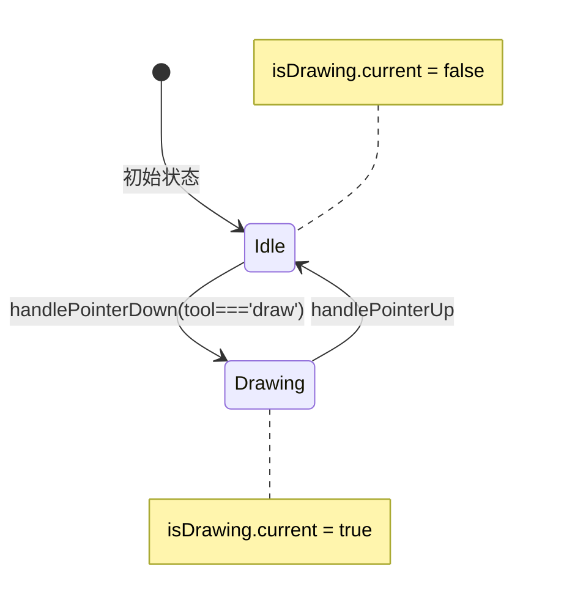

**图表来源**
- [MoodBoard.tsx](file://components/MoodBoard.tsx#L212-L214)
- [MoodBoard.tsx](file://components/MoodBoard.tsx#L280-L282)

isDrawing状态的判断逻辑：
1. **进入绘制模式**：当tool为'draw'且用户按下鼠标时
2. **退出绘制模式**：当用户释放鼠标时
3. **状态同步**：与tool状态保持一致

**章节来源**
- [MoodBoard.tsx](file://components/MoodBoard.tsx#L212-L214)
- [MoodBoard.tsx](file://components/MoodBoard.tsx#L280-L282)

### 工具状态与绘制模式

系统通过tool状态严格区分不同的操作模式：

```mermaid
graph TD
ToolState[tool状态] --> DrawMode{绘制模式}
ToolState --> MoveMode{移动模式}
ToolState --> PanMode{平移模式}
DrawMode --> |tool === 'draw'| EnableDrawing[启用绘制功能]
MoveMode --> |tool === 'move'| EnableMovement[启用移动功能]
PanMode --> |tool === 'pan'|| EnablePanning[启用平移功能]
EnableDrawing --> PathCreation[路径创建]
EnableDrawing --> PressureSensitivity[压力感应]
EnableMovement --> HitDetection[命中检测]
EnableMovement --> ImageDragging[图像拖拽]
EnablePanning --> ViewportPan[视口平移]
```

**图表来源**
- [MoodBoard.tsx](file://components/MoodBoard.tsx#L211-L214)
- [MoodBoard.tsx](file://components/MoodBoard.tsx#L223-L239)

**章节来源**
- [MoodBoard.tsx](file://components/MoodBoard.tsx#L211-L239)

## 依赖关系分析

MoodBoard组件与外部模块的依赖关系：

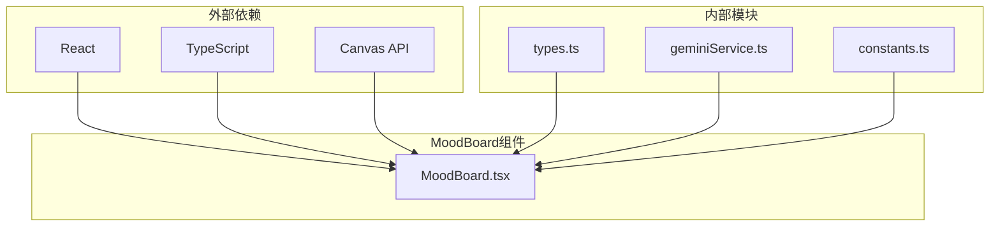

**图表来源**
- [MoodBoard.tsx](file://components/MoodBoard.tsx#L1-L15)

**章节来源**
- [MoodBoard.tsx](file://components/MoodBoard.tsx#L1-L15)

## 性能考虑

### 动画循环优化

系统使用requestAnimationFrame实现高效的渲染循环：

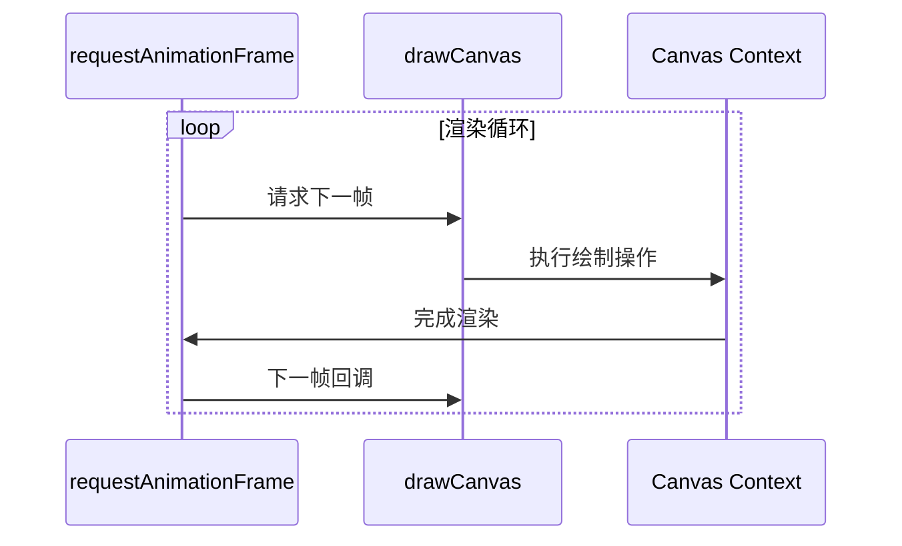

**图表来源**
- [MoodBoard.tsx](file://components/MoodBoard.tsx#L167-L176)

### 内存管理策略

1. **引用变量使用**：isDrawing、lastPoint等使用useRef避免重新渲染
2. **状态更新优化**：使用不可变更新减少不必要的状态传播
3. **事件监听器清理**：在组件卸载时正确清理事件监听器

### 渲染性能优化

1. **批量绘制**：将多个路径点合并到单次绘制调用
2. **透明度控制**：使用globalAlpha实现半透明效果而不影响性能
3. **条件渲染**：只绘制有效的路径点（points.length >= 2）

## 故障排除指南

### 常见问题及解决方案

#### 绘制不流畅

**问题症状**：路径绘制出现卡顿或延迟
**可能原因**：
- lastPoint优化导致点位丢失过多
- 绘制频率过高

**解决方案**：
- 调整距离阈值（目前为2像素）
- 检查浏览器性能监控指标

#### 压力感应失效

**问题症状**：线条粗细不随压力变化
**可能原因**：
- 浏览器不支持pressure属性
- 压力值超出有效范围

**解决方案**：
- 使用默认压力值0.5作为后备
- 检查输入设备兼容性

#### 路径丢失

**问题症状**：绘制过程中路径突然消失
**可能原因**：
- 状态更新错误
- 引用变量被意外修改

**解决方案**：
- 验证不可变更新逻辑
- 检查引用变量的生命周期

**章节来源**
- [MoodBoard.tsx](file://components/MoodBoard.tsx#L255-L260)
- [MoodBoard.tsx](file://components/MoodBoard.tsx#L158-L160)

## 结论

MoodBoard组件的路径绘制机制展现了现代Web应用开发的最佳实践。通过精心设计的状态管理、事件处理和性能优化策略，系统实现了流畅、响应式的绘图体验。

### 关键技术亮点

1. **指针事件统一处理**：使用React的PointerEvents API简化跨平台交互
2. **压力感应支持**：充分利用现代输入设备的高级功能
3. **性能优化策略**：通过距离阈值和不可变更新实现高效渲染
4. **状态管理清晰**：合理使用React Hooks和引用变量

### 设计原则总结

- **单一职责**：每个事件处理器专注于特定的操作类型
- **状态隔离**：不同工具模式间的状态完全独立
- **性能优先**：在用户体验和系统性能之间找到最佳平衡
- **类型安全**：利用TypeScript确保代码的可靠性和可维护性

这套路径绘制机制不仅满足了当前的功能需求，还为未来的扩展和优化奠定了坚实的基础。通过持续的性能监控和用户体验优化，该系统有望成为Web端高质量绘图应用的标杆实现。