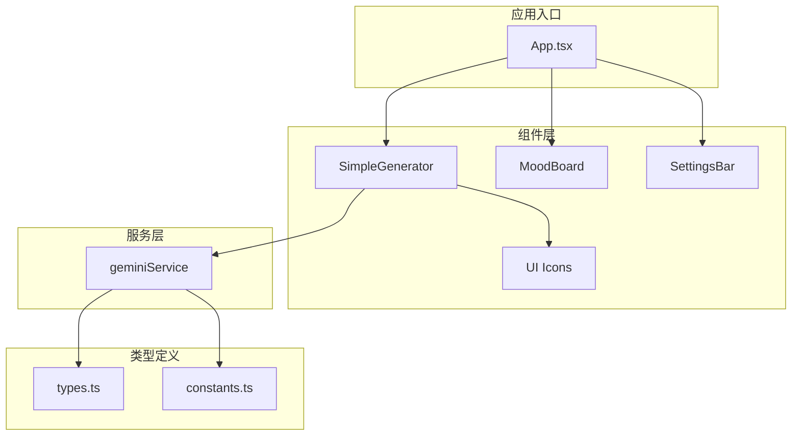
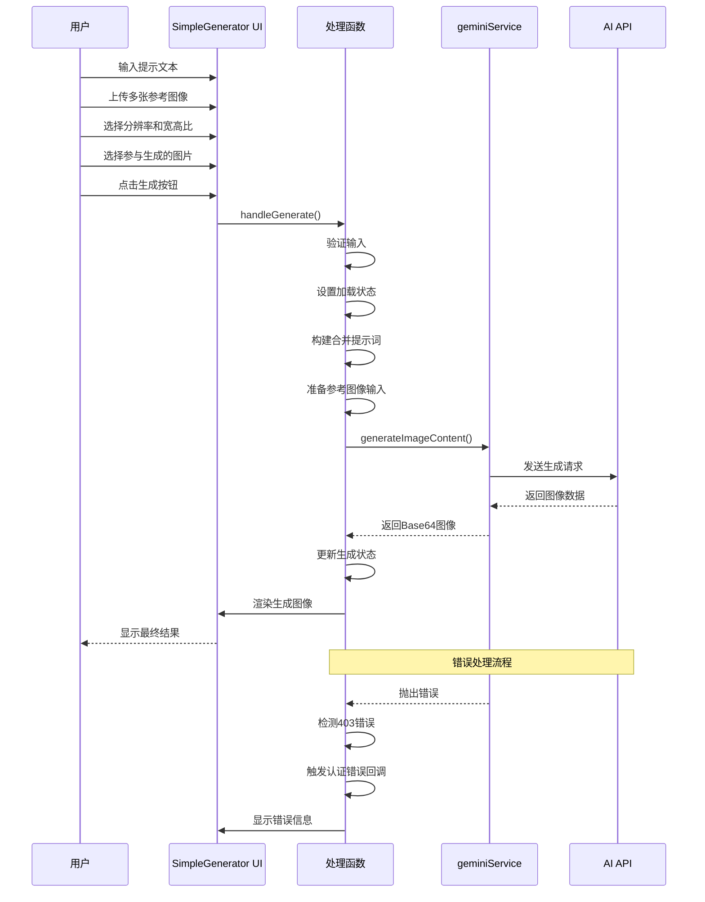
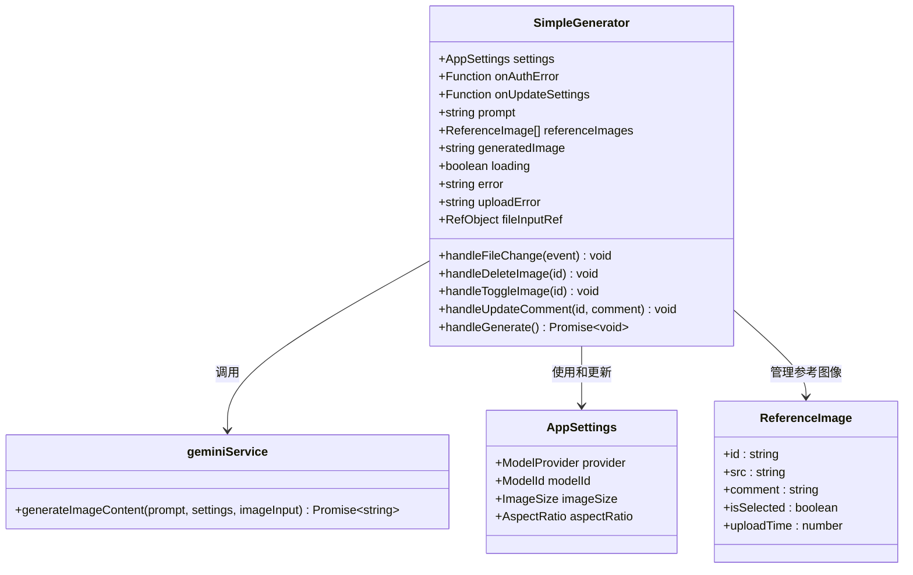
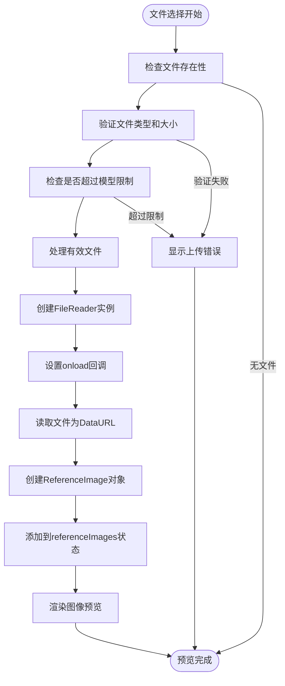
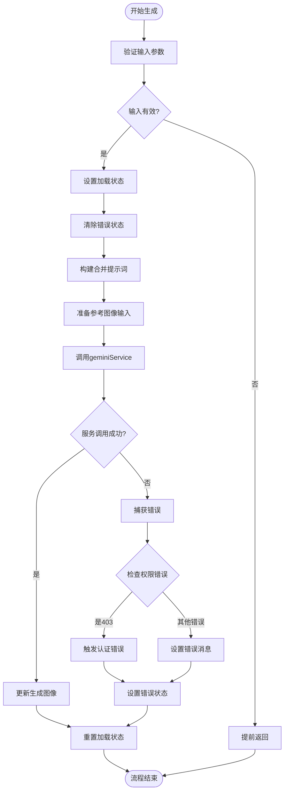
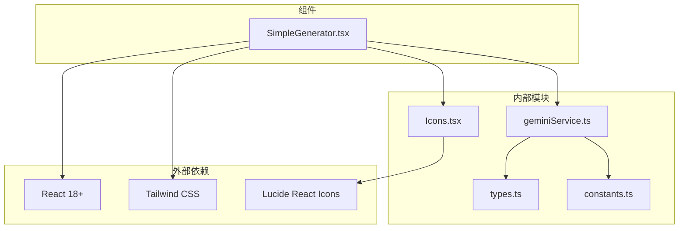

# 简易生成器组件

<cite>
**本文档中引用的文件**
- [SimpleGenerator.tsx](file://components/SimpleGenerator.tsx) - *新增多图引用、分辨率和宽高比选择功能*
- [geminiService.ts](file://services/geminiService.ts)
- [types.ts](file://types.ts) - *定义AppSettings和ReferenceImage接口*
- [constants.ts](file://constants.ts) - *包含分辨率、宽高比和模型限制常量*
- [Icons.tsx](file://components/ui/Icons.tsx)
- [App.tsx](file://App.tsx)
- [README.md](file://README.md)
</cite>

## 更新摘要
**变更内容**
- 新增多图引用功能的详细说明
- 更新核心组件和架构概览部分以反映新功能
- 添加多文件上传处理、参考图像管理、模型限制检查、融合提示构建等新功能描述
- 增强与AppSettings的同步机制说明
- 添加Google服务商的限制提示功能

## 目录
1. [简介](#简介)
2. [项目结构](#项目结构)
3. [核心组件](#核心组件)
4. [架构概览](#架构概览)
5. [详细组件分析](#详细组件分析)
6. [依赖关系分析](#依赖关系分析)
7. [性能考虑](#性能考虑)
8. [故障排除指南](#故障排除指南)
9. [结论](#结论)

## 简介

SimpleGenerator组件是BananaCanvase应用中的核心AI图像生成功能模块，为用户提供了一个直观的界面来通过文本提示和可选的参考图像生成AI驱动的艺术作品。该组件实现了完整的异步工作流程，从用户输入到最终图像输出，包括错误处理、加载状态管理和响应式布局设计。

该组件采用现代化的React架构，结合TypeScript类型安全和Tailwind CSS样式系统，提供了流畅的用户体验。它支持多种AI提供商（Google Gemini和AIHubMix），并具备智能的权限错误检测和处理机制。**最新更新增加了多图引用、分辨率和宽高比选择功能，让用户能够更精确地控制生成图像的输出规格**。

## 项目结构

SimpleGenerator组件位于项目的`components`目录下，与其他核心组件协同工作：



**图表来源**
- [SimpleGenerator.tsx](file://components/SimpleGenerator.tsx#L1-L148)
- [App.tsx](file://App.tsx#L124-L142)
- [geminiService.ts](file://services/geminiService.ts#L1-L112)

**章节来源**
- [SimpleGenerator.tsx](file://components/SimpleGenerator.tsx#L1-L148)
- [App.tsx](file://App.tsx#L119-L142)

## 核心组件

SimpleGenerator组件是一个功能完整的React函数组件，具有以下核心特性：

### 主要状态管理
- **提示文本状态** (`prompt`)：存储用户的文本描述
- **参考图像状态** (`referenceImages`)：存储上传的参考图像数组，包含每张图片的Base64数据、注释和选中状态
- **生成图像状态** (`generatedImage`)：存储最终生成的图像
- **加载状态** (`loading`)：指示当前是否正在进行图像生成
- **错误状态** (`error`)：存储生成过程中的错误信息
- **上传错误状态** (`uploadError`)：存储文件上传过程中的验证错误信息

### 关键功能特性
- **多文件上传处理**：支持一次上传多张参考图像
- **参考图像管理**：提供删除、选中/取消选中、添加注释等功能
- **文件验证**：检查文件类型、大小和数量限制
- **异步生成流程**：完整的Promise链式处理
- **权限错误检测**：智能识别403权限错误
- **响应式布局**：适应桌面端和移动端屏幕尺寸
- **条件渲染**：根据状态动态显示不同UI元素
- **分辨率选择**：下拉菜单允许用户选择1K、2K或4K分辨率
- **宽高比选择**：下拉菜单支持1:1、3:4、4:3、9:16和16:9等宽高比
- **模型限制检查**：根据当前模型动态调整可用选项和上传限制
- **融合提示构建**：将全局描述和各参考图片的注释合并为最终提示词
- **服务商限制提示**：当使用Google官方API时，提示用户不支持自定义分辨率和宽高比

**章节来源**
- [SimpleGenerator.tsx](file://components/SimpleGenerator.tsx#L11-L18)

## 架构概览

SimpleGenerator组件采用了清晰的分层架构设计，确保了代码的可维护性和扩展性：



**图表来源**
- [SimpleGenerator.tsx](file://components/SimpleGenerator.tsx#L30-L50)
- [geminiService.ts](file://services/geminiService.ts#L5-L112)

## 详细组件分析

### 组件结构与状态管理

SimpleGenerator组件使用React Hooks进行状态管理，实现了完整的生命周期控制：



**图表来源**
- [SimpleGenerator.tsx](file://components/SimpleGenerator.tsx#L6-L9)
- [geminiService.ts](file://services/geminiService.ts#L5-L9)
- [types.ts](file://types.ts#L50-L56)

#### 多文件上传与预览机制

组件使用FileReader API实现多文件的即时预览和管理功能：



**图表来源**
- [SimpleGenerator.tsx](file://components/SimpleGenerator.tsx#L54-L119)

#### 异步生成流程

图像生成过程遵循严格的异步模式，确保用户体验的流畅性：



**图表来源**
- [SimpleGenerator.tsx](file://components/SimpleGenerator.tsx#L160-L196)

**章节来源**
- [SimpleGenerator.tsx](file://components/SimpleGenerator.tsx#L19-L50)

### 多图引用与参考图像管理

#### 参考图像数据结构
每个参考图像包含以下信息：
- **id**: 唯一标识符，使用时间戳和随机字符串生成
- **src**: Base64编码的图片数据（包含data:image/...前缀）
- **comment**: 用户为该图片填写的参考意见
- **isSelected**: 是否参与本次融合生成
- **uploadTime**: 上传时间戳（毫秒级）

#### 参考图像操作功能
- **上传**：支持一次选择多张图片，自动验证文件类型、大小和数量限制
- **删除**：点击删除按钮移除指定图片
- **选中/取消选中**：通过复选框控制图片是否参与生成
- **添加注释**：为每张图片添加具体参考意见
- **状态显示**：实时显示已上传图片数量和模型限制

**章节来源**
- [SimpleGenerator.tsx](file://components/SimpleGenerator.tsx#L14-L19)
- [types.ts](file://types.ts#L50-L56)

### 分辨率和宽高比选择功能

#### UI位置与布局
分辨率和宽高比选择器位于输入区域的中间部分，采用网格布局并列显示：
- **位置**：在提示文本区域下方，参考图像上传区域上方
- **布局**：使用`grid grid-cols-2 gap-3`实现两列等宽布局
- **样式**：与整体UI风格一致，采用深色背景和香蕉黄焦点效果

#### 功能描述
- **分辨率选择**：
  - 提供1K、2K、4K三种分辨率选项
  - 根据当前选择的模型动态调整可用选项
  - Nano Banana模型仅支持1K分辨率，此时下拉菜单被禁用
  - 显示每个分辨率的具体像素尺寸（如1K为1024×1024）

- **宽高比选择**：
  - 提供五种常用宽高比：1:1（正方形）、3:4（竖版）、4:3（横版）、9:16（手机竖屏）、16:9（宽屏）
  - 所有模型均支持全部宽高比选项
  - 选择后立即生效，无需额外确认操作

#### 与AppSettings的同步机制
- **状态同步**：通过`onUpdateSettings`回调函数实现双向绑定
- **分辨率同步**：
```typescript
onChange={(e) => onUpdateSettings?.({ imageSize: e.target.value as ImageSize })}
```
- **宽高比同步**：
```typescript
onChange={(e) => onUpdateSettings?.({ aspectRatio: e.target.value as AspectRatio })}
```
- **模型兼容性检查**：当模型切换导致当前分辨率不支持时，自动重置为1K
```typescript
useEffect(() => {
  const isCurrentSizeSupported = availableImageSizes.some(size => size.id === settings.imageSize);
  if (!isCurrentSizeSupported && onUpdateSettings) {
    onUpdateSettings({ imageSize: '1K' });
  }
}, [settings.modelId, settings.imageSize, availableImageSizes, onUpdateSettings]);
```

**章节来源**
- [SimpleGenerator.tsx](file://components/SimpleGenerator.tsx#L84-L114)
- [constants.ts](file://constants.ts#L14-L36)
- [types.ts](file://types.ts#L36-L43)

### 融合提示构建机制

组件实现了智能的融合提示构建功能，将全局描述和各参考图片的注释合并为最终提示词：

#### 构建流程
1. **添加全局描述**：将用户输入的全局提示文本添加到提示词中
2. **添加参考意见**：遍历所有选中的参考图片，将其注释按顺序添加到提示词中
3. **格式化输出**：使用换行符分隔不同部分，形成结构化的提示词

#### 实现代码
```typescript
const buildMergedPrompt = useCallback(() => {
  const parts: string[] = [];
  
  // 添加全局描述
  if (prompt.trim()) {
    parts.push(prompt.trim());
  }
  
  // 添加每张勾选图片的意见
  selectedImages.forEach((image, index) => {
    if (image.comment.trim()) {
      parts.push(`参考图片${index + 1}的说明: ${image.comment.trim()}`);
    }
  });
  
  return parts.join('\n\n');
}, [prompt, selectedImages]);
```

**章节来源**
- [SimpleGenerator.tsx](file://components/SimpleGenerator.tsx#L142-L158)

### 模型限制检查机制

组件实现了基于当前模型的动态限制检查功能：

#### 限制类型
- **分辨率限制**：根据模型ID获取支持的分辨率选项
- **图片数量限制**：根据模型ID获取最大参考图片数量

#### 实现方式
- **分辨率限制**：使用`getAvailableImageSizes`函数根据模型ID返回支持的分辨率选项
- **图片数量限制**：使用`getMaxImageCount`函数根据模型ID返回最大图片数量
- **实时检查**：使用useEffect监听模型变化和图片数量变化，及时更新UI状态

#### 代码实现
```typescript
// 获取当前模型支持的最大图片数
const maxImageCount = getMaxImageCount(settings.modelId);

// 当模型变化时,检查图片数量是否超限
useEffect(() => {
  if (referenceImages.length > maxImageCount) {
    setUploadError(`当前模型最多支持${maxImageCount}张图片,请删除多余图片或取消勾选`);
  } else {
    setUploadError(null);
  }
}, [settings.modelId, maxImageCount, referenceImages.length]);
```

**章节来源**
- [SimpleGenerator.tsx](file://components/SimpleGenerator.tsx#L25-L43)
- [constants.ts](file://constants.ts#L45-L54)

### 服务商限制提示功能

组件增加了针对不同AI服务商的功能限制提示：

#### 提示条件
- 当`settings.provider`为'Google'时显示提示
- 提示内容：Google官方API不支持自定义分辨率和宽高比参数

#### 提示内容
- **警告图标**：使用⚠️符号引起用户注意
- **明确说明**：指出当前使用的是Google官方API，不支持自定义参数
- **解决方案**：建议用户切换到AIHubMix服务商以使用这些功能

#### UI实现
```jsx
{settings.provider === 'Google' && (
  <div className="bg-blue-500/10 border border-blue-500/30 rounded-lg p-3">
    <p className="text-sm text-blue-200">
      ⚠️ 当前使用 Google 官方 API，不支持自定义分辨率和宽高比参数。
      请在配置中切换到 <strong>AIHubMix</strong> 服务商以使用这些功能。
    </p>
  </div>
)}
```

**章节来源**
- [SimpleGenerator.tsx](file://components/SimpleGenerator.tsx#L250-L258)

### 权限错误处理机制

组件实现了智能的权限错误检测，能够区分不同的错误类型并采取相应的处理措施：

#### 错误检测逻辑
- **403状态码检测**：直接检查HTTP状态码
- **权限关键词匹配**：搜索错误消息中的"permission"和"not found"关键词
- **回调触发**：当检测到权限问题时，调用父组件的`onAuthError`回调

#### 错误信息展示
- **视觉反馈**：红色边框和背景的错误容器
- **具体指导**：针对403错误提供API密钥配置指导
- **用户友好**：简洁明了的错误描述

**章节来源**
- [SimpleGenerator.tsx](file://components/SimpleGenerator.tsx#L37-L48)

### 响应式布局设计

组件采用Tailwind CSS实现响应式布局，确保在不同设备上都能提供良好的用户体验：

#### 布局结构
- **Flex布局**：使用`flex`和`lg:flex-row`实现灵活的布局切换
- **网格系统**：利用`flex-1`和`gap-6`创建平衡的空间分布
- **最小高度**：设置`min-h-0`和`min-h-[400px]`确保内容区域的正确行为

#### 移动端适配
- **单列布局**：在小屏幕上自动切换为垂直排列
- **触摸友好的控件**：按钮和输入框的适当尺寸
- **滚动处理**：`overflow-y-auto`确保内容可滚动

**章节来源**
- [SimpleGenerator.tsx](file://components/SimpleGenerator.tsx#L53-L144)

### 图像生成服务集成

SimpleGenerator与geminiService紧密集成，实现了完整的AI图像生成管道：

#### 服务调用流程
1. **参数准备**：组合提示文本和可选的参考图像
2. **API配置**：根据提供商设置正确的API钥和基础URL
3. **请求构建**：创建符合AI模型要求的请求格式
4. **响应解析**：提取生成的图像数据并转换为Base64格式

#### 支持的提供商
- **Google Gemini**：标准的Google AI服务
- **AIHubMix**：第三方AI服务提供商，具有特殊的配置需求

**章节来源**
- [geminiService.ts](file://services/geminiService.ts#L5-L112)
- [SimpleGenerator.tsx](file://components/SimpleGenerator.tsx#L35)

## 依赖关系分析

SimpleGenerator组件的依赖关系体现了清晰的分层架构：



**图表来源**
- [SimpleGenerator.tsx](file://components/SimpleGenerator.tsx#L1-L5)
- [geminiService.ts](file://services/geminiService.ts#L1-L4)

### 类型定义依赖

组件严格依赖于类型定义来确保类型安全：

#### 核心类型
- **AppSettings**：应用程序设置接口，包含imageSize和aspectRatio字段
- **ModelProvider**：AI提供商枚举
- **ModelId**：模型标识符枚举
- **ImageSize**：分辨率枚举（'1K' | '2K' | '4K'）
- **AspectRatio**：宽高比枚举（'1:1' | '3:4' | '4:3' | '9:16' | '16:9'）
- **ReferenceImage**：参考图像接口，包含id、src、comment、isSelected和uploadTime字段

#### 状态类型
- **string**：用于各种字符串状态
- **boolean**：用于加载和错误状态
- **FileReader**：用于文件读取操作

**章节来源**
- [types.ts](file://types.ts#L1-L56)
- [SimpleGenerator.tsx](file://components/SimpleGenerator.tsx#L4)

### 文件导入分析

组件的导入结构体现了模块化的设计原则：

#### 内部导入
- **相对路径导入**：避免循环依赖
- **类型优先**：优先导入类型定义
- **组件导入**：按功能分组导入

#### 外部导入
- **图标库**：使用Lucide React图标
- **React核心**：标准的React导入

**章节来源**
- [SimpleGenerator.tsx](file://components/SimpleGenerator.tsx#L1-L5)

## 性能考虑

SimpleGenerator组件在设计时充分考虑了性能优化：

### 内存管理
- **状态最小化**：只存储必要的状态信息
- **及时清理**：在组件卸载时清理事件监听器
- **引用优化**：使用useRef避免不必要的重新渲染

### 渲染优化
- **条件渲染**：根据状态动态显示内容
- **懒加载**：图像预览仅在需要时生成
- **防抖处理**：输入验证防止频繁的状态更新

### 网络优化
- **请求去重**：避免重复的API调用
- **错误缓存**：记录并显示错误信息
- **超时处理**：合理的请求超时设置

## 故障排除指南

### 常见问题及解决方案

#### API密钥配置问题
**症状**：出现403权限错误或API密钥缺失错误
**解决方案**：
1. 检查.env.local文件中的API密钥配置
2. 确认VITE_GEMINI_API_KEY或VITE_AIHUBMIX_API_KEY已正确设置
3. 重启开发服务器使配置生效

#### 图像上传失败
**症状**：参考图像无法上传或显示
**解决方案**：
1. 确认文件格式为支持的图像类型（PNG、JPG等）
2. 检查文件大小是否超过10MB限制
3. 验证浏览器的文件读取权限
4. 检查是否超过当前模型的图片数量限制

#### 生成过程卡住
**症状**：点击生成按钮后加载状态持续
**解决方案**：
1. 检查网络连接状态
2. 查看浏览器开发者工具中的错误信息
3. 尝试刷新页面重新初始化组件

**章节来源**
- [geminiService.ts](file://services/geminiService.ts#L23-L25)
- [SimpleGenerator.tsx](file://components/SimpleGenerator.tsx#L126-L128)

### 最佳实践建议

#### 图片上传体验优化
1. **预览质量**：使用适当的图像压缩确保预览效果
2. **加载指示**：提供清晰的加载状态反馈
3. **错误提示**：友好的错误信息帮助用户理解问题
4. **文件大小限制**：在前端进行文件大小验证
5. **格式验证**：确保只接受支持的图像格式

#### 用户交互流程
1. **输入验证**：在提交前验证提示文本的有效性
2. **状态管理**：清晰的状态变化引导用户操作
3. **响应式设计**：确保在所有设备上的可用性
4. **无障碍访问**：提供键盘导航和屏幕阅读器支持
5. **配置同步**：确保分辨率和宽高比选择能正确同步到AppSettings

## 结论

SimpleGenerator组件展现了现代Web应用开发的最佳实践，通过清晰的架构设计、完善的错误处理机制和优秀的用户体验，为用户提供了可靠的AI图像生成功能。该组件的成功实现证明了React + TypeScript + Tailwind CSS技术栈在构建复杂交互式应用方面的强大能力。

组件的模块化设计使其易于维护和扩展，而智能的错误处理和权限检测机制则确保了应用的稳定性和安全性。**新增的多图引用、分辨率和宽高比选择功能进一步增强了用户的控制能力，通过与AppSettings的无缝同步机制，确保了配置的一致性和持久性**。通过持续的性能优化和用户体验改进，SimpleGenerator将继续为用户提供卓越的AI创作体验。