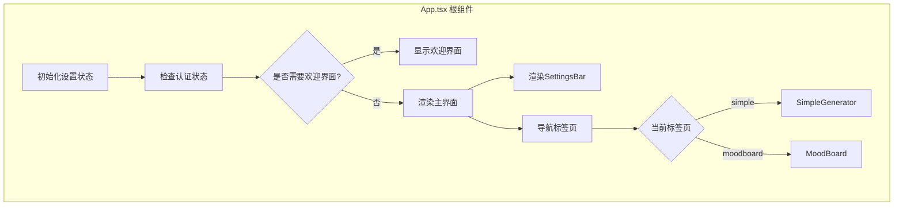
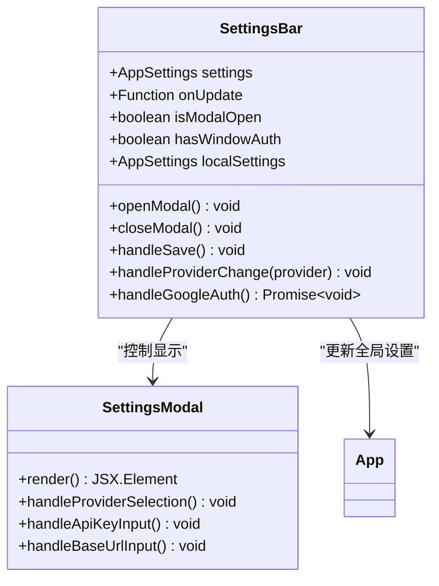
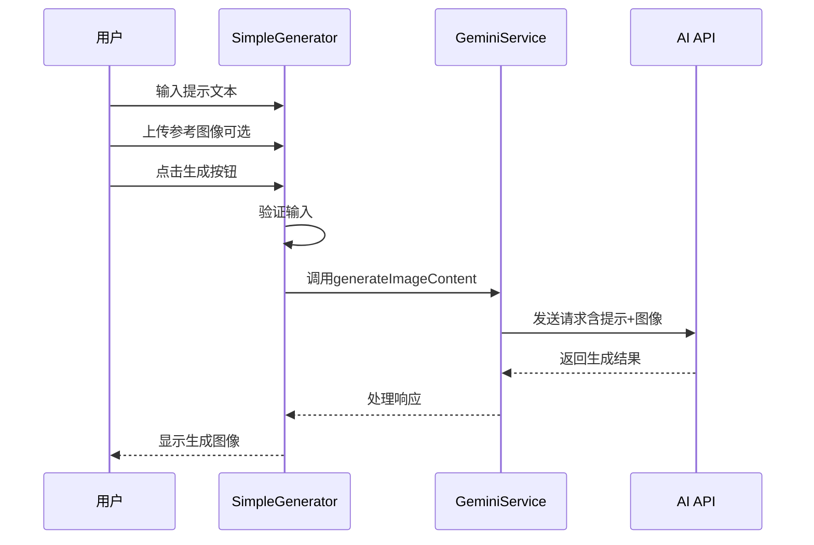
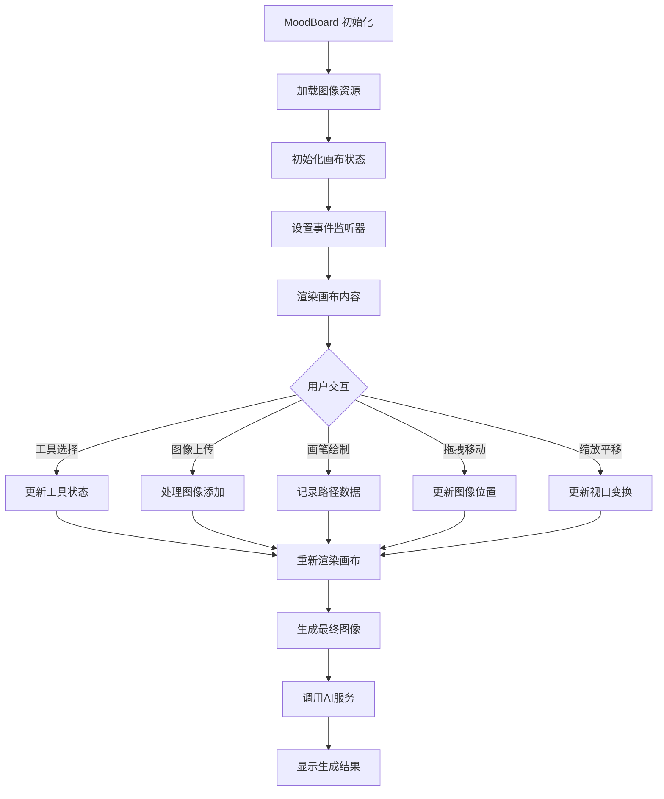
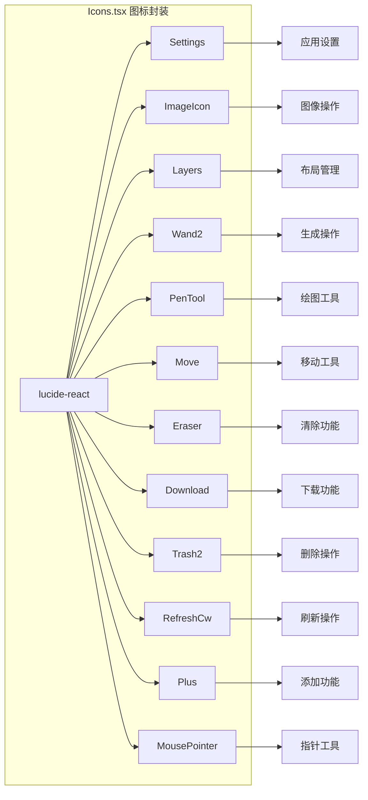
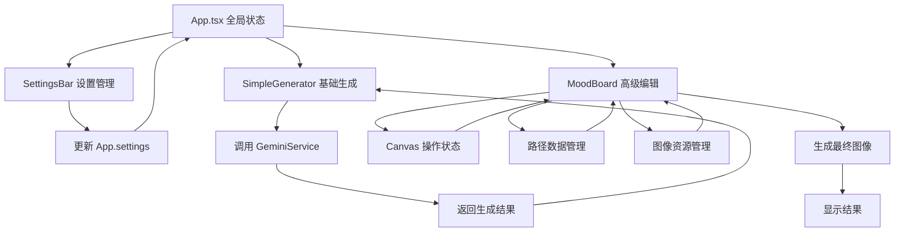

# 组件架构

<cite>
**本文档中引用的文件**
- [App.tsx](file://App.tsx)
- [components/SettingsBar.tsx](file://components/SettingsBar.tsx)
- [components/SimpleGenerator.tsx](file://components/SimpleGenerator.tsx)
- [components/MoodBoard.tsx](file://components/MoodBoard.tsx)
- [components/ui/Icons.tsx](file://components/ui/Icons.tsx)
- [types.ts](file://types.ts)
- [constants.ts](file://constants.ts)
- [services/geminiService.ts](file://services/geminiService.tsx)
</cite>

## 目录
1. [项目概述](#项目概述)
2. [根组件架构](#根组件架构)
3. [SettingsBar组件详解](#settingsbar组件详解)
4. [SimpleGenerator组件详解](#simplegenerator组件详解)
5. [MoodBoard组件详解](#moodboard组件详解)
6. [Icons图标系统](#icons图标系统)
7. [组件间数据流设计](#组件间数据流设计)
8. [状态管理模式](#状态管理模式)
9. [技术架构总结](#技术架构总结)

## 项目概述

BananaCanvase是一个基于React的AI图像生成应用，采用现代化的前端架构设计。项目通过清晰的组件分层和单向数据流原则，实现了从基础图像生成到高级画布编辑的完整功能体系。

## 根组件架构

### App.tsx - 应用入口点

App.tsx作为整个应用的根组件，负责协调三大核心功能模块：SettingsBar（设置栏）、SimpleGenerator（基础生成器）和MoodBoard（情绪板）。它采用了集中式状态管理模式，通过React Hooks实现全局状态管理。

**图表来源**
- [App.tsx](file://App.tsx#L8-L139)

#### 核心功能特性

1. **状态持久化**：通过localStorage实现设置的自动保存和恢复
2. **认证管理**：集成AI Studio环境的API密钥管理
3. **标签页导航**：在简单生成器和情绪板之间切换
4. **错误处理**：统一的认证失败处理机制

**章节来源**
- [App.tsx](file://App.tsx#L8-L139)

## SettingsBar组件详解

### 组件职责与架构

SettingsBar.tsx专门负责应用的配置管理，包括模型选择、提供商切换和API密钥配置。该组件采用受控组件模式，通过props接收父组件的状态并返回更新回调。

**图表来源**
- [components/SettingsBar.tsx](file://components/SettingsBar.tsx#L11-L170)

#### 主要功能模块

1. **快速模型选择器**：在顶部栏提供即时模型切换
2. **完整设置模态框**：包含提供商、API密钥、基础URL等详细配置
3. **Google AI Studio集成**：支持通过AI Studio进行密钥管理
4. **本地存储持久化**：自动保存用户配置到localStorage

#### 状态管理策略

- **本地状态**：用于模态框显示控制和表单验证
- **同步状态**：通过props和回调函数与父组件保持同步
- **默认值处理**：提供合理的默认配置

**章节来源**
- [components/SettingsBar.tsx](file://components/SettingsBar.tsx#L11-L170)

## SimpleGenerator组件详解

### 基础图像生成器

SimpleGenerator.tsx实现了直观的图像生成功能，支持文本提示和参考图像上传。该组件专注于提供简洁高效的用户体验。

**图表来源**
- [components/SimpleGenerator.tsx](file://components/SimpleGenerator.tsx#L30-L51)
- [services/geminiService.ts](file://services/geminiService.tsx#L5-L107)

#### 核心功能特性

1. **双输入模式**：
   - 文本提示输入区域
   - 可选的参考图像上传
2. **实时反馈**：
   - 加载状态指示
   - 错误信息展示
   - 成功结果预览
3. **智能错误处理**：
   - 自动检测权限问题
   - 引导用户重新认证

#### 技术实现要点

- **文件处理**：使用FileReader API处理图像上传
- **异步操作**：完整的Promise链处理API调用
- **状态管理**：独立的状态变量管理UI状态

**章节来源**
- [components/SimpleGenerator.tsx](file://components/SimpleGenerator.tsx#L11-L148)

## MoodBoard组件详解

### 高级画布编辑器

MoodBoard.tsx是最复杂的组件，提供了丰富的画布编辑功能，包括图像上传、画笔注释绘制和高级编辑指令提交。

**图表来源**
- [components/MoodBoard.tsx](file://components/MoodBoard.tsx#L23-L770)

#### 核心功能模块

1. **多工具支持**：
   - 移动工具：拖拽调整图像位置
   - 绘图工具：彩色画笔标注编辑区域
   - 平移工具：全局视图导航
2. **无限画布系统**：
   - 支持任意尺寸的虚拟画布
   - 实时缩放和平移功能
   - 高性能渲染优化
3. **智能生成逻辑**：
   - 自动生成编辑指令
   - 分离源图像和蒙版
   - 批量处理多个编辑区域

#### 技术架构特点

- **Canvas渲染**：直接使用HTML5 Canvas进行高性能渲染
- **状态驱动**：完全基于React状态管理
- **事件处理**：完整的鼠标和触摸事件支持
- **性能优化**：使用requestAnimationFrame实现流畅动画

**章节来源**
- [components/MoodBoard.tsx](file://components/MoodBoard.tsx#L23-L770)

## Icons图标系统

### lucide-react封装

Icons.tsx通过lucide-react库提供了一套完整的图标系统，为整个应用提供一致的视觉语言。

**图表来源**
- [components/ui/Icons.tsx](file://components/ui/Icons.tsx#L1-L30)

#### 设计原则

1. **一致性**：所有图标使用相同的尺寸和风格
2. **语义化**：图标名称与其功能高度相关
3. **可扩展性**：易于添加新的图标变体
4. **性能优化**：按需导入减少bundle大小

**章节来源**
- [components/ui/Icons.tsx](file://components/ui/Icons.tsx#L1-L30)

## 组件间数据流设计

### 单向数据流架构

BananaCanvase严格遵循React的单向数据流原则，确保数据流动的可预测性和可维护性。

**图表来源**
- [App.tsx](file://App.tsx#L44-L62)
- [components/SimpleGenerator.tsx](file://components/SimpleGenerator.tsx#L11-L18)
- [components/MoodBoard.tsx](file://components/MoodBoard.tsx#L18-L21)

#### 数据流向规则

1. **自上而下**：父组件通过props向下传递数据
2. **自下而上**：子组件通过回调函数向上更新状态
3. **不可变更新**：使用不可变更新模式避免意外修改
4. **状态提升**：共享状态提升到最近的公共父组件

#### 状态提升策略

- **全局设置**：App.tsx管理应用级别的配置状态
- **组件局部**：每个功能组件管理自己的UI状态
- **服务层**：GeminiService处理API通信状态

**章节来源**
- [App.tsx](file://App.tsx#L44-L62)
- [components/SimpleGenerator.tsx](file://components/SimpleGenerator.tsx#L11-L18)
- [components/MoodBoard.tsx](file://components/MoodBoard.tsx#L18-L21)

## 状态管理模式

### React Hooks状态管理

BananaCanvase采用现代React Hooks模式进行状态管理，实现了灵活且可组合的状态逻辑。

#### 状态分类与管理策略

| 状态类型 | 管理位置 | 更新方式 | 生命周期 |
|---------|---------|---------|---------|
| 全局设置 | App.tsx | useState + localStorage | 应用级持久化 |
| 认证状态 | App.tsx | useEffect + 条件渲染 | 动态切换 |
| 表单状态 | 各组件 | useState | 组件级临时 |
| Canvas状态 | MoodBoard | useState + useCallback | 实时更新 |
| 加载状态 | 各组件 | useState | 操作级临时 |

#### 性能优化策略

1. **useCallback缓存**：防止不必要的重渲染
2. **useMemo计算缓存**：优化复杂计算
3. **状态分割**：避免大对象的频繁更新
4. **条件渲染**：根据状态动态决定渲染内容

**章节来源**
- [App.tsx](file://App.tsx#L9-L33)
- [components/MoodBoard.tsx](file://components/MoodBoard.tsx#L24-L52)

## 技术架构总结

### 整体架构特点

BananaCanvase展现了现代React应用的最佳实践，具有以下显著特点：

#### 架构优势

1. **模块化设计**：每个组件职责单一，边界清晰
2. **可扩展性**：良好的抽象层次支持功能扩展
3. **可维护性**：清晰的代码结构和命名规范
4. **用户体验**：流畅的交互和及时的反馈机制

#### 技术栈特色

- **TypeScript**：提供强类型安全保障
- **Tailwind CSS**：实用优先的样式解决方案
- **Lucide React**：轻量级图标系统
- **React Hooks**：现代化的状态管理
- **Canvas API**：高性能图形渲染

#### 最佳实践体现

1. **组件复用**：Icons组件提供跨组件的图标标准化
2. **错误处理**：统一的错误捕获和用户友好的错误提示
3. **性能优化**：合理的状态管理和渲染优化
4. **开发体验**：完善的类型定义和清晰的代码结构

这种架构设计不仅满足了当前的功能需求，还为未来的功能扩展和性能优化奠定了坚实的基础。