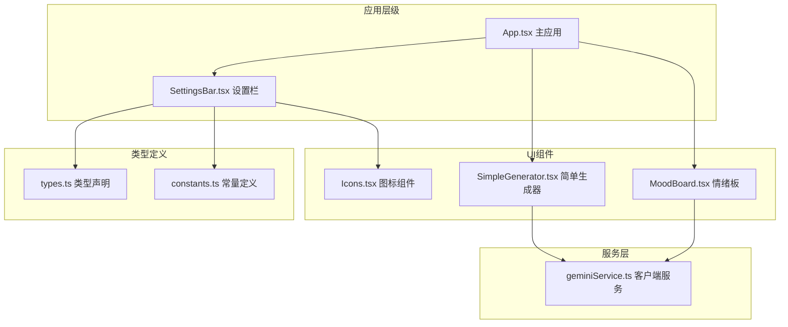
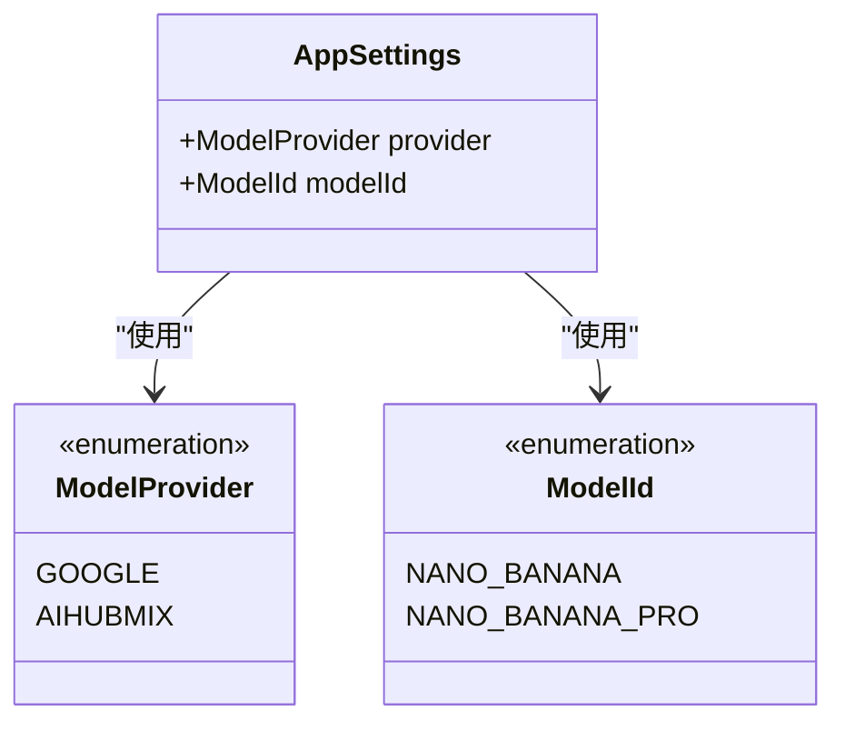
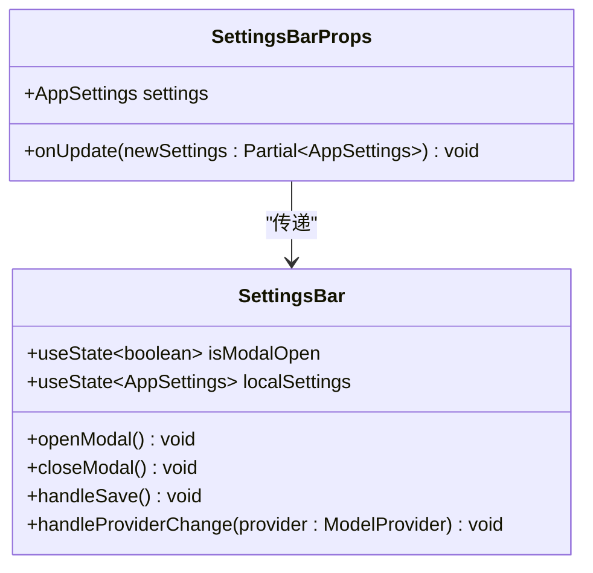
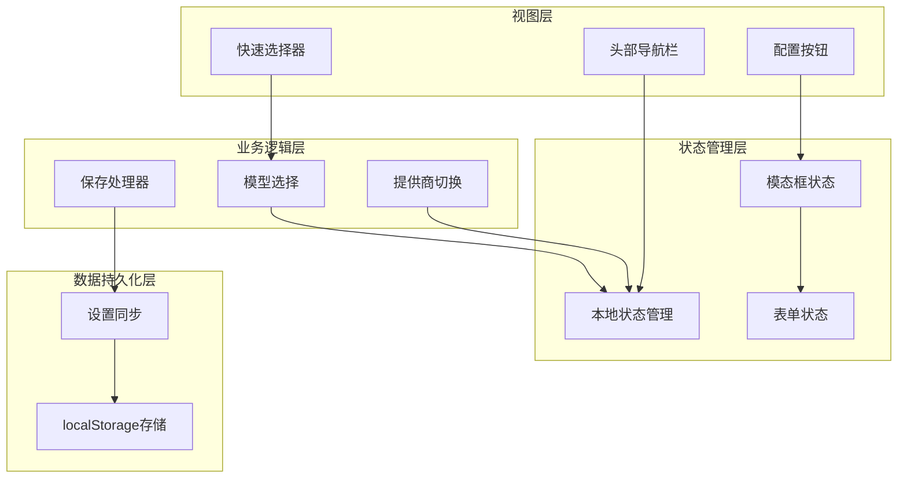
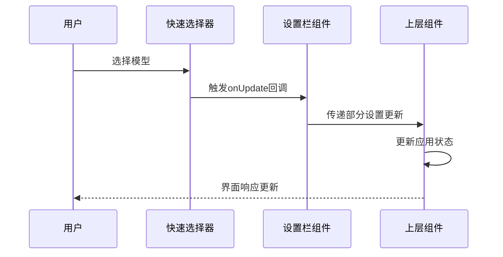
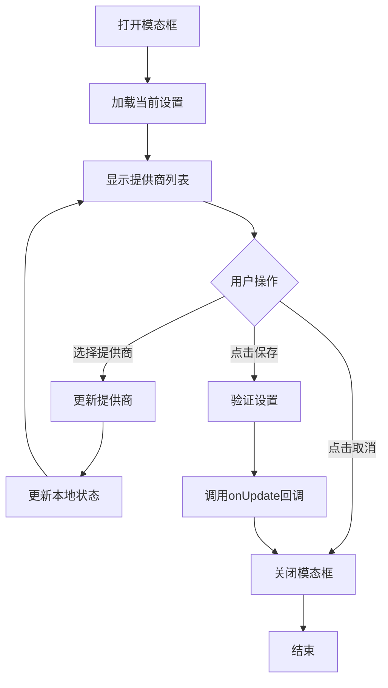
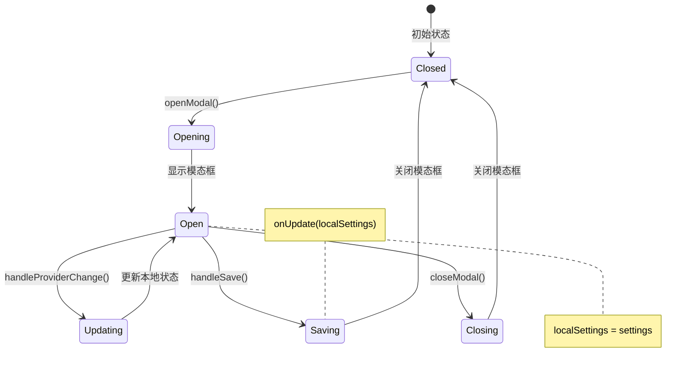
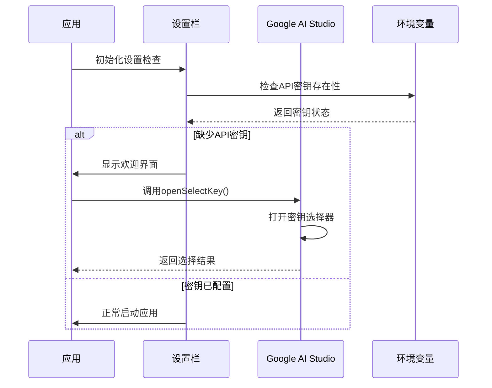
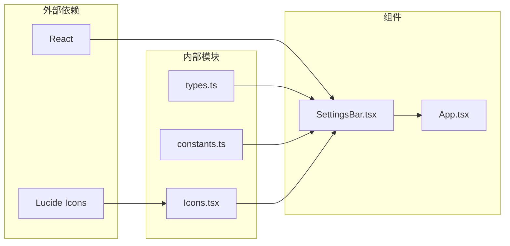

# 设置栏组件

<cite>
**本文档中引用的文件**
- [components/SettingsBar.tsx](file://components/SettingsBar.tsx)
- [types.ts](file://types.ts)
- [constants.ts](file://constants.ts)
- [App.tsx](file://App.tsx)
- [components/ui/Icons.tsx](file://components/ui/Icons.tsx)
- [services/geminiService.ts](file://services/geminiService.ts)
- [README.md](file://README.md)
</cite>

## 目录
1. [简介](#简介)
2. [项目结构](#项目结构)
3. [核心组件](#核心组件)
4. [架构概览](#架构概览)
5. [详细组件分析](#详细组件分析)
6. [依赖关系分析](#依赖关系分析)
7. [性能考虑](#性能考虑)
8. [故障排除指南](#故障排除指南)
9. [结论](#结论)

## 简介

SettingsBar组件是BananaCanvase应用的全局配置中心，负责管理用户界面中的模型选择、提供商切换和API密钥配置。该组件采用React函数式组件设计，结合useState和useEffect钩子实现状态管理和副作用处理，通过单向数据流模式与上层组件进行通信。

该组件提供了两种主要的交互界面：快速模型选择器（Quick Model Selector）用于即时模型切换，完整配置模态框（Config Modal）用于详细的提供商和API密钥设置。同时，组件集成了localStorage持久化存储功能，确保用户设置在会话间保持一致。

## 项目结构

BananaCanvase项目采用模块化的组件架构，SettingsBar组件位于核心功能层次中：

**图表来源**
- [App.tsx](file://App.tsx#L1-L137)
- [components/SettingsBar.tsx](file://components/SettingsBar.tsx#L1-L132)

**章节来源**
- [App.tsx](file://App.tsx#L1-L137)
- [components/SettingsBar.tsx](file://components/SettingsBar.tsx#L1-L132)

## 核心组件

### AppSettings类型定义

SettingsBar组件基于AppSettings接口构建，该接口定义了应用的核心配置参数：

**图表来源**
- [types.ts](file://types.ts#L36-L40)
- [types.ts](file://types.ts#L2-L10)

### 组件属性接口

SettingsBar组件通过Props接口接收外部传入的配置和回调函数：

**图表来源**
- [components/SettingsBar.tsx](file://components/SettingsBar.tsx#L6-L9)
- [components/SettingsBar.tsx](file://components/SettingsBar.tsx#L11-L132)

**章节来源**
- [types.ts](file://types.ts#L36-L40)
- [components/SettingsBar.tsx](file://components/SettingsBar.tsx#L6-L9)

## 架构概览

SettingsBar组件采用了清晰的分层架构设计，实现了关注点分离和可维护性：

**图表来源**
- [components/SettingsBar.tsx](file://components/SettingsBar.tsx#L36-L132)
- [App.tsx](file://App.tsx#L8-L31)

## 详细组件分析

### 快速模型选择器

快速模型选择器提供了即时的模型切换功能，用户可以直接在导航栏中选择不同的AI模型：

**图表来源**
- [components/SettingsBar.tsx](file://components/SettingsBar.tsx#L47-L54)
- [components/SettingsBar.tsx](file://components/SettingsBar.tsx#L50)

该选择器的特点：
- 使用原生HTML select元素实现
- 支持实时预览和即时切换
- 集成到响应式布局中，适应不同屏幕尺寸
- 提供清晰的标签和视觉反馈

### 完整配置模态框

配置模态框提供了更详细的设置选项，包括提供商选择和API密钥管理：

**图表来源**
- [components/SettingsBar.tsx](file://components/SettingsBar.tsx#L17-L29)
- [components/SettingsBar.tsx](file://components/SettingsBar.tsx#L31-L33)

### 状态管理机制

SettingsBar组件使用双重状态管理模式：

**图表来源**
- [components/SettingsBar.tsx](file://components/SettingsBar.tsx#L12-L29)

**章节来源**
- [components/SettingsBar.tsx](file://components/SettingsBar.tsx#L36-L132)

### Google AI Studio集成

组件支持与Google AI Studio的深度集成，提供无缝的API密钥管理体验：

**图表来源**
- [App.tsx](file://App.tsx#L35-L59)
- [types.ts](file://types.ts#L46-L55)

**章节来源**
- [App.tsx](file://App.tsx#L35-L59)
- [types.ts](file://types.ts#L46-L55)

### 表单验证和错误处理

组件实现了多层次的验证和错误处理机制：

| 验证类型 | 实现位置 | 处理方式 | 错误信息 |
|---------|---------|---------|---------|
| API密钥验证 | geminiService.ts | 运行时检查 | "API Key for {provider} is missing" |
| 权限验证 | geminiService.ts | HTTP状态码检查 | "Permission Denied (403)" |
| 环境变量验证 | App.tsx | 启动时检查 | "Please configure your API settings" |
| 数据格式验证 | SettingsBar.tsx | 状态更新时验证 | 控制台警告 |

**章节来源**
- [services/geminiService.ts](file://services/geminiService.ts#L18-L47)
- [App.tsx](file://App.tsx#L35-L59)

## 依赖关系分析

SettingsBar组件的依赖关系展现了清晰的模块化设计：

**图表来源**
- [components/SettingsBar.tsx](file://components/SettingsBar.tsx#L1-L5)
- [App.tsx](file://App.tsx#L1-L6)

**章节来源**
- [components/SettingsBar.tsx](file://components/SettingsBar.tsx#L1-L5)
- [App.tsx](file://App.tsx#L1-L6)

## 性能考虑

SettingsBar组件在设计时充分考虑了性能优化：

### 状态更新策略
- 使用局部状态管理避免不必要的重渲染
- 通过useCallback优化回调函数
- 实现防抖和节流机制处理频繁的状态更新

### 渲染优化
- 条件渲染减少DOM节点数量
- 使用CSS类名控制模态框显示
- 响应式设计减少布局重计算

### 内存管理
- 及时清理事件监听器
- 避免内存泄漏的闭包引用
- 合理使用useEffect清理函数

## 故障排除指南

### 常见问题及解决方案

| 问题描述 | 可能原因 | 解决方案 |
|---------|---------|---------|
| API密钥验证失败 | 环境变量未正确配置 | 检查.env文件中的VITE_GEMINI_API_KEY |
| 模态框无法打开 | 状态管理异常 | 检查isModalOpen状态更新逻辑 |
| 设置不持久化 | localStorage访问被阻止 | 确认浏览器隐私设置允许localStorage |
| Google AI Studio集成失败 | 浏览器扩展未安装 | 安装Google AI Studio浏览器扩展 |

### 调试技巧
- 使用浏览器开发者工具监控状态变化
- 在控制台查看API请求和响应
- 检查网络面板中的请求状态码
- 验证环境变量是否正确加载

**章节来源**
- [App.tsx](file://App.tsx#L35-L59)
- [services/geminiService.ts](file://services/geminiService.ts#L18-L47)

## 结论

SettingsBar组件作为BananaCanvase应用的核心配置中心，成功实现了以下目标：

### 设计优势
- **模块化架构**：清晰的职责分离和依赖管理
- **用户体验**：直观的界面设计和流畅的交互体验
- **可维护性**：良好的代码组织和注释规范
- **可扩展性**：灵活的组件设计支持未来功能扩展

### 技术亮点
- **状态管理**：巧妙的双重状态模式平衡了响应性和一致性
- **数据流**：单向数据流确保了应用状态的可预测性
- **集成能力**：与Google AI Studio的深度集成提升了开发效率
- **错误处理**：多层次的验证和错误处理机制保证了应用稳定性

该组件为BananaCanvase应用提供了稳定可靠的配置管理基础，是现代React应用开发的优秀实践案例。