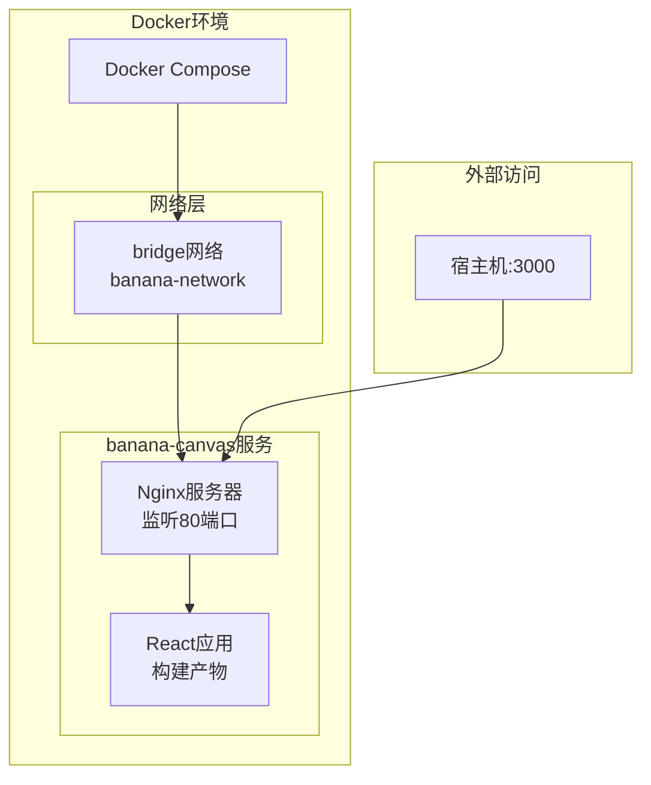
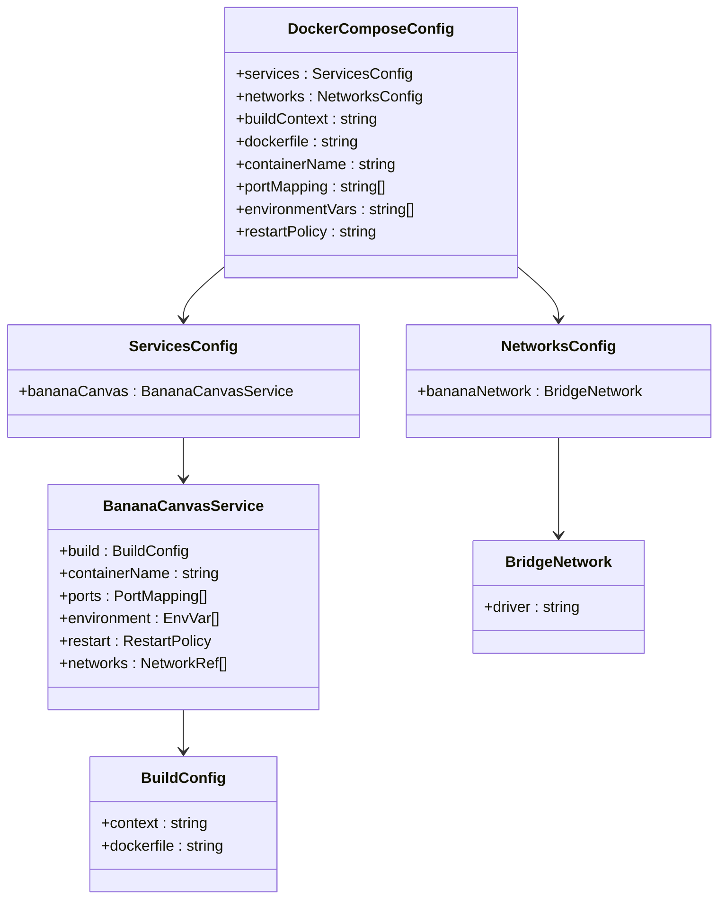
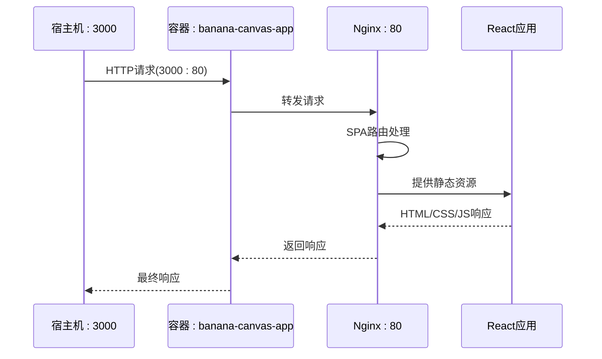
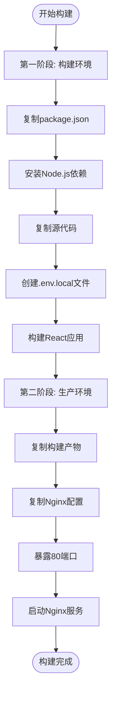
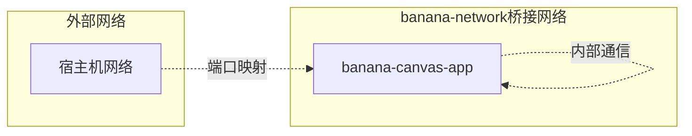
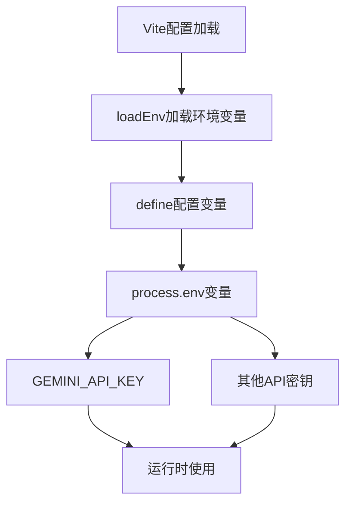
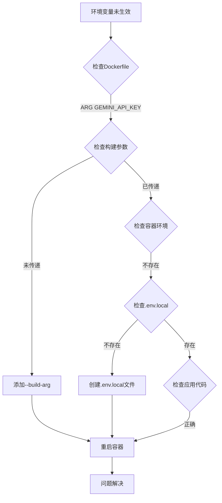
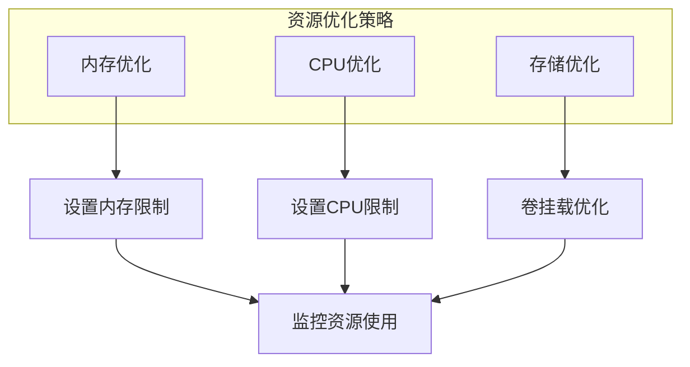

# Docker Compose部署指南

<cite>
**本文档引用的文件**
- [docker-compose.yml](file://docker-compose.yml)
- [DOCKER.md](file://DOCKER.md)
- [Dockerfile](file://Dockerfile)
- [nginx.conf](file://nginx.conf)
- [package.json](file://package.json)
- [vite.config.ts](file://vite.config.ts)
</cite>

## 目录
1. [简介](#简介)
2. [项目架构概览](#项目架构概览)
3. [Docker Compose配置详解](#docker-compose配置详解)
4. [服务组件分析](#服务组件分析)
5. [网络配置](#网络配置)
6. [部署操作指南](#部署操作指南)
7. [环境变量配置](#环境变量配置)
8. [常见问题排查](#常见问题排查)
9. [性能优化建议](#性能优化建议)
10. [故障排除指南](#故障排除指南)

## 简介

BananaCanvase是一个基于React和TypeScript的AI画布应用，采用现代化的开发架构。本指南详细介绍了如何通过Docker Compose快速部署该应用，包括完整的配置解析、操作流程和问题解决方案。

该应用采用前后端分离架构，前端使用Vite构建工具，后端集成Google Gemini AI API，通过Nginx作为反向代理服务器提供静态资源服务。

## 项目架构概览



**图表来源**
- [docker-compose.yml](file://docker-compose.yml#L1-L18)
- [nginx.conf](file://nginx.conf#L1-L24)

## Docker Compose配置详解

### 核心配置结构

Docker Compose配置文件定义了完整的应用部署环境，包含以下关键要素：



**图表来源**
- [docker-compose.yml](file://docker-compose.yml#L1-L18)

**章节来源**
- [docker-compose.yml](file://docker-compose.yml#L1-L18)

### 服务配置深度解析

#### 构建上下文配置

| 配置项 | 值 | 说明 |
|--------|-----|------|
| `context` | `.` | 构建上下文为当前目录，意味着Dockerfile和项目文件在同一目录层级 |
| `dockerfile` | `Dockerfile` | 指定使用的Dockerfile文件名 |

#### 容器配置参数

| 参数 | 值 | 作用 |
|------|-----|------|
| `container_name` | `banana-canvas-app` | 容器名称，便于管理和识别 |
| `restart` | `unless-stopped` | 重启策略，除非手动停止容器，否则总是重启 |
| `networks` | `banana-network` | 加入指定的网络桥接 |

#### 端口映射机制

| 宿主机端口 | 容器端口 | 映射类型 | 访问方式 |
|------------|----------|----------|----------|
| 3000 | 80 | 内外端口映射 | `http://localhost:3000` |
| - | 80 | Nginx监听端口 | 应用内部通信 |

**章节来源**
- [docker-compose.yml](file://docker-compose.yml#L3-L13)

## 服务组件分析

### banana-canvas服务架构



**图表来源**
- [docker-compose.yml](file://docker-compose.yml#L2-L13)
- [nginx.conf](file://nginx.conf#L1-L24)

### 多阶段构建流程



**图表来源**
- [Dockerfile](file://Dockerfile#L1-L36)

**章节来源**
- [Dockerfile](file://Dockerfile#L1-L36)

## 网络配置

### Bridge网络设置

Docker Compose自动创建并管理网络，确保容器间的通信安全性和隔离性。



**图表来源**
- [docker-compose.yml](file://docker-compose.yml#L15-L18)

### 网络驱动特性

| 特性 | 配置值 | 优势 |
|------|--------|------|
| 驱动类型 | `bridge` | 默认网络驱动，提供基本的容器间通信 |
| 自动创建 | 是 | Docker Compose自动管理网络生命周期 |
| 隔离性 | 高 | 容器间默认隔离，提高安全性 |
| 性能 | 良好 | 适用于大多数单机部署场景 |

**章节来源**
- [docker-compose.yml](file://docker-compose.yml#L15-L18)

## 部署操作指南

### 快速启动流程

基于DOCKER.md中的说明，完整的启动命令序列如下：

```bash
# 1. 确保Docker和Docker Compose已安装
docker --version
docker-compose --version

# 2. 构建并启动服务（后台运行）
docker-compose up -d

# 3. 查看服务状态
docker-compose ps

# 4. 查看实时日志
docker-compose logs -f
```

### 服务管理命令

| 命令 | 功能 | 使用场景 |
|------|------|----------|
| `docker-compose up -d` | 启动并后台运行 | 初始部署或重启服务 |
| `docker-compose down` | 停止并移除容器 | 维护或完全关闭服务 |
| `docker-compose restart` | 重启所有服务 | 更新配置或修复问题 |
| `docker-compose build` | 重新构建镜像 | 修改代码或配置后 |
| `docker-compose logs -f` | 实时查看日志 | 调试和监控 |

### 环境变量注入

支持在构建时注入Gemini API密钥：

```bash
# 方法1：使用docker-compose构建
docker-compose build --build-arg GEMINI_API_KEY=your_api_key_here

# 方法2：先构建后运行
docker-compose build
docker-compose up -d
```

**章节来源**
- [DOCKER.md](file://DOCKER.md#L1-L80)

## 环境变量配置

### NODE_ENV环境变量

应用使用`NODE_ENV=production`环境变量来控制运行模式：

| 环境变量 | 值 | 作用 |
|----------|-----|------|
| `NODE_ENV` | `production` | 启用生产模式优化，禁用开发工具 |

### Vite配置中的环境变量处理



**图表来源**
- [vite.config.ts](file://vite.config.ts#L1-L24)

### 环境变量优先级

1. **构建时环境变量**：通过`--build-arg`传递
2. **容器环境变量**：通过docker-compose.yml的`environment`字段
3. **系统环境变量**：宿主机的环境变量覆盖

**章节来源**
- [docker-compose.yml](file://docker-compose.yml#L9-L11)
- [vite.config.ts](file://vite.config.ts#L10-L15)

## 常见问题排查

### 端口冲突问题

**问题现象**：容器启动失败，提示端口已被占用

**解决方案**：
```bash
# 1. 检查端口占用情况
netstat -an | findstr :3000

# 2. 停止占用端口的进程
taskkill /F /PID <PID>

# 3. 或修改docker-compose.yml中的宿主机端口
# 将"3000:80"改为"3001:80"等其他可用端口
```

### 构建缓存问题

**问题现象**：修改代码后容器内仍显示旧版本

**解决方案**：
```bash
# 清理构建缓存
docker-compose build --no-cache

# 强制重新构建
docker-compose up --force-recreate -d
```

### 环境变量未生效

**问题排查步骤**：



**图表来源**
- [Dockerfile](file://Dockerfile#L15-L17)
- [vite.config.ts](file://vite.config.ts#L10-L15)

### 容器启动失败

**诊断命令**：
```bash
# 查看容器状态
docker-compose ps

# 查看错误日志
docker-compose logs banana-canvas

# 进入容器调试
docker-compose exec banana-canvas sh
```

**常见原因及解决方案**：

| 错误类型 | 可能原因 | 解决方案 |
|----------|----------|----------|
| 端口绑定失败 | 端口被占用 | 更改宿主机端口或停止占用进程 |
| 镜像拉取失败 | 网络连接问题 | 检查网络连接或使用本地镜像 |
| 权限错误 | 文件权限问题 | 检查文件权限设置 |
| 内存不足 | 资源限制 | 增加系统内存或调整容器资源限制 |

## 性能优化建议

### Nginx配置优化

基于nginx.conf的配置，应用已经实现了以下优化：

| 优化项 | 配置 | 效果 |
|--------|------|------|
| SPA路由支持 | `try_files $uri $uri/ /index.html;` | 支持前端路由 |
| 静态资源缓存 | `expires 1y;` | 减少重复请求 |
| Gzip压缩 | `gzip on;` | 减少传输数据量 |
| 缓存控制 | `Cache-Control "public, immutable"` | 优化浏览器缓存 |

### 容器资源管理



### 部署最佳实践

1. **使用生产环境构建**：始终使用`NODE_ENV=production`
2. **合理设置重启策略**：`unless-stopped`避免无限重启循环
3. **定期清理无用资源**：删除停止的容器和未使用的镜像
4. **监控容器健康状态**：设置适当的健康检查

## 故障排除指南

### 日志分析方法

```bash
# 实时查看日志流
docker-compose logs -f banana-canvas

# 查看最近100行日志
docker-compose logs --tail=100 banana-canvas

# 查看特定时间段的日志
docker-compose logs --since="2024-01-01T00:00:00" banana-canvas
```

### 常用诊断命令集合

```bash
# 检查容器状态
docker-compose ps

# 检查容器详情
docker inspect banana-canvas-app

# 检查网络连接
docker network ls
docker network inspect banana-network

# 检查磁盘空间
docker system df

# 清理未使用资源
docker system prune -f
```

### 性能监控指标

| 指标类别 | 关键指标 | 监控方法 |
|----------|----------|----------|
| 容器资源 | CPU使用率、内存使用率 | `docker stats` |
| 网络状态 | 端口监听状态、连接数 | `netstat`、`ss` |
| 应用状态 | 响应时间、错误率 | 访问应用日志 |
| 存储状态 | 磁盘使用率、卷大小 | `docker system df` |

通过遵循本指南的部署流程和最佳实践，您可以成功地在Docker环境中部署BananaCanvase应用，并获得稳定可靠的运行环境。遇到问题时，请参考故障排除部分的详细解决方案。