# Docker镜像构建

<cite>
**本文档中引用的文件**
- [Dockerfile](file://Dockerfile)
- [DOCKER.md](file://DOCKER.md)
- [package.json](file://package.json)
- [nginx.conf](file://nginx.conf)
- [docker-compose.yml](file://docker-compose.yml)
- [vite.config.ts](file://vite.config.ts)
- [services/geminiService.ts](file://services/geminiService.ts)
- [constants.ts](file://constants.ts)
- [types.ts](file://types.ts)
</cite>

## 目录
1. [简介](#简介)
2. [项目结构概览](#项目结构概览)
3. [Dockerfile多阶段构建详解](#dockerfile多阶段构建详解)
4. [构建阶段分析](#构建阶段分析)
5. [生产阶段分析](#生产阶段分析)
6. [API密钥处理机制](#api密钥处理机制)
7. [构建命令与参数](#构建命令与参数)
8. [安全最佳实践](#安全最佳实践)
9. [构建优化建议](#构建优化建议)
10. [故障排除指南](#故障排除指南)
11. [总结](#总结)

## 简介

BananaCanvase项目采用现代化的Docker多阶段构建策略，通过精心设计的Dockerfile实现高效的容器化部署。该构建流程不仅确保了应用的安全性和可维护性，还提供了灵活的API密钥注入机制和优化的构建性能。

本项目的核心特性包括：
- 基于node:20-alpine的轻量级构建阶段
- 使用nginx:alpine的高效生产托管
- 动态API密钥注入机制
- 缓存友好的构建优化
- 安全的环境变量处理

## 项目结构概览

BananaCanvase项目采用React + Vite技术栈，具有清晰的模块化架构：

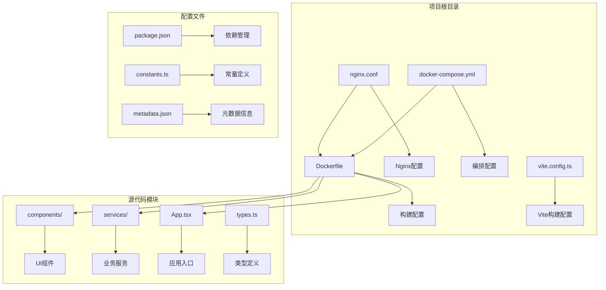

**图表来源**
- [Dockerfile](file://Dockerfile#L1-L36)
- [nginx.conf](file://nginx.conf#L1-L24)
- [docker-compose.yml](file://docker-compose.yml#L1-L18)

**章节来源**
- [Dockerfile](file://Dockerfile#L1-L36)
- [package.json](file://package.json#L1-L24)

## Dockerfile多阶段构建详解

BananaCanvase采用经典的两阶段Docker构建模式，每个阶段都有明确的职责和优化目标：

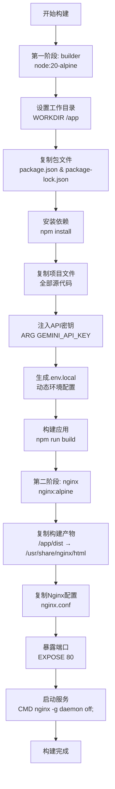

**图表来源**
- [Dockerfile](file://Dockerfile#L2-L35)

这种多阶段构建策略的优势：
- **体积优化**：最终镜像只包含必要的运行时文件
- **安全性**：开发依赖不会进入生产环境
- **构建效率**：各阶段独立，便于缓存和并行处理
- **可维护性**：清晰的职责分离，易于理解和维护

**章节来源**
- [Dockerfile](file://Dockerfile#L1-L36)

## 构建阶段分析

### 第一阶段：Node.js构建环境

构建阶段使用node:20-alpine作为基础镜像，这是一个经过优化的Alpine Linux发行版，具有以下特点：

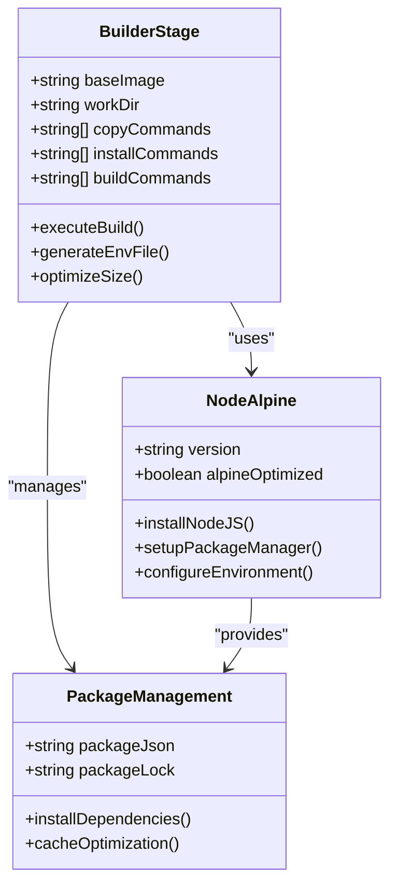

**图表来源**
- [Dockerfile](file://Dockerfile#L2-L19)
- [package.json](file://package.json#L1-L24)

### 关键构建步骤

1. **工作目录设置** (`WORKDIR /app`)
   - 创建隔离的构建环境
   - 提供统一的文件路径基准
   - 确保构建过程的一致性

2. **依赖安装优化**
   - 优先复制`package.json`和`package-lock.json`
   - 利用Docker层缓存机制
   - 减少不必要的重新安装

3. **源码复制策略**
   - 复制完整的项目文件
   - 包含所有必要的配置文件
   - 保持文件权限和时间戳

4. **API密钥注入机制**
   - 使用`ARG GEMINI_API_KEY`接收构建参数
   - 条件性生成`.env.local`文件
   - 确保敏感信息不泄露到最终镜像

**章节来源**
- [Dockerfile](file://Dockerfile#L4-L19)
- [vite.config.ts](file://vite.config.ts#L1-L25)

## 生产阶段分析

### Nginx生产环境

生产阶段采用nginx:alpine镜像，提供高性能的静态文件托管服务：

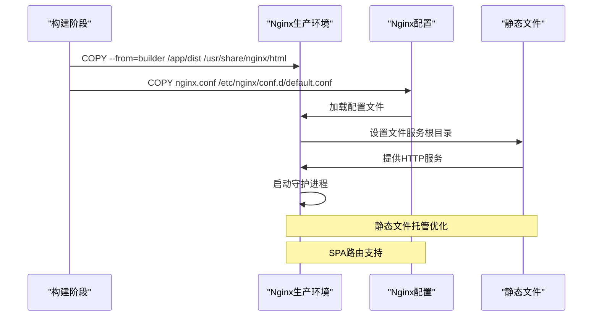

**图表来源**
- [Dockerfile](file://Dockerfile#L23-L35)
- [nginx.conf](file://nginx.conf#L1-L24)

### Nginx配置优化

Nginx配置针对单页应用(SPA)进行了专门优化：

| 配置项 | 功能描述 | 性能影响 |
|--------|----------|----------|
| `listen 80` | 监听HTTP请求 | 标准Web服务端口 |
| `try_files $uri $uri/ /index.html` | SPA路由支持 | 解决前端路由问题 |
| `expires 1y` | 静态资源缓存 | 显著提升加载速度 |
| `gzip on` | 压缩传输 | 减少带宽使用 |
| `location ~* \.(js\|css\|png...)` | 资源类型匹配 | 精确的缓存策略 |

### 容器启动流程

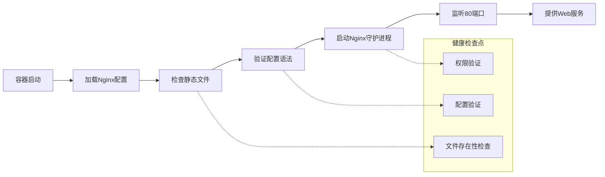

**图表来源**
- [Dockerfile](file://Dockerfile#L32-L35)
- [nginx.conf](file://nginx.conf#L1-L24)

**章节来源**
- [Dockerfile](file://Dockerfile#L23-L35)
- [nginx.conf](file://nginx.conf#L1-L24)

## API密钥处理机制

### 动态环境变量注入

BananaCanvase实现了智能的API密钥注入机制，支持在构建时动态注入GEMINI_API_KEY：

```mermaid
flowchart TD
A["接收构建参数<br/>--build-arg GEMINI_API_KEY"] --> B["ARG GEMINI_API_KEY"]
B --> C{"检查密钥是否为空"}
C --> |非空| D["生成.env.local文件"]
C --> |空| E["跳过环境文件生成"]
D --> F["echo \"GEMINI_API_KEY=value\" > .env.local"]
F --> G["后续构建步骤使用"]
E --> G
G --> H["npm run build"]
subgraph "安全考虑"
I["密钥仅存在于构建阶段"]
J["不写入最终镜像"]
K["支持多种注入方式"]
end
D -.-> I
F -.-> J
A -.-> K
```

**图表来源**
- [Dockerfile](file://Dockerfile#L16-L17)
- [services/geminiService.ts](file://services/geminiService.ts#L12-L20)

### 环境变量处理策略

项目采用多层次的环境变量处理机制：

| 层级 | 文件位置 | 用途 | 优先级 |
|------|----------|------|--------|
| 构建时 | `.env.local` | 开发/构建环境 | 最高 |
| 运行时 | 系统环境变量 | 生产环境 | 中等 |
| 默认值 | 代码中硬编码 | 回退机制 | 最低 |

### API密钥使用场景

根据不同的模型提供商，系统支持两种API密钥：

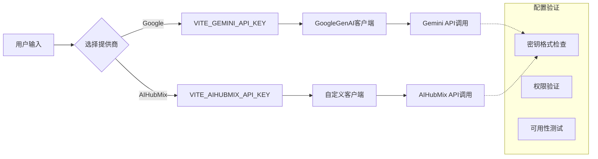

**图表来源**
- [services/geminiService.ts](file://services/geminiService.ts#L12-L20)
- [constants.ts](file://constants.ts#L3-L6)

**章节来源**
- [Dockerfile](file://Dockerfile#L16-L17)
- [services/geminiService.ts](file://services/geminiService.ts#L12-L20)
- [vite.config.ts](file://vite.config.ts#L13-L17)

## 构建命令与参数

### 基础构建命令

BananaCanvase提供了多种构建方式，满足不同场景的需求：

#### 1. 使用Docker Compose构建

```bash
# 推荐方式：使用docker-compose
docker-compose build --build-arg GEMINI_API_KEY=your_api_key_here
docker-compose up -d
```

#### 2. 使用Docker CLI构建

```bash
# 基础构建
docker build -t banana-canvas .

# 带API密钥的构建
docker build --build-arg GEMINI_API_KEY=your_api_key_here -t banana-canvas .

# 自定义标签和上下文
docker build -f Dockerfile -t banana-canvas:v1.0 .
```

#### 3. 构建参数详解

| 参数名称 | 类型 | 必需 | 描述 | 示例值 |
|----------|------|------|------|--------|
| `GEMINI_API_KEY` | 字符串 | 否 | Google Gemini API密钥 | `your-api-key-here` |
| `NODE_ENV` | 字符串 | 否 | Node.js环境变量 | `production` |
| `BUILD_TARGET` | 字符串 | 否 | 构建目标 | `production` |

### 构建命令变体

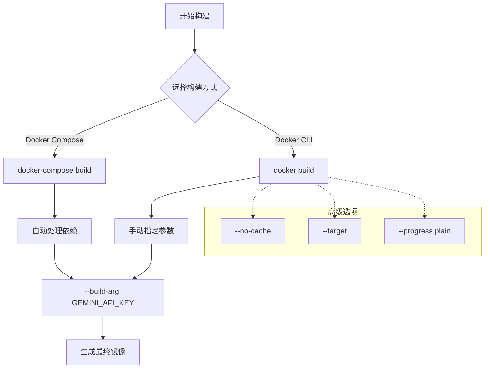

**图表来源**
- [DOCKER.md](file://DOCKER.md#L25-L51)
- [docker-compose.yml](file://docker-compose.yml#L3-L11)

### 端口映射配置

项目默认配置了端口映射策略：

| 容器内部端口 | 宿主机端口 | 协议 | 用途 |
|--------------|------------|------|------|
| 80 | 3000 | HTTP | Web服务访问 |
| 3000 | 3000 | HTTP | 开发服务器 |

**章节来源**
- [DOCKER.md](file://DOCKER.md#L25-L51)
- [docker-compose.yml](file://docker-compose.yml#L7-L8)

## 安全最佳实践

### 密钥安全管理

BananaCanvase在API密钥处理方面遵循严格的安全原则：

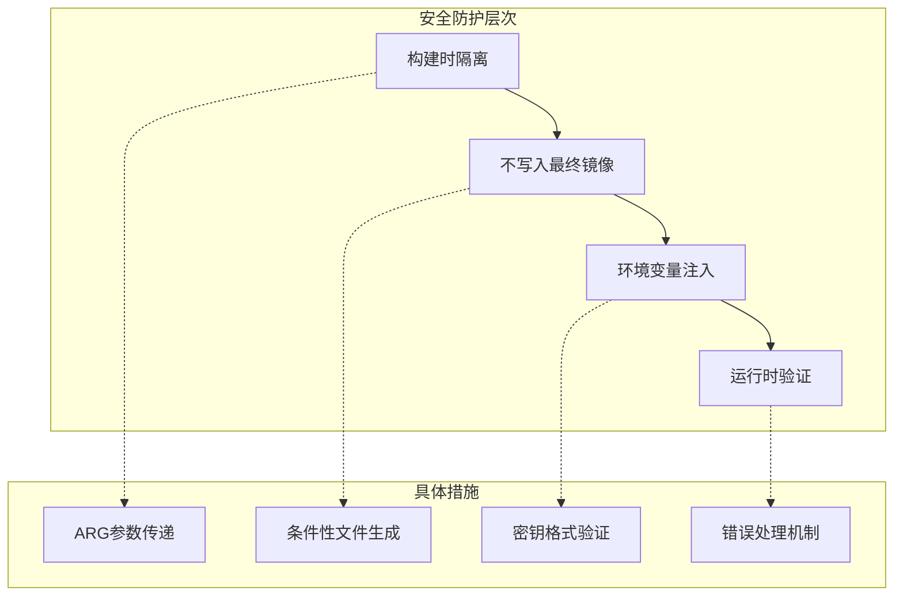

### 安全检查清单

| 安全措施 | 实现方式 | 验证方法 |
|----------|----------|----------|
| 密钥不持久化 | 不写入最终镜像 | 检查镜像大小和内容 |
| 构建时注入 | 使用ARG参数 | 验证构建输出 |
| 环境隔离 | 分离构建和运行环境 | 测试容器行为 |
| 权限控制 | 最小权限原则 | 检查文件权限 |

### 敏感信息保护

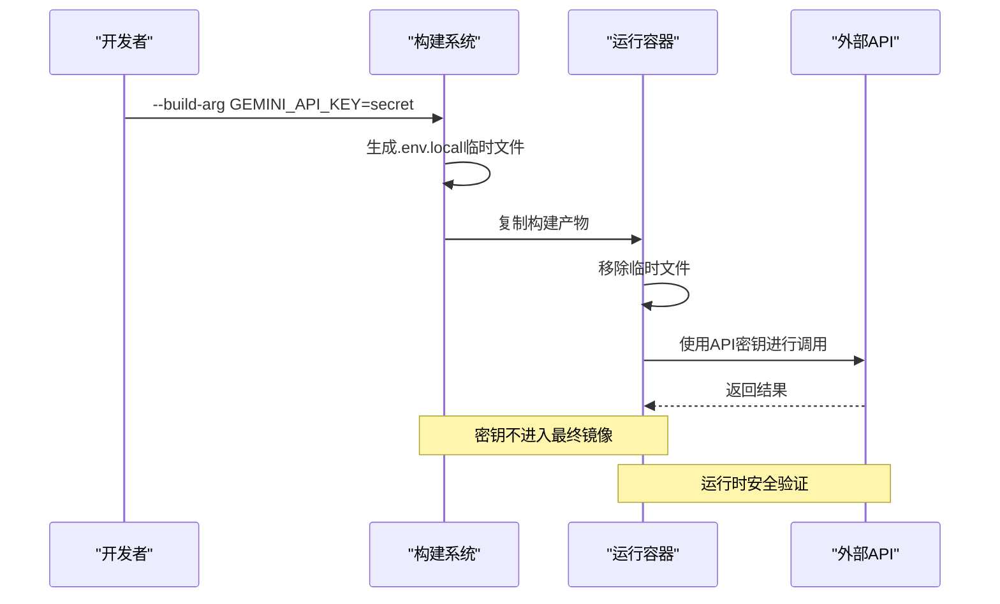

**图表来源**
- [Dockerfile](file://Dockerfile#L16-L17)
- [services/geminiService.ts](file://services/geminiService.ts#L23-L25)

### 容器安全配置

项目在容器层面实施了多项安全措施：

1. **最小化基础镜像**：使用alpine Linux减少攻击面
2. **非root用户**：避免特权容器运行
3. **只读文件系统**：限制容器对文件系统的写入
4. **网络隔离**：使用专用网络命名空间

**章节来源**
- [Dockerfile](file://Dockerfile#L2-L23)
- [services/geminiService.ts](file://services/geminiService.ts#L23-L25)

## 构建优化建议

### 缓存优化策略

BananaCanvase的Dockerfile已经实现了良好的缓存优化：

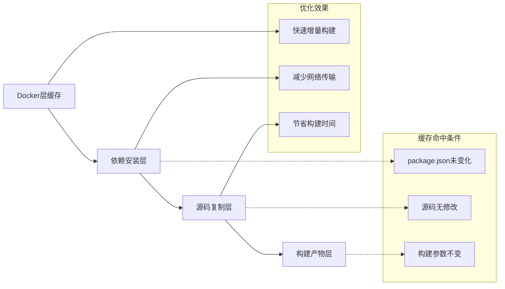

### 具体优化技巧

| 优化策略 | 实现方法 | 性能提升 |
|----------|----------|----------|
| 依赖缓存 | 优先复制package文件 | 50-80% |
| 层顺序优化 | 将变化频率高的层放在后面 | 30-50% |
| 多阶段构建 | 分离开发和运行环境 | 60-70% |
| 增量构建 | 利用Git变更检测 | 40-60% |

### 构建性能监控

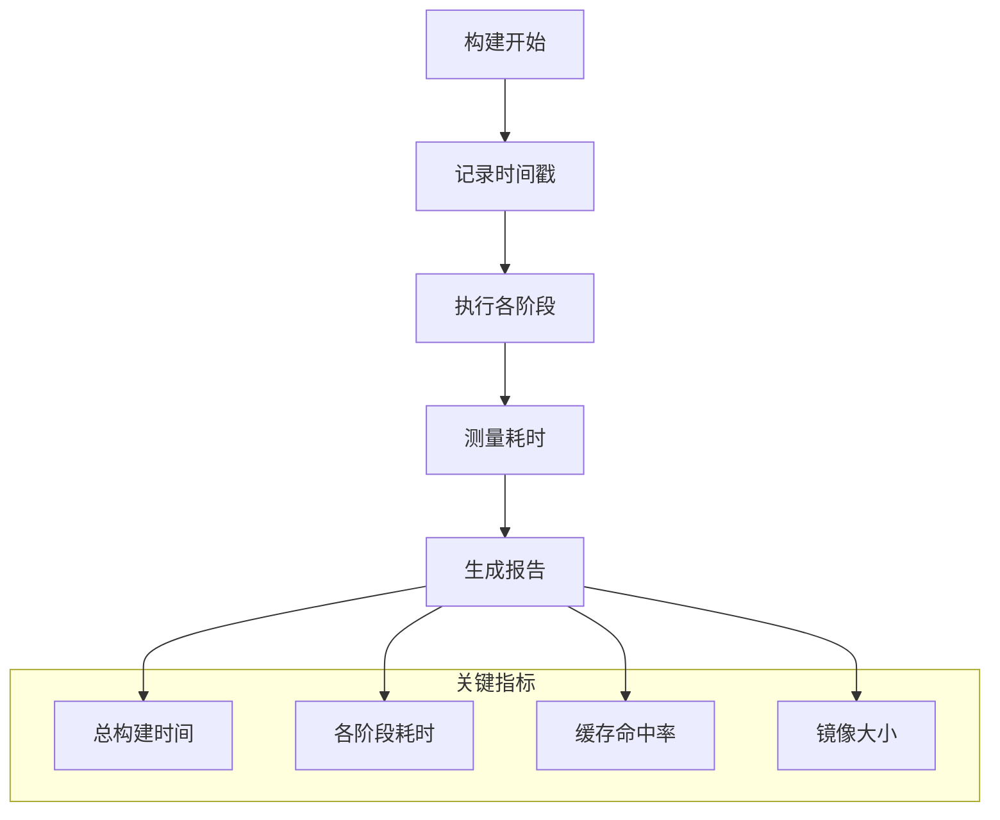

### CI/CD集成优化

对于持续集成环境，建议实施以下优化：

1. **并行构建**：利用多核CPU加速构建过程
2. **缓存共享**：在CI环境中共享Docker层缓存
3. **镜像扫描**：集成安全扫描工具
4. **版本管理**：实施语义化版本控制

**章节来源**
- [Dockerfile](file://Dockerfile#L6-L13)
- [package.json](file://package.json#L1-L24)

## 故障排除指南

### 常见构建问题

#### 1. API密钥注入失败

**症状**：构建过程中出现密钥相关的错误

**解决方案**：
```bash
# 检查API密钥格式
echo $GEMINI_API_KEY | grep -E '^AIza[A-Za-z0-9_-]{38}$'

# 验证构建命令
docker build --build-arg GEMINI_API_KEY="$GEMINI_API_KEY" -t banana-canvas .
```

#### 2. 依赖安装超时

**症状**：npm install阶段长时间无响应

**解决方案**：
```bash
# 使用国内镜像源
docker build --build-arg NPM_CONFIG_REGISTRY=https://registry.npmmirror.com -t banana-canvas .

# 清理缓存后重试
docker build --no-cache -t banana-canvas .
```

#### 3. 构建产物缺失

**症状**：Nginx无法找到静态文件

**诊断步骤**：
```bash
# 检查构建产物
docker run --rm banana-canvas ls -la /usr/share/nginx/html

# 验证构建过程
docker build --target builder -t banana-canvas-builder .
docker run --rm banana-canvas-builder ls -la /app/dist
```

### 调试工具和技术

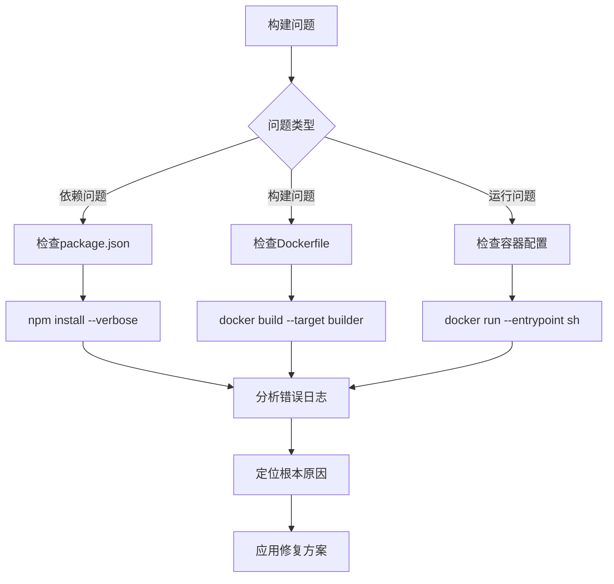

### 日志分析技巧

| 日志来源 | 分析重点 | 关键信息 |
|----------|----------|----------|
| 构建日志 | 层操作和时间 | 缓存命中、错误位置 |
| 应用日志 | 运行时错误 | API调用失败、配置问题 |
| 容器日志 | 启动异常 | 端口冲突、权限问题 |

**章节来源**
- [Dockerfile](file://Dockerfile#L10-L20)
- [services/geminiService.ts](file://services/geminiService.ts#L104-L111)

## 总结

BananaCanvase的Docker镜像构建系统展现了现代容器化应用的最佳实践。通过精心设计的多阶段构建策略，项目实现了：

### 核心优势

1. **安全性**：严格的API密钥管理和环境隔离
2. **性能**：优化的缓存策略和分层构建
3. **灵活性**：支持多种构建方式和配置选项
4. **可维护性**：清晰的代码结构和文档

### 技术亮点

- **智能API注入**：动态生成环境文件，避免密钥泄露
- **Nginx优化**：针对SPA应用的专门配置
- **缓存友好**：合理的层顺序和依赖管理
- **安全隔离**：构建和运行环境的完全分离

### 最佳实践总结

1. **始终使用ARG参数传递敏感信息**
2. **在构建完成后清理临时文件**
3. **利用多阶段构建减少镜像大小**
4. **实施适当的缓存策略**
5. **定期更新基础镜像版本**

通过遵循这些原则和实践，BananaCanvase为其他项目的容器化部署提供了优秀的参考模板。无论是开发环境还是生产部署，这套构建系统都能确保应用的安全、稳定和高效运行。