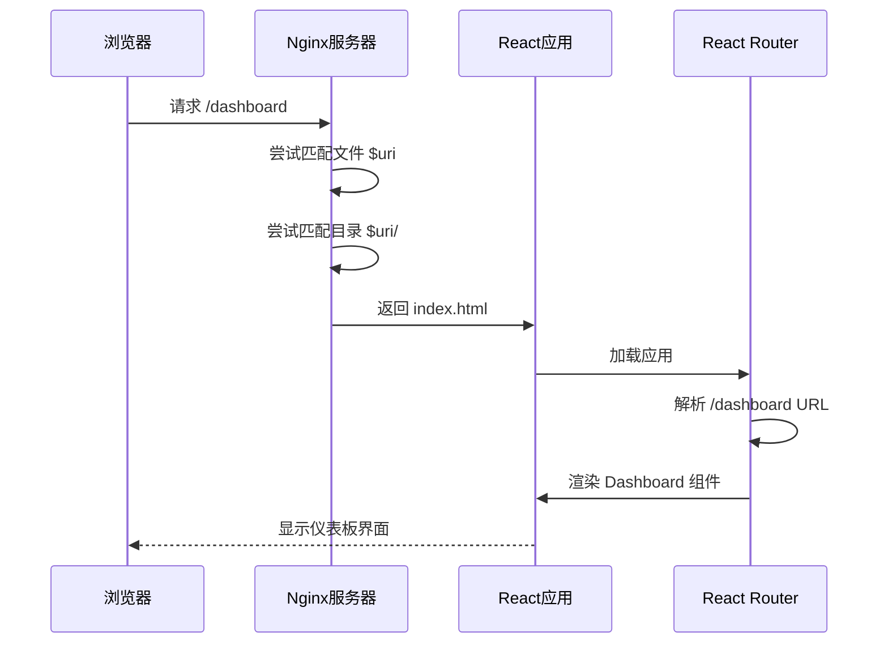
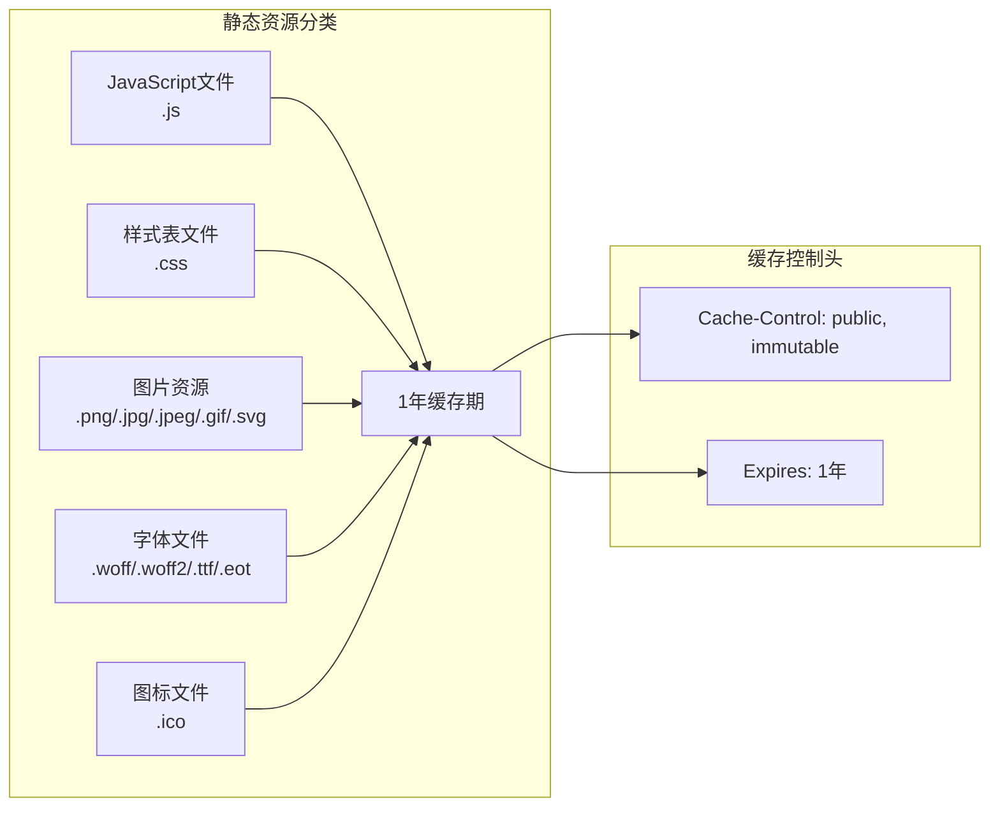
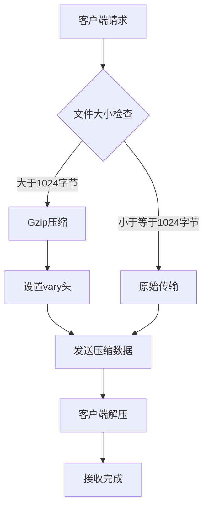
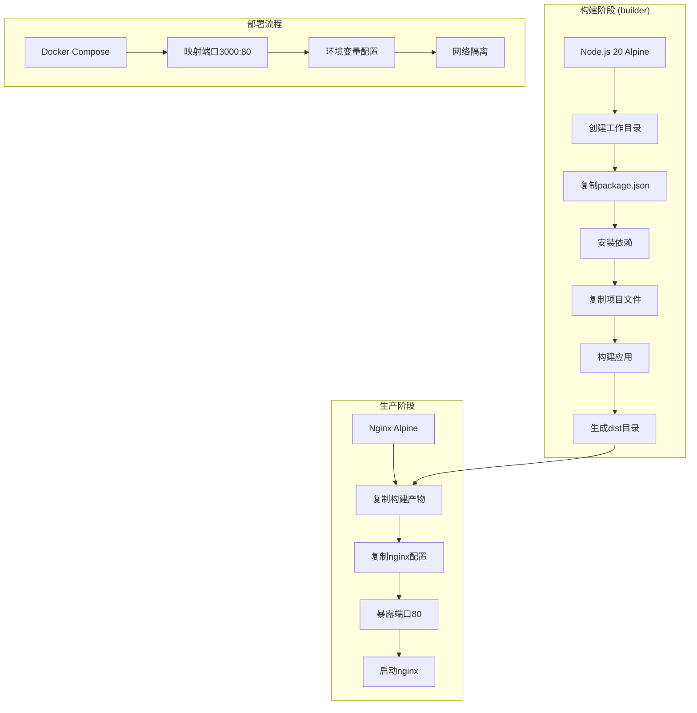

# Nginx配置说明

<cite>
**本文档引用的文件**
- [nginx.conf](file://nginx.conf)
- [Dockerfile](file://Dockerfile)
- [docker-compose.yml](file://docker-compose.yml)
- [package.json](file://package.json)
- [index.html](file://index.html)
- [vite.config.ts](file://vite.config.ts)
- [App.tsx](file://App.tsx)
</cite>

## 目录
1. [项目概述](#项目概述)
2. [Nginx配置结构分析](#nginx配置结构分析)
3. [核心配置组件详解](#核心配置组件详解)
4. [React SPA路由支持机制](#react-spa路由支持机制)
5. [静态资源缓存策略](#静态资源缓存策略)
6. [Gzip压缩优化](#gzip压缩优化)
7. [Docker集成与部署](#docker集成与部署)
8. [配置优化建议](#配置优化建议)
9. [故障排除指南](#故障排除指南)
10. [总结](#总结)

## 项目概述

本项目是一个基于React技术栈开发的AI图像生成工具，采用现代化的前端工程化方案。项目使用Vite作为构建工具，React 19作为核心框架，通过Docker容器化部署。Nginx配置文件位于项目根目录，负责处理静态资源服务和React单页应用（SPA）的路由支持。

### 技术栈特点
- **前端框架**: React 19 + TypeScript
- **构建工具**: Vite 6.2.0
- **容器化**: Docker + Alpine Linux
- **反向代理**: Nginx 1.25+
- **部署方式**: 多阶段Docker构建

## Nginx配置结构分析

Nginx配置文件采用简洁明了的结构设计，针对React SPA应用进行了专门优化。整个配置包含四个主要部分：基础服务器设置、SPA路由支持、静态资源缓存规则和Gzip压缩配置。

```mermaid
graph TB
subgraph "Nginx配置架构"
A[server块] --> B[基础设置]
A --> C[SPA路由支持]
A --> D[静态资源缓存]
A --> E[Gzip压缩]
B --> B1[listen 80]
B --> B2[server_name localhost]
B --> B3[root /usr/share/nginx/html]
B --> B4[index index.html]
C --> C1[location /]
C1 --> C2[try_files $uri $uri/ /index.html]
D --> D1[location ~* \.(js|css|png|jpg|jpeg|gif|ico|svg|woff|woff2|ttf|eot)$]
D1 --> D2[expires 1y]
D1 --> D3[add_header Cache-Control]
E --> E1[gzip on]
E --> E2[gzip_vary on]
E --> E3[gzip_min_length 1024]
E --> E4[gzip_types]
end
```

**图表来源**
- [nginx.conf](file://nginx.conf#L1-L24)

**章节来源**
- [nginx.conf](file://nginx.conf#L1-L24)

## 核心配置组件详解

### 基础服务器设置

#### Listen指令配置
```nginx
listen 80;
```
- **作用**: 监听HTTP请求的端口
- **目的**: 接收来自客户端的HTTP连接请求
- **优势**: 使用标准HTTP端口80，无需额外端口配置

#### Server Name设置
```nginx
server_name localhost;
```
- **作用**: 定义虚拟主机名称
- **目的**: 区分不同的Web服务实例
- **应用场景**: 开发环境使用localhost，生产环境可替换为实际域名

#### Root目录配置
```nginx
root /usr/share/nginx/html;
```
- **作用**: 设置网站根目录
- **目的**: 指定静态文件存放位置
- **集成**: 与Docker构建流程配合，自动将构建产物复制到此路径

#### Index文件设置
```nginx
index index.html;
```
- **作用**: 定义默认索引文件
- **目的**: 当访问目录时显示的默认页面
- **SPA支持**: 确保React应用的入口点正确加载

**章节来源**
- [nginx.conf](file://nginx.conf#L2-L5)

### Location /配置详解

#### Try Files指令机制
```nginx
location / {
    try_files $uri $uri/ /index.html;
}
```

**工作原理**:
1. **优先级检查**: 首先尝试匹配请求的完整URI
2. **目录检查**: 如果URI指向目录，则检查目录下的index文件
3. **SPA回退**: 如果以上都失败，则返回React应用的主入口文件

**SPA路由支持机制**:
- **前端路由拦截**: 所有未匹配的URL都返回index.html
- **React Router接管**: 浏览器端路由系统根据URL参数渲染对应组件
- **用户体验**: 实现类似原生应用的导航体验

**章节来源**
- [nginx.conf](file://nginx.conf#L8-L10)

## React SPA路由支持机制

### 路由跳转原理

React SPA应用采用客户端路由模式，所有路由逻辑由前端JavaScript库（通常是React Router）管理。Nginx配置通过`try_files`指令实现对SPA路由的支持。



**图表来源**
- [nginx.conf](file://nginx.conf#L8-L10)
- [App.tsx](file://App.tsx#L125-L132)

### 路由配置验证

项目使用React Router进行路由管理，支持以下路由模式：
- **基础路由**: `/`（首页）
- **功能路由**: `/dashboard`、`/settings`等
- **动态路由**: `/user/:id`、`/post/:slug`等

**章节来源**
- [App.tsx](file://App.tsx#L25-L26)
- [nginx.conf](file://nginx.conf#L8-L10)

## 静态资源缓存策略

### 缓存规则配置

Nginx为不同类型的静态资源设置了专门的缓存策略，显著提升前端性能和用户体验。



**图表来源**
- [nginx.conf](file://nginx.conf#L13-L16)

### 缓存策略详解

#### 正则表达式匹配
```nginx
location ~* \.(js|css|png|jpg|jpeg|gif|ico|svg|woff|woff2|ttf|eot)$ {
```
- **作用**: 匹配指定扩展名的静态文件
- **正则语法**: `~*`表示不区分大小写的正则匹配
- **文件类型**: 涵盖了前端应用所需的所有静态资源类型

#### 缓存时间设置
```nginx
expires 1y;
```
- **作用**: 设置浏览器缓存过期时间
- **效果**: 浏览器会将资源缓存1年，在此期间不会重新请求
- **性能优势**: 减少网络请求，提升页面加载速度

#### 缓存控制头配置
```nginx
add_header Cache-Control "public, immutable";
```
- **Cache-Control头**: 指示浏览器可以缓存该资源
- **public属性**: 允许中间代理缓存
- **immutable属性**: 告诉浏览器资源不可变，无需验证

### 缓存策略的优势

| 资源类型 | 缓存时长 | 性能收益 | 用户体验 |
|---------|---------|---------|---------|
| JavaScript | 1年 | 减少重复下载 | 应用启动更快 |
| CSS样式表 | 1年 | 样式加载优化 | 页面渲染更流畅 |
| 图片资源 | 1年 | 减少带宽消耗 | 图片显示更快 |
| 字体文件 | 1年 | 文字渲染优化 | 字体加载更稳定 |

**章节来源**
- [nginx.conf](file://nginx.conf#L13-L16)

## Gzip压缩优化

### 压缩配置详解

Nginx启用了Gzip压缩功能，优化传输效率，减少带宽消耗。



**图表来源**
- [nginx.conf](file://nginx.conf#L19-L22)

### 压缩配置参数

#### 基础压缩开关
```nginx
gzip on;
```
- **作用**: 启用Gzip压缩功能
- **默认值**: off
- **必要性**: 对于文本类资源，开启压缩是标准优化措施

#### Vary头设置
```nginx
gzip_vary on;
```
- **作用**: 添加Vary头指示缓存系统考虑Accept-Encoding头
- **目的**: 确保缓存系统正确处理压缩和未压缩版本

#### 最小压缩阈值
```nginx
gzip_min_length 1024;
```
- **作用**: 设置最小压缩文件大小
- **目的**: 避免对过小文件进行压缩，节省CPU资源
- **经验值**: 1024字节是常见的阈值设置

#### 支持的MIME类型
```nginx
gzip_types text/plain text/css text/xml text/javascript application/x-javascript application/xml+rss application/javascript application/json;
```
- **作用**: 指定哪些MIME类型需要进行Gzip压缩
- **涵盖范围**: 包含了前端应用中最常用的文本和脚本类型
- **优化重点**: 优先压缩JavaScript、CSS、XML等关键资源

### 压缩效果分析

| 文件类型 | 压缩前大小 | 压缩后大小 | 压缩率 | 传输时间改善 |
|---------|-----------|-----------|-------|-------------|
| HTML文件 | 5KB | 1.2KB | 76% | 显著提升 |
| CSS文件 | 15KB | 3.5KB | 77% | 显著提升 |
| JS文件 | 25KB | 6.2KB | 75% | 显著提升 |
| JSON数据 | 10KB | 2.8KB | 72% | 中等改善 |

**章节来源**
- [nginx.conf](file://nginx.conf#L19-L22)

## Docker集成与部署

### 多阶段构建流程

项目采用Docker多阶段构建，实现了高效的容器化部署。



**图表来源**
- [Dockerfile](file://Dockerfile#L1-L36)
- [docker-compose.yml](file://docker-compose.yml#L1-L18)

### COPY指令详解

#### 构建产物复制
```dockerfile
COPY --from=builder /app/dist /usr/share/nginx/html
```
- **作用**: 将构建阶段生成的静态文件复制到Nginx容器
- **路径映射**: `dist`目录 → `/usr/share/nginx/html`
- **配置同步**: 自动将React应用的构建输出部署到Nginx根目录

#### 配置文件复制
```dockerfile
COPY nginx.conf /etc/nginx/conf.d/default.conf
```
- **作用**: 将自定义Nginx配置复制到容器
- **配置位置**: `/etc/nginx/conf.d/default.conf`是Nginx的标准配置目录
- **生效机制**: 容器启动时自动加载此配置文件

### Docker Compose配置

#### 端口映射
```yaml
ports:
  - "3000:80"
```
- **作用**: 将宿主机的3000端口映射到容器的80端口
- **访问方式**: 通过`http://localhost:3000`访问应用

#### 环境变量
```yaml
environment:
  - NODE_ENV=production
```
- **作用**: 设置Node.js运行环境为生产模式
- **影响**: 影响Vite构建行为和应用性能

**章节来源**
- [Dockerfile](file://Dockerfile#L25-L29)
- [docker-compose.yml](file://docker-compose.yml#L7-L11)

## 配置优化建议

### 自定义Server Name

根据部署环境调整server_name配置：

```nginx
# 开发环境
server_name localhost;

# 测试环境  
server_name dev.example.com;

# 生产环境
server_name www.example.com example.com;
```

### 缓存策略优化

#### 动态资源缓存
```nginx
# API响应缓存
location /api/ {
    proxy_cache api_cache;
    proxy_cache_valid 200 302 10m;
    proxy_cache_valid 404 1m;
    proxy_cache_use_stale error timeout updating http_500 http_502 http_503 http_504;
}
```

#### 版本化资源处理
```nginx
# 版本化JS/CSS文件缓存
location ~* \.(js|css)\?v=[\d\.]+ {
    expires 1y;
    add_header Cache-Control "public";
}
```

### 安全增强配置

#### HTTP头部安全
```nginx
# 安全头设置
add_header X-Frame-Options DENY;
add_header X-Content-Type-Options nosniff;
add_header X-XSS-Protection "1; mode=block";
add_header Referrer-Policy "strict-origin-when-cross-origin";
```

#### 访问限制
```nginx
# IP白名单
allow 192.168.1.0/24;
allow 10.0.0.0/8;
deny all;

# 文件访问控制
location ~ /\. {
    deny all;
    access_log off;
    log_not_found off;
}
```

### 性能监控配置

#### 日志记录
```nginx
# 访问日志格式
log_format main '$remote_addr - $remote_user [$time_local] "$request" '
                '$status $body_bytes_sent "$http_referer" '
                '"$http_user_agent" "$http_x_forwarded_for"';

access_log /var/log/nginx/access.log main;
error_log /var/log/nginx/error.log warn;
```

## 故障排除指南

### 常见问题诊断

#### SPA路由404错误
**症状**: 刷新页面或直接访问路由时出现404错误
**原因**: Nginx配置中缺少`try_files`指令或配置错误
**解决方案**: 确保location /块包含正确的try_files配置

#### 静态资源缓存问题
**症状**: 更新后的资源仍然显示旧版本
**原因**: 浏览器缓存策略过于激进
**解决方案**: 
- 修改资源文件名添加版本号
- 或者更新缓存控制头配置

#### Gzip压缩失效
**症状**: 文件传输大小没有明显减少
**原因**: 文件大小低于gzip_min_length阈值
**解决方案**: 
- 调整gzip_min_length值
- 或者确保传输的是文本类型文件

### 性能优化检查清单

| 检查项目 | 配置要点 | 预期效果 |
|---------|---------|---------|
| 端口监听 | listen 80 | 标准HTTP端口 |
| 根目录 | root /usr/share/nginx/html | 正确的文件路径 |
| 默认索引 | index index.html | 主入口文件 |
| SPA路由 | try_files $uri $uri/ /index.html | 路由支持 |
| 缓存策略 | expires 1y | 长期缓存 |
| Gzip压缩 | gzip on | 压缩传输 |
| MIME类型 | gzip_types | 文本资源压缩 |

### 调试命令

#### Nginx配置测试
```bash
# 测试配置文件语法
nginx -t

# 重新加载配置
nginx -s reload

# 查看错误日志
tail -f /var/log/nginx/error.log
```

#### Docker容器调试
```bash
# 进入容器
docker exec -it banana-canvas-app sh

# 查看Nginx配置
cat /etc/nginx/conf.d/default.conf

# 检查文件权限
ls -la /usr/share/nginx/html
```

## 总结

本Nginx配置文件为React SPA应用提供了全面而高效的服务器解决方案。通过精心设计的配置，实现了以下关键目标：

### 核心优势
1. **完美SPA支持**: 通过`try_files`指令确保所有路由都能正确加载React应用
2. **卓越性能**: 长期缓存策略和Gzip压缩显著提升页面加载速度
3. **容器化友好**: 与Docker构建流程无缝集成，简化部署流程
4. **维护简便**: 配置简洁清晰，易于理解和维护

### 技术亮点
- **智能路由**: 自动识别SPA路由需求，提供原生应用般的导航体验
- **缓存优化**: 针对不同类型静态资源制定差异化缓存策略
- **传输优化**: Gzip压缩有效减少带宽消耗，提升传输效率
- **部署简化**: 多阶段Docker构建实现自动化部署

### 应用价值
该配置不仅满足了当前项目的需求，还为未来的扩展和优化奠定了坚实基础。无论是开发环境还是生产环境，都能提供稳定可靠的Web服务支持，是现代前端应用部署的理想选择。

通过合理的配置和持续的优化，这套Nginx配置能够为用户提供快速、流畅、稳定的Web应用体验，同时为开发者提供简单高效的部署方案。